# API Reference

<cite>
**Referenced Files in This Document**
- [Logger.h](file://include/quill/Logger.h)
- [Frontend.h](file://include/quill/Frontend.h)
- [Backend.h](file://include/quill/Backend.h)
- [FrontendOptions.h](file://include/quill/core/FrontendOptions.h)
- [BackendOptions.h](file://include/quill/backend/BackendOptions.h)
- [PatternFormatterOptions.h](file://include/quill/core/PatternFormatterOptions.h)
- [LoggerBase.h](file://include/quill/core/LoggerBase.h)
- [Common.h](file://include/quill/core/Common.h)
- [LogLevel.h](file://include/quill/core/LogLevel.h)
- [Attributes.h](file://include/quill/core/Attributes.h)
- [Utility.h](file://include/quill/Utility.h)
- [LogFunctions.h](file://include/quill/LogFunctions.h)
- [Sink.h](file://include/quill/sinks/Sink.h)
- [ThreadContextManager.h](file://include/quill/core/ThreadContextManager.h)
- [QuillError.h](file://include/quill/core/QuillError.h)
</cite>

## Table of Contents
1. [Introduction](#introduction)
2. [Project Structure](#project-structure)
3. [Core Components](#core-components)
4. [Architecture Overview](#architecture-overview)
5. [Detailed Component Analysis](#detailed-component-analysis)
6. [Dependency Analysis](#dependency-analysis)
7. [Performance Considerations](#performance-considerations)
8. [Troubleshooting Guide](#troubleshooting-guide)
9. [Conclusion](#conclusion)
10. [Appendices](#appendices)

## Introduction
This document provides a comprehensive API reference for Quill’s public interfaces and classes. It covers:
- Logger class and its methods, properties, and usage patterns
- Backend class API including startup/shutdown, configuration, and thread management
- Frontend class API for logger and sink creation/manipulation
- Configuration structures: FrontendOptions, BackendOptions, PatternFormatterOptions
- Utility functions, helper classes, and type aliases
- Thread-safety guarantees, lifetime management, and resource cleanup
- Examples and integration patterns
- API versioning, backward compatibility, and migration guidance

## Project Structure
Quill exposes a layered API:
- Public headers under include/quill
- Core configuration and types under include/quill/core
- Backend configuration and utilities under include/quill/backend
- Sink abstractions under include/quill/sinks
- Utilities and helpers under include/quill

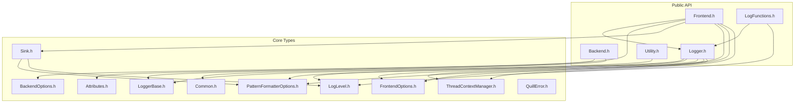

**Diagram sources**
- [Frontend.h:32-370](file://include/quill/Frontend.h#L32-L370)
- [Backend.h:29-244](file://include/quill/Backend.h#L29-L244)
- [Logger.h:47-507](file://include/quill/Logger.h#L47-L507)
- [LogFunctions.h:19-345](file://include/quill/LogFunctions.h#L19-L345)
- [Utility.h:16-121](file://include/quill/Utility.h#L16-L121)
- [FrontendOptions.h:16-51](file://include/quill/core/FrontendOptions.h#L16-L51)
- [BackendOptions.h:30-281](file://include/quill/backend/BackendOptions.h#L30-L281)
- [PatternFormatterOptions.h:23-168](file://include/quill/core/PatternFormatterOptions.h#L23-L168)
- [LoggerBase.h:35-207](file://include/quill/core/LoggerBase.h#L35-L207)
- [Common.h:145-180](file://include/quill/core/Common.h#L145-L180)
- [LogLevel.h:22-35](file://include/quill/core/LogLevel.h#L22-L35)
- [Attributes.h:9-18](file://include/quill/core/Attributes.h#L9-L18)
- [ThreadContextManager.h:53-214](file://include/quill/core/ThreadContextManager.h#L53-L214)
- [Sink.h:40-217](file://include/quill/sinks/Sink.h#L40-L217)
- [QuillError.h:45-55](file://include/quill/core/QuillError.h#L45-L55)

**Section sources**
- [Frontend.h:32-370](file://include/quill/Frontend.h#L32-L370)
- [Backend.h:29-244](file://include/quill/Backend.h#L29-L244)
- [Logger.h:47-507](file://include/quill/Logger.h#L47-L507)
- [LogFunctions.h:19-345](file://include/quill/LogFunctions.h#L19-L345)
- [Utility.h:16-121](file://include/quill/Utility.h#L16-L121)
- [FrontendOptions.h:16-51](file://include/quill/core/FrontendOptions.h#L16-L51)
- [BackendOptions.h:30-281](file://include/quill/backend/BackendOptions.h#L30-L281)
- [PatternFormatterOptions.h:23-168](file://include/quill/core/PatternFormatterOptions.h#L23-L168)
- [LoggerBase.h:35-207](file://include/quill/core/LoggerBase.h#L35-L207)
- [Common.h:145-180](file://include/quill/core/Common.h#L145-L180)
- [LogLevel.h:22-35](file://include/quill/core/LogLevel.h#L22-L35)
- [Attributes.h:9-18](file://include/quill/core/Attributes.h#L9-L18)
- [ThreadContextManager.h:53-214](file://include/quill/core/ThreadContextManager.h#L53-L214)
- [Sink.h:40-217](file://include/quill/sinks/Sink.h#L40-L217)
- [QuillError.h:45-55](file://include/quill/core/QuillError.h#L45-L55)

## Core Components
- Logger: Thread-safe logging interface templated over FrontendOptions. Provides fast-path logging, backtrace support, and flush semantics.
- Frontend: Static facade for logger and sink lifecycle management, thread-local queue controls, and logger discovery.
- Backend: Singleton-like static controller for backend thread lifecycle, notification, and thread identity.
- Configuration structures: FrontendOptions, BackendOptions, PatternFormatterOptions.
- Utilities: Hex conversion helper and macro-free logging helpers.

Key public types and aliases:
- Logger alias for LoggerImpl<FrontendOptions>
- Frontend alias for FrontendImpl<FrontendOptions>
- LogLevel enum
- QueueType, Timezone, ClockSourceType, HugePagesPolicy enums
- QuillError exception type

**Section sources**
- [Logger.h:47-507](file://include/quill/Logger.h#L47-L507)
- [Frontend.h:32-370](file://include/quill/Frontend.h#L32-L370)
- [Backend.h:29-244](file://include/quill/Backend.h#L29-L244)
- [PatternFormatterOptions.h:23-168](file://include/quill/core/PatternFormatterOptions.h#L23-L168)
- [FrontendOptions.h:16-51](file://include/quill/core/FrontendOptions.h#L16-L51)
- [BackendOptions.h:30-281](file://include/quill/backend/BackendOptions.h#L30-L281)
- [LogLevel.h:22-35](file://include/quill/core/LogLevel.h#L22-L35)
- [Common.h:145-180](file://include/quill/core/Common.h#L145-L180)
- [Utility.h:18-121](file://include/quill/Utility.h#L18-L121)
- [LogFunctions.h:53-345](file://include/quill/LogFunctions.h#L53-L345)
- [QuillError.h:45-55](file://include/quill/core/QuillError.h#L45-L55)

## Architecture Overview
High-level runtime architecture:
- Frontend threads enqueue log records into per-thread SPSC queues.
- Backend thread drains queues, orders messages, applies filters/formatters, and writes to sinks.
- ThreadContextManager tracks per-thread contexts and invalidation for graceful teardown.
- SignalHandler integrates with Backend when enabled.

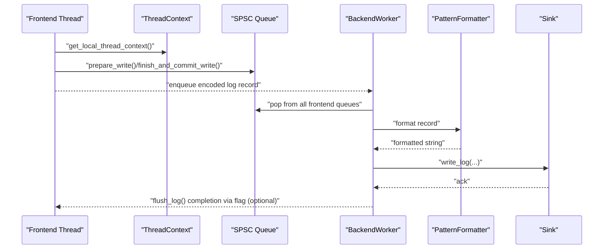

**Diagram sources**
- [ThreadContextManager.h:53-214](file://include/quill/core/ThreadContextManager.h#L53-L214)
- [Logger.h:408-475](file://include/quill/Logger.h#L408-L475)
- [LoggerBase.h:35-207](file://include/quill/core/LoggerBase.h#L35-L207)
- [Sink.h:123-141](file://include/quill/sinks/Sink.h#L123-L141)

**Section sources**
- [ThreadContextManager.h:53-214](file://include/quill/core/ThreadContextManager.h#L53-L214)
- [Logger.h:408-475](file://include/quill/Logger.h#L408-L475)
- [LoggerBase.h:35-207](file://include/quill/core/LoggerBase.h#L35-L207)
- [Sink.h:123-141](file://include/quill/sinks/Sink.h#L123-L141)

## Detailed Component Analysis

### Logger API
Public interface summary:
- Methods:
  - log_statement<enable_immediate_flush>(MacroMetadata const*, args...)
  - log_statement_runtime_metadata<enable_immediate_flush>(MacroMetadata const*, fmt, file_path, function_name, tags, line_number, log_level, args...)
  - init_backtrace(max_capacity, flush_level)
  - flush_backtrace()
  - flush_log(sleep_duration_ns)
  - get_logger_name(), get_user_clock_source(), get_clock_source_type(), get_pattern_formatter_options(), get_sinks()
  - set_log_level(level), get_log_level()
  - set_immediate_flush(flush_every_n_messages)
  - should_log_statement<level>(), should_log_statement(level)
  - mark_invalid(), is_valid_logger()

- Properties:
  - Template parameter TFrontendOptions (via LoggerImpl<FrontendOptions>)
  - FrontendOptions-driven queue behavior (Unbounded/Blocking/Dropping, capacities, huge pages)
  - Clock source selection (TSC/System/User)
  - PatternFormatterOptions for formatting

- Thread-safety and lifetime:
  - Log methods are thread-safe.
  - Logger marks invalid on removal; should_log_statement guards against invalid usage.
  - Immediate flush threshold triggers flush_log() automatically when enabled.

- Usage patterns:
  - Fast-path logging via log_statement with compile-time metadata.
  - Runtime metadata logging via log_statement_runtime_metadata.
  - Backpressure-aware queue behavior depending on FrontendOptions.
  - Controlled flush via flush_log() with tunable sleep intervals.

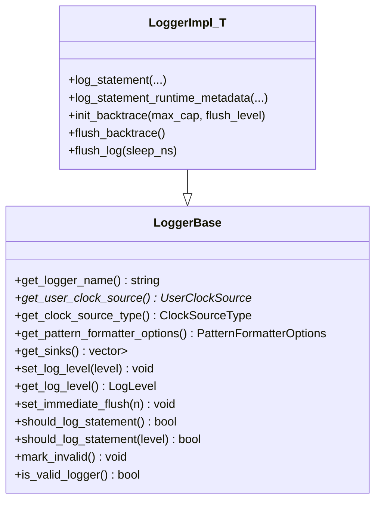

**Diagram sources**
- [LoggerBase.h:35-207](file://include/quill/core/LoggerBase.h#L35-L207)
- [Logger.h:47-507](file://include/quill/Logger.h#L47-L507)

**Section sources**
- [Logger.h:64-352](file://include/quill/Logger.h#L64-L352)
- [LoggerBase.h:67-184](file://include/quill/core/LoggerBase.h#L67-L184)
- [FrontendOptions.h:16-51](file://include/quill/core/FrontendOptions.h#L16-L51)

### Frontend API
Public interface summary:
- Static methods:
  - preallocate(): pre-allocate thread-local queue capacity
  - shrink_thread_local_queue(capacity): shrink unbounded queue for current thread
  - get_thread_local_queue_capacity(): inspect current capacity
  - create_or_get_sink(name, args...): create or retrieve named sink
  - get_sink(name): retrieve sink by name
  - create_or_get_logger(name, sink|sinks, pattern_options, clock, user_clock): create or retrieve logger
  - get_logger(name): retrieve logger by name
  - get_all_loggers(): list all registered loggers
  - get_valid_logger(): get first valid logger
  - get_number_of_loggers(): count including invalid
  - remove_logger(logger): asynchronous removal
  - remove_logger_blocking(logger, sleep_duration_ns): synchronous removal with completion flag

- Thread-safety and lifetime:
  - remove_logger() is thread-safe but should be invoked by a single thread per logger.
  - remove_logger_blocking() blocks until backend completes removal.

- Usage patterns:
  - Create sinks once and reuse via names.
  - Create or reuse loggers with shared sinks.
  - Monitor queue capacity for unbounded queues.

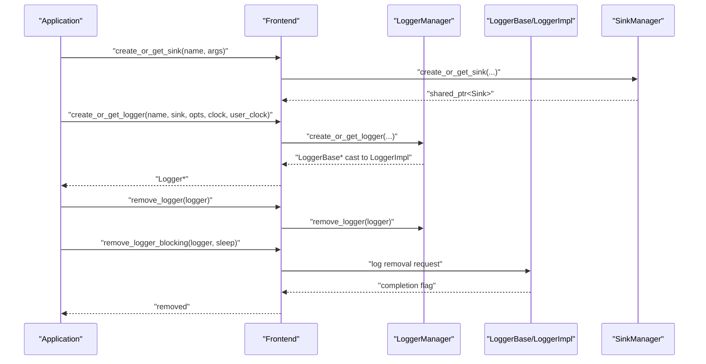

**Diagram sources**
- [Frontend.h:113-289](file://include/quill/Frontend.h#L113-L289)
- [LoggerBase.h:35-207](file://include/quill/core/LoggerBase.h#L35-L207)

**Section sources**
- [Frontend.h:45-344](file://include/quill/Frontend.h#L45-L344)
- [LoggerBase.h:104-113](file://include/quill/core/LoggerBase.h#L104-L113)

### Backend API
Public interface summary:
- Static methods:
  - start(options=BackendOptions{}): start backend thread once
  - start(options, signal_handler_options): start with built-in signal handler
  - stop(): stop backend thread and deinitialize signal handler
  - notify(): wake backend thread
  - is_running(): check backend status
  - get_thread_id(): backend thread id
  - convert_rdtsc_to_epoch_time(rdtsc): convert TSC to epoch
  - acquire_manual_backend_worker(): acquire ManualBackendWorker for custom scheduling

- Thread management:
  - Backend::start() uses a once-flag to ensure single backend thread.
  - std::atexit registers Backend::stop() on first start.
  - SignalHandler integration on Linux/MacOS requires preallocated thread-local contexts.

- Usage patterns:
  - Call Backend::start() early; Backend::stop() is automatic on exit.
  - Use notify() to wake backend when using long sleep durations.
  - Use convert_rdtsc_to_epoch_time() to synchronize TSC logs with backend time.

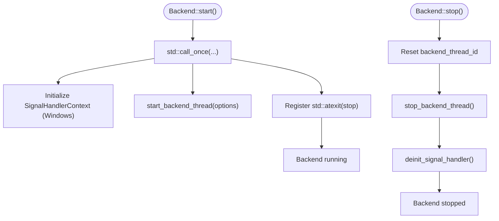

**Diagram sources**
- [Backend.h:36-143](file://include/quill/Backend.h#L36-L143)

**Section sources**
- [Backend.h:36-186](file://include/quill/Backend.h#L36-L186)

### Configuration Structures

#### FrontendOptions
Defines frontend thread queue behavior and memory policy:
- queue_type: UnboundedBlocking, UnboundedDropping, BoundedBlocking, BoundedDropping
- initial_queue_capacity: Starting capacity in bytes
- blocking_queue_retry_interval_ns: Retry interval for blocking queues
- unbounded_queue_max_capacity: Max capacity for unbounded queues
- huge_pages_policy: Never, Always, Try

Effects:
- Controls per-thread SPSC queue allocation and growth strategy.
- Impacts latency and memory footprint under bursty loads.

**Section sources**
- [FrontendOptions.h:16-51](file://include/quill/core/FrontendOptions.h#L16-L51)
- [Common.h:145-180](file://include/quill/core/Common.h#L145-L180)

#### BackendOptions
Defines backend thread behavior and policies:
- thread_name: Backend thread name
- enable_yield_when_idle: Yield when idle and sleep_duration is 0
- sleep_duration: Backend sleep when no work
- transit_event_buffer_initial_capacity: Per-thread transit buffer initial capacity
- transit_events_soft_limit: Soft limit across all frontend threads
- transit_events_hard_limit: Hard limit per frontend thread
- log_timestamp_ordering_grace_period: Grace period to enforce ordering
- wait_for_queues_to_empty_before_exit: Drain queues on termination
- cpu_affinity: CPU pinning
- error_notifier: Callback for backend errors
- backend_worker_on_poll_begin/end: Hooks for instrumentation
- rdtsc_resync_interval: RDTSC resync interval
- sink_min_flush_interval: Minimum sink flush interval
- check_printable_char: Printable character filter predicate
- log_level_descriptions/log_level_short_codes: Level descriptors
- check_backend_singleton_instance: Singleton instance guard

Effects:
- Controls throughput, ordering, and resource usage of the backend.
- Provides hooks and callbacks for observability and diagnostics.

**Section sources**
- [BackendOptions.h:30-281](file://include/quill/backend/BackendOptions.h#L30-L281)

#### PatternFormatterOptions
Defines log message formatting:
- format_pattern: Main format string with placeholders
- timestamp_pattern: strftime-like with %Q extensions
- timestamp_timezone: LocalTime or GmtTime
- add_metadata_to_multi_line_logs: Repeat metadata on each line
- source_location_path_strip_prefix: Strip path prefix from source locations
- process_function_name: Custom function name processor
- source_location_remove_relative_paths: Normalize relative paths
- pattern_suffix: Append character or NO_SUFFIX
- operator==, operator!=: Equality comparison

Supported placeholders:
- %(time), %(file_name), %(full_path), %(caller_function), %(log_level), %(log_level_short_code), %(line_number), %(logger), %(message), %(thread_id), %(thread_name), %(process_id), %(source_location), %(short_source_location), %(tags), %(named_args)

Effects:
- Controls textual output format and metadata inclusion.

**Section sources**
- [PatternFormatterOptions.h:23-168](file://include/quill/core/PatternFormatterOptions.h#L23-L168)

### Utility Functions and Helpers

#### Hex Conversion Utility
- to_hex(buffer, size, uppercase=true, space_delim=true): Convert buffer to hex string
- Preconditions: buffer must be byte-sized elements

Usage:
- Useful for binary data logging and diagnostics.

**Section sources**
- [Utility.h:31-118](file://include/quill/Utility.h#L31-L118)

#### Macro-Free Logging Helpers
- Tags: Compose multiple tags for log messages
- Helper classes: tracel3, tracel2, tracel1, debug, info, notice, warning, error, critical, backtrace
- log(logger, tags, level, fmt, location, args...): Macro-free logging entrypoint

Behavior:
- Always-evaluated arguments
- Runtime metadata copying
- Lower performance than macros

**Section sources**
- [LogFunctions.h:53-345](file://include/quill/LogFunctions.h#L53-L345)

### Type Aliases and Enums
- Logger: LoggerImpl<FrontendOptions>
- Frontend: FrontendImpl<FrontendOptions>
- LogLevel: TraceL3, TraceL2, TraceL1, Debug, Info, Notice, Warning, Error, Critical, Backtrace, None
- QueueType: UnboundedBlocking, UnboundedDropping, BoundedBlocking, BoundedDropping
- Timezone: LocalTime, GmtTime
- ClockSourceType: Tsc, System, User
- HugePagesPolicy: Never, Always, Try

**Section sources**
- [Logger.h:506-507](file://include/quill/Logger.h#L506-L507)
- [Frontend.h:370-370](file://include/quill/Frontend.h#L370-L370)
- [LogLevel.h:22-35](file://include/quill/core/LogLevel.h#L22-L35)
- [Common.h:145-180](file://include/quill/core/Common.h#L145-L180)
- [Attributes.h:9-18](file://include/quill/core/Attributes.h#L9-L18)

## Architecture Overview

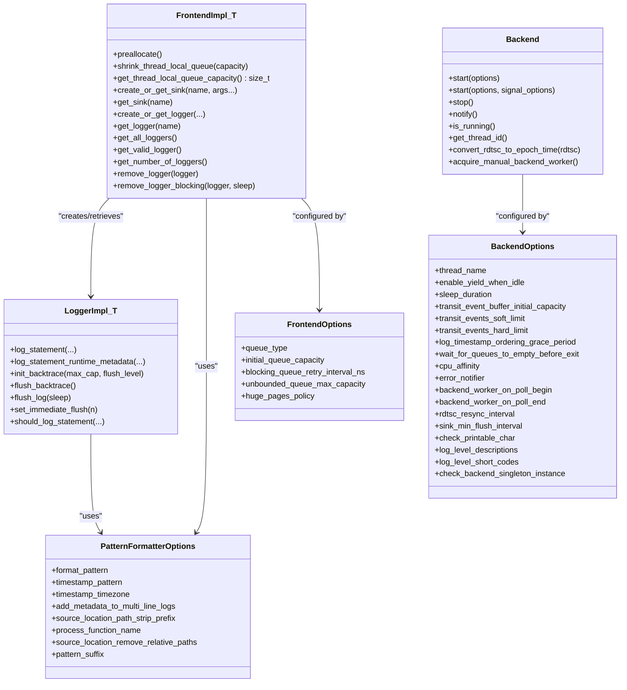

**Diagram sources**
- [Frontend.h:32-370](file://include/quill/Frontend.h#L32-L370)
- [Backend.h:29-244](file://include/quill/Backend.h#L29-L244)
- [Logger.h:47-507](file://include/quill/Logger.h#L47-L507)
- [PatternFormatterOptions.h:23-168](file://include/quill/core/PatternFormatterOptions.h#L23-L168)
- [FrontendOptions.h:16-51](file://include/quill/core/FrontendOptions.h#L16-L51)
- [BackendOptions.h:30-281](file://include/quill/backend/BackendOptions.h#L30-L281)

## Detailed Component Analysis

### Logger Implementation Details
- Fast-path encoding:
  - Header includes timestamp, MacroMetadata*, LoggerBase*, and decoder pointer.
  - Conditional argument size caching reduces overhead.
- Queue management:
  - Bounded vs Unbounded queues with Blocking/Dropping policies.
  - Failure counters for dropping queues.
- Backpressure and flush:
  - Immediate flush threshold triggers flush_log() automatically.
  - flush_log() uses a completion flag to coordinate with backend.

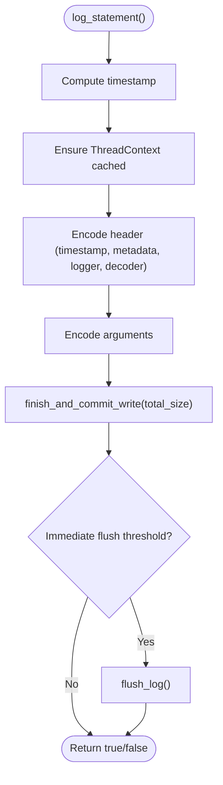

**Diagram sources**
- [Logger.h:75-136](file://include/quill/Logger.h#L75-L136)
- [Logger.h:457-475](file://include/quill/Logger.h#L457-L475)

**Section sources**
- [Logger.h:75-136](file://include/quill/Logger.h#L75-L136)
- [Logger.h:408-475](file://include/quill/Logger.h#L408-L475)

### Frontend Lifecycle Management
- Sink creation:
  - create_or_get_sink(name, args...) delegates to SinkManager.
- Logger creation:
  - Overloads accept single sink, vector, or initializer list.
  - Copies options from an existing logger when requested.
- Removal:
  - remove_logger() enqueues removal request; backend cleans up.
  - remove_logger_blocking() waits for completion via flag.

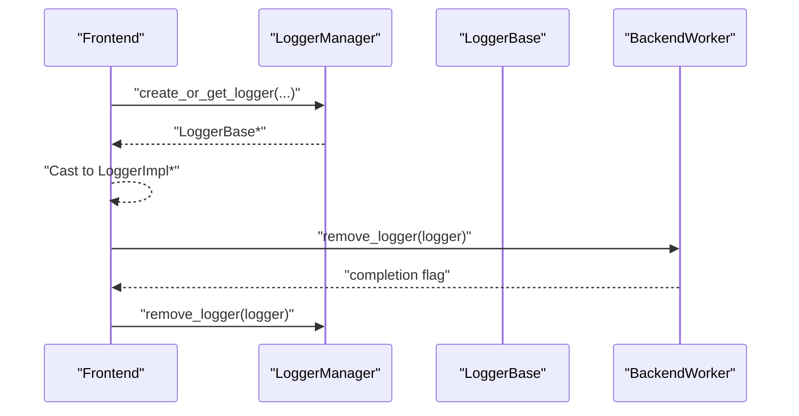

**Diagram sources**
- [Frontend.h:137-289](file://include/quill/Frontend.h#L137-L289)
- [LoggerBase.h:104-113](file://include/quill/core/LoggerBase.h#L104-L113)

**Section sources**
- [Frontend.h:137-289](file://include/quill/Frontend.h#L137-L289)

### Backend Startup and Shutdown
- Startup:
  - Ensures single backend thread via once-flag.
  - Initializes SignalHandlerContext on Windows; sets up signal handler on Unix.
  - Registers std::atexit(stop).
- Shutdown:
  - Resets backend thread id, stops backend thread, deinitializes signal handler.

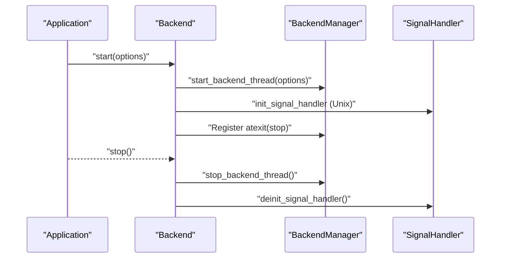

**Diagram sources**
- [Backend.h:36-143](file://include/quill/Backend.h#L36-L143)

**Section sources**
- [Backend.h:36-143](file://include/quill/Backend.h#L36-L143)

### Sink Abstractions
- Base class responsibilities:
  - Log level filtering
  - Adding/removing filters (thread-safe)
  - Applying filters to records
  - Writing formatted logs and flushing
- Derived sinks:
  - Console, File, JSON, Rotating variants, etc. (headers under include/quill/sinks/)

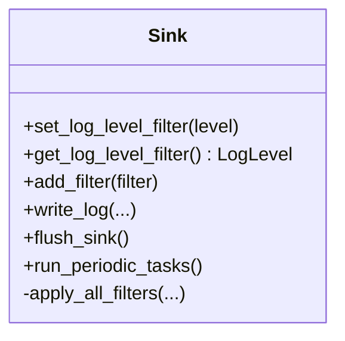

**Diagram sources**
- [Sink.h:40-217](file://include/quill/sinks/Sink.h#L40-L217)

**Section sources**
- [Sink.h:65-197](file://include/quill/sinks/Sink.h#L65-L197)

## Dependency Analysis

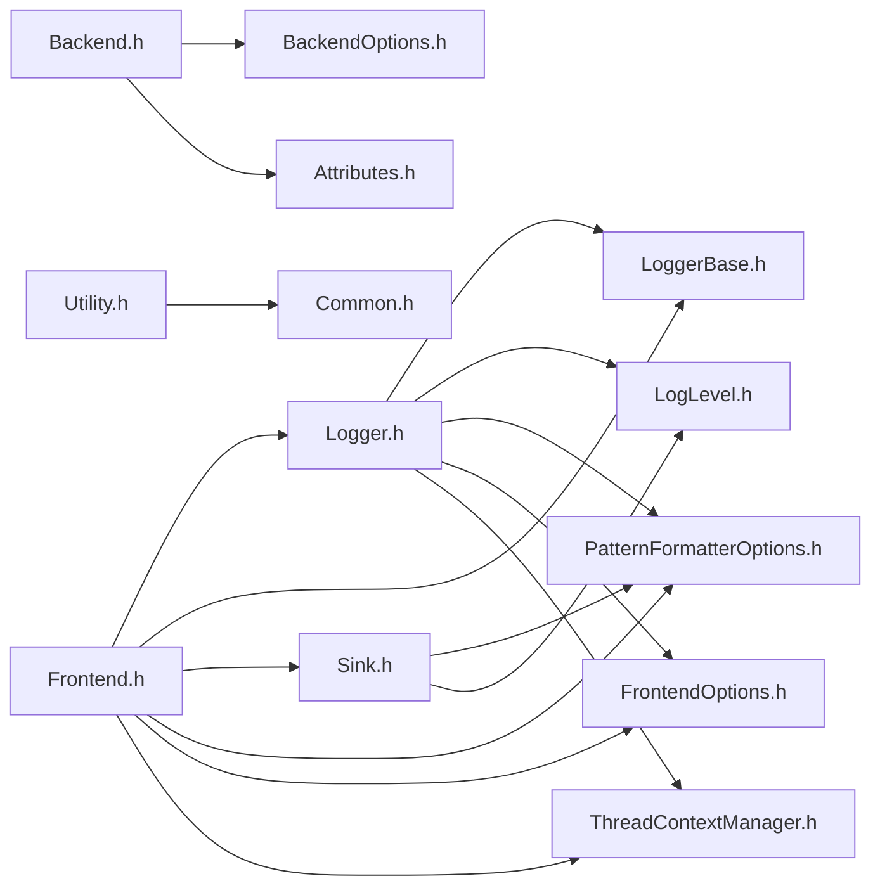

**Diagram sources**
- [Frontend.h:32-370](file://include/quill/Frontend.h#L32-L370)
- [Logger.h:47-507](file://include/quill/Logger.h#L47-L507)
- [LoggerBase.h:35-207](file://include/quill/core/LoggerBase.h#L35-L207)
- [Sink.h:40-217](file://include/quill/sinks/Sink.h#L40-L217)
- [PatternFormatterOptions.h:23-168](file://include/quill/core/PatternFormatterOptions.h#L23-L168)
- [FrontendOptions.h:16-51](file://include/quill/core/FrontendOptions.h#L16-L51)
- [ThreadContextManager.h:53-214](file://include/quill/core/ThreadContextManager.h#L53-L214)
- [Backend.h:29-244](file://include/quill/Backend.h#L29-L244)
- [BackendOptions.h:30-281](file://include/quill/backend/BackendOptions.h#L30-L281)
- [Attributes.h:9-18](file://include/quill/core/Attributes.h#L9-L18)
- [Utility.h:16-121](file://include/quill/Utility.h#L16-L121)
- [Common.h:145-180](file://include/quill/core/Common.h#L145-L180)
- [LogLevel.h:22-35](file://include/quill/core/LogLevel.h#L22-L35)

**Section sources**
- [Frontend.h:32-370](file://include/quill/Frontend.h#L32-L370)
- [Logger.h:47-507](file://include/quill/Logger.h#L47-L507)
- [LoggerBase.h:35-207](file://include/quill/core/LoggerBase.h#L35-L207)
- [Sink.h:40-217](file://include/quill/sinks/Sink.h#L40-L217)
- [PatternFormatterOptions.h:23-168](file://include/quill/core/PatternFormatterOptions.h#L23-L168)
- [FrontendOptions.h:16-51](file://include/quill/core/FrontendOptions.h#L16-L51)
- [ThreadContextManager.h:53-214](file://include/quill/core/ThreadContextManager.h#L53-L214)
- [Backend.h:29-244](file://include/quill/Backend.h#L29-L244)
- [BackendOptions.h:30-281](file://include/quill/backend/BackendOptions.h#L30-L281)
- [Attributes.h:9-18](file://include/quill/core/Attributes.h#L9-L18)
- [Utility.h:16-121](file://include/quill/Utility.h#L16-L121)
- [Common.h:145-180](file://include/quill/core/Common.h#L145-L180)
- [LogLevel.h:22-35](file://include/quill/core/LogLevel.h#L22-L35)

## Performance Considerations
- FrontendOptions:
  - Unbounded queues can grow to unbounded_queue_max_capacity before blocking/dropping.
  - Bounded queues avoid reallocation but may drop messages under overload.
  - huge_pages_policy can reduce TLB misses on Linux.
- BackendOptions:
  - transit_events_* limits control buffering and backpressure.
  - log_timestamp_ordering_grace_period trades off ordering correctness for throughput.
  - sink_min_flush_interval balances I/O pressure and latency.
- Logger:
  - Immediate flush threshold can degrade performance; use sparingly.
  - log_statement is optimized for fundamental types; avoid expensive argument evaluation.

[No sources needed since this section provides general guidance]

## Troubleshooting Guide
- Exceptions:
  - QuillError is thrown on invalid operations; can be disabled with QUILL_NO_EXCEPTIONS.
- Signal handler:
  - On Unix, ensure threads have logged or called Frontend::preallocate() before using built-in signal handler.
- Logger removal:
  - remove_logger() is asynchronous; use remove_logger_blocking() to wait for completion.
- Backend singleton:
  - check_backend_singleton_instance prevents multiple backend instances in mixed static/shared linking scenarios.

**Section sources**
- [QuillError.h:45-55](file://include/quill/core/QuillError.h#L45-L55)
- [Backend.h:67-129](file://include/quill/Backend.h#L67-L129)
- [Frontend.h:218-289](file://include/quill/Frontend.h#L218-L289)
- [BackendOptions.h:279-281](file://include/quill/backend/BackendOptions.h#L279-L281)

## Conclusion
Quill’s public API offers a high-performance, thread-safe logging framework with flexible configuration:
- Logger provides fast-path logging with backpressure-aware queues.
- Frontend manages logger and sink lifecycles with thread-local queue controls.
- Backend controls the worker thread, notification, and thread identity.
- Configuration structures tailor performance and behavior to application needs.
- Utilities and helpers simplify common tasks and diagnostics.

[No sources needed since this section summarizes without analyzing specific files]

## Appendices

### API Versioning and Compatibility
- Version fields:
  - VersionMajor, VersionMinor, VersionPatch, Version
- Namespace:
  - Library uses an inline namespace versioned by major version (v11).
- Migration guidance:
  - Major version changes may introduce breaking API changes; consult release notes.
  - Prefer FrontendOptions and BackendOptions defaults for forward compatibility.
  - Avoid relying on internal implementation details exposed via public headers.

**Section sources**
- [Backend.h:23-27](file://include/quill/Backend.h#L23-L27)
- [Attributes.h:9-18](file://include/quill/core/Attributes.h#L9-L18)

### Usage Examples and Integration Patterns
- Basic setup:
  - Start backend with Backend::start(), optionally with signal handler.
  - Create sinks via Frontend::create_or_get_sink(), then loggers via Frontend::create_or_get_logger().
- Macro-free logging:
  - Use helper classes (info, error, etc.) from LogFunctions.h.
- Thread-local queue tuning:
  - Use Frontend::preallocate() during thread initialization.
  - Use Frontend::shrink_thread_local_queue() to reclaim memory after bursts.
- Ordering and synchronization:
  - Use Backend::convert_rdtsc_to_epoch_time() to align TSC logs with backend timestamps.
- Cleanup:
  - Call Backend::stop() on exit; use Frontend::remove_logger_blocking() to safely remove loggers.

**Section sources**
- [Backend.h:36-186](file://include/quill/Backend.h#L36-L186)
- [Frontend.h:45-344](file://include/quill/Frontend.h#L45-L344)
- [LogFunctions.h:19-48](file://include/quill/LogFunctions.h#L19-L48)
- [Utility.h:31-118](file://include/quill/Utility.h#L31-L118)