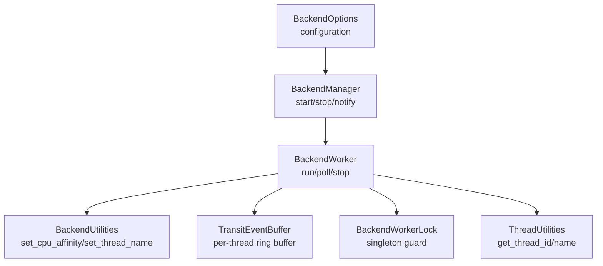
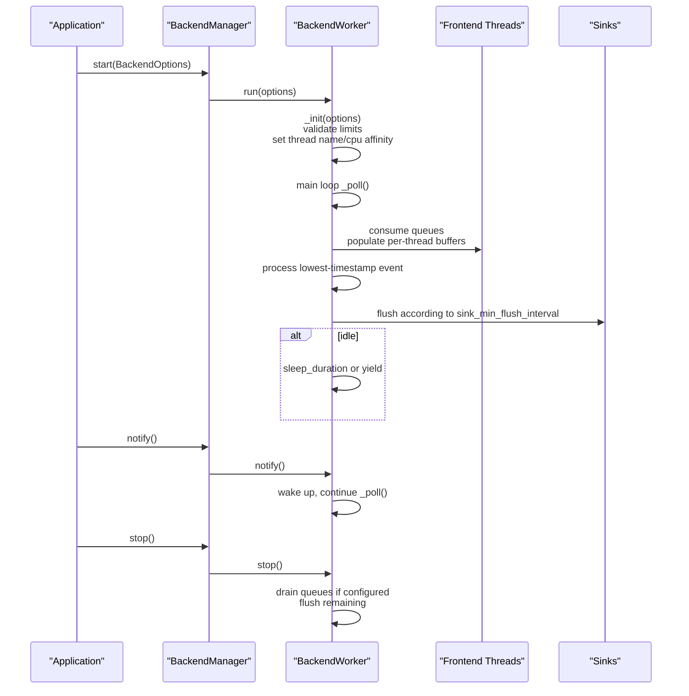
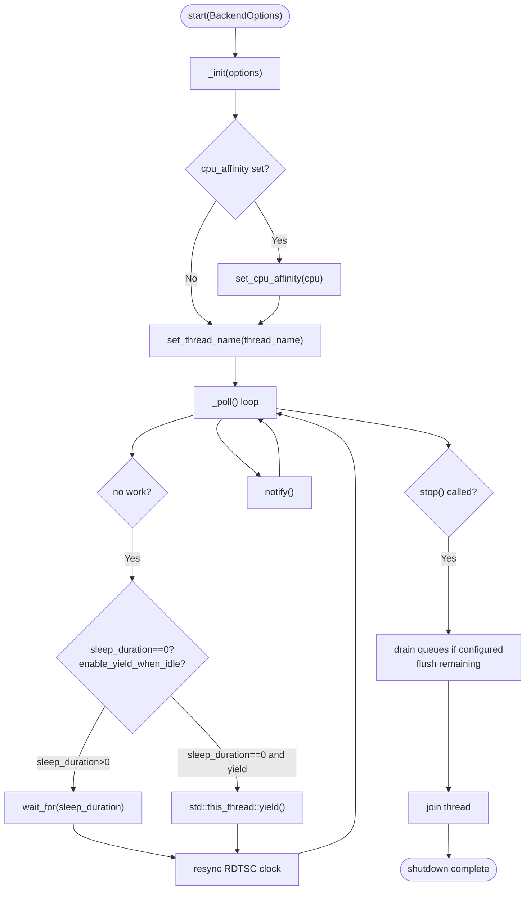
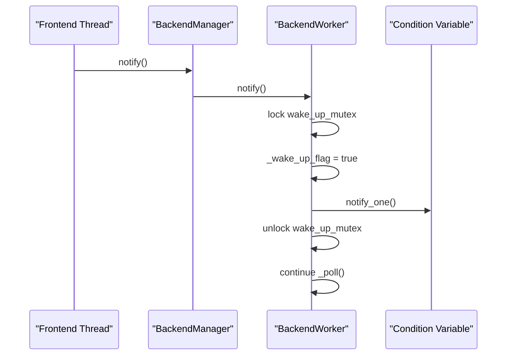
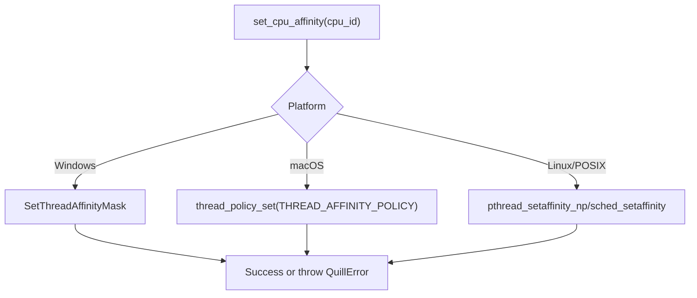
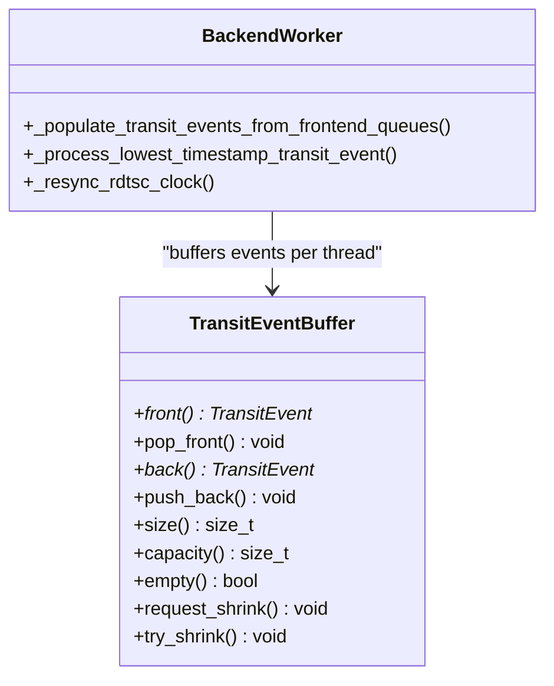
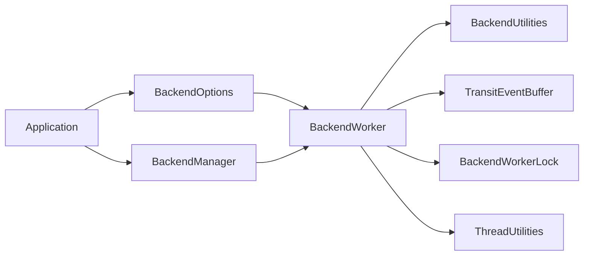

# BackendOptions

<cite>
**Referenced Files in This Document**
- [BackendOptions.h](file://include/quill/backend/BackendOptions.h)
- [BackendWorker.h](file://include/quill/backend/BackendWorker.h)
- [BackendManager.h](file://include/quill/backend/BackendManager.h)
- [BackendUtilities.h](file://include/quill/backend/BackendUtilities.h)
- [ThreadUtilities.h](file://include/quill/backend/ThreadUtilities.h)
- [BackendWorkerLock.h](file://include/quill/backend/BackendWorkerLock.h)
- [TransitEventBuffer.h](file://include/quill/backend/TransitEventBuffer.h)
- [Backend.h](file://include/quill/Backend.h)
- [backend_options.rst](file://docs/backend_options.rst)
- [quill_docs_example_backend_options.cpp](file://docs/examples/quill_docs_example_backend_options.cpp)
- [BackendLongSleepAndNotifyTest.cpp](file://test/integration_tests/BackendLongSleepAndNotifyTest.cpp)
- [BackendExceptionNotifierTest.cpp](file://test/integration_tests/BackendExceptionNotifierTest.cpp)
- [quill_backend_throughput.cpp](file://benchmarks/backend_throughput/quill_backend_throughput.cpp)
- [quill_backend_throughput_no_buffering.cpp](file://benchmarks/backend_throughput/quill_backend_throughput_no_buffering.cpp)
</cite>

## Table of Contents
1. [Introduction](#introduction)
2. [Project Structure](#project-structure)
3. [Core Components](#core-components)
4. [Architecture Overview](#architecture-overview)
5. [Detailed Component Analysis](#detailed-component-analysis)
6. [Dependency Analysis](#dependency-analysis)
7. [Performance Considerations](#performance-considerations)
8. [Troubleshooting Guide](#troubleshooting-guide)
9. [Conclusion](#conclusion)
10. [Appendices](#appendices)

## Introduction
This document provides comprehensive documentation for the BackendOptions configuration structure used by the logging backend worker thread. It explains thread priority and scheduling via sleep duration and idle yielding, CPU affinity options, notification mechanisms and inter-thread communication, worker lifecycle management, platform-specific behaviors, and practical configuration examples for single-core, multi-core, and embedded environments. It also includes performance tuning guidelines and troubleshooting advice for common backend configuration issues.

## Project Structure
The BackendOptions configuration is defined in a dedicated header and consumed by the backend worker and manager. Platform-specific utilities implement thread naming and CPU affinity. Tests and benchmarks demonstrate behavior under realistic workloads.

**Diagram sources**
- [BackendOptions.h:30-281](file://include/quill/backend/BackendOptions.h#L30-L281)
- [BackendManager.h:61-90](file://include/quill/backend/BackendManager.h#L61-L90)
- [BackendWorker.h:138-207](file://include/quill/backend/BackendWorker.h#L138-L207)
- [BackendUtilities.h:55-116](file://include/quill/backend/BackendUtilities.h#L55-L116)
- [TransitEventBuffer.h:19-162](file://include/quill/backend/TransitEventBuffer.h#L19-L162)
- [BackendWorkerLock.h:46-104](file://include/quill/backend/BackendWorkerLock.h#L46-L104)
- [ThreadUtilities.h:148-226](file://include/quill/backend/ThreadUtilities.h#L148-L226)

**Section sources**
- [BackendOptions.h:30-281](file://include/quill/backend/BackendOptions.h#L30-L281)
- [BackendWorker.h:138-207](file://include/quill/backend/BackendWorker.h#L138-L207)
- [BackendManager.h:61-90](file://include/quill/backend/BackendManager.h#L61-L90)
- [BackendUtilities.h:55-116](file://include/quill/backend/BackendUtilities.h#L55-L116)
- [TransitEventBuffer.h:19-162](file://include/quill/backend/TransitEventBuffer.h#L19-L162)
- [BackendWorkerLock.h:46-104](file://include/quill/backend/BackendWorkerLock.h#L46-L104)
- [ThreadUtilities.h:148-226](file://include/quill/backend/ThreadUtilities.h#L148-L226)

## Core Components
- BackendOptions: Central configuration struct controlling backend thread behavior, including sleep duration, idle yielding, CPU affinity, transit event buffering limits, timestamp ordering grace period, flush intervals, error notification hooks, and printable character filtering.
- BackendWorker: Implements the backend polling loop, queue consumption, event buffering, flushing, and lifecycle management. It applies BackendOptions at startup and runtime.
- BackendManager: Exposes start/stop/notify APIs and manages the singleton backend worker lifecycle.
- BackendUtilities and ThreadUtilities: Provide platform-specific thread naming and CPU affinity helpers.
- BackendWorkerLock: Guards against multiple backend worker instances per process.
- TransitEventBuffer: Per-thread unbounded ring buffer used to stage log events before formatting and writing.

Key BackendOptions fields:
- thread_name: Human-readable thread name for debugging and thread queries.
- enable_yield_when_idle: Yield the CPU when idle and sleep_duration is zero.
- sleep_duration: Nanoseconds to sleep when no work is available.
- transit_event_buffer_initial_capacity: Initial power-of-two capacity for per-thread buffers.
- transit_events_soft_limit and transit_events_hard_limit: Soft/hard limits for buffered events across all frontend threads; enforced to be powers of two.
- log_timestamp_ordering_grace_period: Microseconds to subtract from “now” to ensure monotonic ordering across threads.
- wait_for_queues_to_empty_before_exit: Whether to drain queues on shutdown.
- cpu_affinity: Target CPU core; max value disables affinity.
- error_notifier: Callback invoked on backend exceptions.
- backend_worker_on_poll_begin/end: Hooks invoked at start/end of each poll iteration.
- rdtsc_resync_interval: Milliseconds between recalibrating TSC clock synchronization.
- sink_min_flush_interval: Minimum flush interval for sinks.
- check_printable_char: Predicate to sanitize non-printable characters.
- log_level_descriptions and log_level_short_codes: Human-readable and compact log level identifiers.
- check_backend_singleton_instance: Guard against duplicate backend instances.

**Section sources**
- [BackendOptions.h:30-281](file://include/quill/backend/BackendOptions.h#L30-L281)
- [BackendWorker.h:400-438](file://include/quill/backend/BackendWorker.h#L400-L438)
- [BackendWorker.h:305-395](file://include/quill/backend/BackendWorker.h#L305-L395)
- [BackendManager.h:61-90](file://include/quill/backend/BackendManager.h#L61-L90)
- [BackendUtilities.h:55-116](file://include/quill/backend/BackendUtilities.h#L55-L116)
- [ThreadUtilities.h:148-226](file://include/quill/backend/ThreadUtilities.h#L148-L226)
- [TransitEventBuffer.h:19-162](file://include/quill/backend/TransitEventBuffer.h#L19-L162)
- [BackendWorkerLock.h:46-104](file://include/quill/backend/BackendWorkerLock.h#L46-L104)

## Architecture Overview
The backend operates as a dedicated worker thread that polls frontend per-thread SPSC queues, buffers events into per-thread TransitEventBuffers, orders them by timestamp, formats them, and flushes to sinks. It supports explicit wake-up via notify() and optional CPU affinity and thread naming.

**Diagram sources**
- [BackendManager.h:61-90](file://include/quill/backend/BackendManager.h#L61-L90)
- [BackendWorker.h:138-207](file://include/quill/backend/BackendWorker.h#L138-L207)
- [BackendWorker.h:305-395](file://include/quill/backend/BackendWorker.h#L305-L395)
- [BackendWorker.h:238-256](file://include/quill/backend/BackendWorker.h#L238-L256)

## Detailed Component Analysis

### BackendOptions Configuration Fields
- Thread identity and lifecycle
  - thread_name: Sets the backend thread name for diagnostics.
  - wait_for_queues_to_empty_before_exit: Controls shutdown behavior to drain queues or exit immediately.
  - check_backend_singleton_instance: Prevents duplicate backend workers via platform-specific primitives.
- Scheduling and sleep behavior
  - enable_yield_when_idle: Yields when idle and sleep_duration is zero.
  - sleep_duration: Nanoseconds to sleep when idle; combined with a condition variable for wake-up.
- Event buffering and ordering
  - transit_event_buffer_initial_capacity: Power-of-two initial capacity for per-thread buffers.
  - transit_events_soft_limit and transit_events_hard_limit: Soft/hard limits enforced to be powers of two; violations cause initialization errors.
  - log_timestamp_ordering_grace_period: Microseconds grace window to ensure monotonic ordering across threads.
- Flush and TSC synchronization
  - sink_min_flush_interval: Minimum flush interval for sinks; zero disables periodic throttling.
  - rdtsc_resync_interval: Milliseconds between recalibrating TSC-to-wall-clock synchronization.
- Inter-thread communication and hooks
  - error_notifier: Receives exceptions thrown in backend operations.
  - backend_worker_on_poll_begin/end: Hooks invoked at start/end of each poll iteration; exceptions are forwarded to error_notifier.
- Platform-specific and safety
  - cpu_affinity: Pins backend to a CPU; max value disables.
  - check_printable_char: Predicate to sanitize non-printable characters; can be customized or disabled.

**Section sources**
- [BackendOptions.h:30-281](file://include/quill/backend/BackendOptions.h#L30-L281)
- [BackendWorker.h:400-438](file://include/quill/backend/BackendWorker.h#L400-L438)
- [BackendWorker.h:305-395](file://include/quill/backend/BackendWorker.h#L305-L395)

### Backend Worker Startup and Shutdown
- Startup
  - BackendManager::start_backend_thread delegates to BackendWorker::run with BackendOptions.
  - BackendWorker::run initializes thread name and CPU affinity if configured, then enters the main loop.
- Shutdown
  - BackendManager::stop_backend_thread calls BackendWorker::stop, which signals wake-up, joins the thread, resets state, and releases the singleton lock.
  - During exit, BackendWorker::stop drains queues if configured and flushes remaining events.

**Diagram sources**
- [BackendManager.h:61-90](file://include/quill/backend/BackendManager.h#L61-L90)
- [BackendWorker.h:138-207](file://include/quill/backend/BackendWorker.h#L138-L207)
- [BackendWorker.h:305-395](file://include/quill/backend/BackendWorker.h#L305-L395)

**Section sources**
- [BackendManager.h:61-90](file://include/quill/backend/BackendManager.h#L61-L90)
- [BackendWorker.h:138-207](file://include/quill/backend/BackendWorker.h#L138-L207)
- [BackendWorker.h:212-232](file://include/quill/backend/BackendWorker.h#L212-L232)

### Notification Mechanisms and Inter-thread Communication
- notify(): Wakes the backend thread from sleep or idle yield. Uses a condition variable guarded by a mutex. MinGW has a special path to avoid deadlocks.
- error_notifier: Receives exceptions thrown in backend operations, including poll hooks and initialization failures.
- backend_worker_on_poll_begin/end: Optional hooks invoked at the start and end of each poll iteration; exceptions are forwarded to error_notifier.

**Diagram sources**
- [BackendWorker.h:238-256](file://include/quill/backend/BackendWorker.h#L238-L256)
- [BackendManager.h:89-90](file://include/quill/backend/BackendManager.h#L89-L90)

**Section sources**
- [BackendWorker.h:238-256](file://include/quill/backend/BackendWorker.h#L238-L256)
- [BackendOptions.h:170-192](file://include/quill/backend/BackendOptions.h#L170-L192)

### CPU Affinity and Thread Naming
- CPU affinity is set only if cpu_affinity is not the sentinel disabled value. Platform-specific implementations:
  - Windows: SetThreadAffinityMask.
  - macOS: thread_policy_set with THREAD_AFFINITY_POLICY.
  - Linux/BSD variants: pthread_setaffinity_np or sched_setaffinity.
- Thread naming is set via platform-specific APIs; some platforms/truncated names may throw errors captured by error_notifier.

**Diagram sources**
- [BackendUtilities.h:55-116](file://include/quill/backend/BackendUtilities.h#L55-L116)
- [ThreadUtilities.h:119-188](file://include/quill/backend/ThreadUtilities.h#L119-L188)

**Section sources**
- [BackendUtilities.h:55-116](file://include/quill/backend/BackendUtilities.h#L55-L116)
- [ThreadUtilities.h:119-188](file://include/quill/backend/ThreadUtilities.h#L119-L188)

### Transit Event Buffering and Ordering
- Per-thread TransitEventBuffer is a power-of-two ring buffer with automatic expansion and optional shrink-to-initial on emptiness.
- BackendWorker reads from all frontend queues, optionally applies a grace-period timestamp check, and stages events for processing.
- Soft vs hard limits govern batching behavior and backpressure.

**Diagram sources**
- [TransitEventBuffer.h:19-162](file://include/quill/backend/TransitEventBuffer.h#L19-L162)
- [BackendWorker.h:479-506](file://include/quill/backend/BackendWorker.h#L479-L506)
- [BackendWorker.h:795-800](file://include/quill/backend/BackendWorker.h#L795-L800)

**Section sources**
- [TransitEventBuffer.h:19-162](file://include/quill/backend/TransitEventBuffer.h#L19-L162)
- [BackendWorker.h:479-506](file://include/quill/backend/BackendWorker.h#L479-L506)
- [BackendWorker.h:795-800](file://include/quill/backend/BackendWorker.h#L795-L800)

### Platform-Specific Options and Effects
- Windows: Named mutex guards singleton backend instance; thread naming uses dynamic linking to kernel APIs; CPU affinity via SetThreadAffinityMask.
- macOS: Thread naming via pthread_setname_np; CPU affinity via thread_policy_set; some platforms restrict core binding.
- Linux/BSD: Thread naming via pthread_setname_np; CPU affinity via pthread_setaffinity_np or sched_setaffinity; OpenBSD lacks CPU affinity support.
- MinGW/Cygwin: Thread naming disabled; CPU affinity disabled; error_notifier may receive failures.

**Section sources**
- [BackendWorkerLock.h:46-104](file://include/quill/backend/BackendWorkerLock.h#L46-L104)
- [ThreadUtilities.h:119-188](file://include/quill/backend/ThreadUtilities.h#L119-L188)
- [BackendUtilities.h:55-116](file://include/quill/backend/BackendUtilities.h#L55-L116)

## Dependency Analysis
BackendOptions is consumed by BackendWorker during initialization and runtime. BackendManager orchestrates lifecycle and exposes notify() to wake the worker. Utilities provide platform-specific thread controls. Tests and benchmarks validate behavior.

**Diagram sources**
- [BackendOptions.h:30-281](file://include/quill/backend/BackendOptions.h#L30-L281)
- [BackendWorker.h:138-207](file://include/quill/backend/BackendWorker.h#L138-L207)
- [BackendManager.h:61-90](file://include/quill/backend/BackendManager.h#L61-L90)
- [BackendUtilities.h:55-116](file://include/quill/backend/BackendUtilities.h#L55-L116)
- [TransitEventBuffer.h:19-162](file://include/quill/backend/TransitEventBuffer.h#L19-L162)
- [BackendWorkerLock.h:46-104](file://include/quill/backend/BackendWorkerLock.h#L46-L104)
- [ThreadUtilities.h:148-226](file://include/quill/backend/ThreadUtilities.h#L148-L226)

**Section sources**
- [BackendOptions.h:30-281](file://include/quill/backend/BackendOptions.h#L30-L281)
- [BackendWorker.h:138-207](file://include/quill/backend/BackendWorker.h#L138-L207)
- [BackendManager.h:61-90](file://include/quill/backend/BackendManager.h#L61-L90)
- [BackendUtilities.h:55-116](file://include/quill/backend/BackendUtilities.h#L55-L116)
- [TransitEventBuffer.h:19-162](file://include/quill/backend/TransitEventBuffer.h#L19-L162)
- [BackendWorkerLock.h:46-104](file://include/quill/backend/BackendWorkerLock.h#L46-L104)
- [ThreadUtilities.h:148-226](file://include/quill/backend/ThreadUtilities.h#L148-L226)

## Performance Considerations
- Sleep duration vs. busy-waiting:
  - Larger sleep_duration reduces CPU usage when idle but increases latency to process new messages.
  - enable_yield_when_idle with sleep_duration zero yields the processor, lowering OS scheduler priority for the backend thread.
- Transit event limits:
  - Soft limit triggers batched processing when many events are buffered; hard limit prevents indefinite growth and backpressure.
  - Both limits must be powers of two; misconfiguration raises initialization errors.
- Flush interval:
  - sink_min_flush_interval balances throughput and I/O pressure; zero disables throttling.
- Timestamp ordering grace period:
  - Non-zero adds a small delay to ensure monotonic ordering across threads; larger values reduce reordering but risk queue fill at high throughput.
- CPU affinity:
  - Pinning the backend to a shared non-critical CPU can improve cache locality and reduce contention.
- TSC resync interval:
  - Smaller intervals increase accuracy at the cost of additional system clock calls; impacts backend worker performance.
- Printable character filtering:
  - Enabling custom filtering allows UTF-8 logging; disabling sanitization reduces overhead.

[No sources needed since this section provides general guidance]

## Troubleshooting Guide
Common issues and resolutions:
- Duplicate backend worker threads:
  - Symptom: Crash or unexpected behavior when mixing static/shared builds.
  - Resolution: Enable check_backend_singleton_instance (default true) or rebuild as a single library type.
- Invalid CPU affinity:
  - Symptom: Initialization failure when setting cpu_affinity.
  - Resolution: Use the sentinel disabled value or select a valid core index.
- Thread naming failures:
  - Symptom: error_notifier invoked for thread name setting.
  - Resolution: Use shorter names or disable on unsupported platforms.
- Long sleep prevents processing:
  - Symptom: Logs not written until notify() is called.
  - Resolution: Reduce sleep_duration or call Backend::notify() to wake the backend.
- Out-of-order timestamps:
  - Symptom: Logs appear out of order across threads.
  - Resolution: Increase log_timestamp_ordering_grace_period; consider lower sleep_duration.
- Poll hooks throwing exceptions:
  - Symptom: error_notifier receives exceptions from hooks.
  - Resolution: Wrap hooks with proper error handling; avoid blocking operations.
- TSC resync configuration:
  - Symptom: QuillError indicating sleep_duration must not exceed rdtsc_resync_interval.
  - Resolution: Decrease sleep_duration or increase rdtsc_resync_interval.

**Section sources**
- [BackendWorkerLock.h:46-104](file://include/quill/backend/BackendWorkerLock.h#L46-L104)
- [BackendExceptionNotifierTest.cpp:46-115](file://test/integration_tests/BackendExceptionNotifierTest.cpp#L46-L115)
- [BackendLongSleepAndNotifyTest.cpp:17-91](file://test/integration_tests/BackendLongSleepAndNotifyTest.cpp#L17-L91)
- [BackendWorker.h:112-123](file://include/quill/backend/BackendWorker.h#L112-L123)

## Conclusion
BackendOptions provides precise control over backend thread behavior, enabling low-latency, high-throughput logging with predictable scheduling, robust ordering guarantees, and platform-aware thread management. Correctly tuning sleep duration, buffering limits, flush intervals, and CPU affinity yields optimal performance across diverse deployment scenarios.

[No sources needed since this section summarizes without analyzing specific files]

## Appendices

### Configuration Examples by Deployment Scenario
- Single-core system
  - Pin backend to a shared non-critical core; reduce sleep_duration moderately; enable yield when idle; set conservative soft/hard limits.
  - Reference: [quill_docs_example_backend_options.cpp:5-7](file://docs/examples/quill_docs_example_backend_options.cpp#L5-L7)
- Multi-core server
  - Pin backend to a dedicated core; use moderate sleep_duration; enable graceful timestamp ordering; tune flush interval to balance throughput and I/O.
- Embedded environment
  - Prefer zero sleep_duration with enable_yield_when_idle to minimize latency; set tight buffering limits; disable non-essential hooks; ensure platform-specific thread naming is supported.

**Section sources**
- [quill_docs_example_backend_options.cpp:5-7](file://docs/examples/quill_docs_example_backend_options.cpp#L5-L7)

### Practical Benchmarks and Tests
- Throughput benchmark with spin mode and CPU affinity:
  - Demonstrates zero sleep_duration and CPU pinning for maximum throughput.
  - Reference: [quill_backend_throughput.cpp:19-25](file://benchmarks/backend_throughput/quill_backend_throughput.cpp#L19-L25)
- No-buffering benchmark with tight limits:
  - Validates behavior with minimal buffering and strict limits.
  - Reference: [quill_backend_throughput_no_buffering.cpp:19-26](file://benchmarks/backend_throughput/quill_backend_throughput_no_buffering.cpp#L19-L26)
- Long sleep and notify behavior:
  - Verifies that notify() wakes the backend from extended sleep.
  - Reference: [BackendLongSleepAndNotifyTest.cpp:25-71](file://test/integration_tests/BackendLongSleepAndNotifyTest.cpp#L25-L71)

**Section sources**
- [quill_backend_throughput.cpp:19-25](file://benchmarks/backend_throughput/quill_backend_throughput.cpp#L19-L25)
- [quill_backend_throughput_no_buffering.cpp:19-26](file://benchmarks/backend_throughput/quill_backend_throughput_no_buffering.cpp#L19-L26)
- [BackendLongSleepAndNotifyTest.cpp:25-71](file://test/integration_tests/BackendLongSleepAndNotifyTest.cpp#L25-L71)