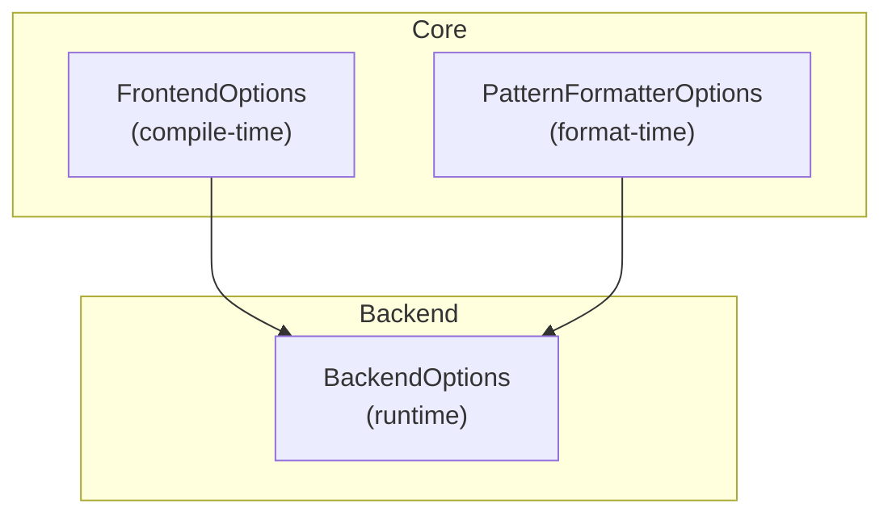
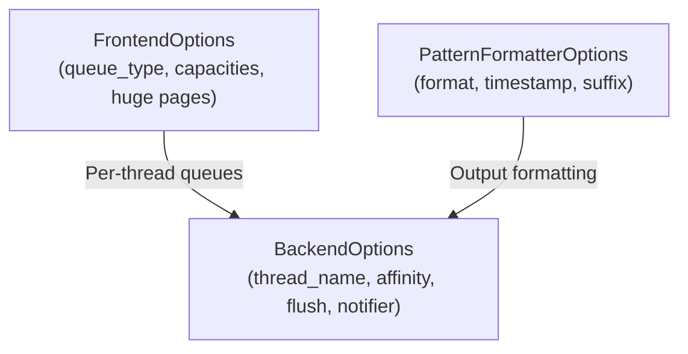
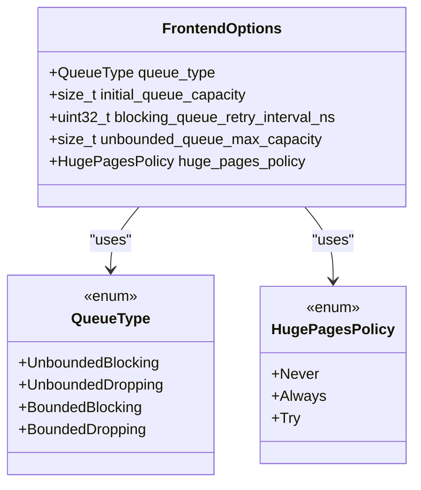
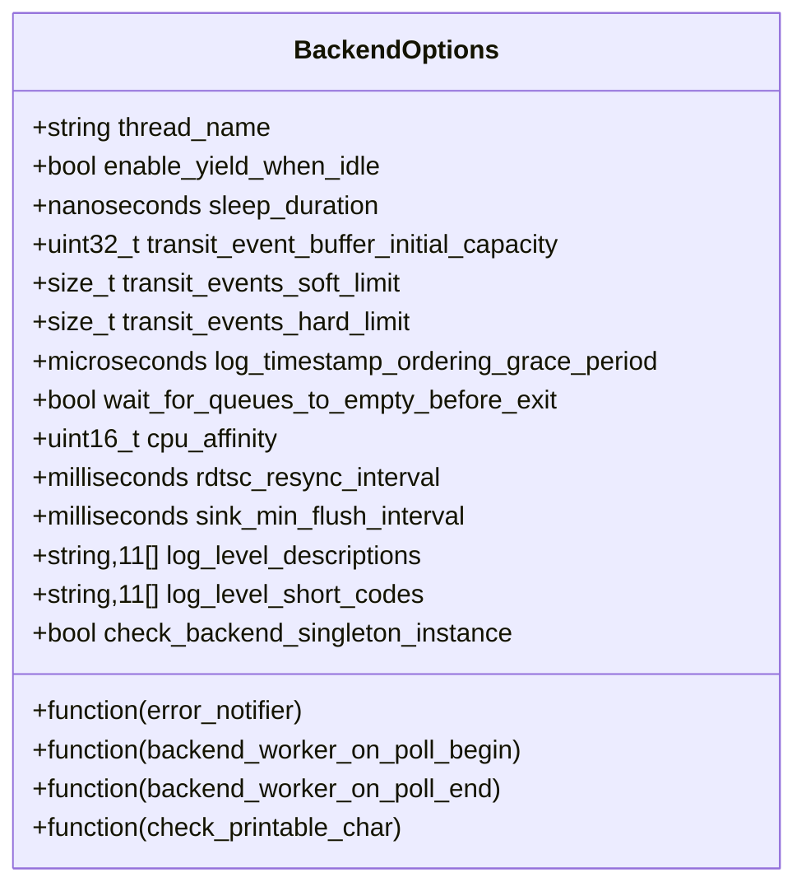
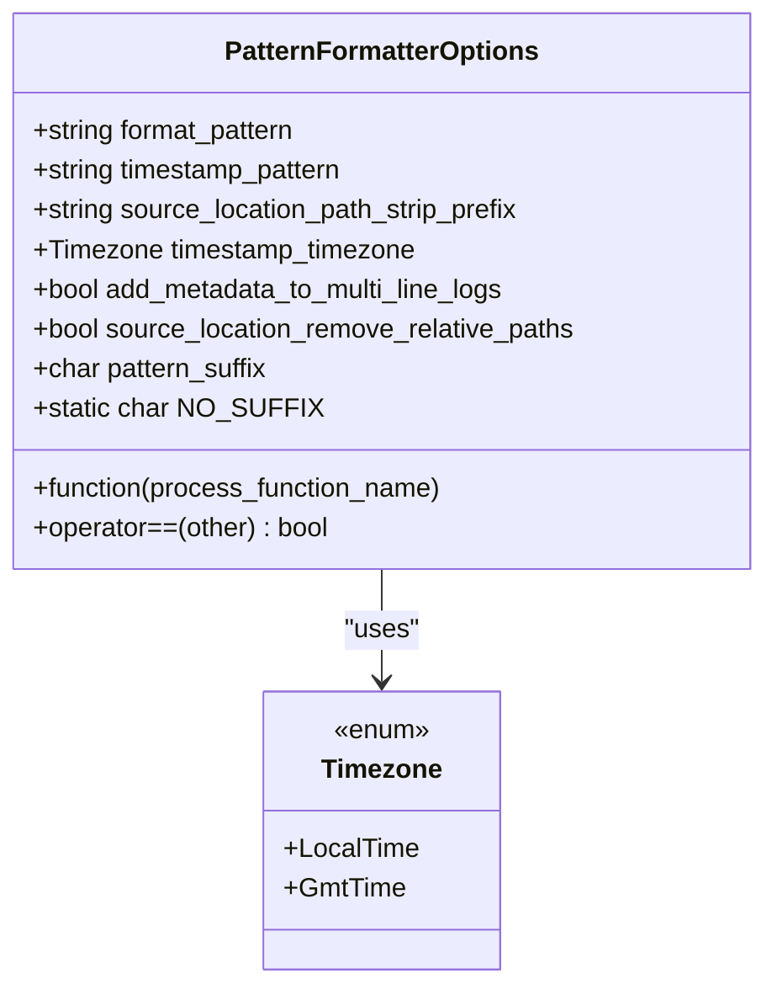
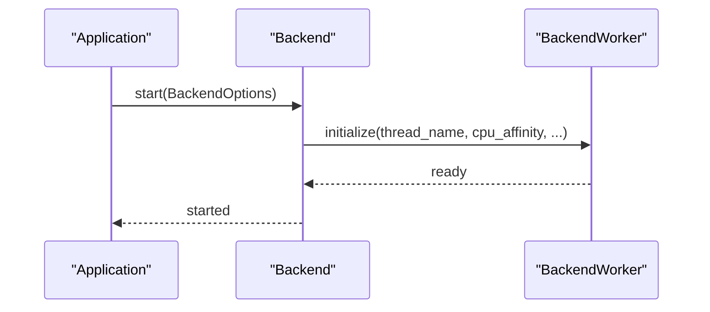
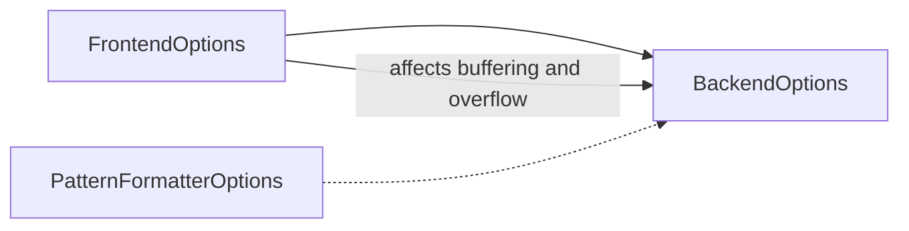

# Configuration Structures

<cite>
**Referenced Files in This Document**
- [FrontendOptions.h](file://include/quill/core/FrontendOptions.h)
- [Common.h](file://include/quill/core/Common.h)
- [BackendOptions.h](file://include/quill/backend/BackendOptions.h)
- [PatternFormatterOptions.h](file://include/quill/core/PatternFormatterOptions.h)
- [frontend_options.rst](file://docs/frontend_options.rst)
- [backend_options.rst](file://docs/backend_options.rst)
- [formatters.rst](file://docs/formatters.rst)
- [custom_frontend_options.cpp](file://examples/custom_frontend_options.cpp)
- [quill_docs_example_backend_options.cpp](file://docs/examples/quill_docs_example_backend_options.cpp)
- [PatternFormatterTest.cpp](file://test/unit_tests/PatternFormatterTest.cpp)
</cite>

## Table of Contents
1. [Introduction](#introduction)
2. [Project Structure](#project-structure)
3. [Core Components](#core-components)
4. [Architecture Overview](#architecture-overview)
5. [Detailed Component Analysis](#detailed-component-analysis)
6. [Dependency Analysis](#dependency-analysis)
7. [Performance Considerations](#performance-considerations)
8. [Troubleshooting Guide](#troubleshooting-guide)
9. [Conclusion](#conclusion)
10. [Appendices](#appendices)

## Introduction
This document provides comprehensive API documentation for Quill’s configuration structures: FrontendOptions, BackendOptions, and PatternFormatterOptions. It explains each parameter’s data type, default value, and behavioral impact, along with validation rules, acceptable ranges, and interdependencies. Practical configuration examples are included to guide optimal setups for different performance and reliability requirements.

## Project Structure
The configuration structures are defined in dedicated header files and accompanied by documentation and examples:
- FrontendOptions: compile-time queue configuration and memory policy
- BackendOptions: runtime backend thread behavior, CPU affinity, flush intervals, and notification hooks
- PatternFormatterOptions: log message formatting controls including timestamp patterns and metadata handling

**Diagram sources**
- [FrontendOptions.h:16-50](file://include/quill/core/FrontendOptions.h#L16-L50)
- [BackendOptions.h:30-281](file://include/quill/backend/BackendOptions.h#L30-L281)
- [PatternFormatterOptions.h:23-168](file://include/quill/core/PatternFormatterOptions.h#L23-L168)

**Section sources**
- [FrontendOptions.h:16-50](file://include/quill/core/FrontendOptions.h#L16-L50)
- [BackendOptions.h:30-281](file://include/quill/backend/BackendOptions.h#L30-L281)
- [PatternFormatterOptions.h:23-168](file://include/quill/core/PatternFormatterOptions.h#L23-L168)

## Core Components
This section documents the three configuration structures and their parameters.

### FrontendOptions
Compile-time options controlling per-thread frontend queue behavior and memory policies.

- queue_type: Enum selecting queue behavior
  - Values: UnboundedBlocking, UnboundedDropping, BoundedBlocking, BoundedDropping
  - Default: UnboundedBlocking
  - Effect: Determines whether the queue grows without bound (up to a max) or remains fixed, and whether it blocks or drops messages upon overflow
- initial_queue_capacity: Static size for initial queue allocation
  - Type: size_t
  - Default: 128 KiB
  - Notes: For unbounded queues, the queue can grow up to unbounded_queue_max_capacity
- blocking_queue_retry_interval_ns: Retry interval when using blocking modes
  - Type: uint32_t
  - Default: 800 ns
  - Applicability: Applies to BoundedBlocking and UnboundedBlocking
- unbounded_queue_max_capacity: Upper bound for unbounded queues
  - Type: size_t
  - Default: 2 GiB
  - Effect: Defines maximum growth before blocking/dropping behavior engages
- huge_pages_policy: Memory allocation policy for frontend queues on Linux
  - Values: Never, Always, Try
  - Default: Never
  - Effect: Uses huge pages to reduce TLB misses when set to Always or Try

Validation and interdependencies:
- All queue types share the same initial_queue_capacity and unbounded_queue_max_capacity semantics
- blocking_queue_retry_interval_ns only applies to blocking queue modes
- huge_pages_policy is Linux-specific

Behavioral effects:
- Larger initial_queue_capacity reduces early reallocations on hot paths
- Unbounded queues prevent data loss at the cost of higher memory usage
- Bounded queues prevent unbounded growth but may drop messages under load

**Section sources**
- [FrontendOptions.h:16-50](file://include/quill/core/FrontendOptions.h#L16-L50)
- [Common.h:144-151](file://include/quill/core/Common.h#L144-L151)
- [Common.h:174-180](file://include/quill/core/Common.h#L174-L180)
- [frontend_options.rst:10-17](file://docs/frontend_options.rst#L10-L17)
- [frontend_options.rst:23-31](file://docs/frontend_options.rst#L23-L31)

### BackendOptions
Runtime options governing backend thread behavior, scheduling, and I/O characteristics.

- thread_name: Backend thread name for debugging and introspection
  - Type: std::string
  - Default: "QuillBackend"
- enable_yield_when_idle: Yield backend thread when idle and sleep_duration is 0
  - Type: bool
  - Default: false
  - Effect: Reduces scheduler priority when idle
- sleep_duration: Backend idle sleep duration
  - Type: std::chrono::nanoseconds
  - Default: 100 µs
  - Effect: Controls polling cadence when queues are empty
- transit_event_buffer_initial_capacity: Per-frontend transit buffer initial capacity (items)
  - Type: uint32_t
  - Default: 256
  - Requirement: Must be a power of two
- transit_events_soft_limit: Soft limit across all frontend threads
  - Type: size_t
  - Default: 8192
  - Effect: Batch processing threshold for cached transit events
- transit_events_hard_limit: Hard limit per frontend thread
  - Type: size_t
  - Default: 65,536
  - Effect: Stops reading from a frontend thread’s queue when limit is reached
- log_timestamp_ordering_grace_period: Grace window to enforce timestamp ordering
  - Type: std::chrono::microseconds
  - Default: 5 µs
  - Range guidance: 0 (fastest), 1–5 (good default), 10–20 (better ordering), 100+ (strict but risky)
- wait_for_queues_to_empty_before_exit: Wait for frontend queues to drain on shutdown
  - Type: bool
  - Default: true
  - Effect: Ensures no logs lost on shutdown but may stall if a thread keeps logging
- cpu_affinity: CPU pinning for backend thread
  - Type: uint16_t
  - Default: unset sentinel value (no pinning)
  - Usage: Set to a CPU index; use the sentinel to disable
- error_notifier: Callback for backend error notifications
  - Type: std::function<void(std::string const&)>
  - Default: prints to stderr (platform-dependent)
  - Effect: Receives notifications for reallocations and drops
- backend_worker_on_poll_begin/end: Hooks executed at start/end of each poll iteration
  - Type: std::function<void()>
  - Default: none
  - Effect: Instrumentation-friendly callbacks
- rdtsc_resync_interval: Frequency to resync TSC-based clocks
  - Type: std::chrono::milliseconds
  - Default: 500 ms
  - Effect: Accuracy vs. overhead trade-off for TSC-based timestamps
- sink_min_flush_interval: Minimum flush interval for sinks
  - Type: std::chrono::milliseconds
  - Default: 200 ms
  - Effect: Limits flush frequency; 0 disables throttling
- check_printable_char: Character filtering predicate for safety
  - Type: std::function<bool(char)>
  - Default: printable ASCII + tab/newline/carriage return
  - Effect: Filters non-printable characters; can be disabled or customized
- log_level_descriptions/log_level_short_codes: Human-readable and short labels for log levels
  - Type: std::array<std::string, 11>
  - Defaults: Descriptive and short codes for standard levels
- check_backend_singleton_instance: Detect multiple backend instances
  - Type: bool
  - Default: true
  - Effect: Prevents multiple backend workers in mixed static/shared linking scenarios

Validation and interdependencies:
- transit_event_buffer_initial_capacity must be a power of two
- grace period influences ordering correctness and queue pressure
- cpu_affinity sentinel disables pinning; set to a valid CPU index to pin
- sink_min_flush_interval 0 disables throttling; explicit logger flush overrides
- check_printable_char can be disabled by assigning an empty function

**Section sources**
- [BackendOptions.h:30-281](file://include/quill/backend/BackendOptions.h#L30-L281)
- [backend_options.rst:17-46](file://docs/backend_options.rst#L17-L46)

### PatternFormatterOptions
Formatting options for log message output, including timestamp patterns and metadata behavior.

- format_pattern: Template string defining log record layout
  - Type: std::string
  - Default: Includes time, thread_id, short source location, log level, logger name, and message
  - Placeholders include time, file_name, full_path, caller_function, log_level, log_level_short_code, line_number, logger, message, thread_id, thread_name, process_id, source_location, short_source_location, tags, named_args
  - Constraint: Same attribute cannot be used twice
- timestamp_pattern: strftime-compatible timestamp format with fractional seconds
  - Type: std::string
  - Default: "%H:%M:%S.%Qns"
  - Supported fractional specifiers: %Qms, %Qus, %Qns
- source_location_path_strip_prefix: Prefix to strip from source_location paths
  - Type: std::string
  - Default: empty
  - Effect: Shortens displayed paths for %(source_location)
- process_function_name: Optional processor for detailed function names
  - Type: std::string_view (*)(char const*)
  - Default: null (no processing)
  - Effect: Only used when detailed function names are enabled
- timestamp_timezone: Timezone for timestamps
  - Type: Timezone enum
  - Values: LocalTime, GmtTime
  - Default: LocalTime
- add_metadata_to_multi_line_logs: Repeat metadata on continuation lines
  - Type: bool
  - Default: true
  - Effect: Improves readability for multi-line messages
- source_location_remove_relative_paths: Normalize relative path components
  - Type: bool
  - Default: false
  - Effect: Removes "../" components from source_location
- pattern_suffix: Character appended after each formatted log line
  - Type: char
  - Default: '\n'
  - Special value: NO_SUFFIX (-1 cast to char) to suppress suffix
- operator==: Memberwise comparison for equality

Validation and interdependencies:
- Fractional second specifiers (%Qms/%Qus/%Qns) are supported in timestamp_pattern
- process_function_name is only effective when detailed function names are enabled
- NO_SUFFIX avoids appending a newline when desired

**Section sources**
- [PatternFormatterOptions.h:23-168](file://include/quill/core/PatternFormatterOptions.h#L23-L168)
- [formatters.rst:17-71](file://docs/formatters.rst#L17-L71)
- [formatters.rst:73-93](file://docs/formatters.rst#L73-L93)
- [formatters.rst:104-186](file://docs/formatters.rst#L104-L186)

## Architecture Overview
The configuration structures influence runtime behavior as follows:
- FrontendOptions drives per-thread queue sizing and growth policies at compile-time
- BackendOptions governs backend thread scheduling, buffering, flushing, and safety checks at runtime
- PatternFormatterOptions shape the textual output of log messages

**Diagram sources**
- [FrontendOptions.h:16-50](file://include/quill/core/FrontendOptions.h#L16-L50)
- [BackendOptions.h:30-281](file://include/quill/backend/BackendOptions.h#L30-L281)
- [PatternFormatterOptions.h:23-168](file://include/quill/core/PatternFormatterOptions.h#L23-L168)

## Detailed Component Analysis

### FrontendOptions Analysis
FrontendOptions defines compile-time queue behavior and memory policy. The queue types and their effects are documented in the project’s frontend options guide.

**Diagram sources**
- [FrontendOptions.h:16-50](file://include/quill/core/FrontendOptions.h#L16-L50)
- [Common.h:144-151](file://include/quill/core/Common.h#L144-L151)
- [Common.h:174-180](file://include/quill/core/Common.h#L174-L180)

**Section sources**
- [FrontendOptions.h:16-50](file://include/quill/core/FrontendOptions.h#L16-L50)
- [frontend_options.rst:10-17](file://docs/frontend_options.rst#L10-L17)

### BackendOptions Analysis
BackendOptions controls backend thread behavior, buffering, and I/O. The documentation describes runtime customization and safety features.

**Diagram sources**
- [BackendOptions.h:30-281](file://include/quill/backend/BackendOptions.h#L30-L281)

**Section sources**
- [BackendOptions.h:30-281](file://include/quill/backend/BackendOptions.h#L30-L281)
- [backend_options.rst:17-46](file://docs/backend_options.rst#L17-L46)

### PatternFormatterOptions Analysis
PatternFormatterOptions configures the textual layout of log messages, including timestamp formatting and metadata behavior.

**Diagram sources**
- [PatternFormatterOptions.h:23-168](file://include/quill/core/PatternFormatterOptions.h#L23-L168)
- [Common.h:155-160](file://include/quill/core/Common.h#L155-L160)

**Section sources**
- [PatternFormatterOptions.h:23-168](file://include/quill/core/PatternFormatterOptions.h#L23-L168)
- [formatters.rst:104-186](file://docs/formatters.rst#L104-L186)

### API Workflow: Backend Startup with Custom BackendOptions
This sequence illustrates how BackendOptions are applied at startup.

**Diagram sources**
- [quill_docs_example_backend_options.cpp:5-7](file://docs/examples/quill_docs_example_backend_options.cpp#L5-L7)
- [BackendOptions.h:30-281](file://include/quill/backend/BackendOptions.h#L30-L281)

## Dependency Analysis
- FrontendOptions and BackendOptions are independent at runtime; FrontendOptions’ queue behavior influences BackendOptions’ buffering and overflow handling
- PatternFormatterOptions is orthogonal to queue configuration and primarily affects output formatting
- BackendOptions’ error_notifier and hooks integrate with FrontendOptions’ queue behavior to surface reallocation and drop events

**Diagram sources**
- [FrontendOptions.h:16-50](file://include/quill/core/FrontendOptions.h#L16-L50)
- [BackendOptions.h:30-281](file://include/quill/backend/BackendOptions.h#L30-L281)
- [PatternFormatterOptions.h:23-168](file://include/quill/core/PatternFormatterOptions.h#L23-L168)

**Section sources**
- [FrontendOptions.h:16-50](file://include/quill/core/FrontendOptions.h#L16-L50)
- [BackendOptions.h:30-281](file://include/quill/backend/BackendOptions.h#L30-L281)
- [PatternFormatterOptions.h:23-168](file://include/quill/core/PatternFormatterOptions.h#L23-L168)

## Performance Considerations
- FrontendOptions
  - Larger initial_queue_capacity reduces reallocations on hot paths; consider unbounded queues for bursty workloads with unbounded_queue_max_capacity tuned to available memory
  - Blocking modes increase latency under contention; dropping modes reduce memory footprint at the cost of data loss
  - huge_pages_policy can reduce TLB misses on Linux; evaluate overhead vs. benefit
- BackendOptions
  - sleep_duration balances CPU usage and latency; lower values increase responsiveness but CPU usage
  - transit_event_buffer_initial_capacity must be a power of two; tune soft/hard limits to prevent starvation under hot/cold frontend imbalance
  - log_timestamp_ordering_grace_period trades ordering strictness for throughput; choose based on workload variability
  - sink_min_flush_interval controls I/O frequency; 0 disables throttling, increasing write frequency
- PatternFormatterOptions
  - Complex format_patterns and detailed function name processing add formatting overhead; simplify for high-throughput scenarios

[No sources needed since this section provides general guidance]

## Troubleshooting Guide
- FrontendOptions
  - Unbounded queue reallocations: monitored via BackendOptions::error_notifier; adjust initial_queue_capacity and unbounded_queue_max_capacity
  - Bounded queue drops: observed via BackendOptions::error_notifier; consider switching to unbounded or increasing capacity
- BackendOptions
  - Backend stalls on shutdown: disable wait_for_queues_to_empty_before_exit if necessary, understanding potential log loss
  - Excessive CPU usage: increase sleep_duration or enable_yield_when_idle when idle
  - Non-printable characters: adjust check_printable_char or disable it for UTF-8 logging
- PatternFormatterOptions
  - Unsupported strftime specifiers (e.g., MinGW): use supported specifiers or avoid platform-specific formats
  - Multi-line readability: toggle add_metadata_to_multi_line_logs for cleaner continuation lines

**Section sources**
- [frontend_options.rst:23-31](file://docs/frontend_options.rst#L23-L31)
- [backend_options.rst:17-46](file://docs/backend_options.rst#L17-L46)
- [formatters.rst:73-93](file://docs/formatters.rst#L73-L93)

## Conclusion
FrontendOptions, BackendOptions, and PatternFormatterOptions collectively define Quill’s performance, reliability, and output characteristics. Proper tuning of queue behavior, backend scheduling, and formatting improves throughput, reduces latency, and ensures readable, safe log output. Use the provided examples and guidelines to configure these structures for your specific use case.

[No sources needed since this section summarizes without analyzing specific files]

## Appendices

### Configuration Examples

- Custom FrontendOptions with BoundedDropping
  - Define a custom FrontendOptions struct with queue_type set to BoundedDropping and initial_queue_capacity sized for your workload
  - Instantiate CustomFrontend and CustomLogger using the custom options
  - Reference: [custom_frontend_options.cpp:14-27](file://examples/custom_frontend_options.cpp#L14-L27)

- Pin Backend to a Specific CPU
  - Set BackendOptions::cpu_affinity to the target CPU index
  - Reference: [quill_docs_example_backend_options.cpp:6](file://docs/examples/quill_docs_example_backend_options.cpp#L6)

- UTF-8 Logging Without Character Sanitization
  - Disable check_printable_char to allow non-ASCII characters
  - Reference: [backend_options.rst:24-32](file://docs/backend_options.rst#L24-L32)

- Custom PatternFormatterOptions
  - Adjust format_pattern, timestamp_pattern, and add_metadata_to_multi_line_logs
  - Reference: [formatters.rst:104-186](file://docs/formatters.rst#L104-L186)

**Section sources**
- [custom_frontend_options.cpp:14-27](file://examples/custom_frontend_options.cpp#L14-L27)
- [quill_docs_example_backend_options.cpp:6](file://docs/examples/quill_docs_example_backend_options.cpp#L6)
- [backend_options.rst:24-32](file://docs/backend_options.rst#L24-L32)
- [formatters.rst:104-186](file://docs/formatters.rst#L104-L186)