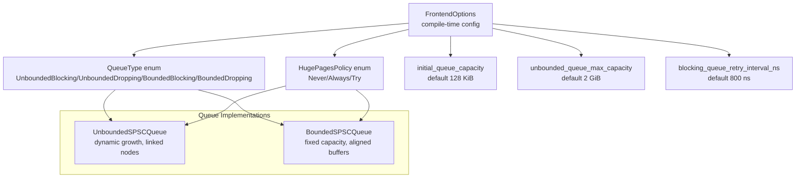
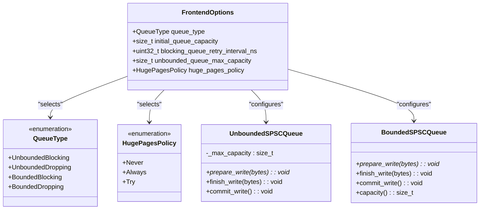
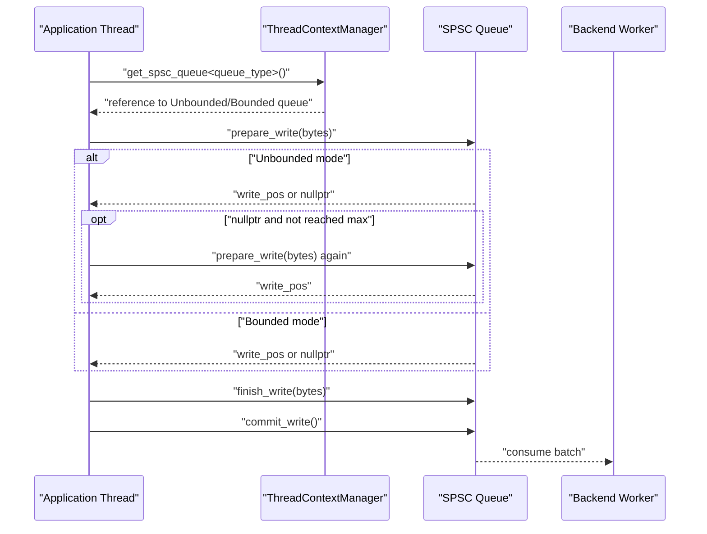
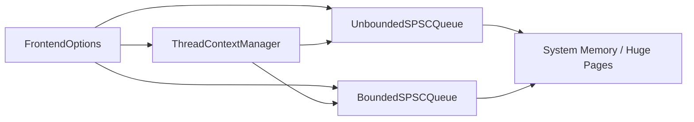

# FrontendOptions

<cite>
**Referenced Files in This Document**
- [FrontendOptions.h](file://include/quill/core/FrontendOptions.h)
- [Common.h](file://include/quill/core/Common.h)
- [UnboundedSPSCQueue.h](file://include/quill/core/UnboundedSPSCQueue.h)
- [BoundedSPSCQueue.h](file://include/quill/core/BoundedSPSCQueue.h)
- [ThreadContextManager.h](file://include/quill/core/ThreadContextManager.h)
- [Frontend.h](file://include/quill/Frontend.h)
- [frontend_options.rst](file://docs/frontend_options.rst)
- [bounded_dropping_queue_frontend.cpp](file://examples/bounded_dropping_queue_frontend.cpp)
- [custom_frontend_options.cpp](file://examples/custom_frontend_options.cpp)
- [BoundedDroppingQueueTest.cpp](file://test/integration_tests/BoundedDroppingQueueTest.cpp)
- [UnboundedUnlimitedQueueTest.cpp](file://test/integration_tests/UnboundedUnlimitedQueueTest.cpp)
</cite>

## Table of Contents
1. [Introduction](#introduction)
2. [Project Structure](#project-structure)
3. [Core Components](#core-components)
4. [Architecture Overview](#architecture-overview)
5. [Detailed Component Analysis](#detailed-component-analysis)
6. [Dependency Analysis](#dependency-analysis)
7. [Performance Considerations](#performance-considerations)
8. [Troubleshooting Guide](#troubleshooting-guide)
9. [Conclusion](#conclusion)

## Introduction
This document explains the FrontendOptions configuration structure used to tune the hot-path Single Producer Single Consumer (SPSC) queue per frontend thread. It covers all queue types (UnboundedBlocking, UnboundedDropping, BoundedBlocking, BoundedDropping), their behavioral differences and typical use cases, queue capacity parameters (initial_queue_capacity and unbounded_queue_max_capacity), blocking retry interval (blocking_queue_retry_interval_ns), and Linux-specific huge pages policy (huge_pages_policy). Practical configuration examples are provided for high-throughput logging, memory-constrained environments, and real-time systems, along with parameter validation rules and performance implications.

## Project Structure
FrontendOptions is a compile-time configuration struct that controls the frontend thread’s local queue behavior. The queue type and memory policy are selected via enums and constants defined in core headers, and the queue implementations are provided by specialized SPSC queue classes.

**Diagram sources**
- [FrontendOptions.h:16-50](file://include/quill/core/FrontendOptions.h#L16-L50)
- [Common.h:145-180](file://include/quill/core/Common.h#L145-L180)
- [UnboundedSPSCQueue.h:79-85](file://include/quill/core/UnboundedSPSCQueue.h#L79-L85)
- [BoundedSPSCQueue.h:331-346](file://include/quill/core/BoundedSPSCQueue.h#L331-L346)

**Section sources**
- [FrontendOptions.h:16-50](file://include/quill/core/FrontendOptions.h#L16-L50)
- [Common.h:145-180](file://include/quill/core/Common.h#L145-L180)

## Core Components
- QueueType: Selects the SPSC queue behavior at compile time.
- initial_queue_capacity: Starting capacity for the queue in bytes.
- unbounded_queue_max_capacity: Upper bound for dynamic growth of unbounded queues.
- blocking_queue_retry_interval_ns: Retry interval used when blocking queues are full.
- huge_pages_policy: Controls Linux huge pages usage for reduced TLB overhead.

Behavioral summary:
- UnboundedBlocking: Grows dynamically up to the max capacity, then blocks the calling thread.
- UnboundedDropping: Grows dynamically up to the max capacity, then drops messages.
- BoundedBlocking: Fixed capacity; blocks when full.
- BoundedDropping: Fixed capacity; drops messages when full.

Defaults:
- queue_type: UnboundedBlocking
- initial_queue_capacity: 128 KiB
- unbounded_queue_max_capacity: 2 GiB
- blocking_queue_retry_interval_ns: 800 ns
- huge_pages_policy: Never

**Section sources**
- [FrontendOptions.h:18-49](file://include/quill/core/FrontendOptions.h#L18-L49)
- [frontend_options.rst:10-17](file://docs/frontend_options.rst#L10-L17)

## Architecture Overview
The frontend thread owns a per-thread SPSC queue chosen by FrontendOptions::queue_type. The ThreadContextManager selects the correct queue type at runtime based on the template parameter. The queue implementations differ in capacity semantics and memory allocation strategy.

**Diagram sources**
- [FrontendOptions.h:16-50](file://include/quill/core/FrontendOptions.h#L16-L50)
- [Common.h:145-180](file://include/quill/core/Common.h#L145-L180)
- [UnboundedSPSCQueue.h:79-85](file://include/quill/core/UnboundedSPSCQueue.h#L79-L85)
- [BoundedSPSCQueue.h:331-346](file://include/quill/core/BoundedSPSCQueue.h#L331-L346)

## Detailed Component Analysis

### Queue Types and Behavioral Differences
- UnboundedBlocking
  - Grows dynamically from initial_queue_capacity up to unbounded_queue_max_capacity.
  - When full, the calling thread blocks until space is available.
  - Suitable for high-throughput logging where losing messages is unacceptable.
- UnboundedDropping
  - Grows dynamically from initial_queue_capacity up to unbounded_queue_max_capacity.
  - When full, new log messages are dropped.
  - Suitable for scenarios where preserving throughput is preferred over strict delivery.
- BoundedBlocking
  - Fixed capacity; never grows.
  - When full, the calling thread blocks until space is available.
  - Suitable for real-time systems with hard latency budgets.
- BoundedDropping
  - Fixed capacity; never grows.
  - When full, new log messages are dropped.
  - Suitable for memory-constrained environments where strict capacity bounds are required.

Validation and behavior notes:
- The unbounded queue enforces a maximum capacity; exceeding it triggers blocking/dropping depending on type.
- Blocking retry interval applies to blocking modes to avoid busy-waiting.

**Section sources**
- [FrontendOptions.h:18-26](file://include/quill/core/FrontendOptions.h#L18-L26)
- [frontend_options.rst:10-17](file://docs/frontend_options.rst#L10-L17)

### Capacity Parameters
- initial_queue_capacity
  - Defines the starting capacity of the queue in bytes.
  - Larger initial capacity reduces early allocations and improves startup performance.
- unbounded_queue_max_capacity
  - Maximum capacity for unbounded queues.
  - Enforced during dynamic growth; determines when blocking/dropping occurs.

Practical guidance:
- Increase initial_queue_capacity for bursty workloads to reduce early reallocations.
- For extremely bursty or long-running processes, consider raising unbounded_queue_max_capacity to avoid dropping.

**Section sources**
- [FrontendOptions.h:29-32](file://include/quill/core/FrontendOptions.h#L29-L32)
- [FrontendOptions.h:40-44](file://include/quill/core/FrontendOptions.h#L40-L44)

### Blocking Retry Interval
- blocking_queue_retry_interval_ns
  - Used in blocking queue modes to control retry cadence when the queue is full.
  - Helps balance CPU usage vs. responsiveness.

Recommendations:
- Keep default for general use.
- Lower values reduce perceived latency but increase CPU usage.
- Higher values reduce CPU usage but may increase perceived blocking delay.

**Section sources**
- [FrontendOptions.h:34-38](file://include/quill/core/FrontendOptions.h#L34-L38)

### Huge Pages Policy (Linux)
- huge_pages_policy
  - Never: Do not use huge pages.
  - Always: Use huge pages; fail if unavailable.
  - Try: Attempt huge pages, fallback to normal pages if unavailable.
- Applies to both bounded and unbounded queue memory allocations on Linux.

Benefits:
- Reduces TLB misses and improves cache locality for large buffers.

Constraints:
- Requires OS support and proper permissions.
- Not available on non-Linux platforms.

**Section sources**
- [FrontendOptions.h:46-49](file://include/quill/core/FrontendOptions.h#L46-L49)
- [Common.h:175-180](file://include/quill/core/Common.h#L175-L180)
- [BoundedSPSCQueue.h:267-282](file://include/quill/core/BoundedSPSCQueue.h#L267-L282)

### Implementation Details and Control Flow
- ThreadContextManager selects the correct queue type at compile-time via template specialization.
- UnboundedSPSCQueue allocates new nodes when capacity is exceeded, up to the maximum.
- BoundedSPSCQueue maintains fixed capacity and either blocks or drops based on the queue type.

**Diagram sources**
- [ThreadContextManager.h:100-131](file://include/quill/core/ThreadContextManager.h#L100-L131)
- [UnboundedSPSCQueue.h:272-297](file://include/quill/core/UnboundedSPSCQueue.h#L272-L297)
- [BoundedSPSCQueue.h:331-346](file://include/quill/core/BoundedSPSCQueue.h#L331-L346)

**Section sources**
- [ThreadContextManager.h:100-131](file://include/quill/core/ThreadContextManager.h#L100-L131)
- [UnboundedSPSCQueue.h:79-85](file://include/quill/core/UnboundedSPSCQueue.h#L79-L85)

### Parameter Validation Rules
- initial_queue_capacity must be sufficient for typical log message sizes; otherwise, early allocations occur.
- unbounded_queue_max_capacity must be at least initial_queue_capacity; exceeding it triggers blocking/dropping in unbounded modes.
- blocking_queue_retry_interval_ns is only applicable in blocking modes; has no effect in dropping modes.
- huge_pages_policy requires Linux and appropriate system configuration; otherwise, “Always” fails at allocation.

Validation references:
- Unbounded queue enforces maximum capacity and throws on excessive allocations.
- Bounded queue capacity is fixed and enforced at prepare_write.

**Section sources**
- [UnboundedSPSCQueue.h:262-275](file://include/quill/core/UnboundedSPSCQueue.h#L262-L275)
- [BoundedSPSCQueue.h:331-346](file://include/quill/core/BoundedSPSCQueue.h#L331-L346)

### Practical Configuration Examples

#### High-Throughput Logging (Prefer Delivery Over Drop)
- Use UnboundedBlocking
- Increase initial_queue_capacity to handle bursts
- Keep default blocking_queue_retry_interval_ns
- Consider huge_pages_policy::Try for large buffers on Linux

Example reference:
- [custom_frontend_options.cpp:14-21](file://examples/custom_frontend_options.cpp#L14-L21)

#### Memory-Constrained Environment (Strict Capacity Bounds)
- Use BoundedDropping
- Set initial_queue_capacity to a tight bound
- Expect dropped messages under sustained overload

Example reference:
- [bounded_dropping_queue_frontend.cpp:21-32](file://examples/bounded_dropping_queue_frontend.cpp#L21-L32)

#### Real-Time Systems (Hard Latency Budgets)
- Use BoundedBlocking
- Set initial_queue_capacity to worst-case steady-state
- Monitor blocking behavior; adjust workload or increase capacity if necessary

Example reference:
- [BoundedDroppingQueueTest.cpp:15-22](file://test/integration_tests/BoundedDroppingQueueTest.cpp#L15-L22)

## Dependency Analysis
FrontendOptions influences the queue selection and memory policy used by the frontend thread. The ThreadContextManager binds the template-selected queue type to the runtime queue instance. The queue implementations encapsulate capacity semantics and memory allocation strategies.

**Diagram sources**
- [FrontendOptions.h:16-50](file://include/quill/core/FrontendOptions.h#L16-L50)
- [ThreadContextManager.h:100-131](file://include/quill/core/ThreadContextManager.h#L100-L131)
- [UnboundedSPSCQueue.h:79-85](file://include/quill/core/UnboundedSPSCQueue.h#L79-L85)
- [BoundedSPSCQueue.h:331-346](file://include/quill/core/BoundedSPSCQueue.h#L331-L346)

**Section sources**
- [Frontend.h:45-53](file://include/quill/Frontend.h#L45-L53)
- [ThreadContextManager.h:100-131](file://include/quill/core/ThreadContextManager.h#L100-L131)

## Performance Considerations
- Unbounded modes trade memory for throughput; they can grow to unbounded_queue_max_capacity before blocking/dropping.
- Bounded modes offer predictable memory usage and latency; they avoid dynamic allocation after construction.
- huge_pages_policy reduces TLB pressure for large buffers on Linux; “Always” ensures performance but fails fast if unsupported.
- blocking_queue_retry_interval_ns affects CPU utilization in blocking modes; lower values reduce perceived latency but increase CPU usage.

[No sources needed since this section provides general guidance]

## Troubleshooting Guide
- Excessive blocking in BoundedBlocking or UnboundedBlocking:
  - Increase initial_queue_capacity or unbounded_queue_max_capacity.
  - Consider switching to dropping modes if strict latency budgets are required.
- Frequent message drops:
  - Switch to BoundedBlocking or UnboundedBlocking to preserve messages.
  - Reduce log volume or increase queue capacity.
- Allocation failures on Linux with huge pages:
  - Use huge_pages_policy::Try or Never.
  - Verify OS support and permissions.
- Unexpected memory growth:
  - Use BoundedDropping or BoundedBlocking to cap memory usage.
  - Monitor queue capacity using frontend helpers.

**Section sources**
- [BoundedSPSCQueue.h:246-282](file://include/quill/core/BoundedSPSCQueue.h#L246-L282)
- [UnboundedUnlimitedQueueTest.cpp:14-22](file://test/integration_tests/UnboundedUnlimitedQueueTest.cpp#L14-L22)

## Conclusion
FrontendOptions provides precise control over the frontend thread’s SPSC queue behavior. Choose queue types based on reliability and capacity needs, tune capacities according to workload characteristics, and leverage huge pages on Linux for improved performance. Use the provided examples and tests as templates for your configurations.