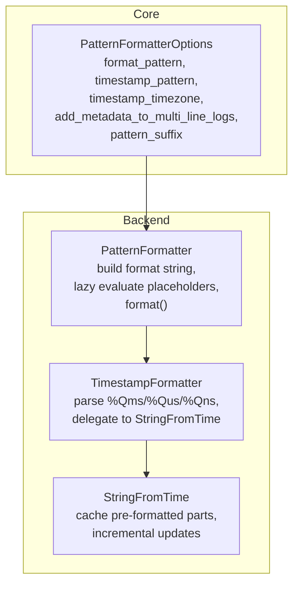
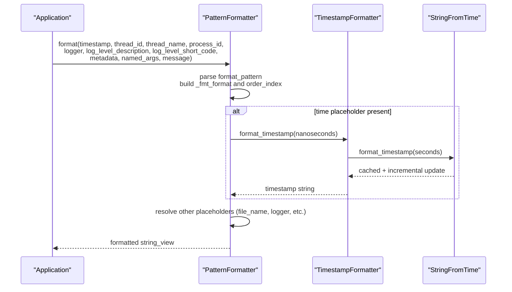
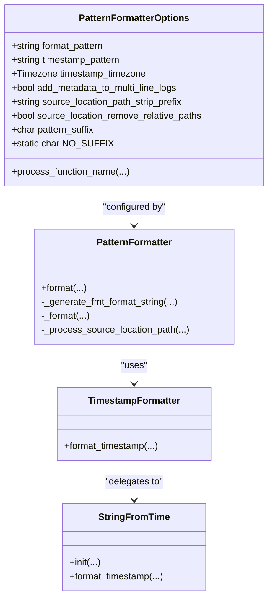
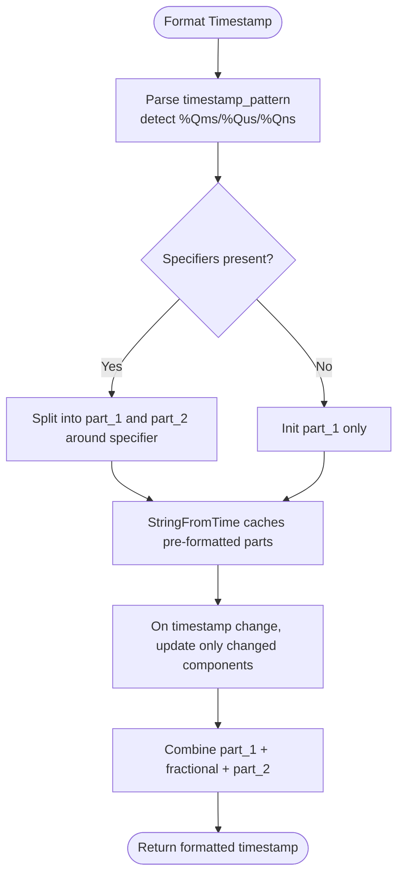

# PatternFormatterOptions

<cite>
**Referenced Files in This Document**
- [PatternFormatterOptions.h](file://include/quill/core/PatternFormatterOptions.h)
- [PatternFormatter.h](file://include/quill/backend/PatternFormatter.h)
- [TimestampFormatter.h](file://include/quill/backend/TimestampFormatter.h)
- [Common.h](file://include/quill/core/Common.h)
- [StringFromTime.h](file://include/quill/backend/StringFromTime.h)
- [formatters.rst](file://docs/formatters.rst)
- [quill_docs_example_custom_format.cpp](file://docs/examples/quill_docs_example_custom_format.cpp)
- [quill_docs_example_json_logging.cpp](file://docs/examples/quill_docs_example_json_logging.cpp)
- [PatternFormatterTest.cpp](file://test/unit_tests/PatternFormatterTest.cpp)
</cite>

## Table of Contents
1. [Introduction](#introduction)
2. [Project Structure](#project-structure)
3. [Core Components](#core-components)
4. [Architecture Overview](#architecture-overview)
5. [Detailed Component Analysis](#detailed-component-analysis)
6. [Dependency Analysis](#dependency-analysis)
7. [Performance Considerations](#performance-considerations)
8. [Troubleshooting Guide](#troubleshooting-guide)
9. [Conclusion](#conclusion)
10. [Appendices](#appendices)

## Introduction
This document provides comprehensive documentation for the PatternFormatterOptions configuration structure used to customize log message formatting in the system. It covers:
- Timestamp format customization, including fractional second precision and timezone selection
- Pattern string syntax and available placeholders for templating log messages
- Output customization including suffix handling, multi-line metadata behavior, and source location path processing
- Locale-awareness and internationalization considerations derived from underlying formatting behavior
- Practical examples for structured logging, human-readable formats, and machine-parseable outputs
- Performance characteristics and best practices for efficient log formatting

## Project Structure
PatternFormatterOptions is part of the core configuration for PatternFormatter, which is implemented in the backend. Timestamp formatting is delegated to TimestampFormatter, which uses StringFromTime for efficient strftime-based caching.

**Diagram sources**
- [PatternFormatterOptions.h:23-168](file://include/quill/core/PatternFormatterOptions.h#L23-L168)
- [PatternFormatter.h:33-608](file://include/quill/backend/PatternFormatter.h#L33-L608)
- [TimestampFormatter.h:38-218](file://include/quill/backend/TimestampFormatter.h#L38-L218)
- [StringFromTime.h:49-494](file://include/quill/backend/StringFromTime.h#L49-L494)

**Section sources**
- [PatternFormatterOptions.h:23-168](file://include/quill/core/PatternFormatterOptions.h#L23-L168)
- [PatternFormatter.h:33-608](file://include/quill/backend/PatternFormatter.h#L33-L608)
- [TimestampFormatter.h:38-218](file://include/quill/backend/TimestampFormatter.h#L38-L218)
- [StringFromTime.h:49-494](file://include/quill/backend/StringFromTime.h#L49-L494)

## Core Components
PatternFormatterOptions encapsulates all user-facing controls for log message formatting:
- format_pattern: Defines the overall structure and placeholders for each log record
- timestamp_pattern: Controls timestamp formatting using strftime-like specifiers plus fractional second specifiers
- timestamp_timezone: Selects LocalTime or GmtTime
- add_metadata_to_multi_line_logs: Whether to repeat metadata on continuation lines for multi-line messages
- pattern_suffix: Character appended to each formatted record; NO_SUFFIX disables appending
- source_location_path_strip_prefix: Removes a common prefix from source_location
- source_location_remove_relative_paths: Normalizes relative path components in source_location
- process_function_name: Optional callback to post-process detailed function names when QUILL_DETAILED_FUNCTION_NAME is enabled

Key placeholder tokens supported in format_pattern:
- time, file_name, full_path, caller_function, log_level, log_level_short_code, line_number, logger, message, thread_id, thread_name, process_id, source_location, short_source_location, tags, named_args

Timestamp fractional second specifiers:
- %Qms (milliseconds), %Qus (microseconds), %Qns (nanoseconds)
- Mutually exclusive with each other

**Section sources**
- [PatternFormatterOptions.h:23-168](file://include/quill/core/PatternFormatterOptions.h#L23-L168)
- [PatternFormatter.h:48-67](file://include/quill/backend/PatternFormatter.h#L48-L67)
- [TimestampFormatter.h:29-92](file://include/quill/backend/TimestampFormatter.h#L29-L92)
- [Common.h:154-160](file://include/quill/core/Common.h#L154-L160)

## Architecture Overview
The formatting pipeline transforms raw log metadata and user messages into a final formatted string using a two-phase process:
1. Pattern preprocessing: The format_pattern is parsed to build a format string compatible with the formatting engine and to determine which placeholders are present (lazy evaluation).
2. Formatting: Values for placeholders are resolved and inserted into the pre-built format string.

**Diagram sources**
- [PatternFormatter.h:97-177](file://include/quill/backend/PatternFormatter.h#L97-L177)
- [PatternFormatter.h:355-466](file://include/quill/backend/PatternFormatter.h#L355-L466)
- [TimestampFormatter.h:122-174](file://include/quill/backend/TimestampFormatter.h#L122-L174)
- [StringFromTime.h:73-207](file://include/quill/backend/StringFromTime.h#L73-L207)

## Detailed Component Analysis

### PatternFormatterOptions
- Purpose: Central configuration for PatternFormatter behavior
- Notable behaviors:
  - NO_SUFFIX sentinel disables trailing suffix appending
  - Equality comparison considers all fields except function pointer address
  - Default format_pattern emphasizes readability with time, thread, source location, level, logger, and message

**Section sources**
- [PatternFormatterOptions.h:23-168](file://include/quill/core/PatternFormatterOptions.h#L23-L168)

### PatternFormatter
- Responsibilities:
  - Parse format_pattern and map placeholders to positional arguments
  - Build a reusable format string and argument ordering for efficient formatting
  - Support multi-line messages with optional metadata repetition
  - Apply pattern_suffix and handle newline trimming semantics
  - Post-process source_location paths and named_args
  - Optionally transform caller_function via process_function_name callback

- Placeholder resolution:
  - Uses a bitset to track which placeholders are present (lazy evaluation)
  - Resolves values from metadata, runtime arguments, and timestamp formatter
  - Formats named_args into a delimited string when present

- Multi-line handling:
  - When add_metadata_to_multi_line_logs is true and no named_args are used, each line receives the full metadata
  - Otherwise, formatting proceeds as a single record

- Buffer reuse:
  - Maintains per-instance buffers to minimize allocations

**Section sources**
- [PatternFormatter.h:33-608](file://include/quill/backend/PatternFormatter.h#L33-L608)

### TimestampFormatter and StringFromTime
- TimestampFormatter:
  - Parses timestamp_pattern to detect %Qms, %Qus, %Qns
  - Splits the format into two strftime parts around the fractional specifier
  - Validates mutual exclusivity of fractional specifiers
  - Delegates to StringFromTime for efficient caching and incremental updates

- StringFromTime:
  - Splits the format into initial parts and caches a pre-formatted string
  - Tracks indices of time modifiers (%H, %M, %S, %I, %k, %l, %s) to update only changed components
  - Recomputes cache at midnight/noon (GMT) or every quarter hour (LocalTime) to handle DST and locale changes
  - Falls back to full strftime when timestamps go backward

**Section sources**
- [TimestampFormatter.h:38-218](file://include/quill/backend/TimestampFormatter.h#L38-L218)
- [StringFromTime.h:49-494](file://include/quill/backend/StringFromTime.h#L49-L494)

### Pattern String Syntax and Placeholders
- Syntax:
  - Placeholders are expressed as %(name[:format-specifier])
  - Format specifiers are passed through to the formatting engine (e.g., alignment/padding)
- Supported placeholders:
  - time, file_name, full_path, caller_function, log_level, log_level_short_code, line_number, logger, message, thread_id, thread_name, process_id, source_location, short_source_location, tags, named_args
- Notes:
  - The same attribute cannot be used twice in the same format pattern
  - Using an invalid attribute triggers an error

**Section sources**
- [PatternFormatterOptions.h:42-70](file://include/quill/core/PatternFormatterOptions.h#L42-L70)
- [PatternFormatter.h:281-311](file://include/quill/backend/PatternFormatter.h#L281-L311)
- [PatternFormatter.h:355-466](file://include/quill/backend/PatternFormatter.h#L355-L466)

### Timestamp Format Customization
- Specifiers:
  - Standard strftime specifiers apply to the portion before %Qms/%Qus/%Qns
  - %Qms, %Qus, %Qns control fractional seconds precision
- Timezone:
  - LocalTime vs GmtTime selection influences cache recalculation cadence and output
- Examples:
  - Nanoseconds precision: "%H:%M:%S.%Qns"
  - Microseconds precision: "%H:%M:%S.%Qus"
  - Milliseconds precision: "%H:%M:%S.%Qms"
  - Date + milliseconds: "%Y-%m-%d %H:%M:%S.%Qms"

**Section sources**
- [TimestampFormatter.h:29-92](file://include/quill/backend/TimestampFormatter.h#L29-L92)
- [PatternFormatterTest.cpp:90-200](file://test/unit_tests/PatternFormatterTest.cpp#L90-L200)

### Output Customization Settings
- pattern_suffix:
  - Defaults to newline; can be customized or disabled using NO_SUFFIX
  - When suffix is not newline, newline characters inside multi-line messages are included in output
- add_metadata_to_multi_line_logs:
  - Controls whether metadata repeats on continuation lines for multi-line messages
- Source location path processing:
  - source_location_path_strip_prefix removes a leading prefix from source_location
  - source_location_remove_relative_paths normalizes relative path segments
- Caller function processing:
  - process_function_name allows custom parsing of detailed function signatures when QUILL_DETAILED_FUNCTION_NAME is enabled

**Section sources**
- [PatternFormatterOptions.h:83-153](file://include/quill/core/PatternFormatterOptions.h#L83-L153)
- [PatternFormatter.h:183-231](file://include/quill/backend/PatternFormatter.h#L183-L231)
- [PatternFormatter.h:97-177](file://include/quill/backend/PatternFormatter.h#L97-L177)

### Locale-Specific Formatting and Internationalization
- Underlying formatting leverages strftime and related mechanisms; however, the code comments and tests emphasize:
  - The use of a classic locale path for certain operations
  - The importance of avoiding unsupported strftime specifiers (notably %X in some environments)
- Practical implication:
  - Prefer widely supported strftime specifiers
  - Avoid locale-dependent specifiers that are not universally available

**Section sources**
- [StringFromTime.h:58-70](file://include/quill/backend/StringFromTime.h#L58-L70)
- [formatters.rst:92-93](file://docs/formatters.rst#L92-L93)

### Examples of Custom Pattern Configurations
- Human-readable console output with UTC timestamps and thread metadata
  - See [quill_docs_example_custom_format.cpp:11-17](file://docs/examples/quill_docs_example_custom_format.cpp#L11-L17)
- Structured logging (JSON) with empty pattern to bypass message formatting
  - See [quill_docs_example_json_logging.cpp:24-26](file://docs/examples/quill_docs_example_json_logging.cpp#L24-L26)
- Unit-tested patterns for message-only, nanoseconds, microseconds, and milliseconds
  - See [PatternFormatterTest.cpp:56-200](file://test/unit_tests/PatternFormatterTest.cpp#L56-L200)

**Section sources**
- [quill_docs_example_custom_format.cpp:11-17](file://docs/examples/quill_docs_example_custom_format.cpp#L11-L17)
- [quill_docs_example_json_logging.cpp:24-26](file://docs/examples/quill_docs_example_json_logging.cpp#L24-L26)
- [PatternFormatterTest.cpp:56-200](file://test/unit_tests/PatternFormatterTest.cpp#L56-L200)

## Dependency Analysis
PatternFormatterOptions drives PatternFormatter, which orchestrates TimestampFormatter and StringFromTime. The relationships are straightforward with minimal coupling.

**Diagram sources**
- [PatternFormatterOptions.h:23-168](file://include/quill/core/PatternFormatterOptions.h#L23-L168)
- [PatternFormatter.h:33-608](file://include/quill/backend/PatternFormatter.h#L33-L608)
- [TimestampFormatter.h:38-218](file://include/quill/backend/TimestampFormatter.h#L38-L218)
- [StringFromTime.h:49-494](file://include/quill/backend/StringFromTime.h#L49-L494)

**Section sources**
- [PatternFormatterOptions.h:23-168](file://include/quill/core/PatternFormatterOptions.h#L23-L168)
- [PatternFormatter.h:33-608](file://include/quill/backend/PatternFormatter.h#L33-L608)
- [TimestampFormatter.h:38-218](file://include/quill/backend/TimestampFormatter.h#L38-L218)
- [StringFromTime.h:49-494](file://include/quill/backend/StringFromTime.h#L49-L494)

## Performance Considerations
- Lazy evaluation:
  - PatternFormatter tracks which placeholders are present and resolves only those values, reducing overhead
- Pre-built format string:
  - The format string and argument order are computed once per PatternFormatterOptions instance
- Buffer reuse:
  - Per-instance buffers minimize dynamic allocations during formatting
- Timestamp caching:
  - StringFromTime caches pre-formatted parts and updates only changed components, recalculated at predictable intervals
- Multi-line handling:
  - When add_metadata_to_multi_line_logs is true, repeated formatting work is performed; disabling it reduces overhead for multi-line messages
- Suffix behavior:
  - Using NO_SUFFIX avoids appending extra characters; newline suffix trimming prevents duplicate newlines

Best practices:
- Keep format_pattern concise and include only required placeholders
- Use NO_SUFFIX when building structured outputs to avoid extra characters
- Prefer simpler timestamp patterns (e.g., HH:MM:SS) when high-frequency logging demands low overhead
- Avoid overly complex format specifiers that increase parsing overhead

**Section sources**
- [PatternFormatter.h:468-588](file://include/quill/backend/PatternFormatter.h#L468-L588)
- [StringFromTime.h:73-207](file://include/quill/backend/StringFromTime.h#L73-L207)
- [PatternFormatterTest.cpp:881-923](file://test/unit_tests/PatternFormatterTest.cpp#L881-L923)

## Troubleshooting Guide
- Invalid format pattern:
  - Using the same attribute twice or referencing an unknown attribute raises an error
- Unsupported strftime specifiers:
  - Some specifiers (e.g., %X) are not supported; ensure compatibility with your platform
- Conflicting fractional second specifiers:
  - %Qms, %Qus, and %Qns are mutually exclusive; mixing them triggers an error
- Unexpected suffix characters:
  - Verify pattern_suffix and NO_SUFFIX usage; newline trimming behavior differs from custom suffixes

**Section sources**
- [PatternFormatter.h:444-447](file://include/quill/backend/PatternFormatter.h#L444-L447)
- [TimestampFormatter.h:73-92](file://include/quill/backend/TimestampFormatter.h#L73-L92)
- [StringFromTime.h:58-61](file://include/quill/backend/StringFromTime.h#L58-L61)
- [PatternFormatterTest.cpp:881-923](file://test/unit_tests/PatternFormatterTest.cpp#L881-L923)

## Conclusion
PatternFormatterOptions provides a flexible and efficient mechanism to tailor log message formatting. By combining configurable placeholders, precise timestamp formatting with fractional seconds, and careful output customization, applications can achieve human-readable logs, structured outputs, and high-performance logging pipelines. Adhering to the best practices outlined above ensures maintainable and performant logging configurations.

## Appendices

### Appendix A: Timestamp Precision Flow

**Diagram sources**
- [TimestampFormatter.h:51-119](file://include/quill/backend/TimestampFormatter.h#L51-L119)
- [StringFromTime.h:255-318](file://include/quill/backend/StringFromTime.h#L255-L318)