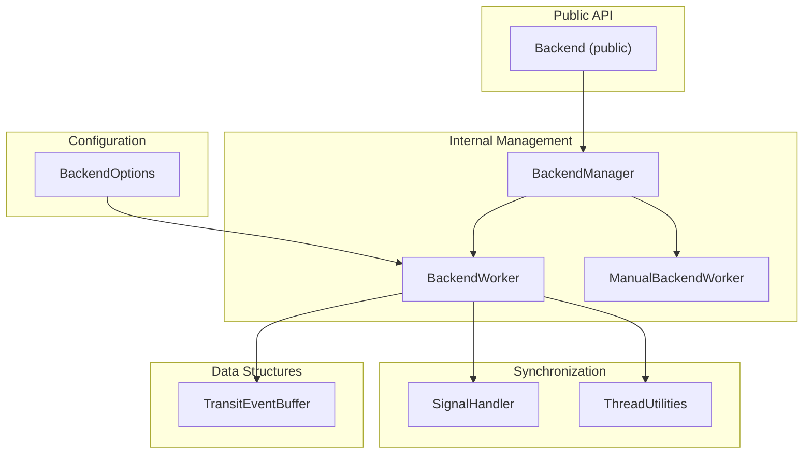
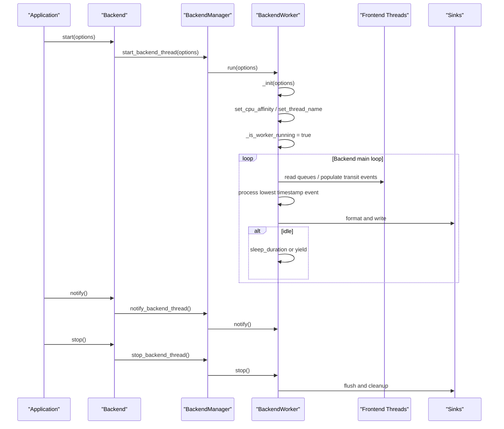
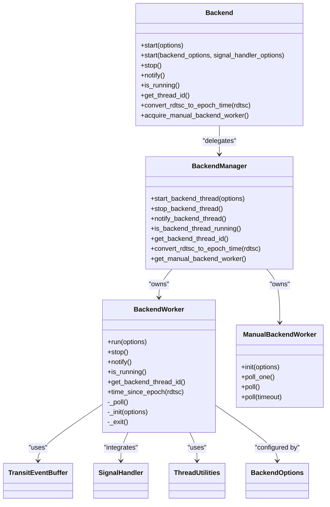

# Backend Class

<cite>
**Referenced Files in This Document**
- [Backend.h](file://include/quill/Backend.h)
- [BackendManager.h](file://include/quill/backend/BackendManager.h)
- [BackendWorker.h](file://include/quill/backend/BackendWorker.h)
- [BackendOptions.h](file://include/quill/backend/BackendOptions.h)
- [ManualBackendWorker.h](file://include/quill/backend/ManualBackendWorker.h)
- [TransitEventBuffer.h](file://include/quill/backend/TransitEventBuffer.h)
- [SignalHandler.h](file://include/quill/backend/SignalHandler.h)
- [ThreadUtilities.h](file://include/quill/backend/ThreadUtilities.h)
- [backend_thread_notify.cpp](file://examples/backend_thread_notify.cpp)
- [custom_frontend_options.cpp](file://examples/custom_frontend_options.cpp)
- [StartStopBackendWorkerTest.cpp](file://test/integration_tests/StartStopBackendWorkerTest.cpp)
</cite>

## Table of Contents
1. [Introduction](#introduction)
2. [Project Structure](#project-structure)
3. [Core Components](#core-components)
4. [Architecture Overview](#architecture-overview)
5. [Detailed Component Analysis](#detailed-component-analysis)
6. [Dependency Analysis](#dependency-analysis)
7. [Performance Considerations](#performance-considerations)
8. [Troubleshooting Guide](#troubleshooting-guide)
9. [Conclusion](#conclusion)
10. [Appendices](#appendices)

## Introduction
This document provides comprehensive API documentation for the Backend class, focusing on backend thread management, startup and shutdown procedures, configuration options, and the relationship between frontend and backend components. It explains the BackendWorker implementation, thread lifecycle management, coordination with frontend queues, and synchronization mechanisms. It also covers BackendOptions configuration (including thread priority, CPU affinity, and performance tuning), usage patterns, thread-safety guarantees, resource cleanup, and optimization strategies for high-throughput logging.

## Project Structure
The Backend class is the primary public interface for managing the logging backend thread. Internally, it delegates to BackendManager, which owns a BackendWorker instance. The BackendWorker manages the actual thread lifecycle, queue processing, formatting, and sink dispatch. Configuration is provided via BackendOptions, and optional signal handling is integrated via SignalHandler.

**Diagram sources**
- [Backend.h:29-244](file://include/quill/Backend.h#L29-L244)
- [BackendManager.h:38-128](file://include/quill/backend/BackendManager.h#L38-L128)
- [BackendWorker.h:77-207](file://include/quill/backend/BackendWorker.h#L77-L207)
- [BackendOptions.h:30-281](file://include/quill/backend/BackendOptions.h#L30-L281)
- [ManualBackendWorker.h:19-118](file://include/quill/backend/ManualBackendWorker.h#L19-L118)
- [TransitEventBuffer.h:19-157](file://include/quill/backend/TransitEventBuffer.h#L19-L157)
- [SignalHandler.h:50-138](file://include/quill/backend/SignalHandler.h#L50-L138)
- [ThreadUtilities.h:148-226](file://include/quill/backend/ThreadUtilities.h#L148-L226)

**Section sources**
- [Backend.h:29-244](file://include/quill/Backend.h#L29-L244)
- [BackendManager.h:38-128](file://include/quill/backend/BackendManager.h#L38-L128)

## Core Components
- Backend: Public API for starting/stopping the backend thread, notifying the backend, checking status, retrieving thread ID, converting TSC to epoch time, and acquiring a ManualBackendWorker.
- BackendManager: Singleton that owns BackendWorker and ManualBackendWorker, exposes thread lifecycle and notification APIs, and manages atexit registration.
- BackendWorker: Implements the backend thread main loop, queue processing, formatting, sink dispatch, and cleanup routines.
- BackendOptions: Configuration struct controlling thread name, idle behavior, sleep duration, transit event buffer sizing, timestamp ordering, CPU affinity, error callbacks, hooks, RDTSC resync interval, sink flush intervals, printable character checks, log level descriptors, and singleton instance checks.
- ManualBackendWorker: Allows running the backend worker on a user-supplied thread with explicit polling control.
- TransitEventBuffer: Circular buffer for cached log events between frontend queues and backend processing.
- SignalHandler: Optional built-in signal handler integration for graceful shutdown and logging on fatal signals.
- ThreadUtilities: Cross-platform helpers for thread naming and thread ID retrieval.

**Section sources**
- [Backend.h:29-244](file://include/quill/Backend.h#L29-L244)
- [BackendManager.h:38-128](file://include/quill/backend/BackendManager.h#L38-L128)
- [BackendWorker.h:77-207](file://include/quill/backend/BackendWorker.h#L77-L207)
- [BackendOptions.h:30-281](file://include/quill/backend/BackendOptions.h#L30-L281)
- [ManualBackendWorker.h:19-118](file://include/quill/backend/ManualBackendWorker.h#L19-L118)
- [TransitEventBuffer.h:19-157](file://include/quill/backend/TransitEventBuffer.h#L19-L157)
- [SignalHandler.h:50-138](file://include/quill/backend/SignalHandler.h#L50-L138)
- [ThreadUtilities.h:148-226](file://include/quill/backend/ThreadUtilities.h#L148-L226)

## Architecture Overview
The Backend class provides a thin public facade. Internally, BackendManager coordinates the backend thread lifecycle and exposes thread-safe operations. The BackendWorker performs the heavy lifting: it polls frontend queues, deserializes messages into TransitEvents, orders them by timestamp, formats them, and dispatches to sinks. BackendOptions controls performance and behavior. Optional signal handling integrates with the backend thread for robust crash reporting.

**Diagram sources**
- [Backend.h:36-143](file://include/quill/Backend.h#L36-L143)
- [BackendManager.h:61-81](file://include/quill/backend/BackendManager.h#L61-L81)
- [BackendWorker.h:138-232](file://include/quill/backend/BackendWorker.h#L138-L232)
- [BackendWorker.h:305-395](file://include/quill/backend/BackendWorker.h#L305-L395)

## Detailed Component Analysis

### Backend API
- start(BackendOptions): Starts the backend thread once, initializes signal handler context if needed, registers atexit handler to stop on process exit, and blocks until the backend thread enters its main loop.
- start(BackendOptions, SignalHandlerOptions): Overload that installs a built-in signal handler, configures signal handler context with logger name, excluded substrings, and timeout, and ensures signals are handled safely across platforms.
- stop(): Stops the backend thread, resets backend thread ID, and deinitializes the signal handler.
- notify(): Wakes the backend thread from sleep or processing to process queued messages.
- is_running(): Returns whether the backend thread is currently running.
- get_thread_id(): Returns the backend thread ID.
- convert_rdtsc_to_epoch_time(uint64_t): Converts an RDTSC value to epoch time using the backend’s clock.
- acquire_manual_backend_worker(): Acquires a ManualBackendWorker for manual thread control; can only be called once per process and only if the default backend thread has not been started.

Thread-safety:
- All public methods are thread-safe except acquire_manual_backend_worker(), which enforces single-use and mutual exclusion with default backend startup.

Lifecycle guarantees:
- Startup is guarded by a once-flag to ensure single backend thread per process.
- atexit handler ensures stop() is called on process exit, enabling flush and cleanup.

**Section sources**
- [Backend.h:36-143](file://include/quill/Backend.h#L36-L143)
- [Backend.h:149-243](file://include/quill/Backend.h#L149-L243)
- [BackendManager.h:68-127](file://include/quill/backend/BackendManager.h#L68-L127)

### BackendManager
- Exposes thread lifecycle operations to Backend: start_backend_thread, stop_backend_thread, notify_backend_thread, is_backend_thread_running, get_backend_thread_id, convert_rdtsc_to_epoch_time, and get_manual_backend_worker.
- Manages a once_flag to ensure single backend thread initialization.
- Tracks atexit registration to avoid duplicate handlers.

**Section sources**
- [BackendManager.h:61-128](file://include/quill/backend/BackendManager.h#L61-L128)

### BackendWorker
Responsibilities:
- Thread lifecycle: run(options), stop(), notify(), is_running(), get_backend_thread_id(), time_since_epoch().
- Main loop: _poll() orchestrates queue reading, event caching, timestamp ordering, formatting, sink dispatch, periodic tasks, and idle handling.
- Event processing: _populate_transit_events_from_frontend_queues(), _populate_transit_event_from_frontend_queue(), _process_lowest_timestamp_transit_event(), _process_transit_event(), _dispatch_transit_event_to_sinks(), _write_log_statement().
- Periodic maintenance: _flush_and_run_active_sinks(), _resync_rdtsc_clock(), _check_failure_counter(), _cleanup_invalidated_thread_contexts(), _cleanup_invalidated_loggers(), _try_shrink_empty_transit_event_buffers().
- Initialization and exit: _init(options), _exit().

Key behaviors:
- Queue reading: Iterates all active frontend thread contexts, reads from unbounded or bounded SPSC queues, decodes messages into TransitEvents, and applies timestamp ordering grace period.
- Timestamp ordering: Uses a grace period to avoid out-of-order logs when threads push at different times.
- Formatting and sinks: Lazily creates PatternFormatter instances per logger or per sink override, applies filters, and writes to sinks.
- Idle handling: Sleeps for sleep_duration or yields when enable_yield_when_idle is true; resyncs RDTSC clock and shrinks buffers when idle.
- Error handling: Routes exceptions to error_notifier; continues processing to avoid stalls.

**Section sources**
- [BackendWorker.h:138-232](file://include/quill/backend/BackendWorker.h#L138-L232)
- [BackendWorker.h:305-395](file://include/quill/backend/BackendWorker.h#L305-L395)
- [BackendWorker.h:479-573](file://include/quill/backend/BackendWorker.h#L479-L573)
- [BackendWorker.h:795-864](file://include/quill/backend/BackendWorker.h#L795-L864)
- [BackendWorker.h:869-1004](file://include/quill/backend/BackendWorker.h#L869-L1004)
- [BackendWorker.h:1284-1362](file://include/quill/backend/BackendWorker.h#L1284-L1362)
- [BackendWorker.h:1367-1388](file://include/quill/backend/BackendWorker.h#L1367-L1388)
- [BackendWorker.h:1396-1490](file://include/quill/backend/BackendWorker.h#L1396-L1490)

### BackendOptions
Configuration highlights:
- Thread identity: thread_name, enable_yield_when_idle, sleep_duration.
- Transit event buffering: transit_event_buffer_initial_capacity, transit_events_soft_limit, transit_events_hard_limit (must be powers of two; soft ≤ hard).
- Timestamp ordering: log_timestamp_ordering_grace_period (microseconds) to enforce ordering across threads.
- Shutdown behavior: wait_for_queues_to_empty_before_exit.
- CPU affinity: cpu_affinity (default max uint16 to disable).
- Error handling: error_notifier callback.
- Hooks: backend_worker_on_poll_begin, backend_worker_on_poll_end.
- RDTSC: rdtsc_resync_interval (milliseconds).
- Sink flush: sink_min_flush_interval (milliseconds).
- Safety: check_printable_char predicate.
- Log levels: log_level_descriptions and log_level_short_codes arrays.
- Singleton safety: check_backend_singleton_instance.

Notes:
- Invalid limits cause exceptions during initialization.
- RDTSC clock requires resync interval to be greater than backend sleep duration.

**Section sources**
- [BackendOptions.h:30-281](file://include/quill/backend/BackendOptions.h#L30-L281)

### ManualBackendWorker
- init(BackendOptions): Initializes for manual control; disables sleep_duration and enable_yield_when_idle.
- poll_one(): Performs a single _poll cycle; asserts thread identity and initialization.
- poll(): Repeatedly polls until all queues and cached events are empty.
- poll(microseconds): Polls with a timeout.
- Destructor: Ensures _exit() is called if started.

Usage constraints:
- Must be used by a single thread.
- Cannot be used with built-in signal handler.
- Certain BackendOptions are unsupported (cpu_affinity, thread_name, sleep_duration, enable_yield_when_idle).

**Section sources**
- [ManualBackendWorker.h:43-118](file://include/quill/backend/ManualBackendWorker.h#L43-L118)

### TransitEventBuffer
- Circular buffer storing TransitEvents with power-of-two capacity.
- Supports front/pop_front/back/push_back semantics.
- Expands when full; can shrink empty buffers to initial capacity.
- Used per-thread to cache events read from frontend queues.

**Section sources**
- [TransitEventBuffer.h:19-157](file://include/quill/backend/TransitEventBuffer.h#L19-L157)

### SignalHandler and ThreadUtilities
- SignalHandlerOptions: catchable_signals, timeout_seconds, logger_name, excluded_logger_substrings.
- SignalHandlerContext: stores logger selection, backend thread ID, timeouts, and registered handlers.
- Platform-specific handlers: Windows exception and console handlers; POSIX signal handlers with alarm fallback.
- ThreadUtilities: get_thread_name(), get_thread_id(), and dynamic linking helpers on Windows.

Integration:
- Backend::start overload configures SignalHandlerContext and installs handlers before starting the backend thread.
- Backend::stop deinitializes handlers and restores defaults.

**Section sources**
- [SignalHandler.h:50-138](file://include/quill/backend/SignalHandler.h#L50-L138)
- [SignalHandler.h:154-248](file://include/quill/backend/SignalHandler.h#L154-L248)
- [SignalHandler.h:412-424](file://include/quill/backend/SignalHandler.h#L412-L424)
- [ThreadUtilities.h:148-226](file://include/quill/backend/ThreadUtilities.h#L148-L226)

## Dependency Analysis

**Diagram sources**
- [Backend.h:29-244](file://include/quill/Backend.h#L29-L244)
- [BackendManager.h:38-128](file://include/quill/backend/BackendManager.h#L38-L128)
- [BackendWorker.h:77-207](file://include/quill/backend/BackendWorker.h#L77-L207)
- [ManualBackendWorker.h:19-118](file://include/quill/backend/ManualBackendWorker.h#L19-L118)
- [BackendOptions.h:30-281](file://include/quill/backend/BackendOptions.h#L30-L281)
- [TransitEventBuffer.h:19-157](file://include/quill/backend/TransitEventBuffer.h#L19-L157)
- [SignalHandler.h:50-138](file://include/quill/backend/SignalHandler.h#L50-L138)
- [ThreadUtilities.h:148-226](file://include/quill/backend/ThreadUtilities.h#L148-L226)

**Section sources**
- [Backend.h:29-244](file://include/quill/Backend.h#L29-L244)
- [BackendManager.h:38-128](file://include/quill/backend/BackendManager.h#L38-L128)
- [BackendWorker.h:77-207](file://include/quill/backend/BackendWorker.h#L77-L207)

## Performance Considerations
- Queue sizing: transit_events_hard_limit and transit_events_soft_limit should be powers of two; adjust based on expected throughput and latency targets.
- Timestamp ordering: log_timestamp_ordering_grace_period trades off ordering correctness for processing speed; larger values reduce out-of-order messages but increase queue pressure at high rates.
- Idle strategy: sleep_duration vs enable_yield_when_idle; choose sleep for lower CPU usage, yield for better responsiveness when queues are often empty.
- RDTSC resync: rdtsc_resync_interval balances accuracy and overhead; smaller intervals improve timestamp accuracy but incur more system clock calls.
- Sink flush: sink_min_flush_interval reduces flush frequency; set to 0 to flush whenever idle, or tune for throughput vs latency.
- CPU affinity: cpu_affinity can reduce context switching overhead; pin backend to a non-critical CPU.
- Error notifier: frequent notifications (e.g., queue reallocations) can impact performance; monitor and adjust thresholds.
- Named arguments: formatting named args incurs extra work; minimize complex formatting when throughput is critical.

[No sources needed since this section provides general guidance]

## Troubleshooting Guide
Common issues and resolutions:
- Multiple backend threads: Enable check_backend_singleton_instance to detect and prevent multiple backend instances.
- Out-of-order logs: Increase log_timestamp_ordering_grace_period; ensure frontend threads do not excessively delay pushing to queues.
- Deadlocks with ManualBackendWorker: Do not call logger->flush_log() from the ManualBackendWorker thread; avoid concurrent poll() calls.
- Signal handler conflicts: Built-in signal handler overrides process handlers; ensure each thread meets signal handler prerequisites on POSIX.
- Queue drops or blocking: Monitor failure counters reported by error_notifier; consider increasing queue capacity or switching to dropping queues.
- High CPU usage: Reduce sleep_duration or enable yield; adjust sink_min_flush_interval; disable excessive formatting.

**Section sources**
- [BackendOptions.h:279-281](file://include/quill/backend/BackendOptions.h#L279-L281)
- [BackendWorker.h:1074-1105](file://include/quill/backend/BackendWorker.h#L1074-L1105)
- [ManualBackendWorker.h:196-207](file://include/quill/backend/ManualBackendWorker.h#L196-L207)
- [SignalHandler.h:65-78](file://include/quill/backend/SignalHandler.h#L65-L78)

## Conclusion
The Backend class provides a robust, configurable, and thread-safe interface for managing the logging backend. BackendManager encapsulates thread lifecycle and coordination, while BackendWorker implements efficient queue processing, timestamp ordering, formatting, and sink dispatch. BackendOptions offers extensive tuning knobs for performance and reliability. Optional signal handling improves crash reporting and graceful shutdown. ManualBackendWorker enables advanced control for specialized scenarios. Proper configuration and monitoring ensure high-throughput, low-latency logging with predictable resource usage.

[No sources needed since this section summarizes without analyzing specific files]

## Appendices

### Usage Examples and Patterns
- Basic initialization and shutdown:
  - Start backend with default options, log some messages, then stop.
  - Reference: [StartStopBackendWorkerTest.cpp:24-56](file://test/integration_tests/StartStopBackendWorkerTest.cpp#L24-L56)
- Long sleep duration with manual wake-up:
  - Configure sleep_duration to a large value and call notify() to process logs promptly.
  - Reference: [backend_thread_notify.cpp:24-55](file://examples/backend_thread_notify.cpp#L24-L55)
- Custom FrontendOptions with Backend:
  - Define custom FrontendOptions and use them alongside Backend::start.
  - Reference: [custom_frontend_options.cpp:14-33](file://examples/custom_frontend_options.cpp#L14-L33)

**Section sources**
- [StartStopBackendWorkerTest.cpp:24-56](file://test/integration_tests/StartStopBackendWorkerTest.cpp#L24-L56)
- [backend_thread_notify.cpp:24-55](file://examples/backend_thread_notify.cpp#L24-L55)
- [custom_frontend_options.cpp:14-33](file://examples/custom_frontend_options.cpp#L14-L33)

### API Reference Summary
- Backend::start(BackendOptions)
- Backend::start(BackendOptions, SignalHandlerOptions)
- Backend::stop()
- Backend::notify()
- Backend::is_running()
- Backend::get_thread_id()
- Backend::convert_rdtsc_to_epoch_time(uint64_t)
- Backend::acquire_manual_backend_worker()
- BackendManager: start_backend_thread, stop_backend_thread, notify_backend_thread, is_backend_thread_running, get_backend_thread_id, convert_rdtsc_to_epoch_time, get_manual_backend_worker
- BackendWorker: run, stop, notify, is_running, get_backend_thread_id, time_since_epoch, _poll, _init, _exit
- BackendOptions: thread_name, enable_yield_when_idle, sleep_duration, transit_event_buffer_initial_capacity, transit_events_soft_limit, transit_events_hard_limit, log_timestamp_ordering_grace_period, wait_for_queues_to_empty_before_exit, cpu_affinity, error_notifier, backend_worker_on_poll_begin, backend_worker_on_poll_end, rdtsc_resync_interval, sink_min_flush_interval, check_printable_char, log_level_descriptions, log_level_short_codes, check_backend_singleton_instance
- ManualBackendWorker: init, poll_one, poll, poll(timeout)
- TransitEventBuffer: front, pop_front, back, push_back, size, capacity, empty, request_shrink, try_shrink
- SignalHandlerOptions: catchable_signals, timeout_seconds, logger_name, excluded_logger_substrings
- SignalHandlerContext: logger_name, excluded_logger_substrings, backend_thread_id, signal_handler_timeout_seconds
- ThreadUtilities: get_thread_name, get_thread_id

**Section sources**
- [Backend.h:36-243](file://include/quill/Backend.h#L36-L243)
- [BackendManager.h:61-128](file://include/quill/backend/BackendManager.h#L61-L128)
- [BackendWorker.h:138-232](file://include/quill/backend/BackendWorker.h#L138-L232)
- [BackendWorker.h:305-395](file://include/quill/backend/BackendWorker.h#L305-L395)
- [BackendOptions.h:30-281](file://include/quill/backend/BackendOptions.h#L30-L281)
- [ManualBackendWorker.h:43-118](file://include/quill/backend/ManualBackendWorker.h#L43-L118)
- [TransitEventBuffer.h:72-157](file://include/quill/backend/TransitEventBuffer.h#L72-L157)
- [SignalHandler.h:50-88](file://include/quill/backend/SignalHandler.h#L50-L88)
- [SignalHandler.h:93-138](file://include/quill/backend/SignalHandler.h#L93-L138)
- [ThreadUtilities.h:148-226](file://include/quill/backend/ThreadUtilities.h#L148-L226)