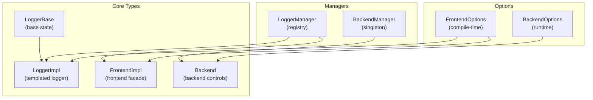
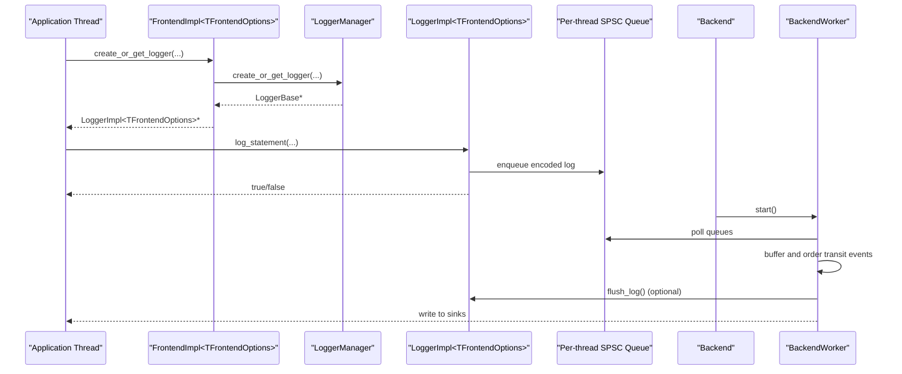
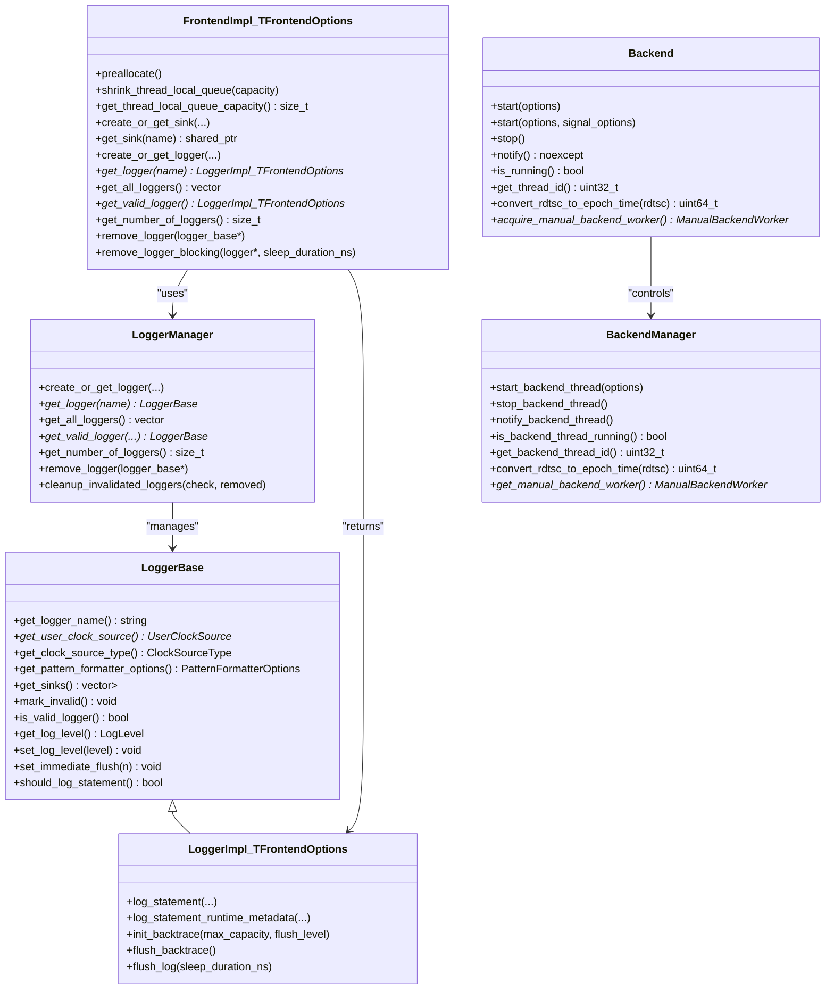
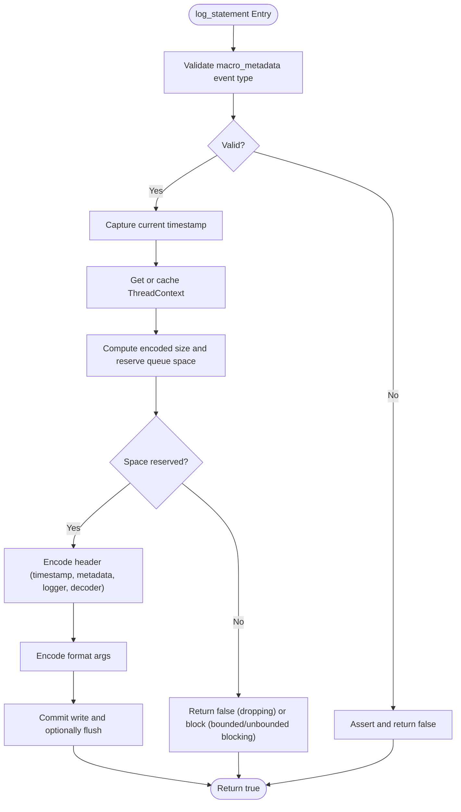
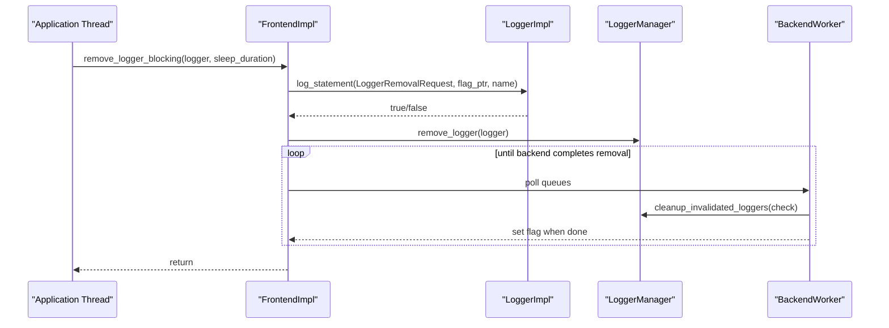
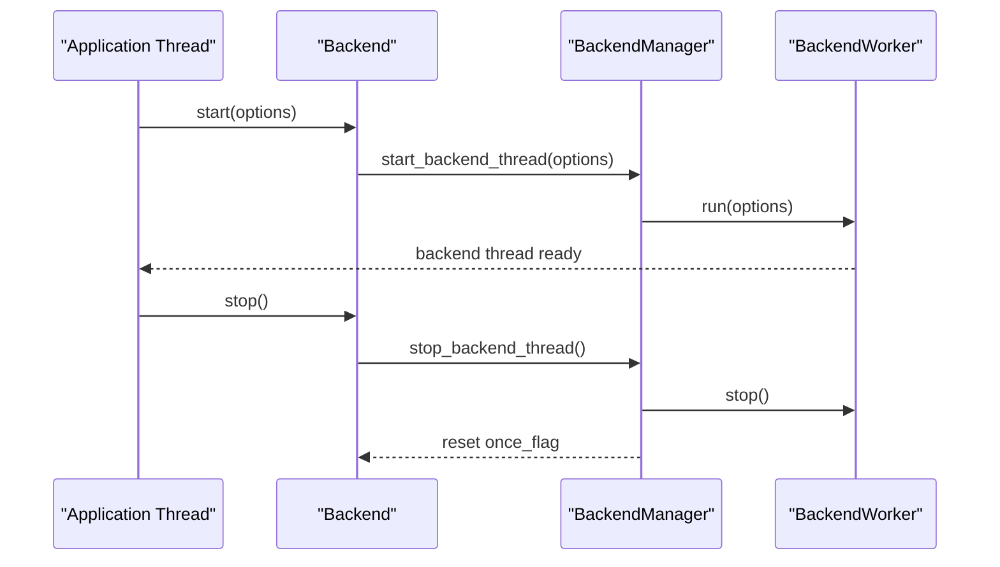
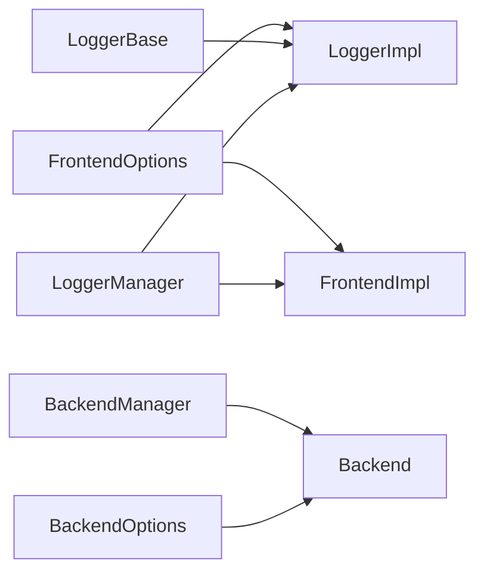

# Core Classes

<cite>
**Referenced Files in This Document**
- [Logger.h](file://include/quill/Logger.h)
- [Frontend.h](file://include/quill/Frontend.h)
- [Backend.h](file://include/quill/Backend.h)
- [BackendManager.h](file://include/quill/backend/BackendManager.h)
- [LoggerManager.h](file://include/quill/core/LoggerManager.h)
- [LoggerBase.h](file://include/quill/core/LoggerBase.h)
- [FrontendOptions.h](file://include/quill/core/FrontendOptions.h)
- [BackendOptions.h](file://include/quill/backend/BackendOptions.h)
- [quill_docs_example_basic.cpp](file://docs/examples/quill_docs_example_basic.cpp)
- [quill_docs_example_loggers_remove.cpp](file://docs/examples/quill_docs_example_loggers_remove.cpp)
- [custom_frontend_options.cpp](file://examples/custom_frontend_options.cpp)
</cite>

## Table of Contents
1. [Introduction](#introduction)
2. [Project Structure](#project-structure)
3. [Core Components](#core-components)
4. [Architecture Overview](#architecture-overview)
5. [Detailed Component Analysis](#detailed-component-analysis)
6. [Dependency Analysis](#dependency-analysis)
7. [Performance Considerations](#performance-considerations)
8. [Troubleshooting Guide](#troubleshooting-guide)
9. [Conclusion](#conclusion)

## Introduction
This document provides comprehensive API documentation for Quill’s core classes focused on logging infrastructure: Logger, Backend, and Frontend. It covers:
- Logger class template with all methods including log_statement(), log_statement_runtime_metadata(), init_backtrace(), flush_backtrace(), and flush_log().
- Backend class API for backend thread lifecycle, configuration, and manual worker usage.
- Frontend class API for logger and sink creation/manipulation, including create_or_get_logger(), remove_logger(), and get_logger().

It explains template parameters, type aliases, thread-safety guarantees, lifetime management, resource cleanup, and provides usage examples and integration patterns.

## Project Structure
The core APIs are defined across several header files:
- Logger and LoggerBase: logging interface and base state
- Frontend: logger and sink management facade
- Backend: backend thread lifecycle and controls
- BackendManager: internal singleton coordinating backend worker
- LoggerManager: registry and lifecycle of loggers
- FrontendOptions and BackendOptions: compile-time and runtime configuration

**Diagram sources**
- [LoggerBase.h:35-207](file://include/quill/core/LoggerBase.h#L35-L207)
- [Logger.h:47-507](file://include/quill/Logger.h#L47-L507)
- [Frontend.h:32-371](file://include/quill/Frontend.h#L32-L371)
- [Backend.h:29-244](file://include/quill/Backend.h#L29-L244)
- [BackendManager.h:38-128](file://include/quill/backend/BackendManager.h#L38-L128)
- [LoggerManager.h:33-307](file://include/quill/core/LoggerManager.h#L33-L307)
- [FrontendOptions.h:16-50](file://include/quill/core/FrontendOptions.h#L16-L50)
- [BackendOptions.h:30-281](file://include/quill/backend/BackendOptions.h#L30-L281)

**Section sources**
- [Logger.h:1-508](file://include/quill/Logger.h#L1-L508)
- [Frontend.h:1-373](file://include/quill/Frontend.h#L1-L373)
- [Backend.h:1-246](file://include/quill/Backend.h#L1-L246)
- [BackendManager.h:1-136](file://include/quill/backend/BackendManager.h#L1-L136)
- [LoggerManager.h:1-311](file://include/quill/core/LoggerManager.h#L1-L311)
- [LoggerBase.h:1-210](file://include/quill/core/LoggerBase.h#L1-L210)
- [FrontendOptions.h:1-52](file://include/quill/core/FrontendOptions.h#L1-L52)
- [BackendOptions.h:1-283](file://include/quill/backend/BackendOptions.h#L1-L283)

## Core Components
- LoggerImpl<TFrontendOptions>: Thread-safe logger with templated front-end options. Exposes:
  - log_statement() and log_statement_runtime_metadata() for fast, hot-path logging
  - init_backtrace(), flush_backtrace() for backtrace capture and emission
  - flush_log() for blocking until backend flush completes
- FrontendImpl<TFrontendOptions>: Facade for logger and sink management:
  - create_or_get_logger(), create_or_get_sink(), get_logger(), get_all_loggers(), get_valid_logger()
  - remove_logger(), remove_logger_blocking()
  - preallocate(), shrink_thread_local_queue(), get_thread_local_queue_capacity()
- Backend: Controls backend thread lifecycle and manual worker acquisition:
  - start(), start(BackendOptions, SignalHandlerOptions), stop(), notify(), is_running(), get_thread_id()
  - convert_rdtsc_to_epoch_time(), acquire_manual_backend_worker()

Key type aliases:
- Logger = LoggerImpl<FrontendOptions>
- Frontend = FrontendImpl<FrontendOptions>

Template parameters and options:
- TFrontendOptions: compile-time configuration affecting queue behavior, capacities, and memory policy
- FrontendOptions: compile-time defaults for queue_type, initial_queue_capacity, blocking_queue_retry_interval_ns, unbounded_queue_max_capacity, huge_pages_policy
- BackendOptions: runtime configuration for thread name, sleep behavior, transit buffer sizes, timestamp ordering grace period, CPU affinity, error notifier hooks, and printable character checks

Thread-safety highlights:
- Logger methods are thread-safe for concurrent callers.
- Frontend::remove_logger() is thread-safe but removal must be coordinated; concurrent removal from multiple threads is unsafe.
- Backend::start()/stop() are guarded by a once-flag and atexit integration.

**Section sources**
- [Logger.h:47-507](file://include/quill/Logger.h#L47-L507)
- [Frontend.h:32-371](file://include/quill/Frontend.h#L32-L371)
- [Backend.h:29-244](file://include/quill/Backend.h#L29-L244)
- [FrontendOptions.h:16-50](file://include/quill/core/FrontendOptions.h#L16-L50)
- [BackendOptions.h:30-281](file://include/quill/backend/BackendOptions.h#L30-L281)

## Architecture Overview
High-level flow:
- Frontend creates or retrieves loggers and sinks, then enqueues formatted log entries into per-thread SPSC queues.
- Backend polls frontend queues, buffers transit events, orders by timestamp, and writes to sinks.
- Logger methods support backtrace capture and explicit flush semantics.

**Diagram sources**
- [Frontend.h:148-198](file://include/quill/Frontend.h#L148-L198)
- [LoggerManager.h:152-198](file://include/quill/core/LoggerManager.h#L152-L198)
- [Logger.h:75-136](file://include/quill/Logger.h#L75-L136)
- [Backend.h:36-57](file://include/quill/Backend.h#L36-L57)
- [BackendManager.h:61-90](file://include/quill/backend/BackendManager.h#L61-L90)

## Detailed Component Analysis

### Logger Class Template
- Purpose: Thread-safe logging with hot-path encoding and queue-backed delivery to backend.
- Template parameter: TFrontendOptions (compile-time queue and memory policy).
- Type alias: Logger = LoggerImpl<FrontendOptions>.

Key methods and behaviors:
- log_statement<META>(macro_metadata, fmt_args...)
  - Signature: template <bool enable_immediate_flush, typename... Args> bool
  - Parameters: macro_metadata (compile-time event), variadic fmt_args
  - Behavior: reserves queue space, encodes header and payload, commits write; supports immediate flush threshold
  - Thread-safety: guaranteed for concurrent callers
  - Return: true if written, false if dropped (dropping queues)
- log_statement_runtime_metadata<META>(macro_metadata, fmt, file_path, function_name, tags, line_number, log_level, fmt_args...)
  - Signature: template <bool enable_immediate_flush, typename... Args> bool
  - Parameters: runtime metadata fields plus variadic args
  - Behavior: similar to log_statement but encodes runtime metadata variants (deep/shallow/hybrid)
  - Thread-safety: guaranteed
  - Return: true if written, false if dropped
- init_backtrace(max_capacity, flush_level)
  - Initializes backtrace storage for this logger; stores capacity and flush level
  - Thread-safety: safe to call from any thread; uses non-dropping enqueue
- flush_backtrace()
  - Emits stored backtrace messages; uses non-dropping enqueue
  - Thread-safety: safe to call from any thread
- flush_log(sleep_duration_ns)
  - Blocks caller until backend flushes all messages up to the current timestamp
  - Uses a coordination flag; caller retries with sleep_duration_ns or yields
  - Thread-safety: safe to call from any thread; avoid from static destructors due to TSC context lifetime

Thread-safety and lifetime:
- Logger maintains atomic flags for validity, flush thresholds, and backtrace flush level.
- LoggerBase holds shared ownership of sinks and formatter options; sinks are shared and owned by managers.
- Logger is invalidated asynchronously via LoggerManager; consumers should not use invalidated loggers.

Usage examples:
- Basic usage: [quill_docs_example_basic.cpp:7-15](file://docs/examples/quill_docs_example_basic.cpp#L7-L15)
- Removing a logger and recreating: [quill_docs_example_loggers_remove.cpp:13-38](file://docs/examples/quill_docs_example_loggers_remove.cpp#L13-L38)

**Section sources**
- [Logger.h:75-352](file://include/quill/Logger.h#L75-L352)
- [LoggerBase.h:35-207](file://include/quill/core/LoggerBase.h#L35-L207)
- [LoggerManager.h:201-239](file://include/quill/core/LoggerManager.h#L201-L239)
- [quill_docs_example_basic.cpp:7-15](file://docs/examples/quill_docs_example_basic.cpp#L7-L15)
- [quill_docs_example_loggers_remove.cpp:13-38](file://docs/examples/quill_docs_example_loggers_remove.cpp#L13-L38)

### Frontend Class API
- Purpose: Central facade for logger and sink creation/manipulation, queue introspection, and logger lifecycle.

Key methods:
- preallocate()
  - Pre-allocates thread-local SPSC queue capacity for current thread
  - Use during thread initialization before first log
- shrink_thread_local_queue(capacity)
  - Shrinks unbounded queue to target capacity (no-op for bounded queues)
  - Only affects the calling thread’s queue
- get_thread_local_queue_capacity()
  - Returns current capacity (producer capacity for unbounded, fixed for bounded)
- create_or_get_sink<TSink>(sink_name, args...)
  - Creates or retrieves a named sink instance
- get_sink(sink_name)
  - Retrieves an existing sink by name
- create_or_get_logger(name, sink | sinks | initer..., options, clock, user_clock)
  - Overloads to create or reuse a logger with sinks and formatting options
- create_or_get_logger(name, source_logger)
  - Shares options from an existing logger
- get_logger(name)
  - Retrieves a logger by name if valid
- get_all_loggers()
  - Returns all valid loggers
- get_valid_logger()
  - Returns any valid logger without constructing a vector
- get_number_of_loggers()
  - Returns total registered loggers (including invalidated)
- remove_logger(logger_base*)
  - Marks a logger invalid; asynchronous removal
- remove_logger_blocking(logger*, sleep_duration_ns)
  - Enqueues a removal request and waits until backend completes removal
  - Thread-safety: safe but must be called by a single thread for the same logger

Thread-safety and lifetime:
- remove_logger() is thread-safe but removal must be coordinated; concurrent removal from multiple threads is unsafe.
- remove_logger_blocking() coordinates with backend via a flag and blocks until completion.
- Logger lifetime is managed by LoggerManager; invalidated loggers may be removed later when queues are empty.

Usage examples:
- Basic usage: [quill_docs_example_basic.cpp:7-15](file://docs/examples/quill_docs_example_basic.cpp#L7-L15)
- Removing a logger and recreating: [quill_docs_example_loggers_remove.cpp:13-38](file://docs/examples/quill_docs_example_loggers_remove.cpp#L13-L38)
- Custom FrontendOptions: [custom_frontend_options.cpp:14-27](file://examples/custom_frontend_options.cpp#L14-L27)

**Section sources**
- [Frontend.h:45-344](file://include/quill/Frontend.h#L45-L344)
- [LoggerManager.h:47-129](file://include/quill/core/LoggerManager.h#L47-L129)
- [quill_docs_example_basic.cpp:7-15](file://docs/examples/quill_docs_example_basic.cpp#L7-L15)
- [quill_docs_example_loggers_remove.cpp:13-38](file://docs/examples/quill_docs_example_loggers_remove.cpp#L13-L38)
- [custom_frontend_options.cpp:14-27](file://examples/custom_frontend_options.cpp#L14-L27)

### Backend Class API
- Purpose: Control backend thread lifecycle, notification, and manual worker acquisition.

Key methods:
- start(BackendOptions = {})
  - Starts backend thread once; registers atexit to stop on process exit
- start(BackendOptions, SignalHandlerOptions)
  - Starts backend and initializes signal handler; platform-specific signal masking
- stop()
  - Stops backend thread and deinitializes signal handler
- notify() noexcept
  - Wakes backend thread from sleep
- is_running() noexcept
  - Checks if backend thread is running
- get_thread_id() noexcept
  - Returns backend thread ID
- convert_rdtsc_to_epoch_time(rdtsc_value) noexcept
  - Converts TSC timestamp to epoch time using backend clock
- acquire_manual_backend_worker()
  - Acquires ManualBackendWorker for custom threading; one-time per process and incompatible with automatic start()

Configuration:
- BackendOptions controls thread name, idle yielding, sleep duration, transit buffer capacities, timestamp ordering grace period, CPU affinity, error notifier, hooks, RDTSC resync interval, sink min flush interval, printable character checks, and singleton instance check.

Thread-safety and lifetime:
- start()/stop() are guarded by a once-flag; safe to call multiple times (idempotent).
- notify() is thread-safe and can be called from any thread.
- Manual backend worker requires careful usage: do not call logger->flush_log() on the manual worker thread and avoid multiple threads calling poll() simultaneously.

Usage examples:
- Basic usage: [quill_docs_example_basic.cpp:7-15](file://docs/examples/quill_docs_example_basic.cpp#L7-L15)
- Custom FrontendOptions with signal handler: [custom_frontend_options.cpp:33-33](file://examples/custom_frontend_options.cpp#L33-L33)

**Section sources**
- [Backend.h:36-244](file://include/quill/Backend.h#L36-L244)
- [BackendManager.h:61-108](file://include/quill/backend/BackendManager.h#L61-L108)
- [BackendOptions.h:30-281](file://include/quill/backend/BackendOptions.h#L30-L281)
- [quill_docs_example_basic.cpp:7-15](file://docs/examples/quill_docs_example_basic.cpp#L7-L15)
- [custom_frontend_options.cpp:33-33](file://examples/custom_frontend_options.cpp#L33-L33)

## Architecture Overview

**Diagram sources**
- [LoggerBase.h:35-207](file://include/quill/core/LoggerBase.h#L35-L207)
- [Logger.h:47-507](file://include/quill/Logger.h#L47-L507)
- [Frontend.h:32-371](file://include/quill/Frontend.h#L32-L371)
- [Backend.h:29-244](file://include/quill/Backend.h#L29-L244)
- [BackendManager.h:38-128](file://include/quill/backend/BackendManager.h#L38-L128)
- [LoggerManager.h:33-307](file://include/quill/core/LoggerManager.h#L33-L307)

## Detailed Component Analysis

### Logger Methods Flow

**Diagram sources**
- [Logger.h:75-136](file://include/quill/Logger.h#L75-L136)

**Section sources**
- [Logger.h:75-136](file://include/quill/Logger.h#L75-L136)

### Frontend Logger Removal Flow

**Diagram sources**
- [Frontend.h:253-289](file://include/quill/Frontend.h#L253-L289)
- [LoggerManager.h:201-239](file://include/quill/core/LoggerManager.h#L201-L239)

**Section sources**
- [Frontend.h:253-289](file://include/quill/Frontend.h#L253-L289)
- [LoggerManager.h:201-239](file://include/quill/core/LoggerManager.h#L201-L239)

### Backend Startup and Shutdown Flow

**Diagram sources**
- [Backend.h:36-57](file://include/quill/Backend.h#L36-L57)
- [BackendManager.h:61-81](file://include/quill/backend/BackendManager.h#L61-L81)

**Section sources**
- [Backend.h:36-57](file://include/quill/Backend.h#L36-L57)
- [BackendManager.h:61-81](file://include/quill/backend/BackendManager.h#L61-L81)

## Dependency Analysis
- LoggerImpl depends on:
  - LoggerBase for state and sinks
  - FrontendOptions for compile-time queue behavior
  - ThreadContextManager for per-thread SPSC queue access
- FrontendImpl depends on:
  - LoggerManager for logger registry
  - SinkManager for sink registry
- Backend depends on:
  - BackendManager for singleton control
  - BackendWorker for polling and writing

**Diagram sources**
- [FrontendOptions.h:16-50](file://include/quill/core/FrontendOptions.h#L16-L50)
- [Logger.h:47-507](file://include/quill/Logger.h#L47-L507)
- [Frontend.h:32-371](file://include/quill/Frontend.h#L32-L371)
- [LoggerBase.h:35-207](file://include/quill/core/LoggerBase.h#L35-L207)
- [LoggerManager.h:33-307](file://include/quill/core/LoggerManager.h#L33-L307)
- [Backend.h:29-244](file://include/quill/Backend.h#L29-L244)
- [BackendManager.h:38-128](file://include/quill/backend/BackendManager.h#L38-L128)
- [BackendOptions.h:30-281](file://include/quill/backend/BackendOptions.h#L30-L281)

**Section sources**
- [Logger.h:47-507](file://include/quill/Logger.h#L47-L507)
- [Frontend.h:32-371](file://include/quill/Frontend.h#L32-L371)
- [Backend.h:29-244](file://include/quill/Backend.h#L29-L244)
- [BackendManager.h:38-128](file://include/quill/backend/BackendManager.h#L38-L128)
- [LoggerManager.h:33-307](file://include/quill/core/LoggerManager.h#L33-L307)
- [FrontendOptions.h:16-50](file://include/quill/core/FrontendOptions.h#L16-L50)
- [BackendOptions.h:30-281](file://include/quill/backend/BackendOptions.h#L30-L281)

## Performance Considerations
- Hot-path logging:
  - log_statement() minimizes overhead with header encoding and direct queue writes
  - Immediate flush threshold reduces flush frequency when enabled
- Queue policies:
  - UnboundedBlocking/UnboundedDropping can grow to unbounded_queue_max_capacity before blocking/dropping
  - BoundedBlocking/BoundedDropping avoid growth but may drop or block
- Backend tuning:
  - sleep_duration and enable_yield_when_idle balance CPU usage vs. latency
  - transit_events_soft_limit and hard_limit control buffering and fairness across frontend threads
  - log_timestamp_ordering_grace_period trades ordering strictness for throughput
- Memory:
  - huge_pages_policy can reduce TLB misses on Linux

[No sources needed since this section provides general guidance]

## Troubleshooting Guide
Common issues and remedies:
- Calling flush_log() from static destructors:
  - Warning: avoid flush_log() from static destructors due to ThreadContext lifetime concerns
- Concurrent logger removal:
  - remove_logger() is thread-safe but must be invoked by a single thread for the same logger to avoid undefined behavior
- Deadlocks with ManualBackendWorker:
  - Do not call logger->flush_log() on the manual worker thread; avoid multiple threads calling poll() simultaneously
- Signal handler and queue construction:
  - Ensure threads have logged or called preallocate() before signal handler activation to avoid allocation in signal context
- Logger removal and recreation:
  - Use remove_logger_blocking() when you need to immediately recreate a logger with the same name

**Section sources**
- [Logger.h:311-320](file://include/quill/Logger.h#L311-L320)
- [Frontend.h:228-229](file://include/quill/Frontend.h#L228-L229)
- [Backend.h:198-200](file://include/quill/Backend.h#L198-L200)
- [Backend.h:67-79](file://include/quill/Backend.h#L67-L79)
- [quill_docs_example_loggers_remove.cpp:25-28](file://docs/examples/quill_docs_example_loggers_remove.cpp#L25-L28)

## Conclusion
Quill’s core classes provide a high-performance, thread-safe logging pipeline:
- LoggerImpl offers fast, templated logging with backtrace and explicit flush capabilities
- Frontend simplifies logger and sink management with robust lifecycle controls
- Backend manages the worker thread and integrates with signal handling and manual worker modes

Follow the usage patterns and thread-safety guidelines to achieve optimal performance and reliability.