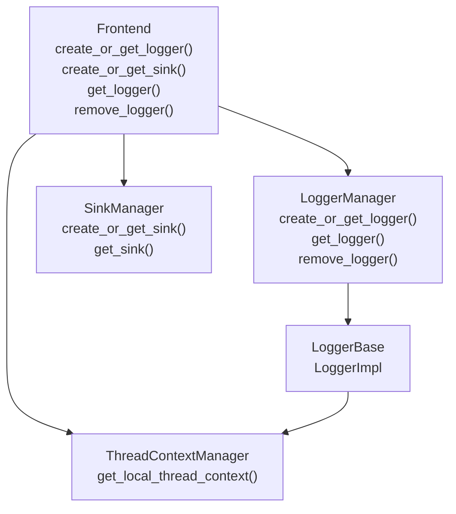
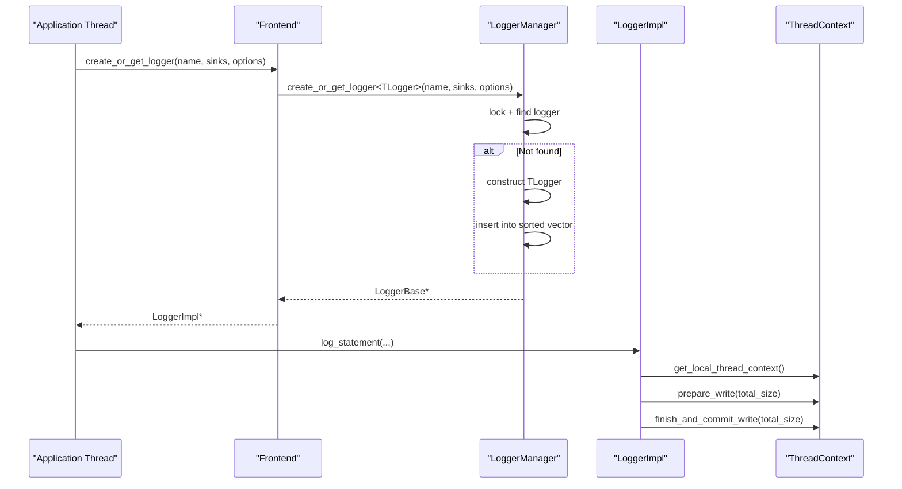
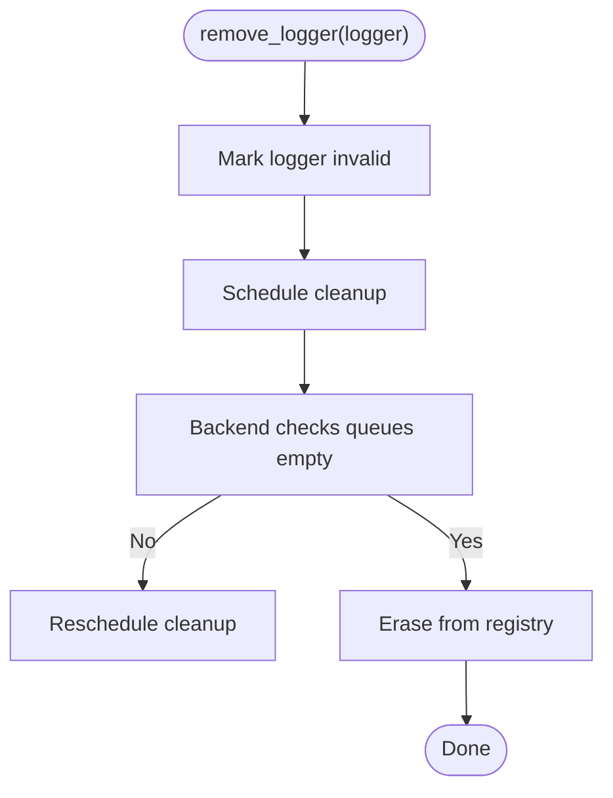
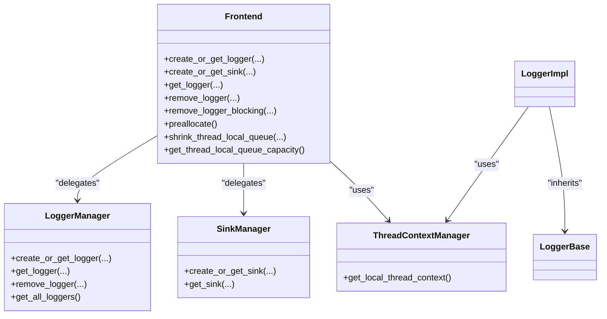

# Frontend Class

<cite>
**Referenced Files in This Document**
- [Frontend.h](file://include/quill/Frontend.h)
- [FrontendOptions.h](file://include/quill/core/FrontendOptions.h)
- [LoggerManager.h](file://include/quill/core/LoggerManager.h)
- [SinkManager.h](file://include/quill/core/SinkManager.h)
- [LoggerBase.h](file://include/quill/core/LoggerBase.h)
- [ThreadContextManager.h](file://include/quill/core/ThreadContextManager.h)
- [Logger.h](file://include/quill/Logger.h)
- [custom_frontend_options.cpp](file://examples/custom_frontend_options.cpp)
- [bounded_dropping_queue_frontend.cpp](file://examples/bounded_dropping_queue_frontend.cpp)
- [frontend_options.rst](file://docs/frontend_options.rst)
- [loggers.rst](file://docs/loggers.rst)
- [sinks.rst](file://docs/sinks.rst)
- [LoggerAddRemoveGetTest.cpp](file://test/integration_tests/LoggerAddRemoveGetTest.cpp)
- [LoggerManagerTest.cpp](file://test/unit_tests/LoggerManagerTest.cpp)
</cite>

## Table of Contents
1. [Introduction](#introduction)
2. [Project Structure](#project-structure)
3. [Core Components](#core-components)
4. [Architecture Overview](#architecture-overview)
5. [Detailed Component Analysis](#detailed-component-analysis)
6. [Dependency Analysis](#dependency-analysis)
7. [Performance Considerations](#performance-considerations)
8. [Troubleshooting Guide](#troubleshooting-guide)
9. [Conclusion](#conclusion)
10. [Appendices](#appendices)

## Introduction
This document provides comprehensive API documentation for the Frontend class, focusing on logger and sink creation/manipulation, configuration via FrontendOptions, lifecycle management, and thread-local queue behavior. It explains how Frontend coordinates with LoggerManager and SinkManager, how thread-local contexts are managed, and how queue configuration affects performance and memory usage. Practical usage patterns are covered, including template-based logger creation, multi-sink configurations, and dynamic logger management.

## Project Structure
The Frontend class is part of the public API and orchestrates logger and sink lifecycle operations. It delegates logger creation/removal to LoggerManager and sink creation/retrieval to SinkManager. Thread-local queues are managed via ThreadContextManager, and the Logger class encapsulates the hot-path logging logic.

**Diagram sources**
- [Frontend.h:113-321](file://include/quill/Frontend.h#L113-L321)
- [LoggerManager.h:152-198](file://include/quill/core/LoggerManager.h#L152-L198)
- [SinkManager.h:69-94](file://include/quill/core/SinkManager.h#L69-L94)
- [ThreadContextManager.h:416-422](file://include/quill/core/ThreadContextManager.h#L416-L422)
- [LoggerBase.h:35-62](file://include/quill/core/LoggerBase.h#L35-L62)
- [Logger.h:47-62](file://include/quill/Logger.h#L47-L62)

**Section sources**
- [Frontend.h:113-321](file://include/quill/Frontend.h#L113-L321)
- [LoggerManager.h:152-198](file://include/quill/core/LoggerManager.h#L152-L198)
- [SinkManager.h:69-94](file://include/quill/core/SinkManager.h#L69-L94)
- [ThreadContextManager.h:416-422](file://include/quill/core/ThreadContextManager.h#L416-L422)
- [LoggerBase.h:35-62](file://include/quill/core/LoggerBase.h#L35-L62)
- [Logger.h:47-62](file://include/quill/Logger.h#L47-L62)

## Core Components
- Frontend: Public facade for creating/retrieving loggers and sinks, and for managing logger lifecycles. It exposes:
  - create_or_get_logger() overloads for single/multiple sinks and template-based reuse of existing logger options.
  - create_or_get_sink() and get_sink() for sink registration and retrieval.
  - get_logger(), get_all_loggers(), get_valid_logger(), get_number_of_loggers().
  - remove_logger() and remove_logger_blocking() for asynchronous and synchronous removal.
  - Thread-local queue helpers: preallocate(), shrink_thread_local_queue(), get_thread_local_queue_capacity().
- FrontendOptions: Compile-time configuration controlling queue type, capacities, retry intervals, and huge pages policy.
- LoggerManager: Central registry for loggers with thread-safe creation, lookup, and removal. It marks loggers invalid and cleans them up when queues are empty.
- SinkManager: Central registry for sinks with thread-safe creation/retrieval and cleanup of unused sinks.
- ThreadContextManager: Manages per-thread SPSC queues and thread-local contexts, including queue selection and capacity queries.
- LoggerBase/LoggerImpl: Base and templated logger implementation with hot-path logging, backtrace support, flush mechanisms, and thread-local context caching.

**Section sources**
- [Frontend.h:113-321](file://include/quill/Frontend.h#L113-L321)
- [FrontendOptions.h:16-50](file://include/quill/core/FrontendOptions.h#L16-L50)
- [LoggerManager.h:152-198](file://include/quill/core/LoggerManager.h#L152-L198)
- [SinkManager.h:69-94](file://include/quill/core/SinkManager.h#L69-L94)
- [ThreadContextManager.h:53-174](file://include/quill/core/ThreadContextManager.h#L53-L174)
- [LoggerBase.h:35-62](file://include/quill/core/LoggerBase.h#L35-L62)
- [Logger.h:47-62](file://include/quill/Logger.h#L47-L62)

## Architecture Overview
The Frontend class acts as a thin orchestration layer:
- Logger creation: Frontend delegates to LoggerManager, which constructs a LoggerBase-derived object and stores it in a sorted vector protected by a spinlock. Creation honors environment-provided log level if present.
- Sink creation: Frontend delegates to SinkManager, which stores sinks in a sorted vector and returns shared_ptr instances. File sinks are constructed with special handling.
- Thread-local queues: Each frontend thread caches a ThreadContext holding an SPSC queue (bounded or unbounded) selected by FrontendOptions. Operations like shrink and capacity reporting operate on the calling thread’s queue.
- Logger removal: Frontend marks the logger invalid; LoggerManager defers cleanup until queues are empty. A blocking variant enqueues a special removal request and waits for completion.

**Diagram sources**
- [Frontend.h:138-198](file://include/quill/Frontend.h#L138-L198)
- [LoggerManager.h:152-185](file://include/quill/core/LoggerManager.h#L152-L185)
- [Logger.h:75-136](file://include/quill/Logger.h#L75-L136)
- [ThreadContextManager.h:416-422](file://include/quill/core/ThreadContextManager.h#L416-L422)

## Detailed Component Analysis

### Frontend API Surface
- create_or_get_logger():
  - Overload accepting a single sink.
  - Overload accepting a vector or initializer list of sinks.
  - Overload copying options from an existing logger.
- get_logger(): Retrieve an existing logger by name.
- get_all_loggers()/get_valid_logger()/get_number_of_loggers(): Enumeration and inspection utilities.
- remove_logger()/remove_logger_blocking(): Asynchronous and synchronous removal with a special flush-and-wait mechanism in the blocking variant.
- Sink APIs:
  - create_or_get_sink<TSink>(): Create or retrieve a named sink.
  - get_sink(): Retrieve an existing sink by name.
- Thread-local queue helpers:
  - preallocate(): Pre-allocate thread-local queue storage.
  - shrink_thread_local_queue(capacity): Reduce queue capacity for unbounded queues.
  - get_thread_local_queue_capacity(): Inspect current capacity.

Key behaviors:
- Logger removal is asynchronous; the logger is marked invalid and cleaned up when queues are empty. The blocking variant enqueues a removal request and spins until completion.
- Sink retrieval throws if the sink does not exist; creation is guarded by a spinlock and supports file sink construction with special rules.

**Section sources**
- [Frontend.h:138-321](file://include/quill/Frontend.h#L138-L321)
- [LoggerManager.h:201-239](file://include/quill/core/LoggerManager.h#L201-L239)
- [SinkManager.h:53-94](file://include/quill/core/SinkManager.h#L53-L94)

### Logger Lifecycle Management
- Creation: LoggerManager constructs a LoggerBase-derived instance with provided sinks, formatter options, and clock source. It inserts the logger into a sorted vector and optionally applies an environment-provided log level.
- Lookup: get_logger() returns only valid loggers; get_all_loggers() excludes invalidated entries.
- Removal:
  - remove_logger(): Marks the logger invalid and schedules cleanup.
  - remove_logger_blocking(): Enqueues a special removal request and waits for backend confirmation.
- Cleanup: LoggerManager scans invalidated loggers and removes them only when their queues are empty.

**Diagram sources**
- [LoggerManager.h:201-239](file://include/quill/core/LoggerManager.h#L201-L239)

**Section sources**
- [LoggerManager.h:201-239](file://include/quill/core/LoggerManager.h#L201-L239)
- [LoggerAddRemoveGetTest.cpp:40-43](file://test/integration_tests/LoggerAddRemoveGetTest.cpp#L40-L43)

### Sink Registration and Sharing
- SinkManager maintains a sorted vector of weak_ptr sinks keyed by sink_id. Creation is guarded by a spinlock; retrieval throws if not found.
- File sinks are constructed with special handling; non-file sinks are constructed directly.
- Sinks can be shared across multiple loggers; removal of the last logger referencing a sink triggers sink destruction and file closure.

Usage patterns:
- Create a named sink once and reuse it across multiple loggers.
- Share sinks to consolidate output to a single target.

**Section sources**
- [SinkManager.h:69-94](file://include/quill/core/SinkManager.h#L69-L94)
- [sinks.rst:18-36](file://docs/sinks.rst#L18-L36)

### Thread-Local Context and Queue Configuration
- Each thread caches a ThreadContext holding an SPSC queue selected by FrontendOptions.queue_type.
- Queue types:
  - UnboundedBlocking/UnboundedDropping: Grow up to a maximum capacity; block or drop when full.
  - BoundedBlocking/BoundedDropping: Fixed capacity; block or drop when full.
- Helpers:
  - preallocate(): Pre-allocates queue storage.
  - shrink_thread_local_queue(capacity): Shrink unbounded queues to a smaller capacity.
  - get_thread_local_queue_capacity(): Inspect current capacity.

Examples demonstrate switching queue types and capacities.

**Section sources**
- [ThreadContextManager.h:53-174](file://include/quill/core/ThreadContextManager.h#L53-L174)
- [FrontendOptions.h:16-50](file://include/quill/core/FrontendOptions.h#L16-L50)
- [frontend_options.rst:36-94](file://docs/frontend_options.rst#L36-L94)
- [custom_frontend_options.cpp:14-27](file://examples/custom_frontend_options.cpp#L14-L27)
- [bounded_dropping_queue_frontend.cpp:21-32](file://examples/bounded_dropping_queue_frontend.cpp#L21-L32)

### Logger Implementation and Hot Path
- LoggerImpl encapsulates the hot-path logging logic:
  - log_statement() and log_statement_runtime_metadata() reserve queue space, encode header and payload, and commit.
  - Supports backtrace initialization and flushing.
  - Provides flush_log() with configurable retry behavior.
- Thread-local context caching avoids repeated lookups.

**Section sources**
- [Logger.h:75-136](file://include/quill/Logger.h#L75-L136)
- [Logger.h:155-260](file://include/quill/Logger.h#L155-L260)
- [Logger.h:319-352](file://include/quill/Logger.h#L319-L352)

### Template-Based Logger Creation and Formatter Configuration
- Frontend::create_or_get_logger() accepts PatternFormatterOptions to configure formatting.
- LoggerImpl inherits compile-time FrontendOptions to select queue type and behavior.
- LoggerBase holds formatter options and sinks; these are immutable after creation.

**Section sources**
- [Frontend.h:138-198](file://include/quill/Frontend.h#L138-L198)
- [LoggerBase.h:39-55](file://include/quill/core/LoggerBase.h#L39-L55)
- [Logger.h:360-372](file://include/quill/Logger.h#L360-L372)

### Usage Examples and Patterns
- Single-root logger with console sink:
  - Create sink, create logger, log messages.
- Custom FrontendOptions:
  - Define custom options, instantiate CustomFrontend and CustomLogger, start backend, and log.
- Bounded dropping queue:
  - Demonstrate fixed-capacity queue and message dropping behavior.
- Logger removal and recreation:
  - Flush and remove logger, then recreate with the same name.

**Section sources**
- [loggers.rst:18-48](file://docs/loggers.rst#L18-L48)
- [custom_frontend_options.cpp:29-42](file://examples/custom_frontend_options.cpp#L29-L42)
- [bounded_dropping_queue_frontend.cpp:40-55](file://examples/bounded_dropping_queue_frontend.cpp#L40-L55)
- [LoggerAddRemoveGetTest.cpp:21-43](file://test/integration_tests/LoggerAddRemoveGetTest.cpp#L21-L43)

## Dependency Analysis
Frontend depends on LoggerManager and SinkManager for logger and sink operations, and on ThreadContextManager for thread-local queue access. LoggerImpl depends on LoggerBase and ThreadContextManager for hot-path logging and queue operations.

**Diagram sources**
- [Frontend.h:113-321](file://include/quill/Frontend.h#L113-L321)
- [LoggerManager.h:152-198](file://include/quill/core/LoggerManager.h#L152-L198)
- [SinkManager.h:69-94](file://include/quill/core/SinkManager.h#L69-L94)
- [ThreadContextManager.h:416-422](file://include/quill/core/ThreadContextManager.h#L416-L422)
- [LoggerBase.h:35-62](file://include/quill/core/LoggerBase.h#L35-L62)
- [Logger.h:47-62](file://include/quill/Logger.h#L47-L62)

**Section sources**
- [Frontend.h:113-321](file://include/quill/Frontend.h#L113-L321)
- [LoggerManager.h:152-198](file://include/quill/core/LoggerManager.h#L152-L198)
- [SinkManager.h:69-94](file://include/quill/core/SinkManager.h#L69-L94)
- [ThreadContextManager.h:416-422](file://include/quill/core/ThreadContextManager.h#L416-L422)
- [LoggerBase.h:35-62](file://include/quill/core/LoggerBase.h#L35-L62)
- [Logger.h:47-62](file://include/quill/Logger.h#L47-L62)

## Performance Considerations
- Queue types:
  - Unbounded queues can grow to a maximum capacity before blocking or dropping; use shrink_thread_local_queue() to reclaim memory on idle threads.
  - Bounded queues offer predictable memory usage but may drop messages; suitable for high-frequency scenarios where loss is acceptable.
- Retry intervals:
  - FrontendOptions::blocking_queue_retry_interval_ns controls backoff when queues are full; tune for latency vs. CPU trade-offs.
- Huge pages:
  - FrontendOptions::huge_pages_policy can reduce TLB misses on Linux; evaluate overhead vs. benefit.
- Immediate flush:
  - LoggerBase::set_immediate_flush() enables periodic flushes; avoid in production due to performance cost.
- Thread-local caching:
  - LoggerImpl caches ThreadContext pointer to avoid repeated lookups; Frontend::preallocate() can pre-size queues.

**Section sources**
- [frontend_options.rst:10-31](file://docs/frontend_options.rst#L10-L31)
- [frontend_options.rst:36-94](file://docs/frontend_options.rst#L36-L94)
- [FrontendOptions.h:16-50](file://include/quill/core/FrontendOptions.h#L16-L50)
- [LoggerBase.h:161-164](file://include/quill/core/LoggerBase.h#L161-L164)
- [Logger.h:462-474](file://include/quill/Logger.h#L462-L474)

## Troubleshooting Guide
- Logger not found:
  - get_logger() returns nullptr for invalid or non-existent loggers; ensure the logger is valid and created under the correct FrontendOptions.
- Removing the same logger from multiple threads:
  - Only one thread should remove a given logger pointer; otherwise, undefined behavior may occur.
- Sink does not exist:
  - get_sink() throws if the sink name is not registered; ensure create_or_get_sink() was called first.
- Logger removal timing:
  - remove_logger() is asynchronous; use remove_logger_blocking() if you need to guarantee completion before recreating the logger.
- Environment log level:
  - LoggerManager parses QUILL_LOG_LEVEL at startup; verify environment variable correctness if unexpected log levels appear.

**Section sources**
- [loggers.rst:52-54](file://docs/loggers.rst#L52-L54)
- [LoggerManager.h:247-273](file://include/quill/core/LoggerManager.h#L247-L273)
- [LoggerManagerTest.cpp:294-331](file://test/unit_tests/LoggerManagerTest.cpp#L294-L331)
- [LoggerManager.h:201-239](file://include/quill/core/LoggerManager.h#L201-L239)

## Conclusion
Frontend provides a concise, thread-safe interface for logger and sink lifecycle management, coordinated with LoggerManager and SinkManager. ThreadContextManager ensures efficient per-thread queue operations governed by FrontendOptions. Proper queue configuration, careful logger removal, and mindful sink sharing enable high-performance, scalable logging across diverse workloads.

## Appendices

### API Reference Summary
- Logger creation:
  - create_or_get_logger(name, sink, formatter, clock, user_clock)
  - create_or_get_logger(name, sinks, formatter, clock, user_clock)
  - create_or_get_logger(name, source_logger)
- Logger retrieval and enumeration:
  - get_logger(name), get_all_loggers(), get_valid_logger(), get_number_of_loggers()
- Logger removal:
  - remove_logger(logger), remove_logger_blocking(logger, sleep_duration_ns)
- Sink management:
  - create_or_get_sink<TSink>(name, args...), get_sink(name)
- Thread-local queue helpers:
  - preallocate(), shrink_thread_local_queue(capacity), get_thread_local_queue_capacity()

**Section sources**
- [Frontend.h:138-321](file://include/quill/Frontend.h#L138-L321)