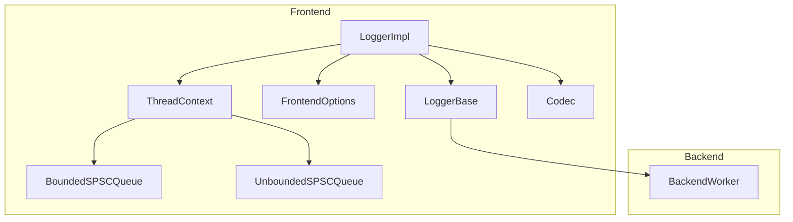
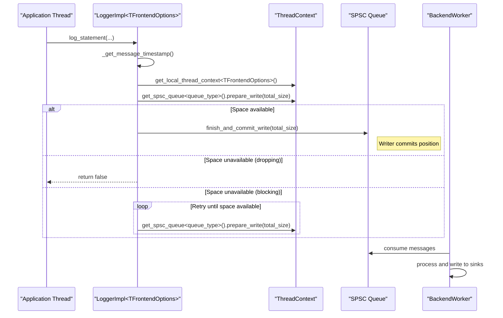
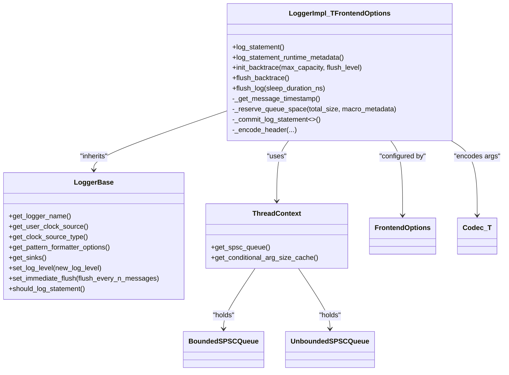

# Logger Class

<cite>
**Referenced Files in This Document**
- [Logger.h](file://include/quill/Logger.h)
- [LoggerBase.h](file://include/quill/core/LoggerBase.h)
- [Frontend.h](file://include/quill/Frontend.h)
- [FrontendOptions.h](file://include/quill/core/FrontendOptions.h)
- [ThreadContextManager.h](file://include/quill/core/ThreadContextManager.h)
- [BoundedSPSCQueue.h](file://include/quill/core/BoundedSPSCQueue.h)
- [UnboundedSPSCQueue.h](file://include/quill/core/UnboundedSPSCQueue.h)
- [Codec.h](file://include/quill/core/Codec.h)
- [Common.h](file://include/quill/core/Common.h)
- [Attributes.h](file://include/quill/core/Attributes.h)
- [LoggerTest.cpp](file://test/unit_tests/LoggerTest.cpp)
- [recommended_usage.cpp](file://examples/recommended_usage/recommended_usage.cpp)
</cite>

## Table of Contents
1. [Introduction](#introduction)
2. [Project Structure](#project-structure)
3. [Core Components](#core-components)
4. [Architecture Overview](#architecture-overview)
5. [Detailed Component Analysis](#detailed-component-analysis)
6. [Dependency Analysis](#dependency-analysis)
7. [Performance Considerations](#performance-considerations)
8. [Troubleshooting Guide](#troubleshooting-guide)
9. [Conclusion](#conclusion)
10. [Appendices](#appendices)

## Introduction
This document provides comprehensive API documentation for the Logger class template, focusing on the LoggerImpl template class. It covers public methods, template parameters, thread-safety guarantees, return values, and internal implementation details. Special attention is given to the LoggerImpl template with the FrontendOptions specialization, fast-path logging for fundamental types, runtime metadata logging, backtrace functionality, capacity management, and blocking flush operations. Usage examples demonstrate proper instantiation, thread-safe logging patterns, and performance optimization techniques.

## Project Structure
The Logger class resides in the frontend layer alongside supporting components for queue management, codecs, and thread-local contexts. The LoggerBase class provides shared state and configuration, while FrontendOptions controls queue behavior and capacity. ThreadContextManager manages per-thread SPSC queues and caches.



**Diagram sources**
- [Logger.h:47-508](file://include/quill/Logger.h#L47-L508)
- [LoggerBase.h:35-210](file://include/quill/core/LoggerBase.h#L35-L210)
- [FrontendOptions.h:16-52](file://include/quill/core/FrontendOptions.h#L16-L52)
- [ThreadContextManager.h:53-214](file://include/quill/core/ThreadContextManager.h#L53-L214)
- [BoundedSPSCQueue.h:54-356](file://include/quill/core/BoundedSPSCQueue.h#L54-L356)
- [UnboundedSPSCQueue.h:42-345](file://include/quill/core/UnboundedSPSCQueue.h#L42-L345)
- [Codec.h:142-438](file://include/quill/core/Codec.h#L142-L438)

**Section sources**
- [Logger.h:47-508](file://include/quill/Logger.h#L47-L508)
- [LoggerBase.h:35-210](file://include/quill/core/LoggerBase.h#L35-L210)
- [FrontendOptions.h:16-52](file://include/quill/core/FrontendOptions.h#L16-L52)
- [ThreadContextManager.h:53-214](file://include/quill/core/ThreadContextManager.h#L53-L214)
- [BoundedSPSCQueue.h:54-356](file://include/quill/core/BoundedSPSCQueue.h#L54-L356)
- [UnboundedSPSCQueue.h:42-345](file://include/quill/core/UnboundedSPSCQueue.h#L42-L345)
- [Codec.h:142-438](file://include/quill/core/Codec.h#L142-L438)

## Core Components
- LoggerImpl<TFrontendOptions>: Thread-safe logger template implementing fast-path logging, runtime metadata logging, backtrace initialization and flushing, and blocking flush operations. It inherits from LoggerBase and uses per-thread SPSC queues managed by ThreadContext.
- LoggerBase: Shared state container holding logger name, sinks, pattern formatter options, clock source, log level, backtrace flush level, validity flag, and counters for immediate flush thresholds.
- FrontendOptions: Compile-time configuration controlling queue type, initial capacity, blocking retry interval, maximum unbounded capacity, and huge pages policy.
- ThreadContext: Per-thread context managing SPSC queues (bounded or unbounded), conditional argument size cache, thread identifiers, and failure counters.
- BoundedSPSCQueue and UnboundedSPSCQueue: Wait-free SPSC queues for inter-thread communication, with bounded and unbounded variants respectively.
- Codec<T>: Memory encoding strategies for fundamental and standard types, including arithmetic, enums, pointers, C strings, arrays, std::string, and std::string_view.

Key responsibilities:
- Fast-path logging: log_statement() for fundamental types with minimal overhead.
- Runtime metadata logging: log_statement_runtime_metadata() for dynamic metadata.
- Backtrace: init_backtrace() and flush_backtrace() with capacity and flush level control.
- Blocking flush: flush_log() with configurable sleep behavior.
- Thread safety: Atomic flags and per-thread contexts ensure safe concurrent usage.

**Section sources**
- [Logger.h:47-508](file://include/quill/Logger.h#L47-L508)
- [LoggerBase.h:35-210](file://include/quill/core/LoggerBase.h#L35-L210)
- [FrontendOptions.h:16-52](file://include/quill/core/FrontendOptions.h#L16-L52)
- [ThreadContextManager.h:53-214](file://include/quill/core/ThreadContextManager.h#L53-L214)
- [BoundedSPSCQueue.h:54-356](file://include/quill/core/BoundedSPSCQueue.h#L54-L356)
- [UnboundedSPSCQueue.h:42-345](file://include/quill/core/UnboundedSPSCQueue.h#L42-L345)
- [Codec.h:142-438](file://include/quill/core/Codec.h#L142-L438)

## Architecture Overview
The Logger class integrates frontend logging with backend processing through a lock-free SPSC queue per thread. The LoggerBase holds shared state, while LoggerImpl handles per-call operations and queue management. ThreadContextManager creates and manages ThreadContext instances, selecting the appropriate queue type based on FrontendOptions.



**Diagram sources**
- [Logger.h:75-136](file://include/quill/Logger.h#L75-L136)
- [Logger.h:408-451](file://include/quill/Logger.h#L408-L451)
- [ThreadContextManager.h:100-131](file://include/quill/core/ThreadContextManager.h#L100-L131)
- [BoundedSPSCQueue.h:105-145](file://include/quill/core/BoundedSPSCQueue.h#L105-L145)
- [UnboundedSPSCQueue.h:115-149](file://include/quill/core/UnboundedSPSCQueue.h#L115-L149)

**Section sources**
- [Logger.h:75-136](file://include/quill/Logger.h#L75-L136)
- [Logger.h:408-451](file://include/quill/Logger.h#L408-L451)
- [ThreadContextManager.h:100-131](file://include/quill/core/ThreadContextManager.h#L100-L131)
- [BoundedSPSCQueue.h:105-145](file://include/quill/core/BoundedSPSCQueue.h#L105-L145)
- [UnboundedSPSCQueue.h:115-149](file://include/quill/core/UnboundedSPSCQueue.h#L115-L149)

## Detailed Component Analysis

### LoggerImpl<TFrontendOptions>
Public interface and responsibilities:
- log_statement<enable_immediate_flush>(macro_metadata, fmt_args...): Fast-path logging for fundamental types. Returns true on success, false when dropping occurs on bounded/dropping queues. Thread-safe.
- log_statement_runtime_metadata<enable_immediate_flush>(macro_metadata, fmt, file_path, function_name, tags, line_number, log_level, fmt_args...): Logs with runtime metadata. Supports deep copy, shallow copy, and hybrid copy modes. Returns true on success, false on drop.
- init_backtrace(max_capacity, flush_level): Initializes backtrace storage with capacity and flush level. Uses fast-path logging to avoid dropping.
- flush_backtrace(): Dumps stored backtrace messages using fast-path logging.
- flush_log(sleep_duration_ns): Blocks until all messages up to the current timestamp are flushed. Uses a flag mechanism to signal backend completion.

Template parameters:
- TFrontendOptions: Compile-time configuration affecting queue type, capacity, and behavior.

Thread safety guarantees:
- Per-thread ThreadContext caches ensure minimal contention.
- Atomic flags protect logger validity and flush thresholds.
- SPSC queues are designed for single producer/consumer concurrency.

Return values:
- Boolean for queue write outcomes (dropping vs. success).
- Void for initialization and flush operations.

Internal implementation highlights:
- Timestamp handling: _get_message_timestamp() selects TSC, system clock, or user clock.
- Queue reservation: _reserve_queue_space() computes total size, reserves space, and handles blocking/dropping.
- Encoding: _encode_header() writes timestamp, metadata, logger context, and decoder pointer. Codec<T> encodes arguments efficiently.
- Commitment: _commit_log_statement<>() finalizes write and optionally triggers flush_log() based on immediate flush threshold.

Usage examples:
- Recommended usage demonstrates logger creation and logging macros with a global logger.
- Unit tests show logger retrieval, log level checks, and pattern formatter options.

**Section sources**
- [Logger.h:75-260](file://include/quill/Logger.h#L75-L260)
- [Logger.h:269-352](file://include/quill/Logger.h#L269-L352)
- [Logger.h:378-503](file://include/quill/Logger.h#L378-L503)
- [LoggerBase.h:104-164](file://include/quill/core/LoggerBase.h#L104-L164)
- [FrontendOptions.h:16-52](file://include/quill/core/FrontendOptions.h#L16-L52)
- [recommended_usage.cpp:34-49](file://examples/recommended_usage/recommended_usage.cpp#L34-L49)
- [LoggerTest.cpp:14-82](file://test/unit_tests/LoggerTest.cpp#L14-L82)

### LoggerBase
Shared state and configuration:
- Logger name, sinks, pattern formatter options, clock source, user clock.
- Log level, backtrace flush level, validity flag, and counters for immediate flush thresholds.
- Accessors for logger name, user clock, clock source type, pattern formatter options, sinks, and log level.
- Methods to set log level (with guard against internal Backtrace level) and enable immediate flush.

Thread safety:
- Atomic flags protect cross-thread visibility of state changes.

**Section sources**
- [LoggerBase.h:35-210](file://include/quill/core/LoggerBase.h#L35-L210)

### FrontendOptions
Compile-time configuration:
- Queue type: UnboundedBlocking, UnboundedDropping, BoundedBlocking, BoundedDropping.
- Initial queue capacity and unbounded queue maximum capacity.
- Blocking retry interval for blocking queues.
- Huge pages policy for queue memory.

**Section sources**
- [FrontendOptions.h:16-52](file://include/quill/core/FrontendOptions.h#L16-L52)

### ThreadContext and SPSC Queues
ThreadContext:
- Holds a union of BoundedSPSCQueue or UnboundedSPSCQueue depending on queue type.
- Provides access to the correct queue type and maintains a conditional argument size cache.
- Tracks thread identity and failure counters.

SPSC queues:
- BoundedSPSCQueue: Fixed-capacity ring buffer with atomic positions and cache-line aligned barriers.
- UnboundedSPSCQueue: Chain of bounded queues that grows up to a maximum capacity, enabling unbounded growth with limits.

**Section sources**
- [ThreadContextManager.h:53-214](file://include/quill/core/ThreadContextManager.h#L53-L214)
- [BoundedSPSCQueue.h:54-356](file://include/quill/core/BoundedSPSCQueue.h#L54-L356)
- [UnboundedSPSCQueue.h:42-345](file://include/quill/core/UnboundedSPSCQueue.h#L42-L345)

### Codec<T> and Memory Encoding
Encoding strategies:
- Fundamental types (arithmetic, enum, void*, void const*): Direct memcpy of size sizeof(Arg).
- C strings and char arrays: Safe length calculation with null terminator handling.
- std::string and std::string_view: Encode length followed by data to handle embedded nulls.
- Missing codecs: Static assertion with guidance for STL and user-defined types.

Decoding and format argument storage:
- decode_arg() reconstructs arguments from encoded buffers.
- decode_and_store_arg() stores decoded arguments into DynamicFormatArgStore for deferred formatting.

**Section sources**
- [Codec.h:142-438](file://include/quill/core/Codec.h#L142-L438)

### Fast-Path Logging for Fundamental Types
The fast-path leverages:
- Template deduction to restrict to fundamental types.
- Precomputed total size using Codec<T> to minimize runtime overhead.
- Direct memory encoding into the queue buffer.
- Immediate timestamp capture to reduce latency.

```mermaid
flowchart TD
Start(["log_statement Entry"]) --> AssertMeta["Assert macro_metadata is not runtime metadata"]
AssertMeta --> AssertValid["Assert logger is valid"]
AssertValid --> GetTS["Get current timestamp"]
GetTS --> GetCtx["Get ThreadContext (cached)"]
GetCtx --> ComputeSize["Compute total size using Codec<T>"]
ComputeSize --> Reserve["_reserve_queue_space(total_size)"]
Reserve --> |Success| EncodeHeader["_encode_header(...)"]
EncodeHeader --> EncodeArgs["Encode args via Codec<T>"]
EncodeArgs --> Commit["_commit_log_statement<enable_immediate_flush>()"]
Commit --> Done(["Return true"])
Reserve --> |Failure (dropping)| Drop["Increment failure counter if bounded/dropping"] --> ReturnFalse(["Return false"])
Reserve --> |Failure (blocking)| RetryLoop["Retry prepare_write with sleep"] --> Reserve
```

**Diagram sources**
- [Logger.h:75-136](file://include/quill/Logger.h#L75-L136)
- [Logger.h:408-451](file://include/quill/Logger.h#L408-L451)
- [Logger.h:457-475](file://include/quill/Logger.h#L457-L475)
- [Codec.h:354-388](file://include/quill/core/Codec.h#L354-L388)

**Section sources**
- [Logger.h:75-136](file://include/quill/Logger.h#L75-L136)
- [Logger.h:408-451](file://include/quill/Logger.h#L408-L451)
- [Logger.h:457-475](file://include/quill/Logger.h#L457-L475)
- [Codec.h:354-388](file://include/quill/core/Codec.h#L354-L388)

### Runtime Metadata Logging
Runtime metadata logging supports:
- Deep copy: Copies all metadata into the queue.
- Shallow copy: Stores void pointers to metadata to reduce copying overhead.
- Hybrid copy: Mix of deep and shallow copies for selected fields.

Behavior:
- Computes additional size for metadata fields.
- Encodes metadata according to chosen mode.
- Uses the same fast-path mechanisms for queue reservation and commitment.

**Section sources**
- [Logger.h:155-260](file://include/quill/Logger.h#L155-L260)
- [Codec.h:354-388](file://include/quill/core/Codec.h#L354-L388)

### Backtrace Functionality
Backtrace initialization and flushing:
- init_backtrace(max_capacity, flush_level): Sends an initialization message to the backend with capacity and flush level. Uses fast-path logging to avoid dropping.
- flush_backtrace(): Sends a flush message to the backend. Uses fast-path logging to avoid dropping.

Capacity management:
- Capacity is enforced by the backend; initialization sets the maximum number of messages retained.

Flush levels:
- flush_level determines whether backtrace is automatically flushed upon encountering messages at or above the specified severity.

**Section sources**
- [Logger.h:269-300](file://include/quill/Logger.h#L269-L300)
- [LoggerBase.h:198-200](file://include/quill/core/LoggerBase.h#L198-L200)

### Blocking Flush Operations
flush_log(sleep_duration_ns):
- Sends a flush message carrying a pointer to an atomic flag.
- Retries until the message is accepted by the queue (blocking/dropping behavior).
- Polls the flag until the backend signals completion.
- Sleep behavior controlled by sleep_duration_ns; yields when sleep_duration_ns is zero.

Thread-safety:
- Uses atomic flag for synchronization between frontend and backend threads.
- Guards against destruction of thread-local ThreadContext when called from static destructors.

**Section sources**
- [Logger.h:319-352](file://include/quill/Logger.h#L319-L352)

### Thread-Safe Instantiation and Usage Patterns
Recommended instantiation:
- Use Frontend::create_or_get_logger() to obtain or create a logger with sinks and pattern formatter options.
- Configure FrontendOptions at compile-time for queue behavior and capacity.

Thread-safe logging patterns:
- Use the same logger instance across threads; LoggerImpl is designed for single producer per thread.
- Prefer fast-path logging for fundamental types to minimize overhead.
- Use runtime metadata logging when metadata is not known at compile-time.

Performance optimization techniques:
- Tune FrontendOptions for queue type and capacity based on workload.
- Enable immediate flush only for debugging due to performance impact.
- Consider huge pages policy for reduced TLB misses on supported platforms.

**Section sources**
- [Frontend.h:151-202](file://include/quill/Frontend.h#L151-L202)
- [LoggerTest.cpp:14-82](file://test/unit_tests/LoggerTest.cpp#L14-L82)
- [recommended_usage.cpp:34-49](file://examples/recommended_usage/recommended_usage.cpp#L34-L49)

## Dependency Analysis
LoggerImpl depends on:
- LoggerBase for shared state and configuration.
- ThreadContextManager for per-thread queue management.
- BoundedSPSCQueue or UnboundedSPSCQueue based on FrontendOptions.
- Codec<T> for efficient memory encoding of arguments.
- FrontendOptions for compile-time queue configuration.



**Diagram sources**
- [Logger.h:47-508](file://include/quill/Logger.h#L47-L508)
- [LoggerBase.h:35-210](file://include/quill/core/LoggerBase.h#L35-L210)
- [ThreadContextManager.h:53-214](file://include/quill/core/ThreadContextManager.h#L53-L214)
- [BoundedSPSCQueue.h:54-356](file://include/quill/core/BoundedSPSCQueue.h#L54-L356)
- [UnboundedSPSCQueue.h:42-345](file://include/quill/core/UnboundedSPSCQueue.h#L42-L345)
- [FrontendOptions.h:16-52](file://include/quill/core/FrontendOptions.h#L16-L52)
- [Codec.h:142-438](file://include/quill/core/Codec.h#L142-L438)

**Section sources**
- [Logger.h:47-508](file://include/quill/Logger.h#L47-L508)
- [LoggerBase.h:35-210](file://include/quill/core/LoggerBase.h#L35-L210)
- [ThreadContextManager.h:53-214](file://include/quill/core/ThreadContextManager.h#L53-L214)
- [BoundedSPSCQueue.h:54-356](file://include/quill/core/BoundedSPSCQueue.h#L54-L356)
- [UnboundedSPSCQueue.h:42-345](file://include/quill/core/UnboundedSPSCQueue.h#L42-L345)
- [FrontendOptions.h:16-52](file://include/quill/core/FrontendOptions.h#L16-L52)
- [Codec.h:142-438](file://include/quill/core/Codec.h#L142-L438)

## Performance Considerations
- Fast-path logging minimizes overhead by restricting to fundamental types and precomputing encoded sizes.
- SPSC queues are designed for single producer/single consumer to avoid locks and reduce contention.
- Immediate flush thresholds can significantly impact throughput; use sparingly.
- Huge pages policy can reduce TLB misses on supported platforms.
- Blocking retry intervals balance responsiveness and CPU usage for blocking queues.

[No sources needed since this section provides general guidance]

## Troubleshooting Guide
Common issues and remedies:
- Invalid logger usage: Ensure the logger remains valid; marked invalid during removal. Attempting to log with an invalidated logger triggers assertions.
- Queue drops: With bounded/dropping queues, log_statement() may return false. Consider switching to unbounded or bounded blocking queues.
- Blocking flush timeouts: Adjust sleep_duration_ns or backend sleep duration to avoid long blocking periods.
- Runtime metadata errors: Verify macro_metadata event type matches the intended runtime metadata mode (deep/shallow/hybrid copy).
- Codec errors: Ensure codecs are available for user-defined types or include necessary headers for STL types.

**Section sources**
- [LoggerBase.h:104-113](file://include/quill/core/LoggerBase.h#L104-L113)
- [Logger.h:414-448](file://include/quill/Logger.h#L414-L448)
- [Logger.h:319-352](file://include/quill/Logger.h#L319-L352)
- [Codec.h:60-86](file://include/quill/core/Codec.h#L60-L86)

## Conclusion
The LoggerImpl template provides a high-performance, thread-safe logging interface with specialized support for fast-path fundamental-type logging, runtime metadata, backtrace management, and blocking flush operations. Its integration with ThreadContext and SPSC queues ensures efficient inter-thread communication, while FrontendOptions offers flexible queue configuration. Following the recommended usage patterns and performance guidelines enables scalable and reliable logging across diverse workloads.

[No sources needed since this section summarizes without analyzing specific files]

## Appendices

### API Reference Summary

- LoggerImpl<TFrontendOptions>
  - log_statement<enable_immediate_flush>(macro_metadata, fmt_args...) -> bool
  - log_statement_runtime_metadata<enable_immediate_flush>(macro_metadata, fmt, file_path, function_name, tags, line_number, log_level, fmt_args...) -> bool
  - init_backtrace(max_capacity, flush_level=LogLevel::None) -> void
  - flush_backtrace() -> void
  - flush_log(sleep_duration_ns=100) -> void

- LoggerBase
  - get_logger_name() -> std::string const&
  - get_user_clock_source() -> UserClockSource*
  - get_clock_source_type() -> ClockSourceType
  - get_pattern_formatter_options() -> PatternFormatterOptions const&
  - get_sinks() -> std::vector<std::shared_ptr<Sink>> const&
  - set_log_level(new_log_level) -> void
  - set_immediate_flush(flush_every_n_messages) -> void
  - should_log_statement<LogLevel>() -> bool
  - should_log_statement(log_statement_level) -> bool

- FrontendOptions
  - queue_type, initial_queue_capacity, blocking_queue_retry_interval_ns, unbounded_queue_max_capacity, huge_pages_policy

**Section sources**
- [Logger.h:75-352](file://include/quill/Logger.h#L75-L352)
- [LoggerBase.h:68-184](file://include/quill/core/LoggerBase.h#L68-L184)
- [FrontendOptions.h:16-52](file://include/quill/core/FrontendOptions.h#L16-L52)