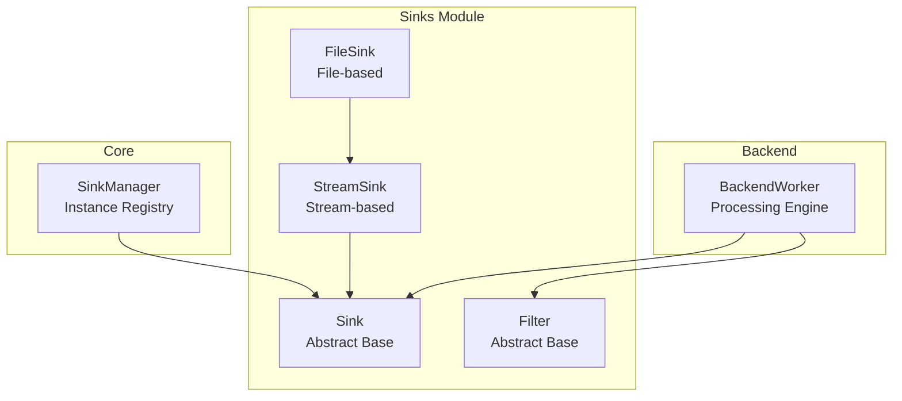
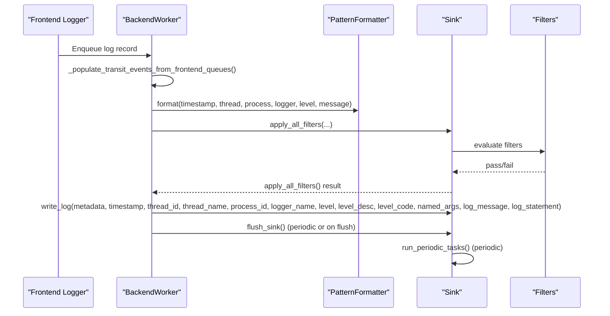
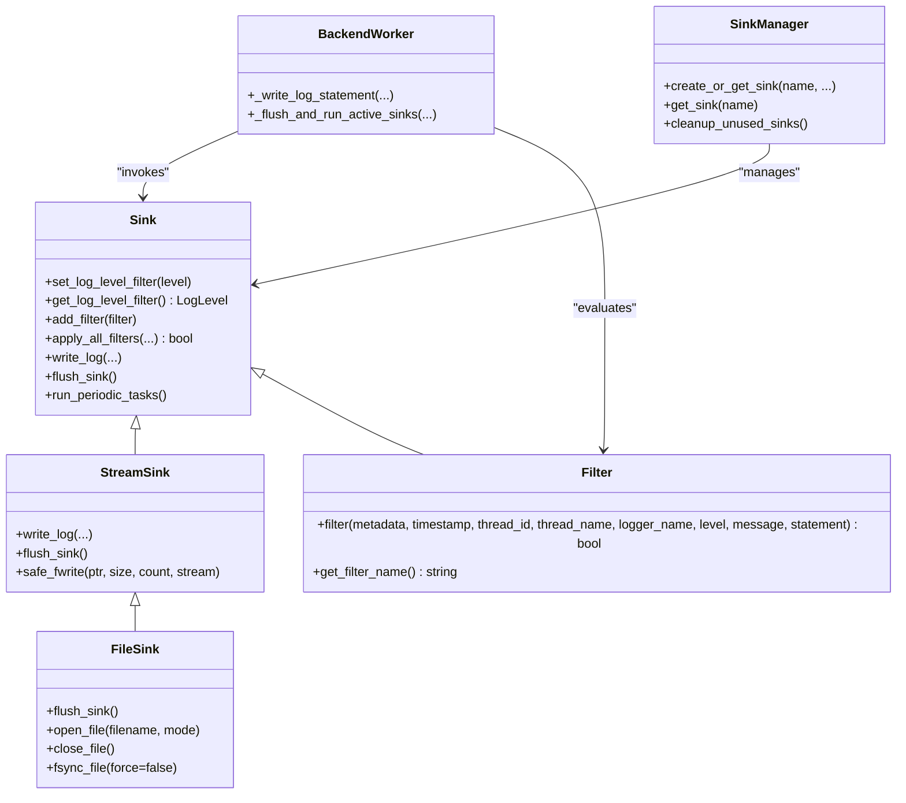

# Base Sink Interface

<cite>
**Referenced Files in This Document**
- [Sink.h](file://include/quill/sinks/Sink.h)
- [Filter.h](file://include/quill/filters/Filter.h)
- [BackendWorker.h](file://include/quill/backend/BackendWorker.h)
- [StreamSink.h](file://include/quill/sinks/StreamSink.h)
- [FileSink.h](file://include/quill/sinks/FileSink.h)
- [SinkManager.h](file://include/quill/core/SinkManager.h)
- [user_defined_sink.cpp](file://examples/user_defined_sink.cpp)
</cite>

## Table of Contents
1. [Introduction](#introduction)
2. [Project Structure](#project-structure)
3. [Core Components](#core-components)
4. [Architecture Overview](#architecture-overview)
5. [Detailed Component Analysis](#detailed-component-analysis)
6. [Dependency Analysis](#dependency-analysis)
7. [Performance Considerations](#performance-considerations)
8. [Troubleshooting Guide](#troubleshooting-guide)
9. [Conclusion](#conclusion)

## Introduction
This document provides comprehensive documentation for the base Sink class interface in Quill's logging system. The Sink class serves as the abstract foundation for all logging destinations (files, consoles, databases, etc.). It defines the contract for writing formatted log messages, applying filters, and performing periodic maintenance tasks. This guide explains the thread-safe filtering mechanisms, filter registration system, backend integration hooks, and lifecycle management considerations for custom sink implementations.

## Project Structure
The base Sink interface resides in the sinks module alongside related components:
- Sink: Abstract base class for all sinks
- Filter: Base class for user-defined filters
- StreamSink: Base class for stream-based sinks (console, files)
- FileSink: Concrete file sink implementation
- BackendWorker: Orchestrates log processing and invokes sink operations
- SinkManager: Manages sink instances and lifetimes

**Diagram sources**
- [Sink.h:40-218](file://include/quill/sinks/Sink.h#L40-L218)
- [Filter.h:26-72](file://include/quill/filters/Filter.h#L26-L72)
- [StreamSink.h:67-314](file://include/quill/sinks/StreamSink.h#L67-L314)
- [FileSink.h:226-527](file://include/quill/sinks/FileSink.h#L226-L527)
- [BackendWorker.h:77-1362](file://include/quill/backend/BackendWorker.h#L77-L1362)
- [SinkManager.h:28-157](file://include/quill/core/SinkManager.h#L28-L157)

**Section sources**
- [Sink.h:26-218](file://include/quill/sinks/Sink.h#L26-L218)
- [BackendWorker.h:77-1362](file://include/quill/backend/BackendWorker.h#L77-L1362)

## Core Components
This section documents the essential elements of the base Sink interface and its supporting infrastructure.

- Abstract base class design
  - Pure virtual methods define the sink contract:
    - write_log(): Receives formatted log metadata and message for output
    - flush_sink(): Synchronizes buffered output to the destination
  - Protected methods enable backend integration:
    - apply_all_filters(): Applies log level and user-defined filters
    - run_periodic_tasks(): Periodic maintenance hook for custom sinks
  - Thread-safe configuration:
    - set_log_level_filter()/get_log_level_filter(): Atomic log level filtering
    - add_filter(): Thread-safe filter registration with uniqueness checks

- Filter system
  - Filter base class defines filter() method signature
  - Filters are registered globally and applied per-log record
  - apply_all_filters() manages local filter cache and evaluation

- Backend integration
  - BackendWorker coordinates log processing and invokes sink operations
  - _write_log_statement() formats messages and applies filters before calling write_log()
  - _flush_and_run_active_sinks() triggers flush_sink() and run_periodic_tasks()

**Section sources**
- [Sink.h:40-218](file://include/quill/sinks/Sink.h#L40-L218)
- [Filter.h:26-72](file://include/quill/filters/Filter.h#L26-L72)
- [BackendWorker.h:1009-1068](file://include/quill/backend/BackendWorker.h#L1009-L1068)
- [BackendWorker.h:1284-1362](file://include/quill/backend/BackendWorker.h#L1284-L1362)

## Architecture Overview
The logging pipeline connects front-end log calls to backend processing and sink implementations:

**Diagram sources**
- [BackendWorker.h:1009-1068](file://include/quill/backend/BackendWorker.h#L1009-L1068)
- [BackendWorker.h:1284-1362](file://include/quill/backend/BackendWorker.h#L1284-L1362)
- [Sink.h:123-197](file://include/quill/sinks/Sink.h#L123-L197)

## Detailed Component Analysis

### Base Sink Class (Sink)
The Sink class defines the abstract interface for all logging destinations.

Key responsibilities:
- Define the write_log() contract for formatted log delivery
- Provide flush_sink() for synchronization
- Implement thread-safe log level filtering via atomic storage
- Manage filter registration and evaluation
- Offer periodic task hook for custom sink operations

Thread-safety mechanisms:
- Log level filter: atomic<LogLevel> with relaxed memory ordering for fast reads
- Filter registry: spinlock-protected vector with atomic indicator for lazy updates
- apply_all_filters(): Fast-path short-circuit for log level, then lock-protected filter refresh

Protected backend integration:
- write_log(): Receives comprehensive metadata and formatted message
- apply_all_filters(): Evaluates log level and all registered filters
- run_periodic_tasks(): Lightweight periodic maintenance hook

Lifecycle considerations:
- Virtual destructor enables safe polymorphic deletion
- Copy-constructor deleted to prevent accidental copying
- Sink instances are owned by Logger objects and managed by SinkManager

**Section sources**
- [Sink.h:40-218](file://include/quill/sinks/Sink.h#L40-L218)

### Filter System
Filters provide flexible, user-defined log filtering logic.

Filter base class:
- filter() method receives complete log metadata and returns pass/fail
- get_filter_name() enables unique identification for registration

Filter registration and evaluation:
- add_filter(): Thread-safe insertion with duplicate name detection
- apply_all_filters(): Updates local filter cache when new filters are added, then evaluates all filters
- Evaluation uses std::all_of() semantics: all filters must pass for the record to be written

Filter naming:
- Each filter must have a unique name to avoid conflicts
- Names are compared for equality to prevent duplicates

**Section sources**
- [Filter.h:26-72](file://include/quill/filters/Filter.h#L26-L72)
- [Sink.h:85-104](file://include/quill/sinks/Sink.h#L85-L104)
- [Sink.h:156-197](file://include/quill/sinks/Sink.h#L156-L197)

### Backend Integration
BackendWorker orchestrates the entire logging pipeline and interacts with sinks.

Processing flow:
- _write_log_statement(): Formats logs using PatternFormatter, applies filters, then calls write_log()
- _flush_and_run_active_sinks(): Iterates active sinks to flush and run periodic tasks
- run_periodic_tasks() is invoked for each sink during idle periods

Thread model:
- BackendWorker runs on a dedicated thread
- write_log() and flush_sink() are invoked by the backend thread
- run_periodic_tasks() is called periodically during backend polling

Sink lifecycle:
- Sinks are shared via shared_ptr within Logger objects
- SinkManager tracks sink instances and cleans up expired references

**Section sources**
- [BackendWorker.h:1009-1068](file://include/quill/backend/BackendWorker.h#L1009-L1068)
- [BackendWorker.h:1284-1362](file://include/quill/backend/BackendWorker.h#L1284-L1362)
- [SinkManager.h:28-157](file://include/quill/core/SinkManager.h#L28-L157)

### StreamSink and FileSink (Concrete Implementations)
StreamSink provides a base for stream-based sinks (stdout, stderr, files).

Key features:
- write_log(): Writes formatted log statements to the underlying stream
- flush_sink(): Flushes buffered output
- safe_fwrite(): Robust write implementation with partial write handling
- FileEventNotifier: Hooks for file open/close/write events

FileSink extends StreamSink with file-specific capabilities:
- FileSinkConfig: Configurable options (append modes, buffer sizes, fsync intervals)
- File lifecycle management: automatic reopen on deletion, retry on transient failures
- fsync_file(): Controlled fsync with minimum intervals

**Section sources**
- [StreamSink.h:67-314](file://include/quill/sinks/StreamSink.h#L67-L314)
- [FileSink.h:226-527](file://include/quill/sinks/FileSink.h#L226-L527)

### Example: Custom Sink Implementation
The example demonstrates a minimal custom sink that caches log statements and flushes them on demand.

Implementation highlights:
- Inherits from Sink and implements write_log(), flush_sink(), and run_periodic_tasks()
- write_log(): Stores formatted statements in a vector
- flush_sink(): Outputs cached statements and clears the buffer
- run_periodic_tasks(): Placeholder for periodic maintenance

This example illustrates the complete lifecycle and thread-safety considerations for custom sinks.

**Section sources**
- [user_defined_sink.cpp:18-73](file://examples/user_defined_sink.cpp#L18-L73)

## Dependency Analysis
The following diagram shows the primary dependencies among sink-related components:

**Diagram sources**
- [Sink.h:40-218](file://include/quill/sinks/Sink.h#L40-L218)
- [Filter.h:26-72](file://include/quill/filters/Filter.h#L26-L72)
- [StreamSink.h:67-314](file://include/quill/sinks/StreamSink.h#L67-L314)
- [FileSink.h:226-527](file://include/quill/sinks/FileSink.h#L226-L527)
- [BackendWorker.h:1009-1068](file://include/quill/backend/BackendWorker.h#L1009-L1068)
- [BackendWorker.h:1284-1362](file://include/quill/backend/BackendWorker.h#L1284-L1362)
- [SinkManager.h:28-157](file://include/quill/core/SinkManager.h#L28-L157)

## Performance Considerations
- Atomic log level filtering: Relaxed memory ordering provides fast reads with minimal overhead
- Filter cache optimization: apply_all_filters() lazily updates local filter cache only when new filters are detected
- Backend thread scheduling: run_periodic_tasks() is invoked during idle periods to minimize impact on throughput
- Stream I/O: StreamSink.safe_fwrite() handles partial writes robustly to avoid stalls and infinite loops
- File operations: FileSink retries transient failures and supports configurable fsync intervals to balance durability and performance

## Troubleshooting Guide
Common issues and resolutions:

- Duplicate filter names
  - Symptom: Exception when adding a filter with an existing name
  - Resolution: Ensure each filter has a unique name; use get_filter_name() consistently

- Thread-safety violations
  - Symptom: Race conditions or inconsistent filter behavior
  - Resolution: Use add_filter() and set_log_level_filter() from any thread; avoid direct mutation of internal state

- Periodic task performance impact
  - Symptom: Backend thread slowdown during run_periodic_tasks()
  - Resolution: Keep run_periodic_tasks() lightweight; avoid heavy I/O or blocking operations

- File sink lifecycle problems
  - Symptom: Missing logs after file deletion or intermittent write failures
  - Resolution: FileSink automatically reopens deleted files and retries transient failures; configure fsync intervals appropriately

- Backend thread exceptions
  - Symptom: Exceptions thrown during flush or periodic tasks
  - Resolution: BackendWorker catches and reports exceptions via error notifier; ensure sinks handle errors gracefully

**Section sources**
- [Sink.h:85-104](file://include/quill/sinks/Sink.h#L85-L104)
- [Sink.h:156-197](file://include/quill/sinks/Sink.h#L156-L197)
- [BackendWorker.h:1284-1362](file://include/quill/backend/BackendWorker.h#L1284-L1362)
- [FileSink.h:264-288](file://include/quill/sinks/FileSink.h#L264-L288)

## Conclusion
The base Sink interface provides a robust, thread-safe foundation for Quill's logging system. Its design separates concerns between formatting, filtering, and output, enabling flexible sink implementations while maintaining high performance. The atomic filtering mechanisms, efficient filter cache management, and backend integration hooks ensure reliable operation across diverse environments. Following the guidelines in this document will help developers implement custom sinks that integrate seamlessly with Quill's architecture.