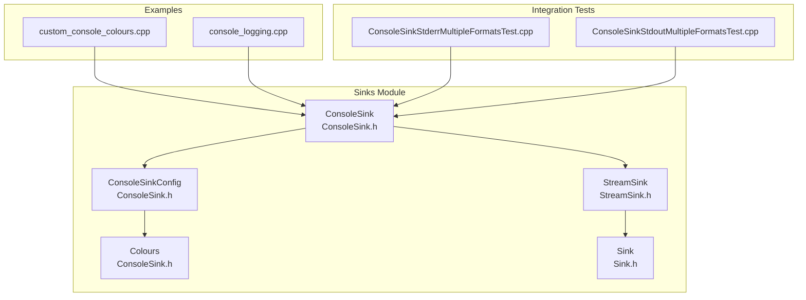
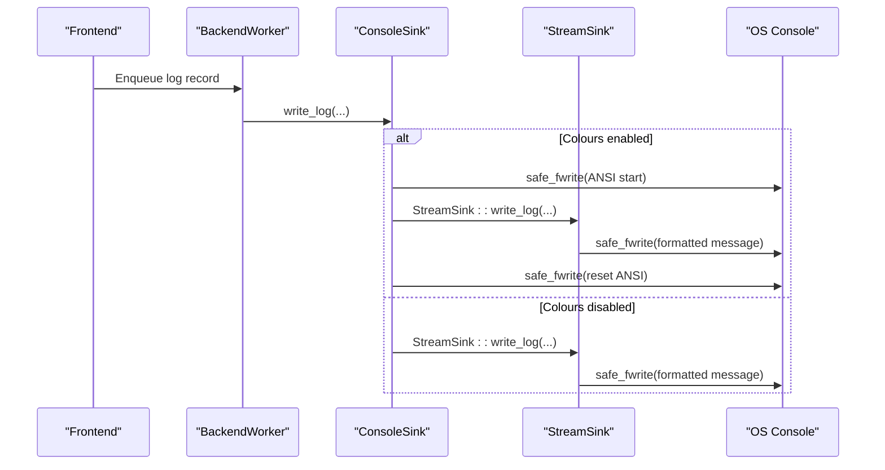
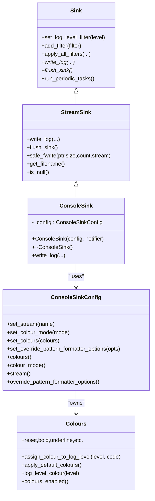
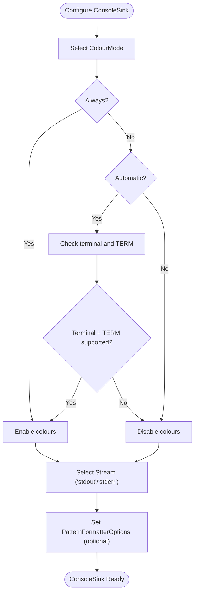
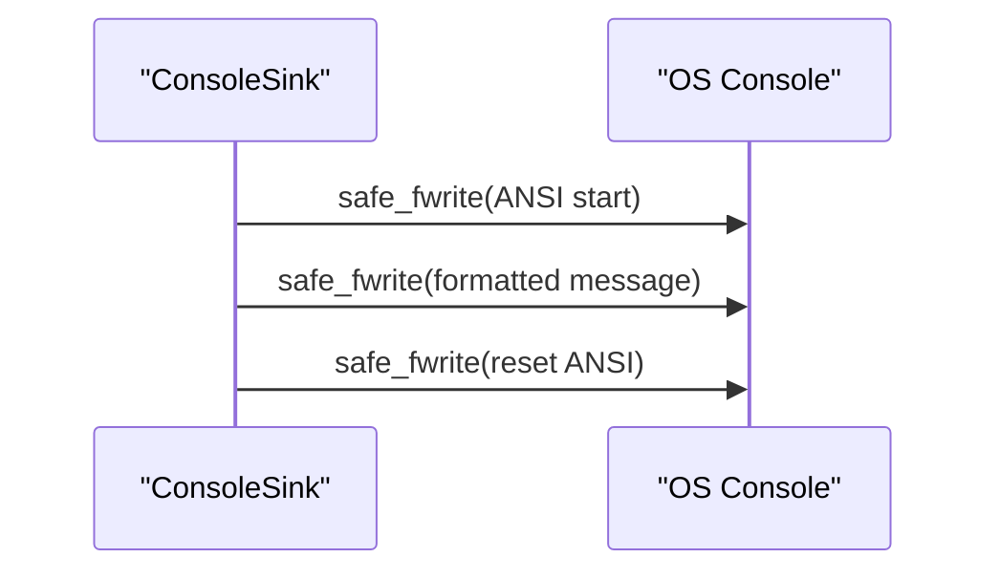
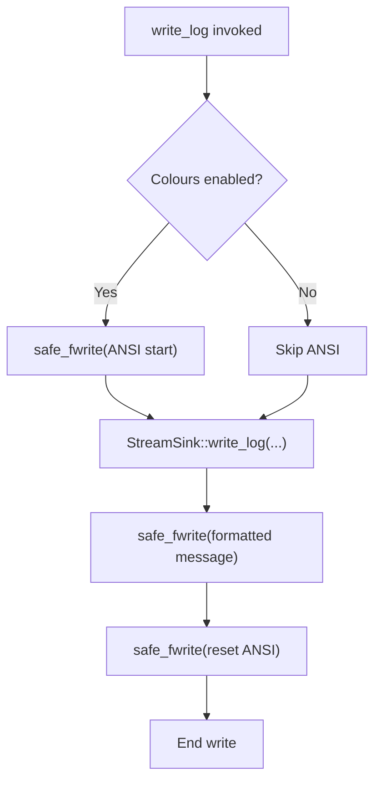
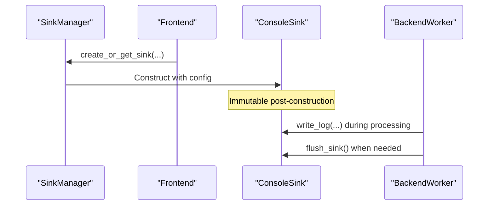
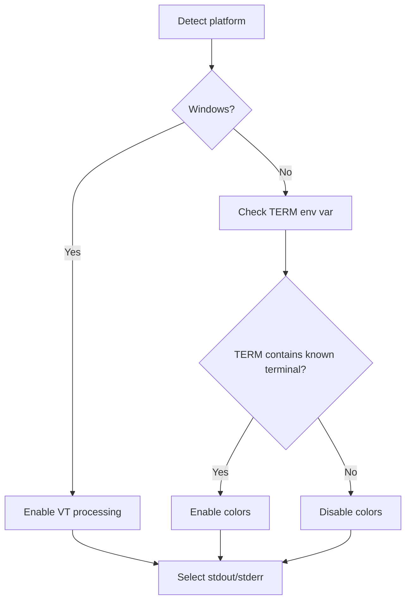
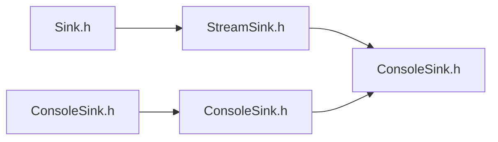

# Console Sink

<cite>
**Referenced Files in This Document**
- [ConsoleSink.h](file://include/quill/sinks/ConsoleSink.h)
- [StreamSink.h](file://include/quill/sinks/StreamSink.h)
- [Sink.h](file://include/quill/sinks/Sink.h)
- [custom_console_colours.cpp](file://examples/custom_console_colours.cpp)
- [console_logging.cpp](file://examples/console_logging.cpp)
- [ConsoleSinkStderrMultipleFormatsTest.cpp](file://test/integration_tests/ConsoleSinkStderrMultipleFormatsTest.cpp)
- [ConsoleSinkStdoutMultipleFormatsTest.cpp](file://test/integration_tests/ConsoleSinkStdoutMultipleFormatsTest.cpp)
</cite>

## Table of Contents
1. [Introduction](#introduction)
2. [Project Structure](#project-structure)
3. [Core Components](#core-components)
4. [Architecture Overview](#architecture-overview)
5. [Detailed Component Analysis](#detailed-component-analysis)
6. [Dependency Analysis](#dependency-analysis)
7. [Performance Considerations](#performance-considerations)
8. [Troubleshooting Guide](#troubleshooting-guide)
9. [Conclusion](#conclusion)

## Introduction
This document provides comprehensive technical documentation for the ConsoleSink implementation in Quill. It explains constructor parameters, optional stream selection (stdout/stderr), color support configuration, terminal color output capabilities, ANSI escape sequence handling, console formatting options, buffer management, flush behavior, thread safety, performance characteristics, and platform-specific considerations for color support and terminal compatibility.

## Project Structure
The ConsoleSink resides in the sinks module and builds upon the StreamSink base class. It integrates with the broader logging framework’s frontend and backend threads for asynchronous logging.

**Diagram sources**
- [ConsoleSink.h:331-412](file://include/quill/sinks/ConsoleSink.h#L331-L412)
- [StreamSink.h:67-314](file://include/quill/sinks/StreamSink.h#L67-L314)
- [Sink.h:40-218](file://include/quill/sinks/Sink.h#L40-L218)
- [custom_console_colours.cpp:14-48](file://examples/custom_console_colours.cpp#L14-L48)
- [console_logging.cpp:20-72](file://examples/console_logging.cpp#L20-L72)
- [ConsoleSinkStderrMultipleFormatsTest.cpp:19-102](file://test/integration_tests/ConsoleSinkStderrMultipleFormatsTest.cpp#L19-L102)
- [ConsoleSinkStdoutMultipleFormatsTest.cpp:19-43](file://test/integration_tests/ConsoleSinkStdoutMultipleFormatsTest.cpp#L19-L43)

**Section sources**
- [ConsoleSink.h:331-412](file://include/quill/sinks/ConsoleSink.h#L331-L412)
- [StreamSink.h:67-314](file://include/quill/sinks/StreamSink.h#L67-L314)
- [Sink.h:40-218](file://include/quill/sinks/Sink.h#L40-L218)

## Core Components
- ConsoleSink: A sink that writes formatted log records to stdout or stderr with optional colored log levels.
- ConsoleSinkConfig: Encapsulates configuration for ConsoleSink including stream selection, color mode, and pattern formatter overrides.
- Colours: Provides ANSI escape sequences for terminal colors and manages per-log-level color assignments.
- StreamSink: Base class handling stream initialization, safe writes, and flushing for console and file streams.
- Sink: Base interface defining the write and flush contract and filter management.

Key responsibilities:
- ConsoleSink handles colorized output by injecting ANSI escape sequences around formatted log statements when enabled.
- StreamSink manages safe writes to stdout/stderr and flushes the underlying stream.
- ConsoleSinkConfig centralizes color mode, stream selection, and formatter overrides.

**Section sources**
- [ConsoleSink.h:44-328](file://include/quill/sinks/ConsoleSink.h#L44-L328)
- [ConsoleSink.h:331-412](file://include/quill/sinks/ConsoleSink.h#L331-L412)
- [StreamSink.h:67-314](file://include/quill/sinks/StreamSink.h#L67-L314)
- [Sink.h:40-218](file://include/quill/sinks/Sink.h#L40-L218)

## Architecture Overview
ConsoleSink inherits from StreamSink and participates in the Quill logging pipeline. The frontend enqueues log records, the backend worker dequeues and invokes the sink’s write method, applying filters and formatting.

**Diagram sources**
- [ConsoleSink.h:375-405](file://include/quill/sinks/ConsoleSink.h#L375-L405)
- [StreamSink.h:152-180](file://include/quill/sinks/StreamSink.h#L152-L180)
- [StreamSink.h:214-278](file://include/quill/sinks/StreamSink.h#L214-L278)

## Detailed Component Analysis

### ConsoleSink Class
- Purpose: Writes formatted log records to stdout or stderr with optional colored log levels.
- Constructor parameters:
  - config: ConsoleSinkConfig instance controlling stream selection, color mode, and formatter overrides.
  - file_event_notifier: Optional notifier for file/stream events.
- Behavior:
  - Validates stream name is either "stdout" or "stderr".
  - Configures color support based on color mode and environment.
  - Injects ANSI color codes around formatted log statements when enabled.

**Diagram sources**
- [ConsoleSink.h:331-412](file://include/quill/sinks/ConsoleSink.h#L331-L412)
- [ConsoleSink.h:44-328](file://include/quill/sinks/ConsoleSink.h#L44-L328)
- [StreamSink.h:67-314](file://include/quill/sinks/StreamSink.h#L67-L314)
- [Sink.h:40-218](file://include/quill/sinks/Sink.h#L40-L218)

**Section sources**
- [ConsoleSink.h:338-356](file://include/quill/sinks/ConsoleSink.h#L338-L356)
- [ConsoleSink.h:375-405](file://include/quill/sinks/ConsoleSink.h#L375-L405)

### ConsoleSinkConfig and Colours
- ColourMode:
  - Always: Enables colors regardless of environment.
  - Automatic: Enables colors if the output is a terminal and TERM indicates support.
  - Never: Disables colors.
- Stream selection:
  - "stdout" or "stderr" are supported.
- Formatter override:
  - Optional PatternFormatterOptions can override the logger’s formatter for this sink.
- Colours:
  - Provides default color assignments for log levels.
  - Exposes ANSI escape sequences for foreground/background and emphasis effects.
  - Supports per-log-level customization.

**Diagram sources**
- [ConsoleSink.h:281-328](file://include/quill/sinks/ConsoleSink.h#L281-L328)
- [ConsoleSink.h:154-189](file://include/quill/sinks/ConsoleSink.h#L154-L189)

**Section sources**
- [ConsoleSink.h:44-328](file://include/quill/sinks/ConsoleSink.h#L44-L328)

### Color Output and ANSI Escape Sequences
- When colors are enabled, ConsoleSink writes:
  - ANSI start sequence for the log level color.
  - Formatted log statement via StreamSink::write_log.
  - ANSI reset sequence to restore terminal defaults.
- Colours are applied per log level and can be customized.

**Diagram sources**
- [ConsoleSink.h:383-397](file://include/quill/sinks/ConsoleSink.h#L383-L397)
- [StreamSink.h:214-278](file://include/quill/sinks/StreamSink.h#L214-L278)

**Section sources**
- [ConsoleSink.h:383-397](file://include/quill/sinks/ConsoleSink.h#L383-L397)

### Console Formatting Options and Buffer Management
- PatternFormatterOptions override:
  - ConsoleSinkConfig supports setting custom formatter options for this sink independently of the logger’s formatter.
- Buffer management:
  - StreamSink::safe_fwrite performs partial write retries and error handling.
  - Platform-specific optimizations:
    - On Windows, when writing to stdout/stderr, the implementation uses native console APIs to avoid newline translation issues.
- Flush behavior:
  - StreamSink::flush_sink delegates to StreamSink::flush, which calls std::fflush and resets internal write flags.
  - ConsoleSink does not override flush; flushes occur at the StreamSink level.

**Diagram sources**
- [ConsoleSink.h:375-405](file://include/quill/sinks/ConsoleSink.h#L375-L405)
- [StreamSink.h:152-180](file://include/quill/sinks/StreamSink.h#L152-L180)
- [StreamSink.h:214-278](file://include/quill/sinks/StreamSink.h#L214-L278)

**Section sources**
- [ConsoleSink.h:375-405](file://include/quill/sinks/ConsoleSink.h#L375-L405)
- [StreamSink.h:152-180](file://include/quill/sinks/StreamSink.h#L152-L180)
- [StreamSink.h:214-278](file://include/quill/sinks/StreamSink.h#L214-L278)

### Thread Safety and Performance Characteristics
- Threading model:
  - Sinks are created and managed by the frontend; they are used by the backend worker thread.
  - Sink creation is guarded by a spinlock in the sink manager to prevent concurrent mutations.
  - ConsoleSink members are read-only after construction (except for runtime filters), minimizing contention.
- Performance:
  - ConsoleSink::write_log is hot-path; it conditionally writes ANSI sequences and delegates formatting to StreamSink.
  - StreamSink::safe_fwrite ensures robust writes and handles partial writes and errors.
  - On Windows, direct console API usage avoids newline translation overhead for stdout/stderr.
- Flush behavior:
  - ConsoleSink does not override flush; flushes are handled by StreamSink::flush_sink and StreamSink::flush.
  - Frequent flushes can reduce throughput; use logger flush operations judiciously.

**Diagram sources**
- [Sink.h:123-141](file://include/quill/sinks/Sink.h#L123-L141)
- [Sink.h:156-197](file://include/quill/sinks/Sink.h#L156-L197)
- [ConsoleSink.h:338-356](file://include/quill/sinks/ConsoleSink.h#L338-L356)

**Section sources**
- [Sink.h:65-104](file://include/quill/sinks/Sink.h#L65-L104)
- [Sink.h:123-141](file://include/quill/sinks/Sink.h#L123-L141)
- [Sink.h:156-197](file://include/quill/sinks/Sink.h#L156-L197)
- [StreamSink.h:185-193](file://include/quill/sinks/StreamSink.h#L185-L193)
- [StreamSink.h:284-299](file://include/quill/sinks/StreamSink.h#L284-L299)

### Platform-Specific Considerations
- Windows:
  - ANSI color support is enabled via console mode flags when color mode is not Never.
  - Console output uses native console APIs for stdout/stderr to avoid newline translation issues.
- Unix-like systems:
  - Color support is determined by the presence of a recognized terminal in the TERM environment variable.
  - isatty checks confirm whether the stream is connected to a terminal.

**Diagram sources**
- [ConsoleSink.h:154-189](file://include/quill/sinks/ConsoleSink.h#L154-L189)
- [ConsoleSink.h:203-227](file://include/quill/sinks/ConsoleSink.h#L203-L227)
- [ConsoleSink.h:192-199](file://include/quill/sinks/ConsoleSink.h#L192-L199)
- [StreamSink.h:224-249](file://include/quill/sinks/StreamSink.h#L224-L249)

**Section sources**
- [ConsoleSink.h:154-189](file://include/quill/sinks/ConsoleSink.h#L154-L189)
- [ConsoleSink.h:203-227](file://include/quill/sinks/ConsoleSink.h#L203-L227)
- [ConsoleSink.h:192-199](file://include/quill/sinks/ConsoleSink.h#L192-L199)
- [StreamSink.h:224-249](file://include/quill/sinks/StreamSink.h#L224-L249)

### Examples and Integration
- Basic console logging:
  - Demonstrates creating a ConsoleSink and logging various message types.
- Custom console colors:
  - Shows how to customize per-log-level colors and disable colors globally.
- Integration with different console environments:
  - Tests demonstrate stderr usage and multiple formatter configurations.

References to example and test code:
- [console_logging.cpp:20-72](file://examples/console_logging.cpp#L20-L72)
- [custom_console_colours.cpp:14-48](file://examples/custom_console_colours.cpp#L14-L48)
- [ConsoleSinkStderrMultipleFormatsTest.cpp:19-102](file://test/integration_tests/ConsoleSinkStderrMultipleFormatsTest.cpp#L19-L102)
- [ConsoleSinkStdoutMultipleFormatsTest.cpp:19-43](file://test/integration_tests/ConsoleSinkStdoutMultipleFormatsTest.cpp#L19-L43)

**Section sources**
- [console_logging.cpp:20-72](file://examples/console_logging.cpp#L20-L72)
- [custom_console_colours.cpp:14-48](file://examples/custom_console_colours.cpp#L14-L48)
- [ConsoleSinkStderrMultipleFormatsTest.cpp:19-102](file://test/integration_tests/ConsoleSinkStderrMultipleFormatsTest.cpp#L19-L102)
- [ConsoleSinkStdoutMultipleFormatsTest.cpp:19-43](file://test/integration_tests/ConsoleSinkStdoutMultipleFormatsTest.cpp#L19-L43)

## Dependency Analysis
ConsoleSink depends on StreamSink and ConsoleSinkConfig. StreamSink depends on the base Sink interface and provides platform-aware write and flush logic.

**Diagram sources**
- [ConsoleSink.h:331-412](file://include/quill/sinks/ConsoleSink.h#L331-L412)
- [StreamSink.h:67-314](file://include/quill/sinks/StreamSink.h#L67-L314)
- [Sink.h:40-218](file://include/quill/sinks/Sink.h#L40-L218)

**Section sources**
- [ConsoleSink.h:331-412](file://include/quill/sinks/ConsoleSink.h#L331-L412)
- [StreamSink.h:67-314](file://include/quill/sinks/StreamSink.h#L67-L314)
- [Sink.h:40-218](file://include/quill/sinks/Sink.h#L40-L218)

## Performance Considerations
- Minimize color overhead:
  - Use ColourMode::Never for high-throughput scenarios where color is unnecessary.
  - Prefer ColourMode::Automatic to leverage terminal detection.
- Avoid excessive flushes:
  - ConsoleSink flushes are handled by StreamSink; frequent flushes reduce throughput.
- Platform optimizations:
  - On Windows, direct console API usage reduces overhead for stdout/stderr.
- Formatter choice:
  - Custom PatternFormatterOptions can tailor output size and complexity.

[No sources needed since this section provides general guidance]

## Troubleshooting Guide
- Colors not appearing:
  - Verify ConsoleSinkConfig::ColourMode and environment detection.
  - On Unix-like systems, ensure TERM contains a recognized terminal identifier.
  - On Windows, confirm ANSI processing is enabled when using ConsoleSinkConfig::ColourMode::Always.
- Incorrect stream selection:
  - Ensure the stream is set to "stdout" or "stderr".
- Partial writes or errors:
  - StreamSink::safe_fwrite handles partial writes and throws on persistent failures; check errno and GetLastError on Windows.
- Flush not observed:
  - Ensure logger flush operations are invoked; ConsoleSink flushes are delegated to StreamSink.

**Section sources**
- [ConsoleSink.h:281-328](file://include/quill/sinks/ConsoleSink.h#L281-L328)
- [ConsoleSink.h:154-189](file://include/quill/sinks/ConsoleSink.h#L154-L189)
- [ConsoleSink.h:203-227](file://include/quill/sinks/ConsoleSink.h#L203-L227)
- [StreamSink.h:214-278](file://include/quill/sinks/StreamSink.h#L214-L278)
- [StreamSink.h:284-299](file://include/quill/sinks/StreamSink.h#L284-L299)

## Conclusion
ConsoleSink provides a robust, configurable, and efficient way to output colored logs to stdout or stderr. Its design leverages StreamSink for safe, platform-aware writes and integrates seamlessly with Quill’s asynchronous logging pipeline. Proper configuration of color modes, streams, and formatter options enables flexible integration across diverse console environments while maintaining strong performance and reliability.