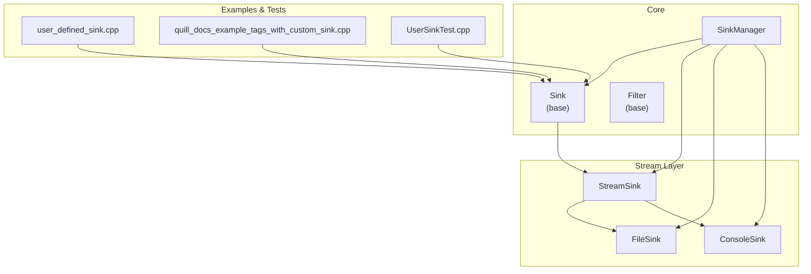
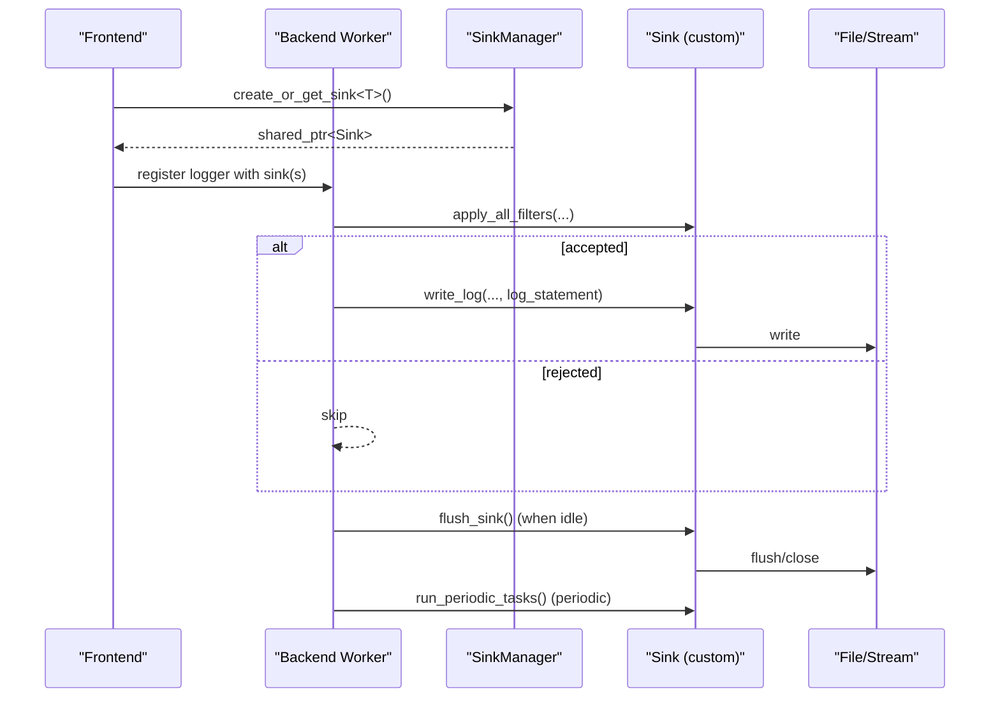
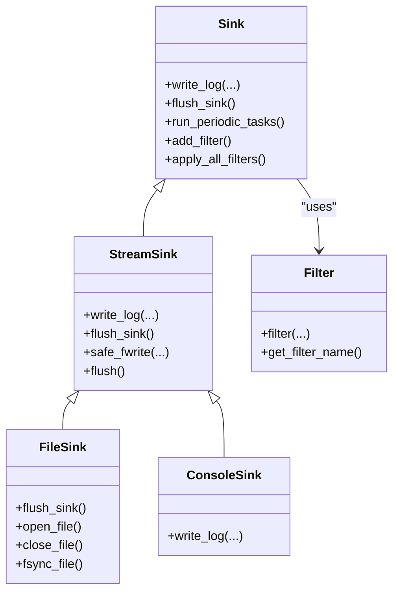
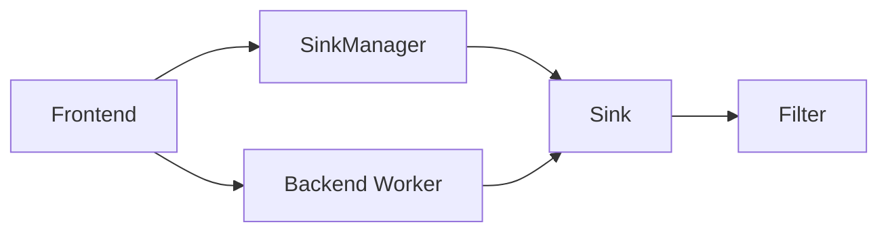

# Custom Sink Development

<cite>
**Referenced Files in This Document**
- [Sink.h](file://include/quill/sinks/Sink.h)
- [StreamSink.h](file://include/quill/sinks/StreamSink.h)
- [FileSink.h](file://include/quill/sinks/FileSink.h)
- [ConsoleSink.h](file://include/quill/sinks/ConsoleSink.h)
- [Filter.h](file://include/quill/filters/Filter.h)
- [SinkManager.h](file://include/quill/core/SinkManager.h)
- [user_defined_sink.cpp](file://examples/user_defined_sink.cpp)
- [UserSinkTest.cpp](file://test/integration_tests/UserSinkTest.cpp)
- [quill_docs_example_tags_with_custom_sink.cpp](file://docs/examples/quill_docs_example_tags_with_custom_sink.cpp)
- [sinks.rst](file://docs/sinks.rst)
</cite>

## Table of Contents
1. [Introduction](#introduction)
2. [Project Structure](#project-structure)
3. [Core Components](#core-components)
4. [Architecture Overview](#architecture-overview)
5. [Detailed Component Analysis](#detailed-component-analysis)
6. [Dependency Analysis](#dependency-analysis)
7. [Performance Considerations](#performance-considerations)
8. [Troubleshooting Guide](#troubleshooting-guide)
9. [Conclusion](#conclusion)
10. [Appendices](#appendices)

## Introduction
This document explains how to develop custom sink implementations in Quill. It covers inheriting from the base Sink class, implementing the required virtual methods, managing resources safely, integrating filters, performing periodic tasks, and optimizing performance. It also provides step-by-step examples ranging from minimal custom sinks to advanced features such as batching, tagging-aware sinks, and integration with external systems.

## Project Structure
Quill’s sink ecosystem is organized around a small set of core headers:
- Base sink interface and filter framework
- Stream-based sink for file/console-like outputs
- Concrete sinks (file, console, JSON variants)
- Sink manager for registration and retrieval
- Examples and tests demonstrating custom sinks

**Diagram sources**
- [Sink.h:40-218](file://include/quill/sinks/Sink.h#L40-L218)
- [Filter.h:26-72](file://include/quill/filters/Filter.h#L26-L72)
- [StreamSink.h:67-314](file://include/quill/sinks/StreamSink.h#L67-L314)
- [FileSink.h:226-527](file://include/quill/sinks/FileSink.h#L226-L527)
- [ConsoleSink.h:331-412](file://include/quill/sinks/ConsoleSink.h#L331-L412)
- [SinkManager.h:28-157](file://include/quill/core/SinkManager.h#L28-L157)
- [user_defined_sink.cpp:18-90](file://examples/user_defined_sink.cpp#L18-L90)
- [quill_docs_example_tags_with_custom_sink.cpp:18-69](file://docs/examples/quill_docs_example_tags_with_custom_sink.cpp#L18-L69)
- [UserSinkTest.cpp:16-119](file://test/integration_tests/UserSinkTest.cpp#L16-L119)

**Section sources**
- [sinks.rst:1-66](file://docs/sinks.rst#L1-L66)
- [SinkManager.h:28-157](file://include/quill/core/SinkManager.h#L28-L157)

## Core Components
- Sink: Base class defining the contract for write_log(), flush_sink(), and optional run_periodic_tasks(). Provides built-in filter management and log-level filtering.
- StreamSink: Stream-based implementation that writes formatted log statements to stdout/stderr or files, with safe write helpers and flush semantics.
- FileSink and ConsoleSink: Concrete sinks built on StreamSink, adding file-specific features (buffering, fsync, filename handling) and console color support.
- Filter: Base class for user-defined filters that can be attached to sinks to selectively accept or reject log records.
- SinkManager: Central registry for sinks, enabling creation, retrieval, and lifecycle management.

Key responsibilities:
- write_log(): Receives formatted log statements and performs the actual write operation.
- flush_sink(): Synchronizes buffered output and performs periodic maintenance.
- run_periodic_tasks(): Lightweight periodic work scheduled by the backend thread.
- Filters: Applied via add_filter() and evaluated in apply_all_filters() before write_log().

**Section sources**
- [Sink.h:40-218](file://include/quill/sinks/Sink.h#L40-L218)
- [StreamSink.h:67-314](file://include/quill/sinks/StreamSink.h#L67-L314)
- [FileSink.h:226-527](file://include/quill/sinks/FileSink.h#L226-L527)
- [ConsoleSink.h:331-412](file://include/quill/sinks/ConsoleSink.h#L331-L412)
- [Filter.h:26-72](file://include/quill/filters/Filter.h#L26-L72)
- [SinkManager.h:28-157](file://include/quill/core/SinkManager.h#L28-L157)

## Architecture Overview
The backend worker thread invokes sink methods. Sinks receive pre-formatted log statements and decide whether to write them immediately or buffer them for later flush/periodic tasks.

**Diagram sources**
- [Sink.h:123-141](file://include/quill/sinks/Sink.h#L123-L141)
- [Sink.h:156-197](file://include/quill/sinks/Sink.h#L156-L197)
- [SinkManager.h:69-94](file://include/quill/core/SinkManager.h#L69-L94)

## Detailed Component Analysis

### Step-by-Step: Building a Minimal Custom Sink
Follow these steps to implement a custom sink:
1. Derive from quill::Sink.
2. Implement write_log() to handle the formatted log statement.
3. Implement flush_sink() to synchronize output.
4. Optionally implement run_periodic_tasks() for lightweight periodic work.
5. Register the sink via Frontend::create_or_get_sink and attach it to a logger.

Reference example:
- [user_defined_sink.cpp:18-90](file://examples/user_defined_sink.cpp#L18-L90)

Implementation notes:
- write_log() receives a pre-formatted std::string_view log_statement. Exclude the trailing newline if you need to control it.
- flush_sink() is called when the backend considers it safe to flush; use it for batching commits or closing resources.
- run_periodic_tasks() runs frequently; keep it lightweight.

**Section sources**
- [user_defined_sink.cpp:18-90](file://examples/user_defined_sink.cpp#L18-L90)
- [Sink.h:123-141](file://include/quill/sinks/Sink.h#L123-L141)

### Advanced Sink: Tag-Aware Custom Sink
A custom sink can inspect log metadata (including tags) to route or transform output.

Reference example:
- [quill_docs_example_tags_with_custom_sink.cpp:18-69](file://docs/examples/quill_docs_example_tags_with_custom_sink.cpp#L18-L69)

How it works:
- The write_log() method receives MacroMetadata, which exposes tag information.
- Use tags to decide output behavior or enrich the log statement.

**Section sources**
- [quill_docs_example_tags_with_custom_sink.cpp:18-69](file://docs/examples/quill_docs_example_tags_with_custom_sink.cpp#L18-L69)
- [Sink.h:123-128](file://include/quill/sinks/Sink.h#L123-L128)

### Thread-Safe Logging Operations and Resource Management
- write_log() executes on the backend worker thread; avoid blocking operations.
- flush_sink() is the designated place to synchronize and release resources.
- Stream-based sinks provide safe write helpers and flush semantics; custom sinks should mirror these patterns.

Reference implementations:
- [StreamSink.h:152-193](file://include/quill/sinks/StreamSink.h#L152-L193)
- [StreamSink.h:214-278](file://include/quill/sinks/StreamSink.h#L214-L278)
- [FileSink.h:264-288](file://include/quill/sinks/FileSink.h#L264-L288)

Best practices:
- Use atomic counters or minimal synchronization for metrics inside sinks.
- Guard resource access with minimal locks; prefer immutable configuration after construction.
- Reuse buffers and avoid allocations in hot paths.

**Section sources**
- [StreamSink.h:152-193](file://include/quill/sinks/StreamSink.h#L152-L193)
- [StreamSink.h:214-278](file://include/quill/sinks/StreamSink.h#L214-L278)
- [FileSink.h:264-288](file://include/quill/sinks/FileSink.h#L264-L288)

### Custom Filter Integration
Attach filters to a sink to selectively accept or reject log records. Filters receive the same metadata as write_log().

Key APIs:
- add_filter(): Add a unique filter by name.
- apply_all_filters(): Evaluates log-level threshold and all registered filters.

Reference:
- [Sink.h:85-104](file://include/quill/sinks/Sink.h#L85-L104)
- [Sink.h:156-197](file://include/quill/sinks/Sink.h#L156-L197)
- [Filter.h:54-66](file://include/quill/filters/Filter.h#L54-L66)

Example usage:
- [UserSinkTest.cpp:16-41](file://test/integration_tests/UserSinkTest.cpp#L16-L41)

**Section sources**
- [Sink.h:85-104](file://include/quill/sinks/Sink.h#L85-L104)
- [Sink.h:156-197](file://include/quill/sinks/Sink.h#L156-L197)
- [Filter.h:54-66](file://include/quill/filters/Filter.h#L54-L66)
- [UserSinkTest.cpp:16-41](file://test/integration_tests/UserSinkTest.cpp#L16-L41)

### Periodic Task Implementation
Use run_periodic_tasks() for low-cost periodic maintenance (e.g., heartbeat, stats aggregation). The backend thread calls it frequently; avoid heavy work.

Reference:
- [Sink.h:141](file://include/quill/sinks/Sink.h#L141)

Validation:
- [UserSinkTest.cpp:36](file://test/integration_tests/UserSinkTest.cpp#L36)

**Section sources**
- [Sink.h:141](file://include/quill/sinks/Sink.h#L141)
- [UserSinkTest.cpp:36](file://test/integration_tests/UserSinkTest.cpp#L36)

### Complete Example: Batched Custom Sink
A practical example caches log statements and flushes them on demand or periodically.

Reference:
- [user_defined_sink.cpp:18-90](file://examples/user_defined_sink.cpp#L18-L90)

Implementation highlights:
- write_log(): Append to an internal buffer.
- flush_sink(): Drain the buffer and write to output.
- run_periodic_tasks(): Optional batch commit hook.

**Section sources**
- [user_defined_sink.cpp:18-90](file://examples/user_defined_sink.cpp#L18-L90)

### Integration with External Systems
Common patterns:
- Network sinks: Buffer locally and flush/commit in batches; use run_periodic_tasks() for periodic uploads.
- Database sinks: Accumulate rows and perform transactional commits in flush_sink() or run_periodic_tasks().
- Binary/protocol sinks: Use StreamSink’s safe write helpers as a model for serialization and flushing.

Reference patterns:
- [StreamSink.h:214-278](file://include/quill/sinks/StreamSink.h#L214-L278)
- [FileSink.h:468-485](file://include/quill/sinks/FileSink.h#L468-L485)

**Section sources**
- [StreamSink.h:214-278](file://include/quill/sinks/StreamSink.h#L214-L278)
- [FileSink.h:468-485](file://include/quill/sinks/FileSink.h#L468-L485)

### Class Relationships and Dependencies

**Diagram sources**
- [Sink.h:40-218](file://include/quill/sinks/Sink.h#L40-L218)
- [StreamSink.h:67-314](file://include/quill/sinks/StreamSink.h#L67-L314)
- [FileSink.h:226-527](file://include/quill/sinks/FileSink.h#L226-L527)
- [ConsoleSink.h:331-412](file://include/quill/sinks/ConsoleSink.h#L331-L412)
- [Filter.h:26-72](file://include/quill/filters/Filter.h#L26-L72)

## Dependency Analysis
- SinkManager manages sink lifetimes and provides thread-safe creation/retrieval.
- Sinks are referenced by loggers and invoked by the backend worker thread.
- Filters are stored globally and copied locally under a spinlock for evaluation.

**Diagram sources**
- [SinkManager.h:28-157](file://include/quill/core/SinkManager.h#L28-L157)
- [Sink.h:85-104](file://include/quill/sinks/Sink.h#L85-L104)
- [Sink.h:156-197](file://include/quill/sinks/Sink.h#L156-L197)

**Section sources**
- [SinkManager.h:28-157](file://include/quill/core/SinkManager.h#L28-L157)
- [Sink.h:85-104](file://include/quill/sinks/Sink.h#L85-L104)
- [Sink.h:156-197](file://include/quill/sinks/Sink.h#L156-L197)

## Performance Considerations
- Keep run_periodic_tasks() lightweight; it runs frequently.
- Prefer batching in write_log() and flush in flush_sink() to reduce syscall overhead.
- Use StreamSink’s safe_fwrite and flush patterns to minimize partial writes and errors.
- For file sinks, tune write buffer sizes and fsync intervals to balance durability and throughput.

References:
- [StreamSink.h:214-278](file://include/quill/sinks/StreamSink.h#L214-L278)
- [FileSink.h:146-173](file://include/quill/sinks/FileSink.h#L146-L173)
- [FileSink.h:468-485](file://include/quill/sinks/FileSink.h#L468-L485)

**Section sources**
- [StreamSink.h:214-278](file://include/quill/sinks/StreamSink.h#L214-L278)
- [FileSink.h:146-173](file://include/quill/sinks/FileSink.h#L146-L173)
- [FileSink.h:468-485](file://include/quill/sinks/FileSink.h#L468-L485)

## Troubleshooting Guide
Common pitfalls:
- Blocking in write_log(): Causes backend stalls. Move heavy work to flush_sink() or run_periodic_tasks().
- Ignoring partial writes: Use safe write helpers and handle errno conditions.
- Not flushing resources: Ensure flush_sink() syncs and closes resources properly.
- Duplicate filter names: Adding a filter with an existing name throws; ensure unique names.

Debugging techniques:
- Instrument counters in write_log(), flush_sink(), and run_periodic_tasks() to verify invocation frequency.
- Validate filter behavior by logging accepted vs. rejected records.
- Use tests to assert expected call counts and ordering.

References:
- [UserSinkTest.cpp:16-119](file://test/integration_tests/UserSinkTest.cpp#L16-L119)
- [StreamSink.h:252-277](file://include/quill/sinks/StreamSink.h#L252-L277)
- [Sink.h:85-104](file://include/quill/sinks/Sink.h#L85-L104)

**Section sources**
- [UserSinkTest.cpp:16-119](file://test/integration_tests/UserSinkTest.cpp#L16-L119)
- [StreamSink.h:252-277](file://include/quill/sinks/StreamSink.h#L252-L277)
- [Sink.h:85-104](file://include/quill/sinks/Sink.h#L85-L104)

## Conclusion
To build robust custom sinks:
- Derive from Sink, implement write_log()/flush_sink(), and optionally run_periodic_tasks().
- Integrate filters for selective acceptance.
- Manage resources safely and efficiently, following StreamSink/FileSink patterns.
- Validate behavior with tests and monitor invocation frequencies.

[No sources needed since this section summarizes without analyzing specific files]

## Appendices

### Best Practices Checklist
- Implement write_log() for immediate or buffered writes.
- Implement flush_sink() for synchronization and resource cleanup.
- Keep run_periodic_tasks() lightweight.
- Use add_filter() and apply_all_filters() for conditional logging.
- Follow safe write patterns and handle partial writes.
- Avoid blocking operations in hot paths.
- Use SinkManager to register and reuse sinks across loggers.

**Section sources**
- [Sink.h:123-141](file://include/quill/sinks/Sink.h#L123-L141)
- [Sink.h:156-197](file://include/quill/sinks/Sink.h#L156-L197)
- [StreamSink.h:214-278](file://include/quill/sinks/StreamSink.h#L214-L278)
- [SinkManager.h:69-94](file://include/quill/core/SinkManager.h#L69-L94)