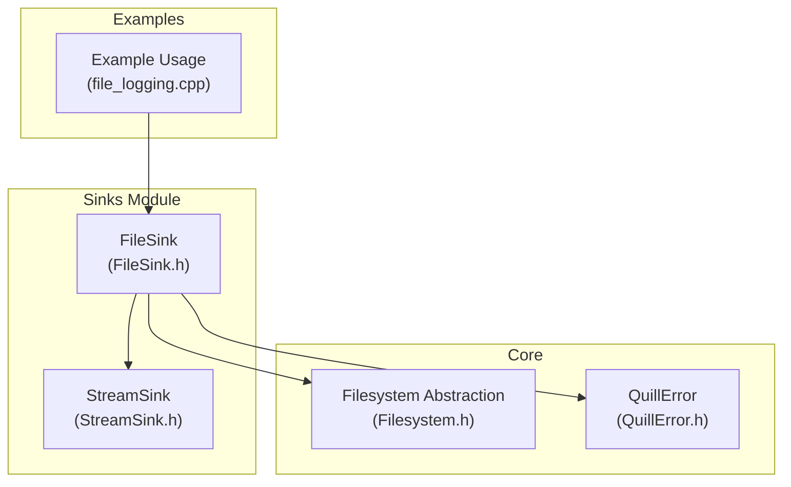
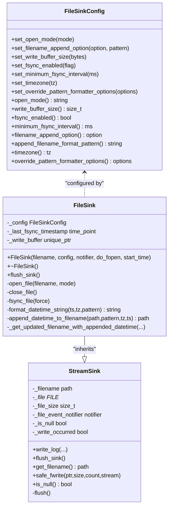
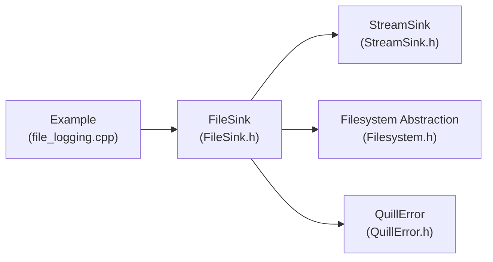

# File Sink

<cite>
**Referenced Files in This Document**
- [FileSink.h](file://include/quill/sinks/FileSink.h)
- [StreamSink.h](file://include/quill/sinks/StreamSink.h)
- [Filesystem.h](file://include/quill/core/Filesystem.h)
- [QuillError.h](file://include/quill/core/QuillError.h)
- [file_logging.cpp](file://examples/file_logging.cpp)
- [FileSinkTest.cpp](file://test/unit_tests/FileSinkTest.cpp)
</cite>

## Table of Contents
1. [Introduction](#introduction)
2. [Project Structure](#project-structure)
3. [Core Components](#core-components)
4. [Architecture Overview](#architecture-overview)
5. [Detailed Component Analysis](#detailed-component-analysis)
6. [Dependency Analysis](#dependency-analysis)
7. [Performance Considerations](#performance-considerations)
8. [Troubleshooting Guide](#troubleshooting-guide)
9. [Conclusion](#conclusion)

## Introduction
This document provides comprehensive documentation for the FileSink implementation in Quill. It explains the FileSink class constructor, file opening modes, append vs truncate behavior, file descriptor management, buffering strategies, flush policies, and disk I/O optimization. It also covers error handling for file operations, including permission errors, disk space issues, and file locking conflicts, along with practical examples of file sink creation, log file management, and integration with file system operations. Thread-safety considerations and performance implications of different buffering strategies are included.

## Project Structure
The FileSink resides in the sinks module and builds upon the StreamSink base class. It integrates with the Quill filesystem abstraction and error handling mechanisms.

**Diagram sources**
- [FileSink.h:226-527](file://include/quill/sinks/FileSink.h#L226-L527)
- [StreamSink.h:67-314](file://include/quill/sinks/StreamSink.h#L67-L314)
- [Filesystem.h:51-67](file://include/quill/core/Filesystem.h#L51-L67)
- [QuillError.h:45-57](file://include/quill/core/QuillError.h#L45-L57)
- [file_logging.cpp:36-55](file://examples/file_logging.cpp#L36-L55)

**Section sources**
- [FileSink.h:226-527](file://include/quill/sinks/FileSink.h#L226-L527)
- [StreamSink.h:67-314](file://include/quill/sinks/StreamSink.h#L67-L314)
- [Filesystem.h:51-67](file://include/quill/core/Filesystem.h#L51-L67)
- [QuillError.h:45-57](file://include/quill/core/QuillError.h#L45-L57)
- [file_logging.cpp:36-55](file://examples/file_logging.cpp#L36-L55)

## Core Components
- FileSinkConfig: Holds configuration options for FileSink, including open mode, filename append behavior, write buffer size, fsync settings, and minimum fsync interval.
- FileSink: Inherits from StreamSink and manages file opening, buffering, flushing, and fsync operations. It supports filename timestamp appending and handles file deletion detection and reopening.
- StreamSink: Base class providing common stream handling, directory creation, safe write operations, and flush logic.
- Filesystem Abstraction: Provides cross-platform filesystem support via std::filesystem or experimental filesystem.
- QuillError: Custom exception type used for throwing descriptive errors.

Key responsibilities:
- Constructor: Validates configuration, optionally opens the file, and prepares filename with optional timestamp suffix.
- File Opening Modes: Supports append ('a') and truncate ('w') modes with platform-specific flags and descriptors.
- Buffering: Configurable user buffer size with automatic setvbuf setup.
- Flush Policy: Flushes underlying stream and optionally performs fsync with minimum interval enforcement.
- Error Handling: Throws QuillError on failures, retries transient failures, and handles partial writes.

**Section sources**
- [FileSink.h:64-220](file://include/quill/sinks/FileSink.h#L64-L220)
- [FileSink.h:226-527](file://include/quill/sinks/FileSink.h#L226-L527)
- [StreamSink.h:67-314](file://include/quill/sinks/StreamSink.h#L67-L314)
- [Filesystem.h:51-67](file://include/quill/core/Filesystem.h#L51-L67)
- [QuillError.h:45-57](file://include/quill/core/QuillError.h#L45-L57)

## Architecture Overview
The FileSink architecture centers around a configuration-driven design that delegates stream handling to StreamSink while adding file-specific behaviors.

**Diagram sources**
- [FileSink.h:64-220](file://include/quill/sinks/FileSink.h#L64-L220)
- [StreamSink.h:67-314](file://include/quill/sinks/StreamSink.h#L67-L314)
- [FileSink.h:226-527](file://include/quill/sinks/FileSink.h#L226-L527)

## Detailed Component Analysis

### FileSinkConfig
- Purpose: Centralized configuration for FileSink behavior.
- Key Options:
  - Open Mode: 'a' for append, 'w' for truncate. Accepts char or string_view.
  - Filename Append Option: None, StartDate, StartDateTime, StartCustomTimestampFormat. Custom pattern requires a valid strftime pattern.
  - Timezone: LocalTime or GmtTime for timestamp operations.
  - fsync Enabled: Enables fsync on flush.
  - Minimum fsync Interval: Enforces a minimum time between fsync calls.
  - Write Buffer Size: Custom buffer size for fwrite; enforced to be at least 4096 bytes when non-zero; zero disables custom buffering.
  - Override Pattern Formatter Options: Allows per-sink formatter customization.

Behavioral Notes:
- Setting a non-zero minimum fsync interval requires fsync to be enabled; otherwise, construction throws.
- Filename append pattern defaults are provided for StartDate and StartDateTime; custom requires a pattern.

**Section sources**
- [FileSink.h:64-220](file://include/quill/sinks/FileSink.h#L64-L220)

### FileSink Constructor and Initialization
- Constructor Signature: Takes filename, FileSinkConfig, optional FileEventNotifier, do_fopen flag, and start_time.
- Validation:
  - Throws QuillError if fsync is disabled but minimum fsync interval is non-zero.
- File Opening:
  - If do_fopen is true, calls open_file with the configured open mode.
  - Uses filename timestamp appending when enabled.
- Event Notifications:
  - before_open, after_open callbacks are invoked during file open/close lifecycle.

Open Mode Behavior:
- Append Mode ('a'): Uses O_APPEND on Unix; opens with _SH_DENYNO on Windows to allow other processes to read the file.
- Truncate Mode ('w'): Uses O_TRUNC on Unix; truncates file on open.

**Section sources**
- [FileSink.h:226-257](file://include/quill/sinks/FileSink.h#L226-L257)
- [FileSink.h:362-439](file://include/quill/sinks/FileSink.h#L362-L439)

### File Opening and Descriptor Management
- Windows:
  - Uses _fsopen with _SH_DENYNO to allow concurrent readers.
  - Prevents child processes from inheriting the file handle via SetHandleInformation.
- Unix:
  - Uses open() with O_CREAT | O_WRONLY | O_CLOEXEC.
  - Applies O_TRUNC for 'w' and O_APPEND for 'a'.
  - Converts file descriptor to FILE* via fdopen.
- Retry Logic:
  - Retries up to three times with a small delay to handle transient failures (e.g., antivirus locks).
- Buffer Setup:
  - If write_buffer_size is non-zero, allocates a buffer and applies setvbuf with _IOFBF.
- Error Handling:
  - Throws QuillError with detailed errno and error message on failure.

**Section sources**
- [FileSink.h:362-439](file://include/quill/sinks/FileSink.h#L362-L439)

### File Closing and Reopening
- close_file():
  - Invokes before_close callback, closes FILE*, sets pointer to null, and invokes after_close callback.
- flush_sink():
  - Calls StreamSink::flush_sink().
  - Optionally fsyncs the file if fsync_enabled is true.
  - Checks if the file still exists; if not, closes and reopens with mode 'w' to recreate the file.

**Section sources**
- [FileSink.h:444-485](file://include/quill/sinks/FileSink.h#L444-L485)

### Filename Timestamp Appending
- _get_updated_filename_with_appended_datetime():
  - Returns original filename for None or /dev/null.
  - Otherwise, appends timestamp using append_datetime_to_filename.
- append_datetime_to_filename():
  - Splits filename into stem and extension.
  - Formats timestamp using format_datetime_string with provided pattern and timezone.
- format_datetime_string():
  - Converts nanoseconds to seconds and uses gmtime/localtime depending on timezone.
  - Applies strftime pattern to construct the suffix.

**Section sources**
- [FileSink.h:298-355](file://include/quill/sinks/FileSink.h#L298-L355)
- [FileSink.h:497-515](file://include/quill/sinks/FileSink.h#L497-L515)

### Buffering Strategies and Flush Policies
- Buffering:
  - Custom write buffer size via FileSinkConfig.set_write_buffer_size().
  - Minimum buffer size enforced at 4096 bytes; zero disables custom buffering.
  - setvbuf is applied with _IOFBF for full buffering.
- Flush Policy:
  - StreamSink::flush_sink() flushes the underlying stream.
  - FileSink::flush_sink() conditionally calls fsync_file().
- fsync Control:
  - fsync_file(force=false): Respects minimum_fsync_interval to limit fsync frequency.
  - fsync_file(force=true): Forces fsync regardless of interval.
- Safe Write Operations:
  - StreamSink::safe_fwrite() ensures complete writes and handles partial writes and errors.

**Section sources**
- [FileSink.h:146-173](file://include/quill/sinks/FileSink.h#L146-L173)
- [FileSink.h:264-288](file://include/quill/sinks/FileSink.h#L264-L288)
- [FileSink.h:468-485](file://include/quill/sinks/FileSink.h#L468-L485)
- [StreamSink.h:185-299](file://include/quill/sinks/StreamSink.h#L185-L299)

### Error Handling for File Operations
- Permission Errors:
  - fopen/fdopen failures trigger QuillError with errno and strerror details.
- Disk Space Issues:
  - fwrite/fflush failures raise QuillError with errno and error message.
- File Locking Conflicts:
  - Windows: _fsopen with _SH_DENYNO allows other processes to read; retry logic mitigates transient locks.
  - Unix: O_CLOEXEC prevents child process inheritance; open() flags control append/truncate behavior.
- Partial Writes:
  - StreamSink::safe_fwrite() retries partial writes and treats zero-byte writes without error as fatal to avoid infinite loops.

**Section sources**
- [FileSink.h:418-432](file://include/quill/sinks/FileSink.h#L418-L432)
- [StreamSink.h:254-278](file://include/quill/sinks/StreamSink.h#L254-L278)

### Examples of File Sink Creation and Log File Management
- Example Usage:
  - Demonstrates creating a FileSink with custom open mode and filename timestamp appending.
  - Shows configuring a logger with a FileSink and enabling immediate flush in debug builds.
- Unit Tests:
  - Validate filename timestamp appending for StartDate, StartDateTime, and custom patterns.
  - Verify directory creation and symlink handling on Unix-like systems.
  - Confirm fsync interval validation and behavior.

**Section sources**
- [file_logging.cpp:36-55](file://examples/file_logging.cpp#L36-L55)
- [FileSinkTest.cpp:54-120](file://test/unit_tests/FileSinkTest.cpp#L54-L120)
- [FileSinkTest.cpp:123-144](file://test/unit_tests/FileSinkTest.cpp#L123-L144)
- [FileSinkTest.cpp:150-182](file://test/unit_tests/FileSinkTest.cpp#L150-L182)

### Integration with File System Operations
- Directory Creation:
  - StreamSink constructor creates parent directories if needed and canonicalizes the path.
- File Existence Check:
  - FileSink::flush_sink() checks fs::exists(_filename) and reopens if missing.
- File Event Notifier:
  - Callbacks for before_open, after_open, before_close, after_close, and before_write allow integration with external systems.

**Section sources**
- [StreamSink.h:101-144](file://include/quill/sinks/StreamSink.h#L101-L144)
- [FileSink.h:279-287](file://include/quill/sinks/FileSink.h#L279-L287)
- [StreamSink.h:55-62](file://include/quill/sinks/StreamSink.h#L55-L62)

### Thread Safety Considerations
- Single Writer Assumption:
  - Buffered output streams are designed for single-threaded writers; concurrent writes without external synchronization may lead to data races.
- Backend Worker Thread:
  - FileEventNotifier callbacks execute on the backend worker thread.
- Concurrency Implications:
  - While FileSink itself is not inherently thread-safe for concurrent writes, the backend worker ensures serialized flush operations.

**Section sources**
- [StreamSink.h:366-367](file://include/quill/bundled/fmt/format-inl.h#L366-L367)

## Dependency Analysis
FileSink depends on StreamSink for stream handling and on the filesystem abstraction for path operations. It throws QuillError on failures and integrates with the backend worker thread for event notifications.

**Diagram sources**
- [FileSink.h:226-527](file://include/quill/sinks/FileSink.h#L226-L527)
- [StreamSink.h:67-314](file://include/quill/sinks/StreamSink.h#L67-L314)
- [Filesystem.h:51-67](file://include/quill/core/Filesystem.h#L51-L67)
- [QuillError.h:45-57](file://include/quill/core/QuillError.h#L45-L57)
- [file_logging.cpp:36-55](file://examples/file_logging.cpp#L36-L55)

**Section sources**
- [FileSink.h:226-527](file://include/quill/sinks/FileSink.h#L226-L527)
- [StreamSink.h:67-314](file://include/quill/sinks/StreamSink.h#L67-L314)
- [Filesystem.h:51-67](file://include/quill/core/Filesystem.h#L51-L67)
- [QuillError.h:45-57](file://include/quill/core/QuillError.h#L45-L57)
- [file_logging.cpp:36-55](file://examples/file_logging.cpp#L36-L55)

## Performance Considerations
- Buffering Strategy:
  - Full buffering via setvbuf reduces syscalls; larger buffers improve throughput but increase latency.
  - Minimum buffer size of 4096 bytes prevents overly small buffers.
- fsync Frequency:
  - Use minimum_fsync_interval to reduce disk wear and improve throughput.
  - fsync is expensive; enable only when durability guarantees are required.
- Open Mode Choice:
  - Append mode avoids truncation overhead; truncate mode resets file size.
- Platform-Specific Optimizations:
  - Windows: _SH_DENYNO allows concurrent readers; prevents handle inheritance.
  - Unix: O_CLOEXEC prevents unintended file descriptor inheritance.
- Safe Write Loop:
  - StreamSink::safe_fwrite() ensures complete writes; avoid excessive partial writes by tuning buffer sizes.

[No sources needed since this section provides general guidance]

## Troubleshooting Guide
Common issues and resolutions:
- Permission Denied:
  - Ensure the process has write permissions to the target directory and file path.
  - Check antivirus or file system policies blocking file handles.
- Disk Space Exhaustion:
  - Monitor free disk space; ensure sufficient capacity for log growth.
- File Locked by Another Process:
  - On Windows, _fsopen with _SH_DENYNO allows reads; retry logic helps mitigate transient locks.
  - On Unix, O_CLOEXEC prevents inherited handles; verify no lingering processes hold the file.
- Unexpected File Deletion:
  - FileSink::flush_sink() detects missing files and reopens with truncate mode to recreate the file.
- Excessive fsync Overhead:
  - Disable fsync or increase minimum_fsync_interval to reduce disk I/O pressure.
- Partial Write Errors:
  - StreamSink::safe_fwrite() throws on persistent partial writes; investigate storage health and buffer sizes.

**Section sources**
- [FileSink.h:418-432](file://include/quill/sinks/FileSink.h#L418-L432)
- [StreamSink.h:254-278](file://include/quill/sinks/StreamSink.h#L254-L278)
- [FileSink.h:279-287](file://include/quill/sinks/FileSink.h#L279-L287)

## Conclusion
The FileSink implementation in Quill provides a robust, configurable mechanism for writing logs to files with careful attention to buffering, fsync control, and error handling. Its design leverages StreamSink for common stream operations while adding file-specific features such as filename timestamp appending, platform-aware file descriptor management, and resilient open/close semantics. Proper configuration of buffering and fsync intervals enables balancing performance and durability, while the integrated error handling and retry logic improves reliability in real-world environments.