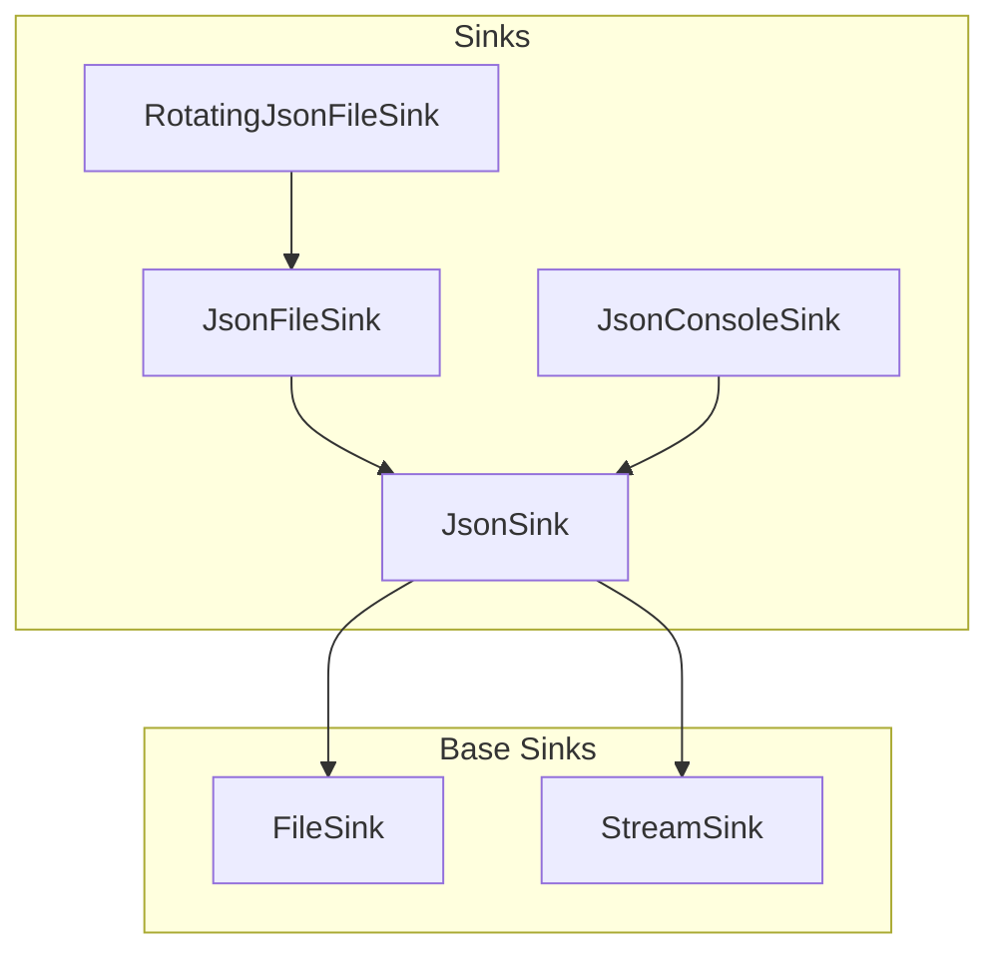
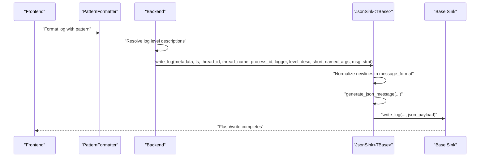
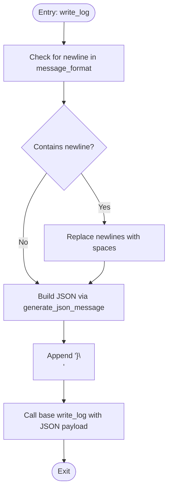
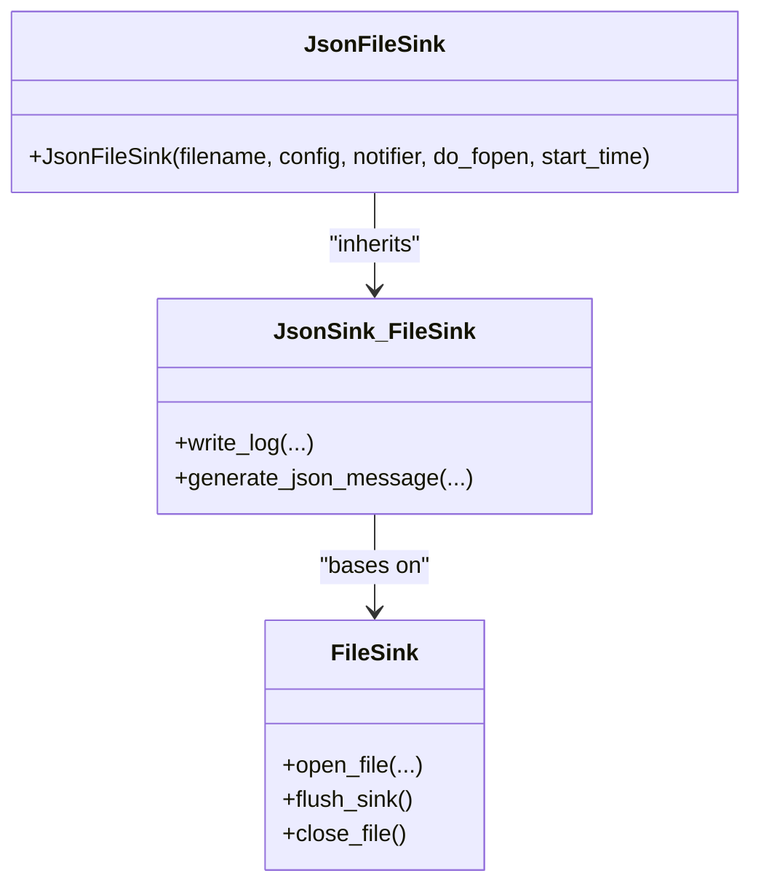
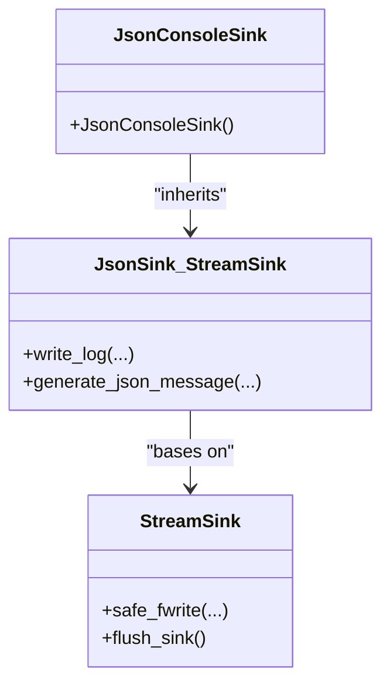
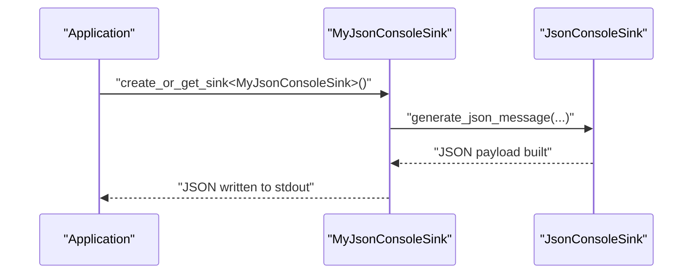
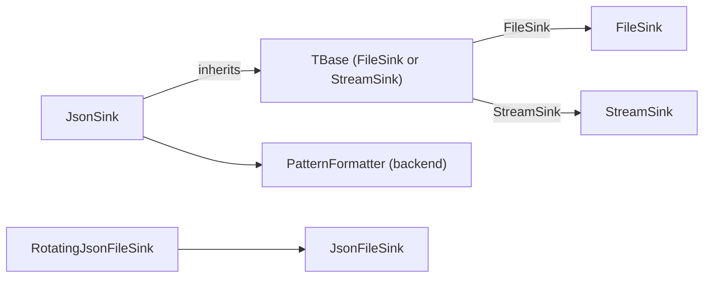

# JSON Sink

<cite>
**Referenced Files in This Document**
- [JsonSink.h](file://include/quill/sinks/JsonSink.h)
- [FileSink.h](file://include/quill/sinks/FileSink.h)
- [StreamSink.h](file://include/quill/sinks/StreamSink.h)
- [RotatingJsonFileSink.h](file://include/quill/sinks/RotatingJsonFileSink.h)
- [json_console_logging.cpp](file://examples/json_console_logging.cpp)
- [json_console_logging_custom_json.cpp](file://examples/json_console_logging_custom_json.cpp)
- [json_file_logging.cpp](file://examples/json_file_logging.cpp)
- [JsonConsoleLoggingTest.cpp](file://test/integration_tests/JsonConsoleLoggingTest.cpp)
- [JsonFileLoggingTest.cpp](file://test/integration_tests/JsonFileLoggingTest.cpp)
- [json_logging.rst](file://docs/json_logging.rst)
- [PatternFormatter.h](file://include/quill/backend/PatternFormatter.h)
- [Attributes.h](file://include/quill/core/Attributes.h)
</cite>

## Table of Contents
1. [Introduction](#introduction)
2. [Project Structure](#project-structure)
3. [Core Components](#core-components)
4. [Architecture Overview](#architecture-overview)
5. [Detailed Component Analysis](#detailed-component-analysis)
6. [Dependency Analysis](#dependency-analysis)
7. [Performance Considerations](#performance-considerations)
8. [Troubleshooting Guide](#troubleshooting-guide)
9. [Conclusion](#conclusion)

## Introduction
This document explains the JsonSink implementation in Quill, focusing on the JsonFileSink and JsonConsoleSink classes. It covers constructor parameters, JSON formatting behavior, structured output fields, customization hooks, performance characteristics, thread-safety, and error handling. It also provides practical configuration examples and guidance for integrating with JSON parsing tools.

## Project Structure
The JSON sink is implemented as a template-based specialization layered over base sink types:
- JsonSink<TBase> is a template that inherits from a base sink type TBase (e.g., FileSink or StreamSink).
- JsonFileSink specializes JsonSink over FileSink.
- JsonConsoleSink specializes JsonSink over StreamSink.
- RotatingJsonFileSink is provided as a convenience alias over a rotating wrapper around JsonFileSink.

**Diagram sources**
- [JsonSink.h:140-162](file://include/quill/sinks/JsonSink.h#L140-L162)
- [FileSink.h:226-257](file://include/quill/sinks/FileSink.h#L226-L257)
- [StreamSink.h:67-145](file://include/quill/sinks/StreamSink.h#L67-L145)
- [RotatingJsonFileSink.h:14-14](file://include/quill/sinks/RotatingJsonFileSink.h#L14-L14)

**Section sources**
- [JsonSink.h:140-162](file://include/quill/sinks/JsonSink.h#L140-L162)
- [FileSink.h:226-257](file://include/quill/sinks/FileSink.h#L226-L257)
- [StreamSink.h:67-145](file://include/quill/sinks/StreamSink.h#L67-L145)
- [RotatingJsonFileSink.h:14-14](file://include/quill/sinks/RotatingJsonFileSink.h#L14-L14)

## Core Components
- JsonSink<TBase>: Implements JSON serialization and formatting for log events. It:
  - Normalizes newline characters in the message format to keep JSON valid.
  - Builds a JSON object incrementally into an internal buffer.
  - Invokes the base sink’s write_log with the final JSON payload.
  - Exposes a virtual generate_json_message hook for customization.
- JsonFileSink: A concrete JSON sink over FileSink, constructed with a filename, FileSinkConfig, optional file event notifier, and optional initial open behavior.
- JsonConsoleSink: A concrete JSON sink over StreamSink, targeting stdout.
- RotatingJsonFileSink: A type alias for rotating JsonFileSink.

Key constructor parameters and behaviors:
- JsonFileSink(filename, config, file_event_notifier, do_fopen, start_time): Delegates to the JsonSink<FileSink> base with the same parameters. The FileSinkConfig controls open mode, filename append behavior, write buffer size, fsync behavior, and timezone.
- JsonConsoleSink(): Delegates to JsonSink<StreamSink> with “stdout” as the stream identifier.

Default JSON fields produced by the base implementation:
- timestamp: Nanosecond-precision log timestamp encoded as a string.
- file_name: Source file name from macro metadata.
- line: Source line number from macro metadata.
- thread_id: Thread identifier string.
- logger: Logger name string.
- log_level: Human-readable log level string.
- message: The formatted message string (with newlines normalized).

Additional named arguments are appended as key-value pairs.

**Section sources**
- [JsonSink.h:58-129](file://include/quill/sinks/JsonSink.h#L58-L129)
- [JsonSink.h:140-162](file://include/quill/sinks/JsonSink.h#L140-L162)
- [FileSink.h:64-220](file://include/quill/sinks/FileSink.h#L64-L220)
- [FileSink.h:238-257](file://include/quill/sinks/FileSink.h#L238-L257)
- [StreamSink.h:78-145](file://include/quill/sinks/StreamSink.h#L78-L145)

## Architecture Overview
The JSON sink participates in the standard Quill logging pipeline:
- Frontend: Logger and PatternFormatter produce a formatted log statement (unless overridden by the sink).
- Backend: For sinks that override the formatter (like JsonFileSink/JsonConsoleSink), the backend computes a default formatted message and passes it to the sink.
- JsonSink: Receives metadata, timestamp, thread info, process id, logger name, log level, and named arguments. It constructs a JSON object and forwards it to the base sink.

**Diagram sources**
- [PatternFormatter.h:99-132](file://include/quill/backend/PatternFormatter.h#L99-L132)
- [JsonSink.h:58-93](file://include/quill/sinks/JsonSink.h#L58-L93)
- [StreamSink.h:152-180](file://include/quill/sinks/StreamSink.h#L152-L180)

**Section sources**
- [PatternFormatter.h:99-132](file://include/quill/backend/PatternFormatter.h#L99-L132)
- [JsonSink.h:58-93](file://include/quill/sinks/JsonSink.h#L58-L93)
- [StreamSink.h:152-180](file://include/quill/sinks/StreamSink.h#L152-L180)

## Detailed Component Analysis

### JsonSink Template and JSON Generation
- write_log:
  - Detects and replaces newline characters in the message format to ensure valid single-line JSON.
  - Clears the internal JSON buffer and delegates to generate_json_message.
  - Appends a closing brace and newline, then calls the base sink’s write_log with the JSON payload.
- generate_json_message (virtual):
  - Default implementation emits a standard JSON object with timestamp, source metadata, thread info, logger, log level, and message.
  - Iterates over named_args and appends each as a key-value pair.
  - Derived classes can override this to change field order, add/remove fields, or adjust formatting.

**Diagram sources**
- [JsonSink.h:66-93](file://include/quill/sinks/JsonSink.h#L66-L93)
- [JsonSink.h:104-129](file://include/quill/sinks/JsonSink.h#L104-L129)

**Section sources**
- [JsonSink.h:58-129](file://include/quill/sinks/JsonSink.h#L58-L129)

### JsonFileSink
- Purpose: Writes JSON logs to a file.
- Constructor parameters:
  - filename: Target file path.
  - config: FileSinkConfig controlling open mode, filename append behavior, write buffer size, fsync behavior, and timezone.
  - file_event_notifier: Optional callbacks invoked around file open/close and before write.
  - do_fopen: If false, the file is not opened immediately.
  - start_time: Reference time used when appending timestamps to filenames.
- Behavior: Inherits JSON generation from JsonSink<FileSink>, then writes to the configured file via FileSink.

**Diagram sources**
- [JsonSink.h:140-152](file://include/quill/sinks/JsonSink.h#L140-L152)
- [FileSink.h:226-257](file://include/quill/sinks/FileSink.h#L226-L257)

**Section sources**
- [JsonSink.h:140-152](file://include/quill/sinks/JsonSink.h#L140-L152)
- [FileSink.h:64-220](file://include/quill/sinks/FileSink.h#L64-L220)
- [FileSink.h:238-257](file://include/quill/sinks/FileSink.h#L238-L257)

### JsonConsoleSink
- Purpose: Writes JSON logs to stdout.
- Constructor: JsonConsoleSink() initializes the base JsonSink<StreamSink> with “stdout”.

**Diagram sources**
- [JsonSink.h:157-162](file://include/quill/sinks/JsonSink.h#L157-L162)
- [StreamSink.h:67-145](file://include/quill/sinks/StreamSink.h#L67-L145)

**Section sources**
- [JsonSink.h:157-162](file://include/quill/sinks/JsonSink.h#L157-L162)
- [StreamSink.h:78-145](file://include/quill/sinks/StreamSink.h#L78-L145)

### Custom JSON Schema and Field Selection
- Override generate_json_message in a derived sink to:
  - Change field order.
  - Add or remove fields.
  - Adjust timestamp encoding or metadata inclusion.
- Example: A custom sink overrides generate_json_message to emit a minimal schema and still include named arguments.

**Diagram sources**
- [json_console_logging_custom_json.cpp:12-40](file://examples/json_console_logging_custom_json.cpp#L12-L40)
- [JsonSink.h:104-129](file://include/quill/sinks/JsonSink.h#L104-L129)

**Section sources**
- [json_console_logging_custom_json.cpp:12-40](file://examples/json_console_logging_custom_json.cpp#L12-L40)
- [JsonSink.h:104-129](file://include/quill/sinks/JsonSink.h#L104-L129)

### Structured JSON Output and Field Organization
- Default fields include: timestamp, file_name, line, thread_id, logger, log_level, message.
- Named arguments are appended as key-value pairs.
- Newlines in the message format are normalized to spaces to keep JSON valid.

Practical examples:
- Console JSON logging with LOGJ_ macros and manual named placeholders.
- File JSON logging with hybrid logger writing to both JSON and console.

**Section sources**
- [JsonSink.h:66-129](file://include/quill/sinks/JsonSink.h#L66-L129)
- [json_console_logging.cpp:17-34](file://examples/json_console_logging.cpp#L17-L34)
- [json_file_logging.cpp:27-42](file://examples/json_file_logging.cpp#L27-L42)
- [json_file_logging.cpp:63-69](file://examples/json_file_logging.cpp#L63-L69)

### Nested Objects and Complex Fields
- The default implementation appends named arguments as simple key-value pairs.
- To emit nested JSON objects, override generate_json_message to construct richer structures (e.g., embed a structured context object) and append them to the buffer.
- Ensure proper escaping of embedded JSON strings to maintain validity.

[No sources needed since this section provides general guidance]

### JSON Validation and Error Handling
- Newline normalization ensures single-line JSON validity.
- The base StreamSink performs robust writes and throws QuillError on partial writes or flush failures.
- FileSink handles file reopening if the file is deleted during runtime and supports configurable fsync behavior.

**Section sources**
- [JsonSink.h:66-93](file://include/quill/sinks/JsonSink.h#L66-L93)
- [StreamSink.h:214-278](file://include/quill/sinks/StreamSink.h#L214-L278)
- [FileSink.h:264-288](file://include/quill/sinks/FileSink.h#L264-L288)

### Thread Safety and Concurrency
- JsonSink::write_log is invoked from the backend worker thread for each log event.
- The internal buffers used by JsonSink are per-instance members; there is no cross-thread sharing of the JSON buffer in the base class.
- FileSink and StreamSink perform thread-safe writes via their respective flush and write routines.

Recommendations:
- Prefer one JsonSink instance per logical destination (e.g., one file) to avoid contention.
- When using multiple sinks concurrently, rely on the backend’s single-consumer model for each sink.

**Section sources**
- [JsonSink.h:58-93](file://include/quill/sinks/JsonSink.h#L58-L93)
- [StreamSink.h:152-180](file://include/quill/sinks/StreamSink.h#L152-L180)
- [FileSink.h:264-288](file://include/quill/sinks/FileSink.h#L264-L288)

## Dependency Analysis
JsonSink composes with base sink types and integrates with the broader Quill infrastructure.

**Diagram sources**
- [JsonSink.h:31-38](file://include/quill/sinks/JsonSink.h#L31-L38)
- [PatternFormatter.h:99-132](file://include/quill/backend/PatternFormatter.h#L99-L132)
- [FileSink.h:226-257](file://include/quill/sinks/FileSink.h#L226-L257)
- [StreamSink.h:67-145](file://include/quill/sinks/StreamSink.h#L67-L145)
- [RotatingJsonFileSink.h:14-14](file://include/quill/sinks/RotatingJsonFileSink.h#L14-L14)

**Section sources**
- [JsonSink.h:31-38](file://include/quill/sinks/JsonSink.h#L31-L38)
- [PatternFormatter.h:99-132](file://include/quill/backend/PatternFormatter.h#L99-L132)
- [FileSink.h:226-257](file://include/quill/sinks/FileSink.h#L226-L257)
- [StreamSink.h:67-145](file://include/quill/sinks/StreamSink.h#L67-L145)
- [RotatingJsonFileSink.h:14-14](file://include/quill/sinks/RotatingJsonFileSink.h#L14-L14)

## Performance Considerations
- Memory usage:
  - JsonSink uses an internal fmtquill::memory_buffer to build the JSON payload. This avoids repeated allocations and minimizes heap churn.
  - The buffer is cleared per event and reused, keeping per-event memory overhead predictable.
- Serialization cost:
  - The default generate_json_message concatenates pre-formatted fields and named arguments. Overhead is dominated by string copying and formatting of numeric fields.
- I/O throughput:
  - JsonFileSink leverages FileSinkConfig to tune write buffer size and optional fsync behavior. Larger buffers reduce syscalls and improve throughput.
  - JsonConsoleSink writes directly to stdout via StreamSink::safe_fwrite, which uses platform-specific optimized paths on Windows and POSIX systems.
- Hot-path attributes:
  - JsonSink::write_log and generate_json_message are marked as hot, indicating they are expected to be on the fast path.

Optimization tips:
- Use empty pattern for JSON sinks to avoid redundant formatting work.
- Tune FileSinkConfig::set_write_buffer_size for high-throughput file logging.
- Consider disabling fsync unless durability guarantees require it.

**Section sources**
- [JsonSink.h:132-133](file://include/quill/sinks/JsonSink.h#L132-L133)
- [FileSink.h:146-149](file://include/quill/sinks/FileSink.h#L146-L149)
- [StreamSink.h:214-278](file://include/quill/sinks/StreamSink.h#L214-L278)
- [Attributes.h:104-109](file://include/quill/core/Attributes.h#L104-L109)

## Troubleshooting Guide
Common issues and resolutions:
- Invalid JSON due to newlines:
  - The sink normalizes newlines in the message format. If your message contains literal newlines, they will be converted to spaces. Verify your message format expectations.
- Non-printable characters:
  - Messages with non-printable characters are escaped appropriately in tests. If your parser expects strict control character handling, validate against test outputs.
- Mixed sinks and formats:
  - When combining JSON and standard formats, ensure the JSON sink uses an empty pattern to avoid redundant formatting. See examples.
- File lifecycle:
  - If the underlying file is deleted while the process runs, FileSink will reopen the file. Monitor for unexpected reopen events.

Validation references:
- Console JSON logging tests confirm expected field presence and argument expansion.
- File JSON logging tests cover multi-threaded scenarios, non-printable characters, invalid formats, and extra arguments.

**Section sources**
- [JsonSink.h:66-80](file://include/quill/sinks/JsonSink.h#L66-L80)
- [JsonConsoleLoggingTest.cpp:69-75](file://test/integration_tests/JsonConsoleLoggingTest.cpp#L69-L75)
- [JsonFileLoggingTest.cpp:172-192](file://test/integration_tests/JsonFileLoggingTest.cpp#L172-L192)
- [FileSink.h:279-287](file://include/quill/sinks/FileSink.h#L279-L287)

## Conclusion
Quill’s JsonSink provides a flexible, high-performance foundation for emitting structured JSON logs. Its template design cleanly separates JSON formatting from I/O, enabling straightforward customization and robust integration with file and console backends. By tuning FileSinkConfig, leveraging empty patterns for JSON-only sinks, and overriding generate_json_message when needed, you can tailor the output to your parsing tools and operational requirements.