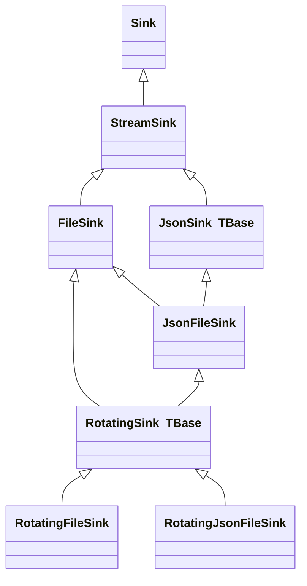
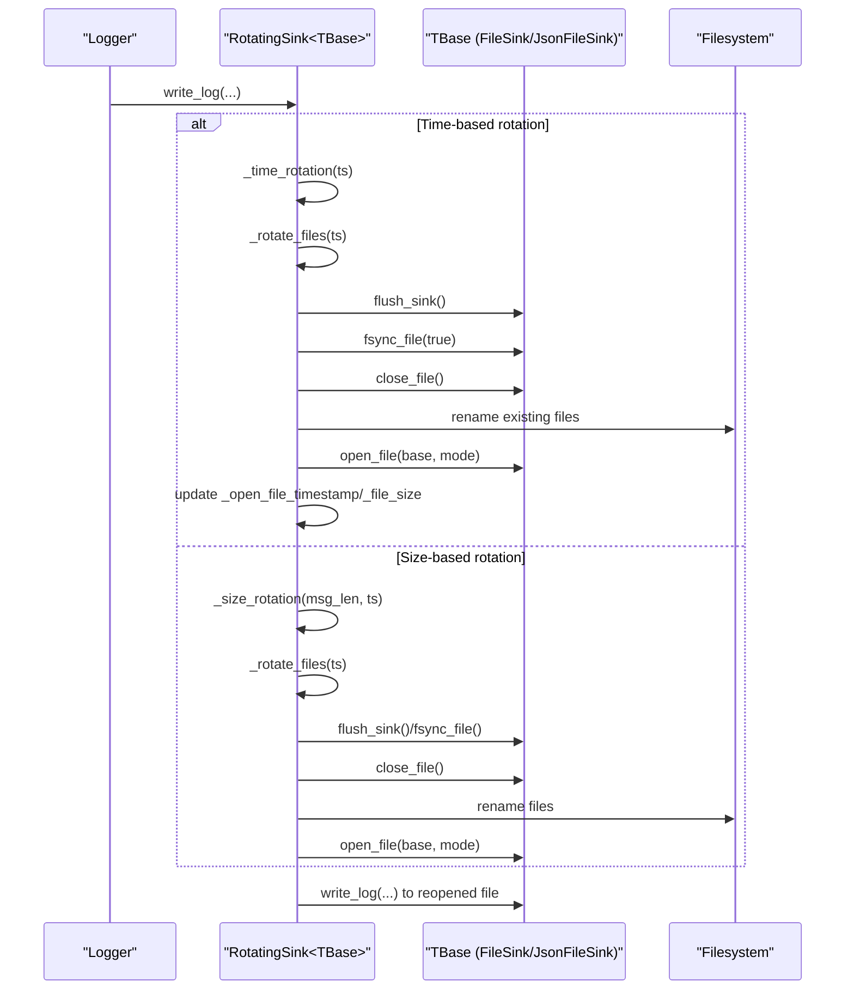
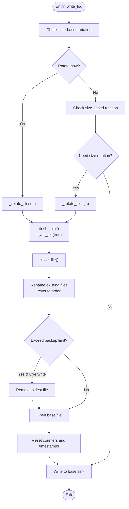
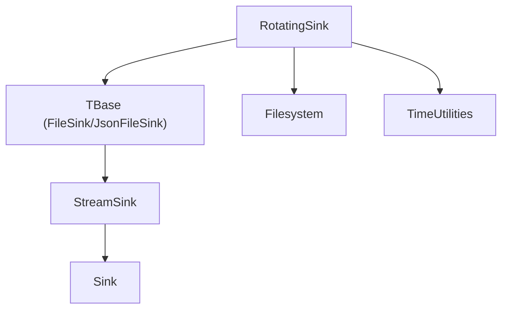

# Rotating Sink

<cite>
**Referenced Files in This Document**
- [RotatingSink.h](file://include/quill/sinks/RotatingSink.h)
- [RotatingFileSink.h](file://include/quill/sinks/RotatingFileSink.h)
- [RotatingJsonFileSink.h](file://include/quill/sinks/RotatingJsonFileSink.h)
- [FileSink.h](file://include/quill/sinks/FileSink.h)
- [JsonSink.h](file://include/quill/sinks/JsonSink.h)
- [StreamSink.h](file://include/quill/sinks/StreamSink.h)
- [rotating_file_logging.cpp](file://examples/rotating_file_logging.cpp)
- [rotating_json_file_logging.cpp](file://examples/rotating_json_file_logging.cpp)
- [RotatingFileSinkTest.cpp](file://test/unit_tests/RotatingFileSinkTest.cpp)
- [RotatingSinkKeepOldestTest.cpp](file://test/integration_tests/RotatingSinkKeepOldestTest.cpp)
- [RotatingSinkOverwriteOldestTest.cpp](file://test/integration_tests/RotatingSinkOverwriteOldestTest.cpp)
- [RotatingSinkSizeRotationTest.cpp](file://test/integration_tests/RotatingSinkSizeRotationTest.cpp)
</cite>

## Table of Contents
1. [Introduction](#introduction)
2. [Project Structure](#project-structure)
3. [Core Components](#core-components)
4. [Architecture Overview](#architecture-overview)
5. [Detailed Component Analysis](#detailed-component-analysis)
6. [Dependency Analysis](#dependency-analysis)
7. [Performance Considerations](#performance-considerations)
8. [Troubleshooting Guide](#troubleshooting-guide)
9. [Conclusion](#conclusion)
10. [Appendices](#appendices)

## Introduction
This document explains Quill’s rotating sink implementations: RotatingSink, RotatingFileSink, and RotatingJsonFileSink. It covers rotation triggers (size-based and time-based), rotation policies (keep oldest vs overwrite oldest), configuration parameters (maximum file size, backup count, rotation intervals), file naming conventions, cleanup procedures, thread safety, performance characteristics, and integration with log management systems. Practical examples and test coverage are included to illustrate behavior and edge cases.

## Project Structure
Rotating sinks are thin templates layered over base sinks:
- RotatingSink<TBase> is a template that adds rotation logic to any TBase sink (e.g., FileSink or JsonFileSink).
- RotatingFileSink is a typedef of RotatingSink<FileSink>.
- RotatingJsonFileSink is a typedef of RotatingSink<JsonFileSink>.

**Diagram sources**
- [StreamSink.h:67-147](file://include/quill/sinks/StreamSink.h#L67-L147)
- [FileSink.h:1-200](file://include/quill/sinks/FileSink.h#L1-L200)
- [JsonSink.h:137-165](file://include/quill/sinks/JsonSink.h#L137-L165)
- [RotatingSink.h:262-316](file://include/quill/sinks/RotatingSink.h#L262-L316)
- [RotatingFileSink.h:13-14](file://include/quill/sinks/RotatingFileSink.h#L13-L14)
- [RotatingJsonFileSink.h:14-14](file://include/quill/sinks/RotatingJsonFileSink.h#L14-L14)

**Section sources**
- [RotatingSink.h:262-316](file://include/quill/sinks/RotatingSink.h#L262-L316)
- [RotatingFileSink.h:13-14](file://include/quill/sinks/RotatingFileSink.h#L13-L14)
- [RotatingJsonFileSink.h:14-14](file://include/quill/sinks/RotatingJsonFileSink.h#L14-L14)

## Core Components
- RotatingFileSink: A rotating file sink built on FileSink.
- RotatingJsonFileSink: A rotating JSON file sink built on JsonFileSink.
- RotatingSink<TBase>: Template that adds rotation logic to any TBase sink. It manages:
  - Rotation triggers: size-based and time-based.
  - Backup policy: keep oldest or overwrite oldest.
  - Naming schemes: index, date, or date+time.
  - Cleanup and recovery of pre-existing rotated files.
  - File lifecycle: open, flush/fsync, rename, close, reopen.

Key configuration options are exposed via RotatingFileSinkConfig, including:
- Maximum file size for size-based rotation.
- Rotation frequency and interval (minutely, hourly, daily).
- Daily rotation time (HH:MM).
- Maximum backup files and overwrite policy.
- Rotation naming scheme (Index, Date, DateAndTime).
- Remove old files on startup and force rotation on creation.

**Section sources**
- [RotatingFileSink.h:13-14](file://include/quill/sinks/RotatingFileSink.h#L13-L14)
- [RotatingJsonFileSink.h:14-14](file://include/quill/sinks/RotatingJsonFileSink.h#L14-L14)
- [RotatingSink.h:39-257](file://include/quill/sinks/RotatingSink.h#L39-L257)

## Architecture Overview
The rotation pipeline integrates with the backend worker thread and filesystem operations. At write time, the sink checks rotation conditions and performs rotation atomically by closing the current file, renaming existing files, and reopening the base filename.

**Diagram sources**
- [RotatingSink.h:335-369](file://include/quill/sinks/RotatingSink.h#L335-L369)
- [RotatingSink.h:373-487](file://include/quill/sinks/RotatingSink.h#L373-L487)
- [RotatingSink.h:490-654](file://include/quill/sinks/RotatingSink.h#L490-L654)

## Detailed Component Analysis

### RotatingSink<TBase> Implementation
- Construction:
  - Cleans and recovers pre-existing rotated files depending on naming scheme and open mode.
  - Calculates initial rotation time if time-based rotation is enabled.
  - Opens the base file and initializes internal state.
  - Optionally rotates on creation if configured.
- Write path:
  - Checks time-based rotation first, then size-based rotation if enabled.
  - Writes to the underlying TBase sink.
- Rotation logic:
  - Flushes and fsyncs before measuring file size to ensure accurate checks.
  - Renames files in reverse order to avoid overwriting unrenamed files.
  - Enforces backup limits and overwrite policy.
  - Reopens the base file and resets counters.
- Recovery and cleanup:
  - Removes old files on startup when using write mode and index/date naming.
  - Recovers indices from existing files when using append mode.

**Diagram sources**
- [RotatingSink.h:335-369](file://include/quill/sinks/RotatingSink.h#L335-L369)
- [RotatingSink.h:373-487](file://include/quill/sinks/RotatingSink.h#L373-L487)

**Section sources**
- [RotatingSink.h:278-316](file://include/quill/sinks/RotatingSink.h#L278-L316)
- [RotatingSink.h:373-487](file://include/quill/sinks/RotatingSink.h#L373-L487)
- [RotatingSink.h:490-654](file://include/quill/sinks/RotatingSink.h#L490-L654)

### Rotation Triggers and Policies
- Size-based rotation:
  - Triggered when adding the current log message would exceed the configured maximum file size.
  - Uses the current file size plus the message length to decide.
- Time-based rotation:
  - Enabled via set_rotation_frequency_and_interval or set_rotation_time_daily.
  - Supports minutely, hourly, and daily frequencies.
  - Daily rotation time is validated and stored as HH:MM.
  - Next rotation time is calculated from the start time and frequency.
- Rotation policies:
  - Keep oldest files: when backup limit is reached, stop rotating and continue writing to the last file.
  - Overwrite oldest files: when backup limit is reached, remove the oldest file before renaming others.

**Section sources**
- [RotatingSink.h:353-363](file://include/quill/sinks/RotatingSink.h#L353-L363)
- [RotatingSink.h:373-383](file://include/quill/sinks/RotatingSink.h#L373-L383)
- [RotatingSink.h:386-393](file://include/quill/sinks/RotatingSink.h#L386-L393)
- [RotatingSink.h:801-807](file://include/quill/sinks/RotatingSink.h#L801-L807)

### Configuration Parameters
- Maximum file size:
  - Minimum enforced value is 512 bytes.
  - Used to trigger size-based rotation.
- Backup count:
  - Controls the maximum number of rotated files to keep.
  - When exceeded, policy determines whether to overwrite or stop.
- Rotation intervals:
  - Frequency: Minutely, Hourly, Daily.
  - Interval: positive integer multiplier for frequency.
- Daily rotation time:
  - Format: HH:MM; validated and stored as hours and minutes.
- Naming scheme:
  - Index: logfile.1.log, logfile.2.log, ...
  - Date: logfile.20230612.log, ...
  - DateAndTime: logfile.20230612_123456.log, ...
- Overwrite policy:
  - When true, oldest rotated files are overwritten when limit is reached.
  - When false, rotation stops and new messages are appended to the last file.
- Startup cleanup:
  - Remove old files on process start when using write mode and index/date naming.
- Force rotation on creation:
  - If enabled and the base file exists, rotate immediately on sink creation.

**Section sources**
- [RotatingSink.h:66-109](file://include/quill/sinks/RotatingSink.h#L66-L109)
- [RotatingSink.h:116-121](file://include/quill/sinks/RotatingSink.h#L116-L121)
- [RotatingSink.h:127-138](file://include/quill/sinks/RotatingSink.h#L127-L138)
- [RotatingSink.h:147-169](file://include/quill/sinks/RotatingSink.h#L147-L169)
- [RotatingSink.h:172-189](file://include/quill/sinks/RotatingSink.h#L172-L189)

### File Naming Convention and Cleanup
- Naming schemes:
  - Index: appends .N to the base filename for rotated files.
  - Date: appends .YYYYMMDD for rotated files.
  - DateAndTime: appends .YYYYMMDD_HHMMSS for rotated files.
- Cleanup on startup:
  - With write mode and index/date naming, removes colliding files from previous runs.
  - With append mode, recovers indices from existing files and continues counting.
- Recovery:
  - Parses numeric suffixes and date suffixes to reconstruct the rotation chain.

**Section sources**
- [RotatingSink.h:419-428](file://include/quill/sinks/RotatingSink.h#L419-L428)
- [RotatingSink.h:490-654](file://include/quill/sinks/RotatingSink.h#L490-L654)

### Integration with Log Management Systems
- Works seamlessly with Quill’s Frontend and Backend:
  - Create or reuse sinks via Frontend::create_or_get_sink.
  - Configure pattern formatters and timezone options.
  - Use FileEventNotifier callbacks to hook into file open/close/write events.
- Example usage:
  - File logging with daily rotation and size-based rotation.
  - JSON logging with the same rotation semantics.

**Section sources**
- [rotating_file_logging.cpp:21-32](file://examples/rotating_file_logging.cpp#L21-L32)
- [rotating_json_file_logging.cpp:21-32](file://examples/rotating_json_file_logging.cpp#L21-L32)
- [StreamSink.h:55-62](file://include/quill/sinks/StreamSink.h#L55-L62)

## Dependency Analysis
RotatingFileSink and RotatingJsonFileSink depend on RotatingSink, which depends on:
- FileSink or JsonFileSink (via template parameter).
- StreamSink for low-level write/flush operations.
- Filesystem utilities for file operations and path handling.
- Time utilities for calculating rotation timestamps and formatting datetimes.

**Diagram sources**
- [RotatingSink.h:262-316](file://include/quill/sinks/RotatingSink.h#L262-L316)
- [FileSink.h:1-200](file://include/quill/sinks/FileSink.h#L1-L200)
- [JsonSink.h:137-165](file://include/quill/sinks/JsonSink.h#L137-L165)
- [StreamSink.h:67-147](file://include/quill/sinks/StreamSink.h#L67-L147)

**Section sources**
- [RotatingSink.h:262-316](file://include/quill/sinks/RotatingSink.h#L262-L316)
- [FileSink.h:1-200](file://include/quill/sinks/FileSink.h#L1-L200)
- [JsonSink.h:137-165](file://include/quill/sinks/JsonSink.h#L137-L165)
- [StreamSink.h:67-147](file://include/quill/sinks/StreamSink.h#L67-L147)

## Performance Considerations
- Rotation checks:
  - Size-based checks occur per write; minimal overhead except during rotation.
  - Time-based checks compare nanosecond timestamps against a cached next rotation time.
- Filesystem operations:
  - Rotation involves flush, fsync, close, rename, and open. These are relatively expensive.
  - On Windows, rename retries with a short sleep to handle antivirus file locks.
- Buffering:
  - Underlying FileSink supports configurable write buffer size and fsync intervals.
- Concurrency:
  - Rotation is performed within the write path; ensure thread-safe usage of the same sink instance.
  - Backend worker thread handles flush and fsync; avoid external concurrent writes to the same file.

[No sources needed since this section provides general guidance]

## Troubleshooting Guide
Common issues and resolutions:
- Full disk during rotation:
  - If the file size is zero after flush/fsync, rotation is skipped to prevent empty rotations.
- Antivirus or OS file locks:
  - Rename operations retry once with a brief sleep to accommodate temporary locks.
- Backup limit reached:
  - With overwrite disabled, rotation stops and new messages go to the last file.
  - With overwrite enabled, oldest files are removed before renaming.
- Startup collisions:
  - With write mode and index/date naming, old files are cleaned up automatically.
  - With append mode, indices are recovered and counting resumes.

**Section sources**
- [RotatingSink.h:405-413](file://include/quill/sinks/RotatingSink.h#L405-L413)
- [RotatingSink.h:679-700](file://include/quill/sinks/RotatingSink.h#L679-L700)
- [RotatingSink.h:398-403](file://include/quill/sinks/RotatingSink.h#L398-L403)
- [RotatingSink.h:490-561](file://include/quill/sinks/RotatingSink.h#L490-L561)

## Conclusion
Quill’s rotating sinks provide robust, configurable rotation with strong support for both size-based and time-based triggers, flexible naming schemes, and controlled backup retention policies. The design cleanly composes with FileSink and JsonFileSink, integrates with Quill’s backend, and includes practical safeguards for real-world environments such as antivirus interference and startup cleanup.

[No sources needed since this section summarizes without analyzing specific files]

## Appendices

### Setup Examples
- File logging with daily rotation and size-based rotation:
  - Configure open mode, filename append option, daily rotation time, and maximum file size.
- JSON logging with the same rotation semantics:
  - Same configuration applies; JSON formatting is handled by JsonFileSink.

**Section sources**
- [rotating_file_logging.cpp:21-32](file://examples/rotating_file_logging.cpp#L21-L32)
- [rotating_json_file_logging.cpp:21-32](file://examples/rotating_json_file_logging.cpp#L21-L32)

### Test Coverage Highlights
- Index naming with unlimited backups and rotation by size.
- Index naming with limited backups and overwrite policy.
- Index naming with limited backups and keep-oldest policy.
- Index naming with write mode and startup cleanup.
- Index naming with append mode and recovery of indices.
- Date naming with unlimited backups and rotation across days.
- Date naming with limited backups and overwrite policy.
- Size-based rotation for both file and JSON sinks.

**Section sources**
- [RotatingFileSinkTest.cpp:13-70](file://test/unit_tests/RotatingFileSinkTest.cpp#L13-L70)
- [RotatingFileSinkTest.cpp:73-129](file://test/unit_tests/RotatingFileSinkTest.cpp#L73-L129)
- [RotatingFileSinkTest.cpp:132-199](file://test/unit_tests/RotatingFileSinkTest.cpp#L132-L199)
- [RotatingFileSinkTest.cpp:202-282](file://test/unit_tests/RotatingFileSinkTest.cpp#L202-L282)
- [RotatingFileSinkTest.cpp:285-371](file://test/unit_tests/RotatingFileSinkTest.cpp#L285-L371)
- [RotatingFileSinkTest.cpp:374-465](file://test/unit_tests/RotatingFileSinkTest.cpp#L374-L465)
- [RotatingFileSinkTest.cpp:470-590](file://test/unit_tests/RotatingFileSinkTest.cpp#L470-L590)
- [RotatingFileSinkTest.cpp:593-688](file://test/unit_tests/RotatingFileSinkTest.cpp#L593-L688)
- [RotatingFileSinkTest.cpp:691-799](file://test/unit_tests/RotatingFileSinkTest.cpp#L691-L799)
- [RotatingSinkKeepOldestTest.cpp:16-102](file://test/integration_tests/RotatingSinkKeepOldestTest.cpp#L16-L102)
- [RotatingSinkOverwriteOldestTest.cpp:16-102](file://test/integration_tests/RotatingSinkOverwriteOldestTest.cpp#L16-L102)
- [RotatingSinkSizeRotationTest.cpp:17-95](file://test/integration_tests/RotatingSinkSizeRotationTest.cpp#L17-L95)