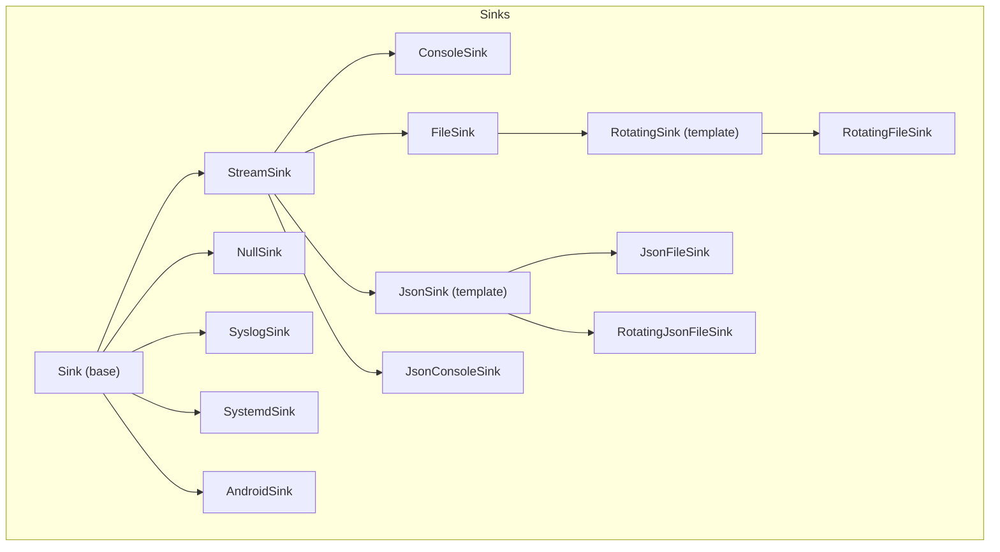
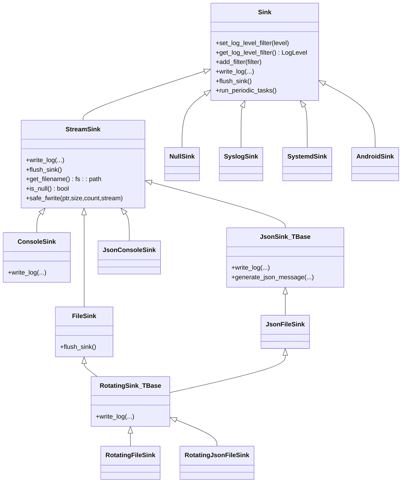
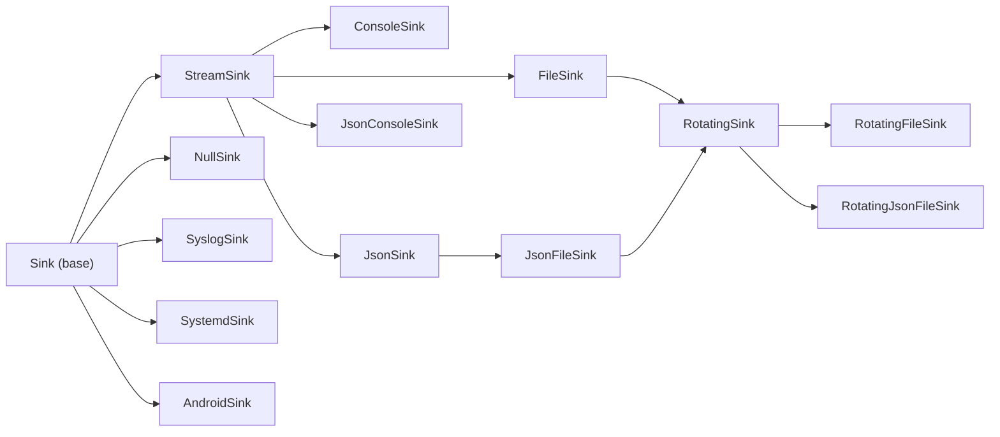

# Sink Interfaces

<cite>
**Referenced Files in This Document**
- [Sink.h](file://include/quill/sinks/Sink.h)
- [StreamSink.h](file://include/quill/sinks/StreamSink.h)
- [ConsoleSink.h](file://include/quill/sinks/ConsoleSink.h)
- [FileSink.h](file://include/quill/sinks/FileSink.h)
- [JsonSink.h](file://include/quill/sinks/JsonSink.h)
- [RotatingSink.h](file://include/quill/sinks/RotatingSink.h)
- [RotatingFileSink.h](file://include/quill/sinks/RotatingFileSink.h)
- [RotatingJsonFileSink.h](file://include/quill/sinks/RotatingJsonFileSink.h)
- [NullSink.h](file://include/quill/sinks/NullSink.h)
- [SyslogSink.h](file://include/quill/sinks/SyslogSink.h)
- [SystemdSink.h](file://include/quill/sinks/SystemdSink.h)
- [AndroidSink.h](file://include/quill/sinks/AndroidSink.h)
- [user_defined_sink.cpp](file://examples/user_defined_sink.cpp)
- [UserSinkTest.cpp](file://test/integration_tests/UserSinkTest.cpp)
</cite>

## Table of Contents
1. [Introduction](#introduction)
2. [Project Structure](#project-structure)
3. [Core Components](#core-components)
4. [Architecture Overview](#architecture-overview)
5. [Detailed Component Analysis](#detailed-component-analysis)
6. [Dependency Analysis](#dependency-analysis)
7. [Performance Considerations](#performance-considerations)
8. [Troubleshooting Guide](#troubleshooting-guide)
9. [Conclusion](#conclusion)
10. [Appendices](#appendices)

## Introduction
This document describes Quill’s sink interface system. It covers the base Sink class and all built-in sink implementations, including ConsoleSink, FileSink, JsonSink variants, RotatingFileSink and RotatingJsonFileSink, and platform-specific sinks such as SyslogSink, SystemdSink, and AndroidSink. It explains the virtual interface for writing log messages, setting log levels, managing filters, and sink lifecycle. It also documents constructor parameters, configuration options, customization capabilities, thread-safety, performance characteristics, and resource management. Finally, it shows how to register and manage sinks through the Frontend API and provides a practical example of a custom sink implementation.

## Project Structure
Quill organizes sink implementations under include/quill/sinks/. The base interface is defined in Sink.h, with concrete sinks grouped by capability:
- Stream-based sinks: StreamSink (base), ConsoleSink, FileSink
- JSON sinks: JsonSink template and specializations JsonFileSink, JsonConsoleSink
- Rotating sinks: RotatingSink template and specializations RotatingFileSink, RotatingJsonFileSink
- Platform sinks: SyslogSink, SystemdSink, AndroidSink
- Specialized sinks: NullSink

**Diagram sources**
- [Sink.h:40-218](file://include/quill/sinks/Sink.h#L40-L218)
- [StreamSink.h:67-314](file://include/quill/sinks/StreamSink.h#L67-L314)
- [ConsoleSink.h:331-412](file://include/quill/sinks/ConsoleSink.h#L331-L412)
- [FileSink.h:226-527](file://include/quill/sinks/FileSink.h#L226-L527)
- [JsonSink.h:29-165](file://include/quill/sinks/JsonSink.h#L29-L165)
- [RotatingSink.h:262-845](file://include/quill/sinks/RotatingSink.h#L262-L845)
- [RotatingFileSink.h:13-15](file://include/quill/sinks/RotatingFileSink.h#L13-L15)
- [RotatingJsonFileSink.h:14-16](file://include/quill/sinks/RotatingJsonFileSink.h#L14-L16)
- [NullSink.h:24-40](file://include/quill/sinks/NullSink.h#L24-L40)
- [SyslogSink.h:137-185](file://include/quill/sinks/SyslogSink.h#L137-L185)
- [SystemdSink.h:119-182](file://include/quill/sinks/SystemdSink.h#L119-L182)
- [AndroidSink.h:88-128](file://include/quill/sinks/AndroidSink.h#L88-L128)

**Section sources**
- [Sink.h:40-218](file://include/quill/sinks/Sink.h#L40-L218)
- [StreamSink.h:67-314](file://include/quill/sinks/StreamSink.h#L67-L314)
- [ConsoleSink.h:331-412](file://include/quill/sinks/ConsoleSink.h#L331-L412)
- [FileSink.h:226-527](file://include/quill/sinks/FileSink.h#L226-L527)
- [JsonSink.h:29-165](file://include/quill/sinks/JsonSink.h#L29-L165)
- [RotatingSink.h:262-845](file://include/quill/sinks/RotatingSink.h#L262-L845)
- [RotatingFileSink.h:13-15](file://include/quill/sinks/RotatingFileSink.h#L13-L15)
- [RotatingJsonFileSink.h:14-16](file://include/quill/sinks/RotatingJsonFileSink.h#L14-L16)
- [NullSink.h:24-40](file://include/quill/sinks/NullSink.h#L24-L40)
- [SyslogSink.h:137-185](file://include/quill/sinks/SyslogSink.h#L137-L185)
- [SystemdSink.h:119-182](file://include/quill/sinks/SystemdSink.h#L119-L182)
- [AndroidSink.h:88-128](file://include/quill/sinks/AndroidSink.h#L88-L128)

## Core Components
This section summarizes the base Sink interface and the primary virtual methods that all sinks must implement.

- Virtual methods:
  - write_log: Receives formatted metadata and message payload; sinks decide how to emit them.
  - flush_sink: Synchronizes buffered output to the underlying medium.
  - run_periodic_tasks: Optional hook executed by the backend thread for periodic work.
- Log level filtering:
  - set_log_level_filter and get_log_level_filter control per-sink severity thresholds.
- Filter pipeline:
  - add_filter registers user-defined filters; apply_all_filters enforces filters and log level.
- Pattern formatter override:
  - Optional per-sink PatternFormatterOptions to customize formatting independently of the logger.

Key behaviors:
- Thread-safety: Filtering and log level access are atomic; filter updates are guarded by a spinlock.
- Lifecycle: Sinks are owned by loggers; flush_sink is invoked by the backend worker thread; run_periodic_tasks is periodically called.

**Section sources**
- [Sink.h:65-78](file://include/quill/sinks/Sink.h#L65-L78)
- [Sink.h:85-104](file://include/quill/sinks/Sink.h#L85-L104)
- [Sink.h:123-141](file://include/quill/sinks/Sink.h#L123-L141)
- [Sink.h:156-197](file://include/quill/sinks/Sink.h#L156-L197)
- [Sink.h:202-216](file://include/quill/sinks/Sink.h#L202-L216)

## Architecture Overview
The sink architecture separates concerns between the base interface and concrete implementations. Stream-based sinks inherit from StreamSink, which encapsulates file/stream I/O and safe write operations. Specialized sinks extend these hierarchies to add features like JSON formatting or rotation.

**Diagram sources**
- [Sink.h:40-218](file://include/quill/sinks/Sink.h#L40-L218)
- [StreamSink.h:67-314](file://include/quill/sinks/StreamSink.h#L67-L314)
- [ConsoleSink.h:331-412](file://include/quill/sinks/ConsoleSink.h#L331-L412)
- [FileSink.h:226-527](file://include/quill/sinks/FileSink.h#L226-L527)
- [JsonSink.h:29-165](file://include/quill/sinks/JsonSink.h#L29-L165)
- [RotatingSink.h:262-845](file://include/quill/sinks/RotatingSink.h#L262-L845)
- [RotatingFileSink.h:13-15](file://include/quill/sinks/RotatingFileSink.h#L13-L15)
- [RotatingJsonFileSink.h:14-16](file://include/quill/sinks/RotatingJsonFileSink.h#L14-L16)
- [NullSink.h:24-40](file://include/quill/sinks/NullSink.h#L24-L40)
- [SyslogSink.h:137-185](file://include/quill/sinks/SyslogSink.h#L137-L185)
- [SystemdSink.h:119-182](file://include/quill/sinks/SystemdSink.h#L119-L182)
- [AndroidSink.h:88-128](file://include/quill/sinks/AndroidSink.h#L88-L128)

## Detailed Component Analysis

### Base Sink Interface
- Purpose: Defines the contract for all sinks, including virtual methods for emitting and flushing, log level filtering, and filter registration.
- Thread-safety: Log level is atomic; filter updates are protected by a spinlock; apply_all_filters atomically checks filters and log level.
- Lifecycle: Sinks are constructed with optional per-sink PatternFormatterOptions; they are owned by loggers and managed by the backend worker.

**Section sources**
- [Sink.h:40-218](file://include/quill/sinks/Sink.h#L40-L218)

### StreamSink
- Purpose: Provides stream abstraction for sinks that write to files or standard streams.
- Key features:
  - Accepts either a filesystem path, stdout/stderr, or /dev/null.
  - Ensures parent directories exist and canonicalizes paths.
  - Safe write operations with retries and error handling.
  - Optional FileEventNotifier callbacks for open/close/write hooks.
- Methods:
  - write_log: Writes formatted log statement to stream.
  - flush_sink: Flushes stream and resets write flag.
  - safe_fwrite: Robust write with partial-write handling and platform-specific console writes.

**Section sources**
- [StreamSink.h:67-314](file://include/quill/sinks/StreamSink.h#L67-L314)

### ConsoleSink
- Purpose: Outputs formatted log records to stdout or stderr with optional colored formatting.
- Configuration:
  - ConsoleSinkConfig supports:
    - ColourMode: Always, Automatic, Never.
    - Per-log-level colors via Colours.
    - Output stream selection ("stdout" or "stderr").
    - Override pattern formatter options.
- Behavior:
  - Applies color codes around the record when enabled.
  - Inherits from StreamSink and delegates actual writing to StreamSink::write_log.

**Section sources**
- [ConsoleSink.h:44-328](file://include/quill/sinks/ConsoleSink.h#L44-L328)
- [ConsoleSink.h:331-412](file://include/quill/sinks/ConsoleSink.h#L331-L412)

### FileSink
- Purpose: Writes log records to a file with configurable buffering, fsync behavior, and filename append options.
- Configuration:
  - FileSinkConfig supports:
    - FilenameAppendOption: None, StartDate, StartDateTime, StartCustomTimestampFormat.
    - Timezone for filename timestamps.
    - Open mode ("a" or "w").
    - Write buffer size (with minimum enforced).
    - Minimum fsync interval.
    - fsync_enabled toggle.
    - Override pattern formatter options.
- Behavior:
  - Opens file with retry logic and OS-specific flags to prevent handle inheritance.
  - Optionally sets custom write buffer via setvbuf.
  - flush_sink flushes and conditionally fsyncs; reopens if file was deleted externally.

**Section sources**
- [FileSink.h:64-220](file://include/quill/sinks/FileSink.h#L64-L220)
- [FileSink.h:226-527](file://include/quill/sinks/FileSink.h#L226-L527)

### JsonSink Template and Specializations
- Purpose: Adds JSON formatting to any stream-based sink by generating a JSON message and delegating to StreamSink::write_log.
- Template: detail::JsonSink<TBase> inherits from TBase (e.g., FileSink or StreamSink).
- Customization:
  - generate_json_message can be overridden to adjust fields or structure.
- Specializations:
  - JsonFileSink: JSON to file via FileSink.
  - JsonConsoleSink: JSON to stdout via StreamSink.

**Section sources**
- [JsonSink.h:29-165](file://include/quill/sinks/JsonSink.h#L29-L165)

### RotatingSink Template and Specializations
- Purpose: Adds rotation behavior to any base sink supporting file I/O.
- Template: RotatingSink<TBase> extends TBase (e.g., FileSink).
- Configuration:
  - RotatingFileSinkConfig extends FileSinkConfig with:
    - Rotation frequency and interval (Minutely, Hourly, Daily).
    - Daily rotation time parsing and validation.
    - Max backup files and overwrite policy.
    - Naming scheme: Index, Date, DateAndTime.
    - Force rotation on creation.
    - Remove old files on startup.
- Behavior:
  - Determines rotation by size or time.
  - Renames existing files, increments indices, and manages backup limits.
  - Handles edge cases like antivirus locks and full disks.

**Section sources**
- [RotatingSink.h:39-257](file://include/quill/sinks/RotatingSink.h#L39-L257)
- [RotatingSink.h:262-845](file://include/quill/sinks/RotatingSink.h#L262-L845)
- [RotatingFileSink.h:13-15](file://include/quill/sinks/RotatingFileSink.h#L13-L15)
- [RotatingJsonFileSink.h:14-16](file://include/quill/sinks/RotatingJsonFileSink.h#L14-L16)

### NullSink
- Purpose: Drops all log messages (no-op sink).
- Use cases: Disabling output for specific loggers or tests.

**Section sources**
- [NullSink.h:24-40](file://include/quill/sinks/NullSink.h#L24-L40)

### SyslogSink
- Purpose: Sends formatted log messages to the system logger via syslog.
- Configuration:
  - Identifier, options, facility.
  - Optional message formatting using PatternFormatter.
  - Quill-to-syslog level mapping.
- Notes:
  - Potential macro collision with syslog.h; see comments for resolution strategies.

**Section sources**
- [SyslogSink.h:54-185](file://include/quill/sinks/SyslogSink.h#L54-L185)

### SystemdSink
- Purpose: Sends formatted log messages to systemd journal.
- Configuration:
  - Identifier, optional message formatting.
  - Quill-to-systemd level mapping.
- Notes:
  - Potential macro collision with systemd headers; see comments for resolution strategies.

**Section sources**
- [SystemdSink.h:58-182](file://include/quill/sinks/SystemdSink.h#L58-L182)

### AndroidSink
- Purpose: Sends formatted log messages to Android logcat.
- Configuration:
  - Tag, optional message formatting.
  - Quill-to-Android level mapping.

**Section sources**
- [AndroidSink.h:30-128](file://include/quill/sinks/AndroidSink.h#L30-L128)

### Frontend Registration and Management
- Creating sinks:
  - Frontend::create_or_get_sink<MySink>("sink_id")
  - Frontend::get_sink("sink_id")
- Creating loggers with sinks:
  - Frontend::create_or_get_logger("name", sink_ptr)
- Behavior verified by tests:
  - Multiple loggers can share the same sink instance.
  - Backend invokes write_log, flush_sink, and run_periodic_tasks as expected.

**Section sources**
- [user_defined_sink.cpp:75-90](file://examples/user_defined_sink.cpp#L75-L90)
- [UserSinkTest.cpp:54-63](file://test/integration_tests/UserSinkTest.cpp#L54-L63)

## Dependency Analysis
The following diagram shows key dependencies among sink classes and their relationships to the base Sink.

**Diagram sources**
- [Sink.h:40-218](file://include/quill/sinks/Sink.h#L40-L218)
- [StreamSink.h:67-314](file://include/quill/sinks/StreamSink.h#L67-L314)
- [ConsoleSink.h:331-412](file://include/quill/sinks/ConsoleSink.h#L331-L412)
- [FileSink.h:226-527](file://include/quill/sinks/FileSink.h#L226-L527)
- [JsonSink.h:29-165](file://include/quill/sinks/JsonSink.h#L29-L165)
- [RotatingSink.h:262-845](file://include/quill/sinks/RotatingSink.h#L262-L845)
- [RotatingFileSink.h:13-15](file://include/quill/sinks/RotatingFileSink.h#L13-L15)
- [RotatingJsonFileSink.h:14-16](file://include/quill/sinks/RotatingJsonFileSink.h#L14-L16)
- [NullSink.h:24-40](file://include/quill/sinks/NullSink.h#L24-L40)
- [SyslogSink.h:137-185](file://include/quill/sinks/SyslogSink.h#L137-L185)
- [SystemdSink.h:119-182](file://include/quill/sinks/SystemdSink.h#L119-L182)
- [AndroidSink.h:88-128](file://include/quill/sinks/AndroidSink.h#L88-L128)

## Performance Considerations
- StreamSink::safe_fwrite handles partial writes and platform-specific console I/O to avoid corruption and extra line endings.
- FileSink supports custom write buffers to reduce system calls; set_write_buffer_size enforces a minimum size.
- FileSink::fsync_file respects minimum intervals to balance durability and disk wear.
- RotatingSink performs rotation checks before writes; rotation involves renaming files and updating indices, which can be expensive—choose appropriate naming schemes and backup limits.
- JsonSink defers formatting overhead to generate_json_message; override only when necessary.
- SyslogSink/SystemdSink/AndroidSink incur IPC/syscall costs; avoid heavy operations in run_periodic_tasks.

[No sources needed since this section provides general guidance]

## Troubleshooting Guide
Common issues and remedies:
- Partial write errors: StreamSink::safe_fwrite throws on persistent partial writes or zero-byte writes without error; check disk space and stream validity.
- File open failures: FileSink retries opening with delays; verify permissions and path existence.
- Deleted file during runtime: FileSink::flush_sink reopens the file if missing; ensure the path remains writable.
- Antivirus interference: RotatingSink retries file renames; ensure antivirus exceptions are configured.
- Macro collisions with platform sinks: See SyslogSink/SystemdSink notes for resolution strategies.
- Excessive fsync overhead: Adjust FileSinkConfig minimum_fsync_interval or disable fsync for durability-tolerant scenarios.

**Section sources**
- [StreamSink.h:214-278](file://include/quill/sinks/StreamSink.h#L214-L278)
- [FileSink.h:362-439](file://include/quill/sinks/FileSink.h#L362-L439)
- [FileSink.h:468-485](file://include/quill/sinks/FileSink.h#L468-L485)
- [RotatingSink.h:679-700](file://include/quill/sinks/RotatingSink.h#L679-L700)
- [SyslogSink.h:24-46](file://include/quill/sinks/SyslogSink.h#L24-L46)
- [SystemdSink.h:28-50](file://include/quill/sinks/SystemdSink.h#L28-L50)

## Conclusion
Quill’s sink system offers a flexible, extensible foundation for logging output. The base Sink interface provides a minimal contract for emitting and flushing logs, while concrete sinks encapsulate platform-specific or specialized behaviors. StreamSink unifies file/stream I/O, JsonSink adds structured output, and RotatingSink enables long-term log retention. Platform sinks integrate with system logging facilities. With Frontend APIs, sinks can be easily registered and reused across loggers. Proper configuration of buffering, fsync, and rotation balances performance, reliability, and maintainability.

[No sources needed since this section summarizes without analyzing specific files]

## Appendices

### API Reference: Base Sink Virtual Methods
- write_log(...): Emit a formatted log record.
- flush_sink(): Flush buffered output.
- run_periodic_tasks(): Periodic maintenance hook.

**Section sources**
- [Sink.h:123-141](file://include/quill/sinks/Sink.h#L123-L141)

### API Reference: ConsoleSink
- Constructor accepts ConsoleSinkConfig and optional FileEventNotifier.
- Configurable color mode, per-level colors, stream selection, and pattern formatter override.

**Section sources**
- [ConsoleSink.h:338-356](file://include/quill/sinks/ConsoleSink.h#L338-L356)
- [ConsoleSink.h:44-328](file://include/quill/sinks/ConsoleSink.h#L44-L328)

### API Reference: FileSink
- Constructor accepts filename, FileSinkConfig, optional notifier, do_fopen flag, and start_time.
- Configurable filename append options, timezone, open mode, write buffer size, fsync behavior, and pattern formatter override.

**Section sources**
- [FileSink.h:238-257](file://include/quill/sinks/FileSink.h#L238-L257)
- [FileSink.h:64-220](file://include/quill/sinks/FileSink.h#L64-L220)

### API Reference: JsonSink Specializations
- JsonFileSink: JSON to file.
- JsonConsoleSink: JSON to stdout.

**Section sources**
- [JsonSink.h:140-162](file://include/quill/sinks/JsonSink.h#L140-L162)

### API Reference: RotatingSink Specializations
- RotatingFileSink: File-based rotation.
- RotatingJsonFileSink: JSON file-based rotation.

**Section sources**
- [RotatingFileSink.h:13-15](file://include/quill/sinks/RotatingFileSink.h#L13-L15)
- [RotatingJsonFileSink.h:14-16](file://include/quill/sinks/RotatingJsonFileSink.h#L14-L16)

### API Reference: Platform Sinks
- SyslogSink: System logger integration with mapping and formatting options.
- SystemdSink: Journal integration with mapping and formatting options.
- AndroidSink: Android logcat integration with mapping and formatting options.

**Section sources**
- [SyslogSink.h:54-185](file://include/quill/sinks/SyslogSink.h#L54-L185)
- [SystemdSink.h:58-182](file://include/quill/sinks/SystemdSink.h#L58-L182)
- [AndroidSink.h:30-128](file://include/quill/sinks/AndroidSink.h#L30-L128)

### Custom Sink Example
- Demonstrates implementing write_log, flush_sink, and run_periodic_tasks.
- Shows registering a custom sink via Frontend::create_or_get_sink and using it with a logger.

**Section sources**
- [user_defined_sink.cpp:18-73](file://examples/user_defined_sink.cpp#L18-L73)