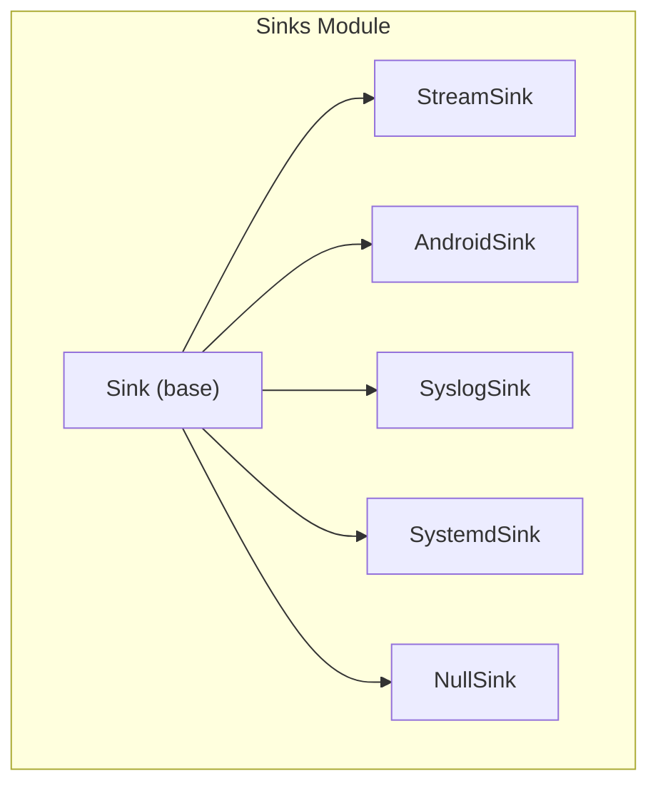
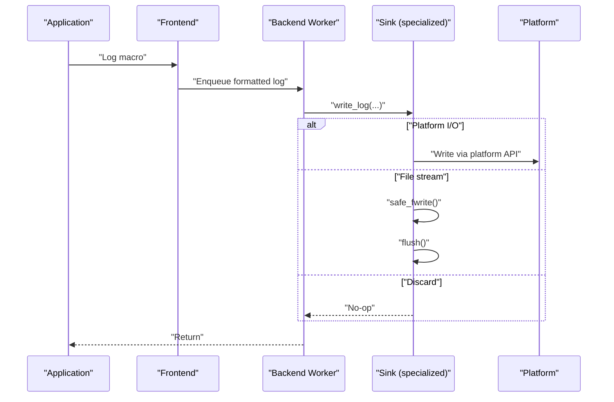
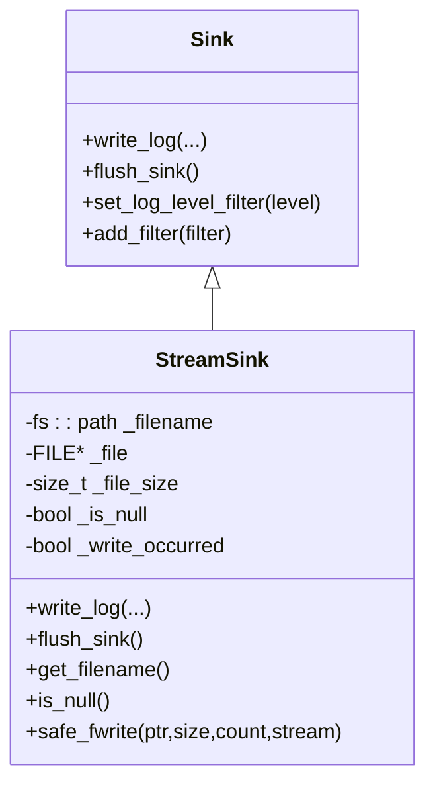
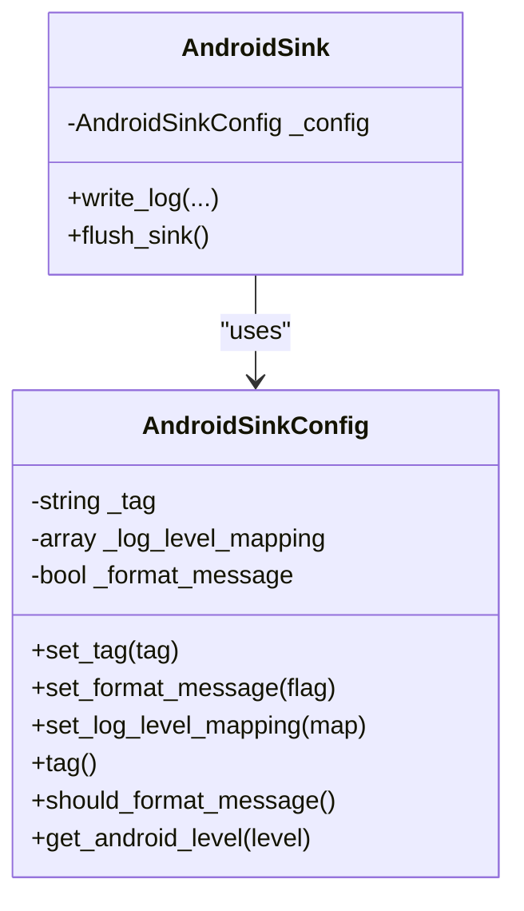
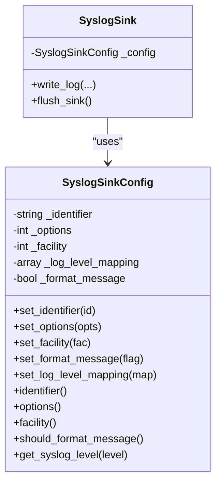
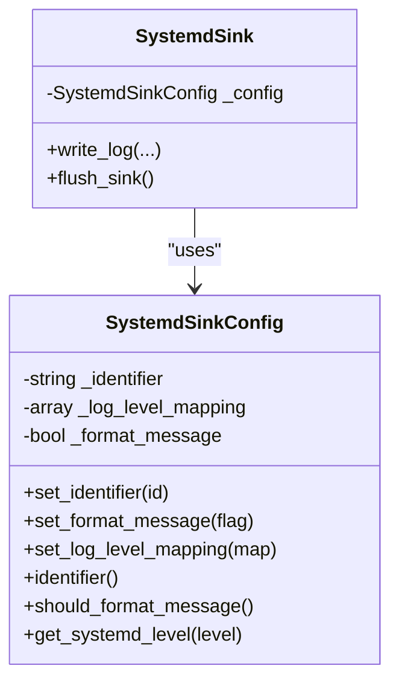
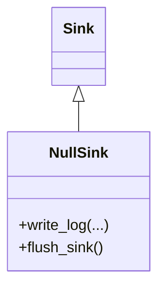
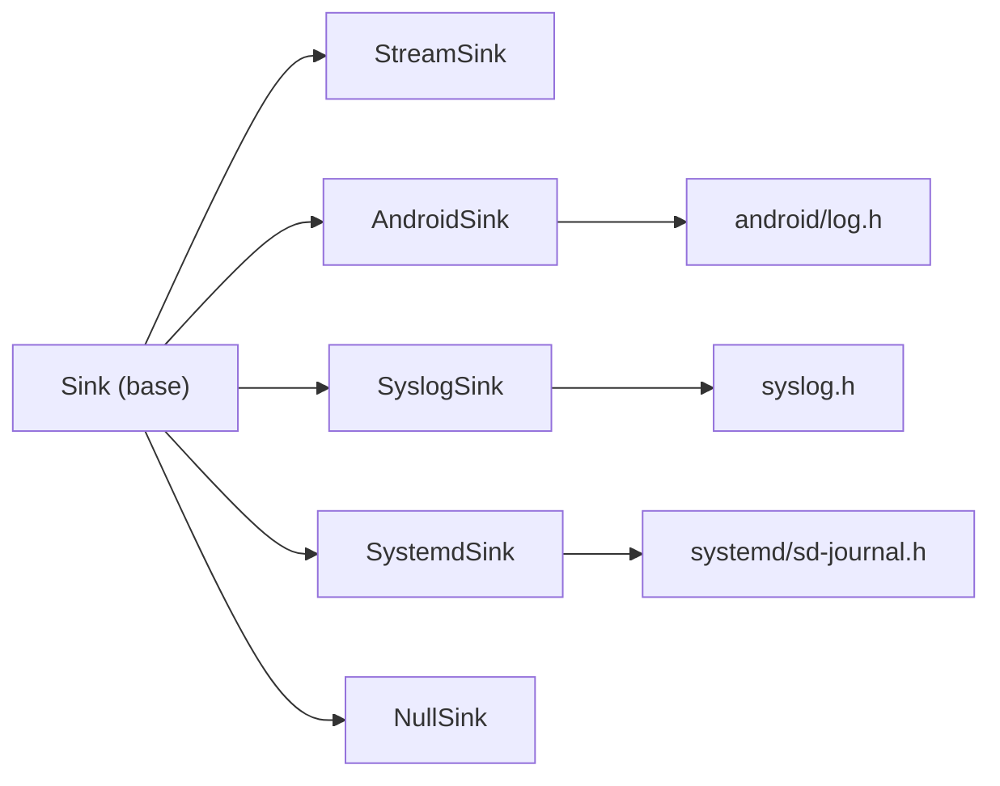

# Specialized Sinks

<cite>
**Referenced Files in This Document**
- [StreamSink.h](file://include/quill/sinks/StreamSink.h)
- [AndroidSink.h](file://include/quill/sinks/AndroidSink.h)
- [SyslogSink.h](file://include/quill/sinks/SyslogSink.h)
- [SystemdSink.h](file://include/quill/sinks/SystemdSink.h)
- [NullSink.h](file://include/quill/sinks/NullSink.h)
- [Sink.h](file://include/quill/sinks/Sink.h)
- [sink_types.rst](file://docs/sink_types.rst)
- [sink_types.rst](file://docs/sink_types.rst)
- [sink_types.rst](file://docs/sink_types.rst)
- [sink_types.rst](file://docs/sink_types.rst)
- [sink_types.rst](file://docs/sink_types.rst)
- [sink_types.rst](file://docs/sink_types.rst)
- [sink_types.rst](file://docs/sink_types.rst)
- [sink_types.rst](file://docs/sink_types.rst)
- [sink_types.rst](file://docs/sink_types.rst)
- [sink_types.rst](file://docs/sink_types.rst)
- [sink_types.rst](file://docs/sink_types.rst)
- [sink_types.rst](file://docs/sink_types.rst)
- [sink_types.rst](file://docs/sink_types.rst)
- [sink_types.rst](file://docs/sink_types.rst)
- [sink_types.rst](file://docs/sink_types.rst)
- [sink_types.rst](file://docs/sink_types.rst)
- [sink_types.rst](file://docs/sink_types.rst)
- [sink_types.rst](file://docs/sink_types.rst)
- [sink_types.rst](file://docs/sink_types.rst)
- [sink_types.rst](file://docs/sink_types.rst)
- [sink_types.rst](file://docs/sink_types.rst)
- [sink_types.rst](file://docs/sink_types.rst)
- [sink_types.rst](file://docs/sink_types.rst)
- [sink_types.rst](file://docs/sink_types.rst)
- [sink_types.rst](file://docs/sink_types.rst)
- [sink_types.rst](file://docs/sink_types.rst)
- [sink_types.rst](file://docs/sink_types.rst)
- [sink_types.rst](file://docs/sink_types.rst)
- [sink_types.rst](file://docs/sink_types.rst)
- [sink_types.rst](file://docs/sink_types.rst)
- [sink_types.rst](file://docs/sink_types.rst)
- [sink_types.rst](file://docs/sink_types.rst......)
</cite>

## Table of Contents
1. [Introduction](#introduction)
2. [Project Structure](#project-structure)
3. [Core Components](#core-components)
4. [Architecture Overview](#architecture-overview)
5. [Detailed Component Analysis](#detailed-component-analysis)
6. [Dependency Analysis](#dependency-analysis)
7. [Performance Considerations](#performance-considerations)
8. [Troubleshooting Guide](#troubleshooting-guide)
9. [Conclusion](#conclusion)
10. [Appendices](#appendices)

## Introduction
This document explains Quill’s specialized sink implementations designed for specific platforms and logging daemons:
- StreamSink: Custom stream output abstraction over FILE* streams (stdout, stderr, files).
- AndroidSink: Android platform logging via the Android NDK logging API.
- SyslogSink: System logging daemon integration via POSIX syslog.
- SystemdSink: Systemd journal integration via sd-journal.
- NullSink: Discard logs for performance testing or selective disabling.

It covers constructor parameters, configuration options, platform requirements, integration patterns, use cases, performance characteristics, thread-safety, and resource management.

## Project Structure
The specialized sinks live under the sinks module and inherit from the base Sink interface. Each sink encapsulates platform-specific APIs and configuration classes.

**Diagram sources**
- [Sink.h:40-218](file://include/quill/sinks/Sink.h#L40-L218)
- [StreamSink.h:67-314](file://include/quill/sinks/StreamSink.h#L67-L314)
- [AndroidSink.h:88-127](file://include/quill/sinks/AndroidSink.h#L88-L127)
- [SyslogSink.h:137-184](file://include/quill/sinks/SyslogSink.h#L137-L184)
- [SystemdSink.h:119-181](file://include/quill/sinks/SystemdSink.h#L119-L181)
- [NullSink.h:24-40](file://include/quill/sinks/NullSink.h#L24-L40)

**Section sources**
- [Sink.h:40-218](file://include/quill/sinks/Sink.h#L40-L218)
- [StreamSink.h:67-314](file://include/quill/sinks/StreamSink.h#L67-L314)
- [AndroidSink.h:88-127](file://include/quill/sinks/AndroidSink.h#L88-L127)
- [SyslogSink.h:137-184](file://include/quill/sinks/SyslogSink.h#L137-L184)
- [SystemdSink.h:119-181](file://include/quill/sinks/SystemdSink.h#L119-L181)
- [NullSink.h:24-40](file://include/quill/sinks/NullSink.h#L24-L40)

## Core Components
- Base Sink: Defines the virtual interface for write_log and flush_sink, plus filter and formatting hooks.
- StreamSink: FILE* abstraction supporting stdout, stderr, files, and optional file event callbacks.
- AndroidSink: Android logcat integration with configurable tag and level mapping.
- SyslogSink: POSIX syslog integration with configurable identifier, options, facility, and level mapping.
- SystemdSink: systemd journal integration with structured fields and level mapping.
- NullSink: No-op sink that discards all messages.

**Section sources**
- [Sink.h:123-133](file://include/quill/sinks/Sink.h#L123-L133)
- [StreamSink.h:67-314](file://include/quill/sinks/StreamSink.h#L67-L314)
- [AndroidSink.h:88-127](file://include/quill/sinks/AndroidSink.h#L88-L127)
- [SyslogSink.h:137-184](file://include/quill/sinks/SyslogSink.h#L137-L184)
- [SystemdSink.h:119-181](file://include/quill/sinks/SystemdSink.h#L119-L181)
- [NullSink.h:24-40](file://include/quill/sinks/NullSink.h#L24-L40)

## Architecture Overview
The backend worker thread invokes write_log on each sink. Sinks may:
- Perform immediate I/O (e.g., Android, Syslog, Systemd).
- Buffer and flush later (e.g., StreamSink).
- Ignore output (NullSink).

**Diagram sources**
- [Sink.h:123-133](file://include/quill/sinks/Sink.h#L123-L133)
- [StreamSink.h:152-193](file://include/quill/sinks/StreamSink.h#L152-L193)
- [AndroidSink.h:105-121](file://include/quill/sinks/AndroidSink.h#L105-L121)
- [SyslogSink.h:157-178](file://include/quill/sinks/SyslogSink.h#L157-L178)
- [SystemdSink.h:137-175](file://include/quill/sinks/SystemdSink.h#L137-L175)

## Detailed Component Analysis

### StreamSink
- Purpose: Generic FILE* output sink supporting stdout, stderr, and files. Can also act as a base for higher-level sinks.
- Constructor parameters:
  - stream: Path-like stream identifier. Recognized special values include stdout, stderr, and a null device path.
  - file: Optional FILE* pointer for custom streams.
  - override_pattern_formatter_options: Optional per-sink formatter overrides.
  - file_event_notifier: Optional callbacks for file lifecycle and pre-write hook.
- Behavior:
  - Resolves parent directories and canonicalizes paths for file-backed streams.
  - safe_fwrite handles partial writes and platform-specific console output on Windows.
  - flush_sink delegates to flush to synchronize buffered output.
  - is_null reports whether the sink targets a null device.
- Platform requirements:
  - Cross-platform via C stdio. Windows-specific optimizations for console handles.
- Integration patterns:
  - Use for custom stream writers or as a base for file/console sinks.
  - Combine with FileEventNotifier to intercept writes or react to file open/close.
- Performance:
  - Buffered I/O via stdio; safe_fwrite retries partial writes.
  - Minimal overhead; console writes on Windows use native APIs when attached to a console.
- Thread safety and resource management:
  - write_log and flush_sink are invoked by the backend thread.
  - safe_fwrite manages errno and throws on unrecoverable errors.
  - The sink holds a FILE* pointer; ownership remains with the caller or higher-level sink.

**Diagram sources**
- [Sink.h:40-218](file://include/quill/sinks/Sink.h#L40-L218)
- [StreamSink.h:67-314](file://include/quill/sinks/StreamSink.h#L67-L314)

**Section sources**
- [StreamSink.h:78-145](file://include/quill/sinks/StreamSink.h#L78-L145)
- [StreamSink.h:152-193](file://include/quill/sinks/StreamSink.h#L152-L193)
- [StreamSink.h:214-278](file://include/quill/sinks/StreamSink.h#L214-L278)
- [StreamSink.h:199-205](file://include/quill/sinks/StreamSink.h#L199-L205)

### AndroidSink
- Purpose: Send logs to Android logcat using the Android NDK logging API.
- Constructor parameters:
  - config: AndroidSinkConfig with tag, format_message toggle, and log level mapping.
- Behavior:
  - Selects either formatted log statement or raw message depending on config.
  - Maps Quill log levels to Android log priorities.
- Platform requirements:
  - Android NDK; requires linking against platform libraries as appropriate.
- Integration patterns:
  - Configure tag for grouping logs in logcat.
  - Enable formatting to include timestamp, logger name, and other metadata.
- Performance:
  - Direct JNI-like call to logcat; minimal overhead.
- Thread safety and resource management:
  - No persistent resources; flush_sink is a no-op.

**Diagram sources**
- [AndroidSink.h:30-80](file://include/quill/sinks/AndroidSink.h#L30-L80)
- [AndroidSink.h:88-127](file://include/quill/sinks/AndroidSink.h#L88-L127)

**Section sources**
- [AndroidSink.h:95-96](file://include/quill/sinks/AndroidSink.h#L95-L96)
- [AndroidSink.h:110-118](file://include/quill/sinks/AndroidSink.h#L110-L118)
- [AndroidSink.h:30-80](file://include/quill/sinks/AndroidSink.h#L30-L80)

### SyslogSink
- Purpose: Integrate with the system logging daemon via POSIX syslog.
- Constructor parameters:
  - config: SyslogSinkConfig with identifier, options, facility, format_message, and log level mapping.
- Behavior:
  - Initializes syslog with openlog and closes with closelog.
  - Sends messages via syslog with length clamping to int limits.
- Platform requirements:
  - POSIX-compliant systems with syslog support.
  - Macro collision notice: syslog.h defines macros conflicting with Quill’s unprefixed LOG_ macros. Solutions are documented in the sink types guide.
- Integration patterns:
  - Use identifier to tag applications.
  - Configure facility to categorize logs (e.g., user-space vs. daemon).
- Performance:
  - Direct syslog call; overhead depends on syslog daemon configuration.
- Thread safety and resource management:
  - openlog/closelog are called during construction/destruction.
  - flush_sink is a no-op.

**Diagram sources**
- [SyslogSink.h:54-129](file://include/quill/sinks/SyslogSink.h#L54-L129)
- [SyslogSink.h:137-184](file://include/quill/sinks/SyslogSink.h#L137-L184)

**Section sources**
- [SyslogSink.h:145-149](file://include/quill/sinks/SyslogSink.h#L145-L149)
- [SyslogSink.h:162-174](file://include/quill/sinks/SyslogSink.h#L162-L174)
- [SyslogSink.h:54-129](file://include/quill/sinks/SyslogSink.h#L54-L129)

### SystemdSink
- Purpose: Integrate with systemd journal for modern Linux environments.
- Constructor parameters:
  - config: SystemdSinkConfig with identifier, format_message, and log level mapping.
- Behavior:
  - Sends structured journal entries with PRIORITY, TID, SYSLOG_IDENTIFIER, CODE_FILE, CODE_LINE, CODE_FUNC.
  - Length clamped to int limits; throws on failure.
- Platform requirements:
  - systemd development headers and runtime; link against libsystemd.
  - Macro collision notice similar to SyslogSink applies.
- Integration patterns:
  - Use identifier to distinguish application logs in journalctl.
  - Enable formatting to include structured metadata.
- Performance:
  - Journal API call; overhead depends on systemd configuration.
- Thread safety and resource management:
  - flush_sink is a no-op.

**Diagram sources**
- [SystemdSink.h:58-111](file://include/quill/sinks/SystemdSink.h#L58-L111)
- [SystemdSink.h:119-181](file://include/quill/sinks/SystemdSink.h#L119-L181)

**Section sources**
- [SystemdSink.h:127-129](file://include/quill/sinks/SystemdSink.h#L127-L129)
- [SystemdSink.h:142-171](file://include/quill/sinks/SystemdSink.h#L142-L171)
- [SystemdSink.h:58-111](file://include/quill/sinks/SystemdSink.h#L58-L111)

### NullSink
- Purpose: Discard all logs; useful for performance testing or selectively disabling output.
- Constructor parameters:
  - None (default constructed).
- Behavior:
  - write_log and flush_sink are no-ops.
- Platform requirements:
  - None.
- Integration patterns:
  - Replace a real sink with NullSink to disable output without changing logging calls.
- Performance:
  - Zero-copy, zero-I/O path.
- Thread safety and resource management:
  - Stateless; no resources to manage.

**Diagram sources**
- [NullSink.h:24-40](file://include/quill/sinks/NullSink.h#L24-L40)
- [Sink.h:40-218](file://include/quill/sinks/Sink.h#L40-L218)

**Section sources**
- [NullSink.h:27-37](file://include/quill/sinks/NullSink.h#L27-L37)

## Dependency Analysis
- All specialized sinks depend on the base Sink interface for write/flush semantics and optional filters/formatter overrides.
- Platform dependencies:
  - StreamSink: stdio and platform-specific console handle handling on Windows.
  - AndroidSink: android/log.h.
  - SyslogSink: syslog.h.
  - SystemdSink: systemd/sd-journal.h.
  - NullSink: none.

**Diagram sources**
- [Sink.h:40-218](file://include/quill/sinks/Sink.h#L40-L218)
- [StreamSink.h:67-314](file://include/quill/sinks/StreamSink.h#L67-L314)
- [AndroidSink.h:88-127](file://include/quill/sinks/AndroidSink.h#L88-L127)
- [SyslogSink.h:137-184](file://include/quill/sinks/SyslogSink.h#L137-L184)
- [SystemdSink.h:119-181](file://include/quill/sinks/SystemdSink.h#L119-L181)
- [NullSink.h:24-40](file://include/quill/sinks/NullSink.h#L24-L40)

**Section sources**
- [Sink.h:40-218](file://include/quill/sinks/Sink.h#L40-L218)
- [StreamSink.h:67-314](file://include/quill/sinks/StreamSink.h#L67-L314)
- [AndroidSink.h:88-127](file://include/quill/sinks/AndroidSink.h#L88-L127)
- [SyslogSink.h:137-184](file://include/quill/sinks/SyslogSink.h#L137-L184)
- [SystemdSink.h:119-181](file://include/quill/sinks/SystemdSink.h#L119-L181)
- [NullSink.h:24-40](file://include/quill/sinks/NullSink.h#L24-L40)

## Performance Considerations
- StreamSink:
  - Buffered stdio; safe_fwrite handles partial writes and retries. Windows console writes use native APIs when available to avoid text-mode line ending conversions.
- AndroidSink:
  - Minimal overhead; direct logcat API call.
- SyslogSink:
  - Direct syslog call; performance depends on syslog daemon configuration and transport (e.g., local socket vs remote).
- SystemdSink:
  - Journal API call; structured metadata adds overhead compared to plain syslog.
- NullSink:
  - Zero-cost discard path.

[No sources needed since this section provides general guidance]

## Troubleshooting Guide
- StreamSink
  - Partial writes or zero-byte writes: safe_fwrite throws with errno details; ensure the underlying stream is valid and writable.
  - Windows console corruption: The sink uses native WriteFile for stdout/stderr when a console is attached; failures throw with GetLastError details.
  - Deleted file handling: If a file is removed externally, flush may fail; the sink guards against null FILE pointers.
- AndroidSink
  - Tag visibility: Ensure the tag is set appropriately for logcat filtering.
  - Level mapping: Verify mapping aligns with expected Android log priorities.
- SyslogSink
  - Macro collisions: syslog.h defines macros conflicting with Quill’s unprefixed LOG_ macros. Include SyslogSink in a .cpp translation unit or define QUILL_DISABLE_NON_PREFIXED_MACROS.
  - openlog/closelog: Identifier, options, and facility must be valid; misconfiguration can cause initialization failures.
- SystemdSink
  - Macro collisions: Same as SyslogSink; include in .cpp or define QUILL_DISABLE_NON_PREFIXED_MACROS.
  - Linking: Ensure libsystemd is linked and systemd headers are available.
  - sd_journal_send errors: Throws on non-zero error codes; inspect error values for diagnostics.
- NullSink
  - Expected behavior: No output is normal; confirm logs are not disappearing elsewhere.

**Section sources**
- [StreamSink.h:214-278](file://include/quill/sinks/StreamSink.h#L214-L278)
- [AndroidSink.h:105-121](file://include/quill/sinks/AndroidSink.h#L105-L121)
- [SyslogSink.h:24-46](file://include/quill/sinks/SyslogSink.h#L24-L46)
- [SyslogSink.h:145-149](file://include/quill/sinks/SyslogSink.h#L145-L149)
- [SystemdSink.h:28-50](file://include/quill/sinks/SystemdSink.h#L28-L50)
- [SystemdSink.h:168-171](file://include/quill/sinks/SystemdSink.h#L168-L171)

## Conclusion
Quill’s specialized sinks provide targeted integrations for diverse platforms and logging infrastructures. StreamSink offers flexible FILE* output, AndroidSink targets Android logcat, SyslogSink integrates with POSIX syslog, SystemdSink targets systemd journal, and NullSink discards logs for performance or testing. Each sink exposes configuration classes for fine-grained control, adheres to the base Sink contract, and manages resources appropriately for production use.

[No sources needed since this section summarizes without analyzing specific files]

## Appendices

### Configuration Options Summary
- StreamSink
  - Constructor: stream path or special identifiers, optional FILE*, optional formatter overrides, optional file event notifier.
  - Capabilities: null device detection, canonical path resolution, safe writes, flush synchronization.
- AndroidSinkConfig
  - set_tag, set_format_message, set_log_level_mapping.
  - Defaults: sensible tag and level mapping.
- SyslogSinkConfig
  - set_identifier, set_options, set_facility, set_format_message, set_log_level_mapping.
  - Defaults: empty identifier, zero options/facility, debug/info mapping.
- SystemdSinkConfig
  - set_identifier, set_format_message, set_log_level_mapping.
  - Defaults: empty identifier, debug/info mapping.

**Section sources**
- [StreamSink.h:78-145](file://include/quill/sinks/StreamSink.h#L78-L145)
- [AndroidSink.h:30-80](file://include/quill/sinks/AndroidSink.h#L30-L80)
- [SyslogSink.h:54-129](file://include/quill/sinks/SyslogSink.h#L54-L129)
- [SystemdSink.h:58-111](file://include/quill/sinks/SystemdSink.h#L58-L111)

### Integration Examples and References
- Systemd integration example and build guidance are provided in the documentation.
- Syslog integration example and macro collision guidance are provided in the documentation.

**Section sources**
- [sink_types.rst:169-192](file://docs/sink_types.rst#L169-L192)
- [sink_types.rst:97-128](file://docs/sink_types.rst#L97-L128)
- [sink_types.rst:135-139](file://docs/sink_types.rst#L135-L139)
- [sink_types.rst:141-160](file://docs/sink_types.rst#L141-L160)