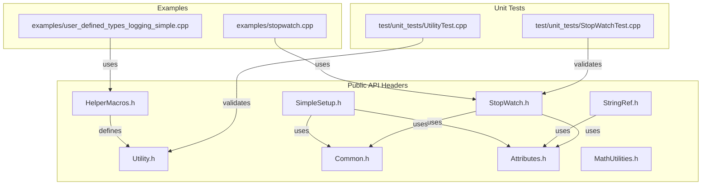
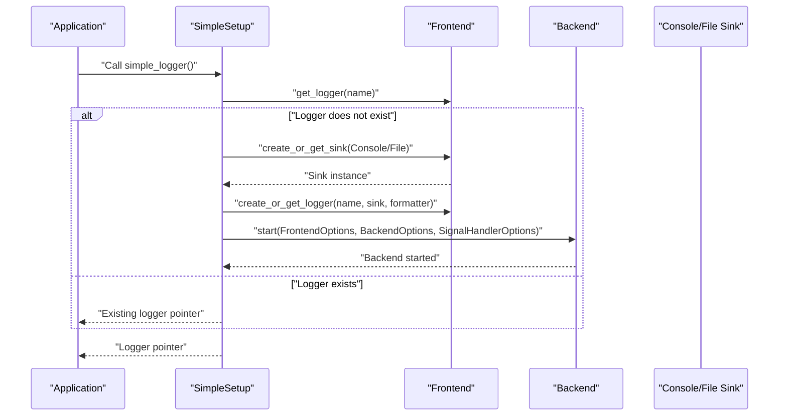
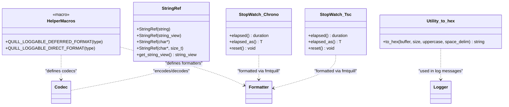
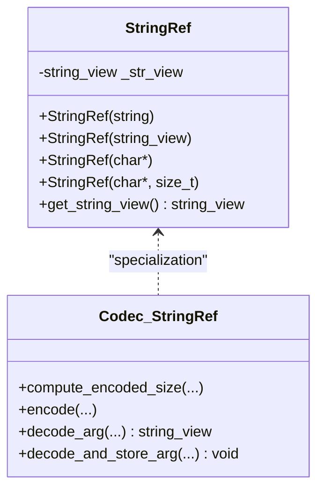
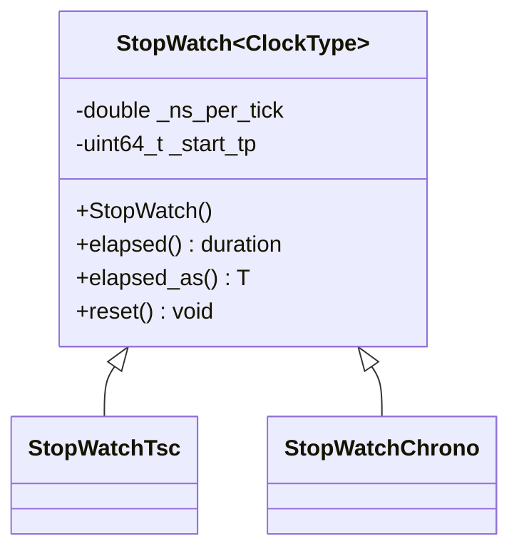
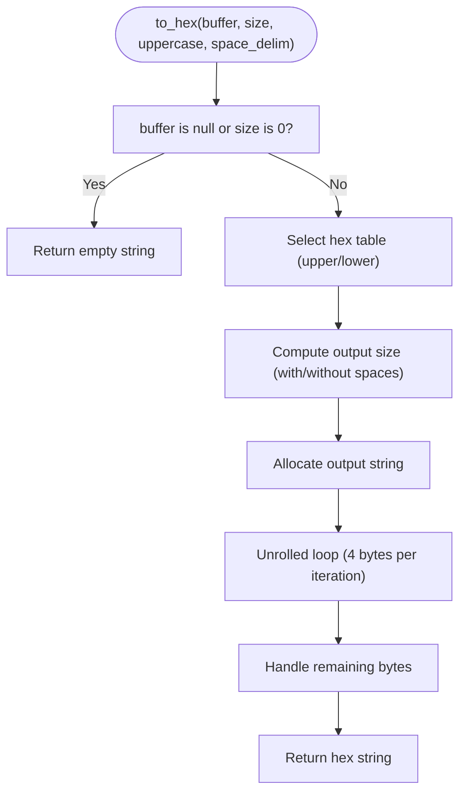
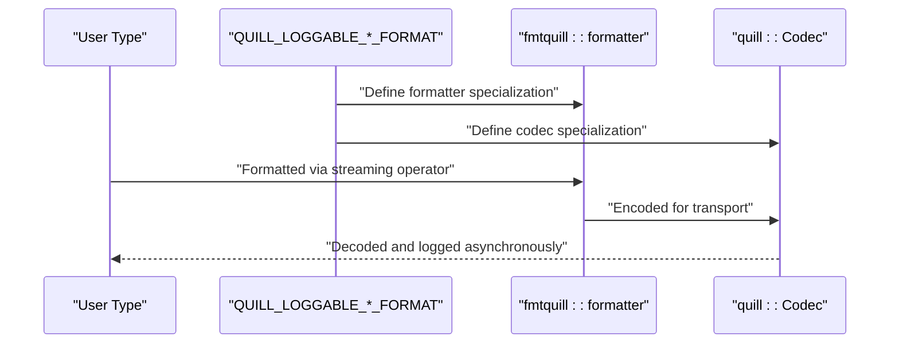
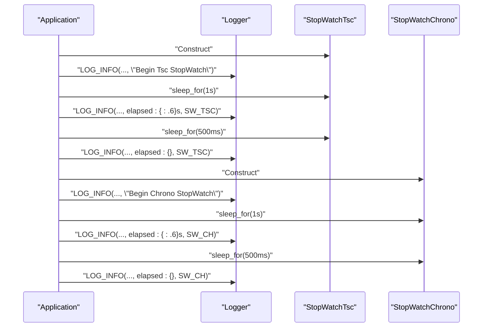
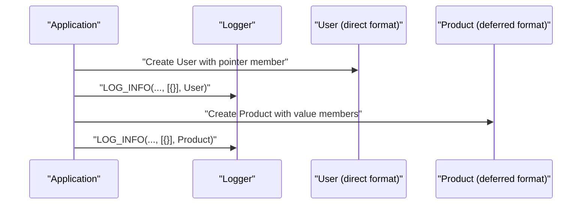
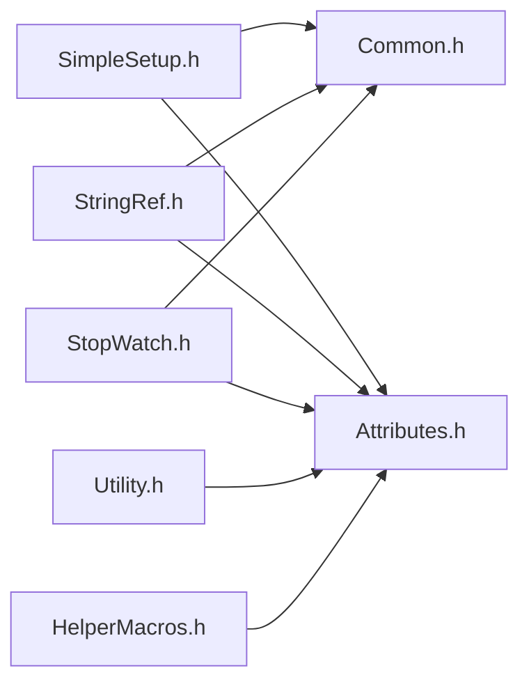

# Utility Functions & Helpers

<cite>
**Referenced Files in This Document**
- [SimpleSetup.h](file://include/quill/SimpleSetup.h)
- [Utility.h](file://include/quill/Utility.h)
- [StringRef.h](file://include/quill/StringRef.h)
- [StopWatch.h](file://include/quill/StopWatch.h)
- [HelperMacros.h](file://include/quill/HelperMacros.h)
- [Common.h](file://include/quill/core/Common.h)
- [Attributes.h](file://include/quill/core/Attributes.h)
- [MathUtilities.h](file://include/quill/core/MathUtilities.h)
- [stopwatch.cpp](file://examples/stopwatch.cpp)
- [user_defined_types_logging_simple.cpp](file://examples/user_defined_types_logging_simple.cpp)
- [StopWatchTest.cpp](file://test/unit_tests/StopWatchTest.cpp)
- [UtilityTest.cpp](file://test/unit_tests/UtilityTest.cpp)
</cite>

## Table of Contents
1. [Introduction](#introduction)
2. [Project Structure](#project-structure)
3. [Core Components](#core-components)
4. [Architecture Overview](#architecture-overview)
5. [Detailed Component Analysis](#detailed-component-analysis)
6. [Dependency Analysis](#dependency-analysis)
7. [Performance Considerations](#performance-considerations)
8. [Troubleshooting Guide](#troubleshooting-guide)
9. [Conclusion](#conclusion)

## Introduction
This document describes Quill’s utility functions and helper classes that simplify common tasks such as logging setup, string handling, timing measurements, and user-defined type formatting. It focuses on:
- Convenience setup functions for quick logging initialization
- String utilities for zero-copy string handling
- Timing helpers for performance measurement
- Helper macros for integrating user-defined types with the logging pipeline
- Type aliases, constants, and inline utilities exposed via the public API

## Project Structure
The utility-related APIs live in dedicated headers under include/quill/. The most relevant files for this guide are:
- Simple logging setup: include/quill/SimpleSetup.h
- String handling: include/quill/StringRef.h
- Timing helpers: include/quill/StopWatch.h
- Utilities: include/quill/Utility.h
- Helper macros: include/quill/HelperMacros.h
- Supporting types and constants: include/quill/core/Common.h, include/quill/core/Attributes.h, include/quill/core/MathUtilities.h
- Examples and tests: examples/stopwatch.cpp, examples/user_defined_types_logging_simple.cpp, test/unit_tests/StopWatchTest.cpp, test/unit_tests/UtilityTest.cpp

**Diagram sources**
- [SimpleSetup.h:1-74](file://include/quill/SimpleSetup.h#L1-L74)
- [Utility.h:1-130](file://include/quill/Utility.h#L1-L130)
- [StringRef.h:1-88](file://include/quill/StringRef.h#L1-L88)
- [StopWatch.h:1-144](file://include/quill/StopWatch.h#L1-L144)
- [HelperMacros.h:1-46](file://include/quill/HelperMacros.h#L1-L46)
- [Common.h:1-183](file://include/quill/core/Common.h#L1-L183)
- [Attributes.h:1-181](file://include/quill/core/Attributes.h#L1-L181)
- [MathUtilities.h:1-73](file://include/quill/core/MathUtilities.h#L1-L73)
- [stopwatch.cpp:1-52](file://examples/stopwatch.cpp#L1-L52)
- [user_defined_types_logging_simple.cpp:1-99](file://examples/user_defined_types_logging_simple.cpp#L1-L99)
- [StopWatchTest.cpp:1-58](file://test/unit_tests/StopWatchTest.cpp#L1-L58)
- [UtilityTest.cpp:1-45](file://test/unit_tests/UtilityTest.cpp#L1-L45)

**Section sources**
- [SimpleSetup.h:1-74](file://include/quill/SimpleSetup.h#L1-L74)
- [Utility.h:1-130](file://include/quill/Utility.h#L1-L130)
- [StringRef.h:1-88](file://include/quill/StringRef.h#L1-L88)
- [StopWatch.h:1-144](file://include/quill/StopWatch.h#L1-L144)
- [HelperMacros.h:1-46](file://include/quill/HelperMacros.h#L1-L46)
- [Common.h:1-183](file://include/quill/core/Common.h#L1-L183)
- [Attributes.h:1-181](file://include/quill/core/Attributes.h#L1-L181)
- [MathUtilities.h:1-73](file://include/quill/core/MathUtilities.h#L1-L73)
- [stopwatch.cpp:1-52](file://examples/stopwatch.cpp#L1-L52)
- [user_defined_types_logging_simple.cpp:1-99](file://examples/user_defined_types_logging_simple.cpp#L1-L99)
- [StopWatchTest.cpp:1-58](file://test/unit_tests/StopWatchTest.cpp#L1-L58)
- [UtilityTest.cpp:1-45](file://test/unit_tests/UtilityTest.cpp#L1-L45)

## Core Components
- Simple logging setup: Provides a single-function entry point to initialize a logger with a console or file sink and start the backend.
- StringRef: Zero-copy wrapper for string-like data to avoid unnecessary copies during logging.
- StopWatch: High-performance timer supporting TSC-based and system-clock-based elapsed time measurement.
- Utility functions: Hex encoding for arbitrary byte buffers.
- Helper macros: Quick integrations for user-defined types with deferred or direct formatting.
- Supporting types and constants: Enums, constants, and attributes used across utilities.

**Section sources**
- [SimpleSetup.h:46-72](file://include/quill/SimpleSetup.h#L46-L72)
- [StringRef.h:32-44](file://include/quill/StringRef.h#L32-L44)
- [StopWatch.h:44-124](file://include/quill/StopWatch.h#L44-L124)
- [Utility.h:31-118](file://include/quill/Utility.h#L31-L118)
- [HelperMacros.h:20-45](file://include/quill/HelperMacros.h#L20-L45)
- [Common.h:145-180](file://include/quill/core/Common.h#L145-L180)

## Architecture Overview
The utilities integrate with Quill’s frontend and backend. Convenience setup initializes the backend and logger, while StringRef and StopWatch integrate with the logging formatter and codec systems. Helper macros plug into the formatting and encoding pipeline for user-defined types.

**Diagram sources**
- [SimpleSetup.h:46-72](file://include/quill/SimpleSetup.h#L46-L72)

## Detailed Component Analysis

### Simple Logging Setup
The convenience function initializes a logger with a default pattern and starts the backend if needed. It supports console output (stdout/stderr) and file output.

Key behaviors:
- Retrieves or creates a logger named after the output identifier
- Chooses ConsoleSink for stdout/stderr or FileSink for filenames
- Starts the backend with default options
- Returns a Logger pointer for immediate use

Usage patterns:
- Console logging: pass “stdout” or “stderr”
- File logging: pass a filename string
- Subsequent calls reuse the existing logger

Best practices:
- Call once per process or per desired logger identity
- Ensure the backend is started before logging
- Combine with Frontend::get_logger() for advanced scenarios

**Section sources**
- [SimpleSetup.h:22-72](file://include/quill/SimpleSetup.h#L22-L72)

### StringRef: Efficient String Handling
StringRef wraps string-like data to avoid copying when passing to the logging pipeline. It encodes a pointer and length pair for asynchronous parsing.

Highlights:
- Constructors accept std::string, std::string_view, C string, and C string with size
- Encodes pointer and size for zero-copy transport
- Decoding yields a string_view for safe consumption by the backend

Usage patterns:
- Wrap string arguments with StringRef when you need zero-copy semantics
- Ensure the underlying string remains alive until the log is flushed
- Mix with regular strings in the same log message

Performance notes:
- Avoids heap allocations for string transport
- Backend decodes asynchronously; lifetime safety is essential

**Section sources**
- [StringRef.h:20-44](file://include/quill/StringRef.h#L20-L44)
- [StringRef.h:48-85](file://include/quill/StringRef.h#L48-L85)

### StopWatch: Performance Measurement
StopWatch measures elapsed time since construction, supporting both TSC-based and system-clock-based modes. It integrates with the formatting system to print elapsed seconds.

Key capabilities:
- Constructors initialize the start time using either TSC or steady_clock
- Methods:
  - elapsed(): returns elapsed as seconds (double)
  - elapsed_as<T>(): returns elapsed cast to a specified duration type
  - reset(): restarts the timer
- Type aliases:
  - StopWatchTsc: TSC-based timing
  - StopWatchChrono: system-clock-based timing

Formatting integration:
- Specialized codec and formatter enable printing StopWatch instances directly in log messages

Usage patterns:
- Measure durations around critical sections
- Print elapsed in seconds or convert to nanoseconds/milliseconds as needed
- Reset to measure intervals independently

**Section sources**
- [StopWatch.h:24-124](file://include/quill/StopWatch.h#L24-L124)
- [StopWatch.h:128-143](file://include/quill/StopWatch.h#L128-L143)
- [stopwatch.cpp:24-50](file://examples/stopwatch.cpp#L24-L50)
- [StopWatchTest.cpp:8-56](file://test/unit_tests/StopWatchTest.cpp#L8-L56)

### Utility Functions: Hex Encoding
The to_hex utility converts a byte buffer into a hexadecimal string with configurable case and spacing.

Parameters:
- buffer: pointer to input data (byte-sized element type)
- size: number of bytes to encode
- uppercase: whether to use uppercase hex digits
- space_delim: whether to insert spaces between bytes

Behavior:
- Validates null pointer and zero size
- Uses lookup tables for fast conversion
- Supports unrolled loops for performance
- Returns empty string for invalid inputs

Usage patterns:
- Debug logs and diagnostics
- Binary data inspection
- Network protocol or file format analysis

**Section sources**
- [Utility.h:18-118](file://include/quill/Utility.h#L18-L118)
- [UtilityTest.cpp:10-43](file://test/unit_tests/UtilityTest.cpp#L10-L43)

### Helper Macros: User-Defined Types
Two macros simplify adding support for user-defined types:
- QUILL_LOGGABLE_DEFERRED_FORMAT(type): Defines a formatter and a deferred codec for asynchronous formatting
- QUILL_LOGGABLE_DIRECT_FORMAT(type): Defines a formatter and a direct codec for immediate formatting

Guidelines:
- Use deferred formatting for safe, copyable types
- Use direct formatting for types with pointer/reference members that cannot be safely copied or formatted asynchronously
- These macros inject specializations into the formatting and codec systems

Integration example:
- See user-defined types example for usage with QUILL_LOGGABLE_DEFERRED_FORMAT and QUILL_LOGGABLE_DIRECT_FORMAT

**Section sources**
- [HelperMacros.h:15-45](file://include/quill/HelperMacros.h#L15-L45)
- [user_defined_types_logging_simple.cpp:27-96](file://examples/user_defined_types_logging_simple.cpp#L27-L96)

### Supporting Types and Constants
- Enums and constants:
  - QueueType: selects queue policy
  - Timezone: local or GMT
  - ClockSourceType: Tsc, System, User
  - HugePagesPolicy: Never, Always, Try
- Attributes and macros:
  - QUILL_AS_STR, QUILL_STRINGIFY
  - QUILL_THREAD_LOCAL
  - QUILL_FUNCTION_NAME variants
  - QUILL_ASSERT and QUILL_ASSERT_WITH_FMT
  - Cache-line constants and path separator constants
- Math utilities:
  - Power-of-two checks and rounding helpers

These provide foundational infrastructure for performance, portability, and correctness across utilities.

**Section sources**
- [Common.h:21-180](file://include/quill/core/Common.h#L21-L180)
- [Attributes.h:70-181](file://include/quill/core/Attributes.h#L70-L181)
- [MathUtilities.h:17-70](file://include/quill/core/MathUtilities.h#L17-L70)

## Architecture Overview
The following diagram shows how utilities integrate with the logging pipeline and core components.

**Diagram sources**
- [StringRef.h:32-85](file://include/quill/StringRef.h#L32-L85)
- [StopWatch.h:44-143](file://include/quill/StopWatch.h#L44-L143)
- [Utility.h:31-118](file://include/quill/Utility.h#L31-L118)
- [HelperMacros.h:20-45](file://include/quill/HelperMacros.h#L20-L45)

## Detailed Component Analysis

### StringRef Class
StringRef ensures zero-copy string transport by storing a pointer and size. The codec encodes the pointer and length, and decoding produces a string_view for safe consumption.

**Diagram sources**
- [StringRef.h:32-85](file://include/quill/StringRef.h#L32-L85)

**Section sources**
- [StringRef.h:20-85](file://include/quill/StringRef.h#L20-L85)

### StopWatch Class Template
StopWatch supports two clock sources and exposes uniform APIs for elapsed time retrieval and resetting.

**Diagram sources**
- [StopWatch.h:44-124](file://include/quill/StopWatch.h#L44-L124)

**Section sources**
- [StopWatch.h:24-124](file://include/quill/StopWatch.h#L24-L124)

### Utility Function: to_hex
Hex encoding utility performs fast conversion using lookup tables and loop unrolling.

**Diagram sources**
- [Utility.h:31-118](file://include/quill/Utility.h#L31-L118)

**Section sources**
- [Utility.h:18-118](file://include/quill/Utility.h#L18-L118)

### Helper Macros: QUILL_LOGGABLE_DEFERRED_FORMAT and QUILL_LOGGABLE_DIRECT_FORMAT
These macros define formatters and codecs for user-defined types, enabling seamless integration with the logging pipeline.

**Diagram sources**
- [HelperMacros.h:20-45](file://include/quill/HelperMacros.h#L20-L45)

**Section sources**
- [HelperMacros.h:15-45](file://include/quill/HelperMacros.h#L15-L45)

### Example Workflows

#### StopWatch in Logging
This example demonstrates measuring elapsed time and logging it with both TSC and system-clock modes.

**Diagram sources**
- [stopwatch.cpp:24-50](file://examples/stopwatch.cpp#L24-L50)

**Section sources**
- [stopwatch.cpp:14-51](file://examples/stopwatch.cpp#L14-L51)

#### User-Defined Types with Helper Macros
This example shows how to annotate types for deferred or direct formatting.

**Diagram sources**
- [user_defined_types_logging_simple.cpp:27-96](file://examples/user_defined_types_logging_simple.cpp#L27-L96)

**Section sources**
- [user_defined_types_logging_simple.cpp:68-99](file://examples/user_defined_types_logging_simple.cpp#L68-L99)

## Dependency Analysis
Utilities depend on core types and attributes for portability and performance. StopWatch depends on clock sources and formatting libraries. StringRef depends on codec mechanisms. Helper macros depend on formatter and codec specializations.

**Diagram sources**
- [SimpleSetup.h:9-18](file://include/quill/SimpleSetup.h#L9-L18)
- [StringRef.h:9-17](file://include/quill/StringRef.h#L9-L17)
- [StopWatch.h:9-21](file://include/quill/StopWatch.h#L9-L21)
- [Utility.h:9-16](file://include/quill/Utility.h#L9-L16)
- [HelperMacros.h:9-13](file://include/quill/HelperMacros.h#L9-L13)
- [Common.h:9-18](file://include/quill/core/Common.h#L9-L18)
- [Attributes.h:9-18](file://include/quill/core/Attributes.h#L9-L18)

**Section sources**
- [SimpleSetup.h:9-18](file://include/quill/SimpleSetup.h#L9-L18)
- [StringRef.h:9-17](file://include/quill/StringRef.h#L9-L17)
- [StopWatch.h:9-21](file://include/quill/StopWatch.h#L9-L21)
- [Utility.h:9-16](file://include/quill/Utility.h#L9-L16)
- [HelperMacros.h:9-13](file://include/quill/HelperMacros.h#L9-L13)
- [Common.h:9-18](file://include/quill/core/Common.h#L9-L18)
- [Attributes.h:9-18](file://include/quill/core/Attributes.h#L9-L18)

## Performance Considerations
- StringRef avoids heap allocations by transporting pointer and size; ensure the underlying string remains valid until the log is flushed.
- StopWatchTsc uses TSC for high resolution; StopWatchChrono uses steady_clock for monotonic time. Choose based on precision needs and platform characteristics.
- to_hex uses lookup tables and loop unrolling for fast conversion; disable space delimiters for compact output when appropriate.
- Helper macros reduce boilerplate for user-defined types; prefer deferred formatting for safe types and direct formatting for types with pointer/reference members.
- Use QUILL_ASSERT and QUILL_ASSERT_WITH_FMT judiciously in debug builds to catch issues early without impacting release performance.

[No sources needed since this section provides general guidance]

## Troubleshooting Guide
- StringRef lifetime issues: If logs appear truncated or corrupted, verify that the underlying string is still valid until flush completes.
- StopWatch accuracy: On some platforms, TSC may vary across cores; use StopWatchChrono for consistent wall-clock timing.
- to_hex output mismatch: Confirm buffer pointer and size are correct; ensure uppercase and space_delim flags match expectations.
- Helper macros not applied: Ensure macros are placed at namespace scope and that the type’s stream operator is defined before the macro invocation.
- Assertion failures: Review QUILL_ASSERT and QUILL_ASSERT_WITH_FMT messages to diagnose preconditions violated during development.

**Section sources**
- [Common.h:83-117](file://include/quill/core/Common.h#L83-L117)
- [UtilityTest.cpp:10-43](file://test/unit_tests/UtilityTest.cpp#L10-L43)
- [StopWatchTest.cpp:8-56](file://test/unit_tests/StopWatchTest.cpp#L8-L56)

## Conclusion
Quill’s utilities streamline logging setup, enhance string handling, and provide robust timing and formatting capabilities. By leveraging StringRef for zero-copy strings, StopWatch for precise measurements, and helper macros for user-defined types, applications can achieve both simplicity and performance. Follow the usage patterns and best practices outlined here to integrate these utilities effectively into your projects.

[No sources needed since this section summarizes without analyzing specific files]