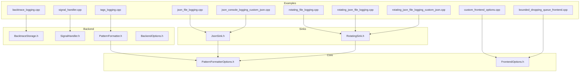
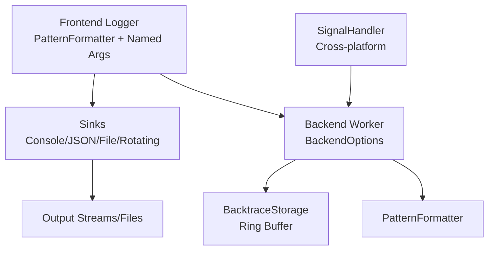
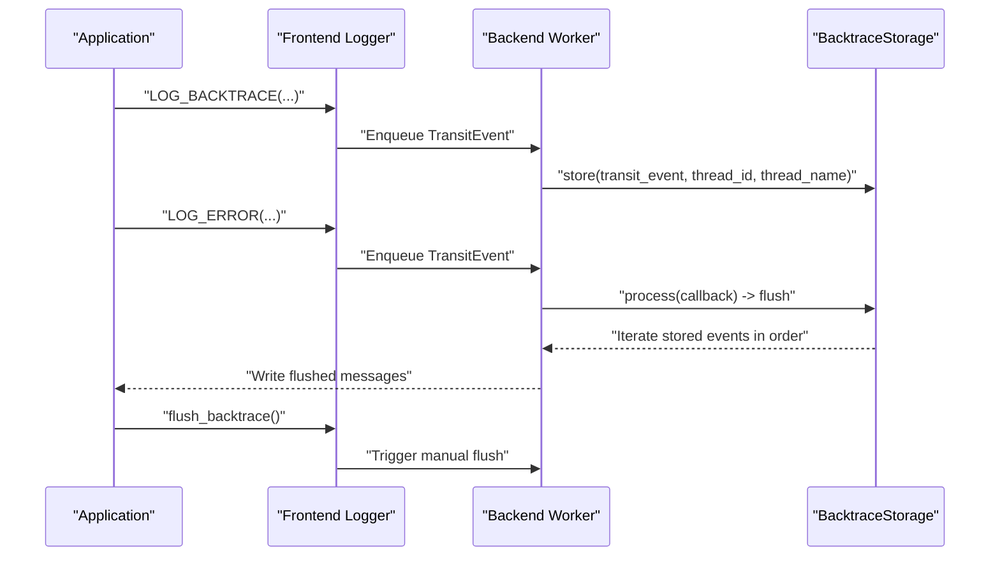
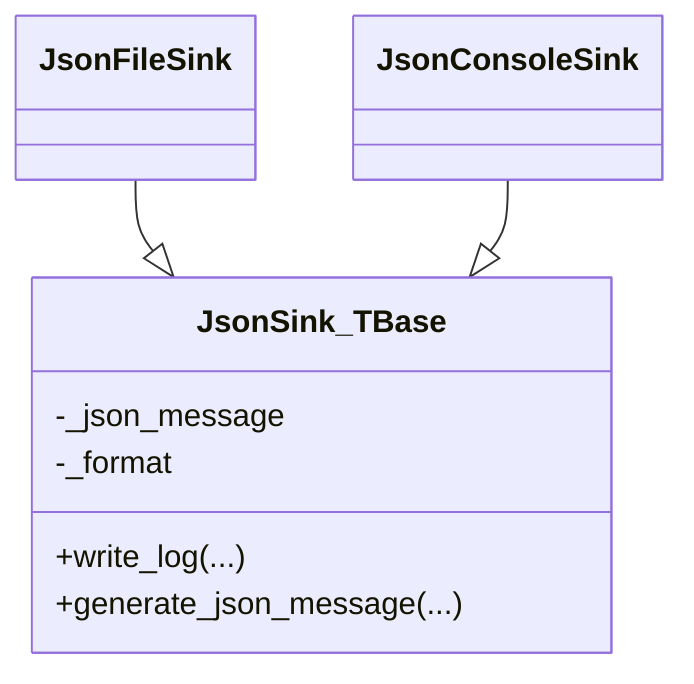
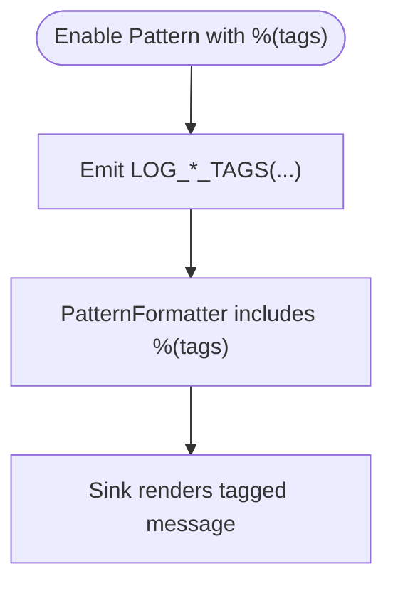
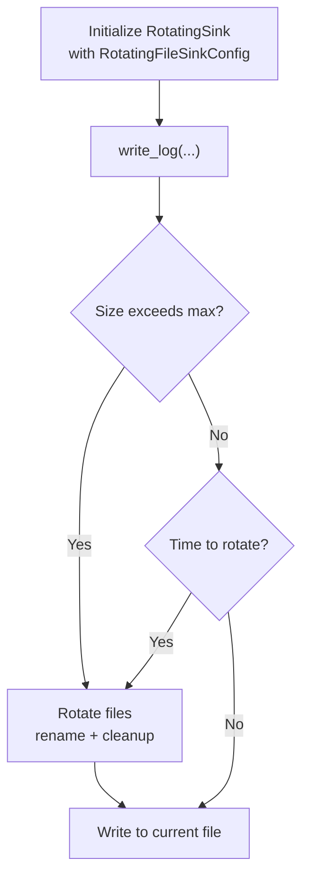
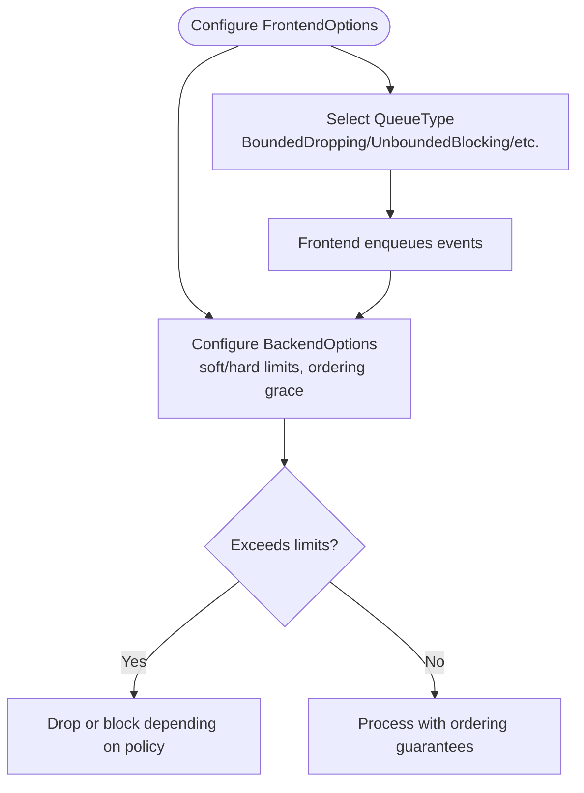
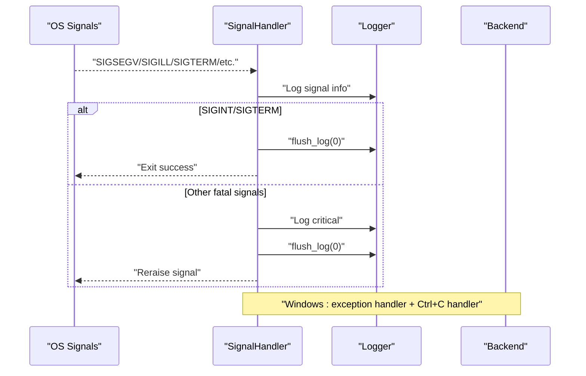
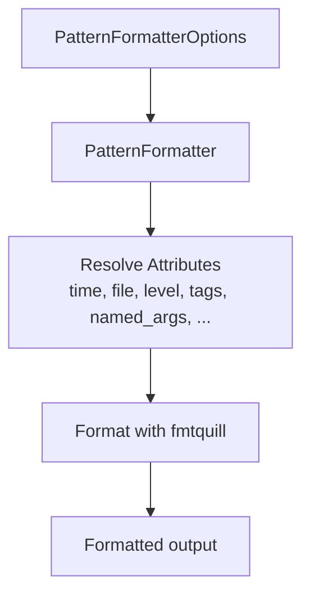
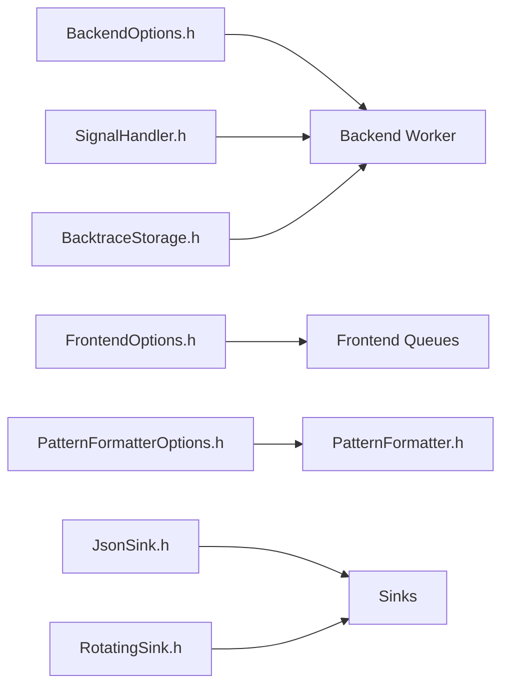

# Advanced Features

<cite>
**Referenced Files in This Document**
- [BacktraceStorage.h](file://include/quill/backend/BacktraceStorage.h)
- [backtrace_logging.cpp](file://examples/backtrace_logging.cpp)
- [JsonSink.h](file://include/quill/sinks/JsonSink.h)
- [json_file_logging.cpp](file://examples/json_file_logging.cpp)
- [json_console_logging_custom_json.cpp](file://examples/json_console_logging_custom_json.cpp)
- [rotating_file_logging.cpp](file://examples/rotating_file_logging.cpp)
- [RotatingSink.h](file://include/quill/sinks/RotatingSink.h)
- [rotating_json_file_logging.cpp](file://examples/rotating_json_file_logging.cpp)
- [rotating_json_file_logging_custom_json.cpp](file://examples/rotating_json_file_logging_custom_json.cpp)
- [tags_logging.cpp](file://examples/tags_logging.cpp)
- [signal_handler.cpp](file://examples/signal_handler.cpp)
- [SignalHandler.h](file://include/quill/backend/SignalHandler.h)
- [PatternFormatter.h](file://include/quill/backend/PatternFormatter.h)
- [PatternFormatterOptions.h](file://include/quill/core/PatternFormatterOptions.h)
- [BackendOptions.h](file://include/quill/backend/BackendOptions.h)
- [FrontendOptions.h](file://include/quill/core/FrontendOptions.h)
- [custom_frontend_options.cpp](file://examples/custom_frontend_options.cpp)
- [bounded_dropping_queue_frontend.cpp](file://examples/bounded_dropping_queue_frontend.cpp)
</cite>

## Table of Contents
1. [Introduction](#introduction)
2. [Project Structure](#project-structure)
3. [Core Components](#core-components)
4. [Architecture Overview](#architecture-overview)
5. [Detailed Component Analysis](#detailed-component-analysis)
6. [Dependency Analysis](#dependency-analysis)
7. [Performance Considerations](#performance-considerations)
8. [Troubleshooting Guide](#troubleshooting-guide)
9. [Conclusion](#conclusion)
10. [Appendices](#appendices)

## Introduction
This document explains Quill’s advanced logging features with practical, code-mapped guidance. It covers:
- Backtrace logging with ring-buffer storage and on-demand display
- Structured JSON logging with custom JSON generation and metadata handling
- Tag-based logging for categorization and filtering
- Rotating file logging with size/time-based rotation and configuration
- Rate limiting and conditional logging patterns
- Signal handler integration for crash-safe logging and graceful shutdown
- Advanced formatting and pattern customization
- Performance optimization and memory management strategies
- Real-world examples and integration patterns

## Project Structure
Quill organizes advanced features across backend, core, sinks, and examples:
- Backend: backtrace storage, signal handling, formatting, and backend options
- Sinks: JSON sinks, rotating sinks, and console/file sinks
- Core: formatting options and frontend options
- Examples: runnable demonstrations for each feature

**Diagram sources**
- [backtrace_logging.cpp:14-54](file://examples/backtrace_logging.cpp#L14-L54)
- [json_file_logging.cpp:19-73](file://examples/json_file_logging.cpp#L19-L73)
- [json_console_logging_custom_json.cpp:42-67](file://examples/json_console_logging_custom_json.cpp#L42-L67)
- [rotating_file_logging.cpp:14-44](file://examples/rotating_file_logging.cpp#L14-L44)
- [rotating_json_file_logging.cpp:14-44](file://examples/rotating_json_file_logging.cpp#L14-L44)
- [rotating_json_file_logging_custom_json.cpp:66-96](file://examples/rotating_json_file_logging_custom_json.cpp#L66-L96)
- [tags_logging.cpp:17-42](file://examples/tags_logging.cpp#L17-L42)
- [signal_handler.cpp:43-89](file://examples/signal_handler.cpp#L43-L89)
- [BacktraceStorage.h:28-124](file://include/quill/backend/BacktraceStorage.h#L28-L124)
- [SignalHandler.h:50-88](file://include/quill/backend/SignalHandler.h#L50-L88)
- [PatternFormatter.h:33-608](file://include/quill/backend/PatternFormatter.h#L33-L608)
- [PatternFormatterOptions.h:23-170](file://include/quill/core/PatternFormatterOptions.h#L23-L170)
- [BackendOptions.h:30-283](file://include/quill/backend/BackendOptions.h#L30-L283)
- [FrontendOptions.h:16-52](file://include/quill/core/FrontendOptions.h#L16-L52)
- [JsonSink.h:29-165](file://include/quill/sinks/JsonSink.h#L29-L165)
- [RotatingSink.h:39-845](file://include/quill/sinks/RotatingSink.h#L39-L845)

**Section sources**
- [BacktraceStorage.h:28-124](file://include/quill/backend/BacktraceStorage.h#L28-L124)
- [JsonSink.h:29-165](file://include/quill/sinks/JsonSink.h#L29-L165)
- [RotatingSink.h:39-845](file://include/quill/sinks/RotatingSink.h#L39-L845)
- [PatternFormatter.h:33-608](file://include/quill/backend/PatternFormatter.h#L33-L608)
- [PatternFormatterOptions.h:23-170](file://include/quill/core/PatternFormatterOptions.h#L23-L170)
- [BackendOptions.h:30-283](file://include/quill/backend/BackendOptions.h#L30-L283)
- [FrontendOptions.h:16-52](file://include/quill/core/FrontendOptions.h#L16-L52)

## Core Components
- Backtrace storage: ring-buffer per logger with capacity control and ordered retrieval
- JSON sinks: default and rotating JSON sinks with customizable JSON generation
- Rotating sink: size/time-based rotation with naming schemes and backup policies
- Pattern formatter: configurable format patterns, attributes, and multi-line metadata
- Signal handler: cross-platform crash-safe logging and graceful shutdown
- Backend and frontend options: tuning backend polling, buffers, and queue behavior

**Section sources**
- [BacktraceStorage.h:28-124](file://include/quill/backend/BacktraceStorage.h#L28-L124)
- [JsonSink.h:29-165](file://include/quill/sinks/JsonSink.h#L29-L165)
- [RotatingSink.h:262-845](file://include/quill/sinks/RotatingSink.h#L262-L845)
- [PatternFormatter.h:33-608](file://include/quill/backend/PatternFormatter.h#L33-L608)
- [PatternFormatterOptions.h:23-170](file://include/quill/core/PatternFormatterOptions.h#L23-L170)
- [SignalHandler.h:50-488](file://include/quill/backend/SignalHandler.h#L50-L488)
- [BackendOptions.h:30-283](file://include/quill/backend/BackendOptions.h#L30-L283)
- [FrontendOptions.h:16-52](file://include/quill/core/FrontendOptions.h#L16-L52)

## Architecture Overview
The advanced features integrate through the frontend logger, sinks, and backend worker. Formatting and metadata are prepared in the frontend and consumed by sinks and backends.

**Diagram sources**
- [PatternFormatter.h:97-177](file://include/quill/backend/PatternFormatter.h#L97-L177)
- [JsonSink.h:58-93](file://include/quill/sinks/JsonSink.h#L58-L93)
- [RotatingSink.h:335-369](file://include/quill/sinks/RotatingSink.h#L335-L369)
- [BacktraceStorage.h:34-87](file://include/quill/backend/BacktraceStorage.h#L34-L87)
- [SignalHandler.h:154-248](file://include/quill/backend/SignalHandler.h#L154-L248)
- [BackendOptions.h:30-283](file://include/quill/backend/BackendOptions.h#L30-L283)

## Detailed Component Analysis

### Backtrace Logging
Backtrace logging stores recent messages in a ring buffer and flushes them upon a condition (e.g., reaching a threshold or on demand). The example demonstrates enabling backtrace with a capacity and flushing on error or manually.

**Diagram sources**
- [backtrace_logging.cpp:25-53](file://examples/backtrace_logging.cpp#L25-L53)
- [BacktraceStorage.h:34-87](file://include/quill/backend/BacktraceStorage.h#L34-L87)

Key behaviors:
- Capacity-limited ring buffer per logger
- Ordered retrieval and clearing after flush
- Conditional flush on severity thresholds or manual flush

Practical usage:
- Initialize backtrace with a capacity and log level threshold
- Emit backtrace messages alongside normal logs
- Trigger flush on error or on demand

**Section sources**
- [BacktraceStorage.h:28-124](file://include/quill/backend/BacktraceStorage.h#L28-L124)
- [backtrace_logging.cpp:14-54](file://examples/backtrace_logging.cpp#L14-L54)

### Structured JSON Logging
Quill supports JSON logging via dedicated sinks. The default JSON sinks generate a standard structure; custom sinks override JSON generation for tailored schemas.

**Diagram sources**
- [JsonSink.h:29-165](file://include/quill/sinks/JsonSink.h#L29-L165)

Custom JSON generation:
- Override generate_json_message to emit custom fields and metadata
- Preserve named arguments as key-value pairs
- Example shows custom console and rotating JSON sinks

Integration patterns:
- Use empty pattern formatter for pure JSON sinks to avoid redundant formatting
- Combine JSON sink with console sink for hybrid outputs

**Section sources**
- [JsonSink.h:29-165](file://include/quill/sinks/JsonSink.h#L29-L165)
- [json_file_logging.cpp:19-73](file://examples/json_file_logging.cpp#L19-L73)
- [json_console_logging_custom_json.cpp:42-67](file://examples/json_console_logging_custom_json.cpp#L42-L67)

### Tag-Based Logging
Tags categorize and filter logs. The pattern formatter exposes a %(tags) attribute, and the example shows how to include tags in the format and emit tagged messages.

**Diagram sources**
- [PatternFormatter.h:570-580](file://include/quill/backend/PatternFormatter.h#L570-L580)
- [tags_logging.cpp:29-42](file://examples/tags_logging.cpp#L29-L42)

Best practices:
- Place %(tags) immediately before the next attribute without spaces to avoid gaps
- Use consistent tag naming for filtering

**Section sources**
- [PatternFormatter.h:48-67](file://include/quill/backend/PatternFormatter.h#L48-L67)
- [PatternFormatter.h:570-580](file://include/quill/backend/PatternFormatter.h#L570-L580)
- [tags_logging.cpp:17-42](file://examples/tags_logging.cpp#L17-L42)

### Rotating File Logging
Rotating sinks support size-based and time-based rotation with configurable naming and backup retention.

**Diagram sources**
- [RotatingSink.h:335-369](file://include/quill/sinks/RotatingSink.h#L335-L369)
- [RotatingSink.h:396-487](file://include/quill/sinks/RotatingSink.h#L396-L487)

Configuration highlights:
- Max file size, daily/hourly/minute rotation, naming schemes (index/date/datetime)
- Backup retention and overwrite policy
- Startup rotation and cleanup options

**Section sources**
- [RotatingSink.h:39-257](file://include/quill/sinks/RotatingSink.h#L39-L257)
- [RotatingSink.h:262-845](file://include/quill/sinks/RotatingSink.h#L262-L845)
- [rotating_file_logging.cpp:14-44](file://examples/rotating_file_logging.cpp#L14-L44)
- [rotating_json_file_logging.cpp:14-44](file://examples/rotating_json_file_logging.cpp#L14-L44)
- [rotating_json_file_logging_custom_json.cpp:66-96](file://examples/rotating_json_file_logging_custom_json.cpp#L66-L96)

### Rate Limiting and Conditional Logging
Quill provides macros for backtrace and conditional logging. While explicit “rate limiter” macros are not present in the analyzed files, conditional and backpressure mechanisms are available:
- Backtrace logging with capacity and threshold-based flush
- Bounded vs unbounded queues with dropping/blocking policies
- Backend soft/hard limits and timestamp ordering grace period

**Diagram sources**
- [FrontendOptions.h:16-52](file://include/quill/core/FrontendOptions.h#L16-L52)
- [BackendOptions.h:58-132](file://include/quill/backend/BackendOptions.h#L58-L132)
- [bounded_dropping_queue_frontend.cpp:21-32](file://examples/bounded_dropping_queue_frontend.cpp#L21-L32)
- [custom_frontend_options.cpp:14-21](file://examples/custom_frontend_options.cpp#L14-L21)

Recommendations:
- Use BoundedDropping for controlled memory usage under load
- Tune BackendOptions transit event limits and grace period for ordering
- Combine backtrace with conditional flush to capture recent context on errors

**Section sources**
- [FrontendOptions.h:16-52](file://include/quill/core/FrontendOptions.h#L16-L52)
- [BackendOptions.h:58-132](file://include/quill/backend/BackendOptions.h#L58-L132)
- [bounded_dropping_queue_frontend.cpp:18-38](file://examples/bounded_dropping_queue_frontend.cpp#L18-L38)
- [custom_frontend_options.cpp:14-27](file://examples/custom_frontend_options.cpp#L14-L27)

### Signal Handler Integration
Quill integrates platform-specific signal handlers to log and flush on fatal signals and perform graceful shutdown.

**Diagram sources**
- [signal_handler.cpp:43-89](file://examples/signal_handler.cpp#L43-L89)
- [SignalHandler.h:154-248](file://include/quill/backend/SignalHandler.h#L154-L248)
- [SignalHandler.h:308-384](file://include/quill/backend/SignalHandler.h#L308-L384)

Behavior:
- Cross-platform signal registration and timeouts
- Automatic logger selection or explicit logger name
- Graceful shutdown for SIGINT/SIGTERM; crash reporting for fatal signals

**Section sources**
- [SignalHandler.h:50-88](file://include/quill/backend/SignalHandler.h#L50-L88)
- [SignalHandler.h:154-248](file://include/quill/backend/SignalHandler.h#L154-L248)
- [SignalHandler.h:308-384](file://include/quill/backend/SignalHandler.h#L308-L384)
- [signal_handler.cpp:43-89](file://examples/signal_handler.cpp#L43-L89)

### Advanced Formatting and Pattern Customization
PatternFormatter supports a rich set of attributes and flexible formatting, including multi-line metadata and custom function name processing.

**Diagram sources**
- [PatternFormatterOptions.h:23-170](file://include/quill/core/PatternFormatterOptions.h#L23-L170)
- [PatternFormatter.h:97-177](file://include/quill/backend/PatternFormatter.h#L97-L177)
- [PatternFormatter.h:234-466](file://include/quill/backend/PatternFormatter.h#L234-L466)

Patterns:
- Named placeholders for all attributes
- Custom timestamp patterns and timezone
- Multi-line metadata injection
- Optional suffix control and path processing

**Section sources**
- [PatternFormatterOptions.h:23-170](file://include/quill/core/PatternFormatterOptions.h#L23-L170)
- [PatternFormatter.h:33-608](file://include/quill/backend/PatternFormatter.h#L33-L608)

## Dependency Analysis
The advanced features depend on backend options, formatting options, and sink configurations.

**Diagram sources**
- [BackendOptions.h:30-283](file://include/quill/backend/BackendOptions.h#L30-L283)
- [FrontendOptions.h:16-52](file://include/quill/core/FrontendOptions.h#L16-L52)
- [PatternFormatterOptions.h:23-170](file://include/quill/core/PatternFormatterOptions.h#L23-L170)
- [PatternFormatter.h:33-608](file://include/quill/backend/PatternFormatter.h#L33-L608)
- [JsonSink.h:29-165](file://include/quill/sinks/JsonSink.h#L29-L165)
- [RotatingSink.h:262-845](file://include/quill/sinks/RotatingSink.h#L262-L845)
- [SignalHandler.h:50-488](file://include/quill/backend/SignalHandler.h#L50-L488)
- [BacktraceStorage.h:28-124](file://include/quill/backend/BacktraceStorage.h#L28-L124)

**Section sources**
- [BackendOptions.h:30-283](file://include/quill/backend/BackendOptions.h#L30-L283)
- [FrontendOptions.h:16-52](file://include/quill/core/FrontendOptions.h#L16-L52)
- [PatternFormatterOptions.h:23-170](file://include/quill/core/PatternFormatterOptions.h#L23-L170)
- [PatternFormatter.h:33-608](file://include/quill/backend/PatternFormatter.h#L33-L608)
- [JsonSink.h:29-165](file://include/quill/sinks/JsonSink.h#L29-L165)
- [RotatingSink.h:262-845](file://include/quill/sinks/RotatingSink.h#L262-L845)
- [SignalHandler.h:50-488](file://include/quill/backend/SignalHandler.h#L50-L488)
- [BacktraceStorage.h:28-124](file://include/quill/backend/BacktraceStorage.h#L28-L124)

## Performance Considerations
- Backend tuning:
  - Adjust sleep duration, idle yielding, and transit event buffer sizes
  - Use grace period for timestamp ordering to balance correctness and throughput
  - Control sink min flush interval to reduce I/O overhead
- Frontend queue tuning:
  - Choose BoundedDropping for predictable memory usage under bursty loads
  - Increase initial capacity and max capacity for unbounded queues when needed
- Formatting:
  - Keep pattern simple for high-throughput scenarios
  - Use empty pattern for pure JSON sinks to avoid extra formatting
- Rotating:
  - Size-based rotation reduces file contention; time-based rotation helps with lifecycle management
  - Choose naming schemes to minimize filesystem churn

[No sources needed since this section provides general guidance]

## Troubleshooting Guide
- Backtrace not flushing:
  - Ensure backtrace is initialized before first LOG_BACKTRACE
  - Verify threshold level and call flush_backtrace() when needed
- JSON malformed:
  - Avoid newlines in message format; sinks sanitize them
  - Ensure custom generate_json_message emits valid JSON
- Rotating not working:
  - Confirm rotation_max_file_size and rotation_frequency settings
  - Check naming scheme and backup retention policies
- Signal handler not invoked:
  - On Windows, install handlers per thread
  - Verify logger name selection and excluded substrings
- Frontend queue full or dropping:
  - Switch to BoundedDropping or adjust capacities
  - Reduce log volume or increase backend processing

**Section sources**
- [BacktraceStorage.h:34-87](file://include/quill/backend/BacktraceStorage.h#L34-L87)
- [JsonSink.h:66-80](file://include/quill/sinks/JsonSink.h#L66-L80)
- [RotatingSink.h:72-121](file://include/quill/sinks/RotatingSink.h#L72-L121)
- [SignalHandler.h:392-408](file://include/quill/backend/SignalHandler.h#L392-L408)
- [FrontendOptions.h:16-52](file://include/quill/core/FrontendOptions.h#L16-L52)

## Conclusion
Quill’s advanced features provide robust, high-performance logging with structured output, rotation, tagging, backtrace capture, and crash-safe signal handling. By tuning backend and frontend options, customizing patterns and JSON schemas, and leveraging rotating sinks, applications can achieve reliable, maintainable logging at scale.

[No sources needed since this section summarizes without analyzing specific files]

## Appendices
- Practical examples:
  - Backtrace logging: [backtrace_logging.cpp:14-54](file://examples/backtrace_logging.cpp#L14-L54)
  - JSON file/console logging: [json_file_logging.cpp:19-73](file://examples/json_file_logging.cpp#L19-L73), [json_console_logging_custom_json.cpp:42-67](file://examples/json_console_logging_custom_json.cpp#L42-L67)
  - Rotating file and JSON: [rotating_file_logging.cpp:14-44](file://examples/rotating_file_logging.cpp#L14-L44), [rotating_json_file_logging.cpp:14-44](file://examples/rotating_json_file_logging.cpp#L14-L44), [rotating_json_file_logging_custom_json.cpp:66-96](file://examples/rotating_json_file_logging_custom_json.cpp#L66-L96)
  - Tags: [tags_logging.cpp:17-42](file://examples/tags_logging.cpp#L17-L42)
  - Signal handler: [signal_handler.cpp:43-89](file://examples/signal_handler.cpp#L43-L89)
  - Frontend options: [custom_frontend_options.cpp:14-27](file://examples/custom_frontend_options.cpp#L14-L27), [bounded_dropping_queue_frontend.cpp:21-32](file://examples/bounded_dropping_queue_frontend.cpp#L21-L32)

[No sources needed since this section lists examples without analyzing specific files]