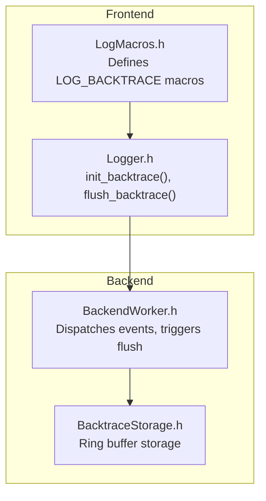
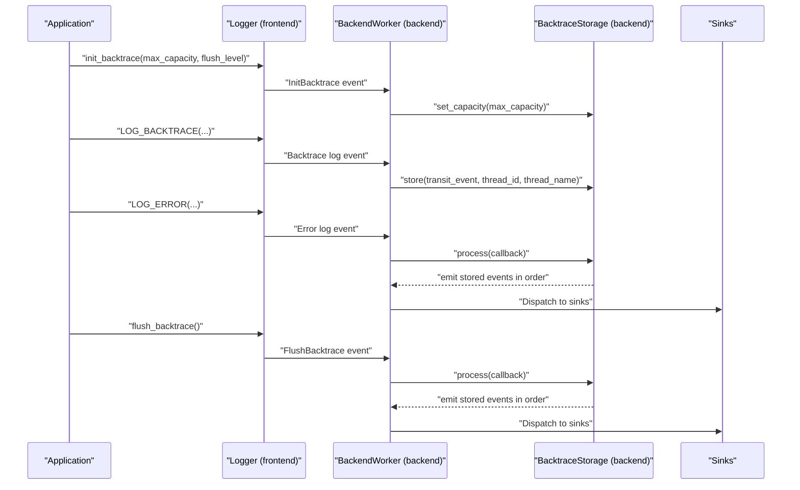
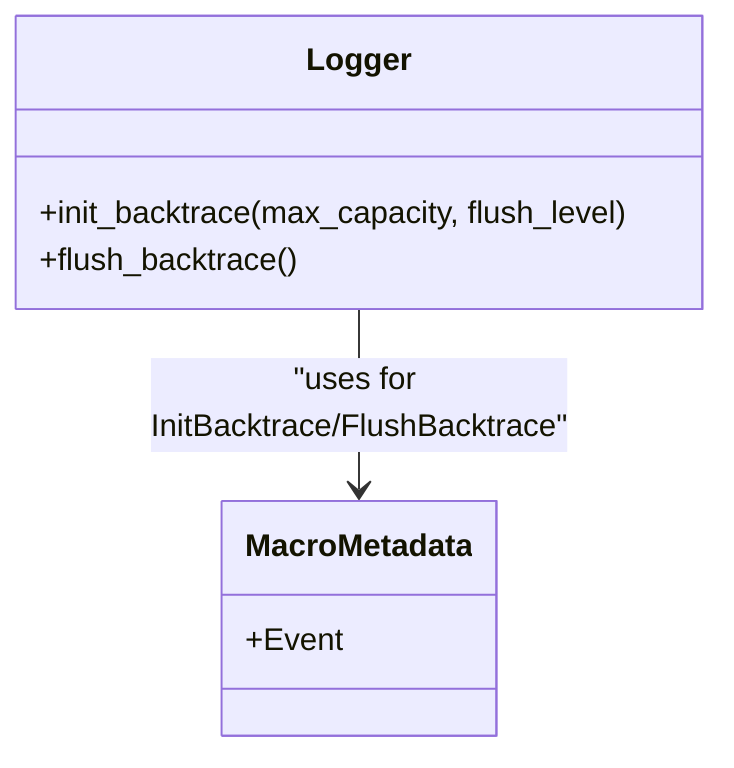
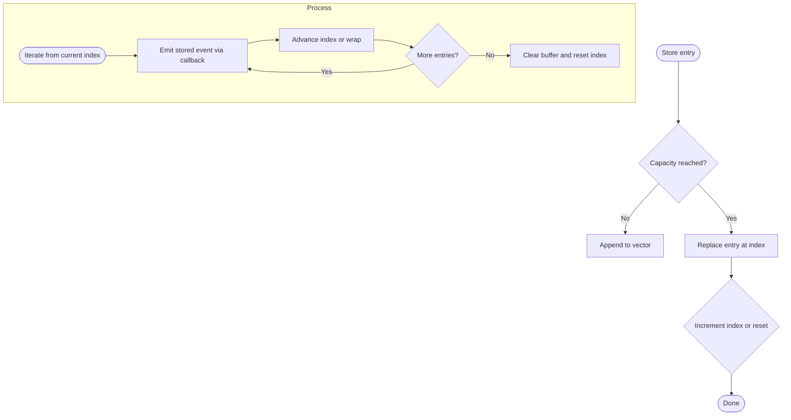
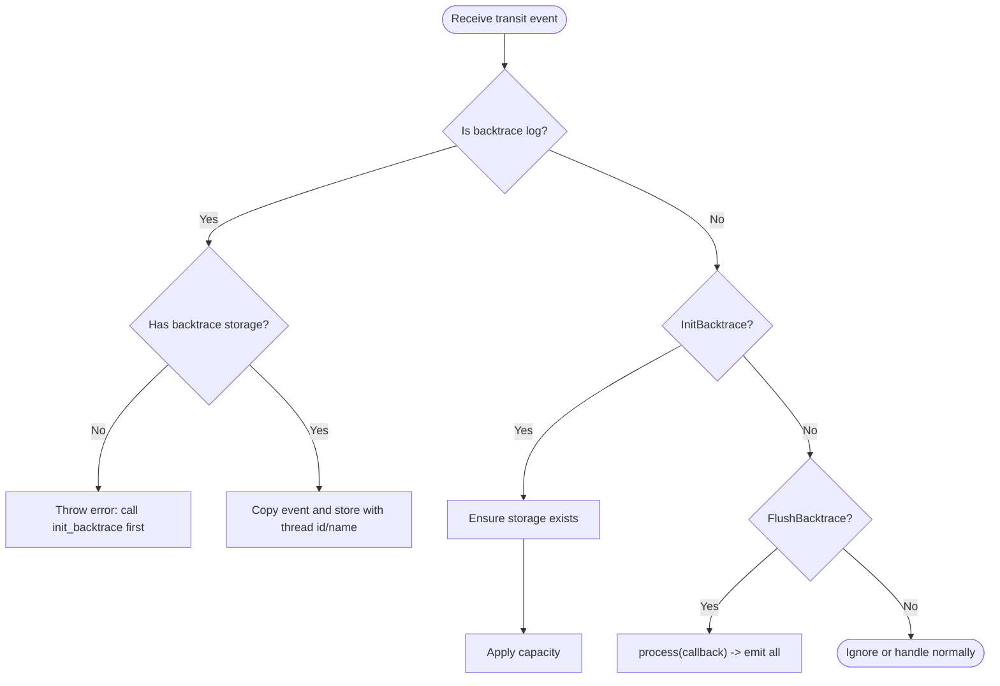
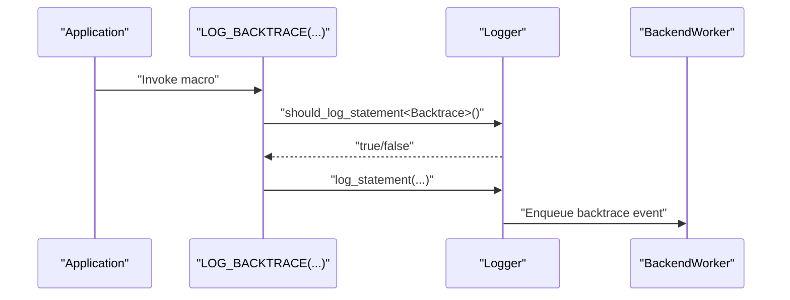
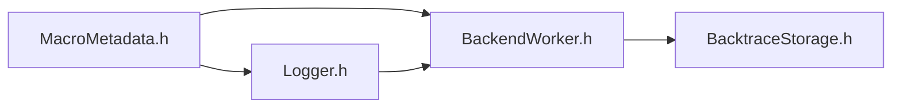

# Backtrace Logging

<cite>
**Referenced Files in This Document**
- [BacktraceStorage.h](file://include/quill/backend/BacktraceStorage.h)
- [BackendWorker.h](file://include/quill/backend/BackendWorker.h)
- [Logger.h](file://include/quill/Logger.h)
- [LogMacros.h](file://include/quill/LogMacros.h)
- [MacroMetadata.h](file://include/quill/core/MacroMetadata.h)
- [backtrace_logging.rst](file://docs/backtrace_logging.rst)
- [backtrace_logging.cpp](file://examples/backtrace_logging.cpp)
- [quill_docs_example_backtrace_logging_1.cpp](file://docs/examples/quill_docs_example_backtrace_logging_1.cpp)
- [quill_docs_example_backtrace_logging_2.cpp](file://docs/examples/quill_docs_example_backtrace_logging_2.cpp)
</cite>

## Table of Contents
1. [Introduction](#introduction)
2. [Project Structure](#project-structure)
3. [Core Components](#core-components)
4. [Architecture Overview](#architecture-overview)
5. [Detailed Component Analysis](#detailed-component-analysis)
6. [Dependency Analysis](#dependency-analysis)
7. [Performance Considerations](#performance-considerations)
8. [Troubleshooting Guide](#troubleshooting-guide)
9. [Conclusion](#conclusion)
10. [Appendices](#appendices)

## Introduction
Backtrace logging in Quill provides a mechanism to store log messages in a ring buffer until specific conditions are met or a manual flush occurs. This capability is useful for capturing contextual information leading up to an error without immediately printing it, enabling cleaner and more actionable error reporting. Messages logged via the backtrace mechanism are enqueued from the frontend to the backend, stored in a backend-side ring buffer, and flushed either when a high-severity log is emitted from the same logger or upon explicit manual flush.

## Project Structure
Backtrace logging spans several core files:
- Logger interface exposes initialization and manual flush APIs.
- Macro layer defines the LOG_BACKTRACE family of macros.
- Backend worker handles storage, condition checks, and dispatch of backtrace messages.
- Backend storage maintains the ring buffer and iteration semantics.

**Diagram sources**
- [LogMacros.h:363-371](file://include/quill/LogMacros.h#L363-L371)
- [Logger.h:269-284](file://include/quill/Logger.h#L269-L284)
- [BackendWorker.h:899-939](file://include/quill/backend/BackendWorker.h#L899-L939)
- [BacktraceStorage.h:28-87](file://include/quill/backend/BacktraceStorage.h#L28-L87)

**Section sources**
- [backtrace_logging.rst:1-35](file://docs/backtrace_logging.rst#L1-L35)

## Core Components
- Initialization: Logger::init_backtrace(max_capacity, flush_level) sets up the backtrace for a logger with a fixed-capacity ring buffer and optional severity threshold that triggers automatic flushing.
- Manual flush: Logger::flush_backtrace() forces the backend to emit all stored backtrace messages for the logger.
- Backtrace macros: LOG_BACKTRACE(...) and related variants enqueue messages into the ring buffer without immediate output.
- Backend storage: BacktraceStorage holds up to max_capacity messages per logger, replacing older entries in a ring fashion and emitting them in insertion order during flush.

Key behaviors:
- Capacity limits: Once the buffer reaches capacity, new entries overwrite the oldest stored entry in a cyclic manner.
- Trigger conditions: Automatic flush occurs when the same logger emits a log at or above the configured flush_level (default None requires manual flush).
- Ordering: Stored messages are replayed in the order they were inserted.

**Section sources**
- [Logger.h:269-284](file://include/quill/Logger.h#L269-L284)
- [Logger.h:289-300](file://include/quill/Logger.h#L289-L300)
- [LogMacros.h:363-371](file://include/quill/LogMacros.h#L363-L371)
- [BacktraceStorage.h:28-87](file://include/quill/backend/BacktraceStorage.h#L28-L87)
- [MacroMetadata.h:25-36](file://include/quill/core/MacroMetadata.h#L25-L36)

## Architecture Overview
The backtrace pipeline moves messages from the frontend to the backend and then to sinks. Initialization and flush are special events handled by the backend worker.

**Diagram sources**
- [Logger.h:269-284](file://include/quill/Logger.h#L269-L284)
- [Logger.h:289-300](file://include/quill/Logger.h#L289-L300)
- [BackendWorker.h:899-939](file://include/quill/backend/BackendWorker.h#L899-L939)
- [BacktraceStorage.h:61-87](file://include/quill/backend/BacktraceStorage.h#L61-L87)

## Detailed Component Analysis

### Logger Backtrace APIs
- init_backtrace(max_capacity, flush_level=None): Enqueues an initialization event carrying the desired capacity. The backend lazily creates the storage and applies the capacity. The flush_level is stored on the logger to evaluate trigger conditions.
- flush_backtrace(): Enqueues a flush command; the backend iterates and dispatches all stored messages for the logger.

**Diagram sources**
- [Logger.h:269-284](file://include/quill/Logger.h#L269-L284)
- [Logger.h:289-300](file://include/quill/Logger.h#L289-L300)
- [MacroMetadata.h:25-36](file://include/quill/core/MacroMetadata.h#L25-L36)

**Section sources**
- [Logger.h:269-284](file://include/quill/Logger.h#L269-L284)
- [Logger.h:289-300](file://include/quill/Logger.h#L289-L300)

### BacktraceStorage Ring Buffer
- Storage model: A vector of stored transit events with a write index and capacity. On overflow, the index wraps to overwrite the oldest entry.
- Iteration: process(callback) emits stored events in insertion order and clears the buffer afterward.
- Thread-safety: The storage is accessed exclusively by the backend worker thread, avoiding contention.

**Diagram sources**
- [BacktraceStorage.h:34-58](file://include/quill/backend/BacktraceStorage.h#L34-L58)
- [BacktraceStorage.h:61-87](file://include/quill/backend/BacktraceStorage.h#L61-L87)

**Section sources**
- [BacktraceStorage.h:28-87](file://include/quill/backend/BacktraceStorage.h#L28-L87)

### Backend Worker Backtrace Handling
- Backtrace log path: If the logger has storage, the backend copies the transit event and stores it with thread identity. Otherwise, it throws an error indicating init_backtrace must be called first.
- InitBacktrace path: Lazily constructs storage and applies capacity.
- FlushBacktrace path: Invokes process(callback) to emit all stored messages for the logger.

**Diagram sources**
- [BackendWorker.h:899-939](file://include/quill/backend/BackendWorker.h#L899-L939)

**Section sources**
- [BackendWorker.h:899-939](file://include/quill/backend/BackendWorker.h#L899-L939)

### LOG_BACKTRACE Macros
- QUILL_BACKTRACE_LOGGER_CALL: Checks the logger’s backtrace-level filtering and enqueues the message via log_statement.
- LOG_BACKTRACE(...) and LOG_BACKTRACE_TAGS(...): Convenience macros that expand to the backtrace call path.

**Diagram sources**
- [LogMacros.h:363-371](file://include/quill/LogMacros.h#L363-L371)
- [LogMacros.h:985](file://include/quill/LogMacros.h#L985)

**Section sources**
- [LogMacros.h:363-371](file://include/quill/LogMacros.h#L363-L371)
- [LogMacros.h:985](file://include/quill/LogMacros.h#L985)

### Practical Examples and Scenarios
- Error-triggered flushing: Initialize backtrace with a capacity and a flush level (e.g., Error). Emit several backtrace messages, then log an error. The backend flushes the stored messages and resets the buffer.
- Manual flushing: Initialize backtrace without a flush level. Emit backtrace messages, then call flush_backtrace() to force emission.
- Multiple backtrace sessions: After an automatic or manual flush, new backtrace messages accumulate independently.

Example references:
- [backtrace_logging.cpp:25-54](file://examples/backtrace_logging.cpp#L25-L54)
- [quill_docs_example_backtrace_logging_1.cpp:17-50](file://docs/examples/quill_docs_example_backtrace_logging_1.cpp#L17-L50)
- [quill_docs_example_backtrace_logging_2.cpp:14-27](file://docs/examples/quill_docs_example_backtrace_logging_2.cpp#L14-L27)

**Section sources**
- [backtrace_logging.cpp:25-54](file://examples/backtrace_logging.cpp#L25-L54)
- [quill_docs_example_backtrace_logging_1.cpp:17-50](file://docs/examples/quill_docs_example_backtrace_logging_1.cpp#L17-L50)
- [quill_docs_example_backtrace_logging_2.cpp:14-27](file://docs/examples/quill_docs_example_backtrace_logging_2.cpp#L14-L27)

## Dependency Analysis
- Logger depends on MacroMetadata to distinguish InitBacktrace, FlushBacktrace, and regular log events.
- BackendWorker interprets MacroMetadata::Event to route messages to storage or flush logic.
- BacktraceStorage is owned by LoggerBase and accessed only by BackendWorker.

**Diagram sources**
- [MacroMetadata.h:25-36](file://include/quill/core/MacroMetadata.h#L25-L36)
- [Logger.h:269-284](file://include/quill/Logger.h#L269-L284)
- [BackendWorker.h:899-939](file://include/quill/backend/BackendWorker.h#L899-L939)
- [BacktraceStorage.h:28-87](file://include/quill/backend/BacktraceStorage.h#L28-L87)

**Section sources**
- [MacroMetadata.h:25-36](file://include/quill/core/MacroMetadata.h#L25-L36)
- [Logger.h:269-284](file://include/quill/Logger.h#L269-L284)
- [BackendWorker.h:899-939](file://include/quill/backend/BackendWorker.h#L899-L939)
- [BacktraceStorage.h:28-87](file://include/quill/backend/BacktraceStorage.h#L28-L87)

## Performance Considerations
- Memory usage: BacktraceStorage allocates a vector sized to capacity. Each stored entry retains a copy of thread identifiers and the transit event, increasing memory proportional to capacity and average message size.
- Write path overhead: Backtrace logs are enqueued like regular logs; the backend worker performs a copy and store operation per backtrace message.
- Flush cost: process(callback) iterates all stored messages and dispatches them, which is proportional to the number of buffered messages.
- Ordering and timestamps: Stored messages retain their original timestamps. Because they are emitted later, timestamps may appear out of order relative to subsequent logs.

Best practices:
- Choose capacity based on expected context volume before the next error or flush.
- Prefer manual flush for high-frequency contexts to avoid large buffers.
- Monitor backend throughput and adjust backend worker sleep duration if necessary.

[No sources needed since this section provides general guidance]

## Troubleshooting Guide
Common issues and resolutions:
- Calling LOG_BACKTRACE before init_backtrace: The backend throws an error instructing to call init_backtrace first. Ensure initialization happens once before any LOG_BACKTRACE usage.
- Empty flush after error: After an automatic flush, the buffer is cleared. Subsequent errors will flush an empty buffer.
- Out-of-order timestamps: Because backtrace messages are emitted later, their timestamps may not reflect strict chronological ordering with subsequent logs.

**Section sources**
- [BackendWorker.h:911-915](file://include/quill/backend/BackendWorker.h#L911-L915)
- [backtrace_logging.rst:19-21](file://docs/backtrace_logging.rst#L19-L21)

## Conclusion
Backtrace logging in Quill offers a flexible way to capture contextual information around errors or at demand. By configuring capacity and a severity threshold, applications can reduce noise while preserving crucial context. The backend’s ring buffer ensures bounded memory usage and predictable performance, while the manual flush capability provides deterministic control over emission timing.

[No sources needed since this section summarizes without analyzing specific files]

## Appendices

### API Reference Summary
- Logger::init_backtrace(max_capacity, flush_level=None)
- Logger::flush_backtrace()
- LOG_BACKTRACE(logger, fmt, ...)
- LOG_BACKTRACE_TAGS(logger, tags, fmt, ...)

Integration notes:
- Works with any logger configuration; backtrace storage is attached to the logger instance.
- Thread-safe from the caller perspective; storage access is serialized by the backend worker.

**Section sources**
- [Logger.h:269-284](file://include/quill/Logger.h#L269-L284)
- [Logger.h:289-300](file://include/quill/Logger.h#L289-L300)
- [LogMacros.h:363-371](file://include/quill/LogMacros.h#L363-L371)
- [LogMacros.h:985](file://include/quill/LogMacros.h#L985)