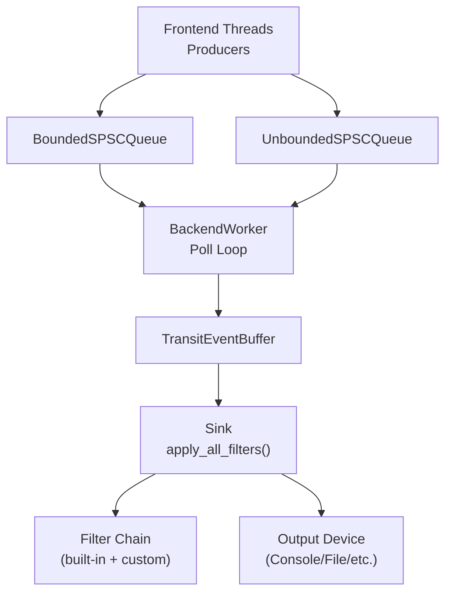
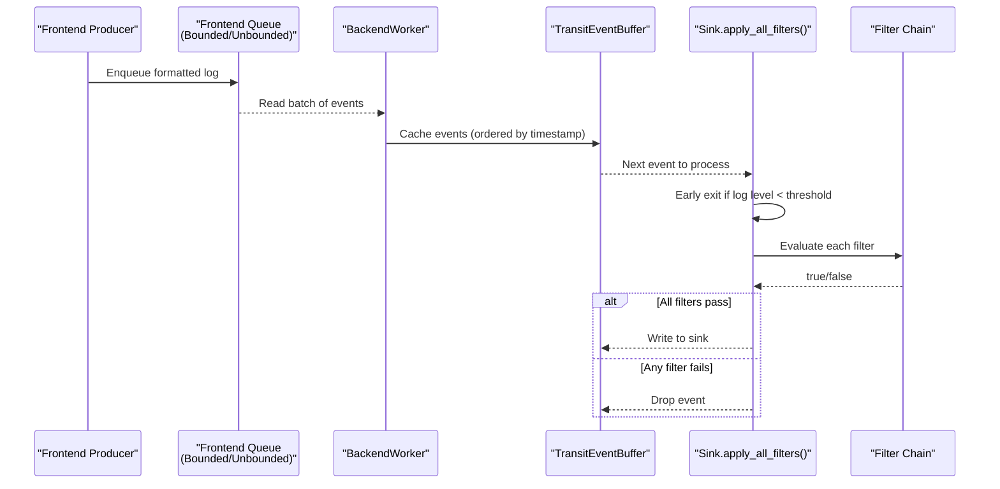
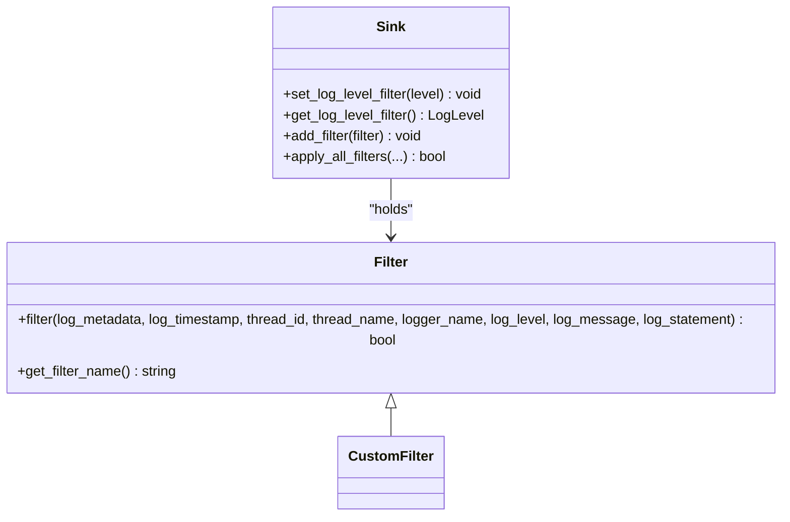
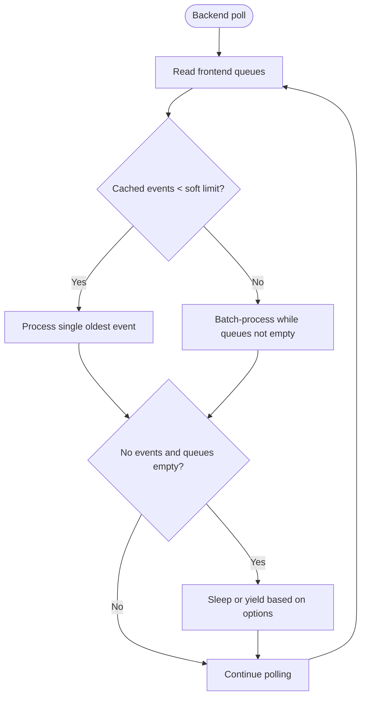
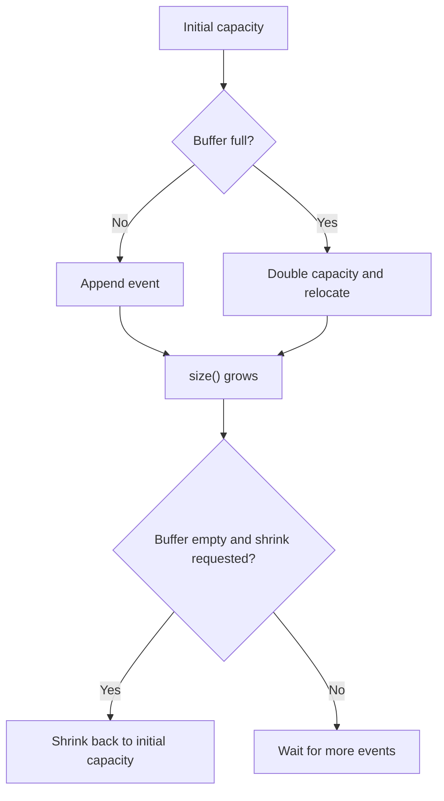
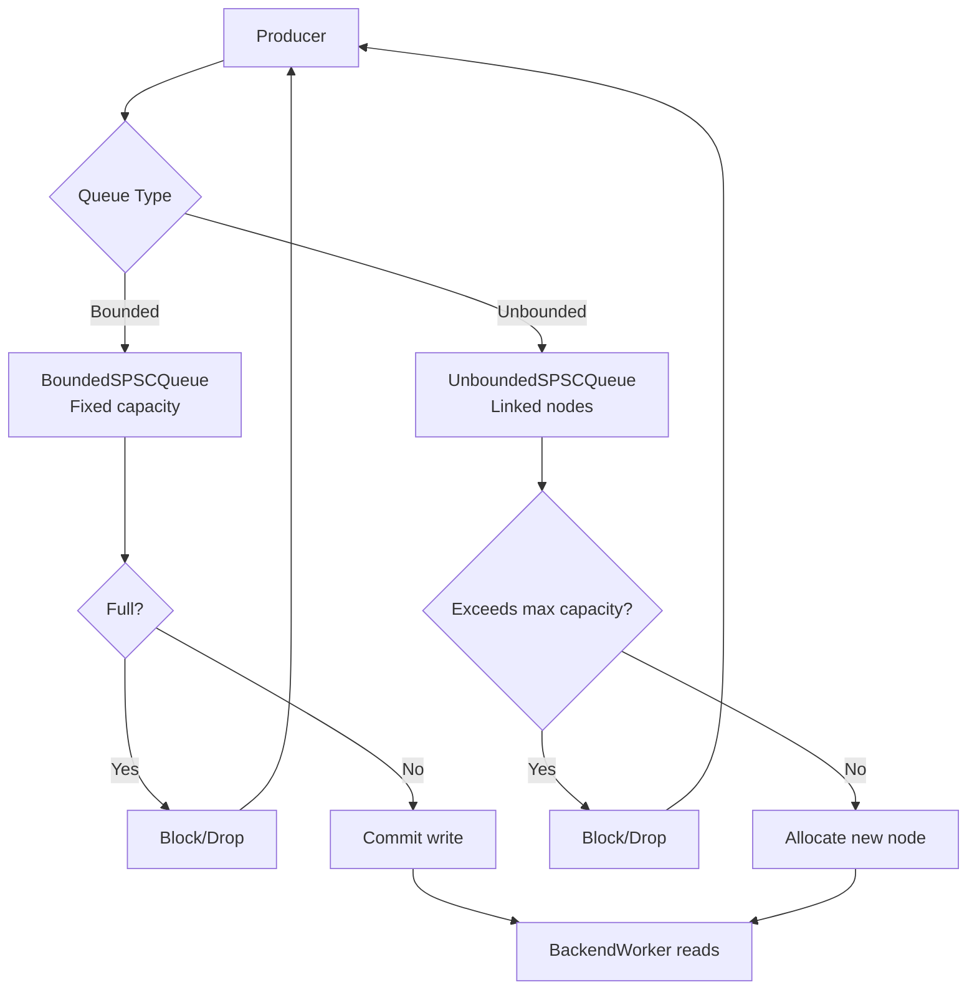
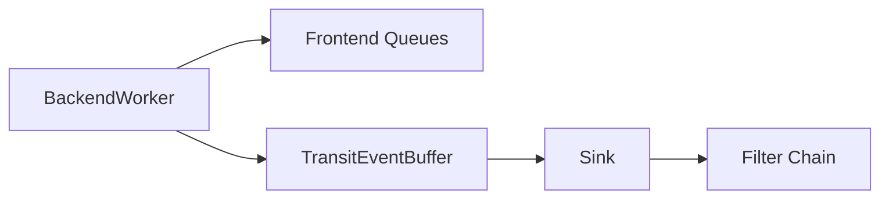

# Rate Limiting and Conditional Logging

<cite>
**Referenced Files in This Document**
- [Filter.h](file://include/quill/filters/Filter.h)
- [Sink.h](file://include/quill/sinks/Sink.h)
- [BackendWorker.h](file://include/quill/backend/BackendWorker.h)
- [TransitEventBuffer.h](file://include/quill/backend/TransitEventBuffer.h)
- [TransitEvent.h](file://include/quill/backend/TransitEvent.h)
- [BoundedSPSCQueue.h](file://include/quill/core/BoundedSPSCQueue.h)
- [UnboundedSPSCQueue.h](file://include/quill/core/UnboundedSPSCQueue.h)
- [filter_logging.cpp](file://examples/filter_logging.cpp)
- [user_defined_filter.cpp](file://examples/user_defined_filter.cpp)
- [filters.rst](file://docs/filters.rst)
</cite>

## Table of Contents
1. [Introduction](#introduction)
2. [Project Structure](#project-structure)
3. [Core Components](#core-components)
4. [Architecture Overview](#architecture-overview)
5. [Detailed Component Analysis](#detailed-component-analysis)
6. [Dependency Analysis](#dependency-analysis)
7. [Performance Considerations](#performance-considerations)
8. [Troubleshooting Guide](#troubleshooting-guide)
9. [Conclusion](#conclusion)
10. [Appendices](#appendices)

## Introduction
This document explains how Quill implements conditional logging and rate limiting features. It focuses on:
- Conditional logging via built-in and custom filters
- Rate limiting mechanisms and burst protection using the backend pipeline
- Leaky bucket-style behavior via the transit event buffer and queue limits
- Thread-safety, performance characteristics, and optimization strategies for high-frequency logging
- Practical configuration and implementation guidance with references to example code

Quill’s logging pipeline separates frontend producers (application threads) from the backend worker thread. Filtering occurs on the backend thread after messages are enqueued, enabling flexible and efficient conditional logic without burdening producers.

## Project Structure
Key areas related to rate limiting and conditional logging:
- Filters: Base filter interface and built-in log level filtering
- Sinks: Container for filters and log level thresholds
- Backend worker: Central processing loop that reads queues, orders messages, applies filters, and writes to sinks
- Transit event buffer: Temporary staging area for ordered log messages
- Queues: Bounded and unbounded SPSC queues that act as leaky buckets and protect against overload

**Diagram sources**
- [BackendWorker.h:515-573](file://include/quill/backend/BackendWorker.h#L515-L573)
- [TransitEventBuffer.h:22-98](file://include/quill/backend/TransitEventBuffer.h#L22-L98)
- [Sink.h:156-197](file://include/quill/sinks/Sink.h#L156-L197)
- [BoundedSPSCQueue.h:60-91](file://include/quill/core/BoundedSPSCQueue.h#L60-L91)
- [UnboundedSPSCQueue.h:79-140](file://include/quill/core/UnboundedSPSCQueue.h#L79-L140)

**Section sources**
- [BackendWorker.h:515-573](file://include/quill/backend/BackendWorker.h#L515-L573)
- [Sink.h:156-197](file://include/quill/sinks/Sink.h#L156-L197)
- [TransitEventBuffer.h:22-98](file://include/quill/backend/TransitEventBuffer.h#L22-L98)
- [BoundedSPSCQueue.h:60-91](file://include/quill/core/BoundedSPSCQueue.h#L60-L91)
- [UnboundedSPSCQueue.h:79-140](file://include/quill/core/UnboundedSPSCQueue.h#L79-L140)

## Core Components
- Filter interface: Defines the contract for custom filters and provides a name accessor.
- Sink: Holds a collection of filters and a log level threshold. Applies filters and short-circuits low-priority messages early.
- BackendWorker: Drives the pipeline, reads from frontend queues, orders messages by timestamp, and applies filters before writing.
- TransitEventBuffer: Circular buffer that grows under load and shrinks when idle, acting as a temporary limiter and sorter.
- Queues: Bounded and unbounded SPSC queues enforce producer-consumer pacing and backpressure.

How rate limiting emerges:
- Bounded queues cap producer throughput and drop or block based on configuration.
- Unbounded queues grow until memory allows, but the backend’s transit event buffer and limits control downstream processing.
- The backend’s soft/hard limits and sleep/yield behavior regulate CPU usage and memory growth.

**Section sources**
- [Filter.h:26-70](file://include/quill/filters/Filter.h#L26-L70)
- [Sink.h:65-104](file://include/quill/sinks/Sink.h#L65-L104)
- [BackendWorker.h:305-395](file://include/quill/backend/BackendWorker.h#L305-L395)
- [TransitEventBuffer.h:22-125](file://include/quill/backend/TransitEventBuffer.h#L22-L125)
- [BoundedSPSCQueue.h:60-91](file://include/quill/core/BoundedSPSCQueue.h#L60-L91)
- [UnboundedSPSCQueue.h:115-140](file://include/quill/core/UnboundedSPSCQueue.h#L115-L140)

## Architecture Overview
Conditional logging and rate limiting are enforced in the backend pipeline:

**Diagram sources**
- [BackendWorker.h:305-395](file://include/quill/backend/BackendWorker.h#L305-L395)
- [Sink.h:156-197](file://include/quill/sinks/Sink.h#L156-L197)
- [TransitEventBuffer.h:72-98](file://include/quill/backend/TransitEventBuffer.h#L72-L98)

## Detailed Component Analysis

### Filter Interface and Built-in Filtering
- Filter base class defines the filter method and a unique name accessor. Custom filters derive from this class and implement the evaluation logic.
- Sinks support:
  - A built-in log level filter threshold
  - Multiple custom filters added via name uniqueness checks
- Filter evaluation:
  - Sinks short-circuit if the log level is below the threshold
  - Otherwise, all filters are evaluated; the event is accepted only if all return true

**Diagram sources**
- [Filter.h:26-70](file://include/quill/filters/Filter.h#L26-L70)
- [Sink.h:65-104](file://include/quill/sinks/Sink.h#L65-L104)
- [Sink.h:156-197](file://include/quill/sinks/Sink.h#L156-L197)

**Section sources**
- [Filter.h:26-70](file://include/quill/filters/Filter.h#L26-L70)
- [Sink.h:65-104](file://include/quill/sinks/Sink.h#L65-L104)
- [Sink.h:156-197](file://include/quill/sinks/Sink.h#L156-L197)

### Backend Pipeline and Burst Protection
- The backend polls frontend queues and caches events into a per-thread transit event buffer.
- Soft/hard limits and sleep/yield logic control CPU usage and memory growth.
- Timestamp ordering ensures strict ordering; events older than a grace period are held back to avoid reordering.

**Diagram sources**
- [BackendWorker.h:305-395](file://include/quill/backend/BackendWorker.h#L305-L395)

**Section sources**
- [BackendWorker.h:305-395](file://include/quill/backend/BackendWorker.h#L305-L395)

### Transit Event Buffer and Memory Management
- Circular buffer with dynamic expansion and optional shrink-to-initial-capacity when idle.
- Ensures bounded memory growth and predictable latency under sustained load.

**Diagram sources**
- [TransitEventBuffer.h:22-125](file://include/quill/backend/TransitEventBuffer.h#L22-L125)

**Section sources**
- [TransitEventBuffer.h:22-125](file://include/quill/backend/TransitEventBuffer.h#L22-L125)

### Queue-Based Rate Limiting (Leaky Bucket Behavior)
- Bounded queues:
  - Fixed capacity with producer-side blocking/dropping depending on configuration
  - Reader batching reduces contention and improves throughput
- Unbounded queues:
  - Dynamically allocate nodes up to a configured maximum
  - Prevents indefinite growth by enforcing a hard cap; exceeding it blocks or drops

**Diagram sources**
- [BoundedSPSCQueue.h:60-91](file://include/quill/core/BoundedSPSCQueue.h#L60-L91)
- [UnboundedSPSCQueue.h:115-140](file://include/quill/core/UnboundedSPSCQueue.h#L115-L140)
- [UnboundedSPSCQueue.h:252-297](file://include/quill/core/UnboundedSPSCQueue.h#L252-L297)

**Section sources**
- [BoundedSPSCQueue.h:60-91](file://include/quill/core/BoundedSPSCQueue.h#L60-L91)
- [UnboundedSPSCQueue.h:115-140](file://include/quill/core/UnboundedSPSCQueue.h#L115-L140)
- [UnboundedSPSCQueue.h:252-297](file://include/quill/core/UnboundedSPSCQueue.h#L252-L297)

### Conditional Logging Patterns and Examples
- Built-in log level filtering at the sink level
- Custom filters for advanced conditions (e.g., deduplication)
- Runtime log level changes on loggers influence whether messages reach sinks

References:
- Built-in filtering example: [filter_logging.cpp:16-41](file://examples/filter_logging.cpp#L16-L41)
- Custom filter example: [user_defined_filter.cpp:19-72](file://examples/user_defined_filter.cpp#L19-L72)
- Documentation page: [filters.rst:1-27](file://docs/filters.rst#L1-L27)

**Section sources**
- [filter_logging.cpp:16-41](file://examples/filter_logging.cpp#L16-L41)
- [user_defined_filter.cpp:19-72](file://examples/user_defined_filter.cpp#L19-L72)
- [filters.rst:1-27](file://docs/filters.rst#L1-L27)

## Dependency Analysis
- BackendWorker depends on:
  - Frontend queues (bounded/unbounded) for input
  - TransitEventBuffer for ordering and temporary storage
  - Sink for applying filters and writing output
- Sink depends on:
  - Filter chain and log level threshold
  - Thread-safe filter registration and lazy refresh of local filter pointers

**Diagram sources**
- [BackendWorker.h:515-573](file://include/quill/backend/BackendWorker.h#L515-L573)
- [TransitEventBuffer.h:22-98](file://include/quill/backend/TransitEventBuffer.h#L22-L98)
- [Sink.h:156-197](file://include/quill/sinks/Sink.h#L156-L197)

**Section sources**
- [BackendWorker.h:515-573](file://include/quill/backend/BackendWorker.h#L515-L573)
- [Sink.h:156-197](file://include/quill/sinks/Sink.h#L156-L197)

## Performance Considerations
- CPU overhead:
  - Backend poll loop sleeps/yields when idle; adjust sleep duration and enable yield to reduce CPU when quiet
  - Soft/hard limits and batch processing balance latency and throughput
- Memory usage:
  - TransitEventBuffer doubles capacity under load and shrinks when idle to reclaim memory
  - Unbounded queues cap growth via maximum capacity; exceeding it triggers blocking/dropping
- Filtering cost:
  - Early exit on log level threshold minimizes filter evaluations
  - Keep filter logic lightweight and cacheable for high-frequency logs
- Queue tuning:
  - Choose bounded vs. unbounded based on memory/latency trade-offs
  - Adjust reader store percent and huge pages policy for cache behavior

[No sources needed since this section provides general guidance]

## Troubleshooting Guide
- Messages not appearing:
  - Verify logger’s runtime log level allows the message to reach the sink
  - Confirm sink’s log level threshold is not above the message level
  - Ensure custom filters are not rejecting the message
- Duplicate messages:
  - Review custom filter logic for correctness and thread-safety
  - Use deduplication strategies carefully to avoid missing legitimate duplicates
- High CPU usage:
  - Increase sleep duration or enable yield when idle
  - Reduce soft/hard limits or adjust queue sizes
- Memory spikes:
  - Monitor transit event buffer growth and enable shrink-to-initial-capacity usage patterns
  - Consider switching to bounded queues or lowering unbounded max capacity

**Section sources**
- [Sink.h:161-164](file://include/quill/sinks/Sink.h#L161-L164)
- [Sink.h:183-196](file://include/quill/sinks/Sink.h#L183-L196)
- [BackendWorker.h:370-387](file://include/quill/backend/BackendWorker.h#L370-L387)
- [TransitEventBuffer.h:107-125](file://include/quill/backend/TransitEventBuffer.h#L107-L125)

## Conclusion
Quill’s rate limiting and conditional logging are implemented through a layered design:
- Producers are throttled by queue types and capacities (leaky bucket behavior)
- The backend orders and stages messages in a controlled buffer
- Sinks apply fast-path log level checks and a chain of custom filters
- Tunable backend options govern CPU usage and memory growth

This architecture supports robust, high-throughput logging with flexible, efficient filtering and predictable resource usage.

[No sources needed since this section summarizes without analyzing specific files]

## Appendices

### Rate Limiting Configurations and Examples
- Built-in log level filtering at sink level: [filter_logging.cpp:23-28](file://examples/filter_logging.cpp#L23-L28)
- Custom filter implementation: [user_defined_filter.cpp:19-47](file://examples/user_defined_filter.cpp#L19-L47)
- Filter interface definition: [Filter.h:26-70](file://include/quill/filters/Filter.h#L26-L70)
- Sink filter APIs: [Sink.h:65-104](file://include/quill/sinks/Sink.h#L65-L104)

**Section sources**
- [filter_logging.cpp:23-28](file://examples/filter_logging.cpp#L23-L28)
- [user_defined_filter.cpp:19-47](file://examples/user_defined_filter.cpp#L19-L47)
- [Filter.h:26-70](file://include/quill/filters/Filter.h#L26-L70)
- [Sink.h:65-104](file://include/quill/sinks/Sink.h#L65-L104)

### Monitoring and Debugging Guidance
- Enable backend poll hooks to observe processing phases
- Use sink-level counters and logs to track filtered vs. passed messages
- Profile with varying queue sizes, sleep durations, and filter complexity to tune performance

[No sources needed since this section provides general guidance]