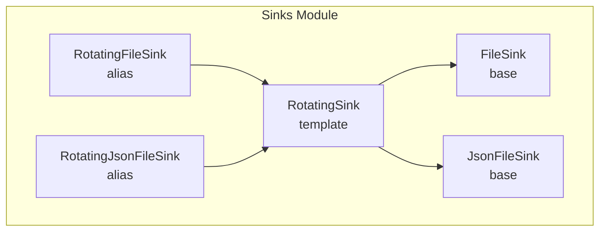
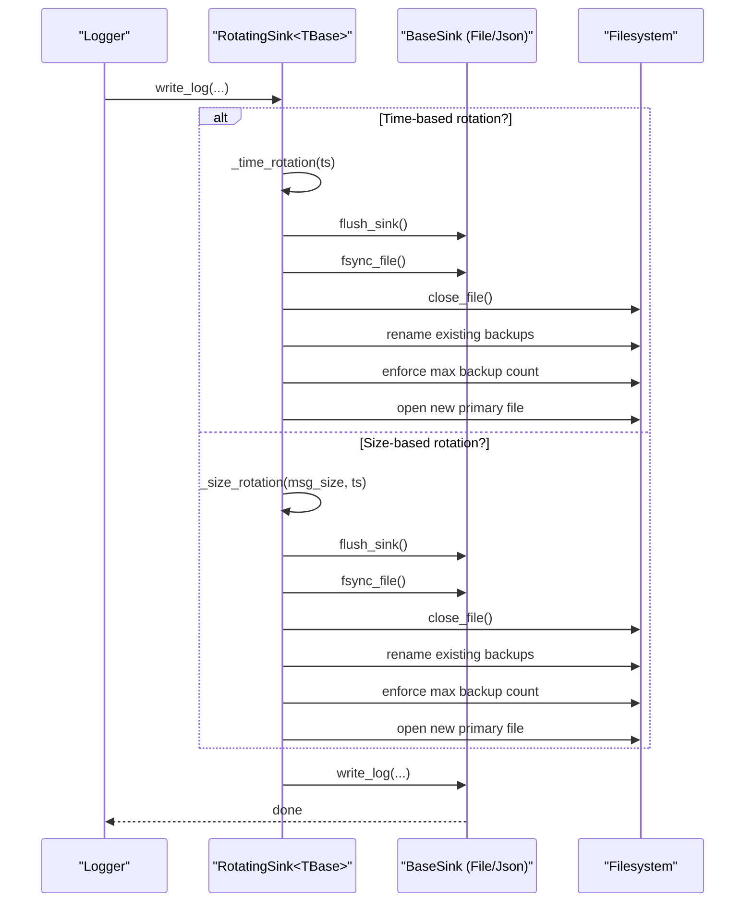
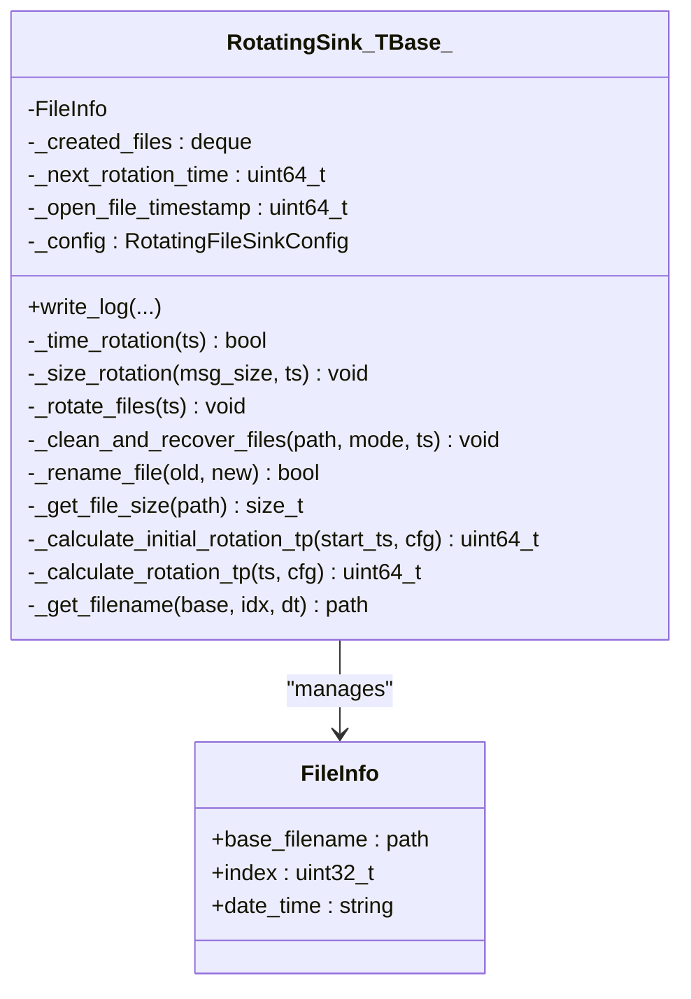
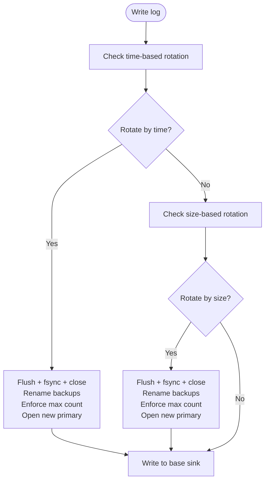
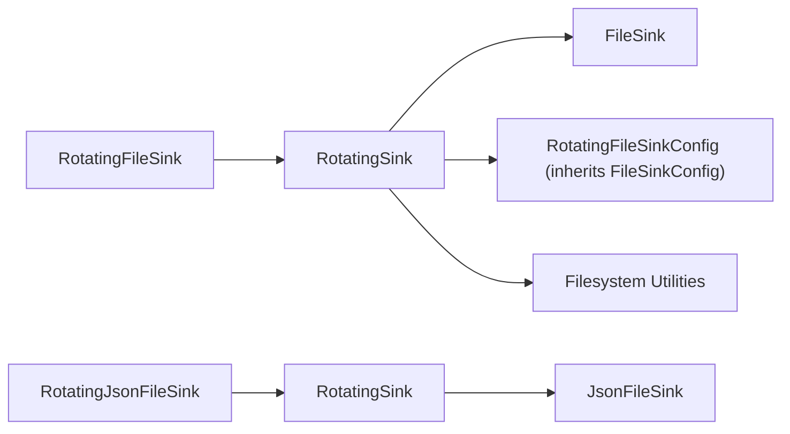

# Rotating File Logging

<cite>
**Referenced Files in This Document**
- [RotatingFileSink.h](file://include/quill/sinks/RotatingFileSink.h)
- [RotatingJsonFileSink.h](file://include/quill/sinks/RotatingJsonFileSink.h)
- [RotatingSink.h](file://include/quill/sinks/RotatingSink.h)
- [FileSink.h](file://include/quill/sinks/FileSink.h)
- [rotating_file_logging.cpp](file://examples/rotating_file_logging.cpp)
- [rotating_json_file_logging.cpp](file://examples/rotating_json_file_logging.cpp)
- [RotatingFileSinkTest.cpp](file://test/unit_tests/RotatingFileSinkTest.cpp)
</cite>

## Table of Contents
1. [Introduction](#introduction)
2. [Project Structure](#project-structure)
3. [Core Components](#core-components)
4. [Architecture Overview](#architecture-overview)
5. [Detailed Component Analysis](#detailed-component-analysis)
6. [Dependency Analysis](#dependency-analysis)
7. [Performance Considerations](#performance-considerations)
8. [Troubleshooting Guide](#troubleshooting-guide)
9. [Conclusion](#conclusion)
10. [Appendices](#appendices)

## Introduction
This document explains Quill’s rotating file logging system, focusing on the RotatingFileSink and RotatingJsonFileSink implementations. It covers how rotation is triggered (size-based, time-based, and hybrid strategies), rotation policies (keep oldest, overwrite oldest, maximum file count), and configuration options (file naming patterns, backup naming, compression, directory management). It also provides practical examples, performance considerations, and troubleshooting guidance for real-world deployments.

## Project Structure
Quill organizes rotating sinks under the sinks module. The RotatingFileSink and RotatingJsonFileSink are thin aliases built on top of a generic template RotatingSink<TBase>, which composes a base sink (FileSink or JsonFileSink) with rotation logic.

**Diagram sources**
- [RotatingFileSink.h:13](file://include/quill/sinks/RotatingFileSink.h#L13)
- [RotatingJsonFileSink.h:14](file://include/quill/sinks/RotatingJsonFileSink.h#L14)
- [RotatingSink.h:262](file://include/quill/sinks/RotatingSink.h#L262)
- [FileSink.h:226](file://include/quill/sinks/FileSink.h#L226)

**Section sources**
- [RotatingFileSink.h:13](file://include/quill/sinks/RotatingFileSink.h#L13)
- [RotatingJsonFileSink.h:14](file://include/quill/sinks/RotatingJsonFileSink.h#L14)
- [RotatingSink.h:262](file://include/quill/sinks/RotatingSink.h#L262)

## Core Components
- RotatingFileSink: An alias for RotatingSink<FileSink>.
- RotatingJsonFileSink: An alias for RotatingSink<JsonFileSink>.
- RotatingSink<TBase>: A templated sink that wraps a base sink (FileSink or JsonFileSink) and adds rotation logic. It manages:
  - Rotation triggers (size-based, time-based, or both)
  - Backup file naming schemes (index, date, date+time)
  - Backup retention policy (keep oldest, overwrite oldest, max count)
  - Startup cleanup and recovery of existing backups
  - File lifecycle (flush, fsync, rename, reopen)

Key configuration surface is provided via RotatingFileSinkConfig, which inherits from FileSinkConfig and extends it with rotation-specific options.

**Section sources**
- [RotatingFileSink.h:13](file://include/quill/sinks/RotatingFileSink.h#L13)
- [RotatingJsonFileSink.h:14](file://include/quill/sinks/RotatingJsonFileSink.h#L14)
- [RotatingSink.h:39](file://include/quill/sinks/RotatingSink.h#L39)
- [RotatingSink.h:262](file://include/quill/sinks/RotatingSink.h#L262)
- [FileSink.h:64](file://include/quill/sinks/FileSink.h#L64)

## Architecture Overview
The rotation pipeline integrates with the base sink’s write path. Before writing, the RotatingSink checks if rotation is needed (either by size threshold or by time). If rotation is required, it flushes and fsyncs, closes the current file, renames existing backups, enforces backup limits, reopens the new primary file, and then writes the new record.

**Diagram sources**
- [RotatingSink.h:335](file://include/quill/sinks/RotatingSink.h#L335)
- [RotatingSink.h:373](file://include/quill/sinks/RotatingSink.h#L373)
- [RotatingSink.h:386](file://include/quill/sinks/RotatingSink.h#L386)
- [RotatingSink.h:396](file://include/quill/sinks/RotatingSink.h#L396)
- [RotatingSink.h:406](file://include/quill/sinks/RotatingSink.h#L406)
- [RotatingSink.h:415](file://include/quill/sinks/RotatingSink.h#L415)
- [RotatingSink.h:484](file://include/quill/sinks/RotatingSink.h#L484)

## Detailed Component Analysis

### RotatingSink<TBase> Class
RotatingSink<TBase> encapsulates rotation logic and maintains:
- A deque of FileInfo entries representing created files and their indices/dates
- Next rotation timestamp for time-based rotation
- Open file timestamp and current file size for size-based decisions

Key behaviors:
- Construction: cleans/recover existing files depending on naming scheme and open mode; calculates initial rotation time if time-based rotation is configured; opens the primary file; optionally rotates on creation.
- write_log: evaluates time-based rotation first, then size-based rotation if configured; writes to the base sink.
- _time_rotation: compares the record timestamp against the next rotation time; triggers rotation if needed.
- _size_rotation: compares accumulated file size with the configured threshold; triggers rotation if exceeded.
- _rotate_files: flushes and fsyncs, closes current file, renames backups, enforces max backup count, reopens primary file, resets counters.

**Diagram sources**
- [RotatingSink.h:262](file://include/quill/sinks/RotatingSink.h#L262)
- [RotatingSink.h:826](file://include/quill/sinks/RotatingSink.h#L826)

**Section sources**
- [RotatingSink.h:278](file://include/quill/sinks/RotatingSink.h#L278)
- [RotatingSink.h:335](file://include/quill/sinks/RotatingSink.h#L335)
- [RotatingSink.h:373](file://include/quill/sinks/RotatingSink.h#L373)
- [RotatingSink.h:386](file://include/quill/sinks/RotatingSink.h#L386)
- [RotatingSink.h:396](file://include/quill/sinks/RotatingSink.h#L396)
- [RotatingSink.h:490](file://include/quill/sinks/RotatingSink.h#L490)
- [RotatingSink.h:826](file://include/quill/sinks/RotatingSink.h#L826)

### Rotation Triggers and Policies

- Size-based rotation
  - Trigger: when the sum of current file size and the incoming log message exceeds the configured threshold.
  - Action: flush, fsync, close, rename backups, enforce max count, reopen primary file.
  - Config: set_rotation_max_file_size(...).

- Time-based rotation
  - Triggers:
    - Daily at a fixed time-of-day (set_rotation_time_daily(...)).
    - Hourly or minutely intervals (set_rotation_frequency_and_interval(...)).
  - Action: same as size-based rotation.
  - Config: set_rotation_time_daily(...) or set_rotation_frequency_and_interval('h'|'m', interval).

- Hybrid rotation
  - Both size and time triggers are evaluated; whichever occurs first initiates rotation.

- Rotation policies
  - Keep oldest backups: set_overwrite_rolled_files(false) to stop rotating when max backup files is reached.
  - Overwrite oldest backups: set_overwrite_rolled_files(true) to continue rotating and overwrite the oldest backup when limits are hit.
  - Maximum backup file count: set_max_backup_files(n) to cap the number of retained backups.

**Diagram sources**
- [RotatingSink.h:335](file://include/quill/sinks/RotatingSink.h#L335)
- [RotatingSink.h:373](file://include/quill/sinks/RotatingSink.h#L373)
- [RotatingSink.h:386](file://include/quill/sinks/RotatingSink.h#L386)
- [RotatingSink.h:396](file://include/quill/sinks/RotatingSink.h#L396)

**Section sources**
- [RotatingSink.h:39](file://include/quill/sinks/RotatingSink.h#L39)
- [RotatingSink.h:126](file://include/quill/sinks/RotatingSink.h#L126)
- [RotatingSink.h:135](file://include/quill/sinks/RotatingSink.h#L135)
- [RotatingSink.h:172](file://include/quill/sinks/RotatingSink.h#L172)
- [RotatingSink.h:174](file://include/quill/sinks/RotatingSink.h#L174)

### Naming Schemes and Backup Management
- Naming schemes:
  - Index: appends .N to the base filename (e.g., logfile.log → logfile.1.log).
  - Date: appends the date suffix (e.g., logfile.log → logfile.20230612.log).
  - DateAndTime: appends date+time suffix (e.g., logfile.log → logfile.20230612_024640.log).
- Startup cleanup and recovery:
  - When open mode is 'w', old files with colliding names are removed (except unrelated files).
  - When open mode is 'a', existing backups are discovered and sorted by index/date to continue counting from the last run.
- Directory management:
  - Files are managed within the same directory as the base filename; rotation renames files in place.

**Section sources**
- [RotatingSink.h:56](file://include/quill/sinks/RotatingSink.h#L56)
- [RotatingSink.h:490](file://include/quill/sinks/RotatingSink.h#L490)
- [RotatingSink.h:562](file://include/quill/sinks/RotatingSink.h#L562)
- [RotatingSink.h:810](file://include/quill/sinks/RotatingSink.h#L810)

### Configuration Options
- Rotation thresholds and policies
  - set_rotation_max_file_size(bytes)
  - set_max_backup_files(count)
  - set_overwrite_rolled_files(flag)
  - set_rotation_on_creation(flag)
- Time-based rotation
  - set_rotation_time_daily("HH:MM")
  - set_rotation_frequency_and_interval('h'|'m', interval)
- File naming and directory
  - set_rotation_naming_scheme(Index|Date|DateAndTime)
  - set_filename_append_option(...) inherited from FileSinkConfig (affects base filename)
- File open mode and fsync
  - set_open_mode('w'|'a')
  - set_fsync_enabled(flag)
  - set_minimum_fsync_interval(ms)
- Buffering and formatting
  - set_write_buffer_size(bytes)
  - set_override_pattern_formatter_options(options)

Note: Compression is not exposed by the rotating sink APIs; use external tools if compression is required.

**Section sources**
- [RotatingSink.h:39](file://include/quill/sinks/RotatingSink.h#L39)
- [FileSink.h:64](file://include/quill/sinks/FileSink.h#L64)
- [FileSink.h:146](file://include/quill/sinks/FileSink.h#L146)
- [FileSink.h:170](file://include/quill/sinks/FileSink.h#L170)

### Examples and Scenarios

- Simple size-based rotation
  - Configure set_rotation_max_file_size(...) and open mode 'w'.
  - Example reference: [rotating_file_logging.cpp:26-32](file://examples/rotating_file_logging.cpp#L26-L32)

- Daily time-based rotation with size fallback
  - Configure set_rotation_time_daily("HH:MM") and set_rotation_max_file_size(...).
  - Example reference: [rotating_file_logging.cpp:29-31](file://examples/rotating_file_logging.cpp#L29-L31)

- JSON rotating logs
  - Use RotatingJsonFileSink with the same configuration.
  - Example reference: [rotating_json_file_logging.cpp:26-32](file://examples/rotating_json_file_logging.cpp#L26-L32)

- Keep oldest backups (no overwrite)
  - set_max_backup_files(n) and set_overwrite_rolled_files(false).
  - Reference tests: [RotatingFileSinkTest.cpp:132-199](file://test/unit_tests/RotatingFileSinkTest.cpp#L132-L199)

- Overwrite oldest backups
  - set_overwrite_rolled_files(true) with limited backup count.
  - Reference tests: [RotatingFileSinkTest.cpp:73-129](file://test/unit_tests/RotatingFileSinkTest.cpp#L73-L129)

- Hybrid rotation (size + daily)
  - set_rotation_time_daily(...) and set_rotation_max_file_size(...).
  - Reference tests: [RotatingFileSinkTest.cpp:1697-1846](file://test/unit_tests/RotatingFileSinkTest.cpp#L1697-L1846)

- Rotation on creation
  - set_rotation_on_creation(true) to rotate existing non-empty files at startup.
  - Reference tests: [RotatingFileSinkTest.cpp:2179-2322](file://test/unit_tests/RotatingFileSinkTest.cpp#L2179-L2322)

**Section sources**
- [rotating_file_logging.cpp:26](file://examples/rotating_file_logging.cpp#L26-L32)
- [rotating_json_file_logging.cpp:26](file://examples/rotating_json_file_logging.cpp#L26-L32)
- [RotatingFileSinkTest.cpp:132](file://test/unit_tests/RotatingFileSinkTest.cpp#L132-L199)
- [RotatingFileSinkTest.cpp:73](file://test/unit_tests/RotatingFileSinkTest.cpp#L73-L129)
- [RotatingFileSinkTest.cpp:1697](file://test/unit_tests/RotatingFileSinkTest.cpp#L1697-L1846)
- [RotatingFileSinkTest.cpp:2179](file://test/unit_tests/RotatingFileSinkTest.cpp#L2179-L2322)

## Dependency Analysis
RotatingFileSink and RotatingJsonFileSink depend on RotatingSink<TBase>, which depends on:
- FileSinkConfig (via inheritance) for file open mode, buffering, fsync, and filename append options.
- FileSink or JsonFileSink as the base sink for actual I/O.
- Filesystem utilities for file operations (rename, remove, size, directory iteration).

**Diagram sources**
- [RotatingFileSink.h:13](file://include/quill/sinks/RotatingFileSink.h#L13)
- [RotatingJsonFileSink.h:14](file://include/quill/sinks/RotatingJsonFileSink.h#L14)
- [RotatingSink.h:262](file://include/quill/sinks/RotatingSink.h#L262)
- [RotatingSink.h:39](file://include/quill/sinks/RotatingSink.h#L39)
- [FileSink.h:64](file://include/quill/sinks/FileSink.h#L64)

**Section sources**
- [RotatingSink.h:278](file://include/quill/sinks/RotatingSink.h#L278)
- [FileSink.h:226](file://include/quill/sinks/FileSink.h#L226)

## Performance Considerations
- Rotation cost: Each rotation involves flush, fsync, close, rename, and reopen. These are I/O heavy; prefer larger rotation thresholds or less frequent time-based rotations for high-throughput workloads.
- Backup count: Limiting backups reduces filesystem churn and disk usage; use set_max_backup_files(...) judiciously.
- Fsync behavior: Enabling fsync increases durability but can reduce throughput. Use set_minimum_fsync_interval(...) to amortize fsync calls.
- Buffering: Tune set_write_buffer_size(...) to balance memory usage and write efficiency.
- Antivirus/file lock issues: The code retries file operations with short delays on platforms where file handles may be locked by external processes.

**Section sources**
- [RotatingSink.h:406](file://include/quill/sinks/RotatingSink.h#L406)
- [RotatingSink.h:415](file://include/quill/sinks/RotatingSink.h#L415)
- [RotatingSink.h:679](file://include/quill/sinks/RotatingSink.h#L679)
- [FileSink.h:146](file://include/quill/sinks/FileSink.h#L146)
- [FileSink.h:170](file://include/quill/sinks/FileSink.h#L170)

## Troubleshooting Guide
Common issues and resolutions:
- Invalid configuration
  - Minimum file size threshold must be ≥ 512 bytes; otherwise construction throws.
  - Frequency must be 'M'/'m' (minutes) or 'H'/'h' (hours); interval must be > 0.
  - References: [RotatingSink.h:74-80](file://include/quill/sinks/RotatingSink.h#L74-L80), [RotatingSink.h:87-110](file://include/quill/sinks/RotatingSink.h#L87-L110), [RotatingSink.h:103-106](file://include/quill/sinks/RotatingSink.h#L103-L106)
- Disk space exhaustion
  - Ensure set_max_backup_files(...) is set; consider set_overwrite_rolled_files(true) to prevent unbounded growth.
  - References: [RotatingSink.h:126](file://include/quill/sinks/RotatingSink.h#L126), [RotatingSink.h:135](file://include/quill/sinks/RotatingSink.h#L135)
- Antivirus or file lock conflicts
  - The code retries file rename operations after a brief delay; if persistent failures occur, adjust antivirus exclusions or reduce rotation frequency.
  - References: [RotatingSink.h:679-700](file://include/quill/sinks/RotatingSink.h#L679-L700)
- Unexpected file collisions
  - With open mode 'w', only files with the same extension and matching base name are cleaned; unrelated files are preserved.
  - References: [RotatingSink.h:500-561](file://include/quill/sinks/RotatingSink.h#L500-L561)
- Startup rotation not occurring
  - Enable set_rotation_on_creation(true) to force rotation of existing non-empty files at startup.
  - References: [RotatingSink.h:166](file://include/quill/sinks/RotatingSink.h#L166), [RotatingFileSinkTest.cpp:2179-2322](file://test/unit_tests/RotatingFileSinkTest.cpp#L2179-L2322)

**Section sources**
- [RotatingSink.h:74](file://include/quill/sinks/RotatingSink.h#L74)
- [RotatingSink.h:87](file://include/quill/sinks/RotatingSink.h#L87)
- [RotatingSink.h:126](file://include/quill/sinks/RotatingSink.h#L126)
- [RotatingSink.h:135](file://include/quill/sinks/RotatingSink.h#L135)
- [RotatingSink.h:166](file://include/quill/sinks/RotatingSink.h#L166)
- [RotatingSink.h:679](file://include/quill/sinks/RotatingSink.h#L679)
- [RotatingSink.h:500](file://include/quill/sinks/RotatingSink.h#L500)

## Conclusion
Quill’s rotating sinks provide robust, configurable log rotation with strong support for size-based, time-based, and hybrid strategies. The design cleanly separates rotation logic from base I/O, enabling both plain text and JSON logging with consistent behavior. Careful tuning of thresholds, backup counts, and fsync settings helps balance performance, reliability, and storage efficiency.

## Appendices

### API and Behavior Reference Tables

- Rotation trigger evaluation order
  - Time-based rotation is checked first; if not triggered, size-based rotation is checked.
  - References: [RotatingSink.h:353-369](file://include/quill/sinks/RotatingSink.h#L353-L369)

- Backup naming and suffixes
  - Index: .N
  - Date: .YYYYMMDD
  - DateAndTime: .YYYYMMDD_HHMMSS
  - References: [RotatingSink.h:56](file://include/quill/sinks/RotatingSink.h#L56), [RotatingSink.h:420-428](file://include/quill/sinks/RotatingSink.h#L420-L428)

- Startup cleanup and recovery
  - 'w' mode removes colliding files; 'a' mode recovers existing backups and sorts by index/date.
  - References: [RotatingSink.h:490-654](file://include/quill/sinks/RotatingSink.h#L490-L654)

- Example usage references
  - Size-based rotation: [rotating_file_logging.cpp:26-32](file://examples/rotating_file_logging.cpp#L26-L32)
  - Daily + size hybrid: [rotating_file_logging.cpp:29-31](file://examples/rotating_file_logging.cpp#L29-L31)
  - JSON rotation: [rotating_json_file_logging.cpp:26-32](file://examples/rotating_json_file_logging.cpp#L26-L32)