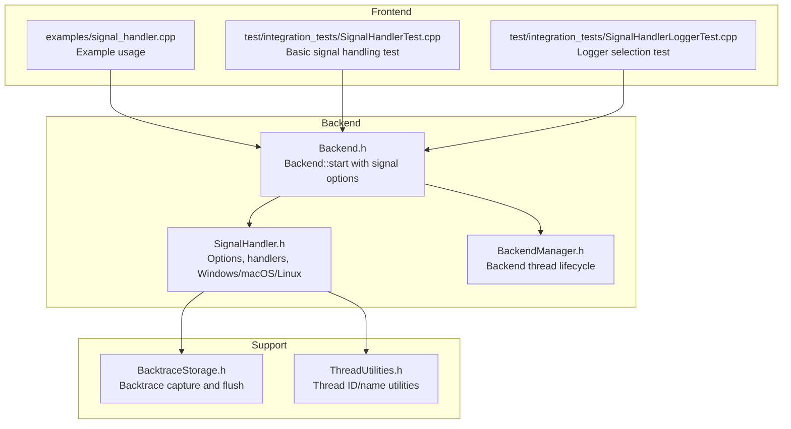
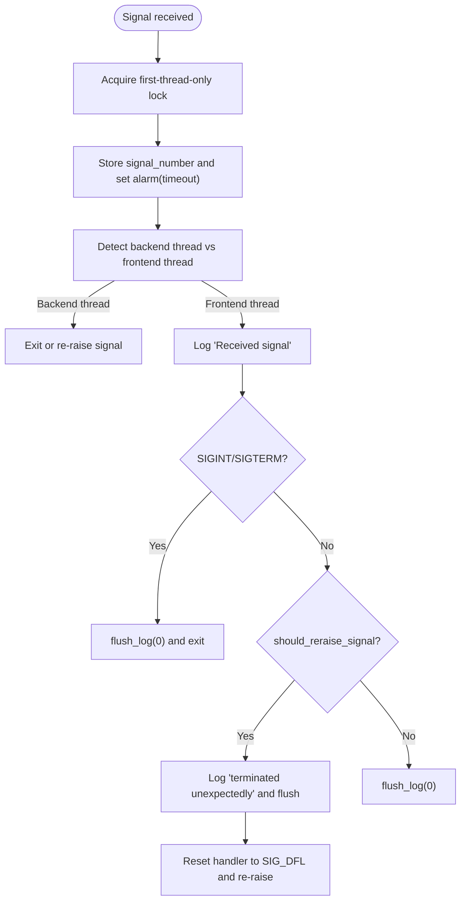
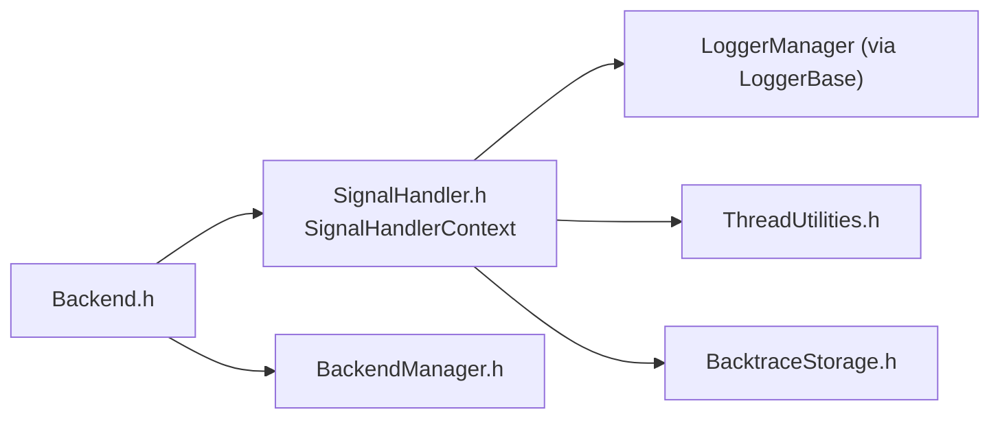

# Signal Handler Integration

<cite>
**Referenced Files in This Document**
- [SignalHandler.h](file://include/quill/backend/SignalHandler.h)
- [SignalHandler.cpp](file://examples/signal_handler.cpp)
- [SignalHandlerTest.cpp](file://test/integration_tests/SignalHandlerTest.cpp)
- [SignalHandlerLoggerTest.cpp](file://test/integration_tests/SignalHandlerLoggerTest.cpp)
- [BacktraceStorage.h](file://include/quill/backend/BacktraceStorage.h)
- [Backend.h](file://include/quill/Backend.h)
- [BackendManager.h](file://include/quill/backend/BackendManager.h)
- [ThreadUtilities.h](file://include/quill/backend/ThreadUtilities.h)
</cite>

## Table of Contents
1. [Introduction](#introduction)
2. [Project Structure](#project-structure)
3. [Core Components](#core-components)
4. [Architecture Overview](#architecture-overview)
5. [Detailed Component Analysis](#detailed-component-analysis)
6. [Dependency Analysis](#dependency-analysis)
7. [Performance Considerations](#performance-considerations)
8. [Troubleshooting Guide](#troubleshooting-guide)
9. [Conclusion](#conclusion)

## Introduction
This document explains Quill’s signal handler integration for crash-safe logging. It covers how the built-in signal handler captures critical signals (SIGSEGV, SIGABRT, SIGFPE, SIGILL, SIGINT, SIGTERM) to ensure log messages are flushed before program termination. It documents signal registration, handler installation, cleanup, and the integration with backtrace functionality for capturing stack traces during signal handling. It also addresses supported signal types, handler behavior under concurrent signal delivery, thread-safety considerations, platform-specific behaviors (Windows vs POSIX), and best practices for configuration and debugging.

## Project Structure
The signal handler integration spans several core files:
- Signal handler implementation and options
- Example usage and tests
- Backtrace storage used alongside signal handling
- Backend startup and thread lifecycle management
- Thread utilities for thread identification



**Diagram sources**
- [SignalHandler.h:47-488](file://include/quill/backend/SignalHandler.h#L47-L488)
- [Backend.h:42-141](file://include/quill/Backend.h#L42-L141)
- [BackendManager.h:38-128](file://include/quill/backend/BackendManager.h#L38-L128)
- [SignalHandler.cpp:43-90](file://examples/signal_handler.cpp#L43-L90)
- [SignalHandlerTest.cpp:25-141](file://test/integration_tests/SignalHandlerTest.cpp#L25-L141)
- [SignalHandlerLoggerTest.cpp:21-109](file://test/integration_tests/SignalHandlerLoggerTest.cpp#L21-L109)
- [BacktraceStorage.h:28-127](file://include/quill/backend/BacktraceStorage.h#L28-L127)
- [ThreadUtilities.h:198-226](file://include/quill/backend/ThreadUtilities.h#L198-L226)

**Section sources**
- [SignalHandler.h:47-488](file://include/quill/backend/SignalHandler.h#L47-L488)
- [Backend.h:42-141](file://include/quill/Backend.h#L42-L141)
- [BackendManager.h:38-128](file://include/quill/backend/BackendManager.h#L38-L128)
- [SignalHandler.cpp:43-90](file://examples/signal_handler.cpp#L43-L90)
- [SignalHandlerTest.cpp:25-141](file://test/integration_tests/SignalHandlerTest.cpp#L25-L141)
- [SignalHandlerLoggerTest.cpp:21-109](file://test/integration_tests/SignalHandlerLoggerTest.cpp#L21-L109)
- [BacktraceStorage.h:28-127](file://include/quill/backend/BacktraceStorage.h#L28-L127)
- [ThreadUtilities.h:198-226](file://include/quill/backend/ThreadUtilities.h#L198-L226)

## Core Components
- SignalHandlerOptions: Configures which signals to catch, timeout behavior, logger selection, and exclusion patterns.
- SignalHandlerContext: Singleton holding runtime state for the signal handler (logger name, exclusions, backend thread ID, timeout, reraise flag, registered signals).
- on_signal: The primary POSIX signal handler that serializes entry, sets up timeouts, logs and flushes, and optionally re-raises the signal.
- Windows handlers: Unhandled exception filter and console control handlers for Windows.
- Backend::start integration: Initializes signal handlers, manages signal masks, and wires backend thread ID for thread-detection logic.
- BacktraceStorage: Stores backtrace messages and flushes them on demand or on error conditions.

Key responsibilities:
- Ensure only one thread enters the signal handler at a time.
- Detect whether the handler runs in the backend worker thread or a frontend thread.
- Log and flush messages safely, then either exit or re-raise the signal depending on configuration.
- Provide a timeout fallback on POSIX to avoid indefinite hangs.
- Select a suitable logger for crash reporting, with configurable name and exclusions.

**Section sources**
- [SignalHandler.h:48-88](file://include/quill/backend/SignalHandler.h#L48-L88)
- [SignalHandler.h:93-138](file://include/quill/backend/SignalHandler.h#L93-L138)
- [SignalHandler.h:153-248](file://include/quill/backend/SignalHandler.h#L153-L248)
- [Backend.h:60-130](file://include/quill/Backend.h#L60-L130)
- [BacktraceStorage.h:28-127](file://include/quill/backend/BacktraceStorage.h#L28-L127)

## Architecture Overview
The signal handler integrates with the backend worker thread and the frontend logging system. On POSIX, the main thread installs handlers and blocks signals to prevent inherited masks, while the backend worker thread runs independently. On Windows, exception and console control handlers are installed globally.

```mermaid
sequenceDiagram
participant App as "Application"
participant Backend as "Backend : : start"
participant SH as "SignalHandler"
participant Worker as "BackendWorker"
participant Logger as "LoggerBase"
participant Sink as "Sink"
App->>Backend : "start(BackendOptions, SignalHandlerOptions)"
Backend->>SH : "init_signal_handler(catchable_signals)"
Backend->>Worker : "start_backend_thread()"
Backend->>SH : "set backend_thread_id"
Note over Backend,SH : "POSIX : block signals in main thread,<br/>unblock for subsequent threads"
Worker-->>App : "Backend running"
App-->>SH : "Signal delivered (e.g., SIGSEGV)"
SH->>SH : "First-thread-only lock"
SH->>SH : "Store signal_number, set alarm(timeout)"
SH->>Logger : "get_logger() and log 'Received signal'"
alt "SIGINT/SIGTERM"
SH->>Logger : "flush_log(0)"
SH-->>App : "std : : exit(EXIT_SUCCESS)"
else "Other fatal signals"
alt "should_reraise_signal"
SH->>Logger : "flush_log(0)"
SH-->>App : "std : : signal(SIG_DFL); std : : raise(signal)"
else "no reraise"
SH->>Logger : "flush_log(0)"
end
end
```

**Diagram sources**
- [Backend.h:60-130](file://include/quill/Backend.h#L60-L130)
- [SignalHandler.h:153-248](file://include/quill/backend/SignalHandler.h#L153-L248)
- [SignalHandler.h:442-471](file://include/quill/backend/SignalHandler.h#L442-L471)

## Detailed Component Analysis

### SignalHandlerOptions and SignalHandlerContext
- Options:
  - catchable_signals: Defaults to SIGTERM, SIGINT, SIGABRT, SIGFPE, SIGILL, SIGSEGV.
  - timeout_seconds: POSIX-only alarm timeout to ensure termination if handler hangs.
  - logger_name: Explicitly select a logger for crash logs; otherwise auto-select.
  - excluded_logger_substrings: Exclude certain loggers (default excludes CSV-like loggers).
- Context:
  - Holds logger_name, excluded substrings, backend_thread_id, timeout, reraise flag, and registered signals.
  - Provides get_logger() to resolve a valid logger instance for crash logs.

Behavior highlights:
- Auto-selection avoids specialized sinks unsuitable for crash reporting.
- Exclusions help avoid CSV or binary sinks that may not flush reliably.

**Section sources**
- [SignalHandler.h:48-88](file://include/quill/backend/SignalHandler.h#L48-L88)
- [SignalHandler.h:93-138](file://include/quill/backend/SignalHandler.h#L93-L138)

### Signal Registration and Cleanup
- POSIX:
  - init_signal_handler registers handlers for each signal in catchable_signals and installs an alarm handler.
  - SIGALRM is reserved and cannot be included in catchable_signals.
  - Backend::start blocks signals in the main thread to avoid inherited masks, then unblocks for subsequent threads.
  - deinit_signal_handler restores default handlers for all registered signals.
- Windows:
  - init_exception_handler installs an unhandled exception filter and console control handler.
  - init_signal_handler is invoked per thread because Windows requires per-thread handlers.
  - deinit_signal_handler is not exposed; Windows relies on process teardown.

Thread-safety:
- Registered signals are protected by a mutex in SignalHandlerContext.
- First-thread-only lock prevents race conditions during handler entry.

**Section sources**
- [SignalHandler.h:442-471](file://include/quill/backend/SignalHandler.h#L442-L471)
- [SignalHandler.h:410-424](file://include/quill/backend/SignalHandler.h#L410-L424)
- [Backend.h:86-129](file://include/quill/Backend.h#L86-L129)
- [SignalHandler.h:376-384](file://include/quill/backend/SignalHandler.h#L376-L384)

### Handler Behavior During Concurrent Signal Delivery
- First-thread-only lock ensures only one thread executes the handler logic.
- Subsequent signals are deferred or ignored until the handler completes.
- On POSIX, the alarm handler re-delivers the original signal if the handler hangs.
- On Windows, the handler uses sleep/pause equivalents to avoid busy-waiting.

Concurrency implications:
- Handlers must remain async-signal-safe; Quill’s design minimizes risky operations and flushes logs synchronously.
- Backend thread detection avoids interfering with the backend worker thread’s operation.

**Section sources**
- [SignalHandler.h:153-171](file://include/quill/backend/SignalHandler.h#L153-L171)
- [SignalHandler.h:429-440](file://include/quill/backend/SignalHandler.h#L429-L440)

### Supported Signal Types and Platform-Specific Considerations
- POSIX signals: SIGTERM, SIGINT, SIGABRT, SIGFPE, SIGILL, SIGSEGV, plus SIGALRM (internal alarm).
- Windows exceptions: Unhandled exceptions and console control events (Ctrl+C/Break).
- Signal masking:
  - Backend::start blocks signals in the main thread to avoid inherited masks.
  - Subsequent threads inherit the blocked mask; signal handlers must be installed per thread on Windows.
- Interaction with other signal handlers:
  - Enabling Quill’s signal handler overrides process handlers for configured signals.
  - Users should not install conflicting handlers for the same signals.

**Section sources**
- [SignalHandler.h:56-88](file://include/quill/backend/SignalHandler.h#L56-L88)
- [Backend.h:86-119](file://include/quill/Backend.h#L86-L119)
- [SignalHandler.h:376-384](file://include/quill/backend/SignalHandler.h#L376-L384)

### Integration with Backtrace Logging
- BacktraceStorage stores a bounded ring of backtrace messages per logger.
- Backend dispatch logic routes LOG_BACKTRACE to BacktraceStorage; LOG_ERROR triggers backtrace flush.
- Signal handler logs “Received signal” and “Program terminated unexpectedly” and flushes logs; backtrace messages are not automatically flushed by the signal handler itself.
- Best practice: Initialize backtrace with a desired flush level (e.g., LogLevel::Error) to ensure backtrace is flushed on error conditions.



**Diagram sources**
- [SignalHandler.h:153-248](file://include/quill/backend/SignalHandler.h#L153-L248)

**Section sources**
- [BacktraceStorage.h:28-127](file://include/quill/backend/BacktraceStorage.h#L28-L127)
- [Backend.h:893-927](file://include/quill/Backend.h#L893-L927)

### Example Setup and Customization
- Basic setup:
  - Call Backend::start with SignalHandlerOptions to enable signal handling.
  - On Windows, call init_signal_handler per thread.
- Custom signal handling:
  - Modify catchable_signals to include/exclude specific signals.
  - Adjust timeout_seconds for POSIX.
  - Choose a logger by name or rely on automatic selection with exclusions.
- Integration with existing signal management:
  - If your application installs its own handlers for the same signals, disable Quill’s signal handler or coordinate carefully.

References:
- Example usage: [examples/signal_handler.cpp:43-90](file://examples/signal_handler.cpp#L43-L90)
- Tests demonstrating behavior: 
  - [test/integration_tests/SignalHandlerTest.cpp:25-141](file://test/integration_tests/SignalHandlerTest.cpp#L25-L141)
  - [test/integration_tests/SignalHandlerLoggerTest.cpp:21-109](file://test/integration_tests/SignalHandlerLoggerTest.cpp#L21-L109)

**Section sources**
- [SignalHandler.cpp:43-90](file://examples/signal_handler.cpp#L43-L90)
- [SignalHandlerTest.cpp:25-141](file://test/integration_tests/SignalHandlerTest.cpp#L25-L141)
- [SignalHandlerLoggerTest.cpp:21-109](file://test/integration_tests/SignalHandlerLoggerTest.cpp#L21-L109)

## Dependency Analysis
- Backend::start depends on SignalHandlerContext to configure logger name, exclusions, timeout, and backend thread ID.
- SignalHandler relies on LoggerManager to resolve a logger for crash logs.
- ThreadUtilities provides thread identification used to detect backend thread context.
- BacktraceStorage is used by the backend worker to store and flush backtrace messages.



**Diagram sources**
- [Backend.h:60-130](file://include/quill/Backend.h#L60-L130)
- [SignalHandler.h:93-138](file://include/quill/backend/SignalHandler.h#L93-L138)
- [ThreadUtilities.h:198-226](file://include/quill/backend/ThreadUtilities.h#L198-L226)
- [BacktraceStorage.h:28-127](file://include/quill/backend/BacktraceStorage.h#L28-L127)

**Section sources**
- [Backend.h:60-130](file://include/quill/Backend.h#L60-L130)
- [SignalHandler.h:93-138](file://include/quill/backend/SignalHandler.h#L93-L138)
- [ThreadUtilities.h:198-226](file://include/quill/backend/ThreadUtilities.h#L198-L226)
- [BacktraceStorage.h:28-127](file://include/quill/backend/BacktraceStorage.h#L28-L127)

## Performance Considerations
- Signal handler overhead:
  - Minimal work inside the handler; primarily logging and flushing.
  - Timeout ensures termination even if flushing hangs.
- Backpressure:
  - Backtrace storage is bounded; older entries are overwritten.
  - Backtrace flush occurs on error or explicit flush; avoid excessive backtrace logging in hot paths.
- Threading:
  - First-thread-only lock prevents contention but may delay subsequent signals.
  - Backend thread detection avoids interfering with backend worker thread.

[No sources needed since this section provides general guidance]

## Troubleshooting Guide
Common issues and resolutions:
- Signals not caught:
  - Ensure Backend::start is called with SignalHandlerOptions and catchable_signals includes the target signal.
  - On Windows, install init_signal_handler on each thread.
- No crash logs:
  - Verify a valid logger exists; if logger_name is set, ensure it exists; otherwise, excluded_logger_substrings may filter out candidates.
  - Confirm should_reraise_signal is set appropriately; if false, the process exits without re-raising.
- Infinite hang:
  - Check timeout_seconds; adjust if flushing is slow.
  - Review sinks that may block (e.g., network or fsync-heavy sinks).
- Conflicting handlers:
  - Disable Quill’s signal handler or remove user handlers for overlapping signals.
- Backtrace not flushed:
  - Initialize backtrace with a flush level or call flush_backtrace explicitly.

**Section sources**
- [SignalHandler.h:48-88](file://include/quill/backend/SignalHandler.h#L48-L88)
- [SignalHandler.h:153-248](file://include/quill/backend/SignalHandler.h#L153-L248)
- [SignalHandlerTest.cpp:25-141](file://test/integration_tests/SignalHandlerTest.cpp#L25-L141)
- [SignalHandlerLoggerTest.cpp:21-109](file://test/integration_tests/SignalHandlerLoggerTest.cpp#L21-L109)

## Conclusion
Quill’s signal handler integration provides crash-safe logging by capturing critical signals, serializing handler entry, logging and flushing messages, and optionally re-raising the signal. It integrates tightly with the backend worker thread and supports both POSIX and Windows platforms. Proper configuration of catchable signals, logger selection, and backtrace settings ensures reliable crash reporting. Following the best practices outlined here will minimize performance impact and improve debuggability.