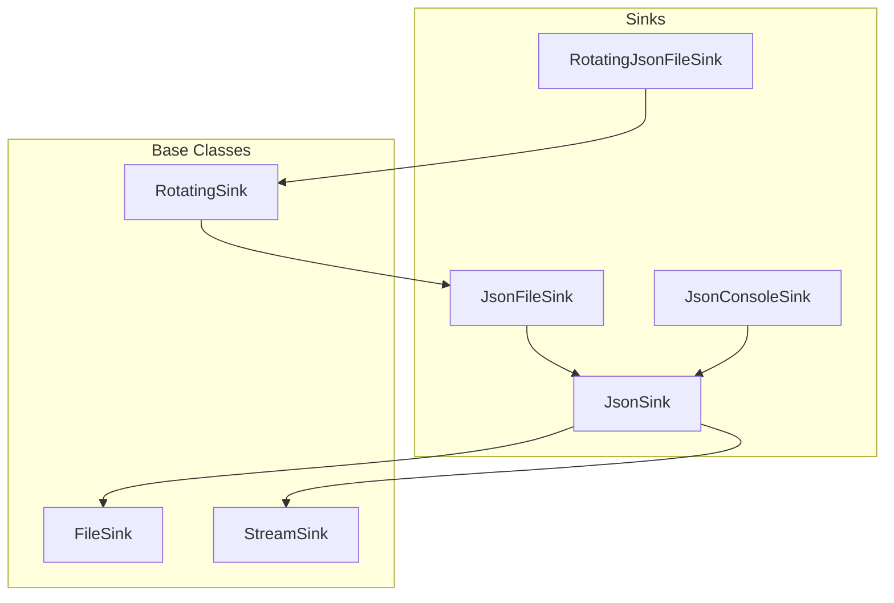
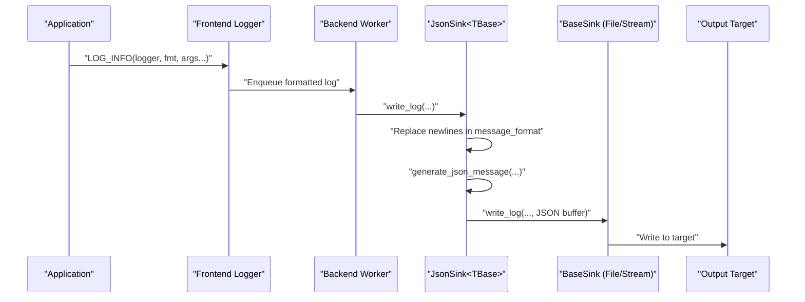
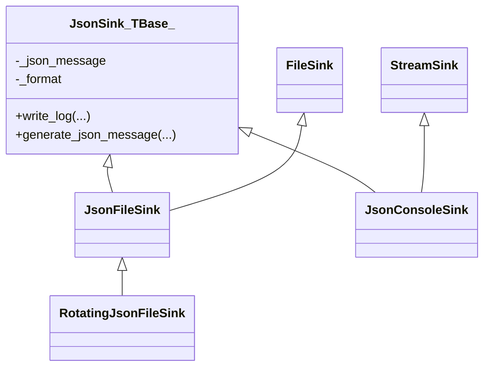
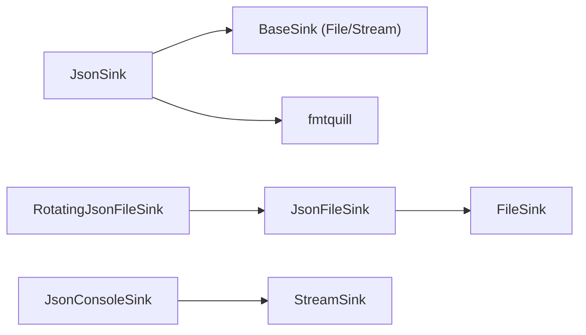

# Structured JSON Logging

<cite>
**Referenced Files in This Document**
- [JsonSink.h](file://include/quill/sinks/JsonSink.h)
- [RotatingJsonFileSink.h](file://include/quill/sinks/RotatingJsonFileSink.h)
- [json_console_logging.cpp](file://examples/json_console_logging.cpp)
- [json_console_logging_custom_json.cpp](file://examples/json_console_logging_custom_json.cpp)
- [json_file_logging.cpp](file://examples/json_file_logging.cpp)
- [rotating_json_file_logging.cpp](file://examples/rotating_json_file_logging.cpp)
- [rotating_json_file_logging_custom_json.cpp](file://examples/rotating_json_file_logging_custom_json.cpp)
- [JsonConsoleLoggingTest.cpp](file://test/integration_tests/JsonConsoleLoggingTest.cpp)
- [JsonFileLoggingTest.cpp](file://test/integration_tests/JsonFileLoggingTest.cpp)
- [json_logging.rst](file://docs/json_logging.rst)
- [LogMacros.h](file://include/quill/LogMacros.h)
</cite>

## Table of Contents
1. [Introduction](#introduction)
2. [Project Structure](#project-structure)
3. [Core Components](#core-components)
4. [Architecture Overview](#architecture-overview)
5. [Detailed Component Analysis](#detailed-component-analysis)
6. [Dependency Analysis](#dependency-analysis)
7. [Performance Considerations](#performance-considerations)
8. [Troubleshooting Guide](#troubleshooting-guide)
9. [Conclusion](#conclusion)
10. [Appendices](#appendices)

## Introduction
This document explains Quill’s structured JSON logging capabilities with a focus on the JsonSink implementation and its role in generating machine-readable log formats. It covers the default JSON structure, customization options, integration with multiple sinks, parsing and extraction techniques for log analysis, performance characteristics, and best practices for compatibility with log processing pipelines.

## Project Structure
Quill’s JSON logging is centered around specialized sink classes that inherit from a generic JsonSink template. The primary components are:
- JsonSink<TBase>: A templated sink that composes with FileSink or StreamSink to produce JSON output.
- JsonFileSink and JsonConsoleSink: Concrete sinks for file and console targets.
- RotatingJsonFileSink: A rotating variant built by composing JsonFileSink with RotatingSink.
- Examples and tests demonstrating console, file, and rotating JSON logging, as well as custom JSON formatting.

**Diagram sources**
- [JsonSink.h:140-162](file://include/quill/sinks/JsonSink.h#L140-L162)
- [RotatingJsonFileSink.h:14-14](file://include/quill/sinks/RotatingJsonFileSink.h#L14-L14)

**Section sources**
- [JsonSink.h:140-162](file://include/quill/sinks/JsonSink.h#L140-L162)
- [RotatingJsonFileSink.h:14-14](file://include/quill/sinks/RotatingJsonFileSink.h#L14-L14)

## Core Components
- JsonSink<TBase>:
  - Provides the JSON serialization pipeline and default structure.
  - Ensures newline-safe message formatting by replacing newlines in the message format.
  - Builds a JSON object incrementally and appends a trailing newline.
  - Exposes a virtual method to customize the JSON structure in derived classes.

- JsonFileSink and JsonConsoleSink:
  - Concrete sinks that integrate JsonSink with FileSink or StreamSink respectively.
  - JsonConsoleSink writes to stdout.

- RotatingJsonFileSink:
  - Built as RotatingSink<JsonFileSink>, enabling rotation policies while preserving JSON output.

Key JSON fields produced by the default implementation:
- timestamp
- file_name
- line
- thread_id
- logger
- log_level
- message
- Named arguments from the log statement (as key-value pairs)

**Section sources**
- [JsonSink.h:58-134](file://include/quill/sinks/JsonSink.h#L58-L134)
- [JsonSink.h:140-162](file://include/quill/sinks/JsonSink.h#L140-L162)
- [RotatingJsonFileSink.h:14-14](file://include/quill/sinks/RotatingJsonFileSink.h#L14-L14)

## Architecture Overview
The JSON logging pipeline integrates frontend logging calls with backend processing and sink-specific output. The JsonSink template composes with base sinks to serialize structured JSON.

**Diagram sources**
- [JsonSink.h:58-93](file://include/quill/sinks/JsonSink.h#L58-L93)

## Detailed Component Analysis

### JsonSink Implementation and Default JSON Structure
- write_log:
  - Normalizes message_format by replacing newlines to keep JSON valid.
  - Clears and rebuilds the JSON buffer.
  - Calls generate_json_message to build the payload.
  - Appends a closing brace and newline, then delegates to StreamSink::write_log.

- generate_json_message (default):
  - Starts with a JSON object and adds core fields: timestamp, file_name, line, thread_id, logger, log_level, message.
  - Iterates over named_args and appends each as a key-value pair.
  - Derived classes can override this method to change field ordering, add/remove fields, or adjust formatting.

- Field ordering and customization:
  - The default order is fixed by the base implementation.
  - Overriding generate_json_message allows custom ordering and additional fields.

- Value formatting:
  - Values are appended as strings; numeric and complex types are serialized according to their string representation.
  - Custom sinks can implement richer formatting (e.g., timestamps, nested objects) by overriding generation.

**Section sources**
- [JsonSink.h:58-134](file://include/quill/sinks/JsonSink.h#L58-L134)

### Integration with Different Sinks and Hybrid Logging
- Multiple sinks per logger:
  - A single logger can write to multiple sinks simultaneously (e.g., JSON file and console).
  - The JSON sink uses its own internal format; other sinks can use separate patterns.

- Console and file examples:
  - Console JSON logging with LOGJ_ macros and manual named placeholders.
  - File JSON logging with JsonFileSink and optional hybrid console output.

- Rotating JSON logging:
  - Uses RotatingJsonFileSink to rotate logs while maintaining JSON structure.
  - Custom sinks can override generate_json_message for specialized timestamp or metadata formatting.

**Section sources**
- [json_console_logging.cpp:17-34](file://examples/json_console_logging.cpp#L17-L34)
- [json_file_logging.cpp:28-64](file://examples/json_file_logging.cpp#L28-L64)
- [rotating_json_file_logging.cpp:21-32](file://examples/rotating_json_file_logging.cpp#L21-L32)
- [rotating_json_file_logging_custom_json.cpp:21-64](file://examples/rotating_json_file_logging_custom_json.cpp#L21-L64)

### Custom JSON Output and Field Ordering
- Custom sink example:
  - Derives from JsonConsoleSink and overrides generate_json_message to tailor the JSON structure.
  - Demonstrates selective inclusion of fields and custom message formatting.

- Field ordering:
  - The example shows how to reorder fields by adjusting the order of append operations in generate_json_message.

- Special value types:
  - The framework serializes values as strings; custom sinks can embed richer structures (arrays, objects) by constructing appropriate JSON fragments.

**Section sources**
- [json_console_logging_custom_json.cpp:12-40](file://examples/json_console_logging_custom_json.cpp#L12-L40)

### Parsing and Extraction Techniques
- JSON parsing:
  - Each log line is a complete JSON object ending with a newline.
  - Use standard JSON parsers to extract fields such as timestamp, logger, log_level, message, and named arguments.

- Field extraction:
  - Extract core fields directly from the parsed object.
  - Iterate over key-value pairs to collect named arguments for downstream analytics.

- Validation and robustness:
  - Tests confirm newline normalization and correct handling of non-printable characters and invalid formats.

**Section sources**
- [JsonConsoleLoggingTest.cpp:69-75](file://test/integration_tests/JsonConsoleLoggingTest.cpp#L69-L75)
- [JsonFileLoggingTest.cpp:150-193](file://test/integration_tests/JsonFileLoggingTest.cpp#L150-L193)

### LOGJ_ Macros and Named Arguments
- LOGJ_ macros:
  - Automatically embed variable names into placeholders, simplifying JSON logging for up to 26 arguments.
  - Concatenated at compile time with no runtime overhead.

- Usage patterns:
  - Combine LOGJ_ macros with manual named placeholders for flexible JSON structures.
  - Use with hybrid loggers to emit both JSON and human-readable formats.

**Section sources**
- [LogMacros.h:165-200](file://include/quill/LogMacros.h#L165-L200)
- [json_console_logging.cpp:29-33](file://examples/json_console_logging.cpp#L29-L33)

### Class and Composition Diagram

**Diagram sources**
- [JsonSink.h:140-162](file://include/quill/sinks/JsonSink.h#L140-L162)
- [RotatingJsonFileSink.h:14-14](file://include/quill/sinks/RotatingJsonFileSink.h#L14-L14)

## Dependency Analysis
- Coupling:
  - JsonSink<TBase> depends on base sinks (FileSink or StreamSink) and uses fmtquill for string formatting.
  - RotatingJsonFileSink composes JsonFileSink with RotatingSink, inheriting rotation behavior while preserving JSON output.

- Cohesion:
  - JsonSink focuses solely on JSON serialization, promoting high cohesion.
  - Customization is achieved via virtual method override, minimizing invasive changes.

- External dependencies:
  - fmtquill is used for efficient string formatting and buffer management.

**Diagram sources**
- [JsonSink.h:140-162](file://include/quill/sinks/JsonSink.h#L140-L162)
- [RotatingJsonFileSink.h:14-14](file://include/quill/sinks/RotatingJsonFileSink.h#L14-L14)

**Section sources**
- [JsonSink.h:140-162](file://include/quill/sinks/JsonSink.h#L140-L162)
- [RotatingJsonFileSink.h:14-14](file://include/quill/sinks/RotatingJsonFileSink.h#L14-L14)

## Performance Considerations
- Serialization cost:
  - JSON construction uses incremental string building and fmtquill formatting; overhead is proportional to the number of named arguments.
  - Newline normalization ensures valid JSON without additional parsing costs.

- Memory allocation patterns:
  - A memory_buffer accumulates the JSON payload; repeated calls reuse the buffer and append new content.
  - Minimal heap allocations occur during formatting; prefer preallocating buffers for extremely high-throughput scenarios.

- Optimization strategies:
  - Keep the number of named arguments reasonable to reduce concatenation overhead.
  - Use LOGJ_ macros to avoid manual placeholder construction when possible.
  - For custom sinks, minimize redundant string copies by appending preformatted fragments.
  - Consider disabling unnecessary formatter patterns for JSON-only loggers to reduce work.

[No sources needed since this section provides general guidance]

## Troubleshooting Guide
- Newlines in messages:
  - The sink replaces newlines in the message format to maintain valid JSON. If your message intentionally spans lines, consider escaping or normalizing content before logging.

- Non-printable characters:
  - Tests show correct handling of non-printable characters; ensure downstream parsers treat escaped sequences appropriately.

- Invalid format strings:
  - The framework preserves invalid format constructs in the message; verify that your JSON parser can tolerate malformed placeholders.

- Hybrid logging:
  - When combining JSON and console outputs, ensure the console formatter includes named_args if you want to display variable values alongside JSON.

**Section sources**
- [JsonSink.h:68-80](file://include/quill/sinks/JsonSink.h#L68-L80)
- [JsonFileLoggingTest.cpp:109-118](file://test/integration_tests/JsonFileLoggingTest.cpp#L109-L118)

## Conclusion
Quill’s JsonSink provides a robust, extensible foundation for structured JSON logging. Its default implementation offers a consistent, machine-readable structure, while customization hooks enable tailored schemas, field ordering, and value formatting. By integrating with multiple sinks and leveraging LOGJ_ macros, applications can produce JSON logs suitable for automated analysis and monitoring pipelines.

[No sources needed since this section summarizes without analyzing specific files]

## Appendices

### Best Practices for JSON Log Formatting
- Field naming conventions:
  - Use lowercase with underscores or camelCase consistently across your organization.
  - Reserve top-level keys for core metadata (timestamp, logger, log_level, message).

- Compatibility with log pipelines:
  - Keep values JSON-safe (strings, numbers, booleans, null). Avoid raw binary or unescaped control characters.
  - Include contextual identifiers (request_id, correlation_id) as named arguments for traceability.

- Schema evolution:
  - Add optional fields rather than removing existing ones to maintain backward compatibility.
  - Use nested objects sparingly; prefer flat structures for easier querying.

- Security and privacy:
  - Avoid logging sensitive data (passwords, tokens). Sanitize or redact values before emitting JSON.

[No sources needed since this section provides general guidance]

### Example References
- Console JSON logging with LOGJ_ macros and manual placeholders:
  - [json_console_logging.cpp:17-34](file://examples/json_console_logging.cpp#L17-L34)

- Custom JSON formatting by overriding generate_json_message:
  - [json_console_logging_custom_json.cpp:12-40](file://examples/json_console_logging_custom_json.cpp#L12-L40)

- File JSON logging with hybrid console output:
  - [json_file_logging.cpp:28-64](file://examples/json_file_logging.cpp#L28-L64)

- Rotating JSON logging with custom timestamp formatting:
  - [rotating_json_file_logging_custom_json.cpp:21-64](file://examples/rotating_json_file_logging_custom_json.cpp#L21-L64)

- Documentation overview:
  - [json_logging.rst:1-44](file://docs/json_logging.rst#L1-L44)

**Section sources**
- [json_console_logging.cpp:17-34](file://examples/json_console_logging.cpp#L17-L34)
- [json_console_logging_custom_json.cpp:12-40](file://examples/json_console_logging_custom_json.cpp#L12-L40)
- [json_file_logging.cpp:28-64](file://examples/json_file_logging.cpp#L28-L64)
- [rotating_json_file_logging_custom_json.cpp:21-64](file://examples/rotating_json_file_logging_custom_json.cpp#L21-L64)
- [json_logging.rst:1-44](file://docs/json_logging.rst#L1-L44)