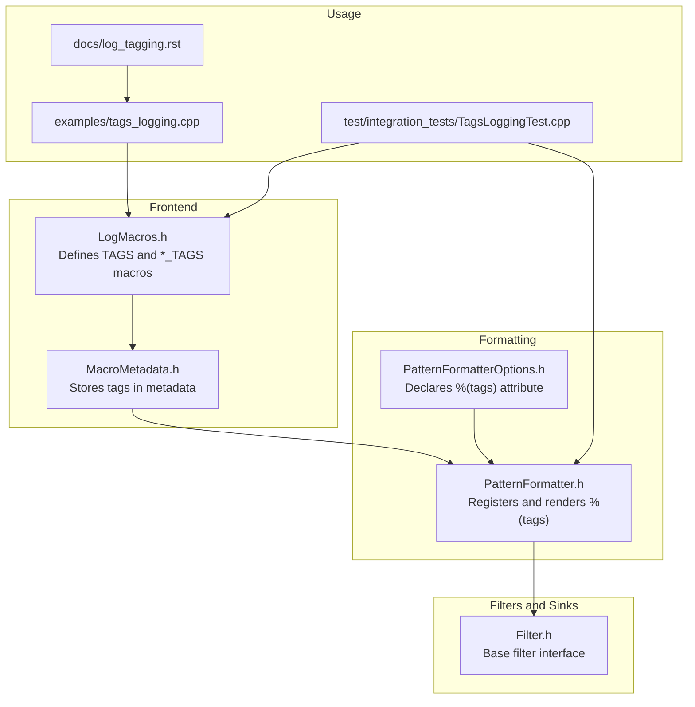
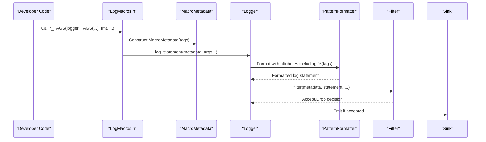
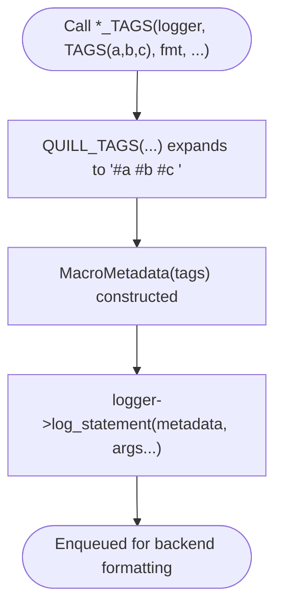
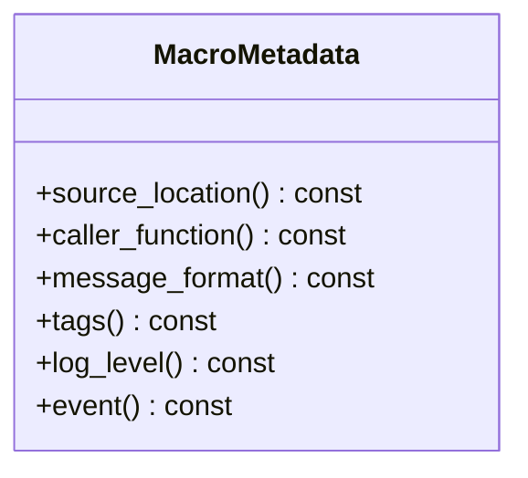
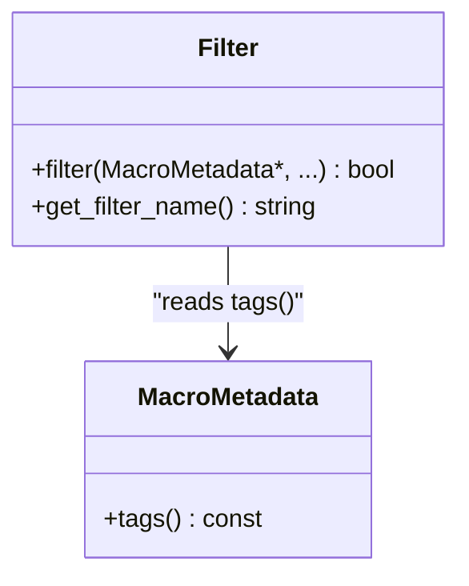
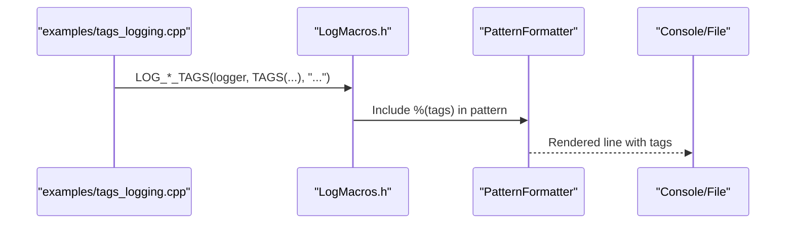
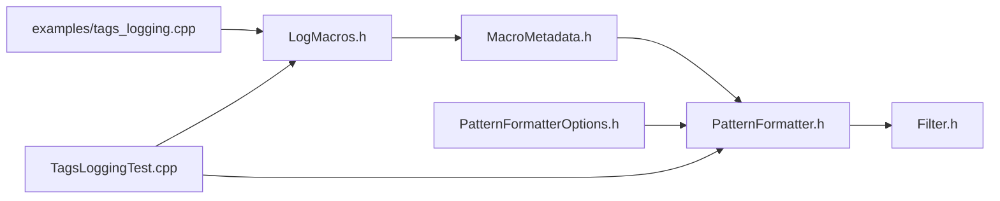

# Tag-Based Logging

<cite>
**Referenced Files in This Document**
- [LogMacros.h](file://include/quill/LogMacros.h)
- [MacroMetadata.h](file://include/quill/core/MacroMetadata.h)
- [PatternFormatterOptions.h](file://include/quill/core/PatternFormatterOptions.h)
- [PatternFormatter.h](file://include/quill/backend/PatternFormatter.h)
- [Filter.h](file://include/quill/filters/Filter.h)
- [tags_logging.cpp](file://examples/tags_logging.cpp)
- [TagsLoggingTest.cpp](file://test/integration_tests/TagsLoggingTest.cpp)
- [log_tagging.rst](file://docs/log_tagging.rst)
</cite>

## Table of Contents
1. [Introduction](#introduction)
2. [Project Structure](#project-structure)
3. [Core Components](#core-components)
4. [Architecture Overview](#architecture-overview)
5. [Detailed Component Analysis](#detailed-component-analysis)
6. [Dependency Analysis](#dependency-analysis)
7. [Performance Considerations](#performance-considerations)
8. [Troubleshooting Guide](#troubleshooting-guide)
9. [Conclusion](#conclusion)
10. [Appendices](#appendices)

## Introduction
This document explains Quill’s tag-based logging capability. Tags are compile-time, hashtag-style keywords embedded into log messages via dedicated macros. They enable categorization and filtering beyond traditional log levels, allowing efficient search, monitoring, and routing of log events. Tags are stored in the logging metadata and can be rendered in formatted output and consumed by filters and sinks.

## Project Structure
Quill’s tag support spans several layers:
- Macros and metadata capture tags at compile time
- Pattern formatter exposes a %(tags) attribute for rendering
- Filters can inspect metadata (including tags) to decide whether to accept or reject a log statement
- Tests and examples demonstrate usage and expected output



**Diagram sources**
- [LogMacros.h:268-296](file://include/quill/LogMacros.h#L268-L296)
- [MacroMetadata.h:22-82](file://include/quill/core/MacroMetadata.h#L22-L82)
- [PatternFormatterOptions.h:63-64](file://include/quill/core/PatternFormatterOptions.h#L63-L64)
- [PatternFormatter.h:251-261](file://include/quill/backend/PatternFormatter.h#L251-L261)
- [Filter.h:26-57](file://include/quill/filters/Filter.h#L26-L57)
- [tags_logging.cpp:13-15](file://examples/tags_logging.cpp#L13-L15)
- [TagsLoggingTest.cpp:24-26](file://test/integration_tests/TagsLoggingTest.cpp#L24-L26)
- [log_tagging.rst:1-33](file://docs/log_tagging.rst#L1-L33)

**Section sources**
- [LogMacros.h:268-296](file://include/quill/LogMacros.h#L268-L296)
- [MacroMetadata.h:22-82](file://include/quill/core/MacroMetadata.h#L22-L82)
- [PatternFormatterOptions.h:63-64](file://include/quill/core/PatternFormatterOptions.h#L63-L64)
- [PatternFormatter.h:251-261](file://include/quill/backend/PatternFormatter.h#L251-L261)
- [Filter.h:26-57](file://include/quill/filters/Filter.h#L26-L57)
- [tags_logging.cpp:13-15](file://examples/tags_logging.cpp#L13-L15)
- [TagsLoggingTest.cpp:24-26](file://test/integration_tests/TagsLoggingTest.cpp#L24-L26)
- [log_tagging.rst:1-33](file://docs/log_tagging.rst#L1-L33)

## Core Components
- Tag macros and generation
  - The TAGS macro expands to a space-delimited sequence of hashtag-prefixed identifiers. Up to six tags can be provided in a single call, though the primary implementation targets up to five tags per macro invocation.
  - The *_TAGS family of logging macros passes the generated tag string to the logging pipeline alongside the message.

- Metadata storage
  - MacroMetadata captures the tag string pointer and makes it available to downstream components.

- Rendering and formatting
  - PatternFormatterOptions declares the %(tags) attribute.
  - PatternFormatter registers and renders the %(tags) attribute during formatting.

- Filtering and sinks
  - Filters receive MacroMetadata and can examine the tag string to decide whether to accept or drop a log statement.
  - Sinks can further process or route logs based on tag content.

**Section sources**
- [LogMacros.h:268-296](file://include/quill/LogMacros.h#L268-L296)
- [LogMacros.h:300-314](file://include/quill/LogMacros.h#L300-L314)
- [MacroMetadata.h:40-50](file://include/quill/core/MacroMetadata.h#L40-L50)
- [MacroMetadata.h](file://include/quill/core/MacroMetadata.h#L82)
- [PatternFormatterOptions.h:63-64](file://include/quill/core/PatternFormatterOptions.h#L63-L64)
- [PatternFormatter.h:251-261](file://include/quill/backend/PatternFormatter.h#L251-L261)
- [Filter.h:54-57](file://include/quill/filters/Filter.h#L54-L57)

## Architecture Overview
The tag lifecycle:
1. Developer writes a log statement using *_TAGS macros with TAGS(...).
2. The macro expands to a tag string and constructs MacroMetadata with the tag pointer.
3. The logger enqueues the statement; the backend formats it.
4. PatternFormatter renders the %(tags) attribute using the tag string from metadata.
5. Filters and sinks can inspect the tag string to apply additional logic.



**Diagram sources**
- [LogMacros.h:300-314](file://include/quill/LogMacros.h#L300-L314)
- [MacroMetadata.h:40-50](file://include/quill/core/MacroMetadata.h#L40-L50)
- [PatternFormatter.h:469-479](file://include/quill/backend/PatternFormatter.h#L469-L479)
- [Filter.h:54-57](file://include/quill/filters/Filter.h#L54-L57)

## Detailed Component Analysis

### Tag Generation and Macros
- Tag generation
  - QUILL_TAGS(...) composes a tag list by prepending “#” to each identifier and inserting spaces. The implementation selects a generator based on the number of arguments, supporting up to six arguments in the selection logic, with visible generators for up to five tags.
- Macro families
  - *_TAGS macros (e.g., LOG_INFO_TAGS, LOG_ERROR_TAGS) forward the tag string to the logging call path, enabling compile-time filtering and formatting.



**Diagram sources**
- [LogMacros.h:268-296](file://include/quill/LogMacros.h#L268-L296)
- [LogMacros.h:300-314](file://include/quill/LogMacros.h#L300-L314)

**Section sources**
- [LogMacros.h:268-296](file://include/quill/LogMacros.h#L268-L296)
- [LogMacros.h:384-418](file://include/quill/LogMacros.h#L384-L418)
- [LogMacros.h:566-600](file://include/quill/LogMacros.h#L566-L600)
- [LogMacros.h:626-660](file://include/quill/LogMacros.h#L626-L660)
- [LogMacros.h:746-780](file://include/quill/LogMacros.h#L746-L780)
- [LogMacros.h:806-840](file://include/quill/LogMacros.h#L806-L840)
- [LogMacros.h:867-901](file://include/quill/LogMacros.h#L867-L901)

### Metadata Storage and Access
- MacroMetadata stores the tag pointer and exposes it via tags().
- This pointer is passed through the formatting and filtering stages.



**Diagram sources**
- [MacroMetadata.h:22-82](file://include/quill/core/MacroMetadata.h#L22-L82)

**Section sources**
- [MacroMetadata.h:40-50](file://include/quill/core/MacroMetadata.h#L40-L50)
- [MacroMetadata.h](file://include/quill/core/MacroMetadata.h#L82)

### Formatting and Rendering (%(tags))
- PatternFormatterOptions documents %(tags) as a supported attribute.
- PatternFormatter registers the Tags attribute and participates in the formatting pipeline.

```mermaid
sequenceDiagram
participant PF as "PatternFormatter"
participant OPT as "PatternFormatterOptions"
participant MD as "MacroMetadata"
OPT-->>PF : format_pattern with %(tags)
PF->>MD : tags()
PF-->>PF : Replace %(tags) with tag string
PF-->>OPT : Final formatted line
```

**Diagram sources**
- [PatternFormatterOptions.h:63-64](file://include/quill/core/PatternFormatterOptions.h#L63-L64)
- [PatternFormatter.h:251-261](file://include/quill/backend/PatternFormatter.h#L251-L261)
- [PatternFormatter.h:469-479](file://include/quill/backend/PatternFormatter.h#L469-L479)

**Section sources**
- [PatternFormatterOptions.h:63-64](file://include/quill/core/PatternFormatterOptions.h#L63-L64)
- [PatternFormatter.h:251-261](file://include/quill/backend/PatternFormatter.h#L251-L261)
- [PatternFormatter.h:469-479](file://include/quill/backend/PatternFormatter.h#L469-L479)

### Filtering and Sink Integration
- Filter::filter receives MacroMetadata and can inspect tags to decide acceptance.
- Sinks can implement tag-aware behavior by accessing the formatted statement or metadata.



**Diagram sources**
- [Filter.h:26-57](file://include/quill/filters/Filter.h#L26-L57)
- [MacroMetadata.h](file://include/quill/core/MacroMetadata.h#L82)

**Section sources**
- [Filter.h:54-57](file://include/quill/filters/Filter.h#L54-L57)
- [MacroMetadata.h](file://include/quill/core/MacroMetadata.h#L82)

### Practical Examples and Expected Behavior
- Example usage demonstrates compile-time tag composition and rendering.
- Integration tests verify tag presence across multiple log levels and confirm formatting.



**Diagram sources**
- [tags_logging.cpp:36-41](file://examples/tags_logging.cpp#L36-L41)
- [TagsLoggingTest.cpp:43-47](file://test/integration_tests/TagsLoggingTest.cpp#L43-L47)
- [TagsLoggingTest.cpp:51-85](file://test/integration_tests/TagsLoggingTest.cpp#L51-L85)

**Section sources**
- [log_tagging.rst:12-24](file://docs/log_tagging.rst#L12-L24)
- [tags_logging.cpp:13-15](file://examples/tags_logging.cpp#L13-L15)
- [tags_logging.cpp:29-34](file://examples/tags_logging.cpp#L29-L34)
- [tags_logging.cpp:36-41](file://examples/tags_logging.cpp#L36-L41)
- [TagsLoggingTest.cpp:43-47](file://test/integration_tests/TagsLoggingTest.cpp#L43-L47)
- [TagsLoggingTest.cpp:51-85](file://test/integration_tests/TagsLoggingTest.cpp#L51-L85)

## Dependency Analysis
- MacroMetadata depends on the tag string pointer supplied by the macros.
- PatternFormatter depends on MacroMetadata::tags() and PatternFormatterOptions to render %(tags).
- Filters depend on MacroMetadata to evaluate tag content.
- Tests and examples depend on the macros and formatting pipeline.



**Diagram sources**
- [LogMacros.h:300-314](file://include/quill/LogMacros.h#L300-L314)
- [MacroMetadata.h:40-50](file://include/quill/core/MacroMetadata.h#L40-L50)
- [PatternFormatter.h:251-261](file://include/quill/backend/PatternFormatter.h#L251-L261)
- [PatternFormatterOptions.h:63-64](file://include/quill/core/PatternFormatterOptions.h#L63-L64)
- [Filter.h:54-57](file://include/quill/filters/Filter.h#L54-L57)
- [tags_logging.cpp:36-41](file://examples/tags_logging.cpp#L36-L41)
- [TagsLoggingTest.cpp:51-85](file://test/integration_tests/TagsLoggingTest.cpp#L51-L85)

**Section sources**
- [LogMacros.h:300-314](file://include/quill/LogMacros.h#L300-L314)
- [MacroMetadata.h:40-50](file://include/quill/core/MacroMetadata.h#L40-L50)
- [PatternFormatterOptions.h:63-64](file://include/quill/core/PatternFormatterOptions.h#L63-L64)
- [PatternFormatter.h:251-261](file://include/quill/backend/PatternFormatter.h#L251-L261)
- [Filter.h:54-57](file://include/quill/filters/Filter.h#L54-L57)
- [tags_logging.cpp:36-41](file://examples/tags_logging.cpp#L36-L41)
- [TagsLoggingTest.cpp:51-85](file://test/integration_tests/TagsLoggingTest.cpp#L51-L85)

## Performance Considerations
- Compile-time tag composition
  - Tags are composed at compile time via macros, avoiding runtime string manipulation for tag assembly. The tag string is stored as a pointer in MacroMetadata, minimizing overhead.
- Zero-cost filtering
  - Quill supports compile-time log level filtering that can eliminate entire logging branches. While tag filtering is evaluated at runtime, the tag string pointer lookup is constant time.
- Formatting cost
  - Rendering tags is a simple string insertion performed by the formatter. The cost is proportional to the length of the tag list and the formatter’s overhead.
- Recommendations for high throughput
  - Keep tag lists concise (preferably one or two tags per message).
  - Avoid dynamic tag generation; rely on preprocessor-defined constants.
  - Use compile-time log level filtering to reduce the volume of messages reaching the formatting stage.
  - Implement lightweight filters that quickly evaluate tag presence without heavy computation.

[No sources needed since this section provides general guidance]

## Troubleshooting Guide
- Tags not appearing in output
  - Ensure the pattern includes %(tags). The documentation emphasizes placing %(tags) immediately before the next attribute without intervening spaces to avoid formatting gaps.
- Unexpected formatting gaps
  - When no tags are present, the formatter still inserts the attribute placeholder. Proper spacing in the pattern prevents extra spaces or gaps.
- Verifying tag presence
  - Integration tests write logs with tags and assert their presence in the formatted output across multiple log levels.

**Section sources**
- [log_tagging.rst:25-33](file://docs/log_tagging.rst#L25-L33)
- [tags_logging.cpp:25-27](file://examples/tags_logging.cpp#L25-L27)
- [TagsLoggingTest.cpp:94-142](file://test/integration_tests/TagsLoggingTest.cpp#L94-L142)

## Conclusion
Quill’s tag-based logging augments traditional log levels with compile-time tag composition and runtime rendering. Tags are embedded in MacroMetadata, rendered via %(tags), and available to filters and sinks for advanced routing and filtering. By combining compile-time log level filtering with tag-aware sinks and filters, applications can achieve flexible, high-performance categorization and observability.

[No sources needed since this section summarizes without analyzing specific files]

## Appendices

### Tag Matching and Filtering Guidance
- Matching model
  - Tags are simple string sequences attached to each log statement. Matching is performed by treating the tag string as a set of tokens separated by whitespace. A filter can check for the presence of specific tokens (e.g., “#featureX”) to accept or reject a statement.
- Wildcards and hierarchy
  - There is no built-in wildcard or hierarchical matching in the provided code. Implement hierarchy using structured tag names (e.g., “#area.component”) and match against substrings or prefixes in custom filters.
- Practical patterns
  - Application-wide tags: e.g., “#prod”, “#audit”
  - Feature-specific tags: e.g., “#billing”, “#notifications”
  - Environment tags: e.g., “#dev”, “#staging”, “#prod”
  - Component categorization: e.g., “#web”, “#worker”, “#cache”

[No sources needed since this section provides general guidance]