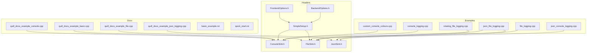
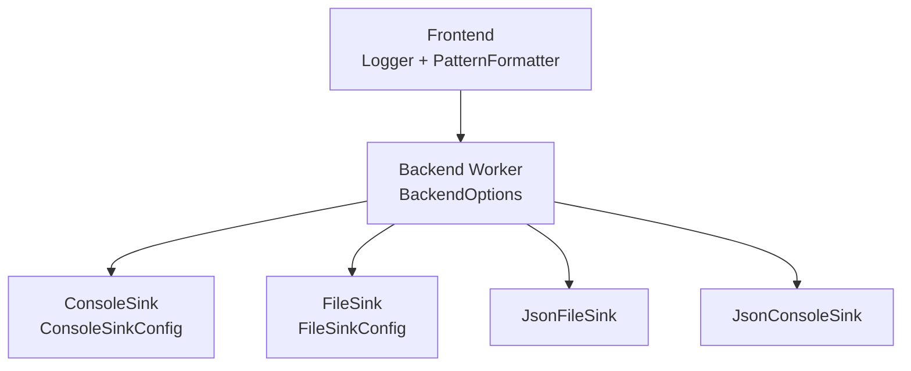
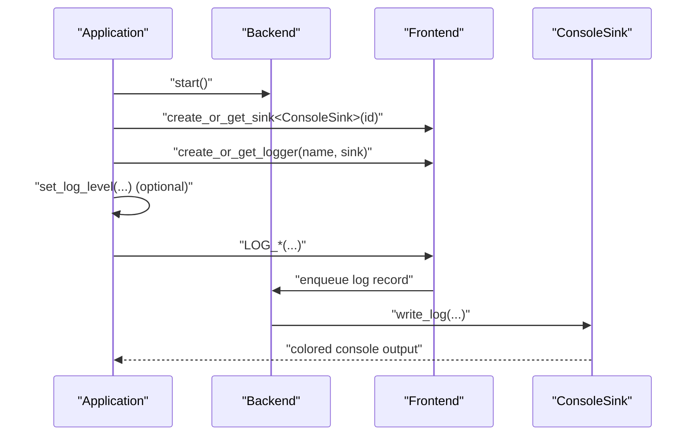
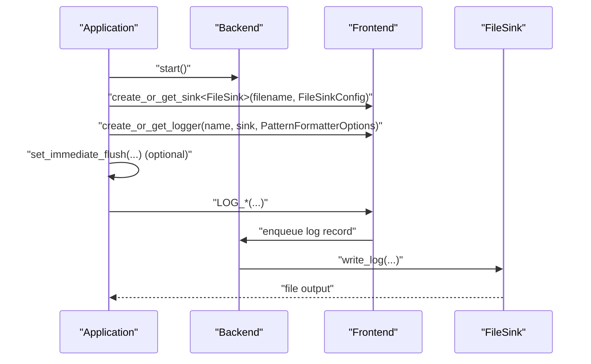
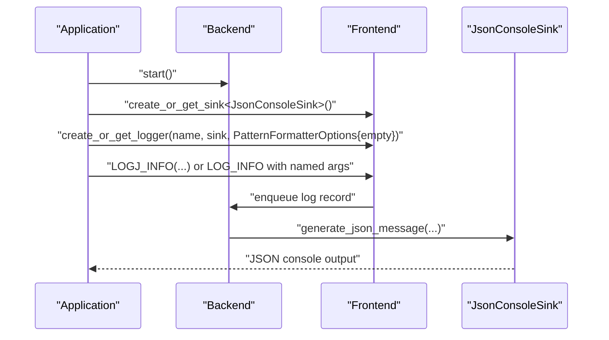
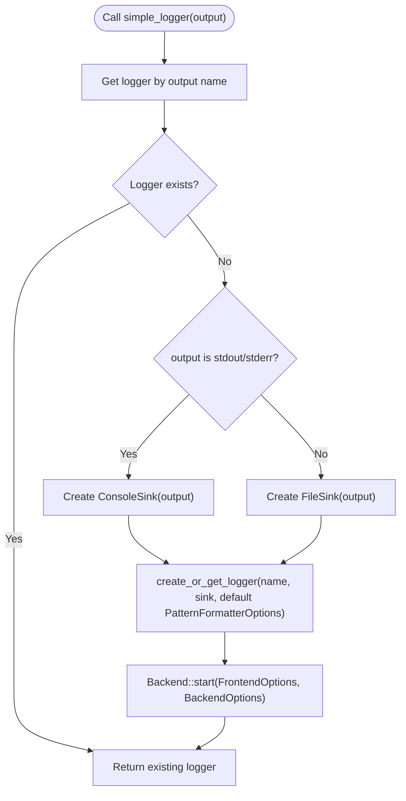
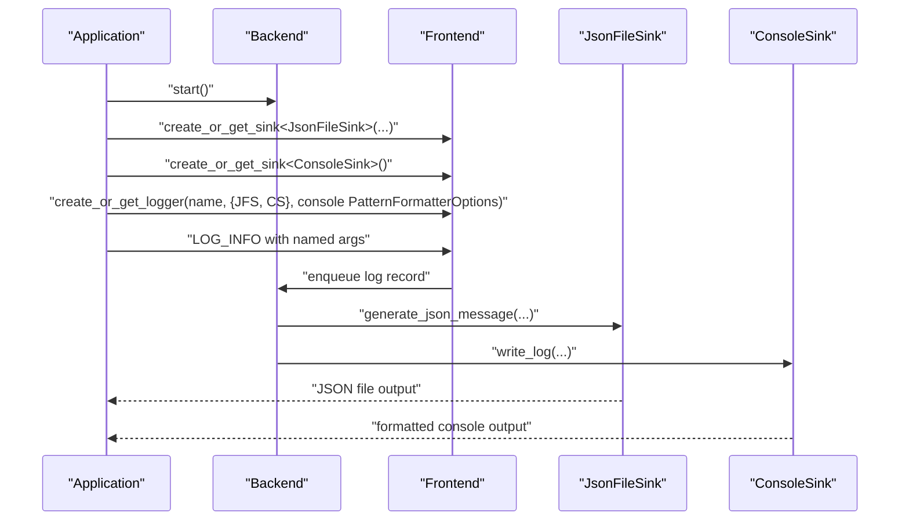
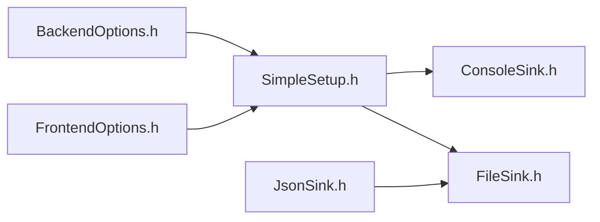

# Basic Setup Examples

<cite>
**Referenced Files in This Document**
- [SimpleSetup.h](file://include/quill/SimpleSetup.h)
- [console_logging.cpp](file://examples/console_logging.cpp)
- [file_logging.cpp](file://examples/file_logging.cpp)
- [json_console_logging.cpp](file://examples/json_console_logging.cpp)
- [custom_console_colours.cpp](file://examples/custom_console_colours.cpp)
- [rotating_file_logging.cpp](file://examples/rotating_file_logging.cpp)
- [json_file_logging.cpp](file://examples/json_file_logging.cpp)
- [ConsoleSink.h](file://include/quill/sinks/ConsoleSink.h)
- [FileSink.h](file://include/quill/sinks/FileSink.h)
- [JsonSink.h](file://include/quill/sinks/JsonSink.h)
- [BackendOptions.h](file://include/quill/backend/BackendOptions.h)
- [FrontendOptions.h](file://include/quill/core/FrontendOptions.h)
- [quill_docs_example_basic.cpp](file://docs/examples/quill_docs_example_basic.cpp)
- [quill_docs_example_console.cpp](file://docs/examples/quill_docs_example_console.cpp)
- [quill_docs_example_file.cpp](file://docs/examples/quill_docs_example_file.cpp)
- [quill_docs_example_json_logging.cpp](file://docs/examples/quill_docs_example_json_logging.cpp)
- [basic_example.rst](file://docs/basic_example.rst)
- [quick_start.rst](file://docs/quick_start.rst)
</cite>

## Table of Contents
1. [Introduction](#introduction)
2. [Project Structure](#project-structure)
3. [Core Components](#core-components)
4. [Architecture Overview](#architecture-overview)
5. [Detailed Component Analysis](#detailed-component-analysis)
6. [Dependency Analysis](#dependency-analysis)
7. [Performance Considerations](#performance-considerations)
8. [Troubleshooting Guide](#troubleshooting-guide)
9. [Conclusion](#conclusion)
10. [Appendices](#appendices)

## Introduction
This document provides practical, runnable examples for basic Quill setup scenarios. It covers:
- Console logging with colored output
- File logging with basic configuration
- JSON console logging for structured output
- The simple_logger() convenience function and its limitations
- Backend startup, sink configuration, and basic formatter setup
- Essential configuration options such as log level filtering, timestamp formatting, and output destinations
- Beginner-friendly troubleshooting and migration paths from simple to advanced configuration

## Project Structure
The repository organizes examples and documentation to illustrate typical logging setups:
- Examples demonstrate console, file, JSON, and rotating configurations
- Headers define sinks, backend/frontend options, and convenience setup helpers
- Documentation includes quick-start and basic example references

**Diagram sources**
- [console_logging.cpp:1-72](file://examples/console_logging.cpp#L1-L72)
- [file_logging.cpp:1-73](file://examples/file_logging.cpp#L1-L73)
- [json_console_logging.cpp:1-54](file://examples/json_console_logging.cpp#L1-L54)
- [custom_console_colours.cpp:1-48](file://examples/custom_console_colours.cpp#L1-L48)
- [rotating_file_logging.cpp:1-45](file://examples/rotating_file_logging.cpp#L1-L45)
- [json_file_logging.cpp:1-74](file://examples/json_file_logging.cpp#L1-L74)
- [SimpleSetup.h:1-74](file://include/quill/SimpleSetup.h#L1-L74)
- [ConsoleSink.h:1-412](file://include/quill/sinks/ConsoleSink.h#L1-L412)
- [FileSink.h:1-527](file://include/quill/sinks/FileSink.h#L1-L527)
- [JsonSink.h:1-165](file://include/quill/sinks/JsonSink.h#L1-L165)
- [BackendOptions.h:1-283](file://include/quill/backend/BackendOptions.h#L1-L283)
- [FrontendOptions.h:1-52](file://include/quill/core/FrontendOptions.h#L1-L52)
- [quill_docs_example_basic.cpp:1-15](file://docs/examples/quill_docs_example_basic.cpp#L1-L15)
- [quill_docs_example_console.cpp:1-49](file://docs/examples/quill_docs_example_console.cpp#L1-L49)
- [quill_docs_example_file.cpp:1-29](file://docs/examples/quill_docs_example_file.cpp#L1-L29)
- [quill_docs_example_json_logging.cpp:1-36](file://docs/examples/quill_docs_example_json_logging.cpp#L1-L36)

**Section sources**
- [basic_example.rst:1-22](file://docs/basic_example.rst#L1-L22)
- [quick_start.rst:1-54](file://docs/quick_start.rst#L1-L54)

## Core Components
- Backend and Frontend: The backend runs in a dedicated thread and consumes formatted log records from frontend queues. Frontend captures log metadata and arguments and enqueues them for asynchronous processing.
- Sinks: Output destinations such as ConsoleSink, FileSink, JsonFileSink, and JsonConsoleSink.
- Formatters: PatternFormatterOptions controls log message formatting, timestamp patterns, and timezone.
- Convenience setup: simple_logger() initializes a logger with a sink and starts the backend for trivial programs.

Key references:
- BackendOptions and FrontendOptions define runtime and queue behavior.
- ConsoleSink/FileSink/JsonSink configure output streams, colors, buffering, and formatting overrides.
- SimpleSetup.h provides a shortcut for console or file logging.

**Section sources**
- [BackendOptions.h:30-283](file://include/quill/backend/BackendOptions.h#L30-L283)
- [FrontendOptions.h:16-52](file://include/quill/core/FrontendOptions.h#L16-L52)
- [ConsoleSink.h:44-328](file://include/quill/sinks/ConsoleSink.h#L44-L328)
- [FileSink.h:64-220](file://include/quill/sinks/FileSink.h#L64-L220)
- [JsonSink.h:29-165](file://include/quill/sinks/JsonSink.h#L29-L165)
- [SimpleSetup.h:22-72](file://include/quill/SimpleSetup.h#L22-L72)

## Architecture Overview
The logging pipeline:
- Frontend: Captures log statements and enqueues them
- Backend: Consumes, formats, and writes to sinks
- Sinks: Output to console or files (plain or JSON)

**Diagram sources**
- [BackendOptions.h:30-283](file://include/quill/backend/BackendOptions.h#L30-L283)
- [ConsoleSink.h:331-410](file://include/quill/sinks/ConsoleSink.h#L331-L410)
- [FileSink.h:226-521](file://include/quill/sinks/FileSink.h#L226-L521)
- [JsonSink.h:140-162](file://include/quill/sinks/JsonSink.h#L140-L162)

## Detailed Component Analysis

### Console Logging with Colored Output
Goal: Minimal console logging with colored terminal output.

Steps:
1. Start the backend with default options.
2. Create a ConsoleSink with a unique sink identifier.
3. Create a Logger bound to the sink.
4. Optionally adjust log level and enable colored output.

Example references:
- [console_logging.cpp:20-41](file://examples/console_logging.cpp#L20-L41)
- [quill_docs_example_console.cpp:12-31](file://docs/examples/quill_docs_example_console.cpp#L12-L31)
- [custom_console_colours.cpp:14-34](file://examples/custom_console_colours.cpp#L14-L34)

**Diagram sources**
- [console_logging.cpp:20-41](file://examples/console_logging.cpp#L20-L41)
- [quill_docs_example_console.cpp:12-31](file://docs/examples/quill_docs_example_console.cpp#L12-L31)
- [ConsoleSink.h:331-410](file://include/quill/sinks/ConsoleSink.h#L331-L410)

**Section sources**
- [console_logging.cpp:20-41](file://examples/console_logging.cpp#L20-L41)
- [quill_docs_example_console.cpp:12-31](file://docs/examples/quill_docs_example_console.cpp#L12-L31)
- [ConsoleSink.h:44-328](file://include/quill/sinks/ConsoleSink.h#L44-L328)

### File Logging with Basic Configuration
Goal: Write logs to a file with a basic pattern and optional immediate flush for development.

Steps:
1. Start the backend.
2. Create a FileSink with a filename and optional FileSinkConfig (open mode, filename append).
3. Create a Logger with a PatternFormatterOptions for timestamp and timezone.
4. Optionally enable immediate flush for synchronous-like behavior during development.

Example references:
- [file_logging.cpp:29-66](file://examples/file_logging.cpp#L29-L66)
- [quill_docs_example_file.cpp:9-29](file://docs/examples/quill_docs_example_file.cpp#L9-L29)

**Diagram sources**
- [file_logging.cpp:29-66](file://examples/file_logging.cpp#L29-L66)
- [FileSink.h:226-521](file://include/quill/sinks/FileSink.h#L226-L521)

**Section sources**
- [file_logging.cpp:29-66](file://examples/file_logging.cpp#L29-L66)
- [quill_docs_example_file.cpp:9-29](file://docs/examples/quill_docs_example_file.cpp#L9-L29)
- [FileSink.h:64-220](file://include/quill/sinks/FileSink.h#L64-L220)

### JSON Console Logging for Structured Output
Goal: Emit JSON logs to the console with optional convenience macros.

Steps:
1. Start the backend.
2. Create a JsonConsoleSink.
3. Create a Logger with an empty pattern to avoid redundant formatting overhead.
4. Use LOGJ_INFO or LOG_INFO with named placeholders for structured output.

Example references:
- [json_console_logging.cpp:9-34](file://examples/json_console_logging.cpp#L9-L34)
- [quill_docs_example_json_logging.cpp:8-36](file://docs/examples/quill_docs_example_json_logging.cpp#L8-L36)

**Diagram sources**
- [json_console_logging.cpp:9-34](file://examples/json_console_logging.cpp#L9-L34)
- [JsonSink.h:137-162](file://include/quill/sinks/JsonSink.h#L137-L162)

**Section sources**
- [json_console_logging.cpp:9-34](file://examples/json_console_logging.cpp#L9-L34)
- [quill_docs_example_json_logging.cpp:8-36](file://docs/examples/quill_docs_example_json_logging.cpp#L8-L36)
- [JsonSink.h:29-165](file://include/quill/sinks/JsonSink.h#L29-L165)

### Using simple_logger() Convenience Function
Goal: Quick-start with minimal boilerplate for console or file logging.

Behavior:
- Creates or retrieves a logger by name.
- Chooses ConsoleSink for "stdout"/"stderr" or FileSink for a filename.
- Applies a default PatternFormatterOptions.
- Starts the backend automatically.

Limitations:
- Fixed default formatter pattern.
- Limited customization without additional steps.
- Best for trivial programs; advanced users should configure sinks and formatters explicitly.

Example references:
- [SimpleSetup.h:22-72](file://include/quill/SimpleSetup.h#L22-L72)
- [quill_docs_example_basic.cpp:7-15](file://docs/examples/quill_docs_example_basic.cpp#L7-L15)

**Diagram sources**
- [SimpleSetup.h:46-72](file://include/quill/SimpleSetup.h#L46-L72)

**Section sources**
- [SimpleSetup.h:22-72](file://include/quill/SimpleSetup.h#L22-L72)
- [quill_docs_example_basic.cpp:7-15](file://docs/examples/quill_docs_example_basic.cpp#L7-L15)

### Advanced Example: Hybrid JSON and Console Logging
Goal: Log both structured JSON and readable console output simultaneously.

Steps:
1. Create a JsonFileSink for JSON logs.
2. Create a ConsoleSink for readable logs.
3. Create a Logger with both sinks and a custom console formatter that includes named arguments.

Example references:
- [json_file_logging.cpp:19-73](file://examples/json_file_logging.cpp#L19-L73)

**Diagram sources**
- [json_file_logging.cpp:19-73](file://examples/json_file_logging.cpp#L19-L73)
- [JsonSink.h:140-162](file://include/quill/sinks/JsonSink.h#L140-L162)
- [ConsoleSink.h:331-410](file://include/quill/sinks/ConsoleSink.h#L331-L410)

**Section sources**
- [json_file_logging.cpp:19-73](file://examples/json_file_logging.cpp#L19-L73)
- [JsonSink.h:137-165](file://include/quill/sinks/JsonSink.h#L137-L165)
- [ConsoleSink.h:331-410](file://include/quill/sinks/ConsoleSink.h#L331-L410)

### Essential Configuration Options
- Log level filtering: Adjust logger log level to control verbosity.
- Timestamp formatting: Configure timestamp pattern and timezone via PatternFormatterOptions.
- Output destinations: ConsoleSink for stdout/stderr, FileSink for files, JsonFileSink/JsonConsoleSink for structured logs.
- Buffering and flushing: FileSink supports buffered writes and optional fsync intervals; immediate flush can be enabled for development.
- Color output: ConsoleSink supports color modes and per-log-level color assignment.

References:
- [ConsoleSink.h:44-328](file://include/quill/sinks/ConsoleSink.h#L44-L328)
- [FileSink.h:64-220](file://include/quill/sinks/FileSink.h#L64-L220)
- [JsonSink.h:29-165](file://include/quill/sinks/JsonSink.h#L29-L165)
- [BackendOptions.h:132-224](file://include/quill/backend/BackendOptions.h#L132-L224)

**Section sources**
- [ConsoleSink.h:44-328](file://include/quill/sinks/ConsoleSink.h#L44-L328)
- [FileSink.h:64-220](file://include/quill/sinks/FileSink.h#L64-L220)
- [JsonSink.h:29-165](file://include/quill/sinks/JsonSink.h#L29-L165)
- [BackendOptions.h:132-224](file://include/quill/backend/BackendOptions.h#L132-L224)

## Dependency Analysis
High-level dependencies among core components:

**Diagram sources**
- [SimpleSetup.h:9-18](file://include/quill/SimpleSetup.h#L9-L18)
- [ConsoleSink.h:1-20](file://include/quill/sinks/ConsoleSink.h#L1-L20)
- [FileSink.h:1-26](file://include/quill/sinks/FileSink.h#L1-L26)
- [JsonSink.h:1-25](file://include/quill/sinks/JsonSink.h#L1-L25)
- [BackendOptions.h:23-27](file://include/quill/backend/BackendOptions.h#L23-L27)
- [FrontendOptions.h:14-20](file://include/quill/core/FrontendOptions.h#L14-L20)

**Section sources**
- [SimpleSetup.h:9-18](file://include/quill/SimpleSetup.h#L9-L18)
- [ConsoleSink.h:1-20](file://include/quill/sinks/ConsoleSink.h#L1-L20)
- [FileSink.h:1-26](file://include/quill/sinks/FileSink.h#L1-L26)
- [JsonSink.h:1-25](file://include/quill/sinks/JsonSink.h#L1-L25)
- [BackendOptions.h:23-27](file://include/quill/backend/BackendOptions.h#L23-L27)
- [FrontendOptions.h:14-20](file://include/quill/core/FrontendOptions.h#L14-L20)

## Performance Considerations
- Prefer asynchronous logging: The backend handles formatting and I/O off the caller thread.
- Tune queue behavior: FrontendOptions controls queue types and capacities.
- Control flush frequency: BackendOptions allows configuring sink flush intervals and graceful shutdown behavior.
- Disable unnecessary formatting: For pure JSON sinks, use an empty pattern to avoid redundant formatting overhead.
- Immediate flush: Only for development; it blocks callers and reduces throughput.

[No sources needed since this section provides general guidance]

## Troubleshooting Guide
Common beginner mistakes and fixes:
- Forgetting to start the backend: Always call the backend start routine before logging.
  - Reference: [basic_example.rst:18-22](file://docs/basic_example.rst#L18-L22)
- Incorrect sink naming: Each sink and logger must have unique names for retrieval.
  - Reference: [basic_example.rst:10-16](file://docs/basic_example.rst#L10-L16)
- File open failures: FileSink retries opening with delays; ensure permissions and paths are valid.
  - Reference: [FileSink.h:362-439](file://include/quill/sinks/FileSink.h#L362-L439)
- JSON newline handling: JSON sinks sanitize newlines in messages to maintain valid JSON.
  - Reference: [JsonSink.h:66-80](file://include/quill/sinks/JsonSink.h#L66-L80)
- Colored output not appearing: ConsoleSink color detection depends on terminal capabilities and environment; use automatic or explicit color mode.
  - Reference: [ConsoleSink.h:154-249](file://include/quill/sinks/ConsoleSink.h#L154-L249)

**Section sources**
- [basic_example.rst:10-22](file://docs/basic_example.rst#L10-L22)
- [FileSink.h:362-439](file://include/quill/sinks/FileSink.h#L362-L439)
- [JsonSink.h:66-80](file://include/quill/sinks/JsonSink.h#L66-L80)
- [ConsoleSink.h:154-249](file://include/quill/sinks/ConsoleSink.h#L154-L249)

## Conclusion
These examples demonstrate how to quickly set up Quill for common scenarios:
- Use simple_logger() for minimal console or file logging
- Configure sinks and formatters explicitly for advanced control
- Apply log level filtering, timestamp formatting, and output destinations
- Migrate from simple to advanced setups by replacing convenience calls with explicit sink and logger construction

[No sources needed since this section summarizes without analyzing specific files]

## Appendices

### Step-by-Step Tutorials

- Console logging with colored output
  - Start backend
  - Create ConsoleSink with a unique sink id
  - Create Logger bound to the sink
  - Adjust log level if needed
  - References:
    - [console_logging.cpp:20-41](file://examples/console_logging.cpp#L20-L41)
    - [quill_docs_example_console.cpp:12-31](file://docs/examples/quill_docs_example_console.cpp#L12-L31)
    - [custom_console_colours.cpp:14-34](file://examples/custom_console_colours.cpp#L14-L34)

- File logging with basic configuration
  - Start backend
  - Create FileSink with filename and optional FileSinkConfig
  - Create Logger with PatternFormatterOptions for timestamp and timezone
  - Optional: enable immediate flush for development
  - References:
    - [file_logging.cpp:29-66](file://examples/file_logging.cpp#L29-L66)
    - [quill_docs_example_file.cpp:9-29](file://docs/examples/quill_docs_example_file.cpp#L9-L29)

- JSON console logging for structured output
  - Start backend
  - Create JsonConsoleSink
  - Create Logger with empty pattern
  - Use LOGJ_INFO or LOG_INFO with named placeholders
  - References:
    - [json_console_logging.cpp:9-34](file://examples/json_console_logging.cpp#L9-L34)
    - [quill_docs_example_json_logging.cpp:8-36](file://docs/examples/quill_docs_example_json_logging.cpp#L8-L36)

- Using simple_logger()
  - Call simple_logger() with "stdout", "stderr", or a filename
  - Returns a ready-to-use logger
  - Limitations: fixed formatter and limited customization
  - References:
    - [SimpleSetup.h:22-72](file://include/quill/SimpleSetup.h#L22-L72)
    - [quill_docs_example_basic.cpp:7-15](file://docs/examples/quill_docs_example_basic.cpp#L7-L15)

### Migration Paths
- From simple_logger() to explicit setup:
  - Replace simple_logger() with explicit Frontend::create_or_get_sink and Frontend::create_or_get_logger
  - Customize PatternFormatterOptions and sink-specific configs
  - References:
    - [SimpleSetup.h:46-72](file://include/quill/SimpleSetup.h#L46-L72)
    - [ConsoleSink.h:331-410](file://include/quill/sinks/ConsoleSink.h#L331-L410)
    - [FileSink.h:226-521](file://include/quill/sinks/FileSink.h#L226-L521)
    - [JsonSink.h:140-162](file://include/quill/sinks/JsonSink.h#L140-L162)

- Adding rotating files:
  - Use RotatingFileSink with rotation policies (daily or size-based)
  - References:
    - [rotating_file_logging.cpp:14-44](file://examples/rotating_file_logging.cpp#L14-L44)
    - [FileSink.h:53-105](file://include/quill/sinks/FileSink.h#L53-L105)