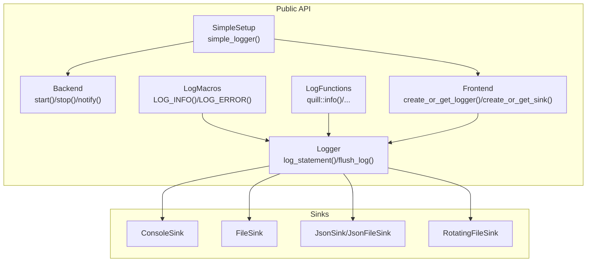
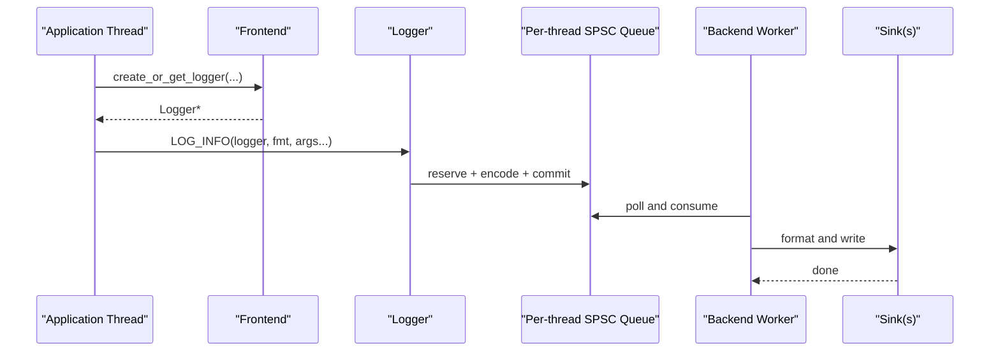
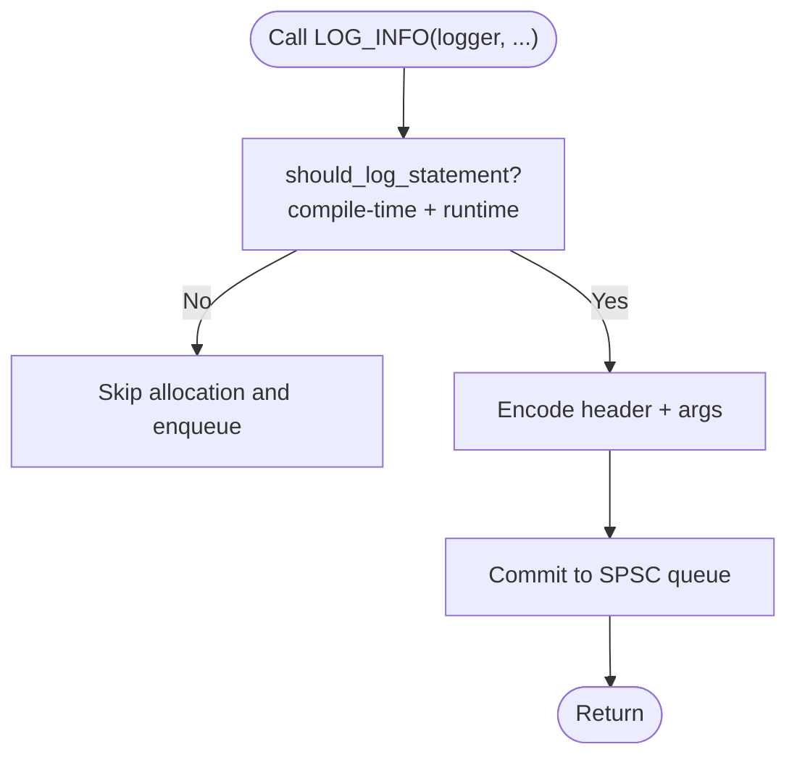
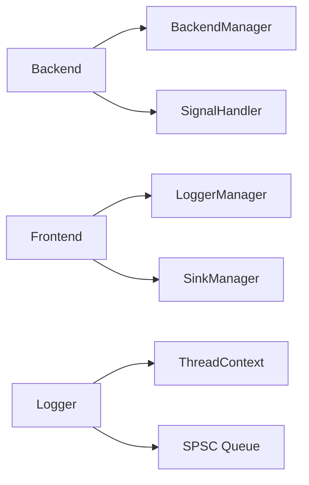

# Basic Usage

<cite>
**Referenced Files in This Document**
- [README.md](file://README.md)
- [SimpleSetup.h](file://include/quill/SimpleSetup.h)
- [Backend.h](file://include/quill/Backend.h)
- [Frontend.h](file://include/quill/Frontend.h)
- [Logger.h](file://include/quill/Logger.h)
- [LogMacros.h](file://include/quill/LogMacros.h)
- [LogFunctions.h](file://include/quill/LogFunctions.h)
- [LogLevel.h](file://include/quill/core/LogLevel.h)
- [console_logging.cpp](file://examples/console_logging.cpp)
- [file_logging.cpp](file://examples/file_logging.cpp)
- [json_console_logging.cpp](file://examples/json_console_logging.cpp)
- [json_file_logging.cpp](file://examples/json_file_logging.cpp)
- [rotating_file_logging.cpp](file://examples/rotating_file_logging.cpp)
- [console_logging_macro_free.cpp](file://examples/console_logging_macro_free.cpp)
- [custom_console_colours.cpp](file://examples/custom_console_colours.cpp)
- [sink_formatter_override.cpp](file://examples/sink_formatter_override.cpp)
</cite>

## Table of Contents
1. [Introduction](#introduction)
2. [Project Structure](#project-structure)
3. [Core Components](#core-components)
4. [Architecture Overview](#architecture-overview)
5. [Detailed Component Analysis](#detailed-component-analysis)
6. [Dependency Analysis](#dependency-analysis)
7. [Performance Considerations](#performance-considerations)
8. [Troubleshooting Guide](#troubleshooting-guide)
9. [Conclusion](#conclusion)
10. [Appendices](#appendices)

## Introduction
This guide explains how to use Quill for everyday logging tasks. You will learn how to create and configure loggers, attach sinks for console and file outputs, and emit log messages at standard levels (TRACE to CRITICAL). It covers three main ways to log:
- Logging macros (e.g., LOG_INFO, LOG_ERROR)
- Log functions (e.g., quill::info, quill::error)
- Macro-free mode for maximum performance

You will also learn how to select loggers, use multiple sinks, customize formatters, and manage resources safely across threads.

## Project Structure
Quill exposes a concise public API:
- Backend controls the background thread that performs formatting and I/O.
- Frontend constructs and manages loggers and sinks.
- Logger holds per-thread queues and dispatches messages to sinks.
- Log macros and log functions provide the logging entry points.
- SimpleSetup offers a quick start for console or file logging.

**Diagram sources**
- [Backend.h:36-162](file://include/quill/Backend.h#L36-L162)
- [Frontend.h:148-198](file://include/quill/Frontend.h#L148-L198)
- [Logger.h:75-136](file://include/quill/Logger.h#L75-L136)
- [LogMacros.h:617-674](file://include/quill/LogMacros.h#L617-L674)
- [LogFunctions.h:198-216](file://include/quill/LogFunctions.h#L198-L216)
- [SimpleSetup.h:46-72](file://include/quill/SimpleSetup.h#L46-L72)

**Section sources**
- [README.md:102-190](file://README.md#L102-L190)
- [SimpleSetup.h:46-72](file://include/quill/SimpleSetup.h#L46-L72)

## Core Components
- Backend: Starts/stops the logging thread and coordinates shutdown.
- Frontend: Builds loggers and sinks; manages global registries.
- Logger: Per-thread SPSC queue writer; dispatches to sinks; supports flushing and backtrace.
- Log macros: Compile-time optimized logging with compile-time level filtering.
- Log functions: Macro-free alternatives with runtime metadata.
- LogLevel: Standard levels TRACE L3/L2/L1, DEBUG, INFO, NOTICE, WARNING, ERROR, CRITICAL.

Key capabilities:
- Create or reuse loggers and sinks by name.
- Attach multiple sinks to a single logger.
- Configure formatting patterns and timestamps.
- Limit rate of logs and flush immediately when needed.

**Section sources**
- [Backend.h:36-162](file://include/quill/Backend.h#L36-L162)
- [Frontend.h:148-198](file://include/quill/Frontend.h#L148-L198)
- [Logger.h:75-136](file://include/quill/Logger.h#L75-L136)
- [LogMacros.h:617-674](file://include/quill/LogMacros.h#L617-L674)
- [LogFunctions.h:198-216](file://include/quill/LogFunctions.h#L198-L216)
- [LogLevel.h:22-35](file://include/quill/core/LogLevel.h#L22-L35)

## Architecture Overview
Quill separates concerns between the frontend (caller threads) and the backend (logging thread):
- Frontend pushes encoded log entries into per-thread SPSC queues.
- Backend consumes entries, formats them, and writes to all attached sinks.

**Diagram sources**
- [Frontend.h:148-198](file://include/quill/Frontend.h#L148-L198)
- [Logger.h:75-136](file://include/quill/Logger.h#L75-L136)
- [Backend.h:36-57](file://include/quill/Backend.h#L36-L57)

## Detailed Component Analysis

### Logger Creation and Management
- Create or get a sink by name; reuse sinks across loggers.
- Create or get a logger by name; optionally reuse another logger’s options.
- Optionally set log level and immediate flush behavior.
- Retrieve or remove loggers; remove with blocking variant to ensure cleanup.

Best practices:
- Use Frontend::create_or_get_sink to avoid duplicate file handles.
- Use Frontend::create_or_get_logger to share sinks among components.
- Call Backend::start once at program startup.
- Avoid logging after Backend::stop; prefer std::atexit to flush.

**Section sources**
- [Frontend.h:120-198](file://include/quill/Frontend.h#L120-L198)
- [Frontend.h:233-289](file://include/quill/Frontend.h#L233-L289)
- [Backend.h:36-57](file://include/quill/Backend.h#L36-L57)

### Sinks and Outputs
- ConsoleSink: logs to stdout/stderr with optional colors.
- FileSink: logs to a file with open mode and filename options.
- JsonSink/JsonFileSink: emits structured JSON logs.
- RotatingFileSink: rotates logs by time or size.

Formatting:
- PatternFormatterOptions lets you define timestamp patterns, timezone, and format strings.
- For pure JSON sinks, an empty pattern avoids redundant formatting overhead.

**Section sources**
- [console_logging.cpp:26-31](file://examples/console_logging.cpp#L26-L31)
- [file_logging.cpp:36-55](file://examples/file_logging.cpp#L36-L55)
- [json_console_logging.cpp:18-24](file://examples/json_console_logging.cpp#L18-L24)
- [json_file_logging.cpp:28-42](file://examples/json_file_logging.cpp#L28-L42)
- [rotating_file_logging.cpp:21-38](file://examples/rotating_file_logging.cpp#L21-L38)

### Logging Levels and Trace Levels
Supported levels: TRACE L3, TRACE L2, TRACE L1, DEBUG, INFO, NOTICE, WARNING, ERROR, CRITICAL.

Trace levels:
- LOG_TRACE_L3, LOG_TRACE_L2, LOG_TRACE_L1 provide increasing verbosity.
- Use logger->set_log_level to enable higher verbosity.

**Section sources**
- [LogLevel.h:22-35](file://include/quill/core/LogLevel.h#L22-L35)
- [console_logging.cpp:30-31](file://examples/console_logging.cpp#L30-L31)
- [README.md:489-526](file://README.md#L489-L526)

### Formatting with libfmt Syntax
- Quill uses libfmt for formatting; placeholders like {} and positional arguments are supported.
- PatternFormatterOptions controls timestamp and message layout.

Examples:
- Numeric and floating-point formatting with libfmt syntax.
- Named placeholders for JSON logging.

**Section sources**
- [console_logging.cpp:38-44](file://examples/console_logging.cpp#L38-L44)
- [json_console_logging.cpp:26-33](file://examples/json_console_logging.cpp#L26-L33)
- [json_file_logging.cpp:46-47](file://examples/json_file_logging.cpp#L46-L47)

### Three Main API Approaches

#### 1) Logging Macros (LOG_INFO, LOG_ERROR, etc.)
- Compile-time metadata and fast path.
- Optional compile-time filtering via QUILL_COMPILE_ACTIVE_LOG_LEVEL.
- Rate limiting variants: LOG_INFO_LIMIT, LOG_INFO_LIMIT_EVERY_N.

**Diagram sources**
- [LogMacros.h:306-314](file://include/quill/LogMacros.h#L306-L314)
- [Logger.h:75-136](file://include/quill/Logger.h#L75-L136)

**Section sources**
- [LogMacros.h:617-674](file://include/quill/LogMacros.h#L617-L674)
- [console_logging.cpp:36-57](file://examples/console_logging.cpp#L36-L57)

#### 2) Log Functions (quill::info, quill::error)
- Macro-free alternative; slightly slower due to runtime metadata.
- Suitable when macros are undesirable.

**Section sources**
- [LogFunctions.h:198-216](file://include/quill/LogFunctions.h#L198-L216)
- [console_logging_macro_free.cpp:35-60](file://examples/console_logging_macro_free.cpp#L35-L60)

#### 3) Macro-Free Mode for Maximum Performance
- Use quill::LogFunctions for minimal overhead while avoiding macros.
- Trade-offs: runtime metadata, always-evaluated args, no compile-time removal.

**Section sources**
- [LogFunctions.h:21-48](file://include/quill/LogFunctions.h#L21-L48)

### Logger Selection and Multiple Sinks
- Create multiple sinks and attach them to a single logger to send logs to multiple destinations (e.g., console and JSON file).
- Override formatter per sink by configuring ConsoleSink with a custom PatternFormatterOptions.

**Section sources**
- [sink_formatter_override.cpp:18-33](file://examples/sink_formatter_override.cpp#L18-L33)
- [json_file_logging.cpp:49-64](file://examples/json_file_logging.cpp#L49-L64)

### Practical Examples

#### Console Logging
- Start backend, create ConsoleSink, create logger, set log level, and emit messages.

**Section sources**
- [console_logging.cpp:20-63](file://examples/console_logging.cpp#L20-L63)

#### File Logging
- Start backend, create FileSink, configure PatternFormatterOptions, set immediate flush in debug builds, and log to file.

**Section sources**
- [file_logging.cpp:29-73](file://examples/file_logging.cpp#L29-L73)

#### JSON Logging
- Use JsonConsoleSink or JsonFileSink; set empty pattern for JSON sinks; use named placeholders in format strings.

**Section sources**
- [json_console_logging.cpp:9-53](file://examples/json_console_logging.cpp#L9-L53)
- [json_file_logging.cpp:19-73](file://examples/json_file_logging.cpp#L19-L73)

#### Rotating File Logging
- Configure RotatingFileSink with daily rotation and max file size.

**Section sources**
- [rotating_file_logging.cpp:14-44](file://examples/rotating_file_logging.cpp#L14-L44)

#### Macro-Free Mode
- Use quill::info, quill::error, etc., via LogFunctions.

**Section sources**
- [console_logging_macro_free.cpp:15-61](file://examples/console_logging_macro_free.cpp#L15-L61)

### Advanced Formatting and Customization
- Customize console colors via ConsoleSinkConfig.
- Override formatter per sink to tailor console output independently from JSON sink.

**Section sources**
- [custom_console_colours.cpp:14-47](file://examples/custom_console_colours.cpp#L14-L47)
- [sink_formatter_override.cpp:18-33](file://examples/sink_formatter_override.cpp#L18-L33)

## Dependency Analysis
- Backend depends on BackendManager and SignalHandler for lifecycle and signal handling.
- Frontend depends on LoggerManager and SinkManager to construct and reuse loggers and sinks.
- Logger depends on per-thread ThreadContext and SPSC queues.

**Diagram sources**
- [Backend.h:36-162](file://include/quill/Backend.h#L36-L162)
- [Frontend.h:148-198](file://include/quill/Frontend.h#L148-L198)
- [Logger.h:75-136](file://include/quill/Logger.h#L75-L136)

**Section sources**
- [Backend.h:36-162](file://include/quill/Backend.h#L36-L162)
- [Frontend.h:148-198](file://include/quill/Frontend.h#L148-L198)
- [Logger.h:75-136](file://include/quill/Logger.h#L75-L136)

## Performance Considerations
- Prefer macros for hot paths; they enable compile-time filtering and metadata optimization.
- Macro-free functions incur runtime metadata overhead and evaluate arguments unconditionally.
- Immediate flush reduces latency but increases I/O; use sparingly (e.g., in debug builds).
- Choose queue modes (bounded/unbounded, blocking/dropping) based on your throughput and loss tolerance.

[No sources needed since this section provides general guidance]

## Troubleshooting Guide
Common beginner issues and resolutions:
- Backend not started: Ensure Backend::start is called before emitting logs.
- Duplicate file handles: Reuse sinks via Frontend::get_sink or Frontend::create_or_get_sink.
- Lost logs under load: Consider unbounded or dropping queues; monitor failure counters.
- Unexpected formatting: For pure JSON sinks, set empty pattern to avoid redundant formatting.
- Shutdown hangs: Avoid calling flush_log from destructors of static objects; rely on std::atexit.

**Section sources**
- [Backend.h:36-57](file://include/quill/Backend.h#L36-L57)
- [Frontend.h:120-135](file://include/quill/Frontend.h#L120-L135)
- [json_file_logging.cpp:39-42](file://examples/json_file_logging.cpp#L39-L42)
- [README.md:706-754](file://README.md#L706-L754)

## Conclusion
Quill’s frontend-backend design provides high-throughput, flexible logging. Start with SimpleSetup for quick wins, then use Frontend and Logger APIs to compose loggers and sinks tailored to your needs. Choose macros for performance-sensitive paths, LogFunctions for macro-free code, and customize formatters and sinks to match your output targets.

[No sources needed since this section summarizes without analyzing specific files]

## Appendices

### Quick Start Reference
- Simple console or file logging via simple_logger().
- Manual setup: Backend::start, Frontend::create_or_get_sink, Frontend::create_or_get_logger, then LOG_* or quill::info.

**Section sources**
- [SimpleSetup.h:46-72](file://include/quill/SimpleSetup.h#L46-L72)
- [README.md:124-188](file://README.md#L124-L188)