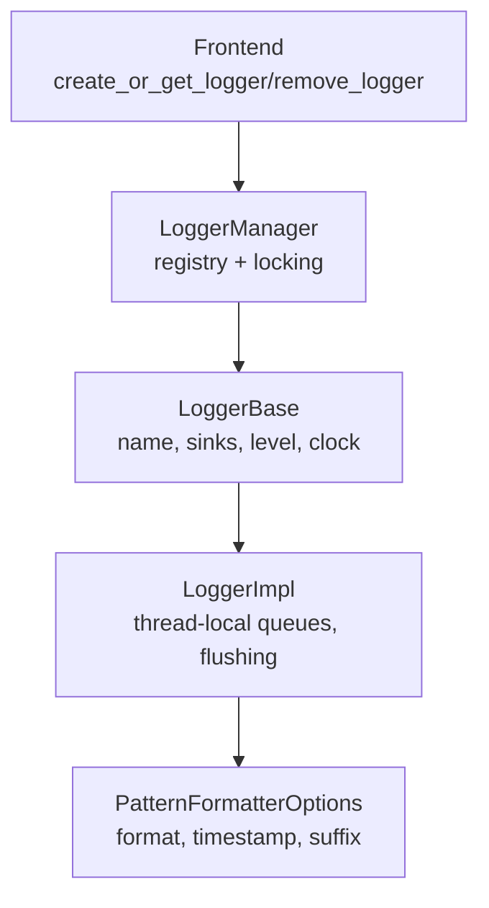
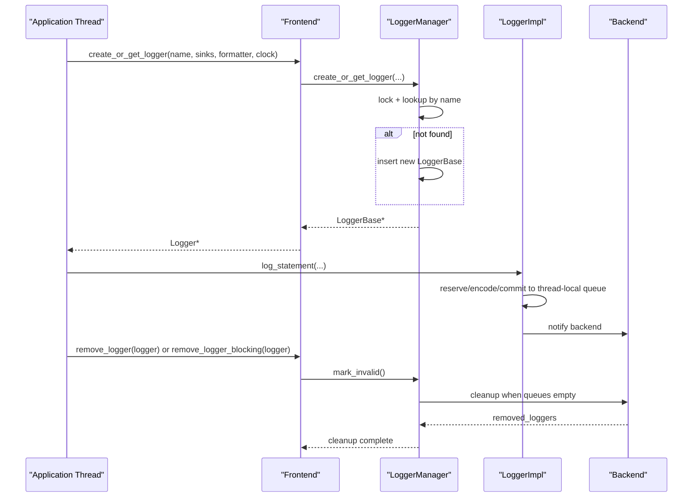
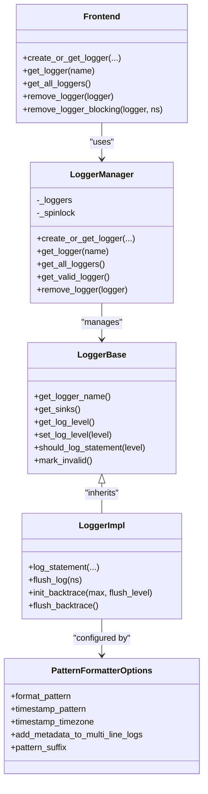

# Logger Management

<cite>
**Referenced Files in This Document**
- [Frontend.h](file://include/quill/Frontend.h)
- [LoggerManager.h](file://include/quill/core/LoggerManager.h)
- [LoggerBase.h](file://include/quill/core/LoggerBase.h)
- [Logger.h](file://include/quill/Logger.h)
- [PatternFormatterOptions.h](file://include/quill/core/PatternFormatterOptions.h)
- [SimpleSetup.h](file://include/quill/SimpleSetup.h)
- [loggers.rst](file://docs/loggers.rst)
- [quill_docs_example_loggers_remove.cpp](file://docs/examples/quill_docs_example_loggers_remove.cpp)
- [logger_removal_with_file_event_notifier.cpp](file://examples/logger_removal_with_file_event_notifier.cpp)
- [LoggerManagerTest.cpp](file://test/unit_tests/LoggerManagerTest.cpp)
- [MacroFreeMultiFrontendThreadsTest.cpp](file://test/integration_tests/MacroFreeMultiFrontendThreadsTest.cpp)
</cite>

## Table of Contents
1. [Introduction](#introduction)
2. [Project Structure](#project-structure)
3. [Core Components](#core-components)
4. [Architecture Overview](#architecture-overview)
5. [Detailed Component Analysis](#detailed-component-analysis)
6. [Dependency Analysis](#dependency-analysis)
7. [Performance Considerations](#performance-considerations)
8. [Troubleshooting Guide](#troubleshooting-guide)
9. [Conclusion](#conclusion)
10. [Appendices](#appendices)

## Introduction
This document explains how to manage loggers in Quill, focusing on creating and retrieving loggers via Frontend::create_or_get_logger(), lifecycle management, and working with multiple loggers. It covers logger naming, configuration options (log levels, formatters, sinks), thread-safety guarantees, and best practices for organizing logging hierarchies. Practical examples demonstrate logger creation patterns, dynamic management, and performance considerations for multiple logger instances.

## Project Structure
The logger management system spans several core headers:
- Frontend exposes user-facing APIs for creating, retrieving, and removing loggers.
- LoggerManager maintains the registry of loggers and enforces thread-safe creation and removal.
- LoggerBase and Logger define the logger interface and implementation, including thread-local queues and flushing behavior.
- PatternFormatterOptions configures the log message format and timestamp behavior.
- Examples and tests illustrate real-world usage and edge cases.

**Diagram sources**
- [Frontend.h:138-321](file://include/quill/Frontend.h#L138-L321)
- [LoggerManager.h:33-307](file://include/quill/core/LoggerManager.h#L33-L307)
- [LoggerBase.h:35-207](file://include/quill/core/LoggerBase.h#L35-L207)
- [Logger.h:47-508](file://include/quill/Logger.h#L47-L508)
- [PatternFormatterOptions.h:23-168](file://include/quill/core/PatternFormatterOptions.h#L23-L168)

**Section sources**
- [Frontend.h:138-321](file://include/quill/Frontend.h#L138-L321)
- [LoggerManager.h:33-307](file://include/quill/core/LoggerManager.h#L33-L307)
- [LoggerBase.h:35-207](file://include/quill/core/LoggerBase.h#L35-L207)
- [Logger.h:47-508](file://include/quill/Logger.h#L47-L508)
- [PatternFormatterOptions.h:23-168](file://include/quill/core/PatternFormatterOptions.h#L23-L168)

## Core Components
- Frontend::create_or_get_logger: Creates a new logger or retrieves an existing one by name, associating sinks and formatter options. Overloads support a single sink, a vector of sinks, an initializer list, or copying options from an existing logger.
- Frontend::get_logger: Retrieves an existing logger by name.
- Frontend::remove_logger and remove_logger_blocking: Asynchronously marks a logger invalid; the blocking variant waits until the backend completes removal and flushes pending messages.
- LoggerManager: Central registry guarded by a spinlock; supports creation, retrieval, and cleanup of invalidated loggers.
- LoggerBase: Immutable configuration after creation (after construction), including sinks, formatter options, log level, and clock source. Provides thread-safe getters and setters for runtime properties.
- LoggerImpl: Implements the fast logging path with thread-local SPSC queues, encoding, and flushing controls.

Key behaviors:
- Logger parameters are immutable after creation; to change sinks or formatter options, remove and recreate the logger with the same name.
- Removing a logger invalidates it; the backend drains queues and cleans up resources when queues are empty.
- Thread-safety: LoggerBase and LoggerManager use atomic flags and spinlocks to coordinate access.

**Section sources**
- [Frontend.h:138-321](file://include/quill/Frontend.h#L138-L321)
- [LoggerManager.h:47-239](file://include/quill/core/LoggerManager.h#L47-L239)
- [LoggerBase.h:68-184](file://include/quill/core/LoggerBase.h#L68-L184)
- [Logger.h:75-136](file://include/quill/Logger.h#L75-L136)

## Architecture Overview
The logger lifecycle is orchestrated by Frontend, backed by LoggerManager, and executed by LoggerImpl with thread-local queues.

**Diagram sources**
- [Frontend.h:138-321](file://include/quill/Frontend.h#L138-L321)
- [LoggerManager.h:152-239](file://include/quill/core/LoggerManager.h#L152-L239)
- [Logger.h:75-136](file://include/quill/Logger.h#L75-L136)

## Detailed Component Analysis

### Logger Creation and Retrieval
- Overloads:
  - Single sink: create_or_get_logger(name, sink, formatter, clock, user_clock)
  - Multiple sinks: create_or_get_logger(name, vector<sink>, ...)
  - Initializer list: create_or_get_logger(name, {sink1, sink2}, ...)
  - Copy options: create_or_get_logger(name, source_logger)
- Retrieval:
  - get_logger(name) returns a pointer or null
  - get_all_loggers() returns valid loggers; get_number_of_loggers() counts all (including invalidated)
  - get_valid_logger() returns any valid logger, optionally excluding names by substring(s)

Best practices:
- Use distinct logger names per thread or per logical subsystem to simplify removal and avoid contention.
- Prefer copying options from an existing logger when you need identical configuration.

**Section sources**
- [Frontend.h:138-321](file://include/quill/Frontend.h#L138-L321)
- [loggers.rst:18-38](file://docs/loggers.rst#L18-L38)

### Logger Lifecycle and Removal
- Asynchronous removal:
  - remove_logger(logger): marks invalid; backend drains queues and removes when empty.
  - remove_logger_blocking(logger, sleep_ns): sends a special log to ensure backend processes removal, then waits for completion.
- Backend cleanup:
  - LoggerManager tracks invalidated loggers and removes them when queues are empty.
  - Removed loggers are no longer returned by get_all_loggers().

Thread-safety:
- Removal functions are thread-safe, but do not call remove_logger or remove_logger_blocking concurrently on the same logger pointer from multiple threads.

Practical example:
- Recreating a logger with the same name after removal requires waiting for removal completion.

**Section sources**
- [Frontend.h:218-289](file://include/quill/Frontend.h#L218-L289)
- [LoggerManager.h:200-239](file://include/quill/core/LoggerManager.h#L200-L239)
- [loggers.rst:39-58](file://docs/loggers.rst#L39-L58)
- [quill_docs_example_loggers_remove.cpp:25-37](file://docs/examples/quill_docs_example_loggers_remove.cpp#L25-L37)

### Logger Naming Conventions and Hierarchical Organization
- Logger names serve as identifiers and are used for retrieval and recreation.
- Tests demonstrate alphabetical ordering and filtering by substrings, enabling simple hierarchical naming patterns (e.g., prefixes or separators) to group related loggers.

Recommendations:
- Use descriptive names that reflect subsystems or threads.
- Employ consistent naming to leverage get_valid_logger() filtering and exclusion lists.

**Section sources**
- [LoggerManagerTest.cpp:170-208](file://test/unit_tests/LoggerManagerTest.cpp#L170-L208)
- [LoggerManager.h:74-122](file://include/quill/core/LoggerManager.h#L74-L122)

### Logger Configuration Options
- Log Level:
  - LoggerBase::set_log_level() and get_log_level() control filtering.
  - LoggerBase::should_log_statement() helpers evaluate against the current level.
- Formatters:
  - PatternFormatterOptions defines format_pattern, timestamp_pattern/timezone, metadata inclusion for multi-line logs, suffix behavior, and optional function-name processing.
- Sinks:
  - Frontend::create_or_get_sink() creates or retrieves sinks by name; Frontend::get_sink() retrieves by name.
  - LoggerImpl associates one or more sinks with a logger; sinks are immutable after creation.
- Clock Source:
  - ClockSourceType supports TSC, System, and User; LoggerBase stores the selected type and optional user clock pointer.

Environment-driven configuration:
- LoggerManager parses QUILL_LOG_LEVEL from the environment and applies it to newly created loggers.

**Section sources**
- [LoggerBase.h:118-184](file://include/quill/core/LoggerBase.h#L118-L184)
- [PatternFormatterOptions.h:23-168](file://include/quill/core/PatternFormatterOptions.h#L23-L168)
- [Frontend.h:114-135](file://include/quill/Frontend.h#L114-L135)
- [LoggerManager.h:247-273](file://include/quill/core/LoggerManager.h#L247-L273)

### Thread-Safety and Resource Management
- Thread-safety:
  - LoggerBase and LoggerManager use atomic flags and a spinlock to guard registry operations.
  - LoggerImpl’s log_statement() is thread-safe and uses thread-local SPSC queues.
- Resource management:
  - Removing a logger invalidates it; backend closes associated files when sinks are not shared by other loggers.
  - Immediate flush thresholds can be set to force periodic flushes; be cautious as it impacts performance.

**Section sources**
- [LoggerBase.h:104-113](file://include/quill/core/LoggerBase.h#L104-L113)
- [LoggerManager.h:36-44](file://include/quill/core/LoggerManager.h#L36-L44)
- [Logger.h:319-352](file://include/quill/Logger.h#L319-L352)

### Practical Examples and Patterns
- Single-root logger with console output:
  - Create a sink, create a logger, and log messages; start backend.
- Removing a logger and recreating with updated configuration:
  - Use remove_logger_blocking() to wait for removal, then recreate with the same name.
- Per-session file logging with automatic file closing:
  - Create a FileSink per session, remove logger on destruction to close the file.

**Section sources**
- [SimpleSetup.h:46-72](file://include/quill/SimpleSetup.h#L46-L72)
- [quill_docs_example_loggers_remove.cpp:13-37](file://docs/examples/quill_docs_example_loggers_remove.cpp#L13-L37)
- [logger_removal_with_file_event_notifier.cpp:20-66](file://examples/logger_removal_with_file_event_notifier.cpp#L20-L66)

## Dependency Analysis
The logger stack composes Frontend → LoggerManager → LoggerBase/LoggerImpl, with configuration via PatternFormatterOptions and sinks managed by Frontend.

**Diagram sources**
- [Frontend.h:138-321](file://include/quill/Frontend.h#L138-L321)
- [LoggerManager.h:33-307](file://include/quill/core/LoggerManager.h#L33-L307)
- [LoggerBase.h:35-207](file://include/quill/core/LoggerBase.h#L35-L207)
- [Logger.h:47-508](file://include/quill/Logger.h#L47-L508)
- [PatternFormatterOptions.h:23-168](file://include/quill/core/PatternFormatterOptions.h#L23-L168)

**Section sources**
- [Frontend.h:138-321](file://include/quill/Frontend.h#L138-L321)
- [LoggerManager.h:33-307](file://include/quill/core/LoggerManager.h#L33-L307)
- [LoggerBase.h:35-207](file://include/quill/core/LoggerBase.h#L35-L207)
- [Logger.h:47-508](file://include/quill/Logger.h#L47-L508)
- [PatternFormatterOptions.h:23-168](file://include/quill/core/PatternFormatterOptions.h#L23-L168)

## Performance Considerations
- Thread-local queues:
  - LoggerImpl reserves space in a thread-local SPSC queue per caller thread; dropping queues may drop messages, while blocking queues back off with retry intervals.
- Immediate flush:
  - set_immediate_flush() triggers periodic flushes; enable only for debugging as it reduces throughput.
- Environment log level:
  - QUILL_LOG_LEVEL can set a global default applied to new loggers.
- Memory tuning:
  - For unbounded queues, shrink_thread_local_queue() reduces memory usage after bursts.

**Section sources**
- [Logger.h:408-475](file://include/quill/Logger.h#L408-L475)
- [LoggerBase.h:161-164](file://include/quill/core/LoggerBase.h#L161-L164)
- [LoggerManager.h:247-273](file://include/quill/core/LoggerManager.h#L247-L273)
- [Frontend.h:55-111](file://include/quill/Frontend.h#L55-L111)

## Troubleshooting Guide
Common scenarios:
- Logger not found:
  - Ensure the logger was created with the exact name; use Frontend::get_logger() to verify existence.
- Removing a logger fails to take effect immediately:
  - Use remove_logger_blocking() to wait for backend completion.
- Removing the same logger from multiple threads:
  - Do not call remove_logger or remove_logger_blocking concurrently on the same logger pointer; choose a single remover thread.
- Sink reuse and file handles:
  - Removing a logger closes associated files only if no other logger shares the sink.
- Dynamic logger management:
  - For multi-threaded apps, create a dedicated logger per thread with unique names to avoid contention and simplify lifecycle management.

Validation and tests:
- Unit tests demonstrate removal behavior, queue-empty conditions, and alphabetically ordered retrieval with exclusion filters.
- Integration tests show multi-threaded logging and log level propagation.

**Section sources**
- [loggers.rst:42-58](file://docs/loggers.rst#L42-L58)
- [LoggerManagerTest.cpp:47-127](file://test/unit_tests/LoggerManagerTest.cpp#L47-L127)
- [LoggerManagerTest.cpp:170-208](file://test/unit_tests/LoggerManagerTest.cpp#L170-L208)
- [MacroFreeMultiFrontendThreadsTest.cpp:49-90](file://test/integration_tests/MacroFreeMultiFrontendThreadsTest.cpp#L49-L90)

## Conclusion
Quill’s logger management centers on Frontend-managed, immutable-loggers-within-a-lifecycle governed by LoggerManager. Use Frontend::create_or_get_logger() to build loggers with configurable sinks and formatters, Frontend::get_logger() to retrieve them, and remove_logger/remove_logger_blocking to safely tear them down. Apply thread-safety guidelines, leverage environment-driven configuration, and adopt naming conventions that support hierarchical organization and easy filtering.

## Appendices

### API Quick Reference
- Creating loggers:
  - Single sink: create_or_get_logger(name, sink, formatter, clock, user_clock)
  - Multiple sinks: create_or_get_logger(name, {sink...}, formatter, clock, user_clock)
  - Copy options: create_or_get_logger(name, source_logger)
- Retrieving loggers:
  - get_logger(name), get_all_loggers(), get_valid_logger(), get_number_of_loggers()
- Removing loggers:
  - remove_logger(logger), remove_logger_blocking(logger, sleep_ns)
- Logger configuration:
  - set_log_level(level), should_log_statement(level), get_log_level()
  - PatternFormatterOptions fields: format_pattern, timestamp_pattern/timezone, suffix, multi-line metadata behavior

**Section sources**
- [Frontend.h:138-321](file://include/quill/Frontend.h#L138-L321)
- [LoggerBase.h:118-184](file://include/quill/core/LoggerBase.h#L118-L184)
- [PatternFormatterOptions.h:23-168](file://include/quill/core/PatternFormatterOptions.h#L23-L168)