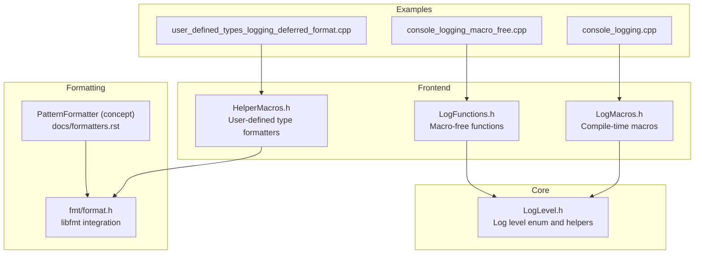
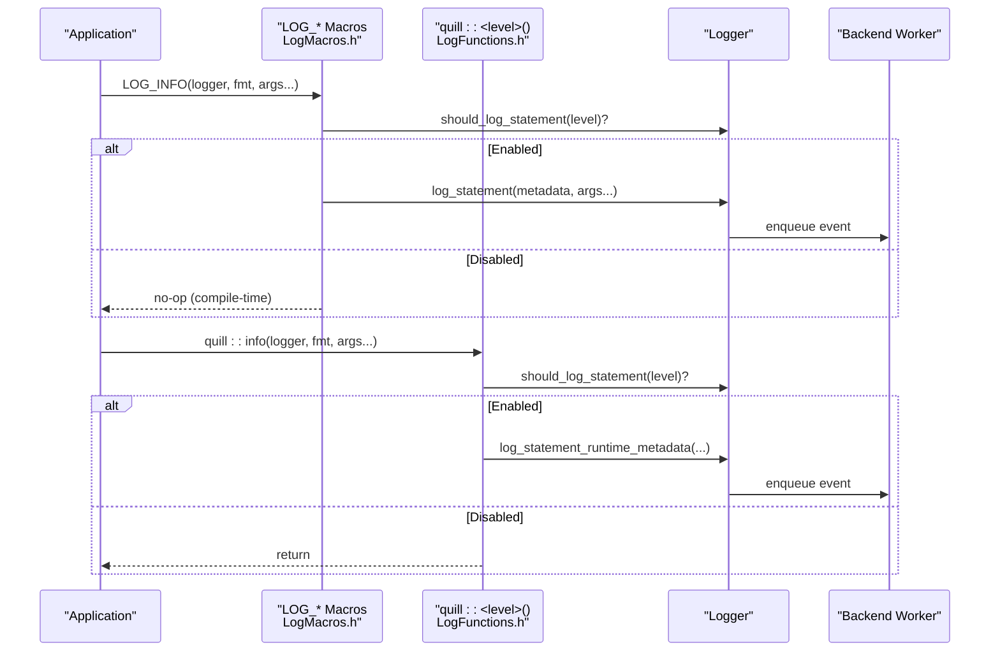
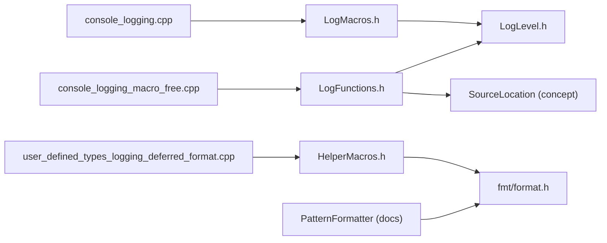

# Logging Operations

<cite>
**Referenced Files in This Document**
- [LogMacros.h](file://include/quill/LogMacros.h)
- [LogFunctions.h](file://include/quill/LogFunctions.h)
- [LogLevel.h](file://include/quill/core/LogLevel.h)
- [HelperMacros.h](file://include/quill/HelperMacros.h)
- [logging_macros.rst](file://docs/logging_macros.rst)
- [macro_free_mode.rst](file://docs/macro_free_mode.rst)
- [log_levels.rst](file://docs/log_levels.rst)
- [formatters.rst](file://docs/formatters.rst)
- [console_logging.cpp](file://examples/console_logging.cpp)
- [console_logging_macro_free.cpp](file://examples/console_logging_macro_free.cpp)
- [user_defined_types_logging_deferred_format.cpp](file://examples/user_defined_types_logging_deferred_format.cpp)
- [format.h](file://include/quill/bundled/fmt/format.h)
</cite>

## Table of Contents
1. [Introduction](#introduction)
2. [Project Structure](#project-structure)
3. [Core Components](#core-components)
4. [Architecture Overview](#architecture-overview)
5. [Detailed Component Analysis](#detailed-component-analysis)
6. [Dependency Analysis](#dependency-analysis)
7. [Performance Considerations](#performance-considerations)
8. [Troubleshooting Guide](#troubleshooting-guide)
9. [Conclusion](#conclusion)
10. [Appendices](#appendices)

## Introduction
This document explains logging operations in Quill, covering standard log levels (TRACE L3–L1, DEBUG, INFO, NOTICE, WARNING, ERROR, CRITICAL), formatting with libfmt syntax, and the three logging approaches: logging macros, direct function calls, and macro-free mode. It provides practical examples, performance characteristics, and best practices for readable and maintainable logs.

## Project Structure
Quill’s logging implementation centers around:
- Compile-time macro-based logging for zero-cost filtering and fast paths
- Runtime function-based logging for convenience with measurable overhead
- A unified log level model and formatter pipeline for output customization

**Diagram sources**
- [LogMacros.h:1-1203](file://include/quill/LogMacros.h#L1-L1203)
- [LogFunctions.h:1-345](file://include/quill/LogFunctions.h#L1-L345)
- [LogLevel.h:1-128](file://include/quill/core/LogLevel.h#L1-L128)
- [HelperMacros.h:1-46](file://include/quill/HelperMacros.h#L1-L46)
- [formatters.rst:1-186](file://docs/formatters.rst#L1-L186)
- [console_logging.cpp:1-72](file://examples/console_logging.cpp#L1-L72)
- [console_logging_macro_free.cpp:1-62](file://examples/console_logging_macro_free.cpp#L1-L62)
- [user_defined_types_logging_deferred_format.cpp:1-71](file://examples/user_defined_types_logging_deferred_format.cpp#L1-L71)
- [format.h:1-200](file://include/quill/bundled/fmt/format.h#L1-L200)

**Section sources**
- [LogMacros.h:1-1203](file://include/quill/LogMacros.h#L1-L1203)
- [LogFunctions.h:1-345](file://include/quill/LogFunctions.h#L1-L345)
- [LogLevel.h:1-128](file://include/quill/core/LogLevel.h#L1-L128)
- [HelperMacros.h:1-46](file://include/quill/HelperMacros.h#L1-L46)
- [logging_macros.rst:1-357](file://docs/logging_macros.rst#L1-L357)
- [macro_free_mode.rst:1-51](file://docs/macro_free_mode.rst#L1-L51)
- [log_levels.rst:1-76](file://docs/log_levels.rst#L1-L76)
- [formatters.rst:1-186](file://docs/formatters.rst#L1-L186)

## Core Components
- Log levels: TRACE_L3, TRACE_L2, TRACE_L1, DEBUG, INFO, NOTICE, WARNING, ERROR, CRITICAL, BACKTRACE, NONE
- Compile-time filtering via QUILL_COMPILE_ACTIVE_LOG_LEVEL to remove lower-priority logs from the binary
- Runtime filtering via Logger::set_log_level
- Formatting powered by libfmt with support for positional arguments, width/precision specifiers, and named/nested arguments
- Three logging modes:
  - Macros: LOG_INFO, LOG_ERROR, etc., plus LOGV_* (value-based) and LOGJ_* (named JSON-style)
  - Functions: quill::info, quill::error, etc., with optional Tags
  - Macro-free: function-based logging with runtime metadata

**Section sources**
- [LogLevel.h:22-35](file://include/quill/core/LogLevel.h#L22-L35)
- [log_levels.rst:8-76](file://docs/log_levels.rst#L8-L76)
- [logging_macros.rst:6-357](file://docs/logging_macros.rst#L6-L357)
- [macro_free_mode.rst:1-51](file://docs/macro_free_mode.rst#L1-L51)
- [LogFunctions.h:19-48](file://include/quill/LogFunctions.h#L19-L48)

## Architecture Overview
The logging pipeline integrates macros/functions with the backend worker and formatter. Compile-time macros embed metadata and log level into the call site, enabling compile-time removal of disabled levels. Macro-free functions rely on runtime metadata and incur additional overhead.

**Diagram sources**
- [LogMacros.h:306-345](file://include/quill/LogMacros.h#L306-L345)
- [LogFunctions.h:324-343](file://include/quill/LogFunctions.h#L324-L343)

## Detailed Component Analysis

### Log Levels and Filtering
- Levels from most to least verbose: TRACE_L3 → TRACE_L2 → TRACE_L1 → DEBUG → INFO → NOTICE → WARNING → ERROR → CRITICAL
- Compile-time filtering: QUILL_COMPILE_ACTIVE_LOG_LEVEL disables compilation of lower-priority levels
- Runtime filtering: Logger::set_log_level controls which messages are emitted at runtime
- Interaction: compile-time acts as an upper bound; runtime further restricts within that bound

Practical guidance:
- Use compile-time filtering for production builds to eliminate hot-path overhead
- Use runtime filtering for development or dynamic configuration

**Section sources**
- [log_levels.rst:8-76](file://docs/log_levels.rst#L8-L76)
- [LogLevel.h:22-35](file://include/quill/core/LogLevel.h#L22-L35)
- [LogMacros.h:28-40](file://include/quill/LogMacros.h#L28-L40)

### Logging Macros (LOG_*)
Supported macros include:
- Standard: LOG_INFO, LOG_ERROR, LOG_WARNING, LOG_DEBUG, LOG_NOTICE, LOG_CRITICAL, LOG_TRACE_L1/L2/L3
- Rate-limited variants: *_LIMIT(min_interval, ...)
- Every-N variants: *_LIMIT_EVERY_N(n_occurrences, ...)
- Tagged variants: *_TAGS(logger, tags, fmt, ...)
- Value-based (LOGV): automatic variable name/value printing without manual placeholders
- Named JSON-style (LOGJ): automatic named argument embedding

Key behaviors:
- Compile-time removal when below QUILL_COMPILE_ACTIVE_LOG_LEVEL
- Optional rate limiting with thread-local suppression counters
- Automatic suppression count formatting appended to the message

Common use cases:
- High-frequency telemetry: use *_LIMIT or *_LIMIT_EVERY_N
- Structured logs: use LOGJ_* macros to auto-embed variable names
- Conditional suppression: use *_LIMIT to cap bursts

**Section sources**
- [logging_macros.rst:35-357](file://docs/logging_macros.rst#L35-L357)
- [LogMacros.h:373-800](file://include/quill/LogMacros.h#L373-L800)

### Direct Function Calls (quill::<level>)
Convenience functions wrap the macro-based path with runtime metadata:
- quill::info, quill::error, quill::warning, quill::debug, quill::notice, quill::critical, quill::tracel1/2/3, quill::backtrace
- Optional Tags parameter for categorization
- Runtime checks for null logger and metadata copying

Performance trade-offs:
- Higher latency due to runtime metadata copying
- Arguments are always evaluated
- No compile-time removal of disabled levels
- Slight backend throughput impact

Best for:
- Prototyping, tests, or environments where macro usage is undesirable

**Section sources**
- [macro_free_mode.rst:10-26](file://docs/macro_free_mode.rst#L10-L26)
- [LogFunctions.h:19-48](file://include/quill/LogFunctions.h#L19-L48)
- [LogFunctions.h:324-343](file://include/quill/LogFunctions.h#L324-L343)

### Macro-Free Mode with Tags
The Tags helper supports one or more char* tags, validated and formatted into a single tag string.

Usage patterns:
- Single tag: Tags{"TAG"}
- Multiple tags: Tags{"A", "B", "C"}

Behavior:
- Skips null tags
- Prepend “#” and separate with spaces
- Pass to functions like quill::info(logger, Tags{"MY_TAG"}, "...")

**Section sources**
- [LogFunctions.h:53-111](file://include/quill/LogFunctions.h#L53-L111)
- [console_logging_macro_free.cpp:35-60](file://examples/console_logging_macro_free.cpp#L35-L60)

### Formatting with libfmt
Quill leverages libfmt for formatting. Supported capabilities include:
- Positional arguments: {0}, {1}, etc.
- Width specifiers: left/right alignment, minimum width
- Precision formatting: floating-point, chrono durations, etc.
- Named arguments: {name}
- Nested and composite arguments: combining containers, chrono, and custom types

Examples in repository:
- Numeric formatting with width/precision
- Container logging via included quill/std headers
- Value-based logging (LOGV_*) and named logging (LOGJ_*) macros

**Section sources**
- [console_logging.cpp:36-47](file://examples/console_logging.cpp#L36-L47)
- [formatters.rst:17-71](file://docs/formatters.rst#L17-L71)
- [format.h:1446-1466](file://include/quill/bundled/fmt/format.h#L1446-L1466)

### User-Defined Types and Custom Formatters
Two helper macros define formatters and codecs for user-defined types:
- QUILL_LOGGABLE_DEFERRED_FORMAT(type): uses fmt::ostream_formatter and DeferredFormatCodec
- QUILL_LOGGABLE_DIRECT_FORMAT(type): uses fmt::ostream_formatter and DirectFormatCodec

Example demonstrates defining a custom formatter and codec for a user class and logging it directly.

**Section sources**
- [HelperMacros.h:20-46](file://include/quill/HelperMacros.h#L20-L46)
- [user_defined_types_logging_deferred_format.cpp:34-51](file://examples/user_defined_types_logging_deferred_format.cpp#L34-L51)

### Practical Examples

#### Macro-based logging
- Standard formatting with positional and precision specifiers
- Value-based logging (LOGV_*) to auto-print variable names and values
- Rate-limited logging to throttle noisy messages

**Section sources**
- [console_logging.cpp:36-70](file://examples/console_logging.cpp#L36-L70)

#### Macro-free logging
- Function calls for each level
- Optional Tags usage
- Runtime metadata path

**Section sources**
- [console_logging_macro_free.cpp:35-60](file://examples/console_logging_macro_free.cpp#L35-L60)

#### Custom type logging
- Define formatter and codec for a user class
- Log instances directly with standard formatting

**Section sources**
- [user_defined_types_logging_deferred_format.cpp:34-51](file://examples/user_defined_types_logging_deferred_format.cpp#L34-L51)

## Dependency Analysis
The logging subsystem exhibits clear separation of concerns:
- Macros depend on LogLevel and MacroMetadata to encode level and metadata at compile time
- Functions depend on SourceLocation and runtime metadata to emulate macro behavior
- Formatting relies on libfmt, integrated via bundled headers
- Output formatting is handled by PatternFormatter (configured via PatternFormatterOptions)

**Diagram sources**
- [LogMacros.h:9-12](file://include/quill/LogMacros.h#L9-L12)
- [LogFunctions.h:9-17](file://include/quill/LogFunctions.h#L9-L17)
- [LogLevel.h:1-16](file://include/quill/core/LogLevel.h#L1-L16)
- [HelperMacros.h:9-13](file://include/quill/HelperMacros.h#L9-L13)
- [format.h:1-42](file://include/quill/bundled/fmt/format.h#L1-L42)
- [console_logging.cpp:1-14](file://examples/console_logging.cpp#L1-L14)
- [console_logging_macro_free.cpp:1-9](file://examples/console_logging_macro_free.cpp#L1-L9)
- [user_defined_types_logging_deferred_format.cpp:1-12](file://examples/user_defined_types_logging_deferred_format.cpp#L1-L12)

**Section sources**
- [LogMacros.h:9-12](file://include/quill/LogMacros.h#L9-L12)
- [LogFunctions.h:9-17](file://include/quill/LogFunctions.h#L9-L17)
- [HelperMacros.h:9-13](file://include/quill/HelperMacros.h#L9-L13)
- [formatters.rst:1-14](file://docs/formatters.rst#L1-L14)

## Performance Considerations
- Compile-time filtering removes lower-priority logs from the binary, minimizing hot-path overhead
- Macro-based logging avoids runtime metadata copying and argument evaluation when disabled
- Macro-free functions:
  - Always evaluate arguments
  - Copy metadata at runtime
  - Cannot be fully compiled out by QUILL_COMPILE_ACTIVE_LOG_LEVEL
  - Introduce slight backend overhead due to runtime metadata handling
- Rate-limiting macros reduce frequency of expensive operations while preserving bursts

Recommendations:
- Prefer macros for hot paths and production builds
- Use macro-free mode for tests, demos, or environments where convenience outweighs micro-optimizations
- Apply rate-limiting macros for noisy diagnostics

**Section sources**
- [log_levels.rst:22-42](file://docs/log_levels.rst#L22-L42)
- [macro_free_mode.rst:10-26](file://docs/macro_free_mode.rst#L10-L26)
- [LogMacros.h:316-361](file://include/quill/LogMacros.h#L316-L361)

## Troubleshooting Guide
- Logs not appearing:
  - Verify runtime log level is set appropriately (default is INFO)
  - Ensure compile-time filtering is not disabling the level
- Unexpected verbosity:
  - Adjust runtime log level or increase compile-time threshold
- Overly frequent logs:
  - Wrap with *_LIMIT or *_LIMIT_EVERY_N macros
- Macro-free mode overhead:
  - Switch to macros for performance-sensitive paths
- Custom types not formatting:
  - Define a formatter and codec using QUILL_LOGGABLE_DEFERRED_FORMAT or QUILL_LOGGABLE_DIRECT_FORMAT

**Section sources**
- [log_levels.rst:8-21](file://docs/log_levels.rst#L8-L21)
- [logging_macros.rst:32-34](file://docs/logging_macros.rst#L32-L34)
- [macro_free_mode.rst:10-26](file://docs/macro_free_mode.rst#L10-L26)
- [HelperMacros.h:20-46](file://include/quill/HelperMacros.h#L20-L46)

## Conclusion
Quill provides a flexible, high-performance logging framework. Use compile-time filtering to eliminate lower-priority logs, leverage macros for zero-cost paths, and apply rate-limiting for noisy diagnostics. For convenience, macro-free functions offer a runtime metadata path with predictable trade-offs. Formatting is powered by libfmt, supporting positional, width/precision, named, and nested arguments. Custom types integrate seamlessly via helper macros.

## Appendices

### Quick Reference: Log Levels and Macros
- Levels: TRACE_L3, TRACE_L2, TRACE_L1, DEBUG, INFO, NOTICE, WARNING, ERROR, CRITICAL
- Macros: LOG_INFO, LOG_ERROR, LOG_WARNING, LOG_DEBUG, LOG_NOTICE, LOG_CRITICAL, LOG_TRACE_L1/L2/L3
- Variants: *_LIMIT, *_LIMIT_EVERY_N, *_TAGS
- Value-based: LOGV_* macros
- Named JSON-style: LOGJ_* macros

**Section sources**
- [logging_macros.rst:35-357](file://docs/logging_macros.rst#L35-L357)
- [log_levels.rst:52-76](file://docs/log_levels.rst#L52-L76)

### Quick Reference: Macro-Free Functions
- Functions: tracel3, tracel2, tracel1, debug, info, notice, warning, error, critical, backtrace
- Optional Tags parameter
- Runtime metadata path

**Section sources**
- [macro_free_mode.rst:27-43](file://docs/macro_free_mode.rst#L27-L43)
- [LogFunctions.h:113-321](file://include/quill/LogFunctions.h#L113-L321)

### Quick Reference: libfmt Formatting Patterns
- Positional: {0}, {1}
- Width/alignment: {value:<10}, {value:>10}
- Precision: {:.2f}, {%Qms}
- Named: {name}
- Containers and chrono via quill/std headers

**Section sources**
- [console_logging.cpp:36-47](file://examples/console_logging.cpp#L36-L47)
- [formatters.rst:73-93](file://docs/formatters.rst#L73-L93)
- [format.h:1446-1466](file://include/quill/bundled/fmt/format.h#L1446-L1466)