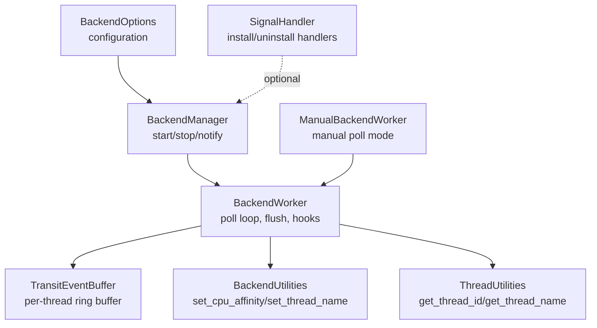
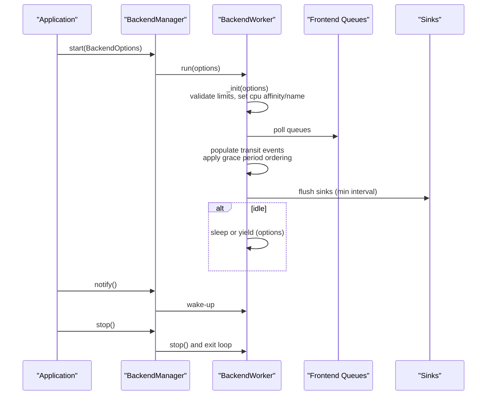
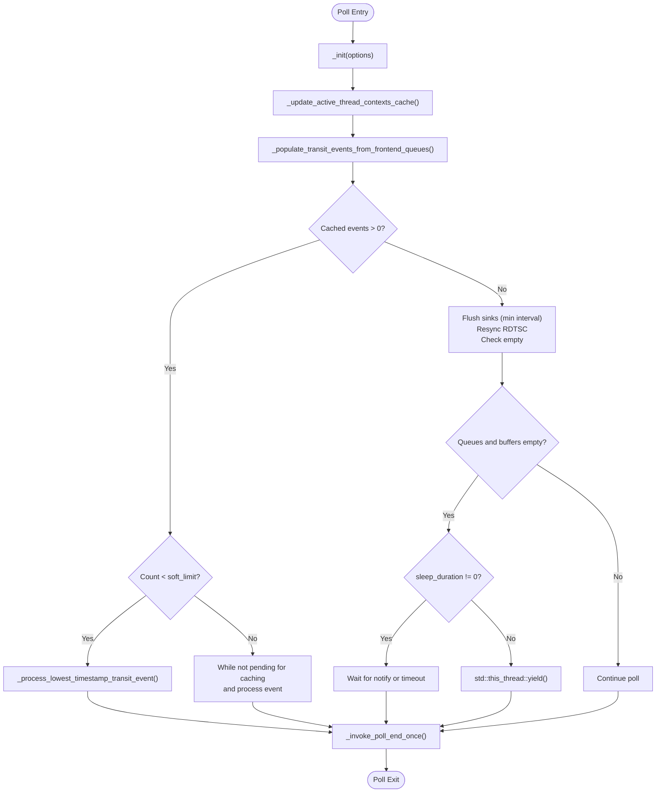
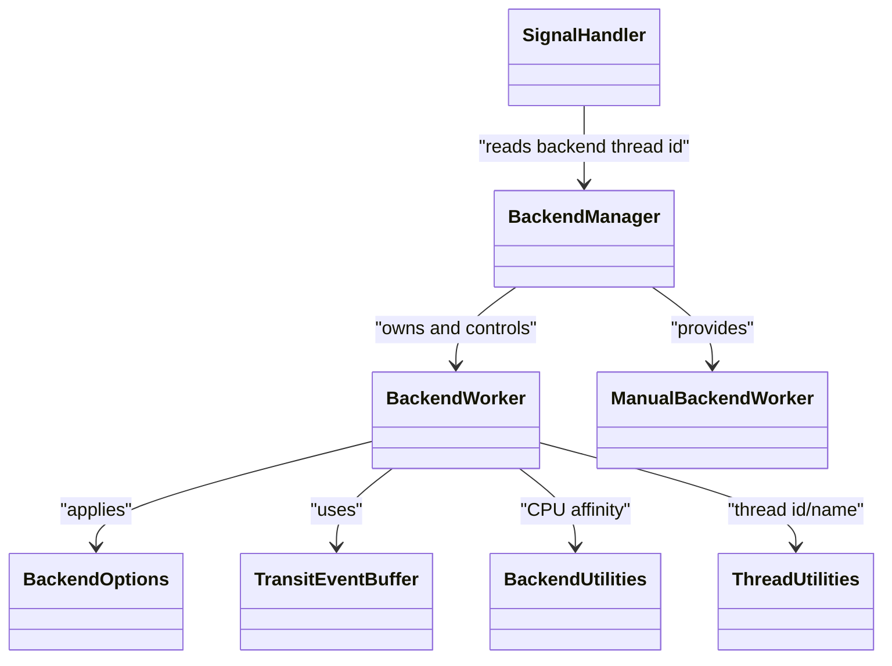

# Backend Configuration

<cite>
**Referenced Files in This Document**
- [BackendOptions.h](file://include/quill/backend/BackendOptions.h)
- [BackendWorker.h](file://include/quill/backend/BackendWorker.h)
- [BackendManager.h](file://include/quill/backend/BackendManager.h)
- [BackendUtilities.h](file://include/quill/backend/BackendUtilities.h)
- [ThreadUtilities.h](file://include/quill/backend/ThreadUtilities.h)
- [SignalHandler.h](file://include/quill/backend/SignalHandler.h)
- [ManualBackendWorker.h](file://include/quill/backend/ManualBackendWorker.h)
- [TransitEventBuffer.h](file://include/quill/backend/TransitEventBuffer.h)
- [Backend.h](file://include/quill/Backend.h)
- [quill_docs_example_backend_options.cpp](file://docs/examples/quill_docs_example_backend_options.cpp)
</cite>

## Table of Contents
1. [Introduction](#introduction)
2. [Project Structure](#project-structure)
3. [Core Components](#core-components)
4. [Architecture Overview](#architecture-overview)
5. [Detailed Component Analysis](#detailed-component-analysis)
6. [Dependency Analysis](#dependency-analysis)
7. [Performance Considerations](#performance-considerations)
8. [Troubleshooting Guide](#troubleshooting-guide)
9. [Conclusion](#conclusion)
10. [Appendices](#appendices)

## Introduction
This document explains Quill’s BackendOptions configuration system and how it controls the backend logging thread. It covers thread management (priority, CPU affinity, scheduling), performance tuning (worker behavior, memory allocation, cache sizing), signal handler integration, crash-safe logging, logging thread behavior (queue processing intervals, batching, memory), platform-specific optimizations, and practical configuration examples for server, embedded, and high-frequency trading environments. It also outlines monitoring and debugging options for production deployments.

## Project Structure
The backend configuration is centered around BackendOptions and the backend worker lifecycle. Supporting utilities manage thread naming, CPU affinity, and signal handling. The backend manager coordinates startup, shutdown, and notification of the backend thread.

**Diagram sources**
- [BackendOptions.h:30-281](file://include/quill/backend/BackendOptions.h#L30-L281)
- [BackendManager.h:61-108](file://include/quill/backend/BackendManager.h#L61-L108)
- [BackendWorker.h:138-207](file://include/quill/backend/BackendWorker.h#L138-L207)
- [TransitEventBuffer.h:19-157](file://include/quill/backend/TransitEventBuffer.h#L19-L157)
- [BackendUtilities.h:55-116](file://include/quill/backend/BackendUtilities.h#L55-L116)
- [ThreadUtilities.h:148-226](file://include/quill/backend/ThreadUtilities.h#L148-L226)
- [SignalHandler.h:50-88](file://include/quill/backend/SignalHandler.h#L50-L88)
- [ManualBackendWorker.h:19-118](file://include/quill/backend/ManualBackendWorker.h#L19-L118)

**Section sources**
- [BackendOptions.h:30-281](file://include/quill/backend/BackendOptions.h#L30-L281)
- [BackendManager.h:61-108](file://include/quill/backend/BackendManager.h#L61-L108)
- [BackendWorker.h:138-207](file://include/quill/backend/BackendWorker.h#L138-L207)
- [TransitEventBuffer.h:19-157](file://include/quill/backend/TransitEventBuffer.h#L19-L157)
- [BackendUtilities.h:55-116](file://include/quill/backend/BackendUtilities.h#L55-L116)
- [ThreadUtilities.h:148-226](file://include/quill/backend/ThreadUtilities.h#L148-L226)
- [SignalHandler.h:50-88](file://include/quill/backend/SignalHandler.h#L50-L88)
- [ManualBackendWorker.h:19-118](file://include/quill/backend/ManualBackendWorker.h#L19-L118)

## Core Components
- BackendOptions: Central configuration struct controlling thread name, idle yielding, sleep duration, transit event buffer sizing, strict timestamp ordering, CPU affinity, error notifier, hooks, RDTSC resync interval, sink flush interval, printable character filtering, log level descriptors, and singleton instance checking.
- BackendWorker: Implements the backend thread’s main loop, queue polling, event batching, flushing, and resource cleanup. Applies BackendOptions and integrates with sinks and thread utilities.
- BackendManager: Singleton accessor to start/stop the backend thread, notify it, and expose thread identity and conversions.
- BackendUtilities and ThreadUtilities: Platform-specific helpers for CPU affinity and thread naming.
- SignalHandler: Optional integration for crash-safe logging via signal handlers and Windows exception handlers.
- ManualBackendWorker: Alternative manual control mode for applications requiring deterministic backend processing.

**Section sources**
- [BackendOptions.h:30-281](file://include/quill/backend/BackendOptions.h#L30-L281)
- [BackendWorker.h:138-207](file://include/quill/backend/BackendWorker.h#L138-L207)
- [BackendManager.h:61-108](file://include/quill/backend/BackendManager.h#L61-L108)
- [BackendUtilities.h:55-116](file://include/quill/backend/BackendUtilities.h#L55-L116)
- [ThreadUtilities.h:148-226](file://include/quill/backend/ThreadUtilities.h#L148-L226)
- [SignalHandler.h:50-88](file://include/quill/backend/SignalHandler.h#L50-L88)
- [ManualBackendWorker.h:19-118](file://include/quill/backend/ManualBackendWorker.h#L19-L118)

## Architecture Overview
The backend thread runs independently, periodically polling frontend queues, buffering events, ensuring strict timestamp ordering when configured, and flushing sinks at controlled intervals. It supports CPU affinity and thread naming for predictable scheduling and observability.

**Diagram sources**
- [BackendManager.h:61-108](file://include/quill/backend/BackendManager.h#L61-L108)
- [BackendWorker.h:138-207](file://include/quill/backend/BackendWorker.h#L138-L207)
- [BackendWorker.h:305-395](file://include/quill/backend/BackendWorker.h#L305-L395)
- [BackendWorker.h:443-474](file://include/quill/backend/BackendWorker.h#L443-L474)

## Detailed Component Analysis

### BackendOptions: Thread Management and Scheduling
- Thread identity and visibility
  - thread_name: Sets the backend thread name for debugging and thread queries.
  - get_thread_id(): Exposed via Backend to identify the backend thread.
- CPU affinity
  - cpu_affinity: Pins the backend thread to a specific CPU. Use the sentinel value to leave unset.
  - Applied during backend thread initialization.
- Scheduling behavior
  - sleep_duration: Nanoseconds to sleep when idle. Zero disables sleep and allows busy-waiting.
  - enable_yield_when_idle: When sleep_duration is zero, yields instead of sleeping to reduce scheduler priority impact.
- Strict timestamp ordering
  - log_timestamp_ordering_grace_period: Microseconds grace applied to ensure ordering across frontend queues. Zero disables strict ordering.
- Shutdown behavior
  - wait_for_queues_to_empty_before_exit: Ensures backend exits only after queues are drained; otherwise exits after one pass.

**Section sources**
- [BackendOptions.h:36](file://include/quill/backend/BackendOptions.h#L36)
- [BackendOptions.h:44](file://include/quill/backend/BackendOptions.h#L44)
- [BackendOptions.h:49](file://include/quill/backend/BackendOptions.h#L49)
- [BackendOptions.h:75](file://include/quill/backend/BackendOptions.h#L75)
- [BackendOptions.h:92](file://include/quill/backend/BackendOptions.h#L92)
- [BackendOptions.h:132](file://include/quill/backend/BackendOptions.h#L132)
- [BackendOptions.h:145](file://include/quill/backend/BackendOptions.h#L145)
- [BackendOptions.h:154](file://include/quill/backend/BackendOptions.h#L154)
- [BackendWorker.h:156-176](file://include/quill/backend/BackendWorker.h#L156-L176)
- [Backend.h:168-171](file://include/quill/Backend.h#L168-L171)

### BackendOptions: Memory Allocation and Cache Sizing
- Transit event buffer
  - transit_event_buffer_initial_capacity: Power-of-two initial capacity per frontend thread context.
  - transit_events_soft_limit: Threshold to decide between single-event processing and batch processing.
  - transit_events_hard_limit: Per-thread hard cap for buffered events; must be a power of two.
- Behavior
  - When cached events exceed soft_limit, the backend processes a batch until pending events for caching are exhausted.
  - When cached events are below soft_limit, it processes one event and prioritizes refilling from queues.
- TransitEventBuffer
  - Unbounded ring buffer with power-of-two capacity, expanding on demand and shrinking when empty.

**Section sources**
- [BackendOptions.h:58](file://include/quill/backend/BackendOptions.h#L58)
- [BackendOptions.h:75](file://include/quill/backend/BackendOptions.h#L75)
- [BackendOptions.h:92](file://include/quill/backend/BackendOptions.h#L92)
- [BackendWorker.h:317-340](file://include/quill/backend/BackendWorker.h#L317-L340)
- [TransitEventBuffer.h:22-98](file://include/quill/backend/TransitEventBuffer.h#L22-L98)
- [TransitEventBuffer.h:128-148](file://include/quill/backend/TransitEventBuffer.h#L128-L148)

### BackendOptions: Flush and Formatting Controls
- sink_min_flush_interval: Minimum interval between sink flushes; zero disables enforced periodic flushes.
- check_printable_char: Optional predicate to filter non-printable characters before forwarding to sinks.
- Log level descriptors and short codes: Human-readable and compact identifiers for log levels.

**Section sources**
- [BackendOptions.h:224](file://include/quill/backend/BackendOptions.h#L224)
- [BackendOptions.h:239-240](file://include/quill/backend/BackendOptions.h#L239-L240)
- [BackendOptions.h:247-259](file://include/quill/backend/BackendOptions.h#L247-L259)

### BackendOptions: Hooks and Notifications
- backend_worker_on_poll_begin/end: Optional callbacks invoked at the start and end of each poll iteration; exceptions are forwarded to error_notifier.
- error_notifier: Callback invoked on backend exceptions or notifications (e.g., queue drops, reallocations).
- check_backend_singleton_instance: Prevents multiple backend singleton instances across shared/static linking scenarios.

**Section sources**
- [BackendOptions.h:170-178](file://include/quill/backend/BackendOptions.h#L170-L178)
- [BackendOptions.h:185](file://include/quill/backend/BackendOptions.h#L185)
- [BackendOptions.h:192](file://include/quill/backend/BackendOptions.h#L192)
- [BackendOptions.h:280](file://include/quill/backend/BackendOptions.h#L280)

### BackendWorker: Poll Loop and Queue Processing
- Initialization validates limits and enforces power-of-two constraints for transit buffer sizes.
- Poll loop:
  - Updates active thread contexts cache.
  - Populates transit events from all frontend queues, applying grace-period ordering when enabled.
  - Processes either a single event (below soft_limit) or batches until pending events for caching are exhausted.
  - Flushes sinks at minimum interval and resynchronizes RDTSC clock when needed.
  - Sleeps or yields when idle according to options.
- Exit path drains queues and flushes remaining messages.

**Diagram sources**
- [BackendWorker.h:400-438](file://include/quill/backend/BackendWorker.h#L400-L438)
- [BackendWorker.h:479-506](file://include/quill/backend/BackendWorker.h#L479-L506)
- [BackendWorker.h:305-395](file://include/quill/backend/BackendWorker.h#L305-L395)
- [BackendWorker.h:443-474](file://include/quill/backend/BackendWorker.h#L443-L474)

**Section sources**
- [BackendWorker.h:305-395](file://include/quill/backend/BackendWorker.h#L305-L395)
- [BackendWorker.h:400-438](file://include/quill/backend/BackendWorker.h#L400-L438)
- [BackendWorker.h:443-474](file://include/quill/backend/BackendWorker.h#L443-L474)

### CPU Affinity and Thread Naming
- CPU affinity
  - set_cpu_affinity applies platform-specific affinity masks; throws on failure.
  - Used when cpu_affinity is set in BackendOptions.
- Thread naming
  - set_thread_name sets platform-specific thread names; used to label the backend thread for debugging.

**Section sources**
- [BackendUtilities.h:55-116](file://include/quill/backend/BackendUtilities.h#L55-L116)
- [ThreadUtilities.h:148-170](file://include/quill/backend/ThreadUtilities.h#L148-L170)
- [BackendWorker.h:156-171](file://include/quill/backend/BackendWorker.h#L156-L171)

### Signal Handler Integration and Crash-Safe Logging
- SignalHandlerOptions
  - catchable_signals: Signals to intercept.
  - timeout_seconds: Linux alarm timeout to ensure termination.
  - logger_name and excluded_logger_substrings: Control which logger is used for crash logs.
- Backend::start with SignalHandlerOptions
  - Installs handlers, stores backend thread ID, and registers atexit stop.
  - On Windows, installs exception and console handlers; on POSIX, blocks signals in main thread and installs handlers.
- Signal handler behavior
  - First entering thread acquires a lock; subsequent concurrent signals are deferred.
  - Logs crash info and flushes; optionally re-raises the signal depending on signal type.

**Section sources**
- [SignalHandler.h:50-88](file://include/quill/backend/SignalHandler.h#L50-L88)
- [Backend.h:80-130](file://include/quill/Backend.h#L80-L130)
- [SignalHandler.h:154-248](file://include/quill/backend/SignalHandler.h#L154-L248)
- [SignalHandler.h:309-384](file://include/quill/backend/SignalHandler.h#L309-L384)

### ManualBackendWorker: Deterministic Processing
- Disables sleep_duration and enable_yield_when_idle; requires init() to be called with these options set accordingly.
- poll_one performs a single backend poll cycle; poll loops until queues are empty; poll(timeout) bounds processing time.
- Not compatible with built-in signal handler; manual signal handling required.

**Section sources**
- [ManualBackendWorker.h:43-49](file://include/quill/backend/ManualBackendWorker.h#L43-L49)
- [ManualBackendWorker.h:59-80](file://include/quill/backend/ManualBackendWorker.h#L59-L80)
- [ManualBackendWorker.h:87-113](file://include/quill/backend/ManualBackendWorker.h#L87-L113)
- [Backend.h:226-243](file://include/quill/Backend.h#L226-L243)

## Dependency Analysis
- BackendManager depends on BackendWorker and ManualBackendWorker to coordinate lifecycle and notifications.
- BackendWorker depends on BackendOptions, TransitEventBuffer, sinks, and thread utilities.
- BackendUtilities and ThreadUtilities encapsulate platform-specific operations.
- SignalHandler integrates with BackendManager and BackendWorker via thread ID and atexit.

**Diagram sources**
- [BackendManager.h:124-125](file://include/quill/backend/BackendManager.h#L124-L125)
- [BackendWorker.h:138-207](file://include/quill/backend/BackendWorker.h#L138-L207)
- [TransitEventBuffer.h:19-157](file://include/quill/backend/TransitEventBuffer.h#L19-L157)
- [BackendUtilities.h:55-116](file://include/quill/backend/BackendUtilities.h#L55-L116)
- [ThreadUtilities.h:148-226](file://include/quill/backend/ThreadUtilities.h#L148-L226)
- [SignalHandler.h:107-132](file://include/quill/backend/SignalHandler.h#L107-L132)

**Section sources**
- [BackendManager.h:124-125](file://include/quill/backend/BackendManager.h#L124-L125)
- [BackendWorker.h:138-207](file://include/quill/backend/BackendWorker.h#L138-L207)
- [TransitEventBuffer.h:19-157](file://include/quill/backend/TransitEventBuffer.h#L19-L157)
- [BackendUtilities.h:55-116](file://include/quill/backend/BackendUtilities.h#L55-L116)
- [ThreadUtilities.h:148-226](file://include/quill/backend/ThreadUtilities.h#L148-L226)
- [SignalHandler.h:107-132](file://include/quill/backend/SignalHandler.h#L107-L132)

## Performance Considerations
- Worker thread scheduling
  - Increase sleep_duration to reduce CPU usage when logging is light; decrease for lower latency.
  - enable_yield_when_idle reduces scheduler priority when sleep_duration is zero.
- Transit buffer sizing
  - Keep transit_events_soft_limit and hard_limit powers of two; adjust based on peak concurrency and burstiness.
  - Larger hard_limit reduces queue blocking/dropping at the cost of memory.
- Timestamp ordering
  - Non-zero log_timestamp_ordering_grace_period ensures ordering at the cost of reading latency; tune based on acceptable delay.
- Flush interval
  - sink_min_flush_interval balances I/O pressure and staleness; zero allows flushes when no work is pending.
- CPU affinity
  - Pinning the backend to a dedicated CPU can improve cache locality and reduce contention.
- Memory allocation
  - TransitEventBuffer expands dynamically; monitor queue growth and consider unbounded queue sizing for bursty workloads.
- Signal handler overhead
  - Installing signal handlers introduces minimal overhead; ensure queue preallocation on all threads to avoid allocation in signal context.

[No sources needed since this section provides general guidance]

## Troubleshooting Guide
- Backend singleton conflicts
  - Enable check_backend_singleton_instance to detect multiple backend instances; resolve by building Quill as a shared library or ensuring single backend start.
- Queue drops and blocked threads
  - error_notifier receives notifications for dropped messages from bounded queues; increase queue capacity or reduce burst rate.
- Signal handler not logging
  - Ensure at least one logger exists or specify logger_name; excluded_logger_substrings can filter out specialized sinks.
- CPU affinity failures
  - set_cpu_affinity throws on failure; verify CPU index and permissions; some platforms (e.g., OpenBSD) do not support affinity.
- ManualBackendWorker pitfalls
  - Do not call logger->flush_log() from the manual backend thread; avoid heavy tasks between poll() calls; ensure single-threaded usage.

**Section sources**
- [BackendOptions.h:280](file://include/quill/backend/BackendOptions.h#L280)
- [BackendWorker.h:1074-1093](file://include/quill/backend/BackendWorker.h#L1074-L1093)
- [SignalHandler.h:107-132](file://include/quill/backend/SignalHandler.h#L107-L132)
- [BackendUtilities.h:110-115](file://include/quill/backend/BackendUtilities.h#L110-L115)
- [ManualBackendWorker.h:199-204](file://include/quill/backend/ManualBackendWorker.h#L199-L204)

## Conclusion
Quill’s BackendOptions provides precise control over backend thread behavior, enabling low-latency, crash-safe logging with tunable memory and scheduling characteristics. Properly tuned options deliver predictable performance across diverse environments, from servers to embedded systems and high-frequency trading platforms.

[No sources needed since this section summarizes without analyzing specific files]

## Appendices

### Configuration Examples by Deployment Scenario
- Server environments
  - Pin backend to a non-critical CPU; moderate sleep_duration; enable strict timestamp ordering with small grace period; set sink_min_flush_interval to balance freshness and I/O.
- Embedded systems
  - Prefer zero sleep_duration with enable_yield_when_idle to minimize latency; size transit buffers conservatively; disable strict timestamp ordering if not required.
- High-frequency trading platforms
  - Use zero sleep_duration and enable_yield_when_idle; set small log_timestamp_ordering_grace_period; ensure CPU affinity to a dedicated core; monitor queue drops and adjust capacities.

**Section sources**
- [BackendOptions.h:49](file://include/quill/backend/BackendOptions.h#L49)
- [BackendOptions.h:132](file://include/quill/backend/BackendOptions.h#L132)
- [BackendOptions.h:224](file://include/quill/backend/BackendOptions.h#L224)
- [BackendOptions.h:154](file://include/quill/backend/BackendOptions.h#L154)

### Monitoring and Debugging Options
- Backend thread identity and notification
  - Use Backend::get_thread_id() and Backend::notify() to observe and wake the backend.
- Logging thread behavior
  - Use thread_name to identify the backend thread; monitor queue growth via frontend queue inspection APIs.
- Signal handler diagnostics
  - Configure logger_name and excluded_logger_substrings to ensure crash logs are written to the intended sink.

**Section sources**
- [Backend.h:168-171](file://include/quill/Backend.h#L168-L171)
- [Backend.h:153](file://include/quill/Backend.h#L153)
- [BackendOptions.h:36](file://include/quill/backend/BackendOptions.h#L36)
- [SignalHandler.h:107-132](file://include/quill/backend/SignalHandler.h#L107-L132)

### Minimal Example
- Start backend with CPU affinity set to core 5.

**Section sources**
- [quill_docs_example_backend_options.cpp:5-7](file://docs/examples/quill_docs_example_backend_options.cpp#L5-L7)