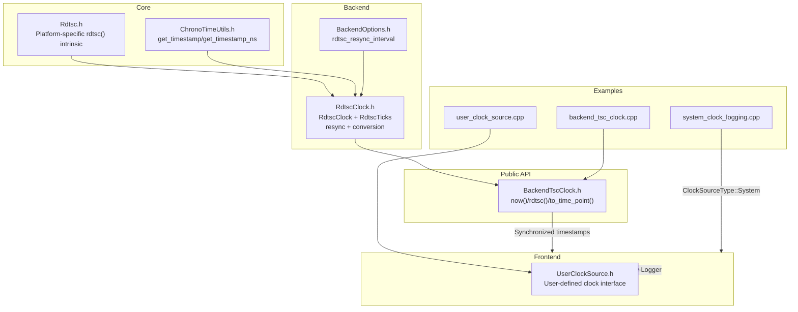
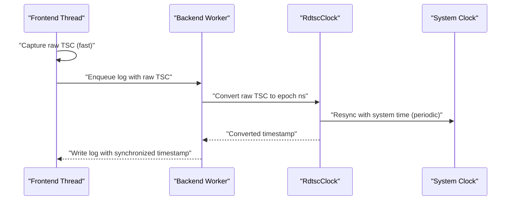
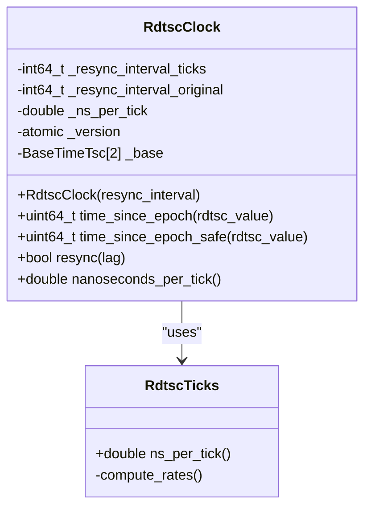
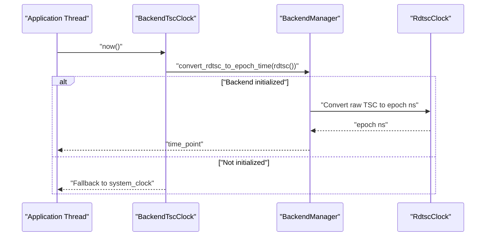
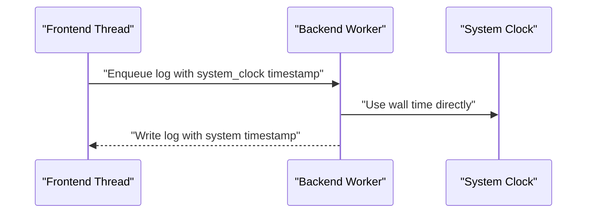
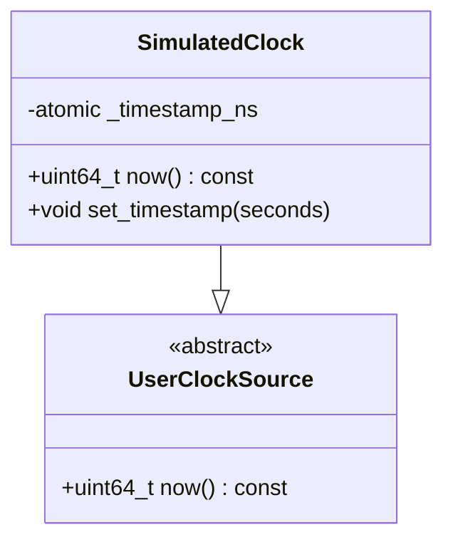
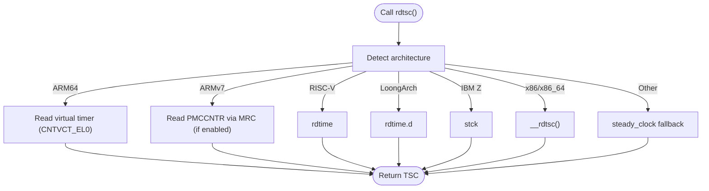
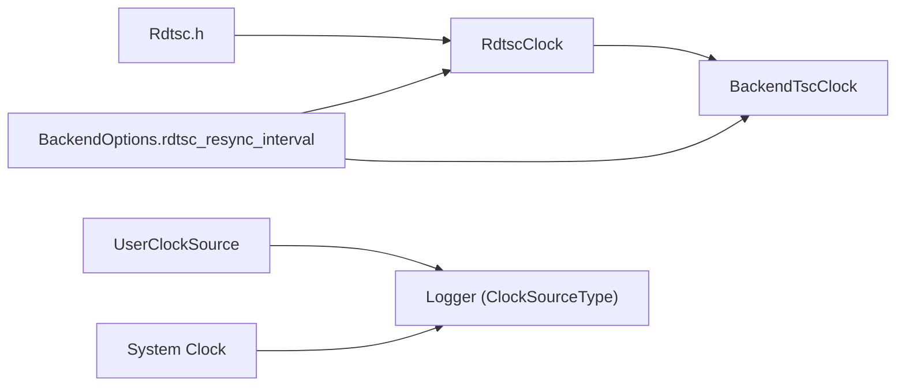

# Clock Source Configuration

<cite>
**Referenced Files in This Document**
- [UserClockSource.h](file://include/quill/UserClockSource.h)
- [RdtscClock.h](file://include/quill/backend/RdtscClock.h)
- [BackendTscClock.h](file://include/quill/BackendTscClock.h)
- [Rdtsc.h](file://include/quill/core/Rdtsc.h)
- [BackendOptions.h](file://include/quill/backend/BackendOptions.h)
- [ChronoTimeUtils.h](file://include/quill/core/ChronoTimeUtils.h)
- [user_clock_source.cpp](file://examples/user_clock_source.cpp)
- [backend_tsc_clock.cpp](file://examples/backend_tsc_clock.cpp)
- [system_clock_logging.cpp](file://examples/system_clock_logging.cpp)
- [quill_hot_path_rdtsc_clock.cpp](file://benchmarks/hot_path_latency/quill_hot_path_rdtsc_clock.cpp)
- [quill_hot_path_system_clock.cpp](file://benchmarks/hot_path_latency/quill_hot_path_system_clock.cpp)
- [BackendTscClockTest.cpp](file://test/integration_tests/BackendTscClockTest.cpp)
- [RdtscClockTest.cpp](file://test/unit_tests/RdtscClockTest.cpp)
- [timestamp_types.rst](file://docs/timestamp_types.rst)
</cite>

## Table of Contents
1. [Introduction](#introduction)
2. [Project Structure](#project-structure)
3. [Core Components](#core-components)
4. [Architecture Overview](#architecture-overview)
5. [Detailed Component Analysis](#detailed-component-analysis)
6. [Dependency Analysis](#dependency-analysis)
7. [Performance Considerations](#performance-considerations)
8. [Troubleshooting Guide](#troubleshooting-guide)
9. [Conclusion](#conclusion)
10. [Appendices](#appendices)

## Introduction
This document explains Quill’s clock source configuration system with a focus on:
- Differences between TSC and System clock sources in terms of accuracy, performance, and platform compatibility
- UserClockSource for custom timestamp sources and integration with external timing systems
- Clock synchronization, multi-core timing consistency, drift compensation, and timestamp ordering guarantees
- Backend TSC clock configuration and its advantages for high-performance logging
- Selection criteria for real-time systems, financial trading platforms, and general-purpose applications
- Examples of custom clock source implementation and integration with hardware timing devices
- Performance analysis comparing clock sources and their logging overhead impact

## Project Structure
Quill organizes clock-related functionality across core utilities, backend synchronization, and user-facing APIs:
- Core low-level TSC access and time utilities
- Backend TSC clock conversion and synchronization
- Public API for retrieving synchronized timestamps from the backend
- Frontend clock source selection via Logger creation
- Examples and tests demonstrating usage and validation

**Diagram sources**
- [Rdtsc.h:1-114](file://include/quill/core/Rdtsc.h#L1-L114)
- [ChronoTimeUtils.h:1-31](file://include/quill/core/ChronoTimeUtils.h#L1-L31)
- [RdtscClock.h:1-265](file://include/quill/backend/RdtscClock.h#L1-L265)
- [BackendOptions.h:1-283](file://include/quill/backend/BackendOptions.h#L1-L283)
- [BackendTscClock.h:1-100](file://include/quill/BackendTscClock.h#L1-L100)
- [UserClockSource.h:1-41](file://include/quill/UserClockSource.h#L1-L41)
- [user_clock_source.cpp:1-83](file://examples/user_clock_source.cpp#L1-L83)
- [backend_tsc_clock.cpp:1-63](file://examples/backend_tsc_clock.cpp#L1-L63)
- [system_clock_logging.cpp:1-42](file://examples/system_clock_logging.cpp#L1-L42)

**Section sources**
- [Rdtsc.h:1-114](file://include/quill/core/Rdtsc.h#L1-L114)
- [RdtscClock.h:1-265](file://include/quill/backend/RdtscClock.h#L1-L265)
- [BackendTscClock.h:1-100](file://include/quill/BackendTscClock.h#L1-L100)
- [BackendOptions.h:1-283](file://include/quill/backend/BackendOptions.h#L1-L283)
- [UserClockSource.h:1-41](file://include/quill/UserClockSource.h#L1-L41)
- [user_clock_source.cpp:1-83](file://examples/user_clock_source.cpp#L1-L83)
- [backend_tsc_clock.cpp:1-63](file://examples/backend_tsc_clock.cpp#L1-L63)
- [system_clock_logging.cpp:1-42](file://examples/system_clock_logging.cpp#L1-L42)

## Core Components
- UserClockSource: An abstract interface for providing custom timestamps in nanoseconds since epoch. Derived classes must be thread-safe if used across multiple threads.
- RdtscClock: Backend-side converter that transforms raw TSC counts to wall-clock nanoseconds since epoch. It periodically resynchronizes with system time and maintains a lock-free conversion path.
- BackendTscClock: Public API for obtaining synchronized timestamps aligned with the backend’s TSC clock. Provides now(), rdtsc(), and to_time_point().
- BackendOptions: Controls rdtsc_resync_interval, affecting synchronization cadence and backend CPU usage.
- Platform-specific rdtsc(): Implemented via intrinsics or assembly depending on architecture; falls back to steady_clock on unsupported platforms.
- Frontend clock selection: Logger creation accepts ClockSourceType::Tsc or ClockSourceType::System.

Key behaviors:
- TSC clock is extremely fast on the frontend (raw rdtsc read), with backend converting to wall time via RdtscClock.
- System clock is straightforward and portable; suitable when precise ordering across heterogeneous clocks is desired.
- UserClockSource enables simulation, replay, and integration with external timing sources.

**Section sources**
- [UserClockSource.h:14-39](file://include/quill/UserClockSource.h#L14-L39)
- [RdtscClock.h:36-166](file://include/quill/backend/RdtscClock.h#L36-L166)
- [BackendTscClock.h:33-98](file://include/quill/BackendTscClock.h#L33-L98)
- [BackendOptions.h:194-207](file://include/quill/backend/BackendOptions.h#L194-L207)
- [Rdtsc.h:40-110](file://include/quill/core/Rdtsc.h#L40-L110)

## Architecture Overview
The clock pipeline integrates frontend, backend, and public API layers:

**Diagram sources**
- [RdtscClock.h:119-166](file://include/quill/backend/RdtscClock.h#L119-L166)
- [BackendTscClock.h:64-73](file://include/quill/BackendTscClock.h#L64-L73)
- [Rdtsc.h:104-110](file://include/quill/core/Rdtsc.h#L104-L110)

## Detailed Component Analysis

### TSC Clock Backend (RdtscClock)
RdtscClock performs:
- Initial calibration to compute nanoseconds-per-tick using repeated steady_clock and rdtsc measurements
- Periodic resynchronization with system time to prevent drift accumulation
- Lock-free conversion of raw TSC to wall-clock epoch time
- Safe conversion path for concurrent access

**Diagram sources**
- [RdtscClock.h:42-116](file://include/quill/backend/RdtscClock.h#L42-L116)
- [RdtscClock.h:119-230](file://include/quill/backend/RdtscClock.h#L119-L230)

**Section sources**
- [RdtscClock.h:65-113](file://include/quill/backend/RdtscClock.h#L65-L113)
- [RdtscClock.h:119-166](file://include/quill/backend/RdtscClock.h#L119-L166)
- [RdtscClock.h:196-230](file://include/quill/backend/RdtscClock.h#L196-L230)

### Backend Synchronized Clock (BackendTscClock)
BackendTscClock exposes:
- now(): Returns synchronized timestamp aligned with backend TSC clock
- rdtsc(): Captures raw TSC value from backend thread context
- to_time_point(): Converts a captured raw TSC to epoch time

Behavior:
- Falls back to system_clock when backend has not initialized TSC clock
- Thread-safe access to synchronized timestamps

**Diagram sources**
- [BackendTscClock.h:64-73](file://include/quill/BackendTscClock.h#L64-L73)
- [BackendTscClock.h:93-97](file://include/quill/BackendTscClock.h#L93-L97)

**Section sources**
- [BackendTscClock.h:33-98](file://include/quill/BackendTscClock.h#L33-L98)
- [BackendTscClockTest.cpp:33-62](file://test/integration_tests/BackendTscClockTest.cpp#L33-L62)

### System Clock Source
System clock source is selected via ClockSourceType::System. It avoids TSC overhead and is portable across architectures.

**Diagram sources**
- [system_clock_logging.cpp:24-28](file://examples/system_clock_logging.cpp#L24-L28)

**Section sources**
- [system_clock_logging.cpp:15-42](file://examples/system_clock_logging.cpp#L15-L42)

### UserClockSource (Custom Clock)
UserClockSource allows injecting custom timestamps (e.g., simulation, replay, or external hardware clocks). The example demonstrates a thread-safe simulated clock.

**Diagram sources**
- [UserClockSource.h:25-39](file://include/quill/UserClockSource.h#L25-L39)
- [user_clock_source.cpp:23-47](file://examples/user_clock_source.cpp#L23-L47)

**Section sources**
- [UserClockSource.h:14-39](file://include/quill/UserClockSource.h#L14-L39)
- [user_clock_source.cpp:19-83](file://examples/user_clock_source.cpp#L19-L83)

### Platform-Specific TSC Access
Rdtsc.h selects the appropriate intrinsic or assembly instruction per platform and falls back to steady_clock when unavailable.

**Diagram sources**
- [Rdtsc.h:42-110](file://include/quill/core/Rdtsc.h#L42-L110)

**Section sources**
- [Rdtsc.h:15-36](file://include/quill/core/Rdtsc.h#L15-L36)
- [Rdtsc.h:42-110](file://include/quill/core/Rdtsc.h#L42-L110)

## Dependency Analysis
Clock source configuration depends on:
- BackendOptions.rdtsc_resync_interval controlling synchronization cadence
- BackendManager coordinating RdtscClock conversions
- Platform intrinsics for raw TSC acquisition
- Frontend Logger creation selecting ClockSourceType

**Diagram sources**
- [BackendOptions.h:194-207](file://include/quill/backend/BackendOptions.h#L194-L207)
- [RdtscClock.h:119-144](file://include/quill/backend/RdtscClock.h#L119-L144)
- [BackendTscClock.h:64-73](file://include/quill/BackendTscClock.h#L64-L73)
- [Rdtsc.h:104-110](file://include/quill/core/Rdtsc.h#L104-L110)
- [UserClockSource.h:25-39](file://include/quill/UserClockSource.h#L25-L39)

**Section sources**
- [BackendOptions.h:194-207](file://include/quill/backend/BackendOptions.h#L194-L207)
- [RdtscClock.h:119-144](file://include/quill/backend/RdtscClock.h#L119-L144)
- [BackendTscClock.h:64-73](file://include/quill/BackendTscClock.h#L64-L73)
- [Rdtsc.h:104-110](file://include/quill/core/Rdtsc.h#L104-L110)
- [UserClockSource.h:25-39](file://include/quill/UserClockSource.h#L25-L39)

## Performance Considerations
- TSC frontend path is extremely fast (raw rdtsc read), with conversion handled by backend RdtscClock
- System clock path avoids TSC overhead and is portable; suitable when cross-core ordering is prioritized
- Backend resynchronization frequency (BackendOptions.rdtsc_resync_interval) trades off accuracy vs. CPU usage
- Benchmarks demonstrate hot-path latency comparisons between TSC and System clock configurations

Practical guidance:
- Use TSC for high-throughput, low-latency logging where ordering is guaranteed by the backend
- Use System clock for portability and deterministic ordering across heterogeneous systems
- Adjust rdtsc_resync_interval to balance drift correction and backend CPU load

**Section sources**
- [timestamp_types.rst:17-25](file://docs/timestamp_types.rst#L17-L25)
- [BackendOptions.h:194-207](file://include/quill/backend/BackendOptions.h#L194-L207)
- [quill_hot_path_rdtsc_clock.cpp:26-92](file://benchmarks/hot_path_latency/quill_hot_path_rdtsc_clock.cpp#L26-L92)
- [quill_hot_path_system_clock.cpp:26-95](file://benchmarks/hot_path_latency/quill_hot_path_system_clock.cpp#L26-L95)

## Troubleshooting Guide
Common issues and remedies:
- BackendTscClock::now() returns zero or fallback to system_clock:
  - Ensure a Logger with TSC clock source has logged at least once to initialize backend TSC clock
  - Verify Backend::start() is called before requesting synchronized timestamps
- Timestamp drift or desynchronization:
  - Reduce rdtsc_resync_interval for stricter synchronization (increases backend CPU usage)
- Multi-core timing inconsistencies:
  - Ensure invariant TSC support on x86/x86_64; platform-specific implementations handle ARM/other architectures
- Timestamp ordering anomalies:
  - Use BackendOptions.log_timestamp_ordering_grace_period to mitigate queue-read timing differences

Validation references:
- BackendTscClockTest checks initialization and bounds against system clock
- RdtscClockTest validates conversion accuracy against system_clock

**Section sources**
- [BackendTscClockTest.cpp:33-62](file://test/integration_tests/BackendTscClockTest.cpp#L33-L62)
- [RdtscClockTest.cpp:10-47](file://test/unit_tests/RdtscClockTest.cpp#L10-L47)
- [BackendOptions.h:103-132](file://include/quill/backend/BackendOptions.h#L103-L132)

## Conclusion
Quill’s clock source configuration balances performance and correctness:
- TSC offers ultra-fast frontend timestamps with backend-driven synchronization and drift control
- System clock provides portability and predictable ordering across diverse systems
- UserClockSource enables advanced scenarios like simulation and hardware integration
- BackendOptions exposes tunables for synchronization cadence and ordering guarantees
Choose the clock source based on application requirements: TSC for high-performance logging, System clock for portability, and UserClockSource for specialized timing needs.

## Appendices

### Clock Source Selection Criteria
- Real-time systems: Prefer TSC for minimal frontend overhead; ensure invariant TSC and tune rdtsc_resync_interval
- Financial trading platforms: Use TSC for sub-microsecond logging; validate drift and ordering guarantees
- General-purpose applications: Use System clock for simplicity and portability; consider UserClockSource for replay or simulation

**Section sources**
- [timestamp_types.rst:17-25](file://docs/timestamp_types.rst#L17-L25)
- [BackendOptions.h:194-207](file://include/quill/backend/BackendOptions.h#L194-L207)

### Example: Custom Clock Source Integration
- Implement a derived class of UserClockSource with a thread-safe now() method
- Pass the instance to Logger creation with ClockSourceType::User
- Keep the instance alive for the logger’s lifetime

**Section sources**
- [UserClockSource.h:14-39](file://include/quill/UserClockSource.h#L14-L39)
- [user_clock_source.cpp:55-76](file://examples/user_clock_source.cpp#L55-L76)

### Example: Backend Synchronized Timestamps
- Start backend, create a TSC-based logger, and flush once to initialize
- Use BackendTscClock::now() and BackendTscClock::rdtsc() for synchronized timestamps

**Section sources**
- [backend_tsc_clock.cpp:21-40](file://examples/backend_tsc_clock.cpp#L21-L40)
- [BackendTscClock.h:64-73](file://include/quill/BackendTscClock.h#L64-L73)