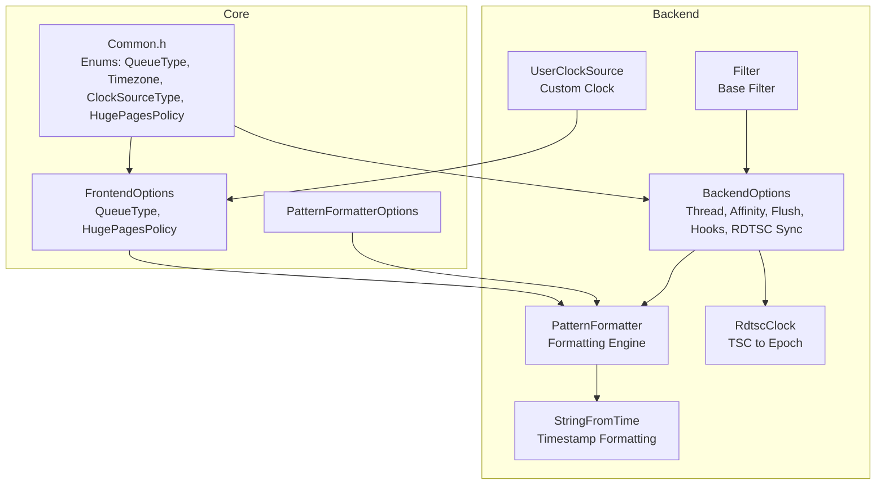
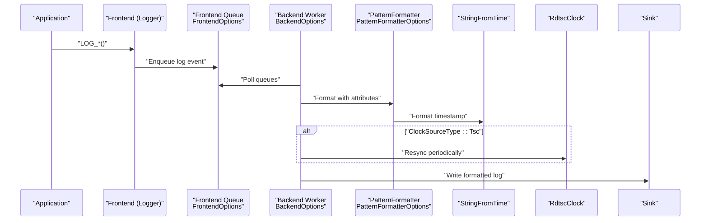
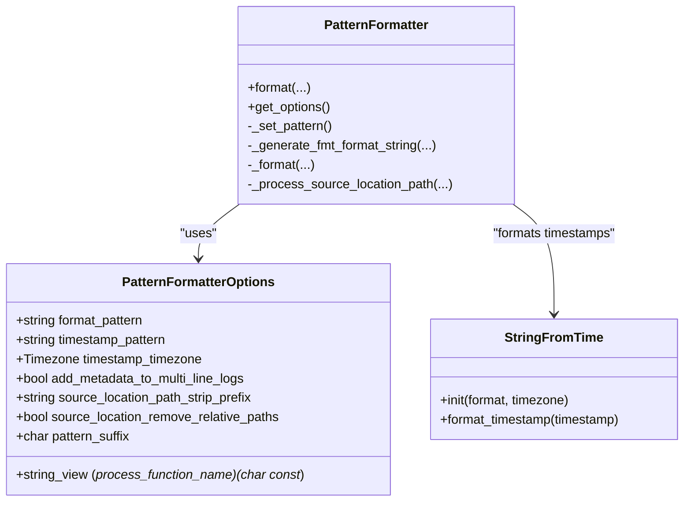
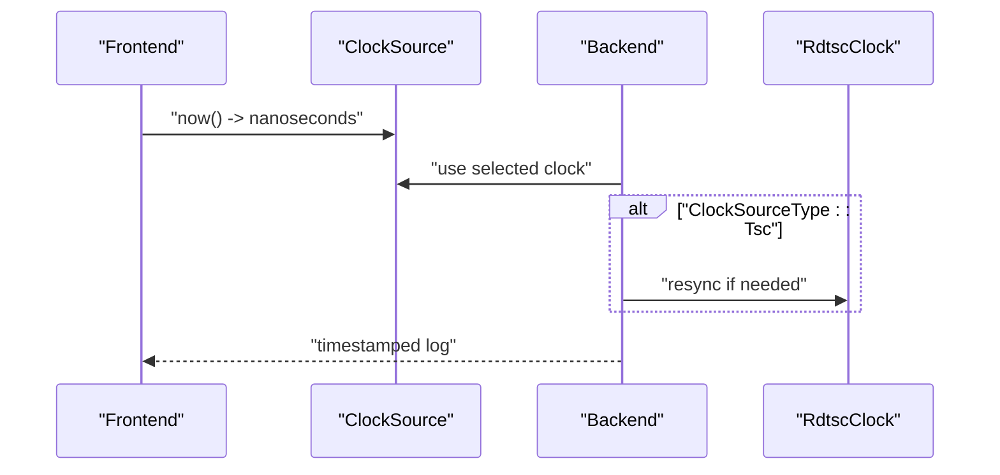
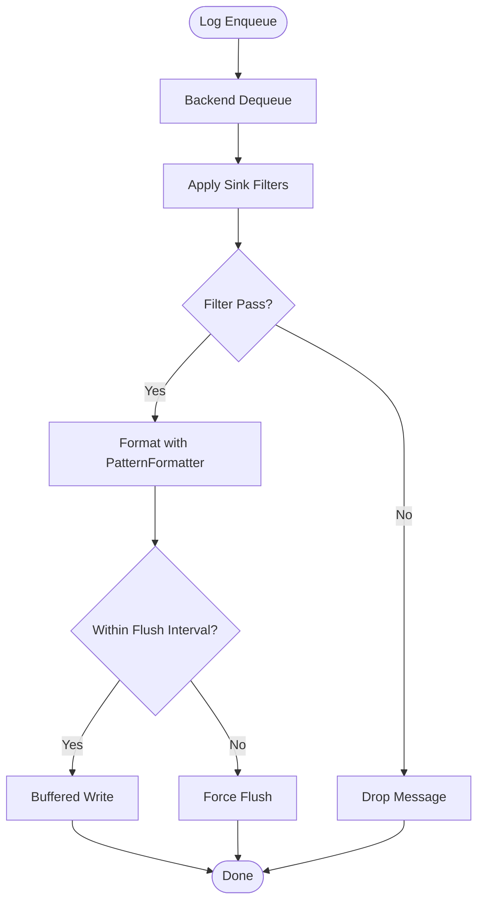
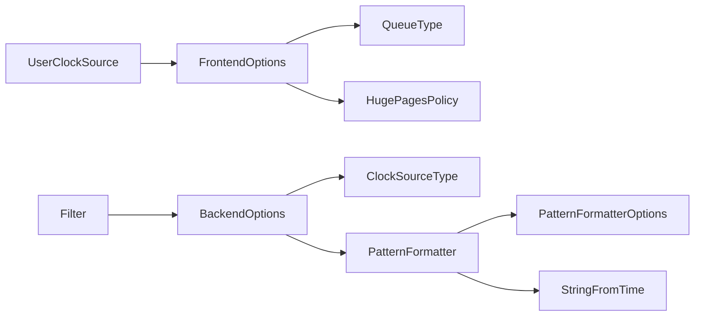

# Configuration & Customization

<cite>
**Referenced Files in This Document**
- [FrontendOptions.h](file://include/quill/core/FrontendOptions.h)
- [Common.h](file://include/quill/core/Common.h)
- [BackendOptions.h](file://include/quill/backend/BackendOptions.h)
- [PatternFormatterOptions.h](file://include/quill/core/PatternFormatterOptions.h)
- [PatternFormatter.h](file://include/quill/backend/PatternFormatter.h)
- [StringFromTime.h](file://include/quill/backend/StringFromTime.h)
- [RdtscClock.h](file://include/quill/backend/RdtscClock.h)
- [UserClockSource.h](file://include/quill/UserClockSource.h)
- [Filter.h](file://include/quill/filters/Filter.h)
- [custom_frontend_options.cpp](file://examples/custom_frontend_options.cpp)
- [backend_tsc_clock.cpp](file://examples/backend_tsc_clock.cpp)
- [system_clock_logging.cpp](file://examples/system_clock_logging.cpp)
- [filter_logging.cpp](file://examples/filter_logging.cpp)
- [user_defined_filter.cpp](file://examples/user_defined_filter.cpp)
</cite>

## Table of Contents
1. [Introduction](#introduction)
2. [Project Structure](#project-structure)
3. [Core Components](#core-components)
4. [Architecture Overview](#architecture-overview)
5. [Detailed Component Analysis](#detailed-component-analysis)
6. [Dependency Analysis](#dependency-analysis)
7. [Performance Considerations](#performance-considerations)
8. [Troubleshooting Guide](#troubleshooting-guide)
9. [Conclusion](#conclusion)
10. [Appendices](#appendices)

## Introduction
This document provides comprehensive configuration and customization guidance for Quill’s logging subsystem. It focuses on:
- FrontendOptions for queue selection, sizing, and memory management
- BackendOptions for thread scheduling, CPU affinity, and performance tuning
- PatternFormatterOptions for customizing log message formats, timestamp formats, and output patterns
- Clock source configuration including TSC vs System clock and user-defined clocks
- Formatter customization via pattern syntax and output format control
- Filter configuration for log level filtering and conditional logging
- Practical configuration examples, performance impact analysis, and best practices across deployment scenarios

## Project Structure
Quill organizes configuration-related APIs across core and backend modules:
- FrontendOptions and queue types are defined in core headers
- BackendOptions governs backend thread behavior, flush intervals, and error notification
- PatternFormatterOptions and PatternFormatter implement flexible formatting
- Clock sources include TSC, System, and user-defined clocks
- Filters provide runtime conditional logging

**Diagram sources**
- [FrontendOptions.h:16-50](file://include/quill/core/FrontendOptions.h#L16-L50)
- [Common.h:145-181](file://include/quill/core/Common.h#L145-L181)
- [BackendOptions.h:30-281](file://include/quill/backend/BackendOptions.h#L30-L281)
- [PatternFormatterOptions.h:23-168](file://include/quill/core/PatternFormatterOptions.h#L23-L168)
- [PatternFormatter.h:33-95](file://include/quill/backend/PatternFormatter.h#L33-L95)
- [StringFromTime.h:49-207](file://include/quill/backend/StringFromTime.h#L49-L207)
- [RdtscClock.h:36-166](file://include/quill/backend/RdtscClock.h#L36-L166)
- [UserClockSource.h:25-39](file://include/quill/UserClockSource.h#L25-L39)
- [Filter.h:26-70](file://include/quill/filters/Filter.h#L26-L70)

**Section sources**
- [FrontendOptions.h:16-50](file://include/quill/core/FrontendOptions.h#L16-L50)
- [Common.h:145-181](file://include/quill/core/Common.h#L145-L181)
- [BackendOptions.h:30-281](file://include/quill/backend/BackendOptions.h#L30-L281)
- [PatternFormatterOptions.h:23-168](file://include/quill/core/PatternFormatterOptions.h#L23-L168)
- [PatternFormatter.h:33-95](file://include/quill/backend/PatternFormatter.h#L33-L95)
- [StringFromTime.h:49-207](file://include/quill/backend/StringFromTime.h#L49-L207)
- [RdtscClock.h:36-166](file://include/quill/backend/RdtscClock.h#L36-L166)
- [UserClockSource.h:25-39](file://include/quill/UserClockSource.h#L25-L39)
- [Filter.h:26-70](file://include/quill/filters/Filter.h#L26-L70)

## Core Components
- FrontendOptions: Defines queue behavior (bounded/unbounded, blocking/dropping), initial capacity, retry interval, maximum capacity for unbounded queues, and huge pages policy.
- BackendOptions: Controls backend thread name, idle yielding, sleep duration, transit event buffer sizing, timestamp ordering grace period, CPU affinity, flush intervals, printable character filtering, log level descriptors, singleton instance check, and hooks.
- PatternFormatterOptions: Configures format pattern, timestamp pattern, timezone, path prefix stripping, function name processing, multiline metadata inclusion, relative path removal, and pattern suffix behavior.
- PatternFormatter: Implements the formatting engine, supports multi-line handling, named arguments, and integrates with StringFromTime for timestamp formatting.
- Clock Sources: TSC-based clock with periodic resynchronization, System clock, and user-defined clock source via UserClockSource.
- Filters: Base Filter interface enabling conditional logging at the sink level.

**Section sources**
- [FrontendOptions.h:16-50](file://include/quill/core/FrontendOptions.h#L16-L50)
- [Common.h:145-181](file://include/quill/core/Common.h#L145-L181)
- [BackendOptions.h:30-281](file://include/quill/backend/BackendOptions.h#L30-L281)
- [PatternFormatterOptions.h:23-168](file://include/quill/core/PatternFormatterOptions.h#L23-L168)
- [PatternFormatter.h:33-95](file://include/quill/backend/PatternFormatter.h#L33-L95)
- [StringFromTime.h:49-207](file://include/quill/backend/StringFromTime.h#L49-L207)
- [RdtscClock.h:36-166](file://include/quill/backend/RdtscClock.h#L36-L166)
- [UserClockSource.h:25-39](file://include/quill/UserClockSource.h#L25-L39)
- [Filter.h:26-70](file://include/quill/filters/Filter.h#L26-L70)

## Architecture Overview
The configuration pipeline connects frontend queueing, backend processing, and sink formatting:
- FrontendOptions configure per-thread queues and memory policies
- BackendOptions tune backend thread behavior, buffer limits, and flush intervals
- PatternFormatterOptions and PatternFormatter shape the final log output
- Clock sources provide timestamps; TSC requires periodic resynchronization
- Filters apply conditional logic before writing to sinks

**Diagram sources**
- [FrontendOptions.h:16-50](file://include/quill/core/FrontendOptions.h#L16-L50)
- [BackendOptions.h:30-281](file://include/quill/backend/BackendOptions.h#L30-L281)
- [PatternFormatterOptions.h:23-168](file://include/quill/core/PatternFormatterOptions.h#L23-L168)
- [PatternFormatter.h:97-177](file://include/quill/backend/PatternFormatter.h#L97-L177)
- [StringFromTime.h:73-207](file://include/quill/backend/StringFromTime.h#L73-L207)
- [RdtscClock.h:119-166](file://include/quill/backend/RdtscClock.h#L119-L166)

## Detailed Component Analysis

### FrontendOptions
- Queue types:
  - UnboundedBlocking: grows up to a maximum, then blocks
  - UnboundedDropping: grows up to a maximum, then drops
  - BoundedBlocking: fixed capacity, blocks when full
  - BoundedDropping: fixed capacity, drops when full
- Defaults:
  - Queue type: UnboundedBlocking
  - Initial capacity: 128 KiB
  - Blocking retry interval: 800 ns
  - Unbounded max capacity: 2 GiB
  - Huge pages policy: Never (Linux only)
- Memory management:
  - HugePagesPolicy controls allocation strategy for queues on Linux
- Compile-time customization:
  - Template-based FrontendImpl and LoggerImpl accept custom FrontendOptions

Practical example: [custom_frontend_options.cpp:14-27](file://examples/custom_frontend_options.cpp#L14-L27)

**Section sources**
- [FrontendOptions.h:16-50](file://include/quill/core/FrontendOptions.h#L16-L50)
- [Common.h:145-151](file://include/quill/core/Common.h#L145-L151)
- [custom_frontend_options.cpp:14-27](file://examples/custom_frontend_options.cpp#L14-L27)

### BackendOptions
- Thread identity and scheduling:
  - thread_name: backend thread name
  - enable_yield_when_idle: yield when idle and sleep_duration is 0
  - sleep_duration: idle sleep interval
  - cpu_affinity: bind backend to CPU (undefined sentinel value disables binding)
- Buffering and ordering:
  - transit_event_buffer_initial_capacity: per-frontend buffer capacity (power of two)
  - transit_events_soft_limit: global soft limit across all frontend threads
  - transit_events_hard_limit: per-frontend hard limit
  - log_timestamp_ordering_grace_period: enforce ordering by adjusting backend timestamp window
- Lifecycle and safety:
  - wait_for_queues_to_empty_before_exit: block shutdown until queues drain
  - check_backend_singleton_instance: detect multiple backend instances (Windows mutex, POSIX semaphore)
- Flush control:
  - sink_min_flush_interval: minimum flush interval across all sinks
- Error reporting:
  - error_notifier: callback invoked on backend exceptions
- Hooks:
  - backend_worker_on_poll_begin/end: instrumentation hooks
- TSC synchronization:
  - rdtsc_resync_interval: frequency to resync RDTSC with system clock
- Printable character filtering:
  - check_printable_char: filter non-printable characters before writing
- Log level descriptors:
  - log_level_descriptions and log_level_short_codes: human-readable and short codes

Practical example: [system_clock_logging.cpp:18-28](file://examples/system_clock_logging.cpp#L18-L28)

**Section sources**
- [BackendOptions.h:30-281](file://include/quill/backend/BackendOptions.h#L30-L281)
- [system_clock_logging.cpp:18-28](file://examples/system_clock_logging.cpp#L18-L28)

### PatternFormatterOptions
- format_pattern: defines the overall structure and attribute placeholders
- timestamp_pattern: strftime-like with additional %Qms/%Qus/%Qns specifiers
- timestamp_timezone: LocalTime or GmtTime
- add_metadata_to_multi_line_logs: repeat metadata on each line for multi-line messages
- source_location_path_strip_prefix: remove a leading path prefix from source locations
- process_function_name: optional function to post-process detailed function names
- source_location_remove_relative_paths: simplify source paths by removing relative segments
- pattern_suffix: appended character to each formatted line; NO_SUFFIX disables suffix

Supported attributes in format_pattern include time, file_name, caller_function, log_level, log_level_short_code, line_number, logger, full_path, thread_id, thread_name, process_id, source_location, short_source_location, message, tags, and named_args.

Practical example: [system_clock_logging.cpp:26-28](file://examples/system_clock_logging.cpp#L26-L28)

**Section sources**
- [PatternFormatterOptions.h:23-168](file://include/quill/core/PatternFormatterOptions.h#L23-L168)
- [system_clock_logging.cpp:26-28](file://examples/system_clock_logging.cpp#L26-L28)

### PatternFormatter
- Construction: accepts PatternFormatterOptions and initializes a TimestampFormatter
- format: handles single-line and multi-line messages, optional named_args, and pattern suffix behavior
- Attribute mapping: lazily evaluates only used attributes and formats them efficiently
- Integration: delegates timestamp formatting to StringFromTime

**Diagram sources**
- [PatternFormatterOptions.h:23-168](file://include/quill/core/PatternFormatterOptions.h#L23-L168)
- [PatternFormatter.h:33-95](file://include/quill/backend/PatternFormatter.h#L33-L95)
- [PatternFormatter.h:234-466](file://include/quill/backend/PatternFormatter.h#L234-L466)
- [StringFromTime.h:49-207](file://include/quill/backend/StringFromTime.h#L49-L207)

**Section sources**
- [PatternFormatter.h:33-95](file://include/quill/backend/PatternFormatter.h#L33-L95)
- [PatternFormatter.h:234-466](file://include/quill/backend/PatternFormatter.h#L234-L466)
- [StringFromTime.h:49-207](file://include/quill/backend/StringFromTime.h#L49-L207)

### Clock Source Configuration
- TSC-based logging:
  - ClockSourceType::Tsc uses RDTSC-derived timestamps with periodic resynchronization against system time
  - BackendOption rdtsc_resync_interval controls resync cadence
  - RdtscClock maintains base time/TSC pairs and safely converts TSC to nanoseconds since epoch
- System clock logging:
  - ClockSourceType::System uses std::chrono::system_clock timestamps
- User-defined clock:
  - Derive from UserClockSource to supply custom timestamps; ensure thread-safety if used across threads

**Diagram sources**
- [Common.h:165-170](file://include/quill/core/Common.h#L165-L170)
- [BackendOptions.h:194-207](file://include/quill/backend/BackendOptions.h#L194-L207)
- [RdtscClock.h:119-166](file://include/quill/backend/RdtscClock.h#L119-L166)
- [UserClockSource.h:25-39](file://include/quill/UserClockSource.h#L25-L39)

**Section sources**
- [Common.h:165-170](file://include/quill/core/Common.h#L165-L170)
- [BackendOptions.h:194-207](file://include/quill/backend/BackendOptions.h#L194-L207)
- [RdtscClock.h:119-166](file://include/quill/backend/RdtscClock.h#L119-L166)
- [UserClockSource.h:25-39](file://include/quill/UserClockSource.h#L25-L39)
- [backend_tsc_clock.cpp:24-27](file://examples/backend_tsc_clock.cpp#L24-L27)

### Filter Configuration
- Built-in filter:
  - Sink-level log level filter via set_log_level_filter
- Custom filters:
  - Extend Filter base class and implement filter() to decide whether to write a message
  - Filters are applied by the backend after dequeue and before sink write
- Conditional logging:
  - Filters can inspect metadata, thread info, logger name, log level, and message content

**Diagram sources**
- [Filter.h:54-57](file://include/quill/filters/Filter.h#L54-L57)
- [BackendOptions.h:224-224](file://include/quill/backend/BackendOptions.h#L224-L224)

**Section sources**
- [filter_logging.cpp:26-26](file://examples/filter_logging.cpp#L26-L26)
- [user_defined_filter.cpp:19-47](file://examples/user_defined_filter.cpp#L19-L47)
- [Filter.h:54-57](file://include/quill/filters/Filter.h#L54-L57)

## Dependency Analysis
Key dependencies and relationships:
- FrontendOptions depends on QueueType and HugePagesPolicy enums
- BackendOptions depends on ClockSourceType for TSC resync behavior
- PatternFormatterOptions drives PatternFormatter behavior and StringFromTime formatting
- Filters integrate with sinks and backend processing
- UserClockSource complements FrontendOptions for custom timestamping

**Diagram sources**
- [FrontendOptions.h:16-50](file://include/quill/core/FrontendOptions.h#L16-L50)
- [Common.h:145-181](file://include/quill/core/Common.h#L145-L181)
- [BackendOptions.h:30-281](file://include/quill/backend/BackendOptions.h#L30-L281)
- [PatternFormatterOptions.h:23-168](file://include/quill/core/PatternFormatterOptions.h#L23-L168)
- [PatternFormatter.h:33-95](file://include/quill/backend/PatternFormatter.h#L33-L95)
- [StringFromTime.h:49-207](file://include/quill/backend/StringFromTime.h#L49-L207)
- [UserClockSource.h:25-39](file://include/quill/UserClockSource.h#L25-L39)
- [Filter.h:26-70](file://include/quill/filters/Filter.h#L26-L70)

**Section sources**
- [FrontendOptions.h:16-50](file://include/quill/core/FrontendOptions.h#L16-L50)
- [Common.h:145-181](file://include/quill/core/Common.h#L145-L181)
- [BackendOptions.h:30-281](file://include/quill/backend/BackendOptions.h#L30-L281)
- [PatternFormatterOptions.h:23-168](file://include/quill/core/PatternFormatterOptions.h#L23-L168)
- [PatternFormatter.h:33-95](file://include/quill/backend/PatternFormatter.h#L33-L95)
- [StringFromTime.h:49-207](file://include/quill/backend/StringFromTime.h#L49-L207)
- [UserClockSource.h:25-39](file://include/quill/UserClockSource.h#L25-L39)
- [Filter.h:26-70](file://include/quill/filters/Filter.h#L26-L70)

## Performance Considerations
- Frontend queue sizing:
  - Unbounded queues allow growth up to a maximum; choose capacities aligned with expected burst sizes
  - Blocking vs dropping impacts latency and loss trade-offs
  - Huge pages can reduce TLB pressure on Linux; evaluate overhead vs benefit
- Backend buffer tuning:
  - transit_event_buffer_initial_capacity should be a power of two; adjust soft/hard limits to balance throughput and memory footprint
  - log_timestamp_ordering_grace_period trades correctness for processing speed; larger values reduce out-of-order writes but add latency
  - sink_min_flush_interval reduces I/O churn; set based on durability needs
- Formatting costs:
  - PatternFormatter lazily evaluates used attributes; keep format patterns concise
  - StringFromTime caches and updates only changed components; avoid overly complex timestamp patterns
- Clock source:
  - TSC offers low overhead but requires periodic resync; tune rdtsc_resync_interval to balance accuracy and CPU usage
  - System clock avoids drift but may vary with NTP adjustments

[No sources needed since this section provides general guidance]

## Troubleshooting Guide
- Backend singleton detection:
  - check_backend_singleton_instance prevents multiple backend workers; disable only if necessary and understand risks
- Error notifications:
  - error_notifier receives backend exceptions; avoid blocking operations inside
- Printables filtering:
  - check_printable_char sanitizes output; customize to allow additional characters if needed
- Multi-frontend thread ordering:
  - log_timestamp_ordering_grace_period mitigates out-of-order writes due to queue arrival timing
- Filter behavior:
  - Built-in log level filters and custom filters run after enqueue; confirm expected filtering semantics

**Section sources**
- [BackendOptions.h:260-281](file://include/quill/backend/BackendOptions.h#L260-L281)
- [BackendOptions.h:169-178](file://include/quill/backend/BackendOptions.h#L169-L178)
- [BackendOptions.h:239-240](file://include/quill/backend/BackendOptions.h#L239-L240)
- [BackendOptions.h:132-132](file://include/quill/backend/BackendOptions.h#L132-L132)
- [Filter.h:54-57](file://include/quill/filters/Filter.h#L54-L57)

## Conclusion
Quill’s configuration model separates frontend queueing, backend processing, and sink formatting concerns. By tuning FrontendOptions for queue behavior and memory, BackendOptions for thread scheduling and flush policies, and PatternFormatterOptions for output formatting, applications can achieve optimal performance and readability. Clock source selection influences timestamp accuracy and CPU usage, while filters enable robust conditional logging. Use the provided examples as templates for production-grade configurations tailored to your deployment environment.

[No sources needed since this section summarizes without analyzing specific files]

## Appendices

### Configuration Examples Index
- Custom FrontendOptions: [custom_frontend_options.cpp:14-27](file://examples/custom_frontend_options.cpp#L14-L27)
- System clock logging: [system_clock_logging.cpp:26-28](file://examples/system_clock_logging.cpp#L26-L28)
- Backend TSC clock usage: [backend_tsc_clock.cpp:24-27](file://examples/backend_tsc_clock.cpp#L24-L27)
- Built-in filter usage: [filter_logging.cpp:26-26](file://examples/filter_logging.cpp#L26-L26)
- Custom filter usage: [user_defined_filter.cpp:19-47](file://examples/user_defined_filter.cpp#L19-L47)

[No sources needed since this section indexes previously cited examples]