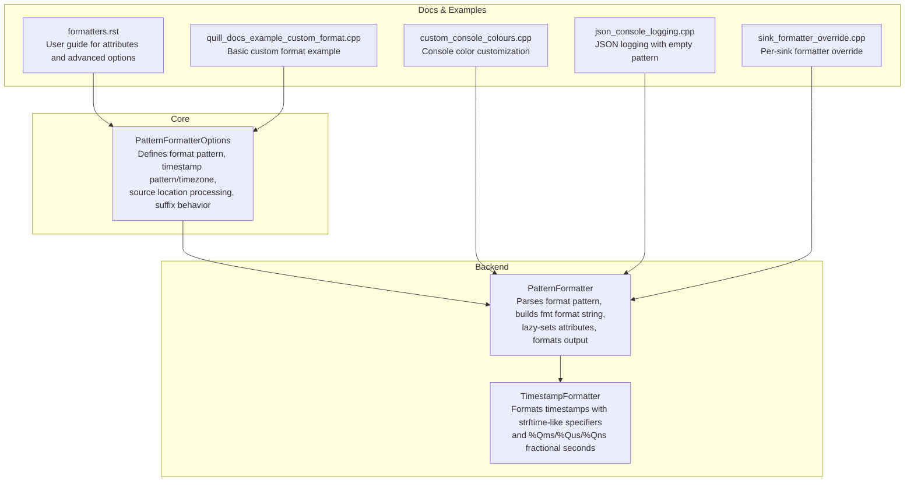
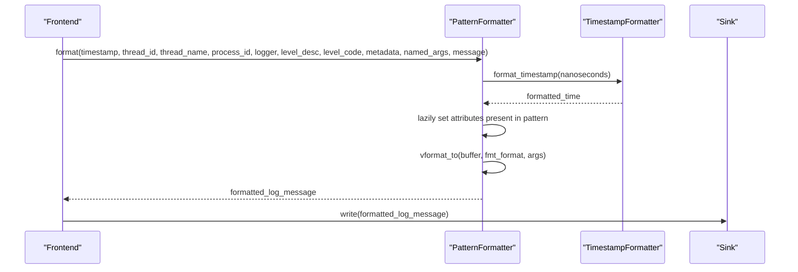
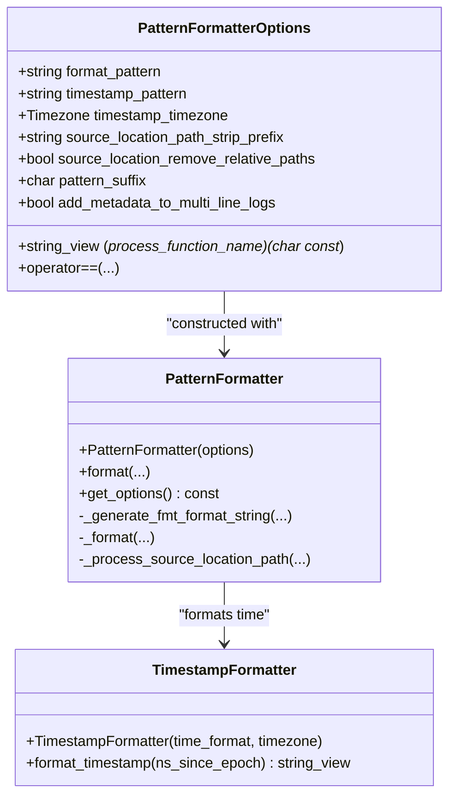

# Formatter Configuration

<cite>
**Referenced Files in This Document**
- [PatternFormatterOptions.h](file://include/quill/core/PatternFormatterOptions.h)
- [PatternFormatter.h](file://include/quill/backend/PatternFormatter.h)
- [TimestampFormatter.h](file://include/quill/backend/TimestampFormatter.h)
- [formatters.rst](file://docs/formatters.rst)
- [custom_console_colours.cpp](file://examples/custom_console_colours.cpp)
- [json_console_logging.cpp](file://examples/json_console_logging.cpp)
- [sink_formatter_override.cpp](file://examples/sink_formatter_override.cpp)
- [quill_docs_example_custom_format.cpp](file://docs/examples/quill_docs_example_custom_format.cpp)
- [PatternFormatterTest.cpp](file://test/unit_tests/PatternFormatterTest.cpp)
- [binary_protocols.rst](file://docs/binary_protocols.rst)
</cite>

## Table of Contents
1. [Introduction](#introduction)
2. [Project Structure](#project-structure)
3. [Core Components](#core-components)
4. [Architecture Overview](#architecture-overview)
5. [Detailed Component Analysis](#detailed-component-analysis)
6. [Dependency Analysis](#dependency-analysis)
7. [Performance Considerations](#performance-considerations)
8. [Troubleshooting Guide](#troubleshooting-guide)
9. [Conclusion](#conclusion)
10. [Appendices](#appendices)

## Introduction
This document explains Quill’s formatter configuration system with a focus on PatternFormatterOptions and PatternFormatter. It covers how to customize log message formats, timestamp formatting, source location handling, and custom field formatting. It also documents how to integrate structured logging formats, control output formats (including console colors and JSON), and optimize performance for high-throughput scenarios. Practical configuration examples are included for development debugging, production monitoring, and audit logging.

## Project Structure
The formatter configuration lives in the core and backend layers:
- PatternFormatterOptions defines the user-facing configuration for log formatting.
- PatternFormatter implements the formatting engine and integrates with TimestampFormatter for time formatting.
- Examples and tests demonstrate real-world usage patterns and edge cases.

**Diagram sources**
- [PatternFormatterOptions.h:23-168](file://include/quill/core/PatternFormatterOptions.h#L23-L168)
- [PatternFormatter.h:33-608](file://include/quill/backend/PatternFormatter.h#L33-L608)
- [TimestampFormatter.h:38-218](file://include/quill/backend/TimestampFormatter.h#L38-L218)
- [formatters.rst:1-186](file://docs/formatters.rst#L1-L186)
- [custom_console_colours.cpp:14-47](file://examples/custom_console_colours.cpp#L14-L47)
- [json_console_logging.cpp:10-34](file://examples/json_console_logging.cpp#L10-L34)
- [sink_formatter_override.cpp:18-33](file://examples/sink_formatter_override.cpp#L18-L33)
- [quill_docs_example_custom_format.cpp:11-17](file://docs/examples/quill_docs_example_custom_format.cpp#L11-L17)

**Section sources**
- [PatternFormatterOptions.h:17-168](file://include/quill/core/PatternFormatterOptions.h#L17-L168)
- [PatternFormatter.h:70-177](file://include/quill/backend/PatternFormatter.h#L70-L177)
- [TimestampFormatter.h:49-174](file://include/quill/backend/TimestampFormatter.h#L49-L174)
- [formatters.rst:1-186](file://docs/formatters.rst#L1-L186)

## Core Components
- PatternFormatterOptions
  - Controls the overall format pattern, timestamp pattern and timezone, source location path processing, function name processing callback, multi-line metadata behavior, and pattern suffix.
  - Provides equality comparison for option sets.
- PatternFormatter
  - Parses the format pattern into a fmt-compatible format string and orders named arguments.
  - Lazily evaluates only the attributes present in the pattern.
  - Handles multi-line messages and optional trailing suffix behavior.
- TimestampFormatter
  - Formats timestamps using strftime-like specifiers plus %Qms/%Qus/%Qns for fractional seconds.
  - Supports splitting the format string into two parts around the fractional seconds specifier.

Key configuration fields and behaviors are documented in the header comments and user guide.

**Section sources**
- [PatternFormatterOptions.h:23-168](file://include/quill/core/PatternFormatterOptions.h#L23-L168)
- [PatternFormatter.h:79-177](file://include/quill/backend/PatternFormatter.h#L79-L177)
- [TimestampFormatter.h:51-174](file://include/quill/backend/TimestampFormatter.h#L51-L174)
- [formatters.rst:101-186](file://docs/formatters.rst#L101-L186)

## Architecture Overview
The formatter pipeline converts raw log metadata and message into a final formatted string:

**Diagram sources**
- [PatternFormatter.h:97-177](file://include/quill/backend/PatternFormatter.h#L97-L177)
- [TimestampFormatter.h:122-174](file://include/quill/backend/TimestampFormatter.h#L122-L174)

## Detailed Component Analysis

### PatternFormatterOptions
PatternFormatterOptions exposes:
- format_pattern: The primary log message template using attribute placeholders.
- timestamp_pattern: Strftime-like pattern supporting %Qms/%Qus/%Qns.
- timestamp_timezone: LocalTime or GmtTime.
- add_metadata_to_multi_line_logs: Whether to repeat metadata on continuation lines.
- pattern_suffix: Character appended to each formatted record; NO_SUFFIX disables appending.
- source_location_path_strip_prefix: Removes a leading path prefix from source_location.
- source_location_remove_relative_paths: Normalizes relative path segments from source_location.
- process_function_name: Optional callback to post-process detailed function names.

Usage examples:
- Custom console format with width specifiers and timezone.
- JSON-only logging with empty format pattern to bypass text formatting.
- Per-sink formatter override to vary output formats for the same logger.

**Section sources**
- [PatternFormatterOptions.h:27-168](file://include/quill/core/PatternFormatterOptions.h#L27-L168)
- [formatters.rst:101-186](file://docs/formatters.rst#L101-L186)
- [quill_docs_example_custom_format.cpp:11-17](file://docs/examples/quill_docs_example_custom_format.cpp#L11-L17)
- [json_console_logging.cpp:20-24](file://examples/json_console_logging.cpp#L20-L24)
- [sink_formatter_override.cpp:22-30](file://examples/sink_formatter_override.cpp#L22-L30)

### PatternFormatter
Responsibilities:
- Parse format_pattern and build a fmt format string with named arguments.
- Track which attributes are present using a bitset for lazy evaluation.
- Support custom format specifiers after the colon in placeholders (e.g., %(attr:<N)).
- Handle multi-line messages and suffix behavior.
- Integrate with TimestampFormatter for time formatting.

Important behaviors:
- Empty format_pattern returns an empty string (useful for structured sinks).
- Multi-line handling repeats metadata on each line unless disabled.
- Suffix handling avoids duplicating newlines when the incoming message already ends with newline.

**Section sources**
- [PatternFormatter.h:234-466](file://include/quill/backend/PatternFormatter.h#L234-L466)
- [PatternFormatter.h:469-588](file://include/quill/backend/PatternFormatter.h#L469-L588)
- [PatternFormatterTest.cpp:423-454](file://test/unit_tests/PatternFormatterTest.cpp#L423-L454)
- [PatternFormatterTest.cpp:129-203](file://test/unit_tests/PatternFormatterTest.cpp#L129-L203)

### TimestampFormatter
Capabilities:
- Accepts strftime-like specifiers plus %Qms/%Qus/%Qns.
- Validates mutual exclusivity of fractional second specifiers.
- Splits the format string into two parts around the fractional seconds specifier to minimize allocations.
- Writes fractional seconds in-place to avoid extra copies.

**Section sources**
- [TimestampFormatter.h:51-174](file://include/quill/backend/TimestampFormatter.h#L51-L174)
- [PatternFormatterTest.cpp:90-203](file://test/unit_tests/PatternFormatterTest.cpp#L90-L203)

### Pattern Syntax and Formatting Directives
Supported attributes in the format pattern:
- time, file_name, full_path, caller_function, log_level, log_level_short_code, line_number, logger, message, thread_id, thread_name, process_id, source_location, short_source_location, tags, named_args.

Custom format specifiers:
- Placeholders can include a custom width/alignment specifier after a colon, which is preserved in the fmt format string.

Timestamp specifiers:
- Standard strftime specifiers plus %Qms, %Qus, %Qns for fractional seconds.

Examples from documentation and tests:
- Basic custom format with width specifiers and timezone.
- Timestamp with nanosecond precision.
- Timestamp with microseconds and milliseconds.
- Empty format pattern for pure JSON logging.

**Section sources**
- [PatternFormatterOptions.h:47-70](file://include/quill/core/PatternFormatterOptions.h#L47-L70)
- [PatternFormatter.h:355-466](file://include/quill/backend/PatternFormatter.h#L355-L466)
- [formatters.rst:17-90](file://docs/formatters.rst#L17-L90)
- [PatternFormatterTest.cpp:56-88](file://test/unit_tests/PatternFormatterTest.cpp#L56-L88)
- [PatternFormatterTest.cpp:90-203](file://test/unit_tests/PatternFormatterTest.cpp#L90-L203)

### Custom Formatter Development and Integration
- Extending existing formatters: Use PatternFormatterOptions to tailor attributes and timestamp behavior; PatternFormatter handles the rest.
- Integrating structured logging formats:
  - For JSON sinks, set format_pattern to empty to avoid unnecessary text formatting overhead.
  - Use LOGJ_ macros or manual named args to emit structured key-value payloads.
- Per-sink overrides: Configure ConsoleSinkConfig or similar sinks to supply their own PatternFormatterOptions, enabling different formats for different outputs from the same logger.

**Section sources**
- [json_console_logging.cpp:20-33](file://examples/json_console_logging.cpp#L20-L33)
- [sink_formatter_override.cpp:22-30](file://examples/sink_formatter_override.cpp#L22-L30)
- [formatters.rst:101-186](file://docs/formatters.rst#L101-L186)

### Output Format Control
- Console color formatting: Configure colors per log level on ConsoleSinkConfig to visually distinguish severity.
- JSON formatting: Prefer empty format pattern with JSON sinks to emit structured logs without extra text formatting.
- Custom binary formats: Use BinaryDataDeferredFormatCodec with a custom fmtquill::formatter specialization for high-throughput binary logging.

**Section sources**
- [custom_console_colours.cpp:20-32](file://examples/custom_console_colours.cpp#L20-L32)
- [json_console_logging.cpp:20-33](file://examples/json_console_logging.cpp#L20-L33)
- [binary_protocols.rst:38-71](file://docs/binary_protocols.rst#L38-L71)

### Practical Format Configurations
- Development debugging
  - Include short_source_location, log_level, logger, and message with aligned widths for readability.
  - Use local time with millisecond precision for quick correlation.
- Production monitoring
  - Include time, process_id, thread_id, logger, log_level, and message; keep patterns concise.
  - Use structured sinks (e.g., JSON) with empty format pattern for downstream parsing.
- Audit logging
  - Include full_path, line_number, caller_function, and tags/named_args for traceability.
  - Use UTC timestamps with nanosecond precision and disable multi-line metadata repetition if needed.

**Section sources**
- [quill_docs_example_custom_format.cpp:11-17](file://docs/examples/quill_docs_example_custom_format.cpp#L11-L17)
- [json_console_logging.cpp:20-33](file://examples/json_console_logging.cpp#L20-L33)
- [formatters.rst:101-186](file://docs/formatters.rst#L101-L186)

## Dependency Analysis
PatternFormatterOptions drives PatternFormatter, which depends on TimestampFormatter for time formatting. Tests exercise the interplay between these components and validate behavior across different patterns and timestamp precisions.

**Diagram sources**
- [PatternFormatterOptions.h:23-168](file://include/quill/core/PatternFormatterOptions.h#L23-L168)
- [PatternFormatter.h:79-177](file://include/quill/backend/PatternFormatter.h#L79-L177)
- [TimestampFormatter.h:51-174](file://include/quill/backend/TimestampFormatter.h#L51-L174)

**Section sources**
- [PatternFormatter.h:234-466](file://include/quill/backend/PatternFormatter.h#L234-L466)
- [PatternFormatterTest.cpp:327-345](file://test/unit_tests/PatternFormatterTest.cpp#L327-L345)

## Performance Considerations
- Lazy evaluation: PatternFormatter only formats attributes present in the pattern, reducing work when not needed.
- Pre-built format string: PatternFormatter converts the pattern into a fmt format string once and reuses it.
- Memory buffers: Reuses internal memory buffers to minimize allocations during formatting.
- Timestamp formatting: TimestampFormatter splits the format string around fractional seconds to reduce reallocations.
- Multi-line handling: Avoids repeating metadata when disabled to reduce output size and CPU work.
- JSON-only logging: Setting an empty format pattern eliminates text formatting overhead for structured sinks.
- Binary logging: Use BinaryDataDeferredFormatCodec to defer expensive formatting to the backend thread.

Recommendations:
- Keep format patterns minimal when throughput is critical.
- Use empty format pattern with structured sinks for machine-readable logs.
- Prefer millisecond or microsecond precision unless sub-microsecond accuracy is required.
- Avoid overly complex custom format specifiers that increase formatting cost.

**Section sources**
- [PatternFormatter.h:469-588](file://include/quill/backend/PatternFormatter.h#L469-L588)
- [TimestampFormatter.h:122-174](file://include/quill/backend/TimestampFormatter.h#L122-L174)
- [PatternFormatterTest.cpp:423-454](file://test/unit_tests/PatternFormatterTest.cpp#L423-L454)
- [binary_protocols.rst:10-16](file://docs/binary_protocols.rst#L10-L16)

## Troubleshooting Guide
Common issues and resolutions:
- Invalid format pattern
  - Symptoms: Exceptions thrown during PatternFormatter construction.
  - Causes: Missing closing parenthesis, unknown attribute name.
  - Resolution: Ensure balanced parentheses and use documented attribute names.
- Unexpected suffix behavior
  - Symptoms: Extra newlines or missing newlines.
  - Causes: pattern_suffix setting and incoming message newline.
  - Resolution: Adjust pattern_suffix or normalize message newlines.
- Multi-line metadata duplication
  - Symptoms: Metadata repeated on continuation lines.
  - Resolution: Toggle add_metadata_to_multi_line_logs to false for compact multi-line output.
- Source location path verbosity
  - Symptoms: Long or platform-specific paths.
  - Resolution: Set source_location_path_strip_prefix and optionally source_location_remove_relative_paths.
- Function name verbosity
  - Symptoms: Verbose compiler-specific signatures.
  - Resolution: Enable detailed function names and provide process_function_name callback to extract concise names.

**Section sources**
- [PatternFormatterTest.cpp:327-345](file://test/unit_tests/PatternFormatterTest.cpp#L327-L345)
- [PatternFormatter.h:124-176](file://include/quill/backend/PatternFormatter.h#L124-L176)
- [PatternFormatter.h:184-231](file://include/quill/backend/PatternFormatter.h#L184-L231)
- [formatters.rst:101-186](file://docs/formatters.rst#L101-L186)

## Conclusion
Quill’s formatter configuration system offers flexible, high-performance control over log message formatting. PatternFormatterOptions lets you tailor attributes, timestamps, and source location presentation, while PatternFormatter efficiently transforms metadata into final output. For structured logging and high-throughput scenarios, combine empty format patterns with JSON sinks, and leverage deferred formatting for binary protocols. Use the provided examples and tests as references for building robust, maintainable logging configurations across development, production, and audit use cases.

## Appendices

### Attribute Reference
- time: Human-readable timestamp.
- file_name: Filename without path.
- full_path: Full source path.
- caller_function: Function name (or processed function name).
- log_level: Level description.
- log_level_short_code: Abbreviated level code.
- line_number: Source line number.
- logger: Logger name.
- message: Logged message.
- thread_id: Thread identifier.
- thread_name: Thread name.
- process_id: Process identifier.
- source_location: Full path and line number.
- short_source_location: Filename and line number.
- tags: Tags attached via tagging macros.
- named_args: Comma-separated key:value pairs.

**Section sources**
- [PatternFormatterOptions.h:47-70](file://include/quill/core/PatternFormatterOptions.h#L47-L70)
- [formatters.rst:17-71](file://docs/formatters.rst#L17-L71)