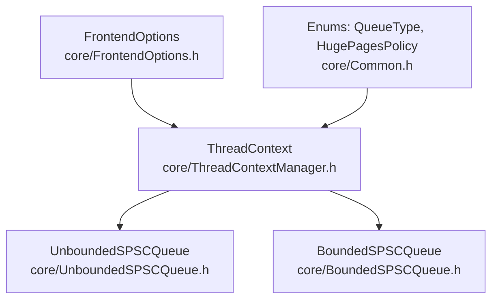
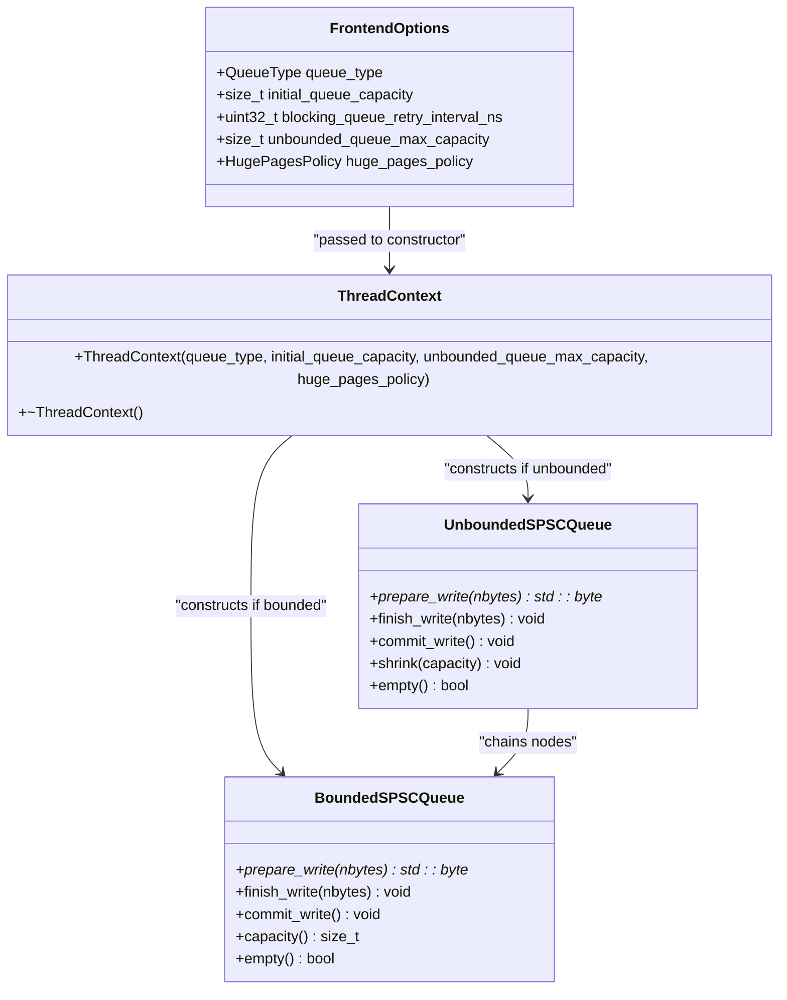
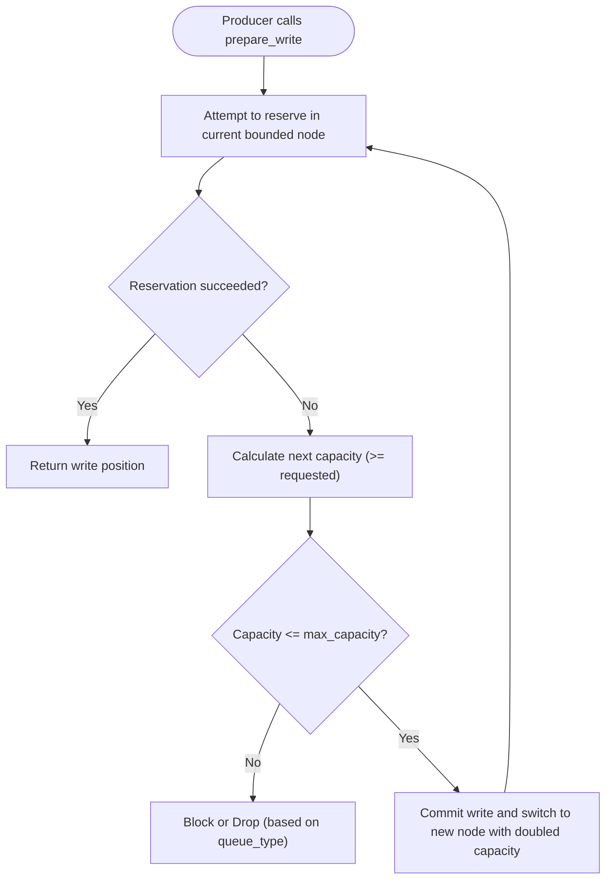
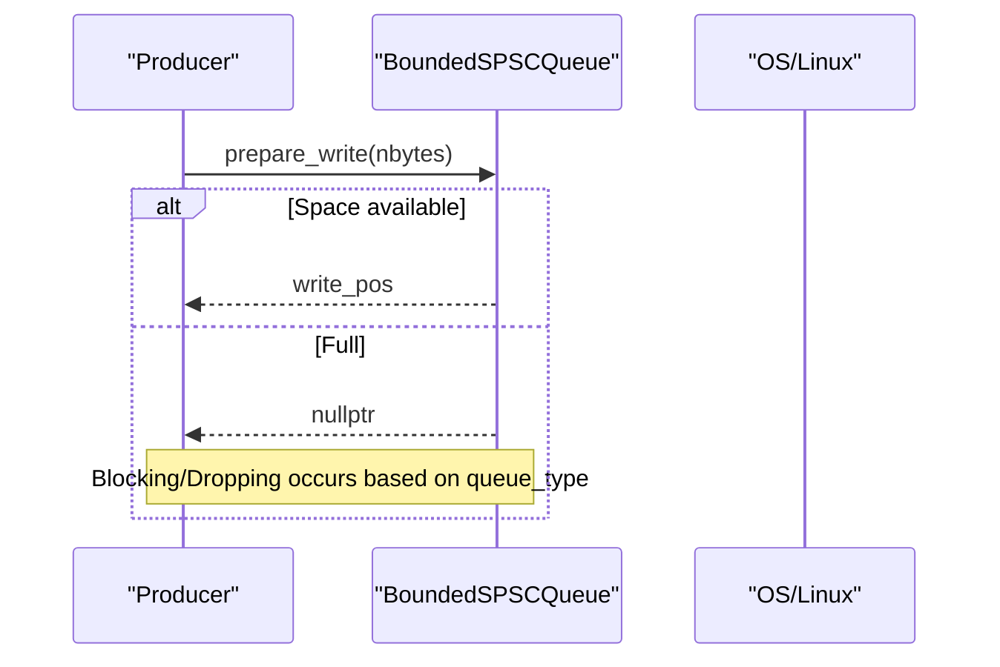
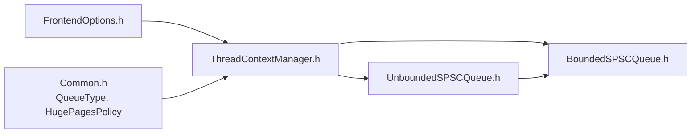

# Frontend Configuration

<cite>
**Referenced Files in This Document**
- [FrontendOptions.h](file://include/quill/core/FrontendOptions.h)
- [Common.h](file://include/quill/core/Common.h)
- [BoundedSPSCQueue.h](file://include/quill/core/BoundedSPSCQueue.h)
- [UnboundedSPSCQueue.h](file://include/quill/core/UnboundedSPSCQueue.h)
- [ThreadContextManager.h](file://include/quill/core/ThreadContextManager.h)
- [frontend_options.rst](file://docs/frontend_options.rst)
- [custom_frontend_options.cpp](file://examples/custom_frontend_options.cpp)
- [bounded_dropping_queue_frontend.cpp](file://examples/bounded_dropping_queue_frontend.cpp)
- [quill_backend_throughput.cpp](file://benchmarks/backend_throughput/quill_backend_throughput.cpp)
- [hot_path_bench.h](file://benchmarks/hot_path_latency/hot_path_bench.h)
- [hot_path_bench_config.h](file://benchmarks/hot_path_latency/hot_path_bench_config.h)
- [LogMacros.h](file://include/quill/LogMacros.h)
- [log_levels.rst](file://docs/log_levels.rst)
</cite>

## Table of Contents
1. [Introduction](#introduction)
2. [Project Structure](#project-structure)
3. [Core Components](#core-components)
4. [Architecture Overview](#architecture-overview)
5. [Detailed Component Analysis](#detailed-component-analysis)
6. [Dependency Analysis](#dependency-analysis)
7. [Performance Considerations](#performance-considerations)
8. [Troubleshooting Guide](#troubleshooting-guide)
9. [Conclusion](#conclusion)
10. [Appendices](#appendices)

## Introduction
This document explains Quill’s FrontendOptions configuration system with a focus on queue types and sizing parameters. It covers:
- Queue types: UnboundedBlocking, UnboundedDropping, BoundedBlocking, BoundedDropping
- Queue sizing parameters: initial_queue_capacity, unbounded_queue_max_capacity, blocking_queue_retry_interval_ns
- Memory management: huge_pages_policy on Linux and its impact on TLB performance
- Compile-time optimizations affecting logging performance
- Practical configuration examples for high-throughput, memory-constrained, and real-time scenarios
- Guidance on benchmarking queue behaviors

## Project Structure
The FrontendOptions configuration is defined in a dedicated header and consumed by the per-thread queue implementations. Documentation and examples complement the core implementation.

**Diagram sources**
- [FrontendOptions.h:16-50](file://include/quill/core/FrontendOptions.h#L16-L50)
- [ThreadContextManager.h:67-80](file://include/quill/core/ThreadContextManager.h#L67-L80)
- [UnboundedSPSCQueue.h:79-85](file://include/quill/core/UnboundedSPSCQueue.h#L79-L85)
- [BoundedSPSCQueue.h:60-69](file://include/quill/core/BoundedSPSCQueue.h#L60-L69)
- [Common.h:145-180](file://include/quill/core/Common.h#L145-L180)

**Section sources**
- [FrontendOptions.h:16-50](file://include/quill/core/FrontendOptions.h#L16-L50)
- [Common.h:145-180](file://include/quill/core/Common.h#L145-L180)
- [ThreadContextManager.h:67-80](file://include/quill/core/ThreadContextManager.h#L67-L80)

## Core Components
- FrontendOptions: Defines queue_type, initial_queue_capacity, blocking_queue_retry_interval_ns, unbounded_queue_max_capacity, and huge_pages_policy.
- QueueType: Enumerates supported queue behaviors.
- HugePagesPolicy: Controls allocation strategy for memory used by queues.
- ThreadContext: Constructs the appropriate queue implementation based on FrontendOptions.

Key behaviors:
- UnboundedBlocking/UnboundedDropping: Grow until reaching unbounded_queue_max_capacity; then either block or drop.
- BoundedBlocking/BoundedDropping: Fixed capacity; block or drop upon overflow.
- huge_pages_policy controls whether huge pages are used on Linux to reduce TLB pressure.

**Section sources**
- [FrontendOptions.h:16-50](file://include/quill/core/FrontendOptions.h#L16-L50)
- [Common.h:145-180](file://include/quill/core/Common.h#L145-L180)
- [ThreadContextManager.h:67-80](file://include/quill/core/ThreadContextManager.h#L67-L80)

## Architecture Overview
The frontend per-thread queue is selected at compile time via FrontendOptions and instantiated in ThreadContext. Unbounded queues internally chain fixed-capacity bounded buffers, enabling growth up to a maximum.

**Diagram sources**
- [FrontendOptions.h:16-50](file://include/quill/core/FrontendOptions.h#L16-L50)
- [ThreadContextManager.h:67-80](file://include/quill/core/ThreadContextManager.h#L67-L80)
- [UnboundedSPSCQueue.h:79-85](file://include/quill/core/UnboundedSPSCQueue.h#L79-L85)
- [BoundedSPSCQueue.h:60-69](file://include/quill/core/BoundedSPSCQueue.h#L60-L69)

## Detailed Component Analysis

### Queue Types and Behaviors
- UnboundedBlocking: Grows bounded buffers exponentially until unbounded_queue_max_capacity; then blocks the producer.
- UnboundedDropping: Same growth pattern; then drops messages when full.
- BoundedBlocking: Fixed capacity; blocks when full.
- BoundedDropping: Fixed capacity; drops messages when full.

These behaviors are enforced by the queue implementations and the FrontendOptions selection.

**Section sources**
- [frontend_options.rst:10-17](file://docs/frontend_options.rst#L10-L17)
- [FrontendOptions.h:18-26](file://include/quill/core/FrontendOptions.h#L18-L26)

### Queue Sizing Parameters
- initial_queue_capacity: Starting capacity of the queue in elements.
- unbounded_queue_max_capacity: Upper bound for unbounded queues’ total capacity.
- blocking_queue_retry_interval_ns: Retry interval used by blocking queues when backing off.

These parameters directly influence memory footprint, allocation frequency, and producer blocking behavior.

**Section sources**
- [FrontendOptions.h:29-44](file://include/quill/core/FrontendOptions.h#L29-L44)

### Memory Management with huge_pages_policy
- huge_pages_policy supports Never, Always, Try on Linux.
- When enabled, queues allocate memory using huge pages to reduce TLB misses and improve cache locality.
- Allocation uses platform-specific mechanisms and falls back according to policy.

Impact:
- Reduced TLB pressure on large buffers.
- Potential allocation failures if huge pages are unavailable when policy is Always.

**Section sources**
- [FrontendOptions.h:46-49](file://include/quill/core/FrontendOptions.h#L46-L49)
- [BoundedSPSCQueue.h:246-326](file://include/quill/core/BoundedSPSCQueue.h#L246-L326)

### Implementation Details: Unbounded Growth
UnboundedSPSCQueue grows by chaining nodes, each containing a BoundedSPSCQueue. Growth stops at unbounded_queue_max_capacity and triggers blocking/dropping depending on queue_type.

**Diagram sources**
- [UnboundedSPSCQueue.h:115-126](file://include/quill/core/UnboundedSPSCQueue.h#L115-L126)
- [UnboundedSPSCQueue.h:244-297](file://include/quill/core/UnboundedSPSCQueue.h#L244-L297)

**Section sources**
- [UnboundedSPSCQueue.h:79-85](file://include/quill/core/UnboundedSPSCQueue.h#L79-L85)
- [UnboundedSPSCQueue.h:244-297](file://include/quill/core/UnboundedSPSCQueue.h#L244-L297)

### Implementation Details: Bounded Capacity
BoundedSPSCQueue enforces fixed capacity and uses aligned storage. On Linux, huge_pages_policy influences allocation flags.

**Diagram sources**
- [BoundedSPSCQueue.h:60-69](file://include/quill/core/BoundedSPSCQueue.h#L60-L69)
- [BoundedSPSCQueue.h:246-326](file://include/quill/core/BoundedSPSCQueue.h#L246-L326)

**Section sources**
- [BoundedSPSCQueue.h:60-69](file://include/quill/core/BoundedSPSCQueue.h#L60-L69)
- [BoundedSPSCQueue.h:246-326](file://include/quill/core/BoundedSPSCQueue.h#L246-L326)

### Practical Configuration Examples
- Custom FrontendOptions: Demonstrates overriding queue_type, capacities, and huge_pages_policy.
- BoundedDropping example: Shows a small initial capacity to illustrate dropping behavior.

Use these examples as templates for your own configurations.

**Section sources**
- [custom_frontend_options.cpp:14-21](file://examples/custom_frontend_options.cpp#L14-L21)
- [bounded_dropping_queue_frontend.cpp:21-32](file://examples/bounded_dropping_queue_frontend.cpp#L21-L32)

## Dependency Analysis
FrontendOptions drives ThreadContext construction, which selects UnboundedSPSCQueue or BoundedSPSCQueue. UnboundedSPSCQueue composes multiple BoundedSPSCQueue nodes.

**Diagram sources**
- [FrontendOptions.h:16-50](file://include/quill/core/FrontendOptions.h#L16-L50)
- [Common.h:145-180](file://include/quill/core/Common.h#L145-L180)
- [ThreadContextManager.h:67-80](file://include/quill/core/ThreadContextManager.h#L67-L80)
- [UnboundedSPSCQueue.h:79-85](file://include/quill/core/UnboundedSPSCQueue.h#L79-L85)
- [BoundedSPSCQueue.h:60-69](file://include/quill/core/BoundedSPSCQueue.h#L60-L69)

**Section sources**
- [FrontendOptions.h:16-50](file://include/quill/core/FrontendOptions.h#L16-L50)
- [Common.h:145-180](file://include/quill/core/Common.h#L145-L180)
- [ThreadContextManager.h:67-80](file://include/quill/core/ThreadContextManager.h#L67-L80)

## Performance Considerations
- Queue type choice:
  - UnboundedBlocking: Reduces dropped messages at the cost of memory growth and potential blocking.
  - UnboundedDropping: Balances growth with message loss control.
  - BoundedBlocking: Predictable memory usage with blocking on overflow.
  - BoundedDropping: Predictable memory usage with controlled message loss.
- Sizing parameters:
  - Larger initial_queue_capacity reduces early allocations but increases baseline memory.
  - unbounded_queue_max_capacity bounds worst-case memory growth.
  - blocking_queue_retry_interval_ns affects backoff cadence for blocking queues.
- huge_pages_policy on Linux:
  - Using huge pages can reduce TLB misses for large buffers, improving cache behavior.
  - Policy Never avoids huge page usage; policy Always fails fast if huge pages are unavailable; policy Try falls back to normal pages.
- Compile-time optimizations:
  - QUILL_COMPILE_ACTIVE_LOG_LEVEL removes lower-severity logs from the hot path, reducing branches and metadata overhead.
  - Disabling immediate flush at compile time eliminates conditional branches in the hot path.

Benchmarking guidance:
- Throughput benchmark: Measures total time for a fixed number of log messages with a busy backend worker.
- Hot-path latency benchmark: Uses RDTSC sampling to measure per-log latency across iterations and thread counts.

**Section sources**
- [frontend_options.rst:8-17](file://docs/frontend_options.rst#L8-L17)
- [FrontendOptions.h:29-44](file://include/quill/core/FrontendOptions.h#L29-L44)
- [BoundedSPSCQueue.h:246-326](file://include/quill/core/BoundedSPSCQueue.h#L246-L326)
- [LogMacros.h:13-27](file://include/quill/LogMacros.h#L13-L27)
- [log_levels.rst:26-51](file://docs/log_levels.rst#L26-L51)
- [quill_backend_throughput.cpp:14-68](file://benchmarks/backend_throughput/quill_backend_throughput.cpp#L14-L68)
- [hot_path_bench.h:68-124](file://benchmarks/hot_path_latency/hot_path_bench.h#L68-L124)
- [hot_path_bench_config.h:21-36](file://benchmarks/hot_path_latency/hot_path_bench_config.h#L21-L36)

## Troubleshooting Guide
- Single message larger than maximum capacity:
  - Unbounded queues reject messages exceeding unbounded_queue_max_capacity.
  - Action: Increase unbounded_queue_max_capacity or split large messages.
- Blocking behavior:
  - Blocking queues back off using blocking_queue_retry_interval_ns.
  - Action: Adjust backend worker speed or increase capacity.
- Huge pages allocation failures:
  - With policy Always, allocation errors will occur if huge pages are unavailable.
  - Action: Use policy Try or Never, or ensure system huge page resources are available.
- Compile-time log level filtering:
  - Logs below QUILL_COMPILE_ACTIVE_LOG_LEVEL are compiled out.
  - Action: Rebuild with adjusted compile-time level if runtime filtering is insufficient.

**Section sources**
- [UnboundedSPSCQueue.h:253-275](file://include/quill/core/UnboundedSPSCQueue.h#L253-L275)
- [BoundedSPSCQueue.h:267-282](file://include/quill/core/BoundedSPSCQueue.h#L267-L282)
- [LogMacros.h:13-27](file://include/quill/LogMacros.h#L13-L27)
- [log_levels.rst:26-51](file://docs/log_levels.rst#L26-L51)

## Conclusion
FrontendOptions provides a compact yet powerful mechanism to tune Quill’s frontend queue behavior. By selecting the appropriate QueueType and tuning initial_queue_capacity, unbounded_queue_max_capacity, and blocking_queue_retry_interval_ns, you can tailor Quill for high-throughput, memory-constrained, or real-time workloads. On Linux, huge_pages_policy can improve TLB behavior for large buffers. Combine these settings with compile-time optimizations to minimize hot-path overhead and achieve predictable performance.

## Appendices

### Practical Configuration Recipes
- High-throughput, low-drop scenario:
  - QueueType: UnboundedBlocking
  - initial_queue_capacity: Large (e.g., tens of thousands)
  - unbounded_queue_max_capacity: Very large (e.g., multiple gigabytes)
  - huge_pages_policy: Try or Always (Linux)
- Memory-constrained environment:
  - QueueType: BoundedDropping
  - initial_queue_capacity: Small to moderate
  - unbounded_queue_max_capacity: Not applicable
  - huge_pages_policy: Never
- Real-time system:
  - QueueType: BoundedBlocking
  - initial_queue_capacity: Sized to worst-case burst
  - blocking_queue_retry_interval_ns: Tuned to system grace period
  - huge_pages_policy: Try or Always (Linux)

### Benchmarking References
- Throughput benchmark executable and configuration:
  - [quill_backend_throughput.cpp:14-68](file://benchmarks/backend_throughput/quill_backend_throughput.cpp#L14-L68)
- Hot-path latency benchmark harness and configuration:
  - [hot_path_bench.h:68-124](file://benchmarks/hot_path_latency/hot_path_bench.h#L68-L124)
  - [hot_path_bench_config.h:21-36](file://benchmarks/hot_path_latency/hot_path_bench_config.h#L21-L36)