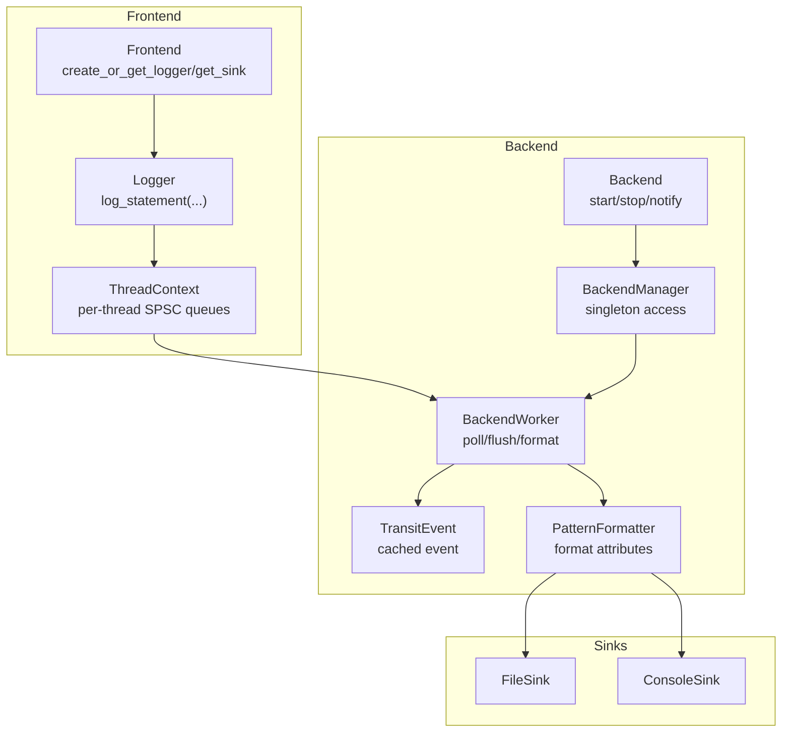
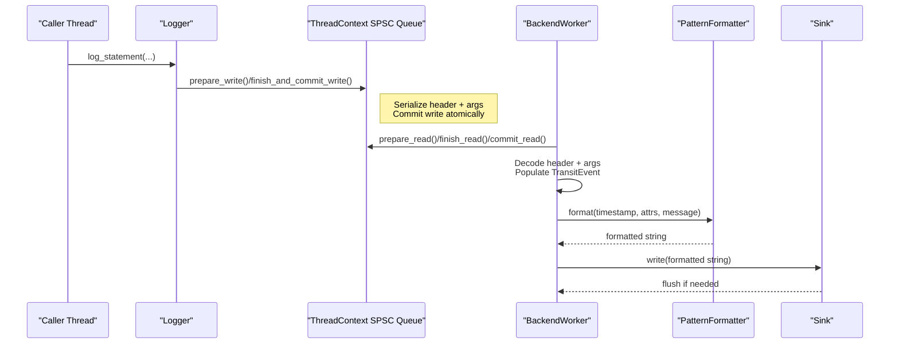
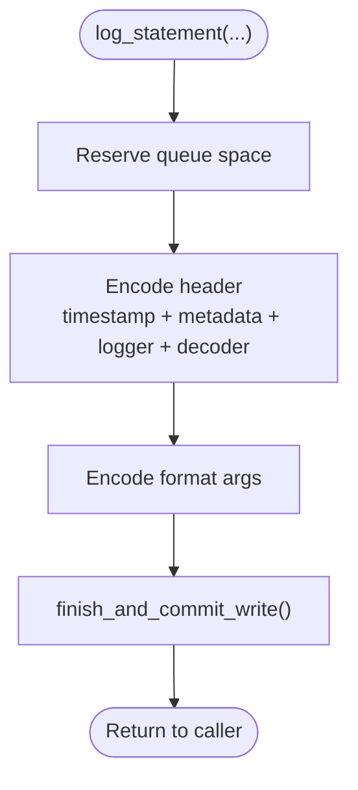
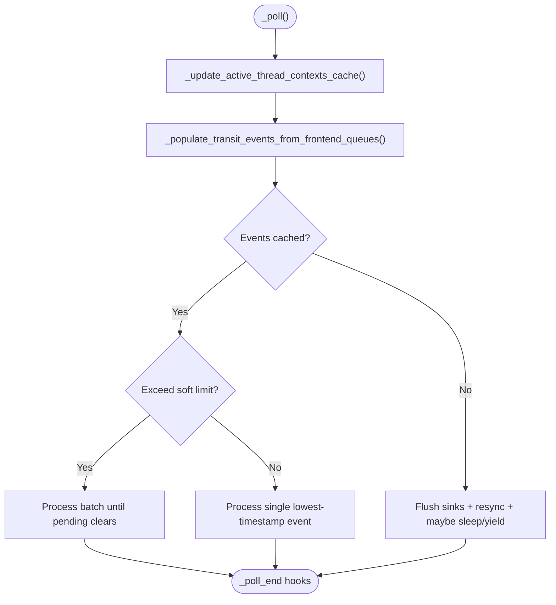
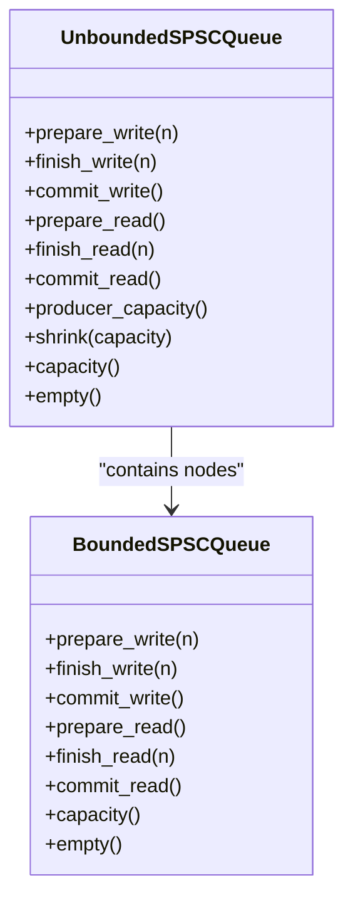
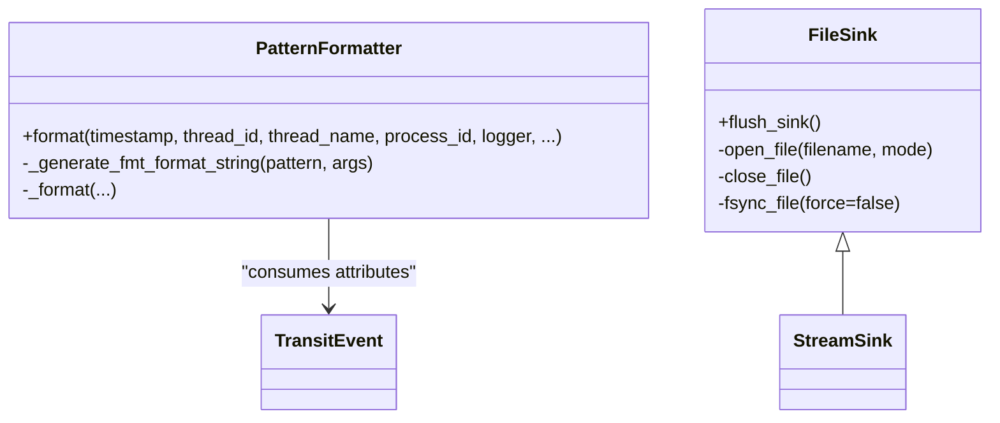
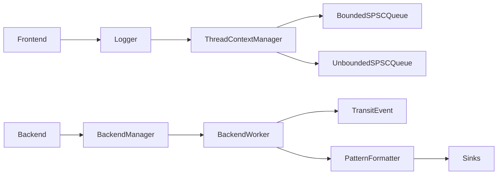

# Architecture Overview

<cite>
**Referenced Files in This Document**
- [Frontend.h](file://include/quill/Frontend.h)
- [Backend.h](file://include/quill/Backend.h)
- [BackendManager.h](file://include/quill/backend/BackendManager.h)
- [BackendWorker.h](file://include/quill/backend/BackendWorker.h)
- [Logger.h](file://include/quill/Logger.h)
- [LoggerManager.h](file://include/quill/core/LoggerManager.h)
- [ThreadContextManager.h](file://include/quill/core/ThreadContextManager.h)
- [BoundedSPSCQueue.h](file://include/quill/core/BoundedSPSCQueue.h)
- [UnboundedSPSCQueue.h](file://include/quill/core/UnboundedSPSCQueue.h)
- [TransitEvent.h](file://include/quill/backend/TransitEvent.h)
- [PatternFormatter.h](file://include/quill/backend/PatternFormatter.h)
- [BackendOptions.h](file://include/quill/backend/BackendOptions.h)
- [FrontendOptions.h](file://include/quill/core/FrontendOptions.h)
- [FileSink.h](file://include/quill/sinks/FileSink.h)
- [console_logging.cpp](file://examples/console_logging.cpp)
- [file_logging.cpp](file://examples/file_logging.cpp)
</cite>

## Table of Contents
1. [Introduction](#introduction)
2. [Project Structure](#project-structure)
3. [Core Components](#core-components)
4. [Architecture Overview](#architecture-overview)
5. [Detailed Component Analysis](#detailed-component-analysis)
6. [Dependency Analysis](#dependency-analysis)
7. [Performance Considerations](#performance-considerations)
8. [Troubleshooting Guide](#troubleshooting-guide)
9. [Conclusion](#conclusion)

## Introduction
This document explains Quill’s logging architecture with a focus on the producer-consumer design that separates frontend and backend responsibilities. Frontend threads (caller threads) asynchronously enqueue log messages into per-thread SPSC queues, while the backend thread performs formatting and I/O operations. The system emphasizes non-blocking logging, configurable queue policies, and compile-time optimizations to achieve high performance.

## Project Structure
Quill organizes its logging pipeline across three primary layers:
- Frontend: Responsible for message serialization, queue management, and enqueue operations.
- Backend: Manages a dedicated worker thread that reads queues, orders messages by timestamp, formats them, and writes to sinks.
- Sinks: Implement the actual I/O targets (e.g., console, file, JSON sinks).

**Diagram sources**
- [Frontend.h:113-198](file://include/quill/Frontend.h#L113-L198)
- [Logger.h:75-136](file://include/quill/Logger.h#L75-L136)
- [ThreadContextManager.h:53-214](file://include/quill/core/ThreadContextManager.h#L53-L214)
- [Backend.h:36-57](file://include/quill/Backend.h#L36-L57)
- [BackendManager.h:38-128](file://include/quill/backend/BackendManager.h#L38-L128)
- [BackendWorker.h:138-207](file://include/quill/backend/BackendWorker.h#L138-L207)
- [TransitEvent.h:32-219](file://include/quill/backend/TransitEvent.h#L32-L219)
- [PatternFormatter.h:97-177](file://include/quill/backend/PatternFormatter.h#L97-L177)
- [FileSink.h:226-288](file://include/quill/sinks/FileSink.h#L226-L288)

**Section sources**
- [Frontend.h:113-198](file://include/quill/Frontend.h#L113-L198)
- [Logger.h:75-136](file://include/quill/Logger.h#L75-L136)
- [ThreadContextManager.h:53-214](file://include/quill/core/ThreadContextManager.h#L53-L214)
- [Backend.h:36-57](file://include/quill/Backend.h#L36-L57)
- [BackendManager.h:38-128](file://include/quill/backend/BackendManager.h#L38-L128)
- [BackendWorker.h:138-207](file://include/quill/backend/BackendWorker.h#L138-L207)
- [TransitEvent.h:32-219](file://include/quill/backend/TransitEvent.h#L32-L219)
- [PatternFormatter.h:97-177](file://include/quill/backend/PatternFormatter.h#L97-L177)
- [FileSink.h:226-288](file://include/quill/sinks/FileSink.h#L226-L288)

## Core Components
- Frontend
  - Frontend facade for creating sinks and loggers, and for retrieving existing ones.
  - Logger encapsulates per-thread SPSC queue operations and message serialization.
  - ThreadContext stores per-thread queue unions and auxiliary buffers.
- Backend
  - Backend exposes lifecycle APIs (start/stop/notify) and provides access to the backend worker.
  - BackendManager manages the singleton backend worker and thread lifecycle.
  - BackendWorker implements the polling loop, queue reading, event caching, formatting, and sink flushing.
- Queues
  - BoundedSPSCQueue and UnboundedSPSCQueue implement lock-free, single-producer/single-consumer buffers.
- Formatting and Sinks
  - PatternFormatter constructs formatted strings from TransitEvent attributes.
  - Sinks (e.g., FileSink) implement I/O operations.

**Section sources**
- [Frontend.h:113-198](file://include/quill/Frontend.h#L113-L198)
- [Logger.h:75-136](file://include/quill/Logger.h#L75-L136)
- [ThreadContextManager.h:53-214](file://include/quill/core/ThreadContextManager.h#L53-L214)
- [Backend.h:36-57](file://include/quill/Backend.h#L36-L57)
- [BackendManager.h:38-128](file://include/quill/backend/BackendManager.h#L38-L128)
- [BackendWorker.h:138-207](file://include/quill/backend/BackendWorker.h#L138-L207)
- [BoundedSPSCQueue.h:54-196](file://include/quill/core/BoundedSPSCQueue.h#L54-L196)
- [UnboundedSPSCQueue.h:42-241](file://include/quill/core/UnboundedSPSCQueue.h#L42-L241)
- [PatternFormatter.h:97-177](file://include/quill/backend/PatternFormatter.h#L97-L177)
- [FileSink.h:226-288](file://include/quill/sinks/FileSink.h#L226-L288)

## Architecture Overview
Quill’s architecture follows a classic producer-consumer model:
- Producer: Each frontend thread serializes a log message and enqueues it into its per-thread SPSC queue.
- Consumer: The backend worker polls all active thread contexts, deserializes messages into TransitEvent objects, orders them by timestamp, formats them, and writes to sinks.

**Diagram sources**
- [Logger.h:75-136](file://include/quill/Logger.h#L75-L136)
- [ThreadContextManager.h:53-214](file://include/quill/core/ThreadContextManager.h#L53-L214)
- [BackendWorker.h:479-755](file://include/quill/backend/BackendWorker.h#L479-L755)
- [PatternFormatter.h:97-177](file://include/quill/backend/PatternFormatter.h#L97-L177)
- [FileSink.h:264-288](file://include/quill/sinks/FileSink.h#L264-L288)

## Detailed Component Analysis

### Frontend Producer Pipeline
- Serialization
  - Logger computes encoded sizes, reserves queue space, encodes a header (timestamp, metadata pointer, logger pointer, decoder), and encodes arguments.
  - Commit write finishes and atomically publishes the message.
- Queue Management
  - ThreadContext holds a union of BoundedSPSCQueue or UnboundedSPSCQueue depending on FrontendOptions.
  - Unbounded queue grows by powers of two up to a configured maximum; bounded queue never reallocates.
- Lifecycle and Options
  - FrontendOptions controls queue type, initial capacity, blocking retry interval, and huge pages policy.

**Diagram sources**
- [Logger.h:75-136](file://include/quill/Logger.h#L75-L136)
- [Logger.h:408-475](file://include/quill/Logger.h#L408-L475)
- [ThreadContextManager.h:53-214](file://include/quill/core/ThreadContextManager.h#L53-L214)

**Section sources**
- [Logger.h:75-136](file://include/quill/Logger.h#L75-L136)
- [Logger.h:408-475](file://include/quill/Logger.h#L408-L475)
- [ThreadContextManager.h:53-214](file://include/quill/core/ThreadContextManager.h#L53-L214)
- [FrontendOptions.h:16-50](file://include/quill/core/FrontendOptions.h#L16-L50)

### Backend Consumer Pipeline
- Polling Loop
  - BackendWorker initializes, then runs a loop that updates active thread contexts, reads queues, and caches events.
- Transit Event Buffer
  - Events are decoded from queues into TransitEvent structures with formatted buffers and optional runtime metadata.
- Ordering and Formatting
  - Strict timestamp ordering can be enforced via a grace period; otherwise, the event with the smallest timestamp is processed next.
  - PatternFormatter formats attributes (time, thread, logger, level, message, tags, named args).
- Sink Processing
  - Sinks flush according to intervals and optional fsync policies.

**Diagram sources**
- [BackendWorker.h:305-395](file://include/quill/backend/BackendWorker.h#L305-L395)
- [BackendWorker.h:479-755](file://include/quill/backend/BackendWorker.h#L479-L755)
- [PatternFormatter.h:97-177](file://include/quill/backend/PatternFormatter.h#L97-L177)

**Section sources**
- [BackendWorker.h:305-395](file://include/quill/backend/BackendWorker.h#L305-L395)
- [BackendWorker.h:479-755](file://include/quill/backend/BackendWorker.h#L479-L755)
- [PatternFormatter.h:97-177](file://include/quill/backend/PatternFormatter.h#L97-L177)
- [BackendOptions.h:30-281](file://include/quill/backend/BackendOptions.h#L30-L281)

### Queue Implementations
- BoundedSPSCQueue
  - Fixed-capacity ring buffer with separate writer/reader positions and periodic atomic commits.
  - Uses cache-line aligned atomics and optional huge pages for performance.
- UnboundedSPSCQueue
  - Linked list of nodes, each a BoundedSPSCQueue. Grows by doubling capacity up to a maximum.
  - Supports shrinking and detects allocation transitions for consumer-side handover.

**Diagram sources**
- [BoundedSPSCQueue.h:54-196](file://include/quill/core/BoundedSPSCQueue.h#L54-L196)
- [UnboundedSPSCQueue.h:42-241](file://include/quill/core/UnboundedSPSCQueue.h#L42-L241)

**Section sources**
- [BoundedSPSCQueue.h:54-196](file://include/quill/core/BoundedSPSCQueue.h#L54-L196)
- [UnboundedSPSCQueue.h:42-241](file://include/quill/core/UnboundedSPSCQueue.h#L42-L241)

### Formatting and Sinks
- PatternFormatter
  - Builds a format string from a pattern and lazily evaluates attributes (time, thread, logger, level, tags, named args).
  - Handles multi-line formatting and optional suffix behavior.
- FileSink
  - Implements buffered file I/O with optional fsync throttling and filename timestamp appending.
  - Integrates with StreamSink base class for unified flushing behavior.

**Diagram sources**
- [PatternFormatter.h:97-177](file://include/quill/backend/PatternFormatter.h#L97-L177)
- [PatternFormatter.h:355-466](file://include/quill/backend/PatternFormatter.h#L355-L466)
- [FileSink.h:226-288](file://include/quill/sinks/FileSink.h#L226-L288)

**Section sources**
- [PatternFormatter.h:97-177](file://include/quill/backend/PatternFormatter.h#L97-L177)
- [PatternFormatter.h:355-466](file://include/quill/backend/PatternFormatter.h#L355-L466)
- [FileSink.h:226-288](file://include/quill/sinks/FileSink.h#L226-L288)

## Dependency Analysis
- Frontend depends on ThreadContextManager for per-thread queue storage and on LoggerManager for logger registry.
- Backend depends on BackendManager for singleton access and on BackendWorker for the polling loop.
- BackendWorker depends on queues, codec/formatters, sinks, and transit event buffers.
- Sinks depend on filesystem/stream utilities and formatting options.

**Diagram sources**
- [Frontend.h:113-198](file://include/quill/Frontend.h#L113-L198)
- [Logger.h:75-136](file://include/quill/Logger.h#L75-L136)
- [ThreadContextManager.h:53-214](file://include/quill/core/ThreadContextManager.h#L53-L214)
- [Backend.h:36-57](file://include/quill/Backend.h#L36-L57)
- [BackendManager.h:38-128](file://include/quill/backend/BackendManager.h#L38-L128)
- [BackendWorker.h:479-755](file://include/quill/backend/BackendWorker.h#L479-L755)
- [TransitEvent.h:32-219](file://include/quill/backend/TransitEvent.h#L32-L219)
- [PatternFormatter.h:97-177](file://include/quill/backend/PatternFormatter.h#L97-L177)

**Section sources**
- [Frontend.h:113-198](file://include/quill/Frontend.h#L113-L198)
- [Logger.h:75-136](file://include/quill/Logger.h#L75-L136)
- [ThreadContextManager.h:53-214](file://include/quill/core/ThreadContextManager.h#L53-L214)
- [Backend.h:36-57](file://include/quill/Backend.h#L36-L57)
- [BackendManager.h:38-128](file://include/quill/backend/BackendManager.h#L38-L128)
- [BackendWorker.h:479-755](file://include/quill/backend/BackendWorker.h#L479-L755)
- [TransitEvent.h:32-219](file://include/quill/backend/TransitEvent.h#L32-L219)
- [PatternFormatter.h:97-177](file://include/quill/backend/PatternFormatter.h#L97-L177)

## Performance Considerations
- Asynchronous design
  - Frontend threads avoid blocking I/O by enqueuing messages and immediately returning.
  - Backend handles formatting and I/O off the hot path, minimizing caller thread overhead.
- Queue policies
  - Unbounded queues grow to a maximum and either block or drop based on configuration.
  - Bounded queues never reallocate, trading flexibility for predictable memory usage.
- Backend scheduling
  - Sleep duration and yielding reduce CPU usage when idle; strict timestamp ordering may delay reads to ensure ordering.
- Formatting and sinks
  - PatternFormatter defers computation of attributes not present in the pattern.
  - FileSink supports buffered writes and optional fsync throttling to balance durability and throughput.

[No sources needed since this section provides general guidance]

## Troubleshooting Guide
- Backend not running
  - Ensure Backend::start() is called before issuing logs; is_running() can be used to verify.
- Out-of-order logs
  - Enable log_timestamp_ordering_grace_period to enforce strict ordering at the cost of read latency.
- Queue full or drops
  - For UnboundedDropping/BoundedDropping, messages are dropped; switch to Blocking variants or increase capacities.
  - Monitor failure counters via ThreadContext and adjust queue sizing.
- Immediate flush behavior
  - Using immediate flush increases latency; reserve for debugging and remove in production.
- Sink flush and fsync
  - Configure sink_min_flush_interval and FileSinkConfig fsync settings to control durability and disk activity.

**Section sources**
- [Backend.h:159-162](file://include/quill/Backend.h#L159-L162)
- [BackendOptions.h:132-145](file://include/quill/backend/BackendOptions.h#L132-L145)
- [Logger.h:408-475](file://include/quill/Logger.h#L408-L475)
- [ThreadContextManager.h:188-201](file://include/quill/core/ThreadContextManager.h#L188-L201)
- [BackendOptions.h:224-241](file://include/quill/backend/BackendOptions.h#L224-L241)
- [FileSink.h:264-288](file://include/quill/sinks/FileSink.h#L264-L288)

## Conclusion
Quill’s architecture cleanly separates concerns between frontend producers and backend consumers, leveraging lock-free SPSC queues, strict ordering controls, and efficient formatting to deliver high-throughput, low-latency logging. Compile-time options and flexible queue policies allow tuning for diverse performance and reliability requirements.