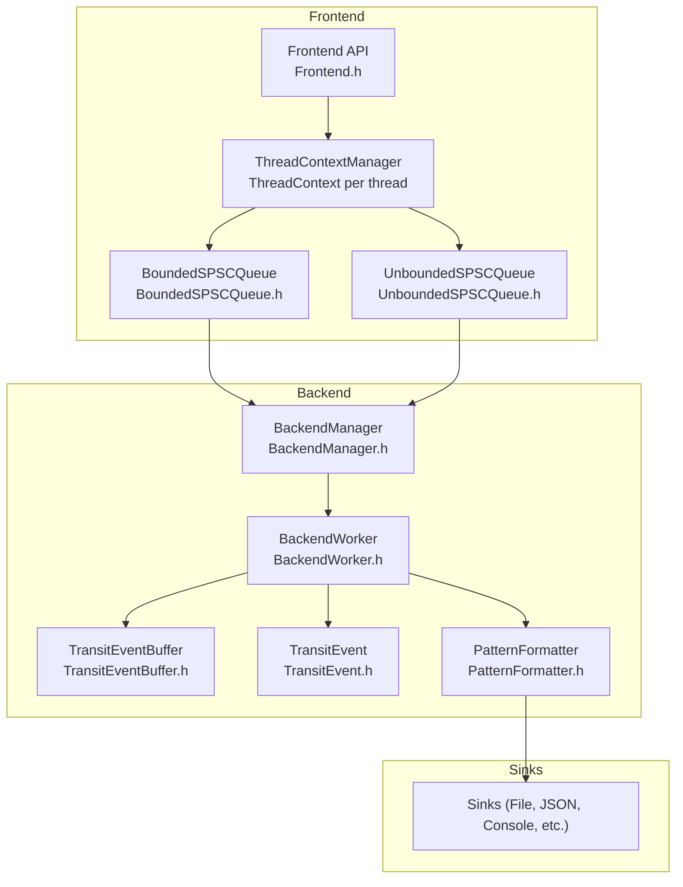
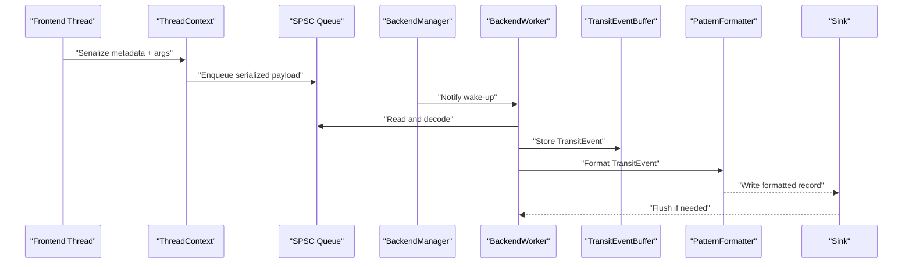
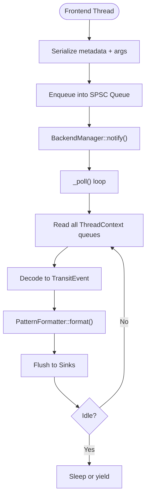
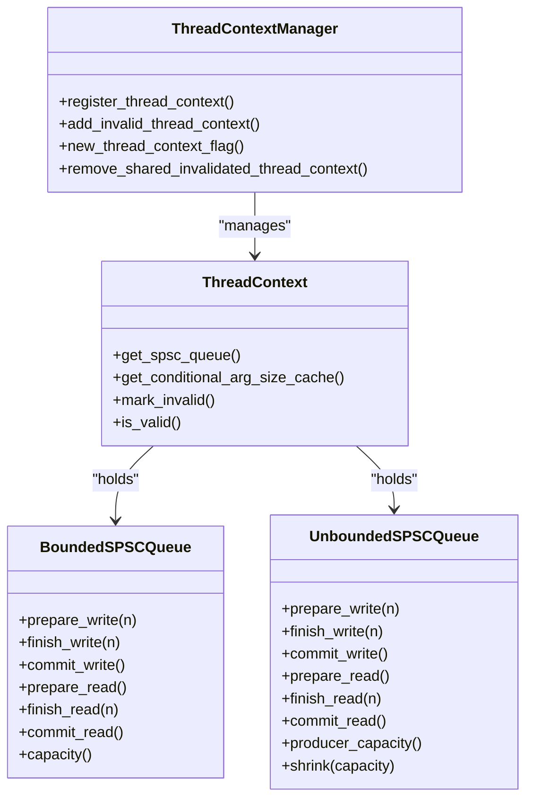
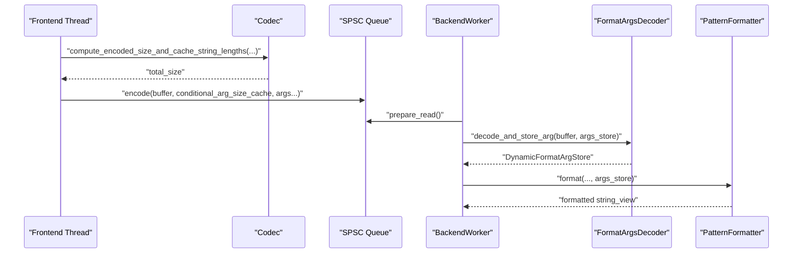
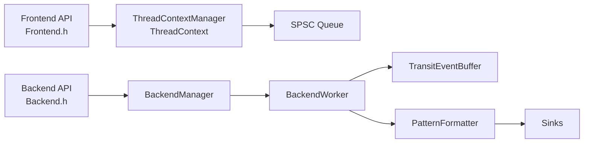
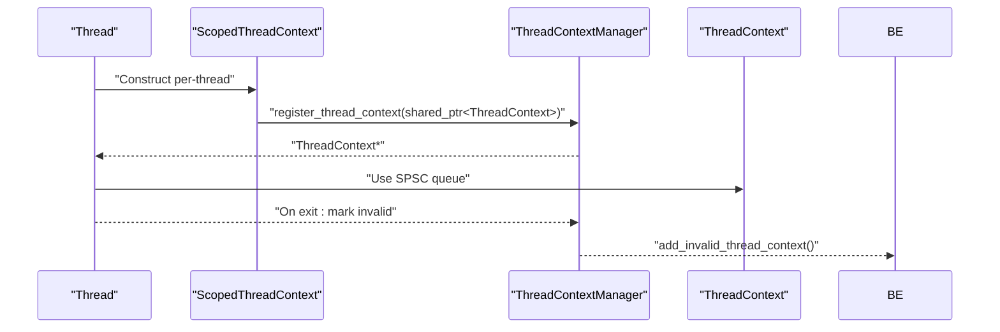
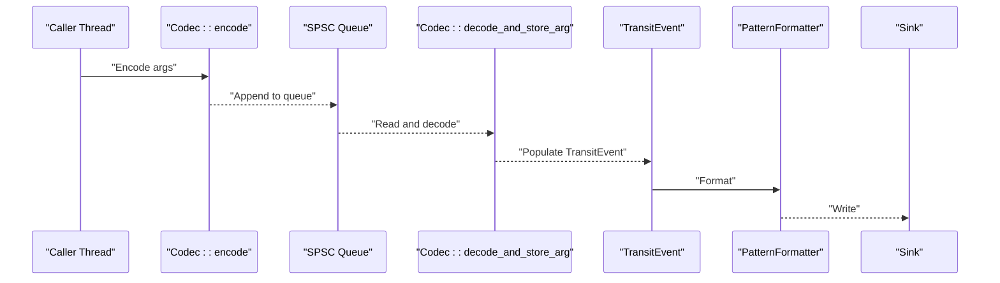
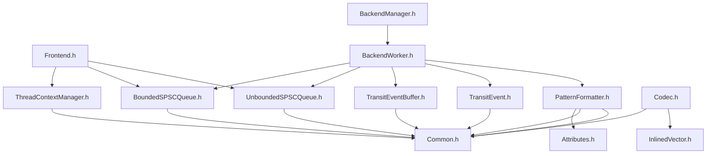

# Core Concepts

<cite>
**Referenced Files in This Document**
- [Frontend.h](file://include/quill/Frontend.h)
- [Backend.h](file://include/quill/Backend.h)
- [BackendWorker.h](file://include/quill/backend/BackendWorker.h)
- [BackendManager.h](file://include/quill/backend/BackendManager.h)
- [ThreadContextManager.h](file://include/quill/core/ThreadContextManager.h)
- [BoundedSPSCQueue.h](file://include/quill/core/BoundedSPSCQueue.h)
- [UnboundedSPSCQueue.h](file://include/quill/core/UnboundedSPSCQueue.h)
- [TransitEvent.h](file://include/quill/backend/TransitEvent.h)
- [TransitEventBuffer.h](file://include/quill/backend/TransitEventBuffer.h)
- [LoggerBase.h](file://include/quill/core/LoggerBase.h)
- [PatternFormatter.h](file://include/quill/backend/PatternFormatter.h)
- [Codec.h](file://include/quill/core/Codec.h)
- [Common.h](file://include/quill/core/Common.h)
- [Attributes.h](file://include/quill/core/Attributes.h)
- [InlinedVector.h](file://include/quill/core/InlinedVector.h)
</cite>

## Table of Contents
1. [Introduction](#introduction)
2. [Project Structure](#project-structure)
3. [Core Components](#core-components)
4. [Architecture Overview](#architecture-overview)
5. [Detailed Component Analysis](#detailed-component-analysis)
6. [Dependency Analysis](#dependency-analysis)
7. [Performance Considerations](#performance-considerations)
8. [Troubleshooting Guide](#troubleshooting-guide)
9. [Conclusion](#conclusion)

## Introduction
This document explains Quill’s core architecture and design principles with a focus on the producer-consumer pattern and asynchronous logging. It details how frontend threads serialize and enqueue log messages into SPSC queues, and how backend threads efficiently deserialize, format, and flush them to sinks. It also covers threading models, thread-local storage, context management, SPSC queue mechanics, memory management, zero-copy techniques, and template metaprogramming optimizations.

## Project Structure
Quill separates concerns into:
- Frontend: caller threads that produce logs into thread-local SPSC queues.
- Backend: a dedicated worker thread that consumes, formats, and writes to sinks.
- Core infrastructure: SPSC queues, thread context management, codecs, and formatting utilities.
- Sinks: pluggable destinations for formatted log records.

**Diagram sources**
- [Frontend.h:32-373](file://include/quill/Frontend.h#L32-L373)
- [BackendManager.h:38-136](file://include/quill/backend/BackendManager.h#L38-L136)
- [BackendWorker.h:77-800](file://include/quill/backend/BackendWorker.h#L77-L800)
- [ThreadContextManager.h:53-430](file://include/quill/core/ThreadContextManager.h#L53-L430)
- [BoundedSPSCQueue.h:54-356](file://include/quill/core/BoundedSPSCQueue.h#L54-L356)
- [UnboundedSPSCQueue.h:42-345](file://include/quill/core/UnboundedSPSCQueue.h#L42-L345)
- [TransitEventBuffer.h:19-162](file://include/quill/backend/TransitEventBuffer.h#L19-L162)
- [TransitEvent.h:32-222](file://include/quill/backend/TransitEvent.h#L32-L222)
- [PatternFormatter.h:33-608](file://include/quill/backend/PatternFormatter.h#L33-L608)

**Section sources**
- [Frontend.h:32-373](file://include/quill/Frontend.h#L32-L373)
- [Backend.h:29-246](file://include/quill/Backend.h#L29-L246)
- [BackendWorker.h:77-800](file://include/quill/backend/BackendWorker.h#L77-L800)
- [BackendManager.h:38-136](file://include/quill/backend/BackendManager.h#L38-L136)
- [ThreadContextManager.h:53-430](file://include/quill/core/ThreadContextManager.h#L53-L430)
- [BoundedSPSCQueue.h:54-356](file://include/quill/core/BoundedSPSCQueue.h#L54-L356)
- [UnboundedSPSCQueue.h:42-345](file://include/quill/core/UnboundedSPSCQueue.h#L42-L345)
- [TransitEventBuffer.h:19-162](file://include/quill/backend/TransitEventBuffer.h#L19-L162)
- [TransitEvent.h:32-222](file://include/quill/backend/TransitEvent.h#L32-L222)
- [PatternFormatter.h:33-608](file://include/quill/backend/PatternFormatter.h#L33-L608)

## Core Components
- Frontend API: exposes creation and retrieval of loggers and sinks, and provides queue introspection and lifecycle controls for thread-local queues.
- Backend API: starts/stops the backend worker thread, notifies it, and exposes utilities like TSC-to-epoch conversions.
- BackendWorker: the central consumer that polls SPSC queues, deserializes messages, formats them, and flushes to sinks.
- ThreadContextManager: manages per-thread SPSC queues and caches, and tracks validity for graceful cleanup.
- SPSC Queues: BoundedSPSCQueue and UnboundedSPSCQueue implement lock-free, single-producer/single-consumer semantics.
- TransitEvent and TransitEventBuffer: intermediate representation and buffer for deserialized log entries awaiting formatting and sink writes.
- PatternFormatter: formats TransitEvent payloads according to user-specified patterns.
- Codec: encodes/decodes arbitrary argument types into/from the SPSC queues with minimal overhead.
- LoggerBase: holds logger configuration and runtime state shared between frontend and backend.

**Section sources**
- [Frontend.h:32-373](file://include/quill/Frontend.h#L32-L373)
- [Backend.h:29-246](file://include/quill/Backend.h#L29-L246)
- [BackendWorker.h:77-800](file://include/quill/backend/BackendWorker.h#L77-L800)
- [ThreadContextManager.h:53-430](file://include/quill/core/ThreadContextManager.h#L53-L430)
- [BoundedSPSCQueue.h:54-356](file://include/quill/core/BoundedSPSCQueue.h#L54-L356)
- [UnboundedSPSCQueue.h:42-345](file://include/quill/core/UnboundedSPSCQueue.h#L42-L345)
- [TransitEvent.h:32-222](file://include/quill/backend/TransitEvent.h#L32-L222)
- [TransitEventBuffer.h:19-162](file://include/quill/backend/TransitEventBuffer.h#L19-L162)
- [PatternFormatter.h:33-608](file://include/quill/backend/PatternFormatter.h#L33-L608)
- [Codec.h:143-438](file://include/quill/core/Codec.h#L143-L438)
- [LoggerBase.h:35-210](file://include/quill/core/LoggerBase.h#L35-L210)

## Architecture Overview
Quill implements a lock-free, asynchronous logging pipeline:
- Frontend threads serialize log metadata and arguments into a thread-local SPSC queue.
- The backend worker periodically polls all active thread contexts, deserializes messages, formats them, and writes to sinks.
- Memory management leverages preallocated buffers, inlined vectors, and optional huge pages for low-latency environments.
- Formatting and sink processing occur off the hot path of the caller thread.

**Diagram sources**
- [BackendWorker.h:305-395](file://include/quill/backend/BackendWorker.h#L305-L395)
- [BackendWorker.h:479-506](file://include/quill/backend/BackendWorker.h#L479-L506)
- [BackendWorker.h:515-573](file://include/quill/backend/BackendWorker.h#L515-L573)
- [BackendWorker.h:576-755](file://include/quill/backend/BackendWorker.h#L576-L755)
- [PatternFormatter.h:97-177](file://include/quill/backend/PatternFormatter.h#L97-L177)

## Detailed Component Analysis

### Producer-Consumer Pipeline and Threading Model
- Frontend threads:
  - Serialize log metadata (timestamp, macro metadata, logger pointer) and arguments via codecs.
  - Enqueue into a thread-local SPSC queue (either bounded or unbounded).
  - Optionally shrink the unbounded queue to reclaim memory after bursts.
- Backend thread:
  - Wakes up on demand or on a schedule, updates caches, reads all queues, deserializes into TransitEvents, formats, and flushes to sinks.
  - Supports strict timestamp ordering and grace periods to avoid out-of-order writes.
  - Uses condition variables and spin/yield strategies for idle efficiency.

**Diagram sources**
- [Frontend.h:45-111](file://include/quill/Frontend.h#L45-L111)
- [BackendWorker.h:305-395](file://include/quill/backend/BackendWorker.h#L305-L395)
- [BackendWorker.h:479-506](file://include/quill/backend/BackendWorker.h#L479-L506)
- [BackendWorker.h:515-573](file://include/quill/backend/BackendWorker.h#L515-L573)
- [BackendWorker.h:576-755](file://include/quill/backend/BackendWorker.h#L576-L755)
- [PatternFormatter.h:97-177](file://include/quill/backend/PatternFormatter.h#L97-L177)

**Section sources**
- [Frontend.h:45-111](file://include/quill/Frontend.h#L45-L111)
- [Backend.h:36-162](file://include/quill/Backend.h#L36-L162)
- [BackendWorker.h:305-395](file://include/quill/backend/BackendWorker.h#L305-L395)
- [BackendWorker.h:479-506](file://include/quill/backend/BackendWorker.h#L479-L506)
- [BackendWorker.h:515-573](file://include/quill/backend/BackendWorker.h#L515-L573)
- [BackendWorker.h:576-755](file://include/quill/backend/BackendWorker.h#L576-L755)

### SPSC Queue Mechanics and Memory Management
- BoundedSPSCQueue:
  - Power-of-two capacity with aligned storage and cache-line padding.
  - Separate writer and reader positions with atomic flags for visibility.
  - Batched commit/flush to reduce cache pollution.
  - Optional huge pages support on Linux.
- UnboundedSPSCQueue:
  - Linked list of nodes, each a BoundedSPSCQueue.
  - On overflow, allocates a new node with doubled capacity up to a configured max.
  - Supports shrinking to reduce memory usage post-bursts.
- ThreadContextManager:
  - Holds per-thread SPSC queues and caches.
  - Tracks validity and invalidation for graceful teardown.
  - Exposes counters and flags for backend to detect new or invalid contexts.

**Diagram sources**
- [ThreadContextManager.h:53-214](file://include/quill/core/ThreadContextManager.h#L53-L214)
- [BoundedSPSCQueue.h:54-356](file://include/quill/core/BoundedSPSCQueue.h#L54-L356)
- [UnboundedSPSCQueue.h:42-345](file://include/quill/core/UnboundedSPSCQueue.h#L42-L345)
- [ThreadContextManager.h:216-338](file://include/quill/core/ThreadContextManager.h#L216-L338)

**Section sources**
- [BoundedSPSCQueue.h:54-356](file://include/quill/core/BoundedSPSCQueue.h#L54-L356)
- [UnboundedSPSCQueue.h:42-345](file://include/quill/core/UnboundedSPSCQueue.h#L42-L345)
- [ThreadContextManager.h:53-214](file://include/quill/core/ThreadContextManager.h#L53-L214)
- [ThreadContextManager.h:216-338](file://include/quill/core/ThreadContextManager.h#L216-L338)

### Zero-Copy Message Passing and Serialization
- Codec encodes arguments into a compact binary layout appended to the queue, avoiding allocations for common types.
- For strings and arrays, lengths are encoded to reconstruct views without deep copies.
- TransitEvent carries decoded arguments and a preallocated formatted buffer to minimize allocations during formatting.
- InlinedVector caches computed sizes (e.g., string lengths) to avoid recomputation.

**Diagram sources**
- [Codec.h:354-406](file://include/quill/core/Codec.h#L354-L406)
- [Codec.h:143-342](file://include/quill/core/Codec.h#L143-L342)
- [BackendWorker.h:576-755](file://include/quill/backend/BackendWorker.h#L576-L755)
- [PatternFormatter.h:97-177](file://include/quill/backend/PatternFormatter.h#L97-L177)

**Section sources**
- [Codec.h:143-438](file://include/quill/core/Codec.h#L143-L438)
- [BackendWorker.h:576-755](file://include/quill/backend/BackendWorker.h#L576-L755)
- [PatternFormatter.h:97-177](file://include/quill/backend/PatternFormatter.h#L97-L177)
- [InlinedVector.h:35-183](file://include/quill/core/InlinedVector.h#L35-L183)

### Separation Between Frontend and Backend Layers
- Frontend responsibilities:
  - Create/retrieve loggers and sinks.
  - Preallocate/shrink thread-local queues.
  - Enqueue serialized messages.
- Backend responsibilities:
  - Poll queues, deserialize, format, and flush.
  - Manage sinks and backtrace storage.
  - Handle logger removal and synchronization flags.

**Diagram sources**
- [Frontend.h:120-373](file://include/quill/Frontend.h#L120-L373)
- [Backend.h:29-162](file://include/quill/Backend.h#L29-L162)
- [BackendManager.h:38-136](file://include/quill/backend/BackendManager.h#L38-L136)
- [BackendWorker.h:77-800](file://include/quill/backend/BackendWorker.h#L77-L800)
- [TransitEventBuffer.h:19-162](file://include/quill/backend/TransitEventBuffer.h#L19-L162)
- [PatternFormatter.h:33-608](file://include/quill/backend/PatternFormatter.h#L33-L608)

**Section sources**
- [Frontend.h:120-373](file://include/quill/Frontend.h#L120-L373)
- [Backend.h:29-162](file://include/quill/Backend.h#L29-L162)
- [BackendManager.h:38-136](file://include/quill/backend/BackendManager.h#L38-L136)
- [BackendWorker.h:77-800](file://include/quill/backend/BackendWorker.h#L77-L800)

### Thread-Local Storage, Context Management, and ThreadContextManager
- ThreadContextManager registers a ScopedThreadContext per thread, ensuring a single ThreadContext per thread.
- ThreadContext holds the SPSC queue and caches for argument sizes and thread identity.
- Backend uses caches to avoid repeated work and to detect invalid contexts for cleanup.

**Diagram sources**
- [ThreadContextManager.h:340-430](file://include/quill/core/ThreadContextManager.h#L340-L430)
- [ThreadContextManager.h:216-338](file://include/quill/core/ThreadContextManager.h#L216-L338)

**Section sources**
- [ThreadContextManager.h:340-430](file://include/quill/core/ThreadContextManager.h#L340-L430)
- [ThreadContextManager.h:216-338](file://include/quill/core/ThreadContextManager.h#L216-L338)

### Message Flow: From Caller Through Queue to Backend and Sinks
- Caller thread serializes metadata and arguments using Codec and enqueues into ThreadContext SPSC queue.
- BackendWorker updates caches, reads queues, decodes arguments, constructs TransitEvent, formats via PatternFormatter, and writes to sinks.
- Flush and logger removal events are handled specially to synchronize with caller threads.

**Diagram sources**
- [Codec.h:380-406](file://include/quill/core/Codec.h#L380-L406)
- [BackendWorker.h:576-755](file://include/quill/backend/BackendWorker.h#L576-L755)
- [PatternFormatter.h:97-177](file://include/quill/backend/PatternFormatter.h#L97-L177)

**Section sources**
- [Codec.h:380-406](file://include/quill/core/Codec.h#L380-L406)
- [BackendWorker.h:576-755](file://include/quill/backend/BackendWorker.h#L576-L755)
- [PatternFormatter.h:97-177](file://include/quill/backend/PatternFormatter.h#L97-L177)

## Dependency Analysis
Key dependencies and relationships:
- Frontend depends on ThreadContextManager and SPSC queues.
- BackendManager owns BackendWorker and exposes lifecycle and notification APIs.
- BackendWorker depends on SPSC queues, TransitEventBuffer, TransitEvent, and PatternFormatter.
- Codec and InlinedVector underpin efficient serialization and caching.
- LoggerBase bridges frontend and backend configuration and state.

**Diagram sources**
- [Frontend.h:32-373](file://include/quill/Frontend.h#L32-L373)
- [BackendManager.h:38-136](file://include/quill/backend/BackendManager.h#L38-L136)
- [BackendWorker.h:77-800](file://include/quill/backend/BackendWorker.h#L77-L800)
- [ThreadContextManager.h:53-430](file://include/quill/core/ThreadContextManager.h#L53-L430)
- [BoundedSPSCQueue.h:54-356](file://include/quill/core/BoundedSPSCQueue.h#L54-L356)
- [UnboundedSPSCQueue.h:42-345](file://include/quill/core/UnboundedSPSCQueue.h#L42-L345)
- [TransitEventBuffer.h:19-162](file://include/quill/backend/TransitEventBuffer.h#L19-L162)
- [TransitEvent.h:32-222](file://include/quill/backend/TransitEvent.h#L32-L222)
- [PatternFormatter.h:33-608](file://include/quill/backend/PatternFormatter.h#L33-L608)
- [Attributes.h:1-181](file://include/quill/core/Attributes.h#L1-L181)
- [Common.h:119-183](file://include/quill/core/Common.h#L119-L183)
- [Codec.h:143-438](file://include/quill/core/Codec.h#L143-L438)
- [InlinedVector.h:35-183](file://include/quill/core/InlinedVector.h#L35-L183)

**Section sources**
- [Frontend.h:32-373](file://include/quill/Frontend.h#L32-L373)
- [BackendManager.h:38-136](file://include/quill/backend/BackendManager.h#L38-L136)
- [BackendWorker.h:77-800](file://include/quill/backend/BackendWorker.h#L77-L800)
- [ThreadContextManager.h:53-430](file://include/quill/core/ThreadContextManager.h#L53-L430)
- [BoundedSPSCQueue.h:54-356](file://include/quill/core/BoundedSPSCQueue.h#L54-L356)
- [UnboundedSPSCQueue.h:42-345](file://include/quill/core/UnboundedSPSCQueue.h#L42-L345)
- [TransitEventBuffer.h:19-162](file://include/quill/backend/TransitEventBuffer.h#L19-L162)
- [TransitEvent.h:32-222](file://include/quill/backend/TransitEvent.h#L32-L222)
- [PatternFormatter.h:33-608](file://include/quill/backend/PatternFormatter.h#L33-L608)
- [Attributes.h:1-181](file://include/quill/core/Attributes.h#L1-L181)
- [Common.h:119-183](file://include/quill/core/Common.h#L119-L183)
- [Codec.h:143-438](file://include/quill/core/Codec.h#L143-L438)
- [InlinedVector.h:35-183](file://include/quill/core/InlinedVector.h#L35-L183)

## Performance Considerations
- Lock-free SPSC queues eliminate contention between a single producer and a single consumer.
- Batched commit/flush reduces cache pollution and improves throughput.
- InlinedVector and SizeCacheVector minimize allocations and cache misses.
- Optional huge pages reduce TLB pressure on high-throughput systems.
- Template-driven codecs avoid virtual dispatch and reduce overhead for common types.
- Strict timestamp ordering and grace periods prevent out-of-order writes at the cost of reduced batching when needed.
- Backend idle strategies (sleep vs yield) balance latency and CPU usage.

[No sources needed since this section provides general guidance]

## Troubleshooting Guide
- Out-of-order logs: Verify strict timestamp ordering and grace period settings; ensure backend is not starved by excessive sleep durations.
- Queue full or drops: Switch to UnboundedDropping queues or increase capacities; monitor queue capacity and consider shrinking after bursts.
- Memory growth: Use shrink_thread_local_queue for Unbounded queues after bursts; ensure huge pages policy matches hardware capabilities.
- Backend not stopping: Call Backend::stop and ensure no logger removal requests are pending; check atexit registration.
- Assertion failures: Review QUILL_ASSERT macros and ensure proper initialization of thread contexts and queues.

**Section sources**
- [BackendWorker.h:305-395](file://include/quill/backend/BackendWorker.h#L305-L395)
- [Frontend.h:45-111](file://include/quill/Frontend.h#L45-L111)
- [Backend.h:139-162](file://include/quill/Backend.h#L139-L162)
- [Common.h:83-117](file://include/quill/core/Common.h#L83-L117)

## Conclusion
Quill’s architecture cleanly separates hot-path serialization (frontend) from heavy-lift formatting and I/O (backend). The SPSC queue abstraction, combined with thread-local context management, template metaprogramming optimizations, and careful memory management, yields high throughput and predictable latency. The design supports flexible queue types, strict ordering, and efficient zero-copy argument handling, enabling robust asynchronous logging across diverse workloads.