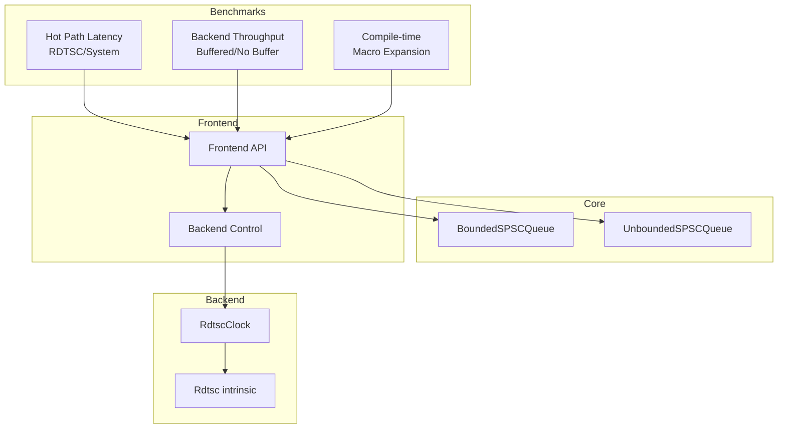
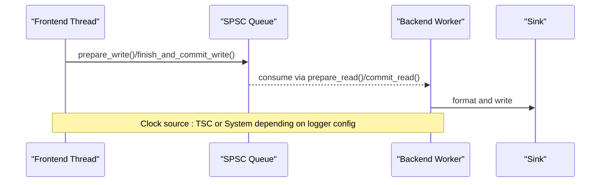
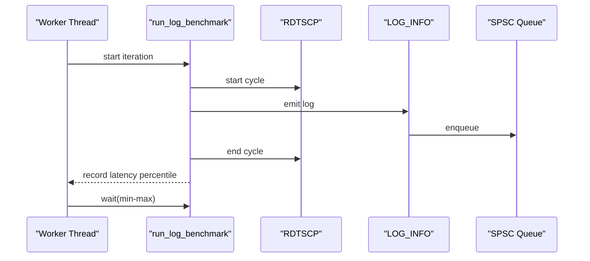
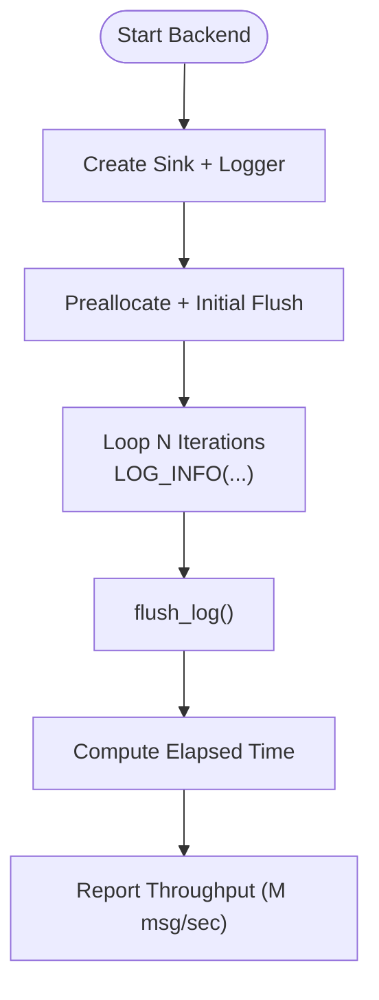
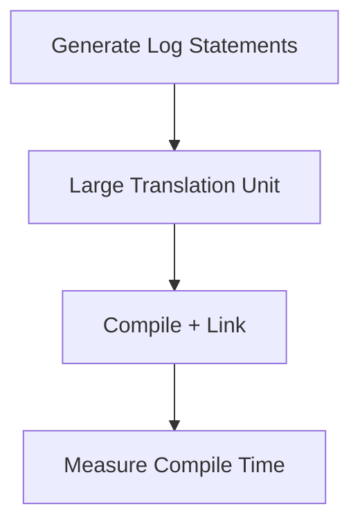
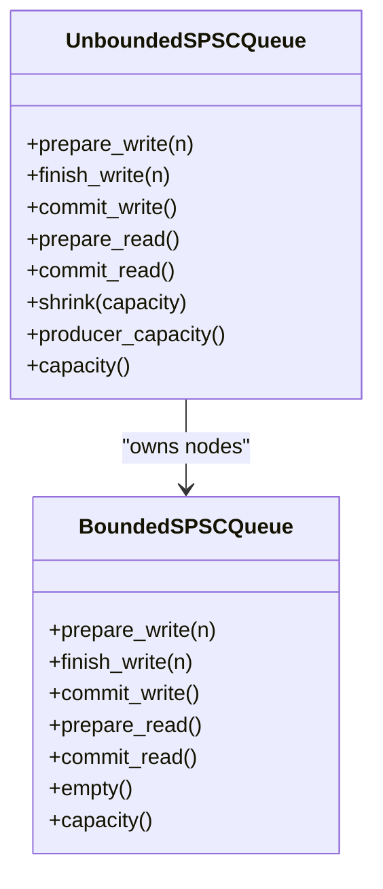
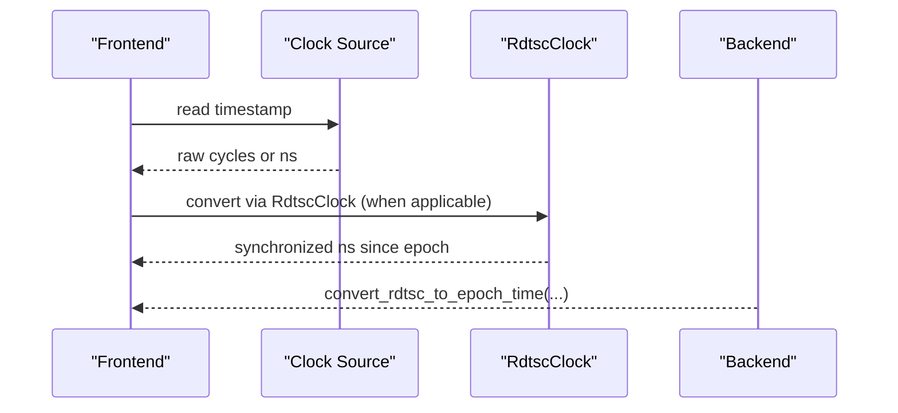
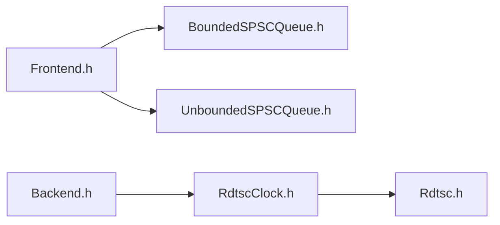

# Performance Characteristics

<cite>
**Referenced Files in This Document**
- [quill_hot_path_rdtsc_clock.cpp](file://benchmarks/hot_path_latency/quill_hot_path_rdtsc_clock.cpp)
- [quill_hot_path_system_clock.cpp](file://benchmarks/hot_path_latency/quill_hot_path_system_clock.cpp)
- [hot_path_bench.h](file://benchmarks/hot_path_latency/hot_path_bench.h)
- [hot_path_bench_config.h](file://benchmarks/hot_path_latency/hot_path_bench_config.h)
- [quill_backend_throughput.cpp](file://benchmarks/backend_throughput/quill_backend_throughput.cpp)
- [quill_backend_throughput_no_buffering.cpp](file://benchmarks/backend_throughput/quill_backend_throughput_no_buffering.cpp)
- [compile_time_bench.cpp](file://benchmarks/compile_time/compile_time_bench.cpp)
- [gen_log_messages.py](file://benchmarks/compile_time/gen_log_messages.py)
- [BoundedSPSCQueue.h](file://include/quill/core/BoundedSPSCQueue.h)
- [UnboundedSPSCQueue.h](file://include/quill/core/UnboundedSPSCQueue.h)
- [RdtscClock.h](file://include/quill/backend/RdtscClock.h)
- [Rdtsc.h](file://include/quill/core/Rdtsc.h)
- [Frontend.h](file://include/quill/Frontend.h)
- [Backend.h](file://include/quill/Backend.h)
</cite>

## Table of Contents
1. [Introduction](#introduction)
2. [Project Structure](#project-structure)
3. [Core Components](#core-components)
4. [Architecture Overview](#architecture-overview)
5. [Detailed Component Analysis](#detailed-component-analysis)
6. [Dependency Analysis](#dependency-analysis)
7. [Performance Considerations](#performance-considerations)
8. [Troubleshooting Guide](#troubleshooting-guide)
9. [Conclusion](#conclusion)
10. [Appendices](#appendices)

## Introduction
This document presents a comprehensive performance analysis of Quill’s logging system. It focuses on:
- Latency measurements for hot path operations across different clock sources
- Throughput benchmarks for bounded and unbounded queues
- Memory usage patterns and allocation strategies
- Impact of queue types, buffer sizes, and thread configurations
- Compile-time optimizations and macro expansion efficiency
- CPU cache optimization techniques and memory layout choices
- Methodologies and tools for benchmarking and production profiling
- Trade-offs and recommendations for optimal performance tuning

## Project Structure
The repository organizes performance-critical code into:
- Benchmarks: latency, throughput, and compile-time microbenchmarks
- Core: high-performance queue implementations and low-level primitives
- Backend: high-frequency timestamping and synchronization
- Frontend: user-facing APIs and queue lifecycle controls

**Diagram sources**
- [quill_hot_path_rdtsc_clock.cpp:1-95](file://benchmarks/hot_path_latency/quill_hot_path_rdtsc_clock.cpp#L1-L95)
- [quill_hot_path_system_clock.cpp:1-98](file://benchmarks/hot_path_latency/quill_hot_path_system_clock.cpp#L1-L98)
- [quill_backend_throughput.cpp:1-69](file://benchmarks/backend_throughput/quill_backend_throughput.cpp#L1-L69)
- [quill_backend_throughput_no_buffering.cpp:1-72](file://benchmarks/backend_throughput/quill_backend_throughput_no_buffering.cpp#L1-L72)
- [compile_time_bench.cpp:1-800](file://benchmarks/compile_time/compile_time_bench.cpp#L1-L800)
- [BoundedSPSCQueue.h:1-356](file://include/quill/core/BoundedSPSCQueue.h#L1-L356)
- [UnboundedSPSCQueue.h:1-345](file://include/quill/core/UnboundedSPSCQueue.h#L1-L345)
- [RdtscClock.h:1-265](file://include/quill/backend/RdtscClock.h#L1-L265)
- [Rdtsc.h:1-114](file://include/quill/core/Rdtsc.h#L1-L114)
- [Frontend.h:1-373](file://include/quill/Frontend.h#L1-L373)
- [Backend.h:1-246](file://include/quill/Backend.h#L1-L246)

**Section sources**
- [quill_hot_path_rdtsc_clock.cpp:1-95](file://benchmarks/hot_path_latency/quill_hot_path_rdtsc_clock.cpp#L1-L95)
- [quill_hot_path_system_clock.cpp:1-98](file://benchmarks/hot_path_latency/quill_hot_path_system_clock.cpp#L1-L98)
- [quill_backend_throughput.cpp:1-69](file://benchmarks/backend_throughput/quill_backend_throughput.cpp#L1-L69)
- [quill_backend_throughput_no_buffering.cpp:1-72](file://benchmarks/backend_throughput/quill_backend_throughput_no_buffering.cpp#L1-L72)
- [compile_time_bench.cpp:1-800](file://benchmarks/compile_time/compile_time_bench.cpp#L1-L800)
- [BoundedSPSCQueue.h:1-356](file://include/quill/core/BoundedSPSCQueue.h#L1-L356)
- [UnboundedSPSCQueue.h:1-345](file://include/quill/core/UnboundedSPSCQueue.h#L1-L345)
- [RdtscClock.h:1-265](file://include/quill/backend/RdtscClock.h#L1-L265)
- [Rdtsc.h:1-114](file://include/quill/core/Rdtsc.h#L1-L114)
- [Frontend.h:1-373](file://include/quill/Frontend.h#L1-L373)
- [Backend.h:1-246](file://include/quill/Backend.h#L1-L246)

## Core Components
- BoundedSPSCQueue: Wait-free producer path with cache-line-aligned storage, periodic cache flush/prefetch, and huge pages support for reduced TLB pressure.
- UnboundedSPSCQueue: Producer dynamically grows buffers; consumer switches nodes atomically; supports shrinking to reclaim memory.
- RdtscClock: High-resolution timestamp conversion with periodic resynchronization and thread-safe accessors.
- Frontend/Backend: Expose queue lifecycle controls, logger creation, and backend thread lifecycle.

Key performance-relevant APIs:
- Frontend::preallocate, shrink_thread_local_queue, get_thread_local_queue_capacity
- Backend::start, stop, notify, is_running
- Logger::flush_log for deterministic completion in benchmarks

**Section sources**
- [BoundedSPSCQueue.h:54-194](file://include/quill/core/BoundedSPSCQueue.h#L54-L194)
- [UnboundedSPSCQueue.h:42-240](file://include/quill/core/UnboundedSPSCQueue.h#L42-L240)
- [RdtscClock.h:36-193](file://include/quill/backend/RdtscClock.h#L36-L193)
- [Frontend.h:45-111](file://include/quill/Frontend.h#L45-L111)
- [Backend.h:36-171](file://include/quill/Backend.h#L36-L171)

## Architecture Overview
The hot path minimizes contention and allocations:
- Frontend threads write into thread-local SPSC queues (bounded or unbounded).
- Backend thread drains queues and writes to sinks.
- Timestamps can be derived from TSC (via RDTSC) or system clock, depending on configuration.

**Diagram sources**
- [quill_hot_path_rdtsc_clock.cpp:76-82](file://benchmarks/hot_path_latency/quill_hot_path_rdtsc_clock.cpp#L76-L82)
- [quill_hot_path_system_clock.cpp:79-85](file://benchmarks/hot_path_latency/quill_hot_path_system_clock.cpp#L79-L85)
- [BoundedSPSCQueue.h:105-145](file://include/quill/core/BoundedSPSCQueue.h#L105-L145)
- [UnboundedSPSCQueue.h:115-149](file://include/quill/core/UnboundedSPSCQueue.h#L115-L149)
- [RdtscClock.h:147-193](file://include/quill/backend/RdtscClock.h#L147-L193)

## Detailed Component Analysis

### Hot Path Latency (RDTSC vs System Clock)
- Methodology: Microbenchmarks measure per-message latency using RDTSCP around the logging call. The benchmark config defines thread counts, iterations, and inter-batch waits to emulate realistic backpressure.
- Clock source impact: TSC-based timestamps avoid syscalls and are highly consistent; system clock introduces variability from kernel/syscall overhead.
- Results interpretation: The benchmark prints percentiles across threads and batches. Lower percentiles indicate better tail latency.

**Diagram sources**
- [hot_path_bench.h:104-124](file://benchmarks/hot_path_latency/hot_path_bench.h#L104-L124)
- [hot_path_bench.h:128-202](file://benchmarks/hot_path_latency/hot_path_bench.h#L128-L202)
- [hot_path_bench_config.h:21-37](file://benchmarks/hot_path_latency/hot_path_bench_config.h#L21-L37)
- [quill_hot_path_rdtsc_clock.cpp:76-82](file://benchmarks/hot_path_latency/quill_hot_path_rdtsc_clock.cpp#L76-L82)
- [quill_hot_path_system_clock.cpp:79-85](file://benchmarks/hot_path_latency/quill_hot_path_system_clock.cpp#L79-L85)

**Section sources**
- [hot_path_bench.h:1-202](file://benchmarks/hot_path_latency/hot_path_bench.h#L1-L202)
- [hot_path_bench_config.h:1-37](file://benchmarks/hot_path_latency/hot_path_bench_config.h#L1-L37)
- [quill_hot_path_rdtsc_clock.cpp:1-95](file://benchmarks/hot_path_latency/quill_hot_path_rdtsc_clock.cpp#L1-L95)
- [quill_hot_path_system_clock.cpp:1-98](file://benchmarks/hot_path_latency/quill_hot_path_system_clock.cpp#L1-L98)

### Throughput (Backend Worker)
- Buffered vs No-buffering: Buffered mode uses a large transit buffer; no-buffering sets hard/soft limits to zero to measure raw backend throughput.
- Measurement: Benchmarks log a fixed number of messages and compute elapsed time to derive millions of messages per second.

**Diagram sources**
- [quill_backend_throughput.cpp:14-68](file://benchmarks/backend_throughput/quill_backend_throughput.cpp#L14-L68)
- [quill_backend_throughput_no_buffering.cpp:14-71](file://benchmarks/backend_throughput/quill_backend_throughput_no_buffering.cpp#L14-L71)

**Section sources**
- [quill_backend_throughput.cpp:1-69](file://benchmarks/backend_throughput/quill_backend_throughput.cpp#L1-L69)
- [quill_backend_throughput_no_buffering.cpp:1-72](file://benchmarks/backend_throughput/quill_backend_throughput_no_buffering.cpp#L1-L72)

### Compile-time Optimizations and Macro Efficiency
- Macro expansion: Benchmarks generate thousands of log statements with varied argument types to stress formatter and macro expansion paths.
- Tooling: A generator script produces a large translation unit to evaluate compilation overhead and linker behavior.
- Observations: Reducing format complexity, minimizing argument conversions, and avoiding unnecessary copies can reduce compile-time and runtime overhead.

**Diagram sources**
- [compile_time_bench.cpp:1-800](file://benchmarks/compile_time/compile_time_bench.cpp#L1-L800)
- [gen_log_messages.py:1-58](file://benchmarks/compile_time/gen_log_messages.py#L1-L58)

**Section sources**
- [compile_time_bench.cpp:1-800](file://benchmarks/compile_time/compile_time_bench.cpp#L1-L800)
- [gen_log_messages.py:1-58](file://benchmarks/compile_time/gen_log_messages.py#L1-L58)

### Queue Types, Buffer Sizes, and Memory Patterns
- BoundedSPSCQueue:
  - Fixed-size ring buffer with power-of-two capacity and bitmask indexing
  - Cache-line aligned atomic positions and prefetching
  - Periodic cache line flushes to avoid false sharing and stale cache
  - Huge pages support on Linux for lower page fault overhead
- UnboundedSPSCQueue:
  - Producer grows buffers exponentially; consumer switches nodes atomically
  - Supports shrink to reclaim memory after bursts
  - Max capacity guard prevents unbounded growth

**Diagram sources**
- [BoundedSPSCQueue.h:54-194](file://include/quill/core/BoundedSPSCQueue.h#L54-L194)
- [UnboundedSPSCQueue.h:42-240](file://include/quill/core/UnboundedSPSCQueue.h#L42-L240)

**Section sources**
- [BoundedSPSCQueue.h:1-356](file://include/quill/core/BoundedSPSCQueue.h#L1-L356)
- [UnboundedSPSCQueue.h:1-345](file://include/quill/core/UnboundedSPSCQueue.h#L1-L345)

### Clock Sources: TSC vs System Clock
- TSC path:
  - Uses RDTSC intrinsic and RdtscClock for conversion with periodic resync
  - Provides high resolution and low syscall overhead
- System clock path:
  - Uses steady/system clocks; introduces kernel/syscall variability
- Backend synchronization:
  - Backend exposes conversion helpers and can convert TSC to epoch time

**Diagram sources**
- [RdtscClock.h:147-193](file://include/quill/backend/RdtscClock.h#L147-L193)
- [Rdtsc.h:104-110](file://include/quill/core/Rdtsc.h#L104-L110)
- [Backend.h:183-186](file://include/quill/Backend.h#L183-L186)

**Section sources**
- [RdtscClock.h:1-265](file://include/quill/backend/RdtscClock.h#L1-L265)
- [Rdtsc.h:1-114](file://include/quill/core/Rdtsc.h#L1-L114)
- [Backend.h:173-186](file://include/quill/Backend.h#L173-L186)

## Dependency Analysis
- Frontend depends on queue implementations and logger manager; Backend manages worker lifecycle and synchronization.
- Clock source selection affects hot-path overhead and accuracy.
- Queue capacity and huge pages policy influence memory footprint and TLB behavior.

**Diagram sources**
- [Frontend.h:1-373](file://include/quill/Frontend.h#L1-L373)
- [Backend.h:1-246](file://include/quill/Backend.h#L1-L246)
- [BoundedSPSCQueue.h:1-356](file://include/quill/core/BoundedSPSCQueue.h#L1-L356)
- [UnboundedSPSCQueue.h:1-345](file://include/quill/core/UnboundedSPSCQueue.h#L1-L345)
- [RdtscClock.h:1-265](file://include/quill/backend/RdtscClock.h#L1-L265)
- [Rdtsc.h:1-114](file://include/quill/core/Rdtsc.h#L1-L114)

**Section sources**
- [Frontend.h:1-373](file://include/quill/Frontend.h#L1-L373)
- [Backend.h:1-246](file://include/quill/Backend.h#L1-L246)
- [BoundedSPSCQueue.h:1-356](file://include/quill/core/BoundedSPSCQueue.h#L1-L356)
- [UnboundedSPSCQueue.h:1-345](file://include/quill/core/UnboundedSPSCQueue.h#L1-L345)
- [RdtscClock.h:1-265](file://include/quill/backend/RdtscClock.h#L1-L265)
- [Rdtsc.h:1-114](file://include/quill/core/Rdtsc.h#L1-L114)

## Performance Considerations
- Queue sizing:
  - Bounded queues require adequate capacity to avoid hot-path reallocations; use preallocation and monitor queue capacity.
  - Unbounded queues can grow; use shrink after bursts to reclaim memory.
- Affinity and contention:
  - Pin backend thread and main thread to cores to reduce migrations and improve cache locality.
- Buffering:
  - Buffered backend throughput benchmarks show higher throughput; disabling buffering measures raw backend capacity.
- Clock source:
  - TSC reduces syscall overhead and improves latency; ensure resync intervals are tuned for drift control.
- Memory:
  - Huge pages can reduce TLB misses on large queues; verify platform support.
- Formatting:
  - Reduce format complexity and argument conversions to minimize compile-time and runtime overhead.

[No sources needed since this section provides general guidance]

## Troubleshooting Guide
- Backend not running:
  - Verify Backend::start and Backend::is_running; ensure sinks are created before logging.
- Latency spikes:
  - Check queue capacity and inter-batch wait durations; adjust initial queue capacity and retry intervals.
- Throughput saturation:
  - Inspect backend sleep duration and CPU affinity; ensure sinks are efficient (e.g., buffered file I/O).
- Clock synchronization:
  - For TSC-based logs, confirm resync behavior; use Backend::convert_rdtsc_to_epoch_time for cross-thread consistency.

**Section sources**
- [Backend.h:36-171](file://include/quill/Backend.h#L36-L171)
- [hot_path_bench_config.h:21-37](file://benchmarks/hot_path_latency/hot_path_bench_config.h#L21-L37)
- [quill_backend_throughput.cpp:19-25](file://benchmarks/backend_throughput/quill_backend_throughput.cpp#L19-L25)

## Conclusion
Quill’s performance hinges on:
- Lock-free SPSC queues with cache-aware design and optional huge pages
- Flexible clock sources with TSC offering low-latency timestamps
- Configurable buffering and queue sizing to balance latency and throughput
- Compile-time optimizations and macro efficiency for minimal overhead

Optimal tuning requires balancing queue capacity, backend scheduling, and clock source selection based on workload characteristics.

[No sources needed since this section summarizes without analyzing specific files]

## Appendices

### Benchmark Methodologies and Tools
- Hot path latency:
  - Measures per-iteration latency using RDTSCP around LOG_INFO; reports percentiles across threads.
  - Inter-batch waits emulate backend backpressure to avoid queue reallocation on hot path.
- Throughput:
  - Logs a fixed number of messages and computes elapsed time; compares buffered vs no-buffering modes.
- Compile-time:
  - Generates large translation units with many log statements to assess macro expansion and formatting costs.

**Section sources**
- [hot_path_bench.h:61-125](file://benchmarks/hot_path_latency/hot_path_bench.h#L61-L125)
- [hot_path_bench_config.h:19-37](file://benchmarks/hot_path_latency/hot_path_bench_config.h#L19-L37)
- [quill_backend_throughput.cpp:47-68](file://benchmarks/backend_throughput/quill_backend_throughput.cpp#L47-L68)
- [quill_backend_throughput_no_buffering.cpp:50-71](file://benchmarks/backend_throughput/quill_backend_throughput_no_buffering.cpp#L50-L71)
- [compile_time_bench.cpp:1-800](file://benchmarks/compile_time/compile_time_bench.cpp#L1-L800)
- [gen_log_messages.py:1-58](file://benchmarks/compile_time/gen_log_messages.py#L1-L58)

### Recommendations
- Use bounded queues for predictable latency; preallocate and monitor capacity.
- Use unbounded queues for bursty workloads; shrink after bursts.
- Prefer TSC clock for low-latency timestamps; tune resync intervals.
- Pin threads to cores; reduce contention and improve cache locality.
- Profile in production using backend notification hooks and controlled logging levels to minimize overhead.

[No sources needed since this section provides general guidance]