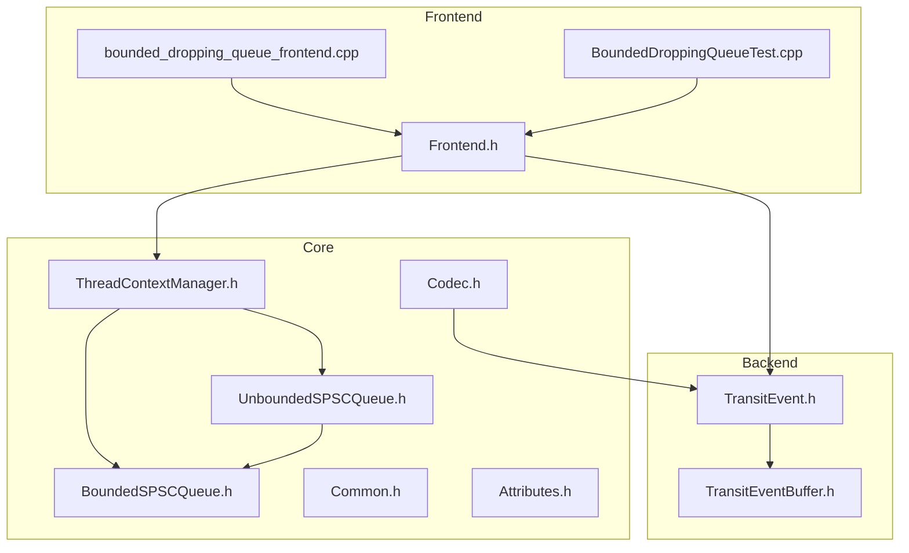
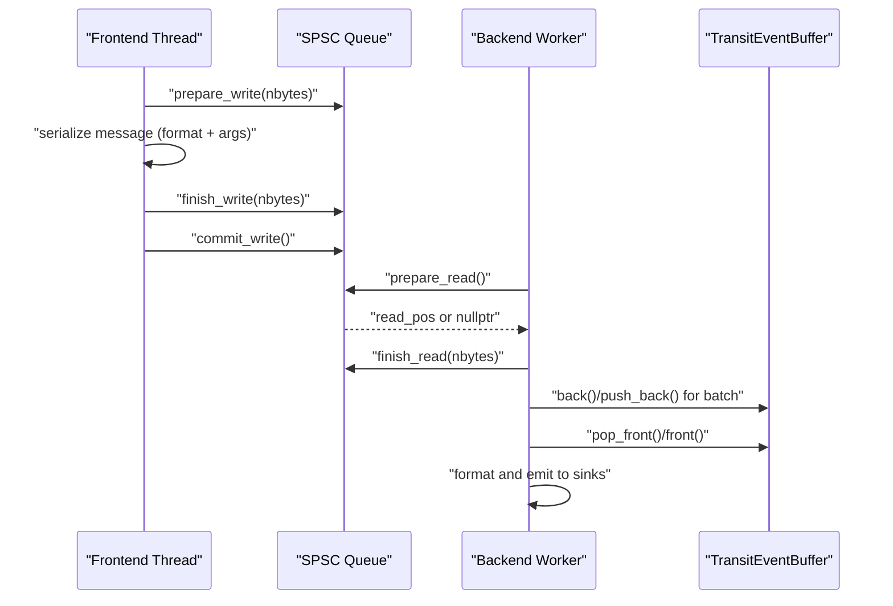
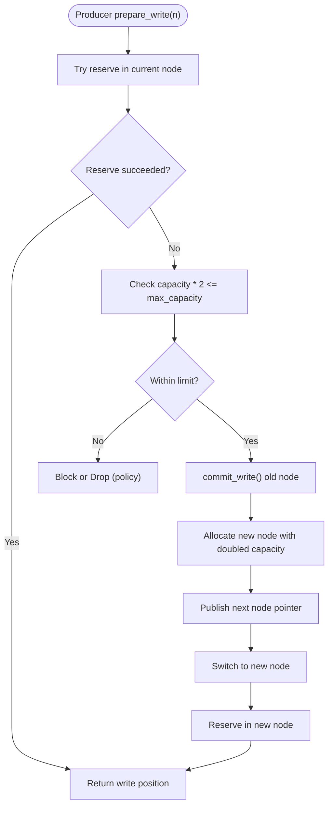
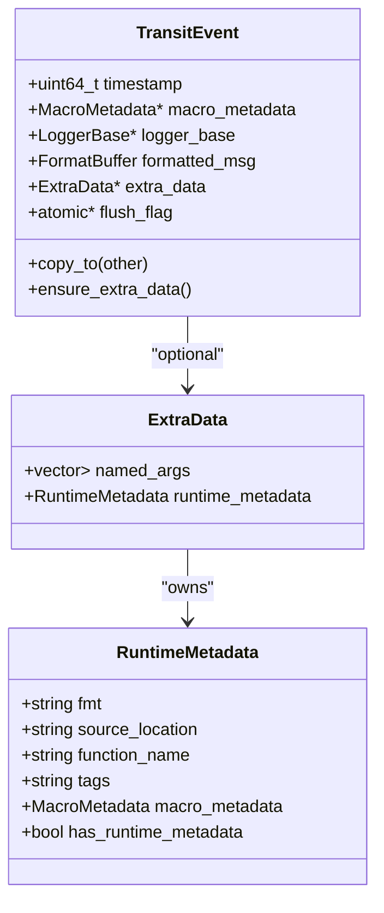
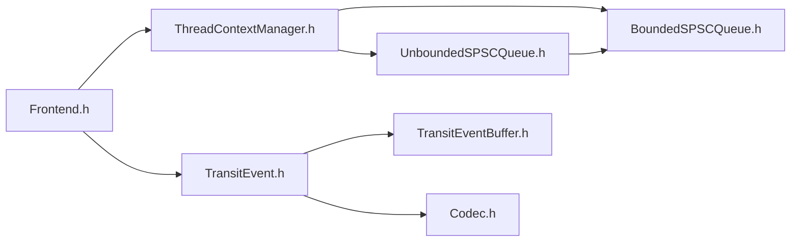

# SPSC Queues Mechanics

<cite>
**Referenced Files in This Document**
- [BoundedSPSCQueue.h](file://include/quill/core/BoundedSPSCQueue.h)
- [UnboundedSPSCQueue.h](file://include/quill/core/UnboundedSPSCQueue.h)
- [TransitEvent.h](file://include/quill/backend/TransitEvent.h)
- [TransitEventBuffer.h](file://include/quill/backend/TransitEventBuffer.h)
- [Common.h](file://include/quill/core/Common.h)
- [Attributes.h](file://include/quill/core/Attributes.h)
- [ThreadContextManager.h](file://include/quill/core/ThreadContextManager.h)
- [Codec.h](file://include/quill/core/Codec.h)
- [Frontend.h](file://include/quill/Frontend.h)
- [bounded_dropping_queue_frontend.cpp](file://examples/bounded_dropping_queue_frontend.cpp)
- [BoundedDroppingQueueTest.cpp](file://test/integration_tests/BoundedDroppingQueueTest.cpp)
- [BoundedQueueTest.cpp](file://test/unit_tests/BoundedQueueTest.cpp)
</cite>

## Update Summary
**Changes Made**
- Updated BoundedSPSCQueue implementation analysis to reflect improved code organization and maintainability
- Enhanced documentation of member variable grouping and #ifdef guard placement improvements
- Added detailed explanation of the reorganized code structure for better readability

## Table of Contents
1. [Introduction](#introduction)
2. [Project Structure](#project-structure)
3. [Core Components](#core-components)
4. [Architecture Overview](#architecture-overview)
5. [Detailed Component Analysis](#detailed-component-analysis)
6. [Dependency Analysis](#dependency-analysis)
7. [Performance Considerations](#performance-considerations)
8. [Troubleshooting Guide](#troubleshooting-guide)
9. [Conclusion](#conclusion)
10. [Appendices](#appendices)

## Introduction
This document explains Quill's Single-Producer Single-Consumer (SPSC) queue design and mechanics. It covers the lock-free implementation, memory ordering guarantees, zero-copy message passing, and the differences between bounded and unbounded queues. It also documents the TransitEvent structure, serialization of log messages, memory management, and practical configuration and tuning guidance for different use cases.

## Project Structure
Quill organizes SPSC queue logic under core headers and integrates with backend components for event buffering and serialization. The frontend exposes queue configuration and runtime controls.

**Diagram sources**
- [BoundedSPSCQueue.h:54-348](file://include/quill/core/BoundedSPSCQueue.h#L54-L348)
- [UnboundedSPSCQueue.h:42-337](file://include/quill/core/UnboundedSPSCQueue.h#L42-L337)
- [Common.h:145-180](file://include/quill/core/Common.h#L145-L180)
- [Attributes.h:104-148](file://include/quill/core/Attributes.h#L104-L148)
- [ThreadContextManager.h:56-173](file://include/quill/core/ThreadContextManager.h#L56-L173)
- [Codec.h:144-437](file://include/quill/core/Codec.h#L144-L437)
- [TransitEvent.h:32-219](file://include/quill/backend/TransitEvent.h#L32-L219)
- [TransitEventBuffer.h:19-157](file://include/quill/backend/TransitEventBuffer.h#L19-L157)
- [Frontend.h:32-373](file://include/quill/Frontend.h#L32-L373)
- [bounded_dropping_queue_frontend.cpp:21-32](file://examples/bounded_dropping_queue_frontend.cpp#L21-L32)
- [BoundedDroppingQueueTest.cpp:15-22](file://test/integration_tests/BoundedDroppingQueueTest.cpp#L15-L22)

**Section sources**
- [BoundedSPSCQueue.h:54-348](file://include/quill/core/BoundedSPSCQueue.h#L54-L348)
- [UnboundedSPSCQueue.h:42-337](file://include/quill/core/UnboundedSPSCQueue.h#L42-L337)
- [Common.h:145-180](file://include/quill/core/Common.h#L145-L180)
- [Attributes.h:104-148](file://include/quill/core/Attributes.h#L104-L148)
- [ThreadContextManager.h:56-173](file://include/quill/core/ThreadContextManager.h#L56-L173)
- [Codec.h:144-437](file://include/quill/core/Codec.h#L144-L437)
- [TransitEvent.h:32-219](file://include/quill/backend/TransitEvent.h#L32-L219)
- [TransitEventBuffer.h:19-157](file://include/quill/backend/TransitEventBuffer.h#L19-L157)
- [Frontend.h:32-373](file://include/quill/Frontend.h#L32-L373)
- [bounded_dropping_queue_frontend.cpp:21-32](file://examples/bounded_dropping_queue_frontend.cpp#L21-L32)
- [BoundedDroppingQueueTest.cpp:15-22](file://test/integration_tests/BoundedDroppingQueueTest.cpp#L15-L22)

## Core Components
- BoundedSPSCQueue: Fixed-capacity, lock-free ring buffer with aligned storage and cache-line aware operations. Uses atomic positions and explicit cache flush/prefetch on x86. **Enhanced** with improved code organization and member variable grouping for better readability and maintainability.
- UnboundedSPSCQueue: Producer-driven linked list of bounded queues with exponential growth and controlled maximum capacity. Supports shrinking and seamless handoff between nodes.
- TransitEvent: Zero-copy message container holding formatted logs, metadata, and optional runtime metadata. Uses move semantics and manual buffer copies for safety.
- TransitEventBuffer: Circular buffer for backend-side event batching with dynamic expansion and optional shrink-to-initial.
- Frontend integration: Exposes queue selection, capacity, and runtime controls for thread-local queues.

**Section sources**
- [BoundedSPSCQueue.h:54-348](file://include/quill/core/BoundedSPSCQueue.h#L54-L348)
- [UnboundedSPSCQueue.h:42-337](file://include/quill/core/UnboundedSPSCQueue.h#L42-L337)
- [TransitEvent.h:32-219](file://include/quill/backend/TransitEvent.h#L32-L219)
- [TransitEventBuffer.h:19-157](file://include/quill/backend/TransitEventBuffer.h#L19-L157)
- [Frontend.h:45-111](file://include/quill/Frontend.h#L45-L111)

## Architecture Overview
The SPSC queues connect the frontend logging thread (producer) to the backend worker (consumer). The producer writes serialized log data into the queue, and the consumer drains it for formatting and sink output.

**Diagram sources**
- [BoundedSPSCQueue.h:105-145](file://include/quill/core/BoundedSPSCQueue.h#L105-L145)
- [UnboundedSPSCQueue.h:115-149](file://include/quill/core/UnboundedSPSCQueue.h#L115-L149)
- [TransitEventBuffer.h:72-93](file://include/quill/backend/TransitEventBuffer.h#L72-L93)
- [TransitEvent.h:32-219](file://include/quill/backend/TransitEvent.h#L32-L219)

## Detailed Component Analysis

### BoundedSPSCQueue
- Design: Power-of-two capacity ring buffer with aligned storage. Two atomic positions track writer and reader progress; a reader cache avoids repeated loads.
- Memory ordering: Release on writer commit and acquire on reader load ensure correct publication and consumption ordering.
- Cache optimization: Prefetch and flush operations on x86 architectures reduce cache misses and ensure coherency.
- Capacity and batching: Reader commits in batches to reduce atomic contention; batch size derived from a percentage of capacity.
- Allocation: Platform-specific aligned allocation with optional huge pages support.

**Enhanced Code Organization**: The implementation now features improved code readability through:
- Better #ifdef guard placement for platform-specific optimizations
- Logical grouping of member variables by purpose and usage
- Clear separation between public interface, private implementation, and platform-specific sections
- Organized helper functions and utility methods

Key operations:
- prepare_write(n): Reserve contiguous space; return nullptr if insufficient space.
- finish_write(n): Advance logical write pointer.
- commit_write(): Publish written region to consumer.
- empty(): Check emptiness with cached writer position and atomic reload.
- prepare_read()/finish_read()/commit_read(): Consumer-side operations mirroring producer.

Memory layout and alignment:
- Storage is allocated with platform-specific aligned memory APIs and metadata for safe freeing.
- Cache-line alignment ensures producer and consumer positions reside on separate cache lines.

Overflow behavior:
- If insufficient space, returns nullptr; caller must retry or block/drop depending on queue type.

**Section sources**
- [BoundedSPSCQueue.h:54-348](file://include/quill/core/BoundedSPSCQueue.h#L54-L348)

### UnboundedSPSCQueue
- Design: Linked list of bounded queues. When a node is full, a new node is allocated with doubled capacity up to a configurable maximum.
- Producer growth: On full, commit current node, allocate next node, publish pointer, then reserve in new node.
- Consumer handoff: When consumer detects a new node, it commits current node, deletes it, switches to next node, and returns capacity change.
- Shrink: Producer can shrink to a smaller power-of-two capacity safely by linking a new smaller node and switching.
- Blocking vs dropping: The queue itself is wait-free; higher-level blocking/dropping policies are enforced by the frontend.

**Diagram sources**
- [UnboundedSPSCQueue.h:244-296](file://include/quill/core/UnboundedSPSCQueue.h#L244-L296)

**Section sources**
- [UnboundedSPSCQueue.h:42-337](file://include/quill/core/UnboundedSPSCQueue.h#L42-L337)

### TransitEvent and Serialization
- TransitEvent holds:
  - Timestamp and macro metadata pointer
  - Logger base pointer
  - Formatted message buffer (zero-copy buffer)
  - Optional extra data (named args, runtime metadata)
  - Flush flag for flush events
- Zero-copy message passing:
  - The formatted message is stored in a preallocated buffer owned by TransitEvent.
  - Copy/move operations preserve buffer ownership semantics and update metadata pointers accordingly.
- Codec integration:
  - Argument encoding/decoding is handled by the Codec infrastructure, which computes sizes and performs memcpy-based packing for primitive types and string-like types.
  - The codec caches lengths for strings to avoid recomputation and supports deferred/direct formatting codecs for user-defined types.

**Diagram sources**
- [TransitEvent.h:32-219](file://include/quill/backend/TransitEvent.h#L32-L219)

**Section sources**
- [TransitEvent.h:32-219](file://include/quill/backend/TransitEvent.h#L32-L219)
- [Codec.h:144-437](file://include/quill/core/Codec.h#L144-L437)

### TransitEventBuffer
- Circular buffer for backend batching with:
  - Full capacity check and dynamic expansion by doubling when full.
  - Optional shrink-to-initial when empty and requested.
  - Position tracking with reader/writer indices and mask for circular addressing.

**Section sources**
- [TransitEventBuffer.h:19-157](file://include/quill/backend/TransitEventBuffer.h#L19-L157)

### Frontend Integration and Queue Selection
- QueueType enum selects among:
  - UnboundedBlocking, UnboundedDropping
  - BoundedBlocking, BoundedDropping
- ThreadContextManager stores a union of queues per thread, initialized according to the selected QueueType.
- Frontend exposes:
  - preallocate() to initialize thread-local queue
  - get_thread_local_queue_capacity() and shrink_thread_local_queue() for unbounded queues
  - Logger creation and sink management

**Section sources**
- [Common.h:145-180](file://include/quill/core/Common.h#L145-L180)
- [ThreadContextManager.h:56-173](file://include/quill/core/ThreadContextManager.h#L56-L173)
- [Frontend.h:45-111](file://include/quill/Frontend.h#L45-L111)

## Dependency Analysis
- BoundedSPSCQueue depends on:
  - Platform-specific aligned allocation/free
  - Cache-line constants and attributes
  - Optional x86 intrinsics for prefetch/flush
- UnboundedSPSCQueue composes BoundedSPSCQueue nodes and coordinates growth/shrink decisions.
- TransitEvent relies on Codec for argument serialization and fmt buffer for formatted messages.
- Frontend uses ThreadContextManager to access the correct queue type per thread.

**Diagram sources**
- [Frontend.h:32-373](file://include/quill/Frontend.h#L32-L373)
- [ThreadContextManager.h:56-173](file://include/quill/core/ThreadContextManager.h#L56-L173)
- [BoundedSPSCQueue.h:54-348](file://include/quill/core/BoundedSPSCQueue.h#L54-L348)
- [UnboundedSPSCQueue.h:42-337](file://include/quill/core/UnboundedSPSCQueue.h#L42-L337)
- [TransitEvent.h:32-219](file://include/quill/backend/TransitEvent.h#L32-L219)
- [TransitEventBuffer.h:19-157](file://include/quill/backend/TransitEventBuffer.h#L19-L157)
- [Codec.h:144-437](file://include/quill/core/Codec.h#L144-L437)

**Section sources**
- [Frontend.h:32-373](file://include/quill/Frontend.h#L32-L373)
- [ThreadContextManager.h:56-173](file://include/quill/core/ThreadContextManager.h#L56-L173)
- [BoundedSPSCQueue.h:54-348](file://include/quill/core/BoundedSPSCQueue.h#L54-L348)
- [UnboundedSPSCQueue.h:42-337](file://include/quill/core/UnboundedSPSCQueue.h#L42-L337)
- [TransitEvent.h:32-219](file://include/quill/backend/TransitEvent.h#L32-L219)
- [TransitEventBuffer.h:19-157](file://include/quill/backend/TransitEventBuffer.h#L19-L157)
- [Codec.h:144-437](file://include/quill/core/Codec.h#L144-L437)

## Performance Considerations
- Lock-freeness:
  - Bounded queue uses atomic positions with minimal synchronization; consumer uses cached positions to reduce atomic reads.
  - Unbounded queue is wait-free; growth is linear in capacity doubling and occurs only on full.
- Memory ordering:
  - Writer commit uses release semantics; reader load uses acquire semantics to ensure visibility.
  - Batched reader commits reduce atomic updates frequency.
- Cache optimization:
  - Prefetch hints and explicit cache flushes on x86 reduce pipeline stalls.
- Allocation and huge pages:
  - Aligned allocation with optional huge pages reduces TLB pressure and improves throughput on large buffers.
- Serialization overhead:
  - Codec computes sizes efficiently and uses memcpy for primitives and strings; avoids heap allocations for string views.
- Bounded vs Unbounded:
  - Bounded: predictable latency, fixed memory footprint, potential drops on overflow.
  - Unbounded: grows to meet demand up to a maximum; supports shrinking; may increase memory usage under bursts.

[No sources needed since this section provides general guidance]

## Troubleshooting Guide
- Queue full conditions:
  - Bounded: prepare_write returns nullptr; implement retry/backoff or configure larger capacity.
  - Unbounded: if capacity exceeds maximum, the queue throws an error indicating the configured maximum capacity.
- Overflow handling:
  - BoundedDropping and UnboundedDropping queues will drop messages when full; monitor dropped counts via sinks or metrics.
  - BoundedBlocking and UnboundedBlocking queues will block the producer until space is available.
- Capacity planning:
  - Use Frontend::get_thread_local_queue_capacity() to monitor current capacity for unbounded queues.
  - Use Frontend::shrink_thread_local_queue() to reclaim memory after bursts.
- Example configurations:
  - Small bounded dropping queue to observe dropping behavior.
  - Large bounded blocking queue for strict ordering and no drops.

**Section sources**
- [UnboundedSPSCQueue.h:244-296](file://include/quill/core/UnboundedSPSCQueue.h#L244-L296)
- [bounded_dropping_queue_frontend.cpp:21-32](file://examples/bounded_dropping_queue_frontend.cpp#L21-L32)
- [BoundedDroppingQueueTest.cpp:15-22](file://test/integration_tests/BoundedDroppingQueueTest.cpp#L15-L22)
- [Frontend.h:72-111](file://include/quill/Frontend.h#L72-L111)

## Conclusion
Quill's SPSC queues provide efficient, lock-free inter-thread communication for logging. Bounded queues offer deterministic behavior and low overhead, while unbounded queues adapt to workload bursts with controlled growth and optional shrinking. TransitEvent and the codec system enable zero-copy message passing and flexible serialization. Proper configuration of queue types, capacities, and memory policies yields optimal performance across diverse workloads.

[No sources needed since this section summarizes without analyzing specific files]

## Appendices

### Practical Configuration Examples
- Bounded Dropping Queue:
  - Select queue type BoundedDropping and a small initial capacity to observe dropping behavior.
  - Reference: [bounded_dropping_queue_frontend.cpp:21-32](file://examples/bounded_dropping_queue_frontend.cpp#L21-L32)

- Integration Test for Bounded Dropping:
  - Demonstrates logging with a bounded dropping queue and verifies partial message presence.
  - Reference: [BoundedDroppingQueueTest.cpp:15-22](file://test/integration_tests/BoundedDroppingQueueTest.cpp#L15-L22)

### Unit Tests for SPSC Behavior
- Bounded queue multi-threaded producer/consumer correctness.
- Reference: [BoundedQueueTest.cpp:91-140](file://test/unit_tests/BoundedQueueTest.cpp#L91-L140)

### Queue Types and Policies
- QueueType enum defines available queue modes.
- Reference: [Common.h:145-180](file://include/quill/core/Common.h#L145-L180)

### Enhanced Code Organization Benefits
**Updated** The BoundedSPSCQueue implementation now features improved code organization that enhances maintainability:

- **Better #ifdef Guard Placement**: Conditional compilation blocks are strategically placed to minimize code duplication and improve readability
- **Logical Member Variable Grouping**: Variables are grouped by functional purpose (configuration, storage, atomic positions, cache management) making the code easier to understand and modify
- **Improved Separation of Concerns**: Implementation details are better separated from public interfaces, making the codebase more modular
- **Enhanced Readability**: The reorganized structure makes it easier for developers to locate specific functionality and understand the overall design

These organizational improvements contribute to better long-term maintainability while preserving all existing functionality and performance characteristics.