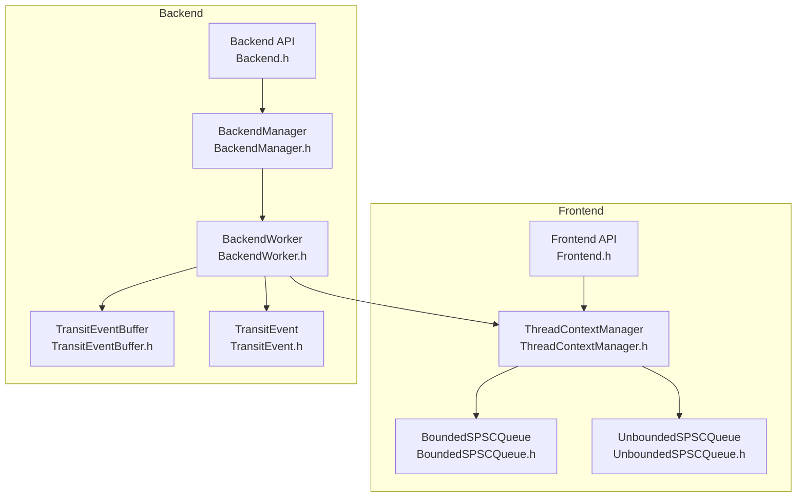
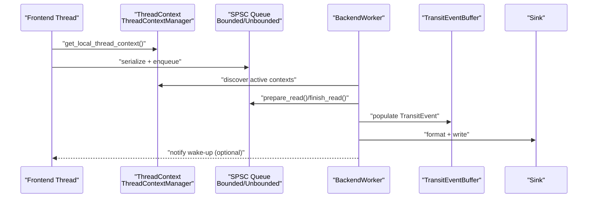
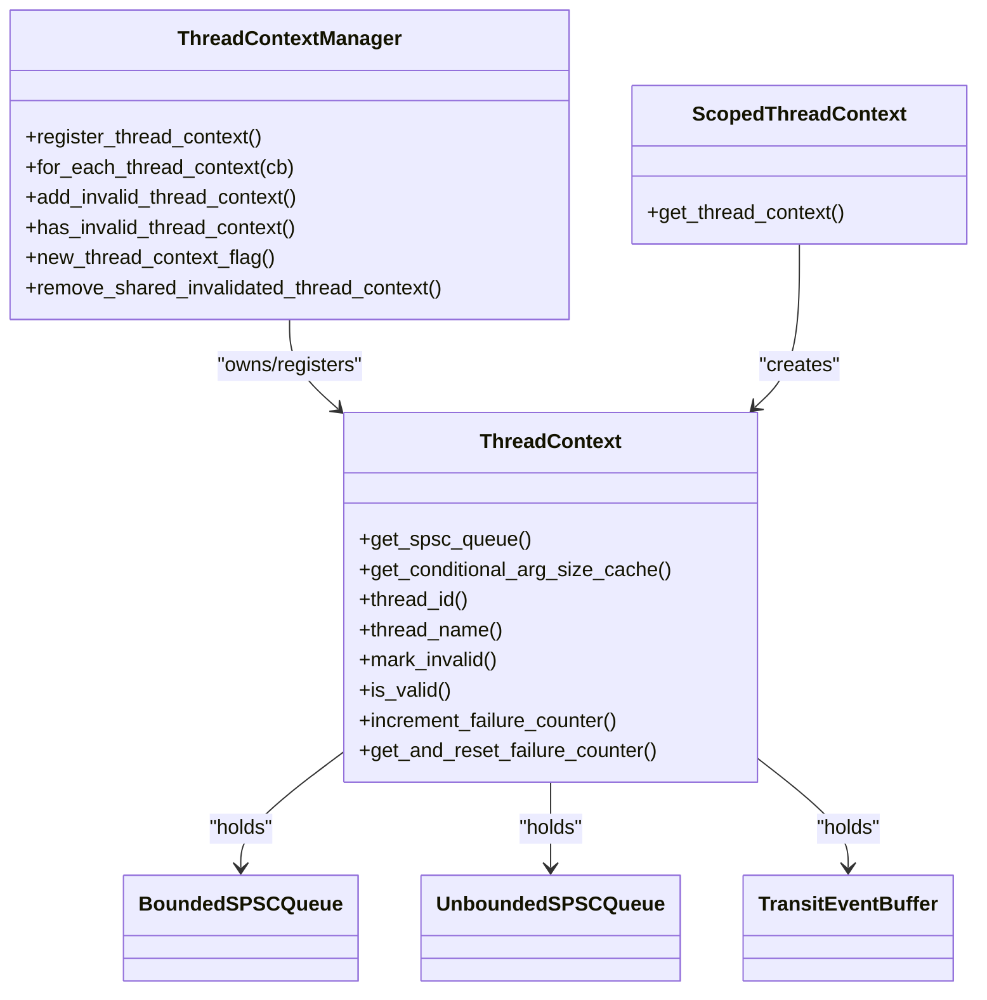
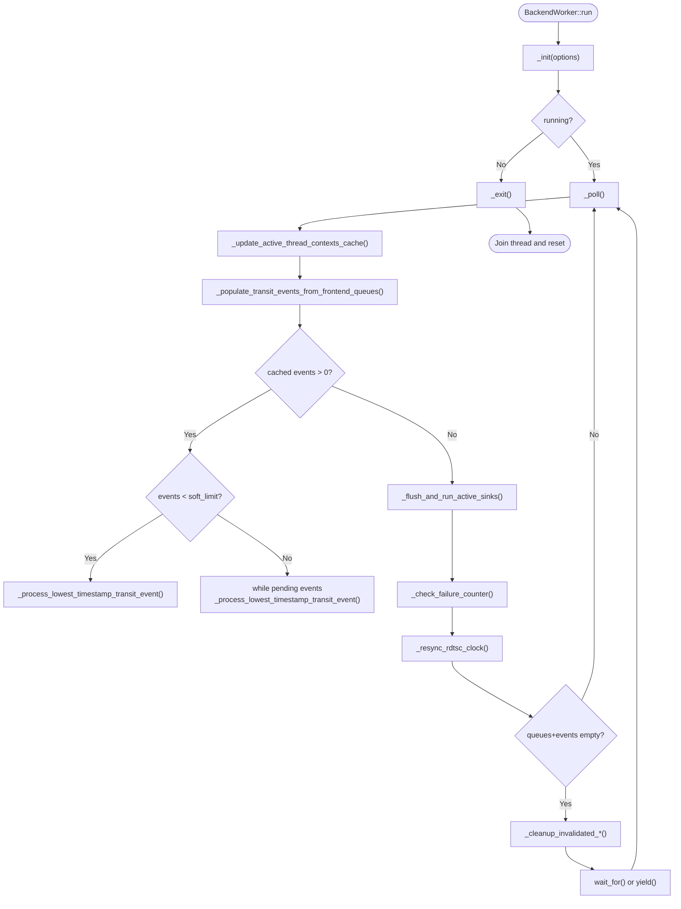
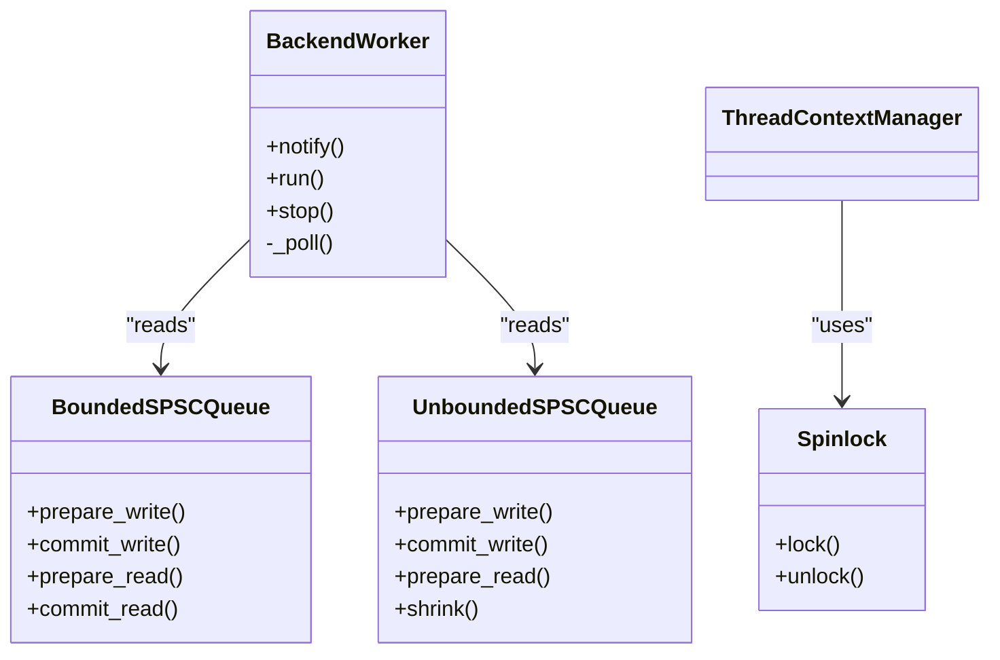
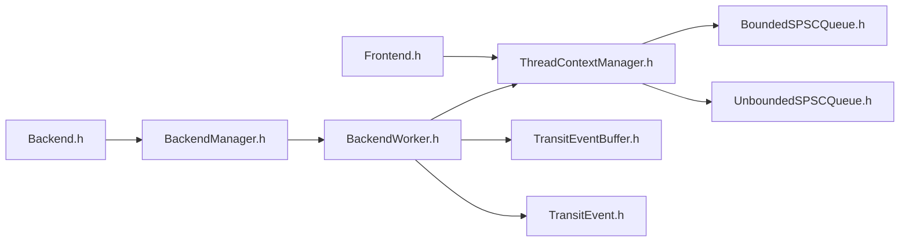

# Threading Model

<cite>
**Referenced Files in This Document**
- [ThreadContextManager.h](file://include/quill/core/ThreadContextManager.h)
- [BackendWorker.h](file://include/quill/backend/BackendWorker.h)
- [BackendManager.h](file://include/quill/backend/BackendManager.h)
- [Frontend.h](file://include/quill/Frontend.h)
- [BoundedSPSCQueue.h](file://include/quill/core/BoundedSPSCQueue.h)
- [UnboundedSPSCQueue.h](file://include/quill/core/UnboundedSPSCQueue.h)
- [Spinlock.h](file://include/quill/core/Spinlock.h)
- [TransitEventBuffer.h](file://include/quill/backend/TransitEventBuffer.h)
- [TransitEvent.h](file://include/quill/backend/TransitEvent.h)
- [MultiFrontendThreadsTest.cpp](file://test/integration_tests/MultiFrontendThreadsTest.cpp)
- [ThreadContextManagerTest.cpp](file://test/unit_tests/ThreadContextManagerTest.cpp)
</cite>

## Table of Contents
1. [Introduction](#introduction)
2. [Project Structure](#project-structure)
3. [Core Components](#core-components)
4. [Architecture Overview](#architecture-overview)
5. [Detailed Component Analysis](#detailed-component-analysis)
6. [Dependency Analysis](#dependency-analysis)
7. [Performance Considerations](#performance-considerations)
8. [Troubleshooting Guide](#troubleshooting-guide)
9. [Conclusion](#conclusion)

## Introduction
This document explains Quill’s multi-threaded architecture with a focus on the threading model. It describes the distinct roles of frontend threads (which create log messages and enqueue them into per-thread SPSC queues) versus backend threads (which dequeue, format, and write logs). It documents the ThreadContextManager’s role in managing per-thread state, thread-local storage usage, and context switching. It covers the backend worker thread lifecycle (startup, main processing loop, shutdown), synchronization primitives (atomics, spinlocks, condition variables), and thread-safety guarantees. Practical examples and performance implications of different threading configurations are included.

## Project Structure
Quill organizes threading across three layers:
- Frontend (per-thread): Produces log messages and enqueues them into lock-free SPSC queues.
- Backend (single dedicated thread): Dequeues, formats, and writes logs to sinks.
- Shared managers: Coordinate lifecycle and thread-safe collections.

**Diagram sources**
- [Frontend.h:32-373](file://include/quill/Frontend.h#L32-L373)
- [ThreadContextManager.h:216-430](file://include/quill/core/ThreadContextManager.h#L216-L430)
- [BoundedSPSCQueue.h:54-356](file://include/quill/core/BoundedSPSCQueue.h#L54-L356)
- [UnboundedSPSCQueue.h:42-345](file://include/quill/core/UnboundedSPSCQueue.h#L42-L345)
- [Backend.h:29-246](file://include/quill/Backend.h#L29-L246)
- [BackendManager.h:38-136](file://include/quill/backend/BackendManager.h#L38-L136)
- [BackendWorker.h:77-1765](file://include/quill/backend/BackendWorker.h#L77-L1765)
- [TransitEventBuffer.h:19-162](file://include/quill/backend/TransitEventBuffer.h#L19-L162)
- [TransitEvent.h:32-222](file://include/quill/backend/TransitEvent.h#L32-L222)

**Section sources**
- [Frontend.h:32-373](file://include/quill/Frontend.h#L32-L373)
- [Backend.h:29-246](file://include/quill/Backend.h#L29-L246)
- [BackendManager.h:38-136](file://include/quill/backend/BackendManager.h#L38-L136)
- [ThreadContextManager.h:216-430](file://include/quill/core/ThreadContextManager.h#L216-L430)
- [BoundedSPSCQueue.h:54-356](file://include/quill/core/BoundedSPSCQueue.h#L54-L356)
- [UnboundedSPSCQueue.h:42-345](file://include/quill/core/UnboundedSPSCQueue.h#L42-L345)
- [TransitEventBuffer.h:19-162](file://include/quill/backend/TransitEventBuffer.h#L19-L162)
- [TransitEvent.h:32-222](file://include/quill/backend/TransitEvent.h#L32-L222)

## Core Components
- ThreadContext and ThreadContextManager
  - Per-thread state container holding a SPSC queue (bounded or unbounded) and a per-thread TransitEventBuffer.
  - Manages registration/unregistration, validity flags, and failure counters.
  - Uses a spinlock to protect shared collections and atomics for flags and counters.

- Frontend API
  - Provides preallocate, shrink, and queue capacity helpers for per-thread queues.
  - Ensures thread-local context is created on first use.

- Backend API and BackendManager
  - Start/stop the backend worker thread, notify wake-up, and expose backend thread id.
  - BackendManager coordinates singleton lifecycle and atexit handling.

- BackendWorker
  - Dedicated backend thread performing dequeue, decode, format, and sink write.
  - Implements a polling loop with wake-up signaling and idle sleep/yield.

- SPSC Queues
  - BoundedSPSCQueue: Power-of-two capacity, lock-free with atomic positions and cache-line alignment.
  - UnboundedSPSCQueue: Chain of nodes; grows by powers of two up to a max; supports shrink.

- TransitEvent and TransitEventBuffer
  - TransitEvent holds formatted message and metadata; TransitEventBuffer is a circular buffer for cached events.

**Section sources**
- [ThreadContextManager.h:53-214](file://include/quill/core/ThreadContextManager.h#L53-L214)
- [ThreadContextManager.h:216-430](file://include/quill/core/ThreadContextManager.h#L216-L430)
- [Frontend.h:32-373](file://include/quill/Frontend.h#L32-L373)
- [Backend.h:29-246](file://include/quill/Backend.h#L29-L246)
- [BackendManager.h:38-136](file://include/quill/backend/BackendManager.h#L38-L136)
- [BackendWorker.h:77-1765](file://include/quill/backend/BackendWorker.h#L77-L1765)
- [BoundedSPSCQueue.h:54-356](file://include/quill/core/BoundedSPSCQueue.h#L54-L356)
- [UnboundedSPSCQueue.h:42-345](file://include/quill/core/UnboundedSPSCQueue.h#L42-L345)
- [TransitEventBuffer.h:19-162](file://include/quill/backend/TransitEventBuffer.h#L19-L162)
- [TransitEvent.h:32-222](file://include/quill/backend/TransitEvent.h#L32-L222)

## Architecture Overview
The threading model separates concerns:
- Frontend threads: create log records, serialize them, and enqueue into per-thread SPSC queues. They do not perform I/O.
- Backend thread: pulls records from all active ThreadContexts, decodes, formats, and writes to sinks. It maintains a per-thread TransitEventBuffer for batching and ordering.

**Diagram sources**
- [ThreadContextManager.h:405-422](file://include/quill/core/ThreadContextManager.h#L405-L422)
- [BackendWorker.h:479-573](file://include/quill/backend/BackendWorker.h#L479-L573)
- [TransitEventBuffer.h:72-107](file://include/quill/backend/TransitEventBuffer.h#L72-L107)
- [BoundedSPSCQueue.h:105-169](file://include/quill/core/BoundedSPSCQueue.h#L105-L169)
- [UnboundedSPSCQueue.h:115-223](file://include/quill/core/UnboundedSPSCQueue.h#L115-L223)

## Detailed Component Analysis

### ThreadContextManager and ThreadContext
- Responsibilities
  - Register/unregister per-thread ThreadContext instances.
  - Track invalid contexts (when owning thread exits) and empty queues.
  - Provide a cache of active contexts to the backend worker.
  - Use a spinlock to guard shared vector of contexts and atomics for flags.

- Thread-local usage
  - get_local_thread_context<TFrontendOptions>() returns a thread-local ScopedThreadContext, which constructs a ThreadContext with queue type and capacity policy.
  - ScopedThreadContext registers itself on construction and marks invalid on destruction.

- Context switching
  - Backend updates its local cache of active contexts when ThreadContextManager reports new contexts.
  - Invalidated contexts are removed after queues and buffers are empty.

**Diagram sources**
- [ThreadContextManager.h:53-214](file://include/quill/core/ThreadContextManager.h#L53-L214)
- [ThreadContextManager.h:216-430](file://include/quill/core/ThreadContextManager.h#L216-L430)

**Section sources**
- [ThreadContextManager.h:53-214](file://include/quill/core/ThreadContextManager.h#L53-L214)
- [ThreadContextManager.h:216-430](file://include/quill/core/ThreadContextManager.h#L216-L430)
- [ThreadContextManagerTest.cpp:15-116](file://test/unit_tests/ThreadContextManagerTest.cpp#L15-L116)

### Backend Worker Lifecycle
- Startup
  - Backend::start() ensures singleton initialization and starts BackendManager::start_backend_thread().
  - BackendWorker::run() creates a std::thread, initializes CPU affinity and thread name, sets running flag, and enters the main loop.

- Main processing loop
  - _poll(): Updates active contexts cache, reads all frontend queues, decodes into TransitEventBuffer, processes the earliest timestamp event, flushes sinks, checks for dropped messages, resyncs RDTSC clock, and sleeps or yields when idle.

- Shutdown
  - Backend::stop() calls BackendManager::stop_backend_thread(), which sets running=false, notifies, joins the worker, resets lock and thread id.

**Diagram sources**
- [BackendWorker.h:138-232](file://include/quill/backend/BackendWorker.h#L138-L232)
- [BackendWorker.h:305-395](file://include/quill/backend/BackendWorker.h#L305-L395)
- [BackendWorker.h:479-506](file://include/quill/backend/BackendWorker.h#L479-L506)
- [BackendWorker.h:795-864](file://include/quill/backend/BackendWorker.h#L795-L864)
- [BackendWorker.h:1232-1262](file://include/quill/backend/BackendWorker.h#L1232-L1262)
- [BackendWorker.h:1396-1454](file://include/quill/backend/BackendWorker.h#L1396-L1454)
- [BackendWorker.h:1459-1490](file://include/quill/backend/BackendWorker.h#L1459-L1490)
- [BackendWorker.h:1496-1505](file://include/quill/backend/BackendWorker.h#L1496-L1505)

**Section sources**
- [BackendWorker.h:138-232](file://include/quill/backend/BackendWorker.h#L138-L232)
- [BackendWorker.h:305-395](file://include/quill/backend/BackendWorker.h#L305-L395)
- [BackendWorker.h:479-506](file://include/quill/backend/BackendWorker.h#L479-L506)
- [BackendWorker.h:795-864](file://include/quill/backend/BackendWorker.h#L795-L864)
- [BackendWorker.h:1232-1262](file://include/quill/backend/BackendWorker.h#L1232-L1262)
- [BackendWorker.h:1396-1454](file://include/quill/backend/BackendWorker.h#L1396-L1454)
- [BackendWorker.h:1459-1490](file://include/quill/backend/BackendWorker.h#L1459-L1490)
- [BackendWorker.h:1496-1505](file://include/quill/backend/BackendWorker.h#L1496-L1505)

### Synchronization Primitives and Lock-Free Design
- Lock-free queues
  - BoundedSPSCQueue: Two atomic positions (writer/read), reader/writer caches, and periodic cache-line flush/prefetch for performance.
  - UnboundedSPSCQueue: Nodes chained by atomic next pointer; producer switches to new node on overflow; consumer deletes old node after draining.

- Backend synchronization
  - Condition variable and mutex for wake-up signaling; atomic flags for state and RDTSC clock pointer.
  - Spinlock protects ThreadContextManager’s shared vector of contexts.

- Atomics and memory ordering
  - Relaxed atomics for counters and flags where visibility across threads is not required.
  - Acquire/Release semantics for positions and running flag to ensure proper ordering.

**Diagram sources**
- [Spinlock.h:18-75](file://include/quill/core/Spinlock.h#L18-L75)
- [BoundedSPSCQueue.h:105-169](file://include/quill/core/BoundedSPSCQueue.h#L105-L169)
- [UnboundedSPSCQueue.h:115-223](file://include/quill/core/UnboundedSPSCQueue.h#L115-L223)
- [BackendWorker.h:238-256](file://include/quill/backend/BackendWorker.h#L238-L256)
- [BackendWorker.h:138-232](file://include/quill/backend/BackendWorker.h#L138-L232)

**Section sources**
- [Spinlock.h:18-75](file://include/quill/core/Spinlock.h#L18-L75)
- [BoundedSPSCQueue.h:105-169](file://include/quill/core/BoundedSPSCQueue.h#L105-L169)
- [UnboundedSPSCQueue.h:115-223](file://include/quill/core/UnboundedSPSCQueue.h#L115-L223)
- [BackendWorker.h:238-256](file://include/quill/backend/BackendWorker.h#L238-L256)
- [BackendWorker.h:138-232](file://include/quill/backend/BackendWorker.h#L138-L232)

### Frontend Threads: Log Creation and Queue Operations
- Per-thread context
  - get_local_thread_context<TFrontendOptions>() ensures a ThreadContext exists for the current thread.
  - Frontend::preallocate() reserves queue capacity to avoid allocation on hot path.

- Queue operations
  - Bounded queue: prepare_write/finish_write/commit_write; read via prepare_read/finish_read/commit_read.
  - Unbounded queue: similar API with automatic growth and optional shrink.

- Thread-safety
  - Producer/consumer are single-threaded per queue; cross-thread contention is avoided by per-thread queues.
  - Backend uses only read-side APIs; no concurrent writers.

**Section sources**
- [Frontend.h:32-111](file://include/quill/Frontend.h#L32-L111)
- [BoundedSPSCQueue.h:105-169](file://include/quill/core/BoundedSPSCQueue.h#L105-L169)
- [UnboundedSPSCQueue.h:115-223](file://include/quill/core/UnboundedSPSCQueue.h#L115-L223)
- [ThreadContextManager.h:405-422](file://include/quill/core/ThreadContextManager.h#L405-L422)

### Backend Processing Pipeline
- Decode and cache
  - _populate_transit_events_from_frontend_queues() iterates active contexts and reads from queues into TransitEventBuffer.
  - _populate_transit_event_from_frontend_queue() deserializes fields, applies runtime metadata, formats named arguments, and stores formatted message.

- Ordering and timestamp handling
  - _process_lowest_timestamp_transit_event() selects the earliest timestamp across all buffers to preserve ordering.
  - Grace period logic prevents out-of-order processing when timestamps appear ahead of current time.

- Formatting and sinks
  - _dispatch_transit_event_to_sinks() resolves or lazily creates PatternFormatter and writes to sinks with filtering.

- Flush and cleanup
  - Flush events trigger immediate flush and notify caller via atomic flag.
  - Invalidated contexts and loggers are cleaned up when queues and buffers are empty.

**Section sources**
- [BackendWorker.h:479-506](file://include/quill/backend/BackendWorker.h#L479-L506)
- [BackendWorker.h:576-755](file://include/quill/backend/BackendWorker.h#L576-L755)
- [BackendWorker.h:795-864](file://include/quill/backend/BackendWorker.h#L795-L864)
- [BackendWorker.h:957-1068](file://include/quill/backend/BackendWorker.h#L957-L1068)
- [BackendWorker.h:1074-1105](file://include/quill/backend/BackendWorker.h#L1074-L1105)
- [BackendWorker.h:1396-1454](file://include/quill/backend/BackendWorker.h#L1396-L1454)
- [BackendWorker.h:1459-1490](file://include/quill/backend/BackendWorker.h#L1459-L1490)

### Practical Examples and Interactions
- Multi-frontend threads logging concurrently
  - Example test spawns multiple threads, each preallocating, creating a file sink/logger, and emitting logs. Backend::start() and Backend::stop() bracket the test.
  - Demonstrates per-thread isolation and backend aggregation.

- Thread context lifecycle
  - Unit test verifies that contexts are created per thread, marked invalid on completion, and removed after queues and buffers are empty.

**Section sources**
- [MultiFrontendThreadsTest.cpp:17-94](file://test/integration_tests/MultiFrontendThreadsTest.cpp#L17-L94)
- [ThreadContextManagerTest.cpp:15-116](file://test/unit_tests/ThreadContextManagerTest.cpp#L15-L116)

## Dependency Analysis
Key dependencies and coupling:
- Frontend depends on ThreadContextManager for per-thread state and on SPSC queues for buffering.
- BackendWorker depends on ThreadContextManager for active contexts, SPSC queues for dequeue, and TransitEventBuffer for batching.
- BackendManager encapsulates BackendWorker and exposes thread-safe APIs to the application.
- Synchronization primitives are localized to specific components (queues, spinlock, condition variable).

**Diagram sources**
- [Frontend.h:32-373](file://include/quill/Frontend.h#L32-L373)
- [ThreadContextManager.h:216-430](file://include/quill/core/ThreadContextManager.h#L216-L430)
- [BoundedSPSCQueue.h:54-356](file://include/quill/core/BoundedSPSCQueue.h#L54-L356)
- [UnboundedSPSCQueue.h:42-345](file://include/quill/core/UnboundedSPSCQueue.h#L42-L345)
- [Backend.h:29-246](file://include/quill/Backend.h#L29-L246)
- [BackendManager.h:38-136](file://include/quill/backend/BackendManager.h#L38-L136)
- [BackendWorker.h:77-1765](file://include/quill/backend/BackendWorker.h#L77-L1765)
- [TransitEventBuffer.h:19-162](file://include/quill/backend/TransitEventBuffer.h#L19-L162)
- [TransitEvent.h:32-222](file://include/quill/backend/TransitEvent.h#L32-L222)

**Section sources**
- [Frontend.h:32-373](file://include/quill/Frontend.h#L32-L373)
- [Backend.h:29-246](file://include/quill/Backend.h#L29-L246)
- [BackendManager.h:38-136](file://include/quill/backend/BackendManager.h#L38-L136)
- [BackendWorker.h:77-1765](file://include/quill/backend/BackendWorker.h#L77-L1765)
- [ThreadContextManager.h:216-430](file://include/quill/core/ThreadContextManager.h#L216-L430)
- [BoundedSPSCQueue.h:54-356](file://include/quill/core/BoundedSPSCQueue.h#L54-L356)
- [UnboundedSPSCQueue.h:42-345](file://include/quill/core/UnboundedSPSCQueue.h#L42-L345)
- [TransitEventBuffer.h:19-162](file://include/quill/backend/TransitEventBuffer.h#L19-L162)
- [TransitEvent.h:32-222](file://include/quill/backend/TransitEvent.h#L32-L222)

## Performance Considerations
- Lock-free queues
  - BoundedSPSCQueue minimizes contention with atomic positions and periodic cache-line flush/prefetch.
  - UnboundedSPSCQueue grows exponentially and supports shrink to reduce memory footprint post-burst.

- Backend scheduling
  - Soft and hard limits on cached events influence batching vs. continuous processing.
  - Sleep duration and yield-on-idle tune CPU utilization vs. latency.

- Memory and alignment
  - Cache-line alignment and huge pages policies can improve performance on supported platforms.

- Timestamp ordering
  - Grace period and strict ordering logic prevent out-of-order writes at the cost of temporary suspension when timestamps appear ahead of current time.

[No sources needed since this section provides general guidance]

## Troubleshooting Guide
- Backend not running or not responding to notify
  - Verify Backend::start() was called once and Backend::is_running() is true.
  - Ensure notify() is called from any thread and backend is not sleeping with zero sleep duration.

- Messages not appearing
  - Confirm all frontend threads have created a ThreadContext (Frontend::preallocate() or first log).
  - Check that queues are not full (bounded) or that unbounded queues did not exceed max capacity.

- Out-of-order logs
  - Review grace period configuration and logger clock source; ensure strict ordering is enabled when needed.

- Excessive memory usage
  - Use Frontend::shrink_thread_local_queue() for unbounded queues after bursts.
  - Allow TransitEventBuffer to shrink when queues are empty.

**Section sources**
- [Backend.h:139-162](file://include/quill/Backend.h#L139-L162)
- [Frontend.h:72-111](file://include/quill/Frontend.h#L72-L111)
- [BackendWorker.h:1232-1262](file://include/quill/backend/BackendWorker.h#L1232-L1262)
- [UnboundedSPSCQueue.h:166-183](file://include/quill/core/UnboundedSPSCQueue.h#L166-L183)
- [TransitEventBuffer.h:109-125](file://include/quill/backend/TransitEventBuffer.h#L109-L125)

## Conclusion
Quill’s threading model cleanly separates hot-path frontend logging from background formatting and I/O. Per-thread SPSC queues eliminate cross-thread contention, while the backend worker aggregates, orders, formats, and writes logs efficiently. ThreadContextManager and ScopedThreadContext provide robust per-thread state management, and atomics/spinlocks coordinate shared state safely. The design balances throughput and latency through configurable batching, sleep/yield strategies, and careful timestamp ordering.