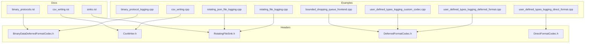
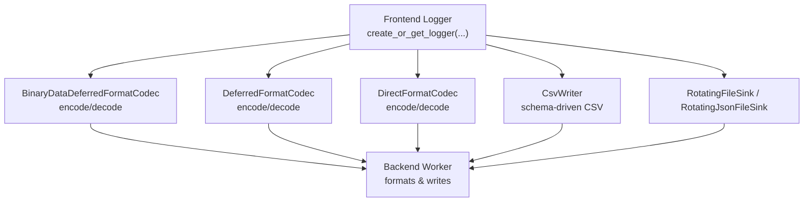
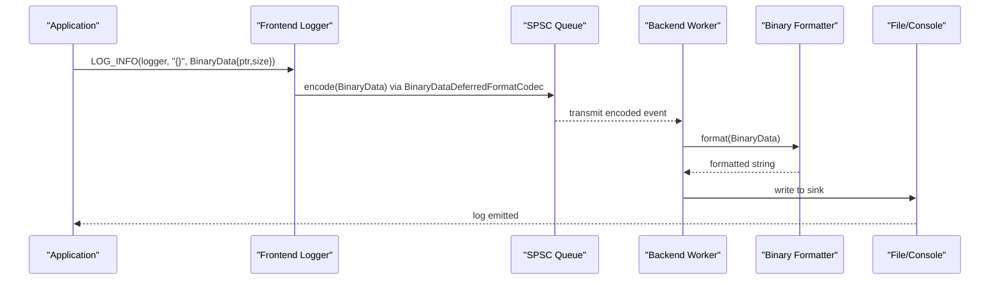
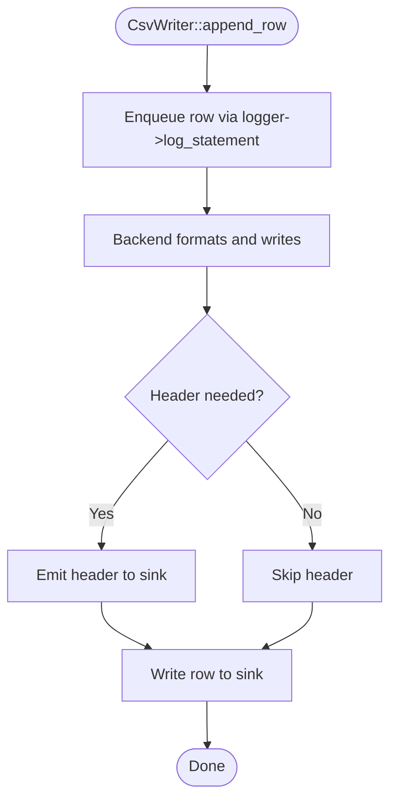
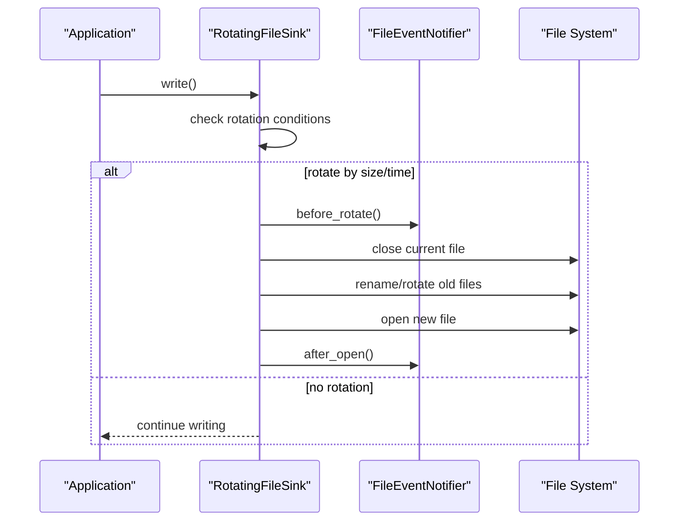
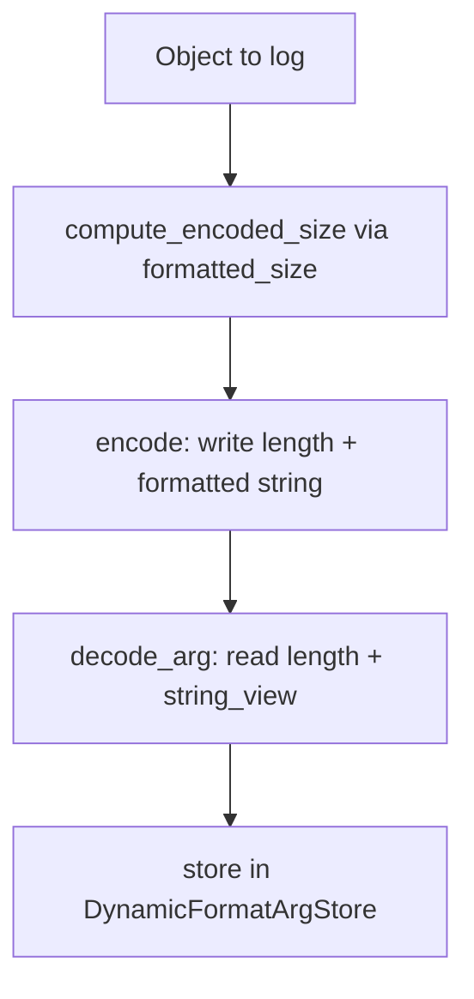
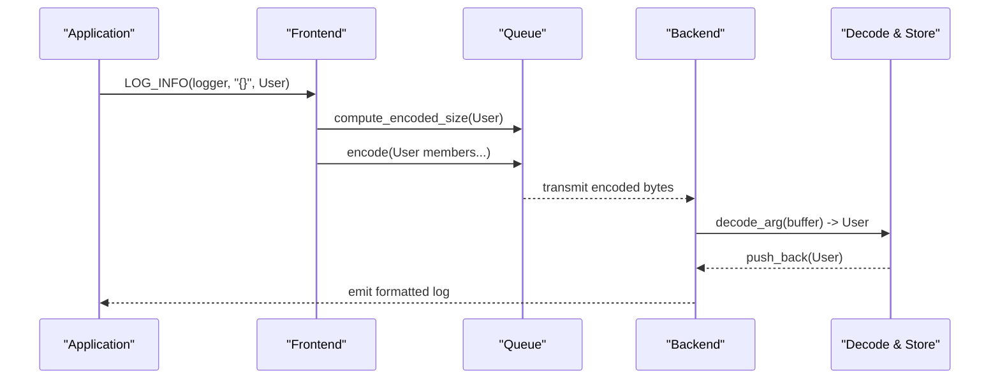
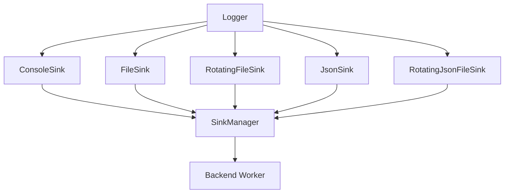
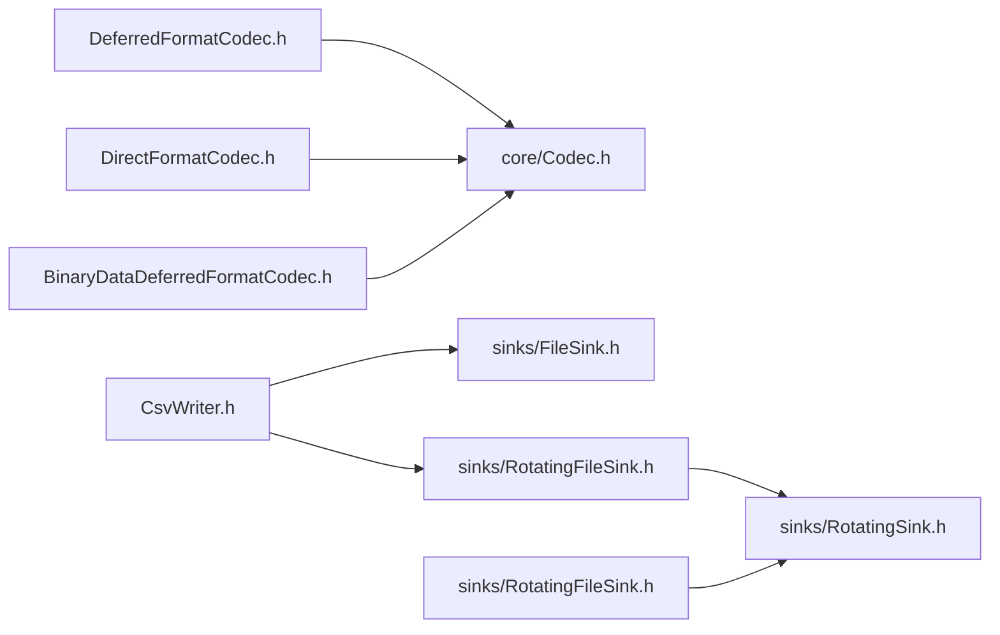

# Advanced Examples

<cite>
**Referenced Files in This Document**
- [binary_protocol_logging.cpp](file://examples/binary_protocol_logging.cpp)
- [binary_data_deferred_format_codec.h](file://include/quill/BinaryDataDeferredFormatCodec.h)
- [csv_writer.h](file://include/quill/CsvWriter.h)
- [csv_writing.cpp](file://examples/csv_writing.cpp)
- [csv_writing.rst](file://docs/csv_writing.rst)
- [rotating_file_logging.cpp](file://examples/rotating_file_logging.cpp)
- [rotating_json_file_logging.cpp](file://examples/rotating_json_file_logging.cpp)
- [rotating_file_sink.h](file://include/quill/sinks/RotatingFileSink.h)
- [user_defined_types_logging_deferred_format.cpp](file://examples/user_defined_types_logging_deferred_format.cpp)
- [deferred_format_codec.h](file://include/quill/DeferredFormatCodec.h)
- [user_defined_types_logging_direct_format.cpp](file://examples/user_defined_types_logging_direct_format.cpp)
- [direct_format_codec.h](file://include/quill/DirectFormatCodec.h)
- [user_defined_types_logging_custom_codec.cpp](file://examples/user_defined_types_logging_custom_codec.cpp)
- [binary_protocols.rst](file://docs/binary_protocols.rst)
- [bounded_dropping_queue_frontend.cpp](file://examples/bounded_dropping_queue_frontend.cpp)
- [sinks.rst](file://docs/sinks.rst)
</cite>

## Table of Contents
1. [Introduction](#introduction)
2. [Project Structure](#project-structure)
3. [Core Components](#core-components)
4. [Architecture Overview](#architecture-overview)
5. [Detailed Component Analysis](#detailed-component-analysis)
6. [Dependency Analysis](#dependency-analysis)
7. [Performance Considerations](#performance-considerations)
8. [Troubleshooting Guide](#troubleshooting-guide)
9. [Conclusion](#conclusion)
10. [Appendices](#appendices)

## Introduction
This document presents advanced, production-ready examples for high-performance logging with Quill. It covers:
- Binary protocol logging with zero-copy serialization via deferred formatting
- CSV writing for analytical exports and pipelines
- Rotating file logging with size/time-based rotation and backup management
- User-defined type logging with deferred and direct format codecs
- Performance optimization patterns for memory management, queue configuration, and throughput maximization

Each example includes design rationale, performance implications, and production considerations.

## Project Structure
The repository organizes advanced examples under the examples/ directory and complementary documentation under docs/. The relevant headers for codecs and sinks live under include/quill/.



**Diagram sources**
- [binary_protocol_logging.cpp:1-242](file://examples/binary_protocol_logging.cpp#L1-L242)
- [csv_writing.cpp:1-33](file://examples/csv_writing.cpp#L1-L33)
- [rotating_file_logging.cpp:1-45](file://examples/rotating_file_logging.cpp#L1-L45)
- [rotating_json_file_logging.cpp:1-45](file://examples/rotating_json_file_logging.cpp#L1-L45)
- [user_defined_types_logging_deferred_format.cpp:1-71](file://examples/user_defined_types_logging_deferred_format.cpp#L1-L71)
- [user_defined_types_logging_direct_format.cpp:1-102](file://examples/user_defined_types_logging_direct_format.cpp#L1-L102)
- [user_defined_types_logging_custom_codec.cpp:1-130](file://examples/user_defined_types_logging_custom_codec.cpp#L1-L130)
- [binary_data_deferred_format_codec.h:1-165](file://include/quill/BinaryDataDeferredFormatCodec.h#L1-L165)
- [csv_writer.h:1-233](file://include/quill/CsvWriter.h#L1-L233)
- [rotating_file_sink.h:1-15](file://include/quill/sinks/RotatingFileSink.h#L1-L15)
- [deferred_format_codec.h:1-229](file://include/quill/DeferredFormatCodec.h#L1-L229)
- [direct_format_codec.h:1-117](file://include/quill/DirectFormatCodec.h#L1-L117)
- [binary_protocols.rst:1-146](file://docs/binary_protocols.rst#L1-L146)
- [csv_writing.rst:1-33](file://docs/csv_writing.rst#L1-L33)
- [sinks.rst:1-66](file://docs/sinks.rst#L1-L66)

**Section sources**
- [binary_protocol_logging.cpp:1-242](file://examples/binary_protocol_logging.cpp#L1-L242)
- [csv_writing.cpp:1-33](file://examples/csv_writing.cpp#L1-L33)
- [rotating_file_logging.cpp:1-45](file://examples/rotating_file_logging.cpp#L1-L45)
- [rotating_json_file_logging.cpp:1-45](file://examples/rotating_json_file_logging.cpp#L1-L45)
- [user_defined_types_logging_deferred_format.cpp:1-71](file://examples/user_defined_types_logging_deferred_format.cpp#L1-L71)
- [user_defined_types_logging_direct_format.cpp:1-102](file://examples/user_defined_types_logging_direct_format.cpp#L1-L102)
- [user_defined_types_logging_custom_codec.cpp:1-130](file://examples/user_defined_types_logging_custom_codec.cpp#L1-L130)
- [binary_data_deferred_format_codec.h:1-165](file://include/quill/BinaryDataDeferredFormatCodec.h#L1-L165)
- [csv_writer.h:1-233](file://include/quill/CsvWriter.h#L1-L233)
- [rotating_file_sink.h:1-15](file://include/quill/sinks/RotatingFileSink.h#L1-L15)
- [deferred_format_codec.h:1-229](file://include/quill/DeferredFormatCodec.h#L1-L229)
- [direct_format_codec.h:1-117](file://include/quill/DirectFormatCodec.h#L1-L117)
- [binary_protocols.rst:1-146](file://docs/binary_protocols.rst#L1-L146)
- [csv_writing.rst:1-33](file://docs/csv_writing.rst#L1-L33)
- [sinks.rst:1-66](file://docs/sinks.rst#L1-L66)

## Core Components
- Binary protocol logging with deferred formatting: Uses BinaryData and BinaryDataDeferredFormatCodec to minimize hot-path work and defer formatting to the backend thread.
- CSV writing: CsvWriter asynchronously writes CSV rows with a compile-time schema, deferring formatting and I/O to the backend.
- Rotating file logging: Configurable rotation by size and time with backup management via RotatingFileSink and JSON variants.
- User-defined type logging: Two codecs enable efficient logging of custom types:
  - DeferredFormatCodec: Zero-copy or minimal-copy serialization with placement new and alignment-aware decoding.
  - DirectFormatCodec: Converts objects to strings on the hot path using fmtquill::format.
- Queue configuration: BoundedDropping queue reduces memory footprint and controls drop behavior under load.

**Section sources**
- [binary_data_deferred_format_codec.h:22-165](file://include/quill/BinaryDataDeferredFormatCodec.h#L22-L165)
- [csv_writer.h:25-233](file://include/quill/CsvWriter.h#L25-L233)
- [rotating_file_sink.h:13-13](file://include/quill/sinks/RotatingFileSink.h#L13-L13)
- [deferred_format_codec.h:29-229](file://include/quill/DeferredFormatCodec.h#L29-L229)
- [direct_format_codec.h:22-117](file://include/quill/DirectFormatCodec.h#L22-L117)
- [bounded_dropping_queue_frontend.cpp:18-32](file://examples/bounded_dropping_queue_frontend.cpp#L18-L32)

## Architecture Overview
The advanced examples follow a consistent pattern:
- Frontend initializes a logger with a chosen sink
- Backend worker performs formatting and I/O asynchronously
- Codecs handle serialization/deserialization of user-defined types or binary data



**Diagram sources**
- [binary_data_deferred_format_codec.h:120-165](file://include/quill/BinaryDataDeferredFormatCodec.h#L120-L165)
- [deferred_format_codec.h:90-229](file://include/quill/DeferredFormatCodec.h#L90-L229)
- [direct_format_codec.h:86-117](file://include/quill/DirectFormatCodec.h#L86-L117)
- [csv_writer.h:44-233](file://include/quill/CsvWriter.h#L44-L233)
- [rotating_file_sink.h:13-13](file://include/quill/sinks/RotatingFileSink.h#L13-L13)

## Detailed Component Analysis

### Binary Protocol Logging with Zero-Copy Serialization
This example demonstrates logging variable-length binary messages with deferred formatting. The hot path copies raw bytes; formatting occurs on the backend thread.

Key design decisions:
- Use BinaryData<T> to tag binary payloads and avoid ownership overhead
- Implement a custom formatter to parse binary messages and optionally render hex dumps
- Specialize Codec<BinaryData<T>> with BinaryDataDeferredFormatCodec to minimize hot-path allocations

Performance implications:
- O(1) hot-path cost: memcpy of raw bytes plus a small header
- Backend thread performs expensive formatting, avoiding contention on the critical path
- Hex conversion utilities produce readable logs without altering hot-path behavior

Production considerations:
- Validate minimum message sizes before parsing to prevent underflows
- Cap message sizes to protect against oversized logs
- Combine with rotating sinks for long-running deployments



**Diagram sources**
- [binary_protocol_logging.cpp:178-238](file://examples/binary_protocol_logging.cpp#L178-L238)
- [binary_data_deferred_format_codec.h:120-165](file://include/quill/BinaryDataDeferredFormatCodec.h#L120-L165)

**Section sources**
- [binary_protocol_logging.cpp:19-177](file://examples/binary_protocol_logging.cpp#L19-L177)
- [binary_data_deferred_format_codec.h:22-165](file://include/quill/BinaryDataDeferredFormatCodec.h#L22-L165)
- [binary_protocols.rst:6-85](file://docs/binary_protocols.rst#L6-L85)

### CSV Writing for Analytical Pipelines
CsvWriter enables asynchronous CSV writing with a compile-time schema. It supports file, rotating file, single sink, and multiple sinks.

Design highlights:
- Schema defined via a static header and format string
- Automatic header writing on first write or after rotation
- Thread-safe append_row operations handled by the backend

Performance implications:
- Hot path only enqueues a formatted row; formatting and I/O are offloaded
- Append mode detection prevents redundant header writes
- Rotation notifier ensures headers are appended after rotation events

Production considerations:
- Choose append mode carefully to avoid duplicate headers
- Use rotating sinks for large-scale analytics workloads
- Call flush() when strict durability is required



**Diagram sources**
- [csv_writer.h:191-233](file://include/quill/CsvWriter.h#L191-L233)
- [csv_writing.cpp:28-32](file://examples/csv_writing.cpp#L28-L32)

**Section sources**
- [csv_writing.cpp:12-32](file://examples/csv_writing.cpp#L12-L32)
- [csv_writer.h:25-233](file://include/quill/CsvWriter.h#L25-L233)
- [csv_writing.rst:6-33](file://docs/csv_writing.rst#L6-L33)

### Rotating File Logging Configuration
Rotating sinks provide size-based and time-based rotation with backup management. Examples show daily rotation and maximum file size thresholds.

Design highlights:
- RotatingFileSink and RotatingJsonFileSink wrap FileSink with rotation policies
- Filename append options integrate timestamps for unique filenames
- Event notifier supports post-rotation actions (e.g., header re-append)

Performance implications:
- Rotation is handled asynchronously; logs continue without interruption
- Backup retention policy affects disk usage; configure backups to balance storage and audit needs

Production considerations:
- Use small thresholds in demos; increase for production to reduce rotation frequency
- Align daily rotation time with maintenance windows
- Monitor disk usage and tune backup counts accordingly



**Diagram sources**
- [rotating_file_logging.cpp:21-32](file://examples/rotating_file_logging.cpp#L21-L32)
- [rotating_json_file_logging.cpp:21-32](file://examples/rotating_json_file_logging.cpp#L21-L32)
- [rotating_file_sink.h:13-13](file://include/quill/sinks/RotatingFileSink.h#L13-L13)

**Section sources**
- [rotating_file_logging.cpp:9-44](file://examples/rotating_file_logging.cpp#L9-L44)
- [rotating_json_file_logging.cpp:9-44](file://examples/rotating_json_file_logging.cpp#L9-L44)
- [rotating_file_sink.h:13-13](file://include/quill/sinks/RotatingFileSink.h#L13-L13)
- [sinks.rst:18-66](file://docs/sinks.rst#L18-L66)

### User-Defined Type Logging: Deferred Format Codec
This example logs custom types with DeferredFormatCodec, which uses memcpy or placement new depending on type traits.

Design highlights:
- Trivially copyable and default-constructible types are memcpy-optimized
- Non-trivial types use aligned placement new with careful lifetime management
- Formatter specialization defines textual representation

Performance implications:
- Zero-copy path for trivially copyable types
- Alignment-aware decoding avoids UB and ensures portability
- Backend thread reconstructs objects for formatting

Production considerations:
- Ensure thread-safety for types containing shared resources
- Prefer trivially copyable types when possible for maximum throughput
- Use vector/array adapters for STL containers in deferred logging

```mermaid
classDiagram
class DeferredFormatCodec_T {
+compute_encoded_size(...)
+encode(...)
+decode_arg(...)
+decode_and_store_arg(...)
-align_pointer(...)
}
class User {
+string name
+string surname
+uint32_t age
+vector<string> favorite_colors
}
class Formatter_User {
+parse(...)
+format(User,...)
}
User <.. Formatter_User : "fmtquill : : formatter<User>"
User <.. DeferredFormatCodec_T : "Codec<User> : DeferredFormatCodec<User>"
```

**Diagram sources**
- [deferred_format_codec.h:90-229](file://include/quill/DeferredFormatCodec.h#L90-L229)
- [user_defined_types_logging_deferred_format.cpp:17-51](file://examples/user_defined_types_logging_deferred_format.cpp#L17-L51)

**Section sources**
- [user_defined_types_logging_deferred_format.cpp:13-71](file://examples/user_defined_types_logging_deferred_format.cpp#L13-L71)
- [deferred_format_codec.h:29-181](file://include/quill/DeferredFormatCodec.h#L29-L181)

### User-Defined Type Logging: Direct Format Codec
DirectFormatCodec converts objects to strings on the hot path using fmtquill::format, eliminating deferred formatting overhead for simple types.

Design highlights:
- Encodes a length-prefixed string representation
- Decoding yields a string_view stored in the argument store
- Requires a fmtquill::formatter specialization

Performance implications:
- Higher hot-path cost due to string formatting
- Lower backend workload compared to deferred codec
- Suitable for small, frequently logged objects

Production considerations:
- Keep object formatting lightweight
- Use for types where formatting latency is acceptable
- Combine with appropriate queue sizing to avoid drops



**Diagram sources**
- [direct_format_codec.h:89-115](file://include/quill/DirectFormatCodec.h#L89-L115)
- [user_defined_types_logging_direct_format.cpp:19-83](file://examples/user_defined_types_logging_direct_format.cpp#L19-L83)

**Section sources**
- [user_defined_types_logging_direct_format.cpp:14-102](file://examples/user_defined_types_logging_direct_format.cpp#L14-L102)
- [direct_format_codec.h:22-117](file://include/quill/DirectFormatCodec.h#L22-L117)

### User-Defined Type Logging: Custom Codec
This example demonstrates a fully custom codec for user-defined types, including manual encode/decode routines and size caching.

Design highlights:
- Compute total encoded size for members and cache sizes
- Encode members in a deterministic order
- Decode members back into a constructed object
- Supports non-default-constructible types via manual decode

Performance implications:
- Fully inlined encode/decode with minimal overhead
- Size cache avoids recomputation of formatted lengths
- Enables precise control over serialization layout

Production considerations:
- Maintain strict member ordering in encode/decode
- Handle non-default-constructible types carefully
- Use standard containers adapters for STL types



**Diagram sources**
- [user_defined_types_logging_custom_codec.cpp:52-95](file://examples/user_defined_types_logging_custom_codec.cpp#L52-L95)
- [deferred_format_codec.h:120-181](file://include/quill/DeferredFormatCodec.h#L120-L181)

**Section sources**
- [user_defined_types_logging_custom_codec.cpp:27-130](file://examples/user_defined_types_logging_custom_codec.cpp#L27-L130)

### Conceptual Overview
The following conceptual diagram summarizes how sinks and loggers route messages in advanced scenarios.



[No sources needed since this diagram shows conceptual workflow, not actual code structure]

[No sources needed since this section doesn't analyze specific source files]

## Dependency Analysis
The advanced examples rely on a small set of core headers and sinks. Deferred and direct codecs depend on fmtquill formatters and internal dynamic stores. CsvWriter depends on FileSink and RotatingFileSink configurations.



**Diagram sources**
- [deferred_format_codec.h:9-20](file://include/quill/DeferredFormatCodec.h#L9-L20)
- [direct_format_codec.h:9-19](file://include/quill/DirectFormatCodec.h#L9-L19)
- [binary_data_deferred_format_codec.h:9-19](file://include/quill/BinaryDataDeferredFormatCodec.h#L9-L19)
- [csv_writer.h:9-15](file://include/quill/CsvWriter.h#L9-L15)
- [rotating_file_sink.h:9-15](file://include/quill/sinks/RotatingFileSink.h#L9-L15)

**Section sources**
- [deferred_format_codec.h:9-20](file://include/quill/DeferredFormatCodec.h#L9-L20)
- [direct_format_codec.h:9-19](file://include/quill/DirectFormatCodec.h#L9-L19)
- [binary_data_deferred_format_codec.h:9-19](file://include/quill/BinaryDataDeferredFormatCodec.h#L9-L19)
- [csv_writer.h:9-15](file://include/quill/CsvWriter.h#L9-L15)
- [rotating_file_sink.h:9-15](file://include/quill/sinks/RotatingFileSink.h#L9-L15)

## Performance Considerations
- Memory management
  - Prefer trivially copyable types with DeferredFormatCodec for zero-copy paths
  - Use BoundedDropping queue to cap memory usage under bursty loads
  - Monitor queue capacity and adjust initial_queue_capacity and blocking behavior
- Throughput maximization
  - Defer heavy formatting to the backend thread (deferred codecs)
  - Use DirectFormatCodec judiciously for small, frequent objects
  - Minimize string allocations in formatters; reuse buffers where possible
- Queue configuration
  - BoundedDropping queues drop messages when full; configure capacity to match workload
  - Adjust retry intervals to balance CPU usage vs. latency
- Backend tuning
  - Set CPU affinity for the backend thread in low-latency setups
  - Use rotating sinks to keep individual files manageable

[No sources needed since this section provides general guidance]

## Troubleshooting Guide
- Binary data logs appear truncated or unreadable
  - Ensure minimum message size checks and handle incomplete messages gracefully
  - Verify hex conversion utilities and message ID parsing logic
- CSV header appears multiple times
  - Confirm append mode and header write conditions; avoid duplicate headers on reopen
- Rotating sink not triggering rotation
  - Check rotation thresholds and time alignment; confirm notifier callbacks are invoked
- Custom codec decode mismatch
  - Verify member ordering in encode/decode matches exactly
  - Ensure size cache indices advance consistently

**Section sources**
- [binary_protocol_logging.cpp:102-166](file://examples/binary_protocol_logging.cpp#L102-L166)
- [csv_writer.h:62-102](file://include/quill/CsvWriter.h#L62-L102)
- [rotating_file_logging.cpp:26-32](file://examples/rotating_file_logging.cpp#L26-L32)
- [user_defined_types_logging_custom_codec.cpp:52-95](file://examples/user_defined_types_logging_custom_codec.cpp#L52-L95)

## Conclusion
These advanced examples demonstrate how to achieve high-throughput, production-grade logging with Quill:
- Binary protocol logging defers expensive formatting to the backend
- CsvWriter streamlines analytical data export with schema-driven formatting
- Rotating sinks provide robust file lifecycle management
- Custom and built-in codecs offer flexible trade-offs between hot-path cost and flexibility
- Queue configuration and backend tuning further optimize memory and throughput

Adopt these patterns to meet demanding performance and reliability requirements in production systems.

## Appendices
- Additional references for sinks and routing:
  - [sinks.rst:18-66](file://docs/sinks.rst#L18-L66)

**Section sources**
- [sinks.rst:18-66](file://docs/sinks.rst#L18-L66)