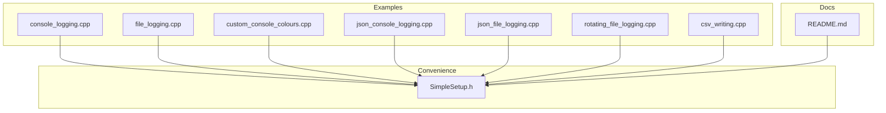
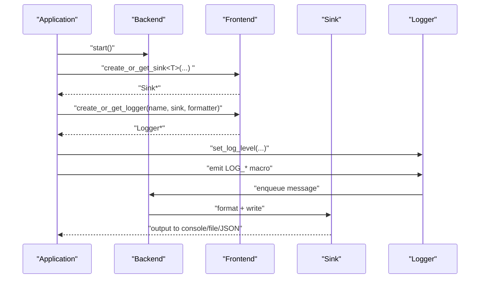
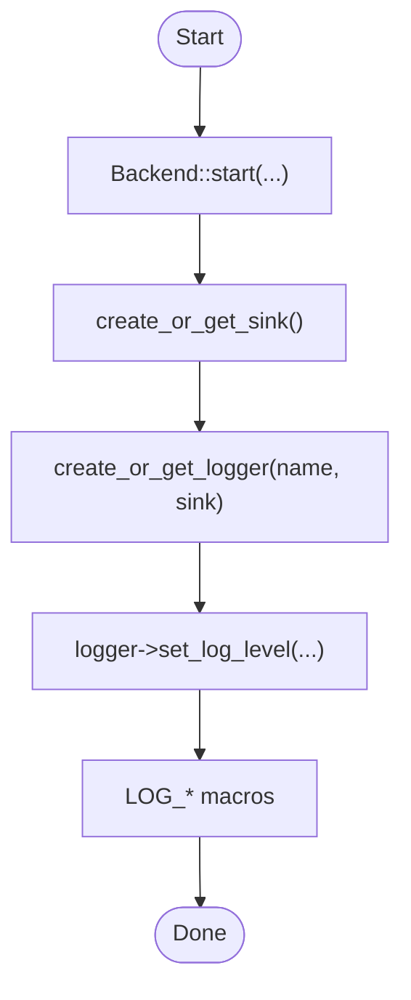
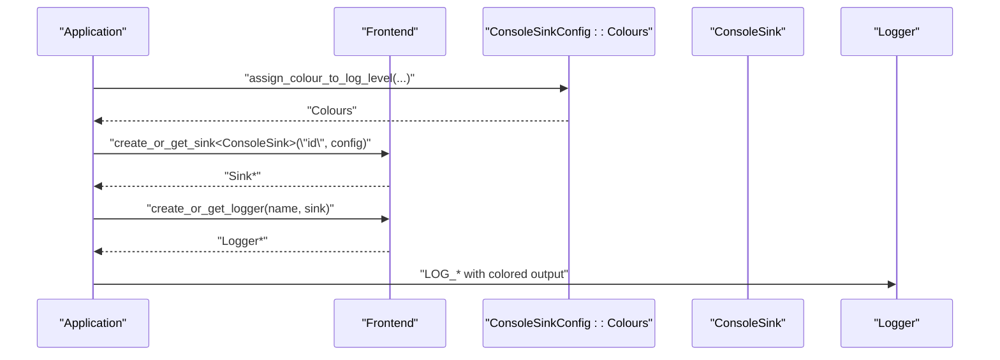
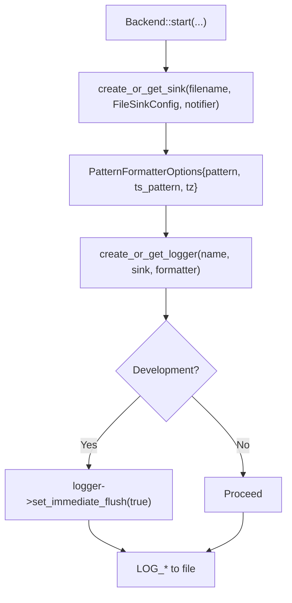
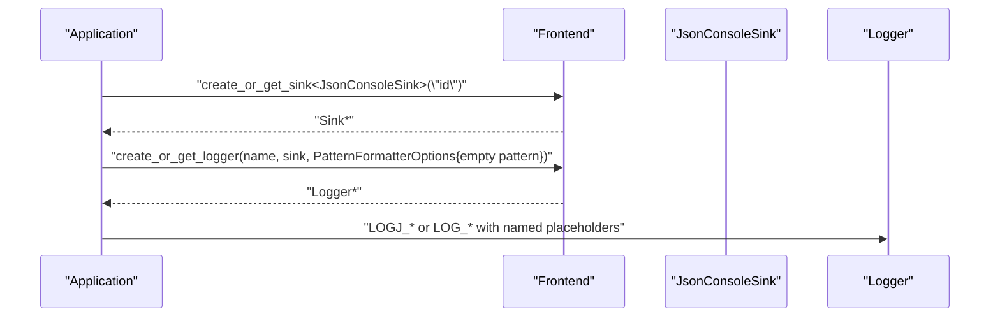
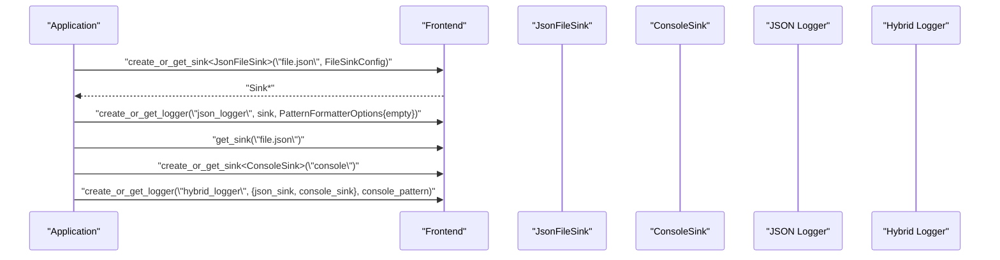
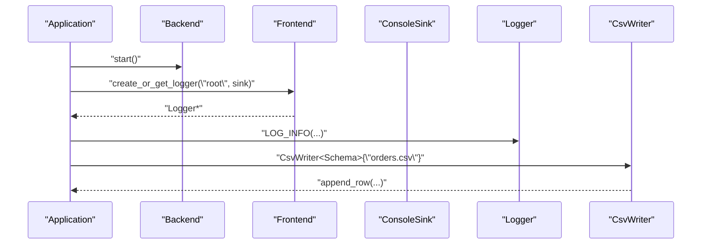
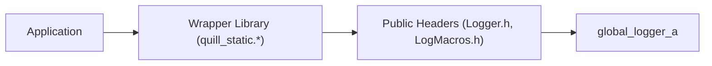
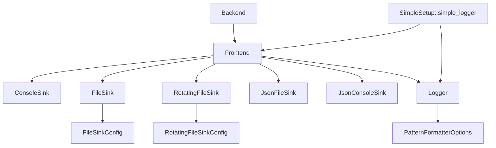

# Basic Examples

<cite>
**Referenced Files in This Document**
- [console_logging.cpp](file://examples/console_logging.cpp)
- [file_logging.cpp](file://examples/file_logging.cpp)
- [custom_console_colours.cpp](file://examples/custom_console_colours.cpp)
- [json_console_logging.cpp](file://examples/json_console_logging.cpp)
- [json_file_logging.cpp](file://examples/json_file_logging.cpp)
- [rotating_file_logging.cpp](file://examples/rotating_file_logging.cpp)
- [csv_writing.cpp](file://examples/csv_writing.cpp)
- [SimpleSetup.h](file://include/quill/SimpleSetup.h)
- [recommended_usage.cpp](file://examples/recommended_usage/recommended_usage.cpp)
- [README.md](file://README.md)
</cite>

## Table of Contents
1. [Introduction](#introduction)
2. [Project Structure](#project-structure)
3. [Core Components](#core-components)
4. [Architecture Overview](#architecture-overview)
5. [Detailed Component Analysis](#detailed-component-analysis)
6. [Dependency Analysis](#dependency-analysis)
7. [Performance Considerations](#performance-considerations)
8. [Troubleshooting Guide](#troubleshooting-guide)
9. [Conclusion](#conclusion)
10. [Appendices](#appendices)

## Introduction
This document provides practical, beginner-friendly examples for getting started with Quill logging. It covers console logging with color customization, file logging with formatting and rotation, JSON logging, CSV writing, and recommended usage patterns. Each example is mapped to concrete source files so you can quickly locate and adapt the code for your application.

## Project Structure
The repository organizes examples under the examples directory and includes convenience helpers in include/quill/SimpleSetup.h. The README offers quick-start guidance and links to detailed usage.



**Diagram sources**
- [console_logging.cpp](file://examples/console_logging.cpp)
- [file_logging.cpp](file://examples/file_logging.cpp)
- [custom_console_colours.cpp](file://examples/custom_console_colours.cpp)
- [json_console_logging.cpp](file://examples/json_console_logging.cpp)
- [json_file_logging.cpp](file://examples/json_file_logging.cpp)
- [rotating_file_logging.cpp](file://examples/rotating_file_logging.cpp)
- [csv_writing.cpp](file://examples/csv_writing.cpp)
- [SimpleSetup.h](file://include/quill/SimpleSetup.h)
- [README.md](file://README.md)

**Section sources**
- [README.md](file://README.md)

## Core Components
- Backend and Frontend: The asynchronous logging pipeline starts the backend and creates loggers via the frontend.
- Sinks: Output destinations such as ConsoleSink, FileSink, JsonFileSink, JsonConsoleSink, and RotatingFileSink.
- PatternFormatterOptions: Controls timestamp patterns, timezone, and source location stripping.
- FileSinkConfig and RotatingFileSinkConfig: Configure file open modes, rotation policies, and filename append options.
- SimpleSetup: Provides a minimal API to create a logger to stdout, stderr, or a file with sensible defaults.

Key usage patterns:
- Start the backend once per process.
- Create sinks and loggers via Frontend.
- Set log levels and optional immediate flush for development.
- Apply formatters and timezones for readable output.

**Section sources**
- [console_logging.cpp](file://examples/console_logging.cpp)
- [file_logging.cpp](file://examples/file_logging.cpp)
- [custom_console_colours.cpp](file://examples/custom_console_colours.cpp)
- [json_console_logging.cpp](file://examples/json_console_logging.cpp)
- [json_file_logging.cpp](file://examples/json_file_logging.cpp)
- [rotating_file_logging.cpp](file://examples/rotating_file_logging.cpp)
- [csv_writing.cpp](file://examples/csv_writing.cpp)
- [SimpleSetup.h](file://include/quill/SimpleSetup.h)

## Architecture Overview
The examples demonstrate a typical Quill flow: initialize the backend, create a sink, attach it to a logger, and emit formatted log messages.



**Diagram sources**
- [console_logging.cpp](file://examples/console_logging.cpp)
- [file_logging.cpp](file://examples/file_logging.cpp)
- [json_console_logging.cpp](file://examples/json_console_logging.cpp)
- [json_file_logging.cpp](file://examples/json_file_logging.cpp)
- [csv_writing.cpp](file://examples/csv_writing.cpp)
- [SimpleSetup.h](file://include/quill/SimpleSetup.h)

## Detailed Component Analysis

### Console Logging (Basic)
- Demonstrates creating a ConsoleSink, a logger, setting log level, and emitting formatted messages with libfmt-style placeholders.
- Shows rate limiting macros and structured logging variants.



**Diagram sources**
- [console_logging.cpp](file://examples/console_logging.cpp)

**Section sources**
- [console_logging.cpp](file://examples/console_logging.cpp)

### Console Logging with Color Customization
- Shows how to override default console colors per log level for better readability.



**Diagram sources**
- [custom_console_colours.cpp](file://examples/custom_console_colours.cpp)

**Section sources**
- [custom_console_colours.cpp](file://examples/custom_console_colours.cpp)

### File Logging with Formatting and Immediate Flush
- Creates a FileSink with configurable open mode and filename append option.
- Applies PatternFormatterOptions for timestamp, timezone, and source location.
- Optionally enables immediate flush for synchronous-like behavior during development.



**Diagram sources**
- [file_logging.cpp](file://examples/file_logging.cpp)

**Section sources**
- [file_logging.cpp](file://examples/file_logging.cpp)

### JSON Console Logging
- Uses JsonConsoleSink and PatternFormatterOptions to customize console output while leveraging JSON macros for structured logs.



**Diagram sources**
- [json_console_logging.cpp](file://examples/json_console_logging.cpp)

**Section sources**
- [json_console_logging.cpp](file://examples/json_console_logging.cpp)

### JSON File Logging (Single and Hybrid)
- Demonstrates JsonFileSink for pure JSON logs and a hybrid logger that writes to both JSON and console sinks with distinct formats.



**Diagram sources**
- [json_file_logging.cpp](file://examples/json_file_logging.cpp)

**Section sources**
- [json_file_logging.cpp](file://examples/json_file_logging.cpp)

### Rotating File Logging
- Shows how to configure daily rotation and maximum file size limits for long-running applications.

```mermaid
flowchart TD
RS["create_or_get_sink<RotatingFileSink>(\"rotating.log\", cfg)"] --> PF["PatternFormatterOptions{pattern, ts_pattern, tz}"]
PF --> RL["create_or_get_logger(name, sink, formatter)"]
RL --> LOOP["LOG_* in loop"]
```

**Diagram sources**
- [rotating_file_logging.cpp](file://examples/rotating_file_logging.cpp)

**Section sources**
- [rotating_file_logging.cpp](file://examples/rotating_file_logging.cpp)

### CSV Writing
- Demonstrates defining a CSV schema and appending rows via CsvWriter, while logging progress with a regular logger.



**Diagram sources**
- [csv_writing.cpp](file://examples/csv_writing.cpp)

**Section sources**
- [csv_writing.cpp](file://examples/csv_writing.cpp)

### Recommended Usage Patterns
- Encapsulate Quill in a static/shared library and expose a small public interface.
- Keep frontend includes minimal in application code; rely on wrappers for logger retrieval or creation.
- Use recommended_usage example as a blueprint for structuring your project.



**Diagram sources**
- [recommended_usage.cpp](file://examples/recommended_usage/recommended_usage.cpp)

**Section sources**
- [recommended_usage.cpp](file://examples/recommended_usage/recommended_usage.cpp)

## Dependency Analysis
- All examples depend on Backend::start to initialize the logging pipeline.
- Frontend is used to create or retrieve sinks and loggers.
- Sinks are templated (ConsoleSink, FileSink, JsonFileSink, JsonConsoleSink, RotatingFileSink).
- PatternFormatterOptions and FileSinkConfig/RotatingFileSinkConfig control output formatting and file behavior.
- SimpleSetup simplifies single-destination logging to stdout, stderr, or a file.



**Diagram sources**
- [console_logging.cpp](file://examples/console_logging.cpp)
- [file_logging.cpp](file://examples/file_logging.cpp)
- [custom_console_colours.cpp](file://examples/custom_console_colours.cpp)
- [json_console_logging.cpp](file://examples/json_console_logging.cpp)
- [json_file_logging.cpp](file://examples/json_file_logging.cpp)
- [rotating_file_logging.cpp](file://examples/rotating_file_logging.cpp)
- [csv_writing.cpp](file://examples/csv_writing.cpp)
- [SimpleSetup.h](file://include/quill/SimpleSetup.h)

**Section sources**
- [SimpleSetup.h](file://include/quill/SimpleSetup.h)

## Performance Considerations
- Prefer asynchronous logging for production to avoid blocking the main thread.
- Use immediate flush only during development or diagnostics to reduce overhead.
- Choose appropriate queue types and capacities via FrontendOptions for high-throughput scenarios.
- For JSON logging, keep the console pattern minimal or empty to avoid redundant formatting.

[No sources needed since this section provides general guidance]

## Troubleshooting Guide
Common setup issues and verification steps:
- Backend not started: Ensure Backend::start is called once per process before creating loggers.
- Missing sink: Verify Frontend::create_or_get_sink succeeds and is attached to the logger.
- No output to file: Confirm FileSinkConfig open mode and filename append option match expectations.
- Colors not applied: Ensure ConsoleSinkConfig Colours are set and the terminal supports ANSI colors.
- JSON formatting confusion: When using JSON sinks, keep the console pattern empty or minimal; use LOGJ_* macros for structured output.
- Rate-limited logs not appearing: Check the duration or every-N parameters in LOG_*_LIMIT macros.
- Hybrid logger ordering: Remember that JSON sink uses its own internal format; console-specific formatting applies only to console output.

Verification steps:
- Run a minimal example (e.g., console_logging.cpp) to confirm the backend and sink are working.
- Temporarily enable immediate flush to verify synchronous behavior during development.
- Compare timestamps and thread IDs in output to confirm timestamp formatting and timezone settings.

**Section sources**
- [console_logging.cpp](file://examples/console_logging.cpp)
- [file_logging.cpp](file://examples/file_logging.cpp)
- [custom_console_colours.cpp](file://examples/custom_console_colours.cpp)
- [json_console_logging.cpp](file://examples/json_console_logging.cpp)
- [json_file_logging.cpp](file://examples/json_file_logging.cpp)
- [rotating_file_logging.cpp](file://examples/rotating_file_logging.cpp)
- [csv_writing.cpp](file://examples/csv_writing.cpp)

## Conclusion
These examples illustrate the most common Quill usage patterns for beginners: console logging with colors, file logging with formatting and rotation, JSON logging, CSV writing, and recommended project structure. Start with SimpleSetup for minimal configuration, then progressively adopt more advanced sinks and formatters as your needs grow.

[No sources needed since this section summarizes without analyzing specific files]

## Appendices

### Step-by-Step Tutorials

- Single logger to console
  - Steps:
    1. Start the backend.
    2. Create a ConsoleSink via Frontend.
    3. Create a logger and optionally set log level.
    4. Emit LOG_* macros.
  - Reference: [console_logging.cpp](file://examples/console_logging.cpp)

- Single logger to file with formatting
  - Steps:
    1. Start the backend.
    2. Create a FileSink with FileSinkConfig.
    3. Build PatternFormatterOptions for timestamp and timezone.
    4. Create a logger with the sink and formatter.
    5. Optionally enable immediate flush for development.
  - Reference: [file_logging.cpp](file://examples/file_logging.cpp)

- Console logging with custom colors
  - Steps:
    1. Start the backend.
    2. Create ConsoleSinkConfig and set Colours for specific log levels.
    3. Create the ConsoleSink and logger.
    4. Emit LOG_* macros to observe color changes.
  - Reference: [custom_console_colours.cpp](file://examples/custom_console_colours.cpp)

- JSON logging to console
  - Steps:
    1. Start the backend.
    2. Create JsonConsoleSink.
    3. Create a logger with PatternFormatterOptions (empty pattern recommended).
    4. Use LOGJ_* macros or LOG_* with named placeholders.
  - Reference: [json_console_logging.cpp](file://examples/json_console_logging.cpp)

- JSON logging to file and hybrid console output
  - Steps:
    1. Start the backend.
    2. Create JsonFileSink with FileSinkConfig.
    3. Create a logger for JSON output with empty pattern.
    4. Retrieve the same file sink and create a ConsoleSink.
    5. Create a hybrid logger with both sinks and a console-specific pattern.
  - Reference: [json_file_logging.cpp](file://examples/json_file_logging.cpp)

- Rotating file logging
  - Steps:
    1. Start the backend.
    2. Create RotatingFileSink with RotatingFileSinkConfig (daily rotation and max size).
    3. Create a logger with PatternFormatterOptions.
    4. Emit LOG_* messages; observe rotation behavior.
  - Reference: [rotating_file_logging.cpp](file://examples/rotating_file_logging.cpp)

- CSV writing alongside logging
  - Steps:
    1. Start the backend.
    2. Create a logger for console output.
    3. Instantiate CsvWriter with a schema and append rows.
  - Reference: [csv_writing.cpp](file://examples/csv_writing.cpp)

- Minimal configuration with SimpleSetup
  - Steps:
    1. Call simple_logger() to create or retrieve a logger to stdout, stderr, or a file.
    2. Use LOG_* macros directly.
  - Reference: [SimpleSetup.h](file://include/quill/SimpleSetup.h), [README.md](file://README.md)

**Section sources**
- [console_logging.cpp](file://examples/console_logging.cpp)
- [file_logging.cpp](file://examples/file_logging.cpp)
- [custom_console_colours.cpp](file://examples/custom_console_colours.cpp)
- [json_console_logging.cpp](file://examples/json_console_logging.cpp)
- [json_file_logging.cpp](file://examples/json_file_logging.cpp)
- [rotating_file_logging.cpp](file://examples/rotating_file_logging.cpp)
- [csv_writing.cpp](file://examples/csv_writing.cpp)
- [SimpleSetup.h](file://include/quill/SimpleSetup.h)
- [README.md](file://README.md)