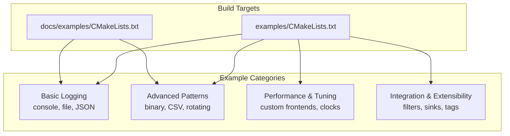
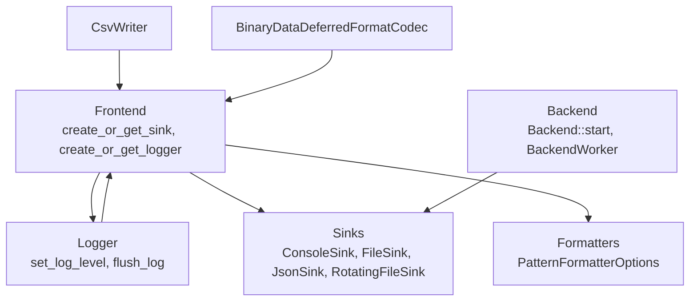
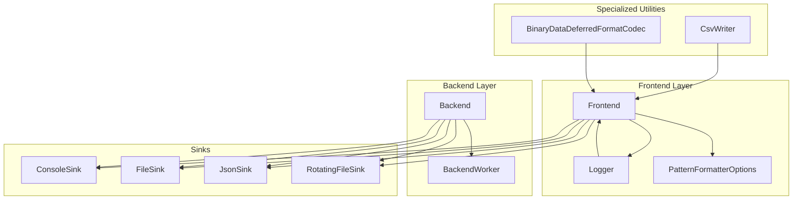

# Examples & Tutorials

<cite>
**Referenced Files in This Document**
- [examples/CMakeLists.txt](file://examples/CMakeLists.txt)
- [docs/examples/CMakeLists.txt](file://docs/examples/CMakeLists.txt)
- [examples/console_logging.cpp](file://examples/console_logging.cpp)
- [examples/file_logging.cpp](file://examples/file_logging.cpp)
- [examples/json_file_logging.cpp](file://examples/json_file_logging.cpp)
- [examples/rotating_file_logging.cpp](file://examples/rotating_file_logging.cpp)
- [examples/binary_protocol_logging.cpp](file://examples/binary_protocol_logging.cpp)
- [examples/csv_writing.cpp](file://examples/csv_writing.cpp)
- [examples/custom_frontend_options.cpp](file://examples/custom_frontend_options.cpp)
- [examples/user_defined_sink.cpp](file://examples/user_defined_sink.cpp)
- [examples/user_defined_types_logging_custom_codec.cpp](file://examples/user_defined_types_logging_custom_codec.cpp)
- [examples/backtrace_logging.cpp](file://examples/backtrace_logging.cpp)
- [examples/tags_logging.cpp](file://examples/tags_logging.cpp)
- [examples/user_defined_filter.cpp](file://examples/user_defined_filter.cpp)
- [examples/filter_logging.cpp](file://examples/filter_logging.cpp)
- [examples/system_clock_logging.cpp](file://examples/system_clock_logging.cpp)
- [examples/user_clock_source.cpp](file://examples/user_clock_source.cpp)
- [examples/backend_tsc_clock.cpp](file://examples/backend_tsc_clock.cpp)
- [examples/backend_thread_notify.cpp](file://examples/backend_thread_notify.cpp)
- [examples/signal_handler.cpp](file://examples/signal_handler.cpp)
- [examples/bounded_dropping_queue_frontend.cpp](file://examples/bounded_dropping_queue_frontend.cpp)
- [examples/logger_removal_with_file_event_notifier.cpp](file://examples/logger_removal_with_file_event_notifier.cpp)
- [examples/sink_formatter_override.cpp](file://examples/sink_formatter_override.cpp)
- [examples/stopwatch.cpp](file://examples/stopwatch.cpp)
- [examples/user_defined_types_logging_simple.cpp](file://examples/user_defined_types_logging_simple.cpp)
- [examples/user_defined_types_logging_deferred_format.cpp](file://examples/user_defined_types_logging_deferred_format.cpp)
- [examples/user_defined_types_logging_direct_format.cpp](file://examples/user_defined_types_logging_direct_format.cpp)
- [examples/user_defined_types_multi_format.cpp](file://examples/user_defined_types_multi_format.cpp)
- [examples/custom_console_colours.cpp](file://examples/custom_console_colours.cpp)
- [examples/json_console_logging.cpp](file://examples/json_console_logging.cpp)
- [examples/json_console_logging_custom_json.cpp](file://examples/json_console_logging_custom_json.cpp)
- [examples/rotating_json_file_logging.cpp](file://examples/rotating_json_file_logging.cpp)
- [examples/rotating_json_file_logging_custom_json.cpp](file://examples/rotating_json_file_logging_custom_json.cpp)
- [examples/console_logging_macro_free.cpp](file://examples/console_logging_macro_free.cpp)
- [examples/user_defined_types_logging_custom_codec.cpp](file://examples/user_defined_types_logging_custom_codec.cpp)
- [examples/sbe_logging.cpp](file://examples/sbe_logging.cpp)
- [examples/recommended_usage.cpp](file://examples/recommended_usage.cpp)
- [examples/std_types_logging.cpp](file://examples/std_types_logging.cpp)
- [examples/use_overwrite_macros.cpp](file://examples/use_overwrite_macros.cpp)
- [examples/shared/example_shared.cpp](file://examples/shared_library/example_shared.cpp)
- [examples/shared_library/quill_shared_lib/quill_shared.cpp](file://examples/shared_library/quill_shared_lib/quill_shared.cpp)
- [examples/shared_library/quill_shared_lib/quill_shared.h](file://examples/shared_library/quill_shared_lib/quill_shared.h)
- [examples/recommended_usage/quill_static_lib/quill_static.cpp](file://examples/recommended_usage/quill_static_lib/quill_static.cpp)
- [examples/recommended_usage/quill_static_lib/quill_static.h](file://examples/recommended_usage/quill_static_lib/quill_static.h)
- [examples/recommended_usage/quill_static_lib/overwrite_macros.h](file://examples/recommended_usage/quill_static_lib/overwrite_macros.h)
</cite>

## Table of Contents
1. [Introduction](#introduction)
2. [Project Structure](#project-structure)
3. [Core Components](#core-components)
4. [Architecture Overview](#architecture-overview)
5. [Detailed Component Analysis](#detailed-component-analysis)
6. [Dependency Analysis](#dependency-analysis)
7. [Performance Considerations](#performance-considerations)
8. [Troubleshooting Guide](#troubleshooting-guide)
9. [Conclusion](#conclusion)
10. [Appendices](#appendices)

## Introduction
This document presents a comprehensive set of examples and tutorials for practical Quill usage. It progresses from basic logging to advanced topics such as custom formatters, multiple sinks, performance tuning, and specialized integrations. Each tutorial includes step-by-step guidance, design rationale, performance considerations, and best practices drawn from the repository’s example suite.

## Project Structure
The repository organizes examples under two primary locations:
- examples/: runnable example programs demonstrating various logging patterns and integrations
- docs/examples/: documentation-focused examples used in the official guide

Key build integration:
- Both directories define example targets and link against the quill library, enabling easy compilation and execution.

**Diagram sources**
- [examples/CMakeLists.txt:1-58](file://examples/CMakeLists.txt#L1-L58)
- [docs/examples/CMakeLists.txt:1-33](file://docs/examples/CMakeLists.txt#L1-L33)

**Section sources**
- [examples/CMakeLists.txt:1-58](file://examples/CMakeLists.txt#L1-L58)
- [docs/examples/CMakeLists.txt:1-33](file://docs/examples/CMakeLists.txt#L1-L33)

## Core Components
This section highlights the foundational building blocks used across examples:
- Backend and Frontend: asynchronous logging pipeline initialization and configuration
- Sinks: output destinations (ConsoleSink, FileSink, JsonSink, RotatingFileSink, etc.)
- Formatters: pattern-based formatting and timezone handling
- Loggers: named loggers bound to sinks with configurable log levels
- Specialized utilities: CsvWriter, BinaryDataDeferredFormatCodec, Stopwatch, and more

Design principles illustrated:
- Asynchronous logging minimizes caller-thread overhead
- Deferred formatting reduces formatting cost on the critical path
- Multiple sinks enable hybrid outputs (e.g., console + JSON)
- Rotating sinks manage long-running service logs
- Custom codecs and sinks extend Quill for domain-specific needs

**Section sources**
- [examples/console_logging.cpp:20-72](file://examples/console_logging.cpp#L20-L72)
- [examples/file_logging.cpp:29-73](file://examples/file_logging.cpp#L29-L73)
- [examples/json_file_logging.cpp:19-74](file://examples/json_file_logging.cpp#L19-L74)
- [examples/rotating_file_logging.cpp:14-45](file://examples/rotating_file_logging.cpp#L14-L45)
- [examples/binary_protocol_logging.cpp:178-242](file://examples/binary_protocol_logging.cpp#L178-L242)
- [examples/csv_writing.cpp:18-33](file://examples/csv_writing.cpp#L18-L33)

## Architecture Overview
The Quill architecture separates concerns between frontend (caller-side) and backend (background worker):
- Frontend handles sink creation, logger registration, and formatting requests
- Backend performs I/O and synchronization, ensuring throughput and durability
- Sinks encapsulate output behavior; formatters control textual representation
- Specialized components (e.g., CsvWriter, BinaryDataDeferredFormatCodec) integrate seamlessly

**Diagram sources**
- [examples/console_logging.cpp:20-72](file://examples/console_logging.cpp#L20-L72)
- [examples/file_logging.cpp:29-73](file://examples/file_logging.cpp#L29-L73)
- [examples/json_file_logging.cpp:19-74](file://examples/json_file_logging.cpp#L19-L74)
- [examples/rotating_file_logging.cpp:14-45](file://examples/rotating_file_logging.cpp#L14-L45)
- [examples/binary_protocol_logging.cpp:178-242](file://examples/binary_protocol_logging.cpp#L178-L242)
- [examples/csv_writing.cpp:18-33](file://examples/csv_writing.cpp#L18-L33)

## Detailed Component Analysis

### Basic Examples

#### Console Logging Tutorial
Learn to log to the console with formatted output, rate limiting, and structured logging.

Steps:
1. Start the backend with default options
2. Create a ConsoleSink and a Logger
3. Adjust log level to TraceL3 to capture fine-grained events
4. Emit INFO/DEBUG logs with numeric and floating-point values
5. Use structured logging with named arguments
6. Apply rate limiting (per interval and per N occurrences)

Design notes:
- Immediate flush is optional for development to simulate synchronous behavior
- PatternFormatterOptions controls timestamp precision and timezone

Performance considerations:
- Avoid excessive formatting on the critical path; leverage deferred formatting for complex types

**Section sources**
- [examples/console_logging.cpp:20-72](file://examples/console_logging.cpp#L20-L72)

#### File Output Tutorial
Write logs to a single file using multiple loggers and customize the output format.

Steps:
1. Start the backend
2. Create a FileSink with open mode and filename append option
3. Configure PatternFormatterOptions for human-readable timestamps and source location
4. Set logger log level and optional immediate flush for development
5. Log from multiple loggers sharing the same sink

Design notes:
- Filename append options help distinguish log sessions
- Immediate flush improves visibility during debugging but reduces throughput

**Section sources**
- [examples/file_logging.cpp:29-73](file://examples/file_logging.cpp#L29-L73)

#### JSON Logging Tutorial
Produce machine-readable JSON logs and optionally combine with console output.

Steps:
1. Start the backend
2. Create a JsonFileSink with custom FileSinkConfig
3. Create a dedicated JSON logger with an empty format pattern
4. Optionally create a hybrid logger that writes to both JSON and Console sinks
5. Use named placeholders in log messages for structured metadata

Design notes:
- Empty format pattern for JSON sink avoids redundant formatting
- Hybrid logger demonstrates multiple sink configuration

**Section sources**
- [examples/json_file_logging.cpp:19-74](file://examples/json_file_logging.cpp#L19-L74)

#### Rotating File Logging Tutorial
Manage long-running services with time-based and size-based rotation.

Steps:
1. Start the backend
2. Create a RotatingFileSink with rotation schedule and max file size
3. Configure PatternFormatterOptions for concise, readable logs
4. Emit logs to trigger rotation behavior

Design notes:
- Rotation options include daily rotation and size thresholds
- Filename append options help track rotated files

**Section sources**
- [examples/rotating_file_logging.cpp:14-45](file://examples/rotating_file_logging.cpp#L14-L45)

### Advanced Examples

#### Binary Protocol Logging Tutorial
Efficiently log binary data with deferred formatting for high-throughput scenarios.

Steps:
1. Define a tag struct to identify the binary protocol type
2. Create a BinaryData wrapper type for the tag
3. Implement a formatter for the binary data type to render human-readable output
4. Register a codec to enable deferred formatting
5. Encode sample messages into a buffer and log them using LOG_INFO

Design notes:
- Deferred formatting moves expensive formatting to the backend thread
- Hex dumping aids debugging while preserving minimal overhead on the critical path

Performance considerations:
- Memory copy cost is the dominant factor; formatting is deferred
- Choose appropriate message sizes to balance readability and throughput

**Section sources**
- [examples/binary_protocol_logging.cpp:178-242](file://examples/binary_protocol_logging.cpp#L178-L242)

#### CSV Writing Tutorial
Define a CSV schema and append rows asynchronously using CsvWriter.

Steps:
1. Start the backend
2. Create a Logger for console output
3. Define a CSV schema struct with header and format strings
4. Instantiate CsvWriter with the schema and append rows programmatically

Design notes:
- CsvWriter integrates with the asynchronous backend for non-blocking writes
- Schema-driven formatting ensures consistent columnar output

**Section sources**
- [examples/csv_writing.cpp:18-33](file://examples/csv_writing.cpp#L18-L33)

#### Custom Frontend Options Tutorial
Tune queue behavior and capacity for specialized workloads.

Steps:
1. Define custom FrontendOptions with desired queue type, capacity, and retry intervals
2. Create aliases for FrontendImpl and LoggerImpl using the custom options
3. Start the backend with custom options
4. Use the custom Frontend to create sinks and loggers
5. Emit logs and observe queue behavior

Design notes:
- BoundedDropping queues can prevent memory pressure under bursty loads
- Unbounded queue capacity can be constrained for memory safety

**Section sources**
- [examples/custom_frontend_options.cpp:13-42](file://examples/custom_frontend_options.cpp#L13-L42)

#### Custom Sink Tutorial
Implement a custom sink for specialized output or batching.

Steps:
1. Derive from Sink and implement write_log, flush_sink, and run_periodic_tasks
2. Cache log statements and flush them on demand or periodically
3. Start the backend and create a logger with the custom sink
4. Trigger flush_log to emit cached entries

Design notes:
- write_log is invoked for each log statement; avoid heavy work here
- flush_sink and run_periodic_tasks are executed by the backend thread

**Section sources**
- [examples/user_defined_sink.cpp:18-90](file://examples/user_defined_sink.cpp#L18-L90)

#### User-Defined Types with Custom Codec Tutorial
Offload formatting of complex types to the backend for low-latency logging.

Steps:
1. Define a user type with members to serialize
2. Implement a formatter for the type
3. Implement a Codec specialization to compute encoded size, encode, decode, and store arguments
4. Start the backend, create a ConsoleSink and Logger, and log instances of the type

Design notes:
- Encoding order must match computed size and format
- Supports containers like std::vector and arrays via appropriate headers

**Section sources**
- [examples/user_defined_types_logging_custom_codec.cpp:30-130](file://examples/user_defined_types_logging_custom_codec.cpp#L30-L130)

### Integration and Specialized Patterns

#### Backtrace Logging Tutorial
Capture transient traces that flush upon specific conditions or manual triggers.

Steps:
1. Start the backend
2. Create a ConsoleSink and Logger
3. Initialize backtrace with a capacity and threshold level
4. Emit backtrace logs and observe flushing on error
5. Manually flush backtrace when needed

Design notes:
- Backtrace is buffered and released on error or explicit flush
- Useful for debugging intermittent issues

**Section sources**
- [examples/backtrace_logging.cpp:14-55](file://examples/backtrace_logging.cpp#L14-L55)

#### Tagged Logging Tutorial
Attach tags to log statements for filtering and contextual grouping.

Steps:
1. Start the backend
2. Create a ConsoleSink and a Logger with a pattern that includes %(tags)
3. Emit logs with one or more tags using tagged macros
4. Observe tag rendering in the formatted output

Design notes:
- Place %(tags) immediately before the next attribute to avoid extra spacing
- Tags enable targeted filtering and dashboards

**Section sources**
- [examples/tags_logging.cpp:17-43](file://examples/tags_logging.cpp#L17-L43)

#### Filters and Filtering Tutorial
Apply runtime filters to limit log volume or focus on specific scopes.

Steps:
1. Explore user-defined filters and built-in filtering mechanisms
2. Configure filters to restrict output by level, category, or custom criteria
3. Combine filters with multiple sinks for selective routing

Design notes:
- Filters reduce I/O and improve performance in noisy environments

**Section sources**
- [examples/user_defined_filter.cpp](file://examples/user_defined_filter.cpp)
- [examples/filter_logging.cpp](file://examples/filter_logging.cpp)

#### Timestamp and Clock Sources Tutorial
Control timestamp generation and precision for performance-sensitive applications.

Steps:
1. Use system clock logging for standard timestamps
2. Implement a user clock source for custom timing
3. Explore backend TSC clock for high-resolution measurements

Design notes:
- Choose appropriate clock sources based on accuracy and overhead requirements

**Section sources**
- [examples/system_clock_logging.cpp](file://examples/system_clock_logging.cpp)
- [examples/user_clock_source.cpp](file://examples/user_clock_source.cpp)
- [examples/backend_tsc_clock.cpp](file://examples/backend_tsc_clock.cpp)

#### Backend Notification and Signal Handling Tutorial
Coordinate backend lifecycle and handle signals gracefully.

Steps:
1. Use backend thread notification for coordination
2. Integrate signal handlers for graceful shutdown

Design notes:
- Proper teardown prevents data loss and resource leaks

**Section sources**
- [examples/backend_thread_notify.cpp](file://examples/backend_thread_notify.cpp)
- [examples/signal_handler.cpp](file://examples/signal_handler.cpp)

#### Queue Behavior and Frontend Tuning Tutorial
Adjust queue behavior for throughput and memory characteristics.

Steps:
1. Experiment with bounded dropping queues to drop messages under overload
2. Tune retry intervals and capacities for your workload

Design notes:
- Bounded dropping queues trade off lost messages for stability
- Unbounded queues require careful capacity management

**Section sources**
- [examples/bounded_dropping_queue_frontend.cpp](file://examples/bounded_dropping_queue_frontend.cpp)

#### Logger Removal and File Event Notifier Tutorial
Manage dynamic logger lifecycles and file events.

Steps:
1. Remove loggers safely to release resources
2. Use file event notifier callbacks for maintenance actions

Design notes:
- Ensure flushes before removal to avoid dropped entries

**Section sources**
- [examples/logger_removal_with_file_event_notifier.cpp](file://examples/logger_removal_with_file_event_notifier.cpp)

#### Formatter Override Tutorial
Override formatter behavior per sink or globally.

Steps:
1. Customize formatter options for specific sinks
2. Align patterns with downstream consumers (e.g., JSON vs. console)

Design notes:
- Keep JSON sinks minimal; apply rich formatting to console sinks

**Section sources**
- [examples/sink_formatter_override.cpp](file://examples/sink_formatter_override.cpp)

#### Stopwatch and Timing Tutorial
Measure and log durations for performance analysis.

Steps:
1. Use the Stopwatch utility to time operations
2. Log elapsed times alongside application events

Design notes:
- Combine with structured logging for analytics

**Section sources**
- [examples/stopwatch.cpp](file://examples/stopwatch.cpp)

### Recommended Usage Patterns

#### Recommended Usage Tutorial
Follow best practices for integrating Quill into applications.

Steps:
1. Review recommended usage patterns for typical scenarios
2. Use standard types logging and macro-free modes when appropriate
3. Overwrite macros for integration with existing codebases

Design notes:
- Prefer macro-free mode for strict separation of concerns
- Overwrite macros to minimize refactoring costs

**Section sources**
- [examples/recommended_usage.cpp](file://examples/recommended_usage.cpp)
- [examples/std_types_logging.cpp](file://examples/std_types_logging.cpp)
- [examples/use_overwrite_macros.cpp](file://examples/use_overwrite_macros.cpp)

#### Static and Shared Library Integration Tutorial
Integrate Quill as a static or shared library.

Steps:
1. Build and link against static or shared library variants
2. Use provided headers and symbols consistently

Design notes:
- Static linking simplifies distribution; shared linking enables reuse across binaries

**Section sources**
- [examples/shared_library/example_shared.cpp](file://examples/shared_library/example_shared.cpp)
- [examples/shared_library/quill_shared_lib/quill_shared.cpp](file://examples/shared_library/quill_shared_lib/quill_shared.cpp)
- [examples/shared_library/quill_shared_lib/quill_shared.h](file://examples/shared_library/quill_shared_lib/quill_shared.h)
- [examples/recommended_usage/quill_static_lib/quill_static.cpp](file://examples/recommended_usage/quill_static_lib/quill_static.cpp)
- [examples/recommended_usage/quill_static_lib/quill_static.h](file://examples/recommended_usage/quill_static_lib/quill_static.h)
- [examples/recommended_usage/quill_static_lib/overwrite_macros.h](file://examples/recommended_usage/quill_static_lib/overwrite_macros.h)

### Additional Practical Scenarios

#### Console Logging (Macro-Free Mode)
Demonstrates logging without macros for environments requiring strict control.

**Section sources**
- [examples/console_logging_macro_free.cpp](file://examples/console_logging_macro_free.cpp)

#### JSON Console Logging
Logs structured data to console with JSON formatting.

**Section sources**
- [examples/json_console_logging.cpp](file://examples/json_console_logging.cpp)
- [examples/json_console_logging_custom_json.cpp](file://examples/json_console_logging_custom_json.cpp)

#### Rotating JSON File Logging
Combines rotating file behavior with JSON formatting.

**Section sources**
- [examples/rotating_json_file_logging.cpp](file://examples/rotating_json_file_logging.cpp)
- [examples/rotating_json_file_logging_custom_json.cpp](file://examples/rotating_json_file_logging_custom_json.cpp)

#### Custom Console Colours
Enhance console readability with custom colors.

**Section sources**
- [examples/custom_console_colours.cpp](file://examples/custom_console_colours.cpp)

#### User-Defined Types Logging (Simple, Deferred, Direct, Multi-Format)
Explore different logging modes for user-defined types.

**Section sources**
- [examples/user_defined_types_logging_simple.cpp](file://examples/user_defined_types_logging_simple.cpp)
- [examples/user_defined_types_logging_deferred_format.cpp](file://examples/user_defined_types_logging_deferred_format.cpp)
- [examples/user_defined_types_logging_direct_format.cpp](file://examples/user_defined_types_logging_direct_format.cpp)
- [examples/user_defined_types_multi_format.cpp](file://examples/user_defined_types_multi_format.cpp)

#### SBE Binary Data Logging
Demonstrates binary protocol logging with standardized schema.

**Section sources**
- [examples/sbe_logging.cpp](file://examples/sbe_logging.cpp)

## Dependency Analysis
The examples illustrate a layered dependency model:
- Frontend depends on sinks and formatters
- Backend depends on sinks and manages serialization
- Specialized utilities (CsvWriter, BinaryDataDeferredFormatCodec) depend on FrontendOptions and sinks
- Integrations (signal handler, backend thread notify) coordinate lifecycle and shutdown

**Diagram sources**
- [examples/console_logging.cpp:20-72](file://examples/console_logging.cpp#L20-L72)
- [examples/file_logging.cpp:29-73](file://examples/file_logging.cpp#L29-L73)
- [examples/json_file_logging.cpp:19-74](file://examples/json_file_logging.cpp#L19-L74)
- [examples/rotating_file_logging.cpp:14-45](file://examples/rotating_file_logging.cpp#L14-L45)
- [examples/binary_protocol_logging.cpp:178-242](file://examples/binary_protocol_logging.cpp#L178-L242)
- [examples/csv_writing.cpp:18-33](file://examples/csv_writing.cpp#L18-L33)

**Section sources**
- [examples/console_logging.cpp:20-72](file://examples/console_logging.cpp#L20-L72)
- [examples/file_logging.cpp:29-73](file://examples/file_logging.cpp#L29-L73)
- [examples/json_file_logging.cpp:19-74](file://examples/json_file_logging.cpp#L19-L74)
- [examples/rotating_file_logging.cpp:14-45](file://examples/rotating_file_logging.cpp#L14-L45)
- [examples/binary_protocol_logging.cpp:178-242](file://examples/binary_protocol_logging.cpp#L178-L242)
- [examples/csv_writing.cpp:18-33](file://examples/csv_writing.cpp#L18-L33)

## Performance Considerations
- Deferred formatting: Offload expensive formatting to the backend thread to reduce caller-thread latency
- Queue selection: Use bounded dropping queues for burst protection; tune capacities and retry intervals
- Immediate flush: Reserved for development; avoid in production to preserve throughput
- Binary logging: Prefer binary buffers with deferred formatting for high-frequency telemetry
- Rotating sinks: Balance rotation frequency and file size to control I/O overhead
- Structured logging: Use named placeholders for downstream parsing and reduce client-side formatting

[No sources needed since this section provides general guidance]

## Troubleshooting Guide
Common issues and remedies:
- Lost logs under load: Switch to bounded dropping queues or increase backend capacity
- Excessive I/O: Enable rotation and adjust rotation thresholds
- Debugging delays: Temporarily enable immediate flush for development builds
- Formatting overhead: Use deferred formatting for complex types and binary data
- Shutdown cleanup: Ensure logger flush and safe removal before process exit

**Section sources**
- [examples/bounded_dropping_queue_frontend.cpp](file://examples/bounded_dropping_queue_frontend.cpp)
- [examples/rotating_file_logging.cpp:14-45](file://examples/rotating_file_logging.cpp#L14-L45)
- [examples/logger_removal_with_file_event_notifier.cpp](file://examples/logger_removal_with_file_event_notifier.cpp)

## Conclusion
The examples in this repository demonstrate practical Quill usage across a spectrum of scenarios—from simple console and file logging to advanced binary protocol logging, CSV writing, rotating logs, and performance-tuned configurations. By following the tutorials and applying the design principles and best practices outlined here, you can implement robust, scalable logging systems tailored to your application’s needs.

[No sources needed since this section summarizes without analyzing specific files]

## Appendices

### Quick Reference: Example Index
- Basic: console_logging.cpp, file_logging.cpp, json_file_logging.cpp, rotating_file_logging.cpp
- Advanced: binary_protocol_logging.cpp, csv_writing.cpp, custom_frontend_options.cpp, user_defined_sink.cpp, user_defined_types_logging_custom_codec.cpp
- Integration: backtrace_logging.cpp, tags_logging.cpp, filter_logging.cpp, user_defined_filter.cpp
- Clocks/Timestamps: system_clock_logging.cpp, user_clock_source.cpp, backend_tsc_clock.cpp
- Lifecycle: backend_thread_notify.cpp, signal_handler.cpp, logger_removal_with_file_event_notifier.cpp
- Tuning: bounded_dropping_queue_frontend.cpp, sink_formatter_override.cpp, stopwatch.cpp
- Recommended usage: recommended_usage.cpp, std_types_logging.cpp, use_overwrite_macros.cpp
- Library integration: shared/example_shared.cpp, quill_shared.cpp/h, quill_static.cpp/h, overwrite_macros.h
- Additional: console_logging_macro_free.cpp, json_console_logging*.cpp, rotating_json_file_logging*.cpp, custom_console_colours.cpp, user_defined_types_logging_simple.cpp, user_defined_types_logging_deferred_format.cpp, user_defined_types_logging_direct_format.cpp, user_defined_types_multi_format.cpp, sbe_logging.cpp

[No sources needed since this section lists references without analyzing specific files]