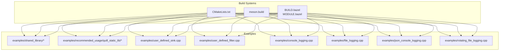
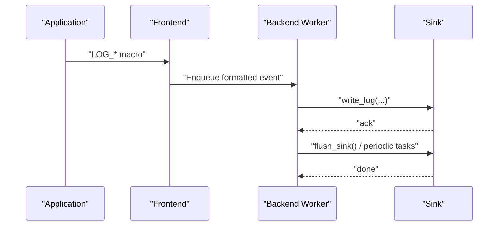
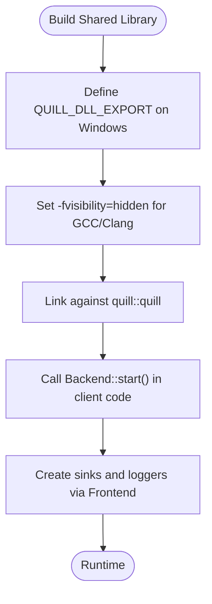
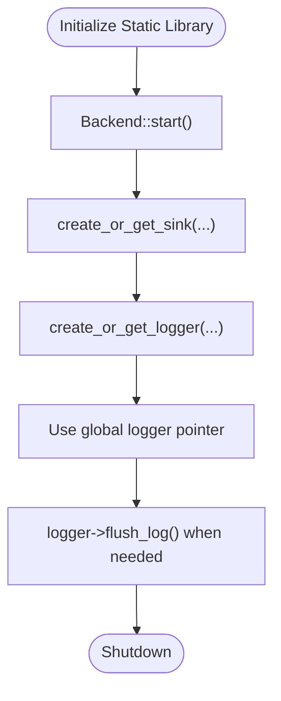
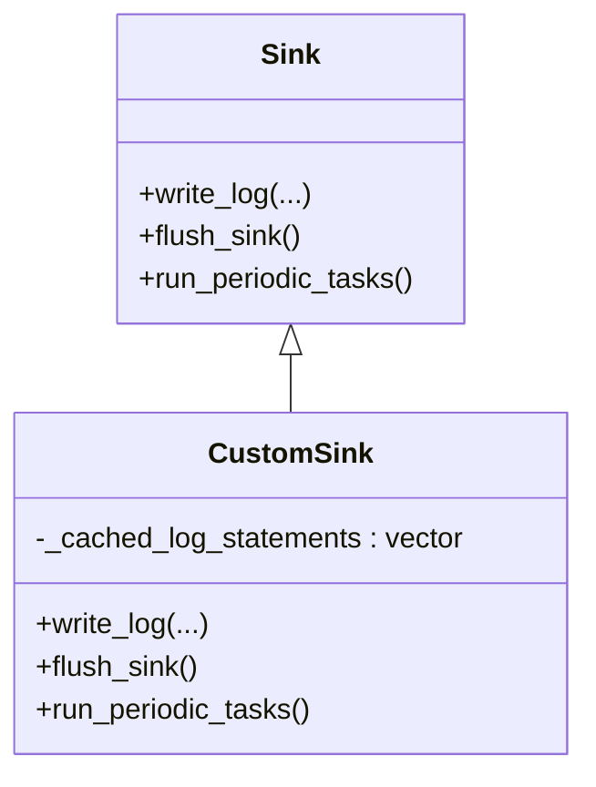
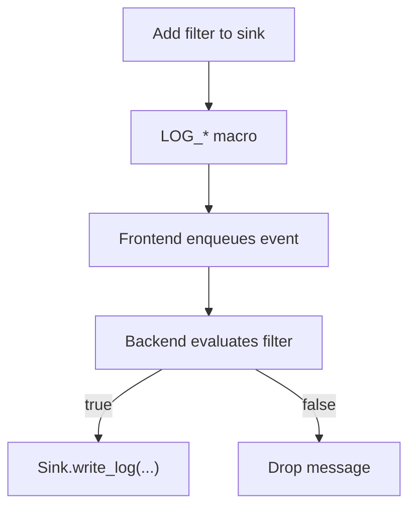
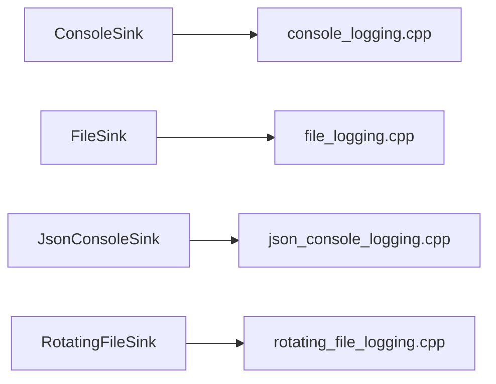
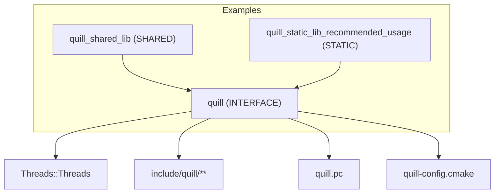

# Integration & Framework Examples

<cite>
**Referenced Files in This Document**
- [CMakeLists.txt](file://CMakeLists.txt)
- [meson.build](file://meson.build)
- [BUILD.bazel](file://BUILD.bazel)
- [MODULE.bazel](file://MODULE.bazel)
- [examples/shared_library/example_shared.cpp](file://examples/shared_library/example_shared.cpp)
- [examples/shared_library/quill_shared_lib/CMakeLists.txt](file://examples/shared_library/quill_shared_lib/CMakeLists.txt)
- [examples/recommended_usage/quill_static_lib/quill_static.cpp](file://examples/recommended_usage/quill_static_lib/quill_static.cpp)
- [examples/recommended_usage/quill_static_lib/CMakeLists.txt](file://examples/recommended_usage/quill_static_lib/CMakeLists.txt)
- [examples/user_defined_sink.cpp](file://examples/user_defined_sink.cpp)
- [examples/user_defined_filter.cpp](file://examples/user_defined_filter.cpp)
- [examples/console_logging.cpp](file://examples/console_logging.cpp)
- [examples/file_logging.cpp](file://examples/file_logging.cpp)
- [examples/json_console_logging.cpp](file://examples/json_console_logging.cpp)
- [examples/rotating_file_logging.cpp](file://examples/rotating_file_logging.cpp)
</cite>

## Table of Contents
1. [Introduction](#introduction)
2. [Project Structure](#project-structure)
3. [Core Components](#core-components)
4. [Architecture Overview](#architecture-overview)
5. [Detailed Component Analysis](#detailed-component-analysis)
6. [Dependency Analysis](#dependency-analysis)
7. [Performance Considerations](#performance-considerations)
8. [Troubleshooting Guide](#troubleshooting-guide)
9. [Conclusion](#conclusion)
10. [Appendices](#appendices)

## Introduction
This document provides practical integration examples for the Quill logging library across frameworks, libraries, and deployment scenarios. It covers:
- Shared library integration patterns for dynamic linking and plugin architectures
- Static library integration for embedded systems and performance-critical applications
- User-defined sink development for custom output destinations
- User-defined filter implementation for conditional logging
- Build system integration with CMake, Meson, and Bazel
- Deployment examples for containerized environments, microservices, and distributed systems

## Project Structure
Quill exposes a header-only interface library with optional backend worker startup. Integration examples demonstrate:
- Shared library packaging and visibility controls
- Static library usage with recommended initialization patterns
- User-defined sinks and filters
- Console, file, JSON, and rotating file sinks
- Build system targets for CMake, Meson, and Bazel

**Diagram sources**
- [CMakeLists.txt](file://CMakeLists.txt)
- [meson.build](file://meson.build)
- [BUILD.bazel](file://BUILD.bazel)
- [MODULE.bazel](file://MODULE.bazel)
- [examples/shared_library/example_shared.cpp](file://examples/shared_library/example_shared.cpp)
- [examples/shared_library/quill_shared_lib/CMakeLists.txt](file://examples/shared_library/quill_shared_lib/CMakeLists.txt)
- [examples/recommended_usage/quill_static_lib/quill_static.cpp](file://examples/recommended_usage/quill_static_lib/quill_static.cpp)
- [examples/recommended_usage/quill_static_lib/CMakeLists.txt](file://examples/recommended_usage/quill_static_lib/CMakeLists.txt)
- [examples/user_defined_sink.cpp](file://examples/user_defined_sink.cpp)
- [examples/user_defined_filter.cpp](file://examples/user_defined_filter.cpp)
- [examples/console_logging.cpp](file://examples/console_logging.cpp)
- [examples/file_logging.cpp](file://examples/file_logging.cpp)
- [examples/json_console_logging.cpp](file://examples/json_console_logging.cpp)
- [examples/rotating_file_logging.cpp](file://examples/rotating_file_logging.cpp)

**Section sources**
- [CMakeLists.txt](file://CMakeLists.txt)
- [meson.build](file://meson.build)
- [BUILD.bazel](file://BUILD.bazel)
- [MODULE.bazel](file://MODULE.bazel)

## Core Components
- Header-only interface library exposing Frontend, Backend, Logger, and Sink APIs
- Backend worker thread startup for asynchronous logging
- Built-in sinks: ConsoleSink, FileSink, JsonSink, RotatingFileSink, and others
- Filters for conditional logging
- PatternFormatterOptions for structured and unstructured output

Key integration patterns:
- Shared library: export symbols, define import/export macros, and link against the installed quill target
- Static library: embed quill into your application, initialize backend, and reuse loggers across translation units
- User-defined sink/filter: subclass Sink/Filter and integrate via Frontend

**Section sources**
- [CMakeLists.txt](file://CMakeLists.txt)
- [examples/shared_library/quill_shared_lib/CMakeLists.txt](file://examples/shared_library/quill_shared_lib/CMakeLists.txt)
- [examples/recommended_usage/quill_static_lib/quill_static.cpp](file://examples/recommended_usage/quill_static_lib/quill_static.cpp)
- [examples/user_defined_sink.cpp](file://examples/user_defined_sink.cpp)
- [examples/user_defined_filter.cpp](file://examples/user_defined_filter.cpp)

## Architecture Overview
Quill’s runtime architecture separates frontend (caller threads) from backend (worker thread). Frontend enqueues formatted log events; backend dequeues and writes to sinks. Sinks can be user-defined for custom outputs. Filters can be attached to sinks to drop messages conditionally.

**Diagram sources**
- [examples/console_logging.cpp](file://examples/console_logging.cpp)
- [examples/file_logging.cpp](file://examples/file_logging.cpp)
- [examples/json_console_logging.cpp](file://examples/json_console_logging.cpp)
- [examples/rotating_file_logging.cpp](file://examples/rotating_file_logging.cpp)
- [examples/user_defined_sink.cpp](file://examples/user_defined_sink.cpp)
- [examples/user_defined_filter.cpp](file://examples/user_defined_filter.cpp)

## Detailed Component Analysis

### Shared Library Integration (Dynamic Linking and Plugins)
Patterns:
- Build a shared library that wraps Quill usage
- Define import/export macros on Windows
- Control symbol visibility for ABI stability
- Link against the installed quill target

**Diagram sources**
- [examples/shared_library/quill_shared_lib/CMakeLists.txt](file://examples/shared_library/quill_shared_lib/CMakeLists.txt)
- [examples/shared_library/example_shared.cpp](file://examples/shared_library/example_shared.cpp)

**Section sources**
- [examples/shared_library/quill_shared_lib/CMakeLists.txt](file://examples/shared_library/quill_shared_lib/CMakeLists.txt)
- [examples/shared_library/example_shared.cpp](file://examples/shared_library/example_shared.cpp)

### Static Library Integration (Embedded and Performance-Critical)
Patterns:
- Embed Quill into your application as a static library
- Initialize the backend worker once
- Reuse global logger pointers to avoid repeated lookups
- Configure sinks and formatters at startup

**Diagram sources**
- [examples/recommended_usage/quill_static_lib/quill_static.cpp](file://examples/recommended_usage/quill_static_lib/quill_static.cpp)

**Section sources**
- [examples/recommended_usage/quill_static_lib/quill_static.cpp](file://examples/recommended_usage/quill_static_lib/quill_static.cpp)
- [examples/recommended_usage/quill_static_lib/CMakeLists.txt](file://examples/recommended_usage/quill_static_lib/CMakeLists.txt)

### User-Defined Sink Development
Patterns:
- Subclass Sink and implement write_log, flush_sink, and run_periodic_tasks
- Use cached storage for batching and periodic submission
- Attach to a logger via Frontend

**Diagram sources**
- [examples/user_defined_sink.cpp](file://examples/user_defined_sink.cpp)

**Section sources**
- [examples/user_defined_sink.cpp](file://examples/user_defined_sink.cpp)

### User-Defined Filter Implementation
Patterns:
- Subclass Filter and implement filter to decide whether to log
- Add filters to sinks at runtime safely
- Useful for deduplication, rate limiting, or conditional gating

**Diagram sources**
- [examples/user_defined_filter.cpp](file://examples/user_defined_filter.cpp)

**Section sources**
- [examples/user_defined_filter.cpp](file://examples/user_defined_filter.cpp)

### Framework Integration Examples
- Console logging: minimal setup with ConsoleSink and Frontend
- File logging: single-file and multi-logger usage
- JSON logging: structured logs with JsonConsoleSink and LOGJ_ macros
- Rotating file logging: time-based and size-based rotation

**Diagram sources**
- [examples/console_logging.cpp](file://examples/console_logging.cpp)
- [examples/file_logging.cpp](file://examples/file_logging.cpp)
- [examples/json_console_logging.cpp](file://examples/json_console_logging.cpp)
- [examples/rotating_file_logging.cpp](file://examples/rotating_file_logging.cpp)

**Section sources**
- [examples/console_logging.cpp](file://examples/console_logging.cpp)
- [examples/file_logging.cpp](file://examples/file_logging.cpp)
- [examples/json_console_logging.cpp](file://examples/json_console_logging.cpp)
- [examples/rotating_file_logging.cpp](file://examples/rotating_file_logging.cpp)

### Deployment Scenarios
- Containerized environments: package the application with Quill as a static or shared library; ensure backend thread lifecycle aligns with container shutdown
- Microservices: use shared library builds for plugin-like modularity; attach user-defined sinks for telemetry or remote logging
- Distributed systems: configure rotating sinks and JSON sinks for log aggregation pipelines; apply filters to reduce noise

[No sources needed since this section provides general guidance]

## Dependency Analysis
Quill depends on the C++ standard library and pthreads. Build targets expose quill::quill for consumption.

**Diagram sources**
- [CMakeLists.txt](file://CMakeLists.txt)
- [examples/shared_library/quill_shared_lib/CMakeLists.txt](file://examples/shared_library/quill_shared_lib/CMakeLists.txt)
- [examples/recommended_usage/quill_static_lib/CMakeLists.txt](file://examples/recommended_usage/quill_static_lib/CMakeLists.txt)

**Section sources**
- [CMakeLists.txt](file://CMakeLists.txt)
- [examples/shared_library/quill_shared_lib/CMakeLists.txt](file://examples/shared_library/quill_shared_lib/CMakeLists.txt)
- [examples/recommended_usage/quill_static_lib/CMakeLists.txt](file://examples/recommended_usage/quill_static_lib/CMakeLists.txt)

## Performance Considerations
- Prefer static library integration for embedded systems to minimize dynamic linking overhead
- Use batching in user-defined sinks to reduce I/O frequency
- Apply filters to drop low-value messages early in the pipeline
- Configure sinks with appropriate rotation and buffer sizes for production workloads

[No sources needed since this section provides general guidance]

## Troubleshooting Guide
- Windows DLL unload: ensure pending logs are flushed before unloading DLLs
- Backend lifecycle: always start the backend worker before logging; flush before shutdown
- Sink configuration: verify formatter options and timezone settings for accurate timestamps
- Filter behavior: confirm filter logic and thread-safety when adding filters at runtime

**Section sources**
- [examples/shared_library/example_shared.cpp](file://examples/shared_library/example_shared.cpp)
- [examples/user_defined_sink.cpp](file://examples/user_defined_sink.cpp)
- [examples/user_defined_filter.cpp](file://examples/user_defined_filter.cpp)

## Conclusion
Quill offers flexible integration across shared and static library modes, supports user-defined sinks and filters, and integrates cleanly with CMake, Meson, and Bazel. These patterns enable robust logging in diverse environments, from embedded systems to distributed microservices.

[No sources needed since this section summarizes without analyzing specific files]

## Appendices

### Build System Integration Quick Reference
- CMake: consume quill::quill; examples show shared/static library targets
- Meson: dependency on threads; installs headers and pkg-config metadata
- Bazel: cc_library with platform-specific linkopts; exposes headers via includes

**Section sources**
- [CMakeLists.txt](file://CMakeLists.txt)
- [meson.build](file://meson.build)
- [BUILD.bazel](file://BUILD.bazel)
- [MODULE.bazel](file://MODULE.bazel)