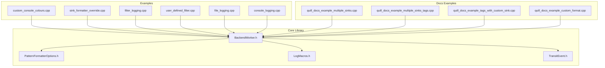
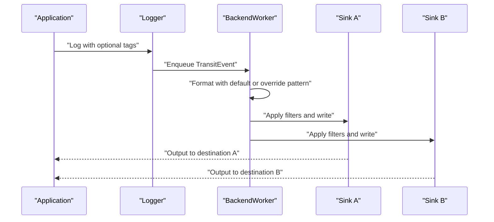
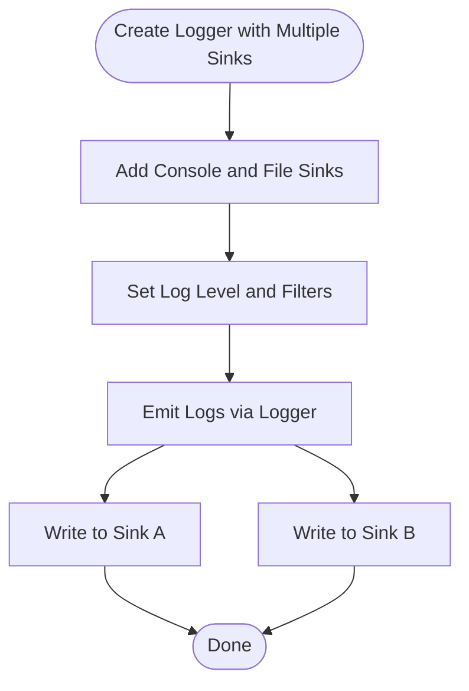
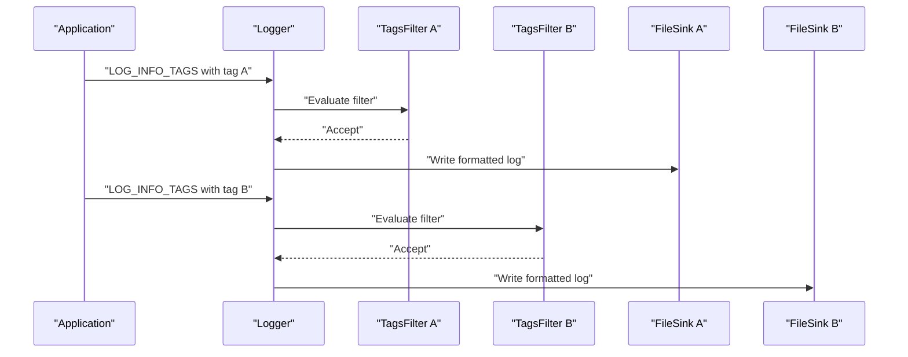
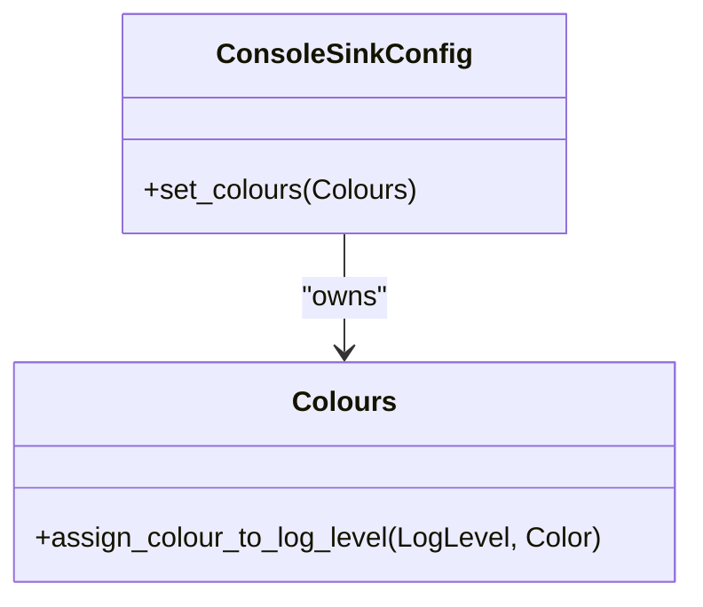
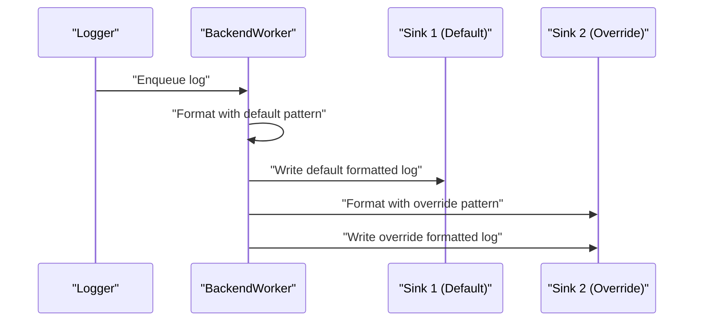
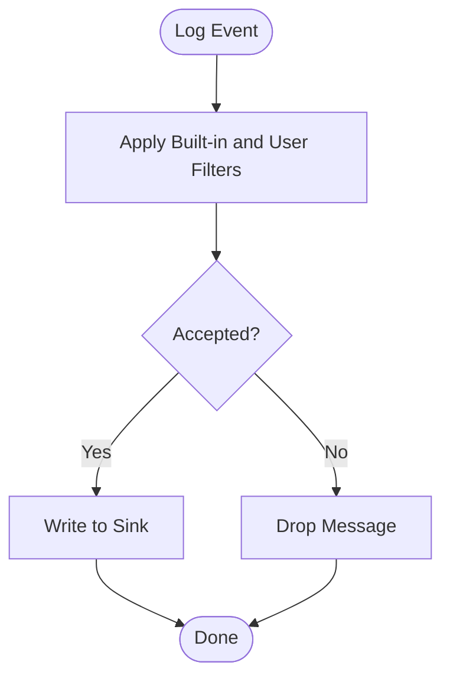
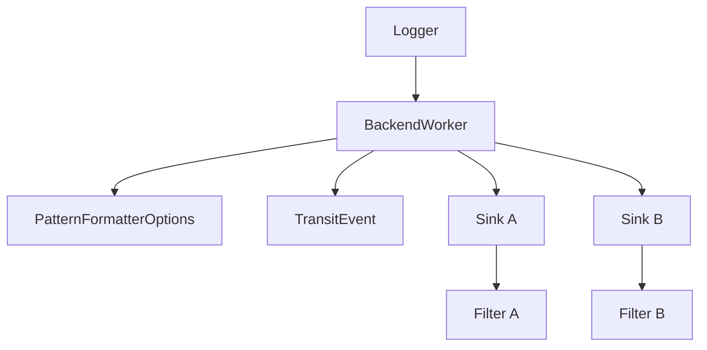

# Multi-Sink Configuration Examples

<cite>
**Referenced Files in This Document**
- [custom_console_colours.cpp](file://examples/custom_console_colours.cpp)
- [sink_formatter_override.cpp](file://examples/sink_formatter_override.cpp)
- [quill_docs_example_multiple_sinks.cpp](file://docs/examples/quill_docs_example_multiple_sinks.cpp)
- [quill_docs_example_multiple_sinks_tags.cpp](file://docs/examples/quill_docs_example_multiple_sinks_tags.cpp)
- [quill_docs_example_tags_with_custom_sink.cpp](file://docs/examples/quill_docs_example_tags_with_custom_sink.cpp)
- [quill_docs_example_custom_format.cpp](file://docs/examples/quill_docs_example_custom_format.cpp)
- [filter_logging.cpp](file://examples/filter_logging.cpp)
- [user_defined_filter.cpp](file://examples/user_defined_filter.cpp)
- [file_logging.cpp](file://examples/file_logging.cpp)
- [console_logging.cpp](file://examples/console_logging.cpp)
- [BackendWorker.h](file://include/quill/backend/BackendWorker.h)
- [PatternFormatterOptions.h](file://include/quill/core/PatternFormatterOptions.h)
- [LogMacros.h](file://include/quill/LogMacros.h)
- [TransitEvent.h](file://include/quill/backend/TransitEvent.h)
</cite>

## Table of Contents
1. [Introduction](#introduction)
2. [Project Structure](#project-structure)
3. [Core Components](#core-components)
4. [Architecture Overview](#architecture-overview)
5. [Detailed Component Analysis](#detailed-component-analysis)
6. [Dependency Analysis](#dependency-analysis)
7. [Performance Considerations](#performance-considerations)
8. [Troubleshooting Guide](#troubleshooting-guide)
9. [Conclusion](#conclusion)
10. [Appendices](#appendices)

## Introduction
This document presents comprehensive multi-sink configuration examples for advanced routing and formatting scenarios in the Quill logging library. It demonstrates:
- Multiple sink setup with console and file outputs simultaneously
- Tag-based logging with conditional routing to different sinks based on log tags
- Custom console coloring for enhanced visual distinction between log levels and sources
- Formatter override techniques for customizing output formats per sink
- Practical examples of log aggregation, selective logging, and conditional output routing
- Complete configurations showing sink priorities, filtering rules, and formatting customization
- Common multi-sink scenarios including development vs production logging, debug vs release output, and specialized logging for different stakeholders

## Project Structure
The repository organizes multi-sink and formatting examples under the examples and docs/examples directories. These examples illustrate:
- Multiple sinks per logger
- Tag-based routing
- Custom console colors
- Formatter overrides
- Filters and user-defined filters
- File and console logging patterns

**Diagram sources**
- [custom_console_colours.cpp:1-48](file://examples/custom_console_colours.cpp#L1-L48)
- [sink_formatter_override.cpp:1-42](file://examples/sink_formatter_override.cpp#L1-L42)
- [quill_docs_example_multiple_sinks.cpp:1-25](file://docs/examples/quill_docs_example_multiple_sinks.cpp#L1-L25)
- [quill_docs_example_multiple_sinks_tags.cpp:1-53](file://docs/examples/quill_docs_example_multiple_sinks_tags.cpp#L1-L53)
- [quill_docs_example_tags_with_custom_sink.cpp:1-69](file://docs/examples/quill_docs_example_tags_with_custom_sink.cpp#L1-L69)
- [quill_docs_example_custom_format.cpp:1-18](file://docs/examples/quill_docs_example_custom_format.cpp#L1-L18)
- [BackendWorker.h:1010-1062](file://include/quill/backend/BackendWorker.h#L1010-L1062)
- [PatternFormatterOptions.h:36-59](file://include/quill/core/PatternFormatterOptions.h#L36-L59)
- [LogMacros.h:568-603](file://include/quill/LogMacros.h#L568-L603)
- [TransitEvent.h:172-212](file://include/quill/backend/TransitEvent.h#L172-L212)

**Section sources**
- [custom_console_colours.cpp:1-48](file://examples/custom_console_colours.cpp#L1-L48)
- [sink_formatter_override.cpp:1-42](file://examples/sink_formatter_override.cpp#L1-L42)
- [quill_docs_example_multiple_sinks.cpp:1-25](file://docs/examples/quill_docs_example_multiple_sinks.cpp#L1-L25)
- [quill_docs_example_multiple_sinks_tags.cpp:1-53](file://docs/examples/quill_docs_example_multiple_sinks_tags.cpp#L1-L53)
- [quill_docs_example_tags_with_custom_sink.cpp:1-69](file://docs/examples/quill_docs_example_tags_with_custom_sink.cpp#L1-L69)
- [quill_docs_example_custom_format.cpp:1-18](file://docs/examples/quill_docs_example_custom_format.cpp#L1-L18)
- [filter_logging.cpp:1-42](file://examples/filter_logging.cpp#L1-L42)
- [user_defined_filter.cpp:1-73](file://examples/user_defined_filter.cpp#L1-L73)
- [file_logging.cpp:1-73](file://examples/file_logging.cpp#L1-L73)
- [console_logging.cpp:1-72](file://examples/console_logging.cpp#L1-L72)
- [BackendWorker.h:1010-1062](file://include/quill/backend/BackendWorker.h#L1010-L1062)
- [PatternFormatterOptions.h:36-59](file://include/quill/core/PatternFormatterOptions.h#L36-L59)
- [LogMacros.h:568-603](file://include/quill/LogMacros.h#L568-L603)
- [TransitEvent.h:172-212](file://include/quill/backend/TransitEvent.h#L172-L212)

## Core Components
- Multiple sinks per logger: A single logger can be configured with multiple sinks to output logs simultaneously to different destinations (e.g., console and file).
- Tag-based routing: Logs can be filtered and routed to specific sinks based on tags attached to log statements.
- Custom console coloring: Console sinks support custom color assignments per log level to improve visual distinction.
- Formatter override: Each sink can override the default logger formatter to customize output format independently.
- Filters: Built-in and user-defined filters enable selective logging and conditional output routing.
- Formatting options: PatternFormatterOptions define the structure and timezone of log output.

**Section sources**
- [quill_docs_example_multiple_sinks.cpp:14-24](file://docs/examples/quill_docs_example_multiple_sinks.cpp#L14-L24)
- [quill_docs_example_multiple_sinks_tags.cpp:39-53](file://docs/examples/quill_docs_example_multiple_sinks_tags.cpp#L39-L53)
- [custom_console_colours.cpp:20-34](file://examples/custom_console_colours.cpp#L20-L34)
- [sink_formatter_override.cpp:18-33](file://examples/sink_formatter_override.cpp#L18-L33)
- [filter_logging.cpp:22-28](file://examples/filter_logging.cpp#L22-L28)
- [user_defined_filter.cpp:19-47](file://examples/user_defined_filter.cpp#L19-L47)
- [PatternFormatterOptions.h:36-59](file://include/quill/core/PatternFormatterOptions.h#L36-L59)

## Architecture Overview
The multi-sink pipeline processes log events through the backend worker, applying per-sink formatting and filters before writing to destinations.

**Diagram sources**
- [BackendWorker.h:1010-1062](file://include/quill/backend/BackendWorker.h#L1010-L1062)
- [TransitEvent.h:172-212](file://include/quill/backend/TransitEvent.h#L172-L212)

**Section sources**
- [BackendWorker.h:1010-1062](file://include/quill/backend/BackendWorker.h#L1010-L1062)
- [TransitEvent.h:172-212](file://include/quill/backend/TransitEvent.h#L172-L212)

## Detailed Component Analysis

### Multiple Sinks Per Logger
Configure a single logger with multiple sinks to emit logs to different destinations simultaneously. This enables log aggregation and diverse output channels.

**Diagram sources**
- [quill_docs_example_multiple_sinks.cpp:14-24](file://docs/examples/quill_docs_example_multiple_sinks.cpp#L14-L24)
- [MultipleSinksSameLoggerTest.cpp:54-61](file://test/integration_tests/MultipleSinksSameLoggerTest.cpp#L54-L61)

**Section sources**
- [quill_docs_example_multiple_sinks.cpp:14-24](file://docs/examples/quill_docs_example_multiple_sinks.cpp#L14-L24)
- [MultipleSinksSameLoggerTest.cpp:54-61](file://test/integration_tests/MultipleSinksSameLoggerTest.cpp#L54-L61)

### Tag-Based Routing to Different Sinks
Route logs to specific sinks based on tags. Each sink can have a dedicated filter to accept only logs carrying the matching tag.

**Diagram sources**
- [quill_docs_example_multiple_sinks_tags.cpp:12-32](file://docs/examples/quill_docs_example_multiple_sinks_tags.cpp#L12-L32)
- [quill_docs_example_multiple_sinks_tags.cpp:39-53](file://docs/examples/quill_docs_example_multiple_sinks_tags.cpp#L39-L53)
- [LogMacros.h:568-603](file://include/quill/LogMacros.h#L568-L603)

**Section sources**
- [quill_docs_example_multiple_sinks_tags.cpp:12-32](file://docs/examples/quill_docs_example_multiple_sinks_tags.cpp#L12-L32)
- [quill_docs_example_multiple_sinks_tags.cpp:39-53](file://docs/examples/quill_docs_example_multiple_sinks_tags.cpp#L39-L53)
- [LogMacros.h:568-603](file://include/quill/LogMacros.h#L568-L603)

### Custom Console Coloring
Customize console colors per log level to visually distinguish severity and sources. This improves readability in terminal environments.

**Diagram sources**
- [custom_console_colours.cpp:20-34](file://examples/custom_console_colours.cpp#L20-L34)

**Section sources**
- [custom_console_colours.cpp:20-34](file://examples/custom_console_colours.cpp#L20-L34)

### Formatter Override Techniques
Override the default logger formatter per sink to produce distinct output formats for each destination while maintaining a single logger.

**Diagram sources**
- [sink_formatter_override.cpp:18-33](file://examples/sink_formatter_override.cpp#L18-L33)
- [BackendWorker.h:1010-1062](file://include/quill/backend/BackendWorker.h#L1010-L1062)

**Section sources**
- [sink_formatter_override.cpp:18-33](file://examples/sink_formatter_override.cpp#L18-L33)
- [BackendWorker.h:1010-1062](file://include/quill/backend/BackendWorker.h#L1010-L1062)

### Selective Logging and Conditional Output Routing
Enable selective logging using built-in and user-defined filters. Built-in filters can limit output by log level, while user-defined filters can implement custom conditions (e.g., deduplication).

**Diagram sources**
- [filter_logging.cpp:22-28](file://examples/filter_logging.cpp#L22-L28)
- [user_defined_filter.cpp:19-47](file://examples/user_defined_filter.cpp#L19-L47)

**Section sources**
- [filter_logging.cpp:22-28](file://examples/filter_logging.cpp#L22-L28)
- [user_defined_filter.cpp:19-47](file://examples/user_defined_filter.cpp#L19-L47)

### Practical Examples and Scenarios
- Development vs Production Logging: Use separate sinks with different formats and filters. For example, enable immediate flush for development and restrict verbosity in production.
- Debug vs Release Output: Adjust log levels and filters per sink to emit verbose traces in debug builds and concise warnings/errors in release.
- Specialized Logging for Stakeholders: Route operational logs to files, compliance logs to secure storage, and developer-friendly console output to terminals.

**Section sources**
- [file_logging.cpp:57-66](file://examples/file_logging.cpp#L57-L66)
- [console_logging.cpp:30-31](file://examples/console_logging.cpp#L30-L31)

## Dependency Analysis
The multi-sink pipeline depends on the backend worker’s formatting and filtering logic, which iterates over sinks, applies overrides, and executes filters.

**Diagram sources**
- [BackendWorker.h:1010-1062](file://include/quill/backend/BackendWorker.h#L1010-L1062)
- [PatternFormatterOptions.h:36-59](file://include/quill/core/PatternFormatterOptions.h#L36-L59)
- [TransitEvent.h:172-212](file://include/quill/backend/TransitEvent.h#L172-L212)

**Section sources**
- [BackendWorker.h:1010-1062](file://include/quill/backend/BackendWorker.h#L1010-L1062)
- [PatternFormatterOptions.h:36-59](file://include/quill/core/PatternFormatterOptions.h#L36-L59)
- [TransitEvent.h:172-212](file://include/quill/backend/TransitEvent.h#L172-L212)

## Performance Considerations
- Formatter initialization: The backend lazily initializes per-sink override formatters to avoid redundant allocations.
- Filtering overhead: Filters are applied after formatting; keep filter logic efficient to minimize backend processing cost.
- Immediate flush: Enabling immediate flush improves debuggability but reduces throughput; use selectively for development.
- Sink ordering: The order of sinks influences total write operations; place frequently used sinks earlier to reduce repeated formatting work.

[No sources needed since this section provides general guidance]

## Troubleshooting Guide
- Duplicate tag comparisons: Ensure tag prefixes and spacing match the library’s internal representation when implementing tag filters.
- Filter evaluation: Verify that filters return true for messages intended for a sink and false for others.
- Formatter mismatches: Confirm that override patterns are compatible with the data being logged (e.g., named arguments).
- Color configuration: Validate color assignments per log level to avoid unexpected console output.

**Section sources**
- [quill_docs_example_multiple_sinks_tags.cpp:17-20](file://docs/examples/quill_docs_example_multiple_sinks_tags.cpp#L17-L20)
- [user_defined_filter.cpp:24-42](file://examples/user_defined_filter.cpp#L24-L42)
- [sink_formatter_override.cpp:26-30](file://examples/sink_formatter_override.cpp#L26-L30)
- [custom_console_colours.cpp:27-30](file://examples/custom_console_colours.cpp#L27-L30)

## Conclusion
Quill’s multi-sink architecture supports flexible, high-performance logging with advanced routing and formatting capabilities. By combining multiple sinks, tag-based routing, custom console colors, and formatter overrides, teams can tailor logging to diverse environments and stakeholder needs while maintaining simplicity and performance.

[No sources needed since this section summarizes without analyzing specific files]

## Appendices
- Example references:
  - Multiple sinks per logger: [quill_docs_example_multiple_sinks.cpp:14-24](file://docs/examples/quill_docs_example_multiple_sinks.cpp#L14-L24)
  - Tag-based routing: [quill_docs_example_multiple_sinks_tags.cpp:39-53](file://docs/examples/quill_docs_example_multiple_sinks_tags.cpp#L39-L53)
  - Custom console colors: [custom_console_colours.cpp:20-34](file://examples/custom_console_colours.cpp#L20-L34)
  - Formatter override: [sink_formatter_override.cpp:18-33](file://examples/sink_formatter_override.cpp#L18-L33)
  - Built-in filter: [filter_logging.cpp:22-28](file://examples/filter_logging.cpp#L22-L28)
  - User-defined filter: [user_defined_filter.cpp:19-47](file://examples/user_defined_filter.cpp#L19-L47)
  - File logging patterns: [file_logging.cpp:47-55](file://examples/file_logging.cpp#L47-L55)
  - Console logging patterns: [console_logging.cpp:26-28](file://examples/console_logging.cpp#L26-L28)

[No sources needed since this section lists references without analyzing specific files]