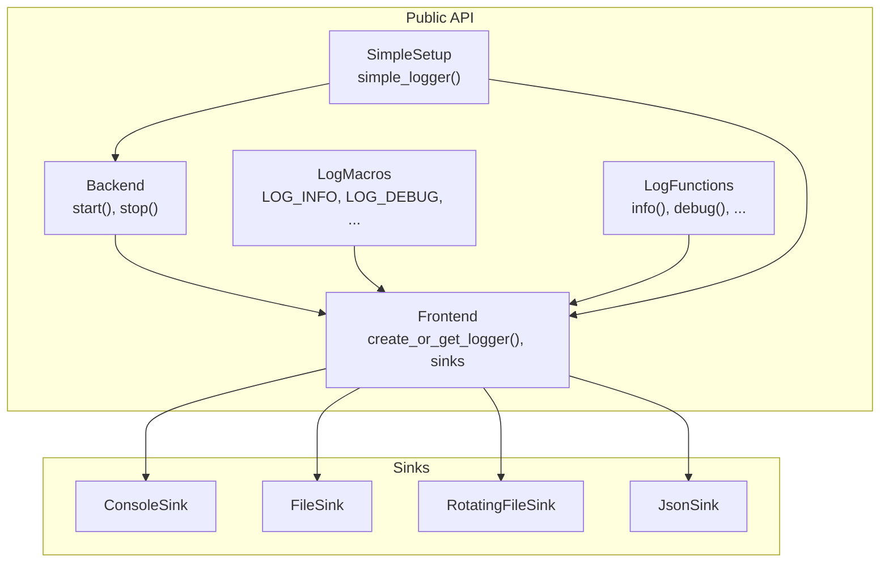
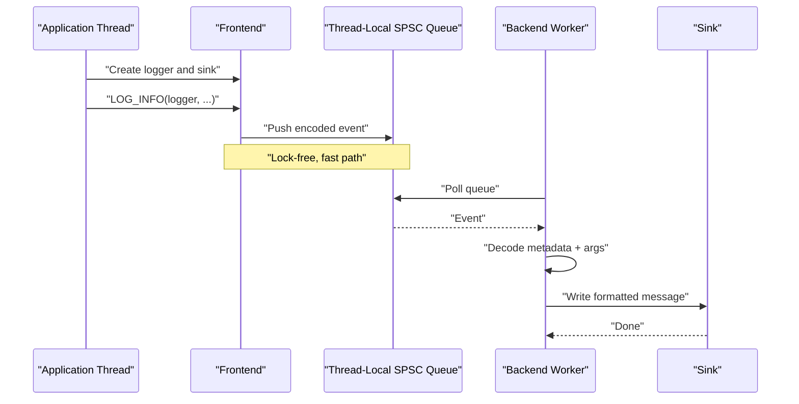
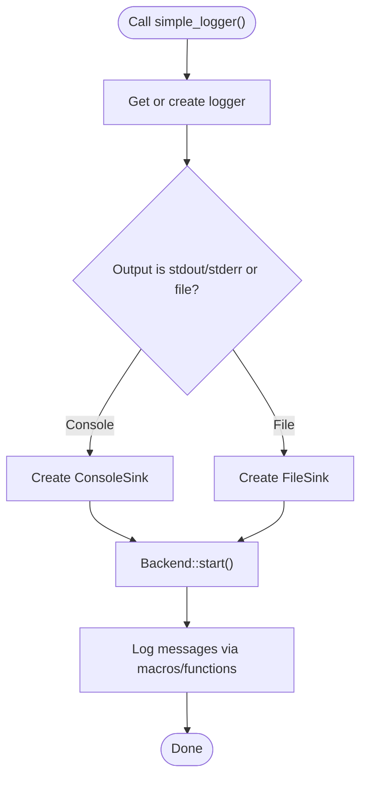
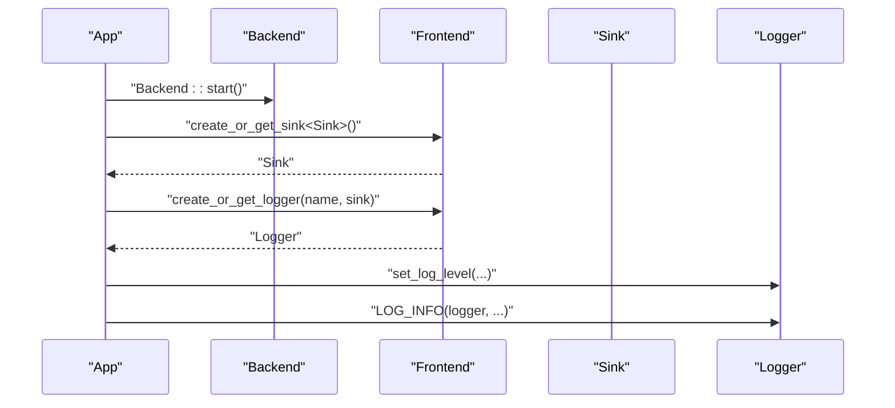
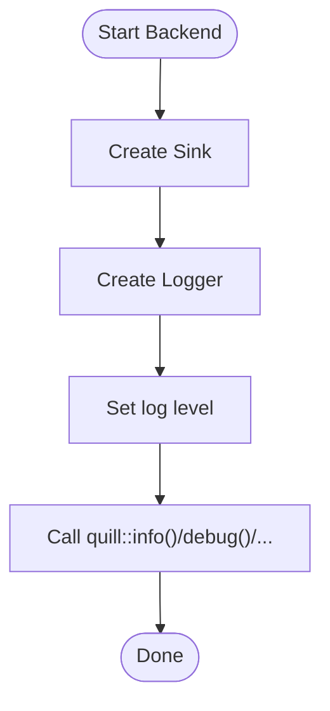
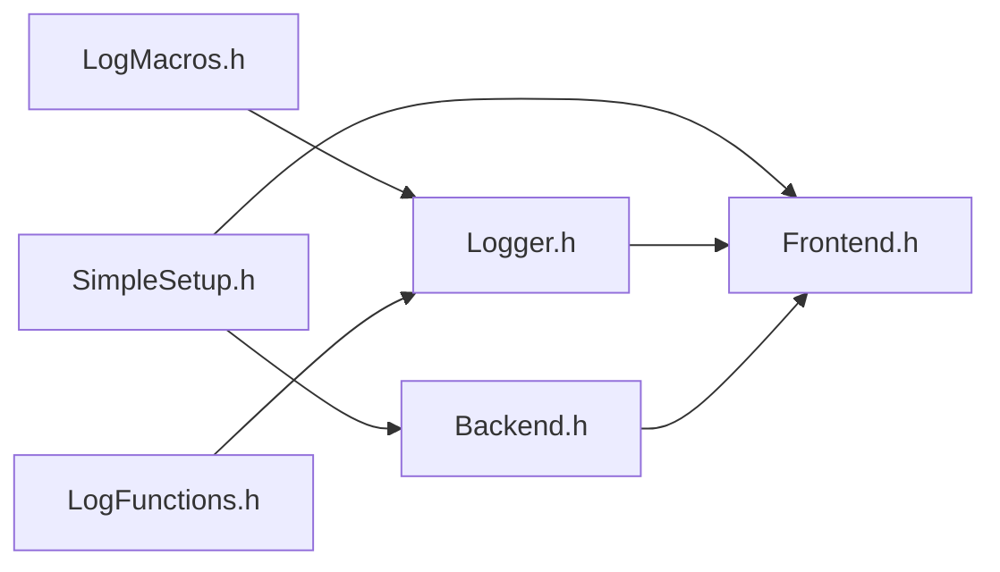

# Getting Started

<cite>
**Referenced Files in This Document**
- [README.md](file://README.md)
- [installing.rst](file://docs/installing.rst)
- [quick_start.rst](file://docs/quick_start.rst)
- [SimpleSetup.h](file://include/quill/SimpleSetup.h)
- [Backend.h](file://include/quill/Backend.h)
- [Frontend.h](file://include/quill/Frontend.h)
- [LogMacros.h](file://include/quill/LogMacros.h)
- [LogFunctions.h](file://include/quill/LogFunctions.h)
- [console_logging.cpp](file://examples/console_logging.cpp)
- [file_logging.cpp](file://examples/file_logging.cpp)
- [console_logging_macro_free.cpp](file://examples/console_logging_macro_free.cpp)
- [macro_free_mode.rst](file://docs/macro_free_mode.rst)
- [CMakeLists.txt](file://CMakeLists.txt)
</cite>

## Table of Contents
1. [Introduction](#introduction)
2. [Project Structure](#project-structure)
3. [Core Components](#core-components)
4. [Architecture Overview](#architecture-overview)
5. [Detailed Component Analysis](#detailed-component-analysis)
6. [Dependency Analysis](#dependency-analysis)
7. [Performance Considerations](#performance-considerations)
8. [Troubleshooting Guide](#troubleshooting-guide)
9. [Conclusion](#conclusion)
10. [Appendices](#appendices)

## Introduction
Quill is a high-performance asynchronous logging library for C++. It is designed for performance-critical applications that demand ultra-low latency and minimal overhead. Quill achieves this by offloading formatting and I/O to a dedicated backend thread while keeping the caller threads lock-free and responsive.

Key benefits:
- Asynchronous processing with a background thread
- Minimal header dependencies for the frontend
- Compile-time log level filtering to eliminate unreachable code
- Rich sink ecosystem (console, files, JSON, rotating, etc.)
- Flexible timestamp sources and backtrace logging

## Project Structure
Quill is organized into:
- Public headers under include/quill/ exposing the frontend, backend, and sinks
- Documentation under docs/ with tutorials and examples
- Examples under examples/ demonstrating console, file, JSON, and macro-free modes
- Build configuration via CMake and multiple packaging integrations

**Diagram sources**
- [Frontend.h](file://include/quill/Frontend.h)
- [Backend.h](file://include/quill/Backend.h)
- [LogMacros.h](file://include/quill/LogMacros.h)
- [LogFunctions.h](file://include/quill/LogFunctions.h)
- [SimpleSetup.h](file://include/quill/SimpleSetup.h)

**Section sources**
- [README.md](file://README.md)
- [CMakeLists.txt](file://CMakeLists.txt)

## Core Components
- Backend: Manages the logging thread, startup/shutdown, and notification mechanisms.
- Frontend: Provides logger and sink creation, thread-local queues, and thread lifecycle helpers.
- LogMacros: Compile-time optimized logging macros with compile-active log level filtering.
- LogFunctions: Macro-free logging functions for convenience at the cost of some performance.
- SimpleSetup: Convenience wrapper for the fastest console/file logging setup.

Typical usage patterns:
- Simple logger: Use simple_logger() for console or file logging with minimal code.
- Detailed setup: Start Backend, create sinks, and create loggers via Frontend for full control.
- Macro-free: Use LogFunctions for function-style logging without macros.

**Section sources**
- [SimpleSetup.h](file://include/quill/SimpleSetup.h)
- [Backend.h](file://include/quill/Backend.h)
- [Frontend.h](file://include/quill/Frontend.h)
- [LogMacros.h](file://include/quill/LogMacros.h)
- [LogFunctions.h](file://include/quill/LogFunctions.h)

## Architecture Overview
Quill separates concerns between the frontend and backend:
- Frontend: Caller threads push formatted metadata and arguments into a thread-local SPSC queue.
- Backend: Consumes the queue, formats messages, and writes to configured sinks.

**Diagram sources**
- [Frontend.h](file://include/quill/Frontend.h)
- [Backend.h](file://include/quill/Backend.h)
- [LogMacros.h](file://include/quill/LogMacros.h)

**Section sources**
- [quick_start.rst](file://docs/quick_start.rst)
- [README.md](file://README.md)

## Detailed Component Analysis

### Installation Methods
Supported package managers and build systems:
- vcpkg, Conan, Homebrew, Meson WrapDB, Conda, Bzlmod, xmake, nix, build2
- CMake: External or embedded integration
- Direct repository clone and build

Notes:
- CMake requires C++17 or newer.
- Options exist for exceptions, thread names, and macro variants.

**Section sources**
- [installing.rst](file://docs/installing.rst)
- [README.md](file://README.md)
- [CMakeLists.txt](file://CMakeLists.txt)

### Quick Start: Three Approaches

#### Approach 1: Simple Logger (fastest)
- Purpose: Minimal code for console or file logging.
- Behavior: Creates or retrieves a logger, sets up a sink, starts backend once, and logs messages.

**Diagram sources**
- [SimpleSetup.h](file://include/quill/SimpleSetup.h)
- [Backend.h](file://include/quill/Backend.h)

**Section sources**
- [README.md](file://README.md)
- [docs/examples/quill_docs_quick_start.cpp](file://docs/examples/quill_docs_quick_start.cpp)

#### Approach 2: Detailed Setup (full control)
- Steps:
  1) Start Backend
  2) Create a sink (ConsoleSink, FileSink, etc.)
  3) Create or get a logger bound to the sink
  4) Optionally adjust log level and formatter
  5) Log using macros or functions

**Diagram sources**
- [Backend.h](file://include/quill/Backend.h)
- [Frontend.h](file://include/quill/Frontend.h)
- [LogMacros.h](file://include/quill/LogMacros.h)

**Section sources**
- [quick_start.rst](file://docs/quick_start.rst)
- [console_logging.cpp](file://examples/console_logging.cpp)
- [file_logging.cpp](file://examples/file_logging.cpp)

#### Approach 3: Macro-Free Mode (maximum performance trade-off)
- Use LogFunctions for function-style logging.
- Trade-offs: runtime metadata copying, always-evaluated arguments, no compile-time removal of levels.
- Best for hot paths where macro overhead is undesirable despite the costs.

**Diagram sources**
- [LogFunctions.h](file://include/quill/LogFunctions.h)
- [macro_free_mode.rst](file://docs/macro_free_mode.rst)

**Section sources**
- [macro_free_mode.rst](file://docs/macro_free_mode.rst)
- [console_logging_macro_free.cpp](file://examples/console_logging_macro_free.cpp)

### Basic Usage Patterns
- Console logging: Create a ConsoleSink, create a logger, set log level, and log.
- File logging: Create a FileSink with optional rotation and formatting, then log.
- Macro-free console logging: Same as console but using LogFunctions.

Examples:
- Console logging: [console_logging.cpp](file://examples/console_logging.cpp)
- File logging: [file_logging.cpp](file://examples/file_logging.cpp)
- Macro-free console logging: [console_logging_macro_free.cpp](file://examples/console_logging_macro_free.cpp)

**Section sources**
- [console_logging.cpp](file://examples/console_logging.cpp)
- [file_logging.cpp](file://examples/file_logging.cpp)
- [console_logging_macro_free.cpp](file://examples/console_logging_macro_free.cpp)

### Choosing the Right Approach
- Use simple_logger() when you want the fastest path to working logging (console or file).
- Use detailed setup when you need multiple sinks, custom formatters, or precise control over backend options.
- Use macro-free mode when you have measured that macro overhead matters in your hot path and you accept the performance and convenience trade-offs.

**Section sources**
- [README.md](file://README.md)
- [macro_free_mode.rst](file://docs/macro_free_mode.rst)

## Dependency Analysis
Quill’s public API is intentionally lightweight:
- Frontend: Logger and sink creation, thread-local queue management.
- Backend: Thread lifecycle, notifications, and stop logic.
- LogMacros: Compile-time filtering and macro expansion.
- LogFunctions: Runtime metadata path for convenience.
- SimpleSetup: High-level convenience for typical setups.

**Diagram sources**
- [LogMacros.h](file://include/quill/LogMacros.h)
- [LogFunctions.h](file://include/quill/LogFunctions.h)
- [SimpleSetup.h](file://include/quill/SimpleSetup.h)
- [Backend.h](file://include/quill/Backend.h)
- [Frontend.h](file://include/quill/Frontend.h)

**Section sources**
- [Frontend.h](file://include/quill/Frontend.h)
- [Backend.h](file://include/quill/Backend.h)
- [LogMacros.h](file://include/quill/LogMacros.h)
- [LogFunctions.h](file://include/quill/LogFunctions.h)
- [SimpleSetup.h](file://include/quill/SimpleSetup.h)

## Performance Considerations
- Compile-time filtering: Disable unwanted log levels to remove code at compile time.
- Queue modes: Choose bounded vs unbounded and blocking vs dropping depending on your safety and throughput needs.
- Immediate flush: Useful for debugging but reduces performance; avoid in production.
- Macro-free mode: Adds runtime metadata overhead; prefer macros for hot paths.

[No sources needed since this section provides general guidance]

## Troubleshooting Guide
Common issues and resolutions:
- Backend not started: Ensure Backend::start() is called before logging. The simple_logger() wrapper does this automatically.
- Logger reuse: Reuse loggers and sinks by name; Quill will return existing instances.
- Fork() usage: Avoid calling Backend::start() before fork(); call it in each process and write to distinct files.
- C++ standard: Ensure C++17 or newer; CMake enforces this.
- Sanitizers and tests: Build options exist for ASan, TSan, and coverage; enable as needed.

**Section sources**
- [README.md](file://README.md)
- [CMakeLists.txt](file://CMakeLists.txt)

## Conclusion
Quill delivers ultra-low latency logging with minimal overhead by separating frontend hot-path logging from backend formatting and I/O. Start with simple_logger() for the fastest path, move to detailed setup for advanced control, and consider macro-free mode when function-style logging fits your workflow despite performance trade-offs. Use the examples and documentation to tailor Quill to your application’s needs.

[No sources needed since this section summarizes without analyzing specific files]

## Appendices

### Quick Reference: Minimal Working Examples
- Console logging with macros: [console_logging.cpp](file://examples/console_logging.cpp)
- File logging with macros: [file_logging.cpp](file://examples/file_logging.cpp)
- Macro-free console logging: [console_logging_macro_free.cpp](file://examples/console_logging_macro_free.cpp)
- Simple logger example: [docs/examples/quill_docs_quick_start.cpp](file://docs/examples/quill_docs_quick_start.cpp)

**Section sources**
- [console_logging.cpp](file://examples/console_logging.cpp)
- [file_logging.cpp](file://examples/file_logging.cpp)
- [console_logging_macro_free.cpp](file://examples/console_logging_macro_free.cpp)
- [docs/examples/quill_docs_quick_start.cpp](file://docs/examples/quill_docs_quick_start.cpp)