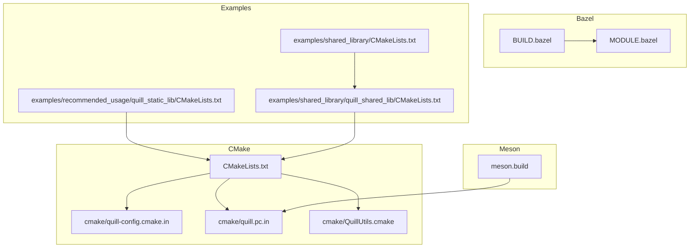
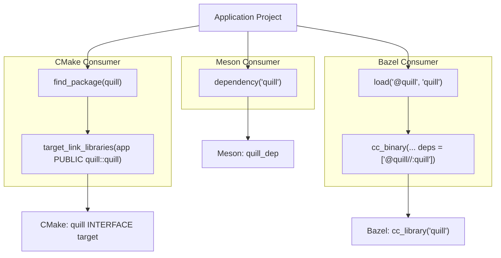
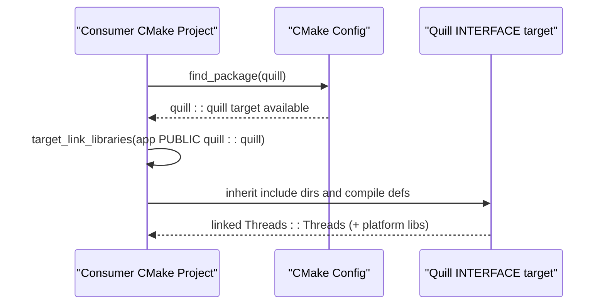
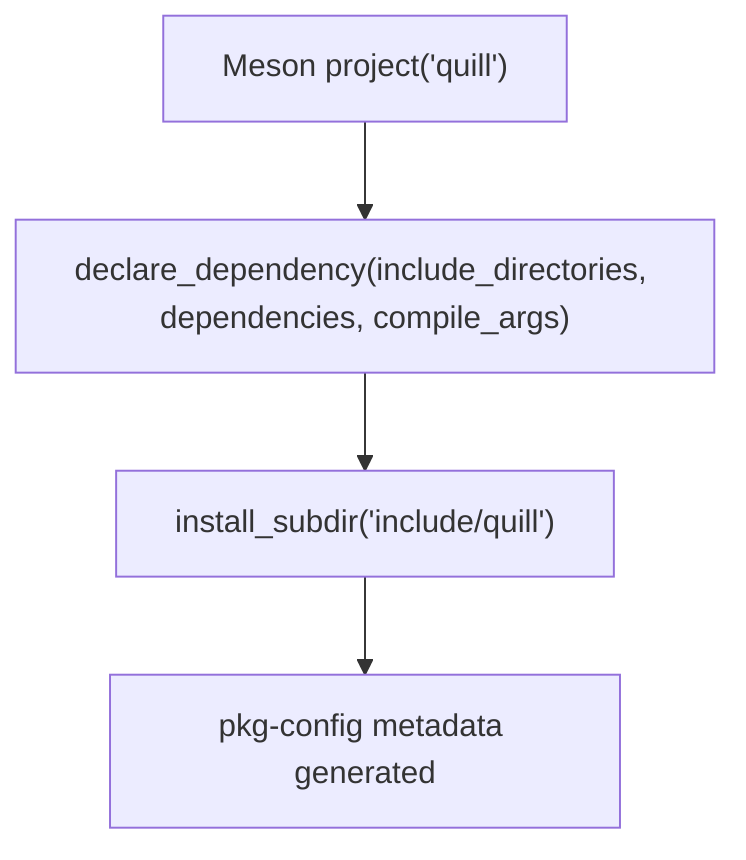
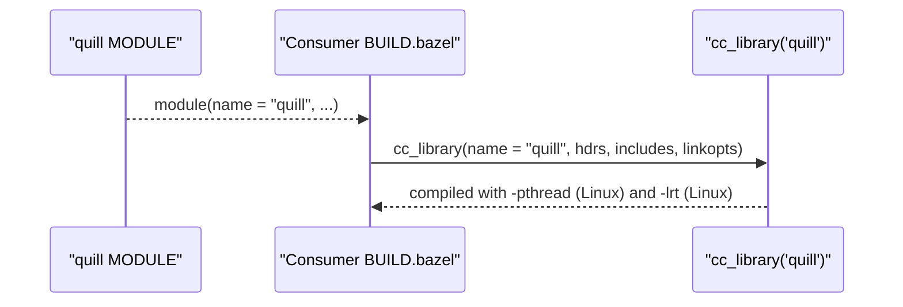
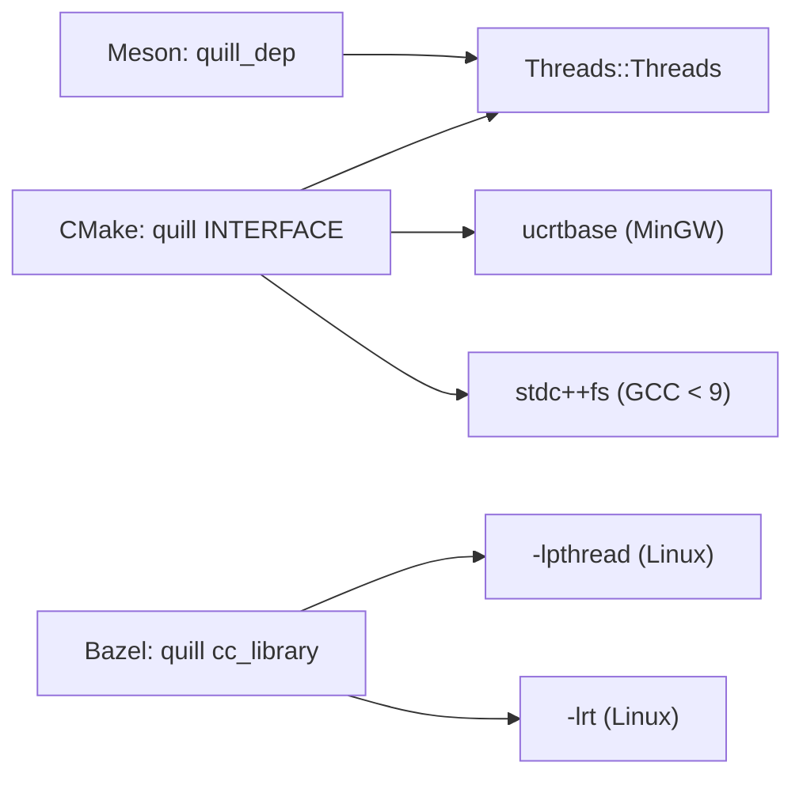

# Build System Integration

<cite>
**Referenced Files in This Document**
- [CMakeLists.txt](file://CMakeLists.txt)
- [meson.build](file://meson.build)
- [BUILD.bazel](file://BUILD.bazel)
- [MODULE.bazel](file://MODULE.bazel)
- [cmake/quill-config.cmake.in](file://cmake/quill-config.cmake.in)
- [cmake/quill.pc.in](file://cmake/quill.pc.in)
- [cmake/QuillUtils.cmake](file://cmake/QuillUtils.cmake)
- [examples/recommended_usage/quill_static_lib/CMakeLists.txt](file://examples/recommended_usage/quill_static_lib/CMakeLists.txt)
- [examples/shared_library/quill_shared_lib/CMakeLists.txt](file://examples/shared_library/quill_shared_lib/CMakeLists.txt)
- [examples/shared_library/CMakeLists.txt](file://examples/shared_library/CMakeLists.txt)
- [dev_build.sh](file://dev_build.sh)
- [.github/workflows/ubuntu.yml](file://.github/workflows/ubuntu.yml)
- [build/quill.pc](file://build/quill.pc)
</cite>

## Table of Contents
1. [Introduction](#introduction)
2. [Project Structure](#project-structure)
3. [Core Components](#core-components)
4. [Architecture Overview](#architecture-overview)
5. [Detailed Component Analysis](#detailed-component-analysis)
6. [Dependency Analysis](#dependency-analysis)
7. [Performance Considerations](#performance-considerations)
8. [Troubleshooting Guide](#troubleshooting-guide)
9. [Conclusion](#conclusion)
10. [Appendices](#appendices)

## Introduction
This document explains how to integrate Quill into external projects using three major build systems: CMake, Meson, and Bazel. It covers configuration options, dependency management, pkg-config support, static versus dynamic linking, installation, cross-compilation, and troubleshooting. The goal is to help you adopt Quill quickly and reliably across platforms and toolchains.

## Project Structure
Quill provides canonical build configurations for CMake, Meson, and Bazel. The repository also includes example integrations under the examples directory and helper utilities for CMake.

Key build-related files:
- CMake: top-level configuration, pkg-config template, and CMake package template
- Meson: single build definition with pkg-config generation
- Bazel: cc_library target with platform-specific linkopts and module metadata
- Examples: minimal integration patterns for static and shared library usage

**Diagram sources**
- [CMakeLists.txt](file://CMakeLists.txt)
- [cmake/quill-config.cmake.in](file://cmake/quill-config.cmake.in)
- [cmake/quill.pc.in](file://cmake/quill.pc.in)
- [cmake/QuillUtils.cmake](file://cmake/QuillUtils.cmake)
- [meson.build](file://meson.build)
- [BUILD.bazel](file://BUILD.bazel)
- [MODULE.bazel](file://MODULE.bazel)
- [examples/recommended_usage/quill_static_lib/CMakeLists.txt](file://examples/recommended_usage/quill_static_lib/CMakeLists.txt)
- [examples/shared_library/quill_shared_lib/CMakeLists.txt](file://examples/shared_library/quill_shared_lib/CMakeLists.txt)
- [examples/shared_library/CMakeLists.txt](file://examples/shared_library/CMakeLists.txt)

**Section sources**
- [CMakeLists.txt](file://CMakeLists.txt)
- [meson.build](file://meson.build)
- [BUILD.bazel](file://BUILD.bazel)
- [MODULE.bazel](file://MODULE.bazel)
- [cmake/quill-config.cmake.in](file://cmake/quill-config.cmake.in)
- [cmake/quill.pc.in](file://cmake/quill.pc.in)
- [cmake/QuillUtils.cmake](file://cmake/QuillUtils.cmake)
- [examples/recommended_usage/quill_static_lib/CMakeLists.txt](file://examples/recommended_usage/quill_static_lib/CMakeLists.txt)
- [examples/shared_library/quill_shared_lib/CMakeLists.txt](file://examples/shared_library/quill_shared_lib/CMakeLists.txt)
- [examples/shared_library/CMakeLists.txt](file://examples/shared_library/CMakeLists.txt)

## Core Components
- CMake target and interface library
  - Defines an interface library named quill with public compile definitions mapped from CMake options.
  - Links against Threads::Threads and adds platform-specific libraries when needed.
  - Exposes include directories via target_include_directories with BUILD_INTERFACE/INSTALL_INTERFACE.
  - Provides CMake package config and pkg-config generation for downstream consumption.

- Meson dependency
  - Declares a quill_dep dependency with include directories, threading dependency, and compiler arguments.
  - Installs headers and generates pkg-config metadata.

- Bazel cc_library
  - Provides a cc_library target named quill with globbed headers, include paths, and platform-specific linkopts.
  - Module metadata declares compatibility level and dependencies.

- CMake utilities
  - QuillUtils.cmake centralizes common compile options and MSVC exception handling adjustments.

**Section sources**
- [CMakeLists.txt](file://CMakeLists.txt)
- [cmake/QuillUtils.cmake](file://cmake/QuillUtils.cmake)
- [meson.build](file://meson.build)
- [BUILD.bazel](file://BUILD.bazel)
- [MODULE.bazel](file://MODULE.bazel)

## Architecture Overview
The build system integrates Quill through standardized mechanisms per toolchain. Downstream consumers either find the installed package (CMake) or consume the Meson dependency or Bazel module.

**Diagram sources**
- [CMakeLists.txt](file://CMakeLists.txt)
- [cmake/quill-config.cmake.in](file://cmake/quill-config.cmake.in)
- [meson.build](file://meson.build)
- [BUILD.bazel](file://BUILD.bazel)
- [MODULE.bazel](file://MODULE.bazel)

## Detailed Component Analysis

### CMake Integration
- find_package() and target_link_libraries()
  - Consumers locate the installed package and link against quill::quill.
  - The CMake package config includes Threads::Threads and loads exported targets.

- Custom configuration options
  - The library exposes compile definitions that mirror CMake options, allowing consumers to align behavior.
  - Example options include disabling exceptions, thread name support, sequential thread IDs, x86-specific optimizations, macro variants, function/file info, and assertion behavior.

- Static vs dynamic linking
  - The repository demonstrates both static and shared library usage in examples.
  - Shared library usage requires Windows-side definitions for export/import and optional visibility flags on Unix-like compilers.

- Installation and pkg-config
  - The build installs headers, the interface library, and a CMake package config.
  - A pkg-config file is generated and installed, including pthread linkage hints.

- Cross-compilation and toolchain configuration
  - The project sets a minimum C++ standard and enforces C++17.
  - Platform-specific linkopts and compile definitions are applied conditionally.

**Diagram sources**
- [CMakeLists.txt](file://CMakeLists.txt)
- [cmake/quill-config.cmake.in](file://cmake/quill-config.cmake.in)

**Section sources**
- [CMakeLists.txt](file://CMakeLists.txt)
- [cmake/quill-config.cmake.in](file://cmake/quill-config.cmake.in)
- [cmake/quill.pc.in](file://cmake/quill.pc.in)
- [cmake/QuillUtils.cmake](file://cmake/QuillUtils.cmake)
- [examples/recommended_usage/quill_static_lib/CMakeLists.txt](file://examples/recommended_usage/quill_static_lib/CMakeLists.txt)
- [examples/shared_library/quill_shared_lib/CMakeLists.txt](file://examples/shared_library/quill_shared_lib/CMakeLists.txt)
- [examples/shared_library/CMakeLists.txt](file://examples/shared_library/CMakeLists.txt)

### Meson Integration
- quill_dep()
  - The Meson build defines a quill_dep dependency that encapsulates include directories, threading dependency, and compiler arguments.
  - Consumers can depend on dependency('quill') in their own Meson.build.

- Dependency management and pkg-config
  - The Meson build installs headers and generates a pkg-config file with appropriate metadata.

**Diagram sources**
- [meson.build](file://meson.build)

**Section sources**
- [meson.build](file://meson.build)

### Bazel Integration
- quill_cc_library() equivalent
  - The BUILD.bazel file defines a cc_library target named quill with globbed headers, include paths, and platform-specific linkopts.
  - MODULE.bazel declares module metadata and dependencies for platforms and rules_cc.

- Workspace setup
  - Consumers can depend on the local module or fetch it from a registry using the declared module name.

**Diagram sources**
- [BUILD.bazel](file://BUILD.bazel)
- [MODULE.bazel](file://MODULE.bazel)

**Section sources**
- [BUILD.bazel](file://BUILD.bazel)
- [MODULE.bazel](file://MODULE.bazel)

### pkg-config Support and System Package Integration
- The CMake build generates and installs a pkg-config file for quill.
- The generated .pc file includes version, description, URL, include flags, and library flags (pthread linkage).
- This enables system package managers and pkg-config-aware tools to discover and link Quill.

**Section sources**
- [CMakeLists.txt](file://CMakeLists.txt)
- [cmake/quill.pc.in](file://cmake/quill.pc.in)
- [build/quill.pc](file://build/quill.pc)

### Cross-Compilation, Toolchain Configuration, and Platform-Specific Flags
- C++ standard and defaults
  - The build enforces C++17 and sets a default Release build type when none is provided.

- Compiler-specific flags
  - The interface library applies a warning suppression argument for GNU-like toolchains.
  - Utilities adjust MSVC exception handling flags when exceptions are disabled.

- Platform-specific linkopts
  - Bazel linkopts add pthread and realtime libraries on Linux and handle Windows differently.
  - CMake links ucrtbase on MinGW and stdc++fs on older GCC versions.

- Cross-compilation guidance
  - Use standard CMake variables (CMAKE_TOOLCHAIN_FILE, CMAKE_SYSROOT) for CMake.
  - For Meson, pass --cross-file and manage dependencies accordingly.
  - For Bazel, use --platforms and toolchain resolution.

**Section sources**
- [CMakeLists.txt](file://CMakeLists.txt)
- [cmake/QuillUtils.cmake](file://cmake/QuillUtils.cmake)
- [BUILD.bazel](file://BUILD.bazel)
- [.github/workflows/ubuntu.yml](file://.github/workflows/ubuntu.yml)

### Integrating Quill into Existing Projects
- CMake
  - Option A: Installed package
    - Configure your project to find the installed quill and link against quill::quill.
  - Option B: Embedded subdirectory
    - Add_subdirectory the Quill source and link against quill::quill.

- Meson
  - Depend on dependency('quill') in your project’s Meson.build.

- Bazel
  - Load the module and depend on @quill//:quill in cc_binary rules.

- Static vs dynamic linking examples
  - Static usage is demonstrated in the recommended usage example.
  - Shared library usage shows Windows export/import definitions and optional visibility flags.

**Section sources**
- [CMakeLists.txt](file://CMakeLists.txt)
- [meson.build](file://meson.build)
- [BUILD.bazel](file://BUILD.bazel)
- [examples/recommended_usage/quill_static_lib/CMakeLists.txt](file://examples/recommended_usage/quill_static_lib/CMakeLists.txt)
- [examples/shared_library/quill_shared_lib/CMakeLists.txt](file://examples/shared_library/quill_shared_lib/CMakeLists.txt)
- [examples/shared_library/CMakeLists.txt](file://examples/shared_library/CMakeLists.txt)

### Build Optimization Settings
- CMake
  - The default build type is Release when unspecified.
  - Developer-focused build script enables examples, tests, benchmarks, and compile_commands export.

- Meson
  - Sets warning_level and C++ standard defaults.

- Bazel
  - Uses platform-specific linkopts for threading and real-time facilities on supported platforms.

**Section sources**
- [CMakeLists.txt](file://CMakeLists.txt)
- [dev_build.sh](file://dev_build.sh)
- [meson.build](file://meson.build)
- [BUILD.bazel](file://BUILD.bazel)

## Dependency Analysis
Quill’s build system composes a small set of explicit dependencies and propagates them via interface libraries or dependency declarations.

**Diagram sources**
- [CMakeLists.txt](file://CMakeLists.txt)
- [meson.build](file://meson.build)
- [BUILD.bazel](file://BUILD.bazel)

**Section sources**
- [CMakeLists.txt](file://CMakeLists.txt)
- [meson.build](file://meson.build)
- [BUILD.bazel](file://BUILD.bazel)

## Performance Considerations
- Prefer Release builds for production workloads.
- On x86 architectures, consider enabling x86-specific optimizations via the corresponding CMake option.
- Use platform-appropriate threading and real-time libraries when applicable (Linux: pthread and realtime).
- Align compiler warning levels and treat warnings as errors in CI to catch regressions early.

[No sources needed since this section provides general guidance]

## Troubleshooting Guide
- CMake: find_package() fails
  - Ensure the package is installed and visible to CMake (CMAKE_PREFIX_PATH or CMAKE_INSTALL_PREFIX aligned).
  - Verify that Threads::Threads is available on your platform.

- CMake: missing headers or include paths
  - Confirm that the INTERFACE include directories are propagated to your target.

- CMake: Windows shared library runtime issues
  - Ensure QUILL_DLL_EXPORT is defined when building the shared library and QUILL_DLL_IMPORT is defined when using it on Windows.

- Meson: dependency('quill') unresolved
  - Confirm that the quill_dep is installed or available in your subproject.

- Bazel: module not found
  - Ensure the module name matches and the WORKSPACE or Bzlmod configuration resolves the module.

- pkg-config: linker flags incorrect
  - Verify the installed .pc file includes pthread and any platform-specific libraries.

- Cross-compilation: unexpected link failures
  - Provide a toolchain file and ensure platform-specific libraries are available in the sysroot.

**Section sources**
- [CMakeLists.txt](file://CMakeLists.txt)
- [cmake/quill-config.cmake.in](file://cmake/quill-config.cmake.in)
- [cmake/quill.pc.in](file://cmake/quill.pc.in)
- [examples/shared_library/quill_shared_lib/CMakeLists.txt](file://examples/shared_library/quill_shared_lib/CMakeLists.txt)
- [examples/shared_library/CMakeLists.txt](file://examples/shared_library/CMakeLists.txt)
- [meson.build](file://meson.build)
- [BUILD.bazel](file://BUILD.bazel)
- [MODULE.bazel](file://MODULE.bazel)
- [build/quill.pc](file://build/quill.pc)

## Conclusion
Quill offers robust, portable build integration across CMake, Meson, and Bazel. By leveraging the provided package configs, Meson dependency, and Bazel module, you can integrate Quill with minimal friction. The examples demonstrate static and shared linking patterns, and the build system’s options allow fine-grained control over behavior and performance.

[No sources needed since this section summarizes without analyzing specific files]

## Appendices

### Appendix A: CMake Options Reference
- QUILL_NO_EXCEPTIONS
- QUILL_NO_THREAD_NAME_SUPPORT
- QUILL_USE_SEQUENTIAL_THREAD_ID
- QUILL_X86ARCH
- QUILL_DISABLE_NON_PREFIXED_MACROS
- QUILL_DISABLE_FUNCTION_NAME
- QUILL_DETAILED_FUNCTION_NAME
- QUILL_DISABLE_FILE_INFO
- QUILL_ENABLE_ASSERTIONS
- QUILL_BUILD_EXAMPLES
- QUILL_BUILD_TESTS
- QUILL_ENABLE_EXTENSIVE_TESTS
- QUILL_BUILD_BENCHMARKS
- QUILL_SANITIZE_ADDRESS
- QUILL_SANITIZE_THREAD
- QUILL_BUILD_FUZZING
- QUILL_CODE_COVERAGE
- QUILL_USE_VALGRIND
- QUILL_ENABLE_INSTALL
- QUILL_DOCS_GEN

**Section sources**
- [CMakeLists.txt](file://CMakeLists.txt)

### Appendix B: Example Integration Patterns
- CMake static library wrapper linking to quill::quill
- CMake shared library wrapper with Windows export/import definitions
- Host example linking against the shared library wrapper

**Section sources**
- [examples/recommended_usage/quill_static_lib/CMakeLists.txt](file://examples/recommended_usage/quill_static_lib/CMakeLists.txt)
- [examples/shared_library/quill_shared_lib/CMakeLists.txt](file://examples/shared_library/quill_shared_lib/CMakeLists.txt)
- [examples/shared_library/CMakeLists.txt](file://examples/shared_library/CMakeLists.txt)