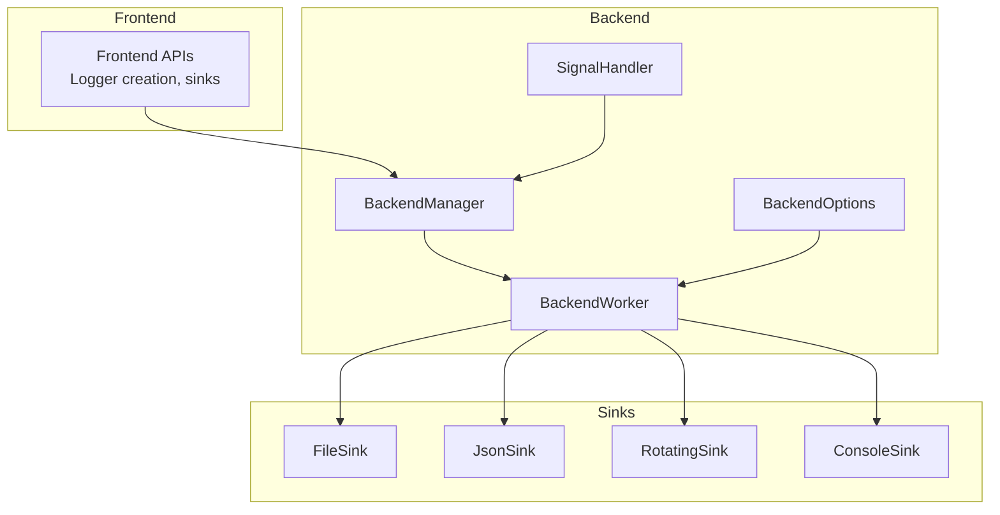
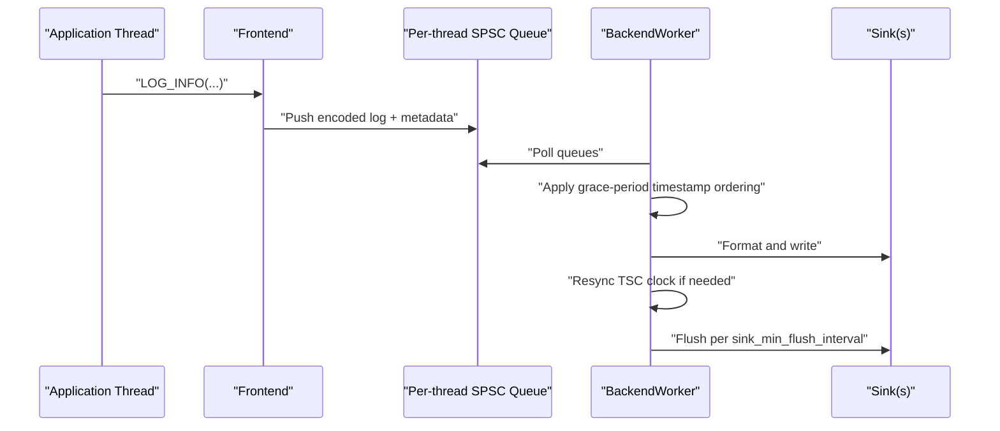
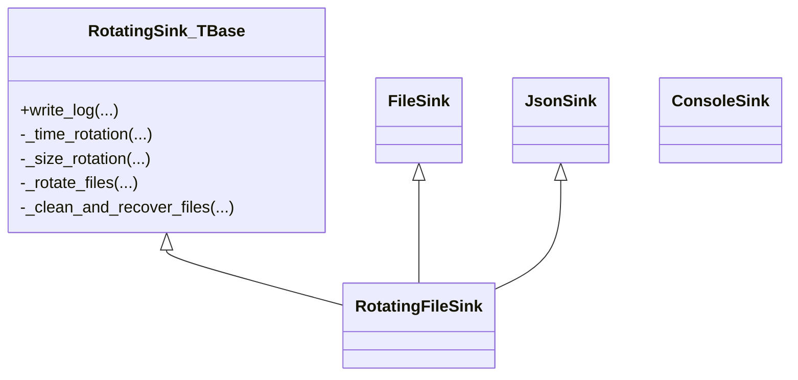
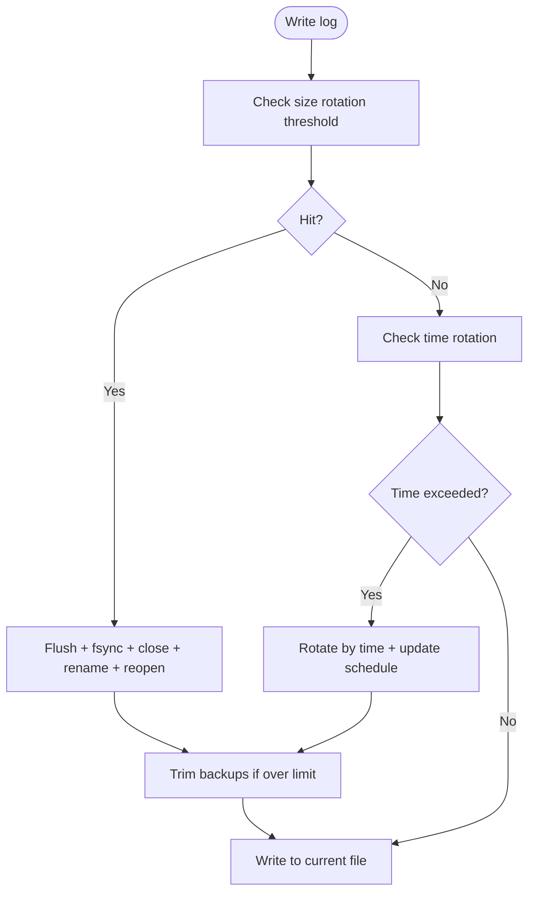
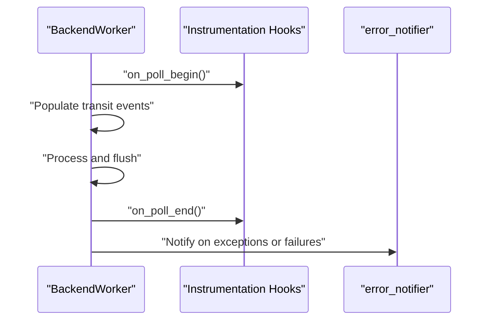
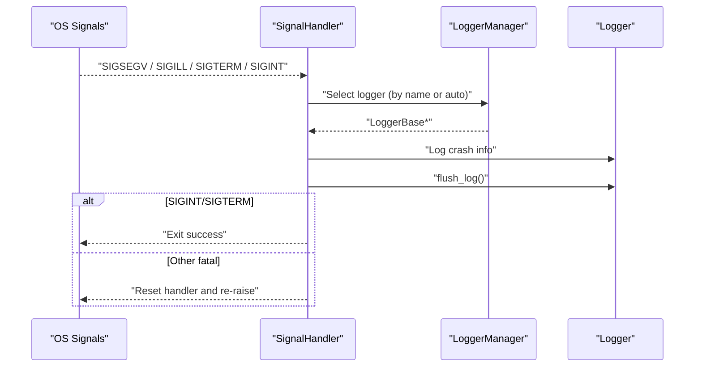
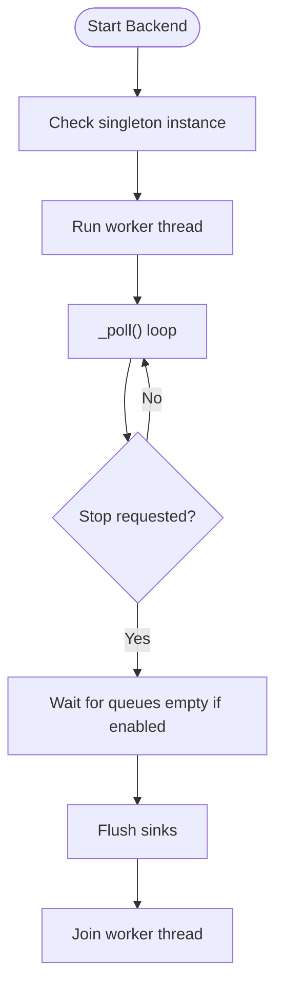
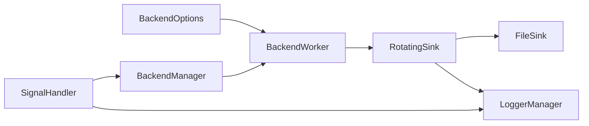

# Deployment Strategies

<cite>
**Referenced Files in This Document**
- [README.md](file://README.md)
- [CMakeLists.txt](file://CMakeLists.txt)
- [examples/signal_handler.cpp](file://examples/signal_handler.cpp)
- [examples/rotating_file_logging.cpp](file://examples/rotating_file_logging.cpp)
- [examples/rotating_json_file_logging.cpp](file://examples/rotating_json_file_logging.cpp)
- [examples/json_console_logging.cpp](file://examples/json_console_logging.cpp)
- [include/quill/backend/BackendOptions.h](file://include/quill/backend/BackendOptions.h)
- [include/quill/backend/BackendWorker.h](file://include/quill/backend/BackendWorker.h)
- [include/quill/backend/SignalHandler.h](file://include/quill/backend/SignalHandler.h)
- [include/quill/backend/BackendManager.h](file://include/quill/backend/BackendManager.h)
- [include/quill/sinks/RotatingSink.h](file://include/quill/sinks/RotatingSink.h)
- [include/quill/sinks/RotatingFileSink.h](file://include/quill/sinks/RotatingFileSink.h)
- [include/quill/core/LoggerManager.h](file://include/quill/core/LoggerManager.h)
</cite>

## Table of Contents
1. [Introduction](#introduction)
2. [Project Structure](#project-structure)
3. [Core Components](#core-components)
4. [Architecture Overview](#architecture-overview)
5. [Detailed Component Analysis](#detailed-component-analysis)
6. [Dependency Analysis](#dependency-analysis)
7. [Performance Considerations](#performance-considerations)
8. [Troubleshooting Guide](#troubleshooting-guide)
9. [Conclusion](#conclusion)
10. [Appendices](#appendices)

## Introduction
This document provides a comprehensive production deployment strategy for Quill, focusing on logging infrastructure, rotation, monitoring integration, crash-safe logging, high availability, security, and operational procedures. It synthesizes configuration options, sink behaviors, backend scheduling, and signal handling to guide robust, scalable, and secure logging in production environments.

## Project Structure
Quill is organized into:
- Frontend APIs for logging and logger creation
- Backend subsystem managing a dedicated worker thread, queues, and formatting
- Sinks for console, files, JSON, rotating files, and platform-specific outputs
- Build and configuration via CMake with numerous tunables for production hardening

**Diagram sources**
- [include/quill/backend/BackendManager.h:38-128](file://include/quill/backend/BackendManager.h#L38-L128)
- [include/quill/backend/BackendWorker.h:138-207](file://include/quill/backend/BackendWorker.h#L138-L207)
- [include/quill/backend/BackendOptions.h:30-281](file://include/quill/backend/BackendOptions.h#L30-L281)
- [include/quill/backend/SignalHandler.h:254-486](file://include/quill/backend/SignalHandler.h#L254-L486)
- [include/quill/sinks/RotatingSink.h:262-316](file://include/quill/sinks/RotatingSink.h#L262-L316)

**Section sources**
- [README.md:102-190](file://README.md#L102-L190)
- [CMakeLists.txt:182-289](file://CMakeLists.txt#L182-L289)

## Core Components
- BackendOptions: Controls backend thread name, idle behavior, transit event buffers, flush intervals, printable character checks, singleton instance verification, and hooks for instrumentation.
- BackendWorker: Polls frontend queues, orders messages by timestamp, formats, and forwards to sinks; supports CPU affinity and periodic resync for TSC clocks.
- BackendManager: Singleton accessor to backend worker, thread lifecycle, and manual backend worker.
- RotatingSink<FileSink>: Implements time-based and size-based rotation with configurable naming schemes, backup limits, and overwrite policies.
- SignalHandler: Installs handlers for fatal signals and Windows exceptions; logs and flushes on crash; supports timeouts and logger selection.
- LoggerManager: Central registry of loggers with environment-driven log level parsing and safe removal.

**Section sources**
- [include/quill/backend/BackendOptions.h:30-281](file://include/quill/backend/BackendOptions.h#L30-L281)
- [include/quill/backend/BackendWorker.h:138-474](file://include/quill/backend/BackendWorker.h#L138-L474)
- [include/quill/backend/BackendManager.h:38-128](file://include/quill/backend/BackendManager.h#L38-L128)
- [include/quill/sinks/RotatingSink.h:262-316](file://include/quill/sinks/RotatingSink.h#L262-L316)
- [include/quill/backend/SignalHandler.h:50-138](file://include/quill/backend/SignalHandler.h#L50-L138)
- [include/quill/core/LoggerManager.h:33-122](file://include/quill/core/LoggerManager.h#L33-L122)

## Architecture Overview
Quill’s production-grade architecture separates hot-path logging (frontend) from I/O-bound formatting and writing (backend). The backend worker:
- Polls per-thread SPSC queues
- Applies strict timestamp ordering with a grace period
- Buffers and batches transit events
- Flushes sinks at configured intervals
- Supports CPU affinity and periodic resync for TSC clocks

**Diagram sources**
- [include/quill/backend/BackendWorker.h:305-395](file://include/quill/backend/BackendWorker.h#L305-L395)
- [include/quill/backend/BackendOptions.h:58-132](file://include/quill/backend/BackendOptions.h#L58-L132)

**Section sources**
- [README.md:679-704](file://README.md#L679-L704)
- [include/quill/backend/BackendWorker.h:305-395](file://include/quill/backend/BackendWorker.h#L305-L395)

## Detailed Component Analysis

### Logging Infrastructure and Sinks
- File and JSON sinks: Human-readable and structured logging to files or console.
- Rotating sinks: Time-based rotation (daily/hourly/minutely) and size-based rotation with configurable naming schemes and backup retention.
- Platform sinks: Console, JSON console, Android, syslog, systemd.

**Diagram sources**
- [include/quill/sinks/RotatingSink.h:262-316](file://include/quill/sinks/RotatingSink.h#L262-L316)
- [include/quill/sinks/RotatingFileSink.h:13-13](file://include/quill/sinks/RotatingFileSink.h#L13-L13)

**Section sources**
- [examples/rotating_file_logging.cpp:14-44](file://examples/rotating_file_logging.cpp#L14-L44)
- [examples/rotating_json_file_logging.cpp:14-44](file://examples/rotating_json_file_logging.cpp#L14-L44)
- [examples/json_console_logging.cpp:9-53](file://examples/json_console_logging.cpp#L9-L53)

### Log Rotation Strategies
- Size-based rotation: Threshold in bytes triggers rotation; flush and fsync before rename to ensure durability.
- Time-based rotation: Daily, hourly, or minutely cadence; calculates next rotation time from start or last open time.
- Naming schemes: Index, Date, DateAndTime; supports recovery of existing files and optional overwrite policy.
- Backup retention: Max backup files enforced; oldest files removed when exceeding limit.

**Diagram sources**
- [include/quill/sinks/RotatingSink.h:373-487](file://include/quill/sinks/RotatingSink.h#L373-L487)

**Section sources**
- [include/quill/sinks/RotatingSink.h:66-170](file://include/quill/sinks/RotatingSink.h#L66-L170)
- [include/quill/sinks/RotatingSink.h:373-487](file://include/quill/sinks/RotatingSink.h#L373-L487)

### Monitoring Integration and Metrics
- Backend hooks: backend_worker_on_poll_begin/end allow instrumentation and telemetry hooks.
- Error notifications: error_notifier receives backend exceptions and queue conditions.
- Flush intervals: sink_min_flush_interval balances latency and throughput.
- Environment-driven log level: LoggerManager parses QUILL_LOG_LEVEL to adjust runtime verbosity.

**Diagram sources**
- [include/quill/backend/BackendWorker.h:260-279](file://include/quill/backend/BackendWorker.h#L260-L279)
- [include/quill/backend/BackendOptions.h:169-192](file://include/quill/backend/BackendOptions.h#L169-L192)

**Section sources**
- [include/quill/backend/BackendOptions.h:169-192](file://include/quill/backend/BackendOptions.h#L169-L192)
- [include/quill/core/LoggerManager.h:247-273](file://include/quill/core/LoggerManager.h#L247-L273)

### Crash-Safe Logging and Signal Handling
- SignalHandler installs handlers for fatal signals and Windows exceptions.
- On crash: logs the signal/exception, flushes, and optionally re-raises depending on signal type.
- Timeout protection: Linux alarm ensures termination if handler hangs.
- Logger selection: automatic fallback excludes specialized sinks by substring.

**Diagram sources**
- [include/quill/backend/SignalHandler.h:154-248](file://include/quill/backend/SignalHandler.h#L154-L248)

**Section sources**
- [examples/signal_handler.cpp:43-90](file://examples/signal_handler.cpp#L43-L90)
- [include/quill/backend/SignalHandler.h:50-138](file://include/quill/backend/SignalHandler.h#L50-L138)

### High Availability and Failover
- Backend singleton instance check: Prevents multiple backend workers in mixed static/shared linking scenarios.
- Graceful shutdown: wait_for_queues_to_empty_before_exit ensures draining before exit.
- CPU affinity: Pin backend to non-critical CPUs to reduce contention.
- Manual backend worker: Access to synchronous processing when needed.

**Diagram sources**
- [include/quill/backend/BackendOptions.h:145-146](file://include/quill/backend/BackendOptions.h#L145-L146)
- [include/quill/backend/BackendWorker.h:443-474](file://include/quill/backend/BackendWorker.h#L443-L474)
- [include/quill/backend/BackendManager.h:61-81](file://include/quill/backend/BackendManager.h#L61-L81)

**Section sources**
- [include/quill/backend/BackendOptions.h:279-281](file://include/quill/backend/BackendOptions.h#L279-L281)
- [include/quill/backend/BackendWorker.h:443-474](file://include/quill/backend/BackendWorker.h#L443-L474)

### Security Considerations
- Access control: Restrict filesystem permissions on log directories and files; prefer non-root ownership for backend writer threads.
- Audit trails: Use structured JSON logs for downstream SIEM ingestion; include process/thread IDs and timestamps.
- Printability checks: BackendOptions.check_printable_char filters non-printable characters to mitigate malformed output risks.
- Encryption at rest: Apply filesystem-level encryption or container encryption; Quill writes plaintext logs by default.

**Section sources**
- [include/quill/backend/BackendOptions.h:239-240](file://include/quill/backend/BackendOptions.h#L239-L240)

### Performance Monitoring, Capacity Planning, and Scaling
- Queue tuning: Transit event buffer sizes and limits balance latency and memory usage.
- Timestamp ordering grace period: Trade-off between strict ordering and read latency.
- Flush intervals: Increase sink_min_flush_interval to reduce I/O overhead under load.
- CPU affinity: Assign backend to isolated CPUs to minimize jitter.
- Throughput vs. latency: Use unbounded queues for high throughput; bounded dropping queues for bounded memory.

**Section sources**
- [include/quill/backend/BackendOptions.h:58-92](file://include/quill/backend/BackendOptions.h#L58-L92)
- [include/quill/backend/BackendOptions.h:132-132](file://include/quill/backend/BackendOptions.h#L132-L132)
- [include/quill/backend/BackendOptions.h:224-224](file://include/quill/backend/BackendOptions.h#L224-L224)

## Dependency Analysis
Key production dependencies and interactions:
- BackendOptions drives BackendWorker behavior and instrumentation hooks.
- BackendManager coordinates worker lifecycle and singleton checks.
- RotatingSink depends on FileSink and filesystem utilities; integrates with LoggerManager for naming and rotation.
- SignalHandler depends on LoggerManager for logger selection and BackendManager for backend thread identity.

**Diagram sources**
- [include/quill/backend/BackendOptions.h:30-281](file://include/quill/backend/BackendOptions.h#L30-L281)
- [include/quill/backend/BackendWorker.h:138-207](file://include/quill/backend/BackendWorker.h#L138-L207)
- [include/quill/backend/BackendManager.h:38-128](file://include/quill/backend/BackendManager.h#L38-L128)
- [include/quill/sinks/RotatingSink.h:262-316](file://include/quill/sinks/RotatingSink.h#L262-L316)
- [include/quill/backend/SignalHandler.h:107-138](file://include/quill/backend/SignalHandler.h#L107-L138)

**Section sources**
- [include/quill/backend/BackendWorker.h:138-207](file://include/quill/backend/BackendWorker.h#L138-L207)
- [include/quill/sinks/RotatingSink.h:262-316](file://include/quill/sinks/RotatingSink.h#L262-L316)

## Performance Considerations
- Tune transit_event_buffer_initial_capacity, soft/hard limits, and sleep_duration to balance latency and CPU usage.
- Use CPU affinity to isolate the backend thread on dedicated cores.
- Prefer JSON sinks for structured logs and SIEM ingestion; reduce formatting overhead by minimizing non-structured patterns.
- Adjust sink_min_flush_interval to reduce I/O pressure under sustained load.

[No sources needed since this section provides general guidance]

## Troubleshooting Guide
- Backend exceptions: error_notifier receives exceptions; inspect logs and adjust queue sizes or flush intervals.
- Deadlocks or hangs: Verify backend thread is running; confirm notify() wake-ups and proper stop() sequencing.
- Duplicate backend instances: Enable check_backend_singleton_instance to prevent multiple workers.
- Signal handling not invoked: Ensure init_signal_handler is called on each thread (Windows) and signals are not overridden by external handlers.

**Section sources**
- [include/quill/backend/BackendOptions.h:170-178](file://include/quill/backend/BackendOptions.h#L170-L178)
- [include/quill/backend/BackendManager.h:74-81](file://include/quill/backend/BackendManager.h#L74-L81)
- [include/quill/backend/SignalHandler.h:391-408](file://include/quill/backend/SignalHandler.h#L391-L408)

## Conclusion
Quill’s production-ready design centers on a dedicated backend worker, configurable sinks, and robust signal handling. By tuning BackendOptions, leveraging rotating sinks, instrumenting backend hooks, and applying security and HA practices, teams can operate reliable, observable, and crash-safe logging at scale.

[No sources needed since this section summarizes without analyzing specific files]

## Appendices

### Deployment Checklist
- Configure BackendOptions: thread name, idle behavior, flush interval, printable character checks, singleton instance check.
- Select sinks: file, JSON, console, or rotating variants; set rotation thresholds and naming schemes.
- Instrumentation: register backend_worker_on_poll_begin/end hooks for monitoring.
- Signal handling: initialize handlers per thread; configure logger selection and timeouts.
- Security: restrict filesystem permissions; consider encryption at rest; audit structured logs.
- HA: enable wait_for_queues_to_empty_before_exit; set CPU affinity; monitor queue failure counters.
- Capacity: size transit buffers and flush intervals for workload; validate with benchmarks.

**Section sources**
- [include/quill/backend/BackendOptions.h:30-281](file://include/quill/backend/BackendOptions.h#L30-L281)
- [include/quill/backend/SignalHandler.h:50-88](file://include/quill/backend/SignalHandler.h#L50-L88)
- [include/quill/sinks/RotatingSink.h:66-170](file://include/quill/sinks/RotatingSink.h#L66-L170)

### Operational Procedures
- Startup: start backend with Backend::start; create sinks and loggers; apply environment-driven log level.
- Shutdown: call stop on backend; ensure flush completes; drain queues if configured.
- Maintenance: review error_notifier logs; rotate logs per policy; prune backups; validate filesystem health.

**Section sources**
- [examples/signal_handler.cpp:43-90](file://examples/signal_handler.cpp#L43-L90)
- [include/quill/backend/BackendWorker.h:212-232](file://include/quill/backend/BackendWorker.h#L212-L232)
- [include/quill/core/LoggerManager.h:247-273](file://include/quill/core/LoggerManager.h#L247-L273)