# Integration & Deployment

<cite>
**Referenced Files in This Document**
- [CMakeLists.txt](file://CMakeLists.txt)
- [meson.build](file://meson.build)
- [BUILD.bazel](file://BUILD.bazel)
- [MODULE.bazel](file://MODULE.bazel)
- [cmake/quill-config.cmake.in](file://cmake/quill-config.cmake.in)
- [cmake/quill.pc.in](file://cmake/quill.pc.in)
- [cmake/QuillUtils.cmake](file://cmake/QuillUtils.cmake)
- [dev_build.sh](file://dev_build.sh)
- [examples/shared_library/example_shared.cpp](file://examples/shared_library/example_shared.cpp)
- [examples/recommended_usage/recommended_usage.cpp](file://examples/recommended_usage/recommended_usage.cpp)
- [examples/recommended_usage/quill_static_lib/quill_static.cpp](file://examples/recommended_usage/quill_static_lib/quill_static.cpp)
- [include/quill/Backend.h](file://include/quill/Backend.h)
- [include/quill/Frontend.h](file://include/quill/Frontend.h)
- [include/quill/SimpleSetup.h](file://include/quill/SimpleSetup.h)
- [README.md](file://README.md)
- [CHANGELOG.md](file://CHANGELOG.md)
</cite>

## Table of Contents
1. [Introduction](#introduction)
2. [Project Structure](#project-structure)
3. [Core Components](#core-components)
4. [Architecture Overview](#architecture-overview)
5. [Detailed Component Analysis](#detailed-component-analysis)
6. [Dependency Analysis](#dependency-analysis)
7. [Performance Considerations](#performance-considerations)
8. [Troubleshooting Guide](#troubleshooting-guide)
9. [Conclusion](#conclusion)
10. [Appendices](#appendices)

## Introduction
This document provides comprehensive integration and deployment guidance for Quill across multiple build systems and deployment scenarios. It covers:
- Build system integration: CMake configuration, Meson setup, and Bazel integration with dependency management
- Platform support: cross-platform considerations, platform-specific features, and compiler compatibility requirements
- Deployment strategies: production logging infrastructure, monitoring integration, and log rotation
- Library usage: shared library and static linking options, plus distribution methods
- Integration patterns: embedding into existing codebases, third-party library usage, and framework integration
- Packaging and installation: CPack packaging, pkg-config, and system administration aspects
- Security and auditing: access control, signal handling, and operational procedures for production logging

## Project Structure
Quill exposes a header-only frontend and a backend worker thread. The build system integrates the library via:
- CMake: INTERFACE library with install targets, pkg-config generation, and CPack packaging
- Meson: dependency declaration and pkg-config generation
- Bazel: cc_library with platform-specific linkopts and visibility

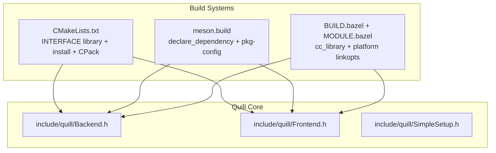

**Diagram sources**
- [CMakeLists.txt:291-357](file://CMakeLists.txt#L291-L357)
- [meson.build:1-20](file://meson.build#L1-L20)
- [BUILD.bazel:1-23](file://BUILD.bazel#L1-L23)
- [include/quill/Backend.h:29-171](file://include/quill/Backend.h#L29-L171)
- [include/quill/Frontend.h:30-200](file://include/quill/Frontend.h#L30-L200)
- [include/quill/SimpleSetup.h:22-72](file://include/quill/SimpleSetup.h#L22-L72)

**Section sources**
- [CMakeLists.txt:182-442](file://CMakeLists.txt#L182-L442)
- [meson.build:1-20](file://meson.build#L1-L20)
- [BUILD.bazel:1-23](file://BUILD.bazel#L1-L23)
- [README.md:534-677](file://README.md#L534-L677)

## Core Components
- Backend: Manages the background thread, signal handling, lifecycle, and synchronization primitives
- Frontend: Provides logger and sink creation, thread-local queue management, and formatting configuration
- SimpleSetup: Convenience API for minimal setup to console or file

Key integration points:
- CMake INTERFACE library with compile definitions for feature toggles
- Meson declare_dependency with Threads and include directories
- Bazel cc_library with platform-specific linkopts and visibility

**Section sources**
- [include/quill/Backend.h:29-171](file://include/quill/Backend.h#L29-L171)
- [include/quill/Frontend.h:30-200](file://include/quill/Frontend.h#L30-L200)
- [include/quill/SimpleSetup.h:22-72](file://include/quill/SimpleSetup.h#L22-L72)
- [CMakeLists.txt:291-357](file://CMakeLists.txt#L291-L357)
- [meson.build:7-9](file://meson.build#L7-L9)
- [BUILD.bazel:5-22](file://BUILD.bazel#L5-L22)

## Architecture Overview
Quill’s asynchronous logging pipeline separates frontend (hot path) from backend (I/O and formatting). The frontend pushes formatted event metadata and arguments into a lock-free SPSC queue; the backend consumes and writes to configured sinks.

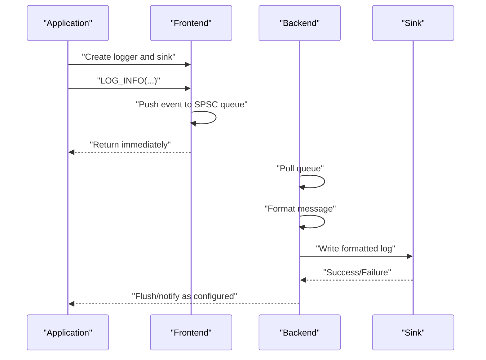

**Diagram sources**
- [include/quill/Backend.h:36-57](file://include/quill/Backend.h#L36-L57)
- [include/quill/Frontend.h:148-179](file://include/quill/Frontend.h#L148-L179)
- [include/quill/SimpleSetup.h:46-72](file://include/quill/SimpleSetup.h#L46-L72)

## Detailed Component Analysis

### CMake Integration
- INTERFACE library exposes headers and links Threads::Threads
- Feature toggles via compile definitions (e.g., QUILL_NO_EXCEPTIONS, QUILL_X86ARCH)
- Install targets for headers, library, and exported targets
- pkg-config generation and CPack packaging for distribution

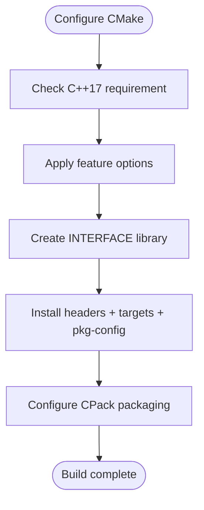

**Diagram sources**
- [CMakeLists.txt:74-88](file://CMakeLists.txt#L74-L88)
- [CMakeLists.txt:291-357](file://CMakeLists.txt#L291-L357)
- [CMakeLists.txt:358-442](file://CMakeLists.txt#L358-L442)
- [cmake/quill.pc.in:1-10](file://cmake/quill.pc.in#L1-L10)

**Section sources**
- [CMakeLists.txt:74-137](file://CMakeLists.txt#L74-L137)
- [CMakeLists.txt:291-357](file://CMakeLists.txt#L291-L357)
- [CMakeLists.txt:358-442](file://CMakeLists.txt#L358-L442)
- [cmake/quill.pc.in:1-10](file://cmake/quill.pc.in#L1-L10)
- [cmake/quill-config.cmake.in:1-6](file://cmake/quill-config.cmake.in#L1-L6)
- [cmake/QuillUtils.cmake:28-94](file://cmake/QuillUtils.cmake#L28-L94)

### Meson Integration
- declare_dependency with include directories and Threads
- pkg-config module generates .pc file for downstream consumers
- Install headers under standard include directory

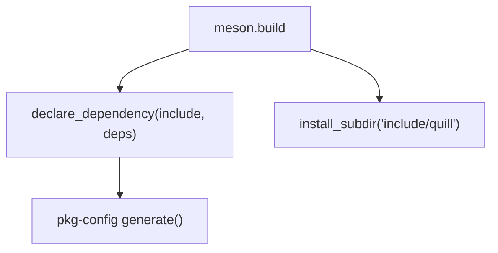

**Diagram sources**
- [meson.build:7-19](file://meson.build#L7-L19)

**Section sources**
- [meson.build:1-20](file://meson.build#L1-L20)

### Bazel Integration
- cc_library with hdrs glob, include paths, and copts
- Platform-specific linkopts for pthread and realtime clocks
- MODULE.bazel defines module metadata and dependencies

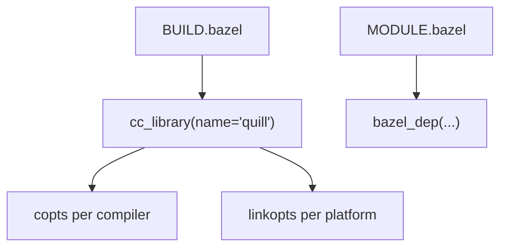

**Diagram sources**
- [BUILD.bazel:5-22](file://BUILD.bazel#L5-L22)
- [MODULE.bazel:1-9](file://MODULE.bazel#L1-L9)

**Section sources**
- [BUILD.bazel:1-23](file://BUILD.bazel#L1-L23)
- [MODULE.bazel:1-9](file://MODULE.bazel#L1-L9)

### Backend Lifecycle and Signal Handling
- Backend::start initializes the worker thread and registers atexit
- SignalHandler integration on POSIX; Windows uses structured exceptions
- Backend::stop coordinates shutdown and resets signal handler state

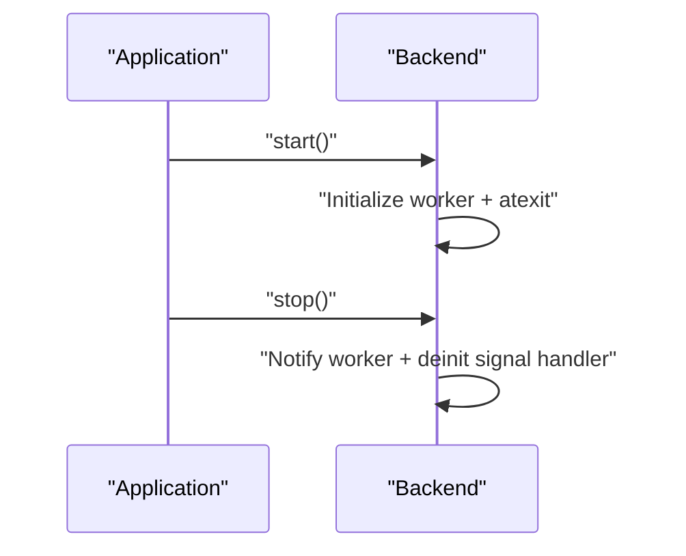

**Diagram sources**
- [include/quill/Backend.h:36-57](file://include/quill/Backend.h#L36-L57)
- [include/quill/Backend.h:139-144](file://include/quill/Backend.h#L139-L144)

**Section sources**
- [include/quill/Backend.h:36-144](file://include/quill/Backend.h#L36-L144)

### Frontend Logger and Sink Management
- Frontend::create_or_get_logger and create_or_get_sink
- Thread-local queue sizing and shrink controls for UnboundedQueue
- PatternFormatterOptions customization

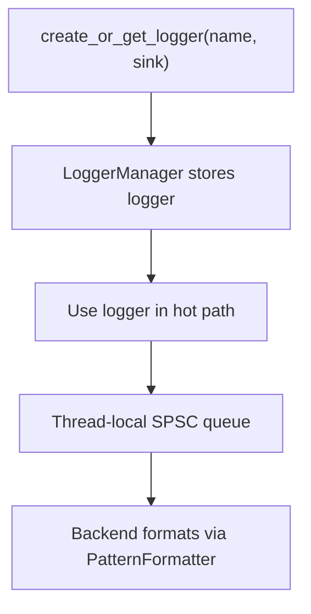

**Diagram sources**
- [include/quill/Frontend.h:148-179](file://include/quill/Frontend.h#L148-L179)
- [include/quill/Frontend.h:72-111](file://include/quill/Frontend.h#L72-L111)

**Section sources**
- [include/quill/Frontend.h:45-111](file://include/quill/Frontend.h#L45-L111)
- [include/quill/Frontend.h:148-198](file://include/quill/Frontend.h#L148-L198)

### SimpleSetup for Quick Start
- simple_logger() creates console or file sink and starts backend with signal handler
- Ideal for demos and minimal applications

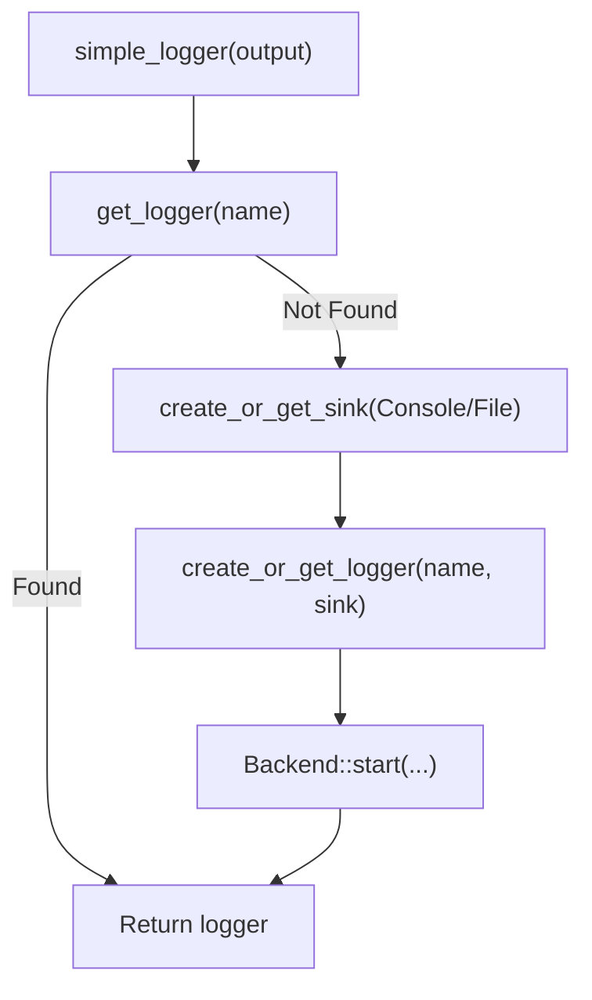

**Diagram sources**
- [include/quill/SimpleSetup.h:46-72](file://include/quill/SimpleSetup.h#L46-L72)

**Section sources**
- [include/quill/SimpleSetup.h:22-72](file://include/quill/SimpleSetup.h#L22-L72)

### Recommended Usage Patterns
- Encapsulate Quill into a static library to minimize frontend header inclusion in client code
- Initialize backend once and reuse a global logger pointer
- Use FileSink with rotation and append options for production logs

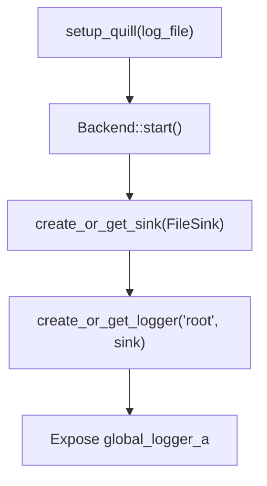

**Diagram sources**
- [examples/recommended_usage/quill_static_lib/quill_static.cpp:12-35](file://examples/recommended_usage/quill_static_lib/quill_static.cpp#L12-L35)
- [examples/recommended_usage/recommended_usage.cpp:1-50](file://examples/recommended_usage/recommended_usage.cpp#L1-L50)

**Section sources**
- [examples/recommended_usage/recommended_usage.cpp:1-50](file://examples/recommended_usage/recommended_usage.cpp#L1-L50)
- [examples/recommended_usage/quill_static_lib/quill_static.cpp:1-35](file://examples/recommended_usage/quill_static_lib/quill_static.cpp#L1-L35)

### Shared Library Usage and Windows DLL Notes
- On Windows, export/import flags must be set; consider CMAKE_WINDOWS_EXPORT_ALL_SYMBOLS
- In DLLs unloaded at runtime, flush pending logs in DLL_PROCESS_DETACH to avoid lost messages

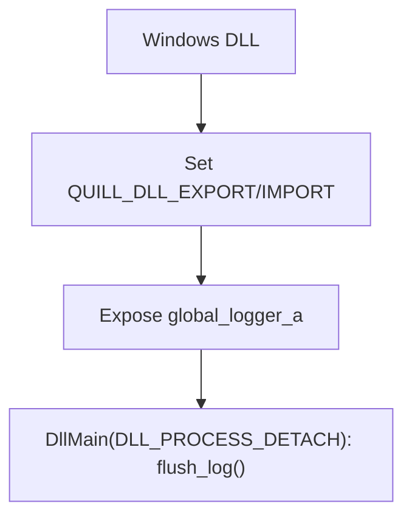

**Diagram sources**
- [examples/shared_library/example_shared.cpp:14-43](file://examples/shared_library/example_shared.cpp#L14-L43)

**Section sources**
- [examples/shared_library/example_shared.cpp:1-70](file://examples/shared_library/example_shared.cpp#L1-L70)

## Dependency Analysis
Quill depends on:
- Threads (POSIX pthreads or Windows native threading)
- Optional platform-specific libraries (e.g., rt on Linux for clock_realtime)
- Bundled formatter library ({fmt}) for string formatting

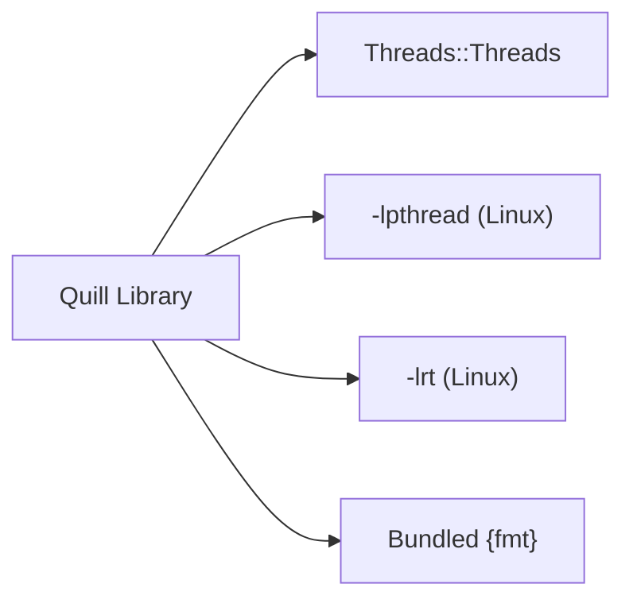

**Diagram sources**
- [CMakeLists.txt:337-346](file://CMakeLists.txt#L337-L346)
- [BUILD.bazel:14-21](file://BUILD.bazel#L14-L21)
- [meson.build:8-9](file://meson.build#L8-L9)

**Section sources**
- [CMakeLists.txt:93-94](file://CMakeLists.txt#L93-L94)
- [CMakeLists.txt:337-346](file://CMakeLists.txt#L337-L346)
- [BUILD.bazel:14-21](file://BUILD.bazel#L14-L21)
- [meson.build:8-9](file://meson.build#L8-L9)

## Performance Considerations
- Choose queue modes and blocking/dropping policies based on workload characteristics
- Use bounded dropping queues for hard real-time guarantees; unbounded queues for burst tolerance
- Monitor thread-local queue growth and shrink when appropriate
- Consider disabling non-prefixed macros and file/function info when minimizing overhead
- Enable x86-specific optimizations only when targeting compatible architectures

[No sources needed since this section provides general guidance]

## Troubleshooting Guide
Common issues and remedies:
- Backend not started: ensure Backend::start is called before logging
- Signal handler conflicts: configure SignalHandlerOptions or disable built-in handler
- Windows DLL unload: flush logs in DLL_PROCESS_DETACH
- fork() usage: start backend after fork and write to distinct files
- Memory checks: use CMake sanitizer options for ASan/TSan during development

**Section sources**
- [include/quill/Backend.h:67-130](file://include/quill/Backend.h#L67-L130)
- [examples/shared_library/example_shared.cpp:18-43](file://examples/shared_library/example_shared.cpp#L18-L43)
- [README.md:706-754](file://README.md#L706-L754)
- [CMakeLists.txt:145-159](file://CMakeLists.txt#L145-L159)

## Conclusion
Quill offers flexible integration across CMake, Meson, and Bazel with robust production-grade features. By leveraging the provided lifecycle APIs, sink types, and configuration options, teams can deploy high-performance, low-latency logging with minimal overhead and strong operational safety.

[No sources needed since this section summarizes without analyzing specific files]

## Appendices

### Build System Integration Checklist
- CMake
  - Verify C++17 standard and required Threads package
  - Select feature toggles (exceptions, thread names, macros, assertions)
  - Configure install and CPack packaging
  - Generate pkg-config for downstream consumers
- Meson
  - Use declare_dependency with Threads and include directories
  - Generate pkg-config via pkg-config module
- Bazel
  - Ensure platform-specific linkopts (-lpthread, -lrt)
  - Configure visibility and copts per compiler

**Section sources**
- [CMakeLists.txt:74-88](file://CMakeLists.txt#L74-L88)
- [CMakeLists.txt:358-442](file://CMakeLists.txt#L358-L442)
- [meson.build:7-19](file://meson.build#L7-L19)
- [BUILD.bazel:8-21](file://BUILD.bazel#L8-L21)

### Platform Support and Compiler Compatibility
- Minimum C++ standard: C++17
- Compilers: Clang, GCC, AppleClang, MSVC
- Platforms: Linux, macOS, Windows, Android (NDK)
- Android: consider QUILL_NO_THREAD_NAME_SUPPORT and AndroidSink

**Section sources**
- [CMakeLists.txt:81-88](file://CMakeLists.txt#L81-L88)
- [README.md:612-642](file://README.md#L612-L642)

### Deployment Strategies for Production
- Logging Infrastructure
  - Use FileSink with rotation and append options
  - Prefer JSON sinks for structured log aggregation
  - Integrate with syslog or systemd sinks on supported platforms
- Monitoring Integration
  - Track dropped messages and queue reallocations
  - Observe thread-local queue capacity growth
- Log Rotation
  - Configure RotatingFileSink/RotatingJsonFileSink with size or time-based rotation
  - Ensure unique filenames per process when using fork()

**Section sources**
- [examples/recommended_usage/quill_static_lib/quill_static.cpp:18-27](file://examples/recommended_usage/quill_static_lib/quill_static.cpp#L18-L27)
- [include/quill/Frontend.h:72-111](file://include/quill/Frontend.h#L72-L111)

### Packaging and Installation
- CMake
  - Install targets for headers and library
  - Exported targets for downstream consumption
  - CPack generators and RPM metadata
  - pkg-config file generation
- Meson
  - install_subdir for headers
  - pkg-config module
- Bazel
  - cc_library with include and linkopts
  - MODULE.bazel for dependency declarations

**Section sources**
- [CMakeLists.txt:411-423](file://CMakeLists.txt#L411-L423)
- [cmake/quill.pc.in:1-10](file://cmake/quill.pc.in#L1-L10)
- [meson.build:11-19](file://meson.build#L11-L19)
- [BUILD.bazel:13-22](file://BUILD.bazel#L13-L22)
- [MODULE.bazel:1-9](file://MODULE.bazel#L1-L9)

### Security and Audit Logging
- Signal handling: configure timeouts and excluded loggers
- Access control: restrict file permissions for log destinations
- Audit trails: use structured JSON logs for downstream SIEM ingestion
- Exceptions-free builds: toggle QUILL_NO_EXCEPTIONS for deterministic behavior

**Section sources**
- [include/quill/Backend.h:80-130](file://include/quill/Backend.h#L80-L130)
- [CMakeLists.txt:295-329](file://CMakeLists.txt#L295-L329)

### Operational Procedures
- Start backend early in process lifecycle
- Use simple_logger for minimal setups; encapsulate in static library for large codebases
- Monitor queue metrics and adjust queue policy accordingly
- Rotate logs regularly and compress archives

**Section sources**
- [include/quill/SimpleSetup.h:46-72](file://include/quill/SimpleSetup.h#L46-L72)
- [examples/recommended_usage/recommended_usage.cpp:1-50](file://examples/recommended_usage/recommended_usage.cpp#L1-L50)