# Library Distribution

<cite>
**Referenced Files in This Document**
- [CMakeLists.txt](file://CMakeLists.txt)
- [cmake/QuillUtils.cmake](file://cmake/QuillUtils.cmake)
- [cmake/quill-config.cmake.in](file://cmake/quill-config.cmake.in)
- [cmake/quill.pc.in](file://cmake/quill.pc.in)
- [build/quill.pc](file://build/quill.pc)
- [examples/shared_library/quill_shared_lib/CMakeLists.txt](file://examples/shared_library/quill_shared_lib/CMakeLists.txt)
- [examples/shared_library/example_shared.cpp](file://examples/shared_library/example_shared.cpp)
- [examples/recommended_usage/quill_static_lib/CMakeLists.txt](file://examples/recommended_usage/quill_static_lib/CMakeLists.txt)
- [examples/recommended_usage/quill_static_lib/quill_static.cpp](file://examples/recommended_usage/quill_static_lib/quill_static.cpp)
- [include/quill/Backend.h](file://include/quill/Backend.h)
- [include/quill/Utility.h](file://include/quill/Utility.h)
- [README.md](file://README.md)
- [LICENSE](file://LICENSE)
</cite>

## Table of Contents
1. [Introduction](#introduction)
2. [Project Structure](#project-structure)
3. [Core Components](#core-components)
4. [Architecture Overview](#architecture-overview)
5. [Detailed Component Analysis](#detailed-component-analysis)
6. [Dependency Analysis](#dependency-analysis)
7. [Performance Considerations](#performance-considerations)
8. [Troubleshooting Guide](#troubleshooting-guide)
9. [Conclusion](#conclusion)
10. [Appendices](#appendices)

## Introduction
This document provides comprehensive library distribution guidance for Quill, focusing on shared library usage, static linking, and distribution methods. It covers shared library compilation and installation, symbol visibility, ABI stability considerations, versioning strategies, static linking approaches, header-only usage patterns, embedded deployment, package manager integration (vcpkg, Conan, system repositories), packaging for source/binary/container channels, licensing and redistribution compliance, dependency management, conflict resolution, upgrade procedures, and enterprise deployment guidance. It also outlines backward compatibility and deprecation policies derived from the repository.

## Project Structure
Quill is distributed as a CMake-based library with optional examples and tests. The top-level CMake configuration defines an INTERFACE library target named quill, installs CMake package configuration files, and generates a pkg-config file. Example subdirectories demonstrate shared and static library usage patterns.

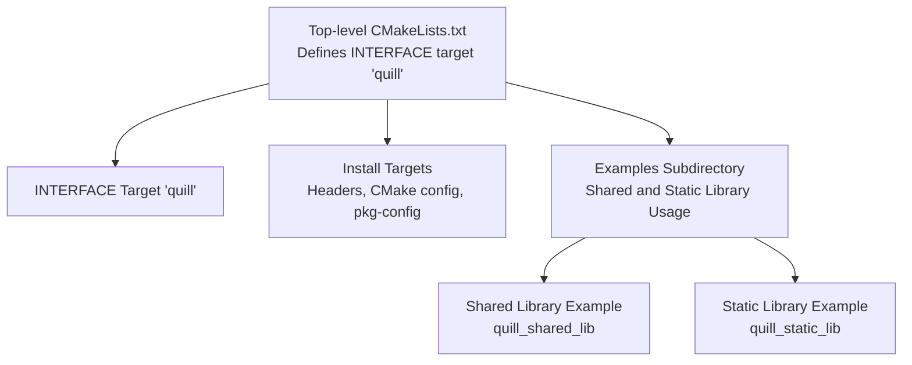

**Diagram sources**
- [CMakeLists.txt:292-353](file://CMakeLists.txt#L292-L353)
- [CMakeLists.txt:358-442](file://CMakeLists.txt#L358-L442)
- [examples/shared_library/quill_shared_lib/CMakeLists.txt:1-28](file://examples/shared_library/quill_shared_lib/CMakeLists.txt#L1-L28)
- [examples/recommended_usage/quill_static_lib/CMakeLists.txt:1-18](file://examples/recommended_usage/quill_static_lib/CMakeLists.txt#L1-L18)

**Section sources**
- [CMakeLists.txt:292-353](file://CMakeLists.txt#L292-L353)
- [CMakeLists.txt:358-442](file://CMakeLists.txt#L358-L442)
- [examples/shared_library/quill_shared_lib/CMakeLists.txt:1-28](file://examples/shared_library/quill_shared_lib/CMakeLists.txt#L1-L28)
- [examples/recommended_usage/quill_static_lib/CMakeLists.txt:1-18](file://examples/recommended_usage/quill_static_lib/CMakeLists.txt#L1-L18)

## Core Components
- INTERFACE library target: The primary distribution artifact is an INTERFACE library named quill with public compile definitions for feature toggles and include directories. It links against Threads::Threads and conditionally against platform-specific libraries.
- CMake package configuration: Generates quill-config.cmake and version file for downstream consumption via find_package().
- pkg-config: Generates a .pc file for legacy or non-CMake toolchains.
- Examples: Demonstrations of shared and static library usage, including symbol visibility and Windows export/import flags.

Key distribution-relevant behaviors:
- The INTERFACE library exposes public preprocessor definitions for build options, enabling consumers to mirror feature flags.
- Install rules place headers, CMake config, and pkg-config files under standard directories.
- Examples show how to apply -fvisibility=hidden on GCC/Clang and define Windows export/import macros for shared libraries.

**Section sources**
- [CMakeLists.txt:292-353](file://CMakeLists.txt#L292-L353)
- [CMakeLists.txt:358-442](file://CMakeLists.txt#L358-L442)
- [cmake/quill-config.cmake.in:1-6](file://cmake/quill-config.cmake.in#L1-L6)
- [cmake/quill.pc.in:1-10](file://cmake/quill.pc.in#L1-L10)
- [examples/shared_library/quill_shared_lib/CMakeLists.txt:15-24](file://examples/shared_library/quill_shared_lib/CMakeLists.txt#L15-L24)
- [examples/shared_library/example_shared.cpp:14-43](file://examples/shared_library/example_shared.cpp#L14-L43)

## Architecture Overview
The library is distributed as a single INTERFACE target with feature flags and a minimal runtime dependency on the threading library. Consumers link against quill::quill and optionally mirror the same feature flags. The examples illustrate two complementary distribution modes:
- Shared library: Build a shared library that links against quill::quill and applies symbol visibility and Windows export flags.
- Static library: Build a static library that links against quill::quill and embeds the logging functionality.

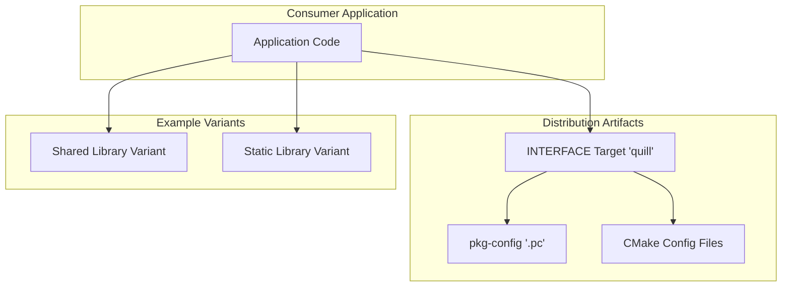

**Diagram sources**
- [CMakeLists.txt:292-353](file://CMakeLists.txt#L292-L353)
- [CMakeLists.txt:387-412](file://CMakeLists.txt#L387-L412)
- [cmake/quill.pc.in:1-10](file://cmake/quill.pc.in#L1-L10)
- [examples/shared_library/quill_shared_lib/CMakeLists.txt:1-28](file://examples/shared_library/quill_shared_lib/CMakeLists.txt#L1-L28)
- [examples/recommended_usage/quill_static_lib/CMakeLists.txt:1-18](file://examples/recommended_usage/quill_static_lib/CMakeLists.txt#L1-L18)

## Detailed Component Analysis

### Shared Library Distribution
Shared library usage is demonstrated by the example shared library target. It:
- Builds a SHARED library with header and implementation files.
- Applies -fvisibility=hidden on GCC/Clang to reduce exported symbols.
- Defines QUILL_DLL_EXPORT on Windows for proper export/import behavior.
- Links against quill::quill.

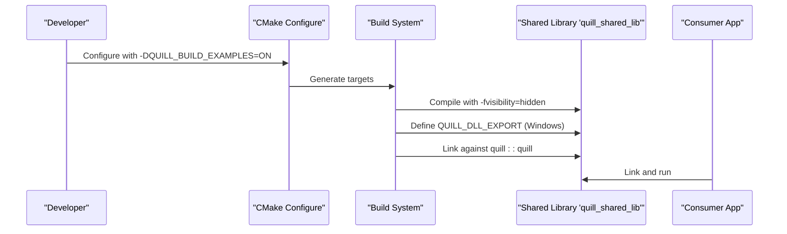

**Diagram sources**
- [examples/shared_library/quill_shared_lib/CMakeLists.txt:15-24](file://examples/shared_library/quill_shared_lib/CMakeLists.txt#L15-L24)
- [examples/shared_library/example_shared.cpp:14-43](file://examples/shared_library/example_shared.cpp#L14-L43)
- [CMakeLists.txt:337-346](file://CMakeLists.txt#L337-L346)

**Section sources**
- [examples/shared_library/quill_shared_lib/CMakeLists.txt:1-28](file://examples/shared_library/quill_shared_lib/CMakeLists.txt#L1-L28)
- [examples/shared_library/example_shared.cpp:14-43](file://examples/shared_library/example_shared.cpp#L14-L43)
- [CMakeLists.txt:337-346](file://CMakeLists.txt#L337-L346)

### Static Linking and Embedded Deployment
Static linking is shown by the example static library target. It:
- Builds a STATIC library and links against quill::quill.
- Embeds Quill’s logging functionality directly into the consumer’s binary.

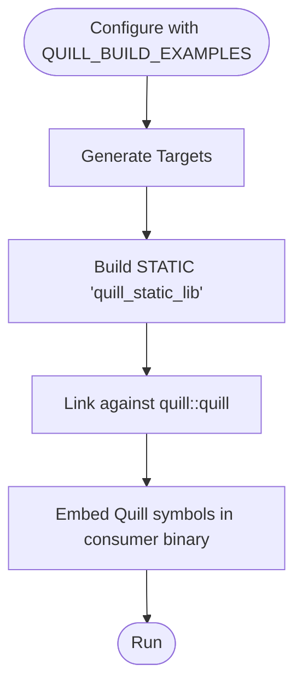

**Diagram sources**
- [examples/recommended_usage/quill_static_lib/CMakeLists.txt:1-18](file://examples/recommended_usage/quill_static_lib/CMakeLists.txt#L1-L18)
- [examples/recommended_usage/quill_static_lib/quill_static.cpp:12-35](file://examples/recommended_usage/quill_static_lib/quill_static.cpp#L12-L35)

**Section sources**
- [examples/recommended_usage/quill_static_lib/CMakeLists.txt:1-18](file://examples/recommended_usage/quill_static_lib/CMakeLists.txt#L1-L18)
- [examples/recommended_usage/quill_static_lib/quill_static.cpp:12-35](file://examples/recommended_usage/quill_static_lib/quill_static.cpp#L12-L35)

### Symbol Visibility and Windows Export/Import
- GCC/Clang: The shared library example sets -fvisibility=hidden to minimize exported symbols.
- Windows: The example demonstrates the need to define QUILL_DLL_EXPORT and rely on CMAKE_WINDOWS_EXPORT_ALL_SYMBOLS for symbol export when building shared libraries.

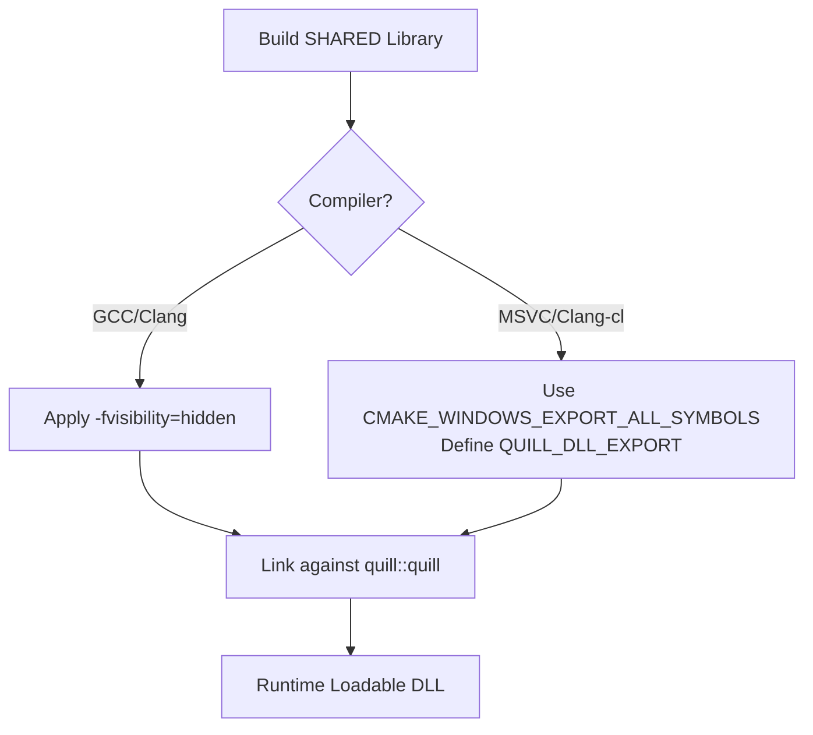

**Diagram sources**
- [examples/shared_library/quill_shared_lib/CMakeLists.txt:15-24](file://examples/shared_library/quill_shared_lib/CMakeLists.txt#L15-L24)
- [examples/shared_library/example_shared.cpp:14-43](file://examples/shared_library/example_shared.cpp#L14-L43)

**Section sources**
- [examples/shared_library/quill_shared_lib/CMakeLists.txt:15-24](file://examples/shared_library/quill_shared_lib/CMakeLists.txt#L15-L24)
- [examples/shared_library/example_shared.cpp:14-43](file://examples/shared_library/example_shared.cpp#L14-L43)

### Installation and Packaging
- Install rules place headers under include/, CMake config under lib/cmake/quill, and pkg-config under lib/pkgconfig.
- CPack configuration is present for packaging artifacts.

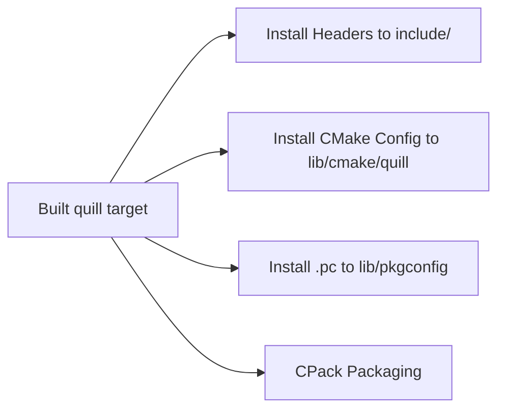

**Diagram sources**
- [CMakeLists.txt:358-442](file://CMakeLists.txt#L358-L442)

**Section sources**
- [CMakeLists.txt:358-442](file://CMakeLists.txt#L358-L442)

### Versioning and Compatibility
- Version extraction reads semantic version fields from the Backend header and sets QUILL_VERSION.
- The generated CMake version file uses AnyNewerVersion compatibility policy.

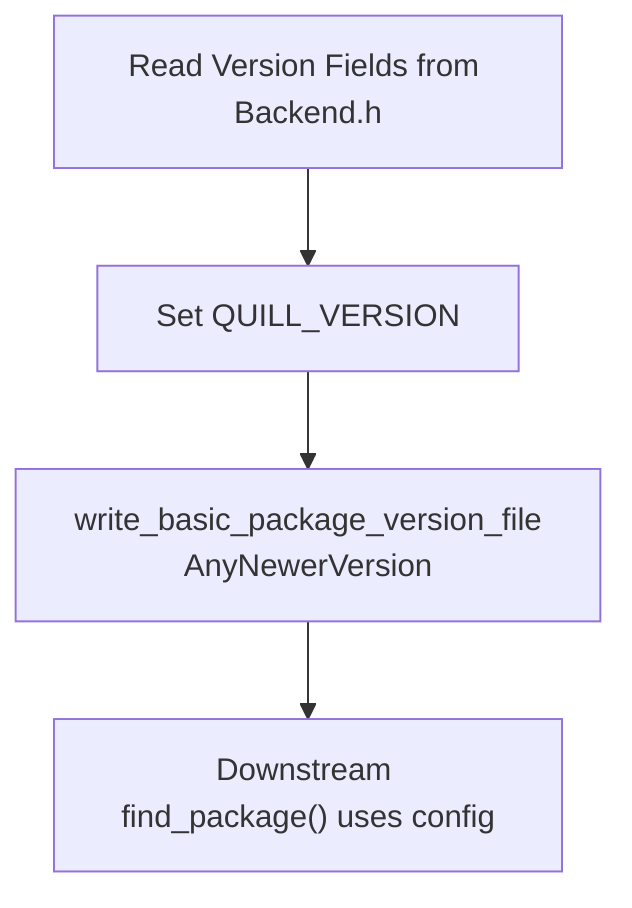

**Diagram sources**
- [cmake/QuillUtils.cmake:4-26](file://cmake/QuillUtils.cmake#L4-L26)
- [CMakeLists.txt:396-410](file://CMakeLists.txt#L396-L410)
- [include/quill/Backend.h:23-27](file://include/quill/Backend.h#L23-L27)

**Section sources**
- [cmake/QuillUtils.cmake:4-26](file://cmake/QuillUtils.cmake#L4-L26)
- [CMakeLists.txt:396-410](file://CMakeLists.txt#L396-L410)
- [include/quill/Backend.h:23-27](file://include/quill/Backend.h#L23-L27)

### ABI Stability and Feature Flags
- The INTERFACE target propagates feature flags as public compile definitions, allowing consumers to mirror the same flags for ABI consistency.
- The Utility header documents the QUILL_DEFINE_SEQUENTIAL_THREAD_ID macro and its conditional definition behavior.

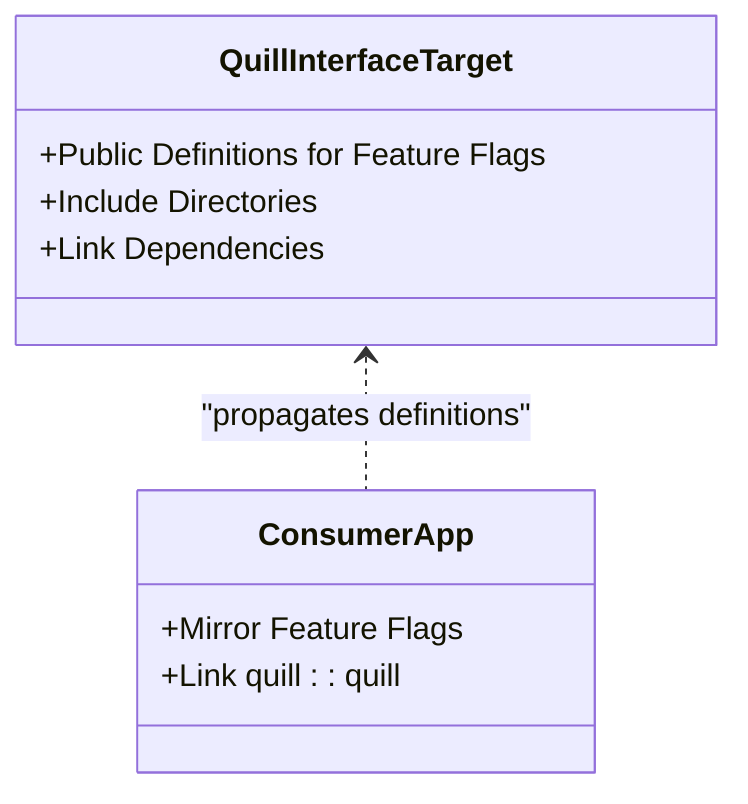

**Diagram sources**
- [CMakeLists.txt:295-329](file://CMakeLists.txt#L295-L329)
- [include/quill/Utility.h:123-130](file://include/quill/Utility.h#L123-L130)

**Section sources**
- [CMakeLists.txt:295-329](file://CMakeLists.txt#L295-L329)
- [include/quill/Utility.h:123-130](file://include/quill/Utility.h#L123-L130)

### Package Manager Integration
- README lists multiple package managers including vcpkg, Conan, Homebrew, Meson WrapDB, Conda, Bzlmod, xmake, Nix, and build2.
- The repository provides CMake and pkg-config integration for downstream consumption.

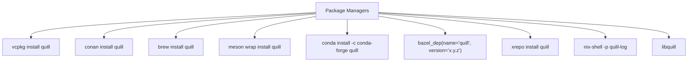

**Diagram sources**
- [README.md:108-121](file://README.md#L108-L121)

**Section sources**
- [README.md:108-121](file://README.md#L108-L121)

### Licensing and Redistribution
- Quill is licensed under the MIT License.
- Third-party dependencies (e.g., fmt, doctest) are noted in the repository.

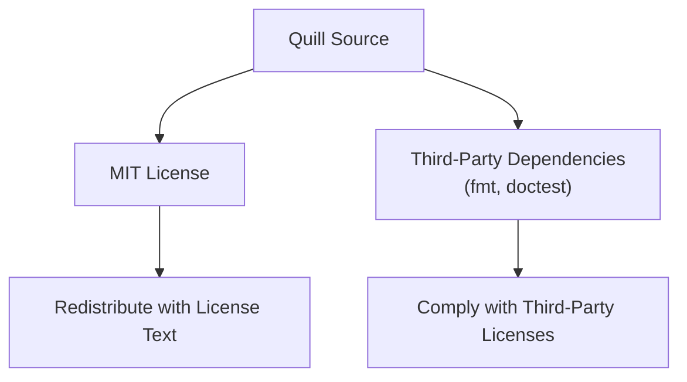

**Diagram sources**
- [LICENSE:1-22](file://LICENSE#L1-L22)
- [README.md:758-767](file://README.md#L758-L767)

**Section sources**
- [LICENSE:1-22](file://LICENSE#L1-L22)
- [README.md:758-767](file://README.md#L758-L767)

## Dependency Analysis
Quill’s INTERFACE target depends on the Threads component and conditionally on platform-specific libraries. The CMake config file ensures Threads::Threads is found by consumers.

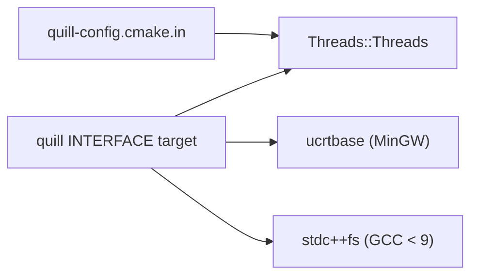

**Diagram sources**
- [CMakeLists.txt:337-346](file://CMakeLists.txt#L337-L346)
- [cmake/quill-config.cmake.in:3](file://cmake/quill-config.cmake.in#L3)

**Section sources**
- [CMakeLists.txt:337-346](file://CMakeLists.txt#L337-L346)
- [cmake/quill-config.cmake.in:3](file://cmake/quill-config.cmake.in#L3)

## Performance Considerations
- The repository emphasizes performance characteristics and provides benchmarks and compile-time profiles in the documentation. These are relevant for understanding trade-offs when embedding or statically linking the library.
[No sources needed since this section provides general guidance]

## Troubleshooting Guide
- DLL unload and flush on Windows: The shared library example documents the need to flush logs during DLL_PROCESS_DETACH when using dynamic loading/unloading of DLLs that contain Quill.
- pkg-config path: The generated .pc file shows the expected include/lib layout; verify installation paths match your environment.

**Section sources**
- [examples/shared_library/example_shared.cpp:18-43](file://examples/shared_library/example_shared.cpp#L18-L43)
- [build/quill.pc:1-10](file://build/quill.pc#L1-L10)

## Conclusion
Quill’s distribution model centers on a flexible CMake INTERFACE library with mirrored feature flags, robust CMake and pkg-config integration, and practical examples for shared/static usage. Consumers can choose shared or static linkage, mirror feature flags for ABI consistency, and leverage multiple package managers. Licensing is MIT with third-party components requiring attribution. Packaging and installation are standardized via CMake install rules and CPack.

## Appendices

### Versioning and Upgrade Procedures
- Version is extracted from the Backend header and propagated to CMake config/version files.
- Consumers using find_package() benefit from AnyNewerVersion compatibility, simplifying upgrades.

**Section sources**
- [cmake/QuillUtils.cmake:4-26](file://cmake/QuillUtils.cmake#L4-L26)
- [CMakeLists.txt:396-410](file://CMakeLists.txt#L396-L410)
- [include/quill/Backend.h:23-27](file://include/quill/Backend.h#L23-L27)

### Backward Compatibility and Deprecation Policies
- The repository does not document explicit deprecation policies or a formal compatibility timeline. Consumers should monitor version increments and consult release notes for behavioral changes.

[No sources needed since this section summarizes general guidance]