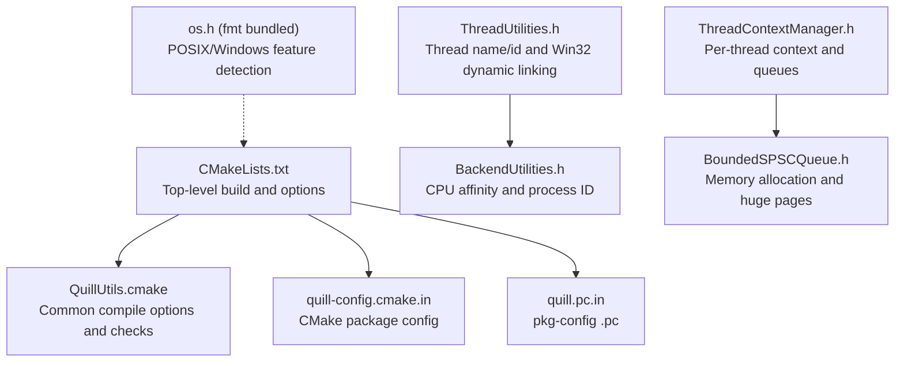
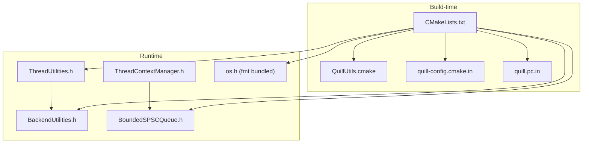
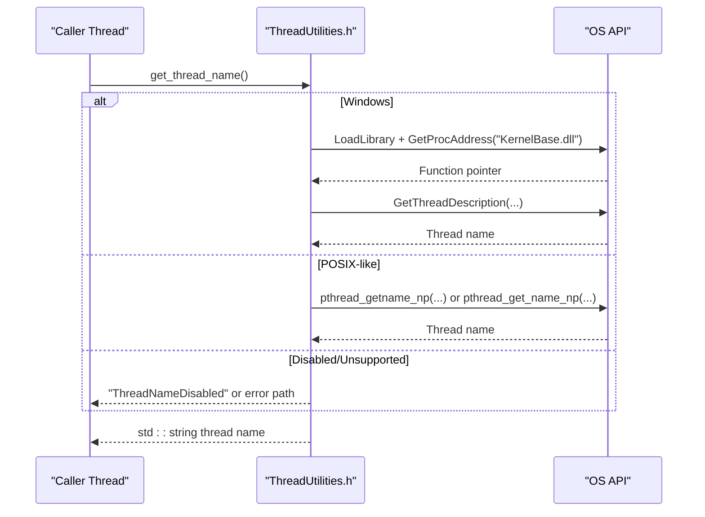
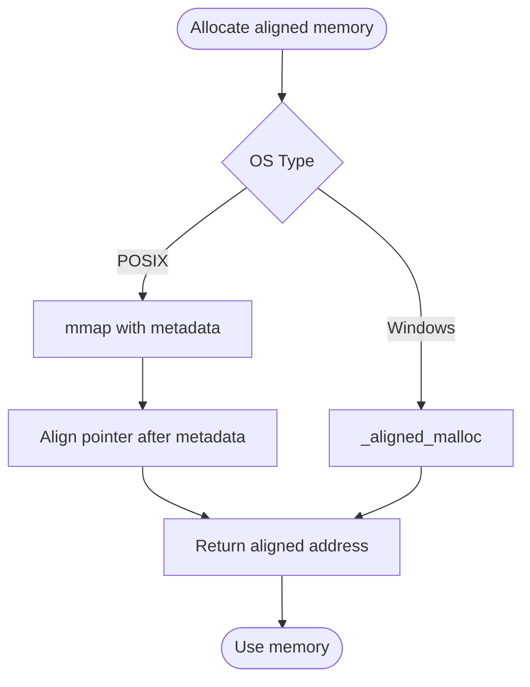
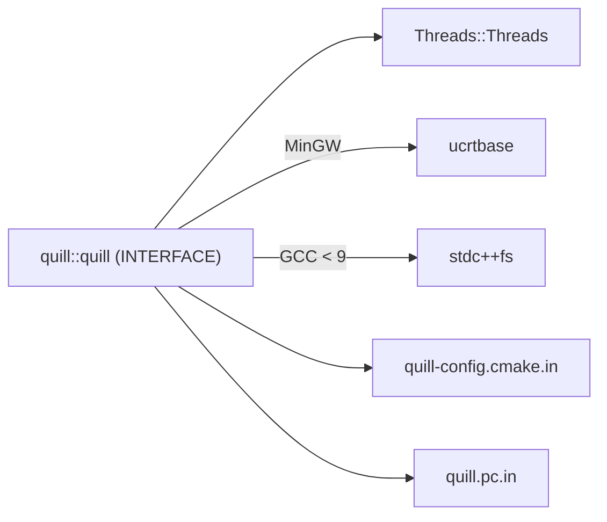

# Platform Support

<cite>
**Referenced Files in This Document**
- [CMakeLists.txt](file://CMakeLists.txt)
- [QuillUtils.cmake](file://cmake/QuillUtils.cmake)
- [quill-config.cmake.in](file://cmake/quill-config.cmake.in)
- [quill.pc.in](file://cmake/quill.pc.in)
- [README.md](file://README.md)
- [ThreadUtilities.h](file://include/quill/backend/ThreadUtilities.h)
- [BackendUtilities.h](file://include/quill/backend/BackendUtilities.h)
- [ThreadContextManager.h](file://include/quill/core/ThreadContextManager.h)
- [BoundedSPSCQueue.h](file://include/quill/core/BoundedSPSCQueue.h)
- [os.h](file://include/quill/bundled/fmt/os.h)
</cite>

## Table of Contents
1. [Introduction](#introduction)
2. [Project Structure](#project-structure)
3. [Core Components](#core-components)
4. [Architecture Overview](#architecture-overview)
5. [Detailed Component Analysis](#detailed-component-analysis)
6. [Dependency Analysis](#dependency-analysis)
7. [Performance Considerations](#performance-considerations)
8. [Troubleshooting Guide](#troubleshooting-guide)
9. [Conclusion](#conclusion)
10. [Appendices](#appendices)

## Introduction
This document provides comprehensive platform support guidance for Quill, focusing on cross-platform compatibility, platform-specific features, compiler requirements, threading and memory management, hardware architecture support, performance characteristics, and internationalization considerations. It consolidates repository-provided build and runtime behaviors to help users deploy Quill on Linux, Windows, macOS, BSD variants, Android, and constrained environments.

## Project Structure
Quill’s platform support is primarily governed by:
- Build configuration via CMake with compiler and platform guards
- Platform-specific threading and system API wrappers
- Conditional compilation flags for exceptions, thread naming, and x86 optimizations
- Packaging and installation targets for multiple ecosystems

**Diagram sources**
- [CMakeLists.txt:1-451](file://CMakeLists.txt#L1-L451)
- [QuillUtils.cmake:1-111](file://cmake/QuillUtils.cmake#L1-L111)
- [quill-config.cmake.in:1-6](file://cmake/quill-config.cmake.in#L1-L6)
- [quill.pc.in:1-10](file://cmake/quill.pc.in#L1-L10)
- [ThreadUtilities.h:1-230](file://include/quill/backend/ThreadUtilities.h#L1-L230)
- [BackendUtilities.h:1-186](file://include/quill/backend/BackendUtilities.h#L1-L186)
- [ThreadContextManager.h:1-430](file://include/quill/core/ThreadContextManager.h#L1-L430)
- [BoundedSPSCQueue.h:1-356](file://include/quill/core/BoundedSPSCQueue.h#L1-L356)
- [os.h:1-195](file://include/quill/bundled/fmt/os.h#L1-L195)

**Section sources**
- [CMakeLists.txt:1-451](file://CMakeLists.txt#L1-L451)
- [QuillUtils.cmake:1-111](file://cmake/QuillUtils.cmake#L1-L111)
- [quill-config.cmake.in:1-6](file://cmake/quill-config.cmake.in#L1-L6)
- [quill.pc.in:1-10](file://cmake/quill.pc.in#L1-L10)

## Core Components
- Cross-platform build and compiler requirements
  - Minimum C++ standard: C++17 enforced at the build level
  - Compiler-specific flags and sanitizers
  - Optional exception-free builds and MSVC EH flags
- Platform-specific threading and system APIs
  - Thread naming and IDs with fallbacks per OS
  - CPU affinity and process ID helpers
  - Windows-specific dynamic function loading for thread description
- Memory management and huge pages
  - Bounded SPSC queue with aligned allocation and optional huge pages
  - mmap/munmap and Windows-aligned allocation paths
- Packaging and integration
  - CMake package config and pkg-config generation
  - Installation targets and library export

**Section sources**
- [CMakeLists.txt:78-88](file://CMakeLists.txt#L78-L88)
- [CMakeLists.txt:339-346](file://CMakeLists.txt#L339-L346)
- [QuillUtils.cmake:78-94](file://cmake/QuillUtils.cmake#L78-L94)
- [ThreadUtilities.h:148-226](file://include/quill/backend/ThreadUtilities.h#L148-L226)
- [BackendUtilities.h:55-183](file://include/quill/backend/BackendUtilities.h#L55-L183)
- [BoundedSPSCQueue.h:15-39](file://include/quill/core/BoundedSPSCQueue.h#L15-L39)
- [BoundedSPSCQueue.h:280-326](file://include/quill/core/BoundedSPSCQueue.h#L280-L326)
- [quill-config.cmake.in:1-6](file://cmake/quill-config.cmake.in#L1-L6)
- [quill.pc.in:1-10](file://cmake/quill.pc.in#L1-L10)

## Architecture Overview
Quill’s platform support is layered:
- Build-time: CMake enforces C++17, applies compiler flags, and sets platform-specific link flags
- Runtime: Threading utilities abstract OS APIs; backend utilities set CPU affinity and process IDs; memory utilities handle aligned allocations and huge pages

**Diagram sources**
- [CMakeLists.txt:1-451](file://CMakeLists.txt#L1-L451)
- [QuillUtils.cmake:1-111](file://cmake/QuillUtils.cmake#L1-L111)
- [quill-config.cmake.in:1-6](file://cmake/quill-config.cmake.in#L1-L6)
- [quill.pc.in:1-10](file://cmake/quill.pc.in#L1-L10)
- [ThreadUtilities.h:1-230](file://include/quill/backend/ThreadUtilities.h#L1-L230)
- [BackendUtilities.h:1-186](file://include/quill/backend/BackendUtilities.h#L1-L186)
- [ThreadContextManager.h:1-430](file://include/quill/core/ThreadContextManager.h#L1-L430)
- [BoundedSPSCQueue.h:1-356](file://include/quill/core/BoundedSPSCQueue.h#L1-L356)
- [os.h:1-195](file://include/quill/bundled/fmt/os.h#L1-L195)

## Detailed Component Analysis

### Cross-Platform Compatibility Matrix
- Supported operating systems and environments:
  - Linux, Windows, macOS, BSD variants (FreeBSD, OpenBSD, NetBSD, DragonFly)
  - Android (NDK) with optional thread naming disabled
  - Cygwin: partial support; some OS-specific features are unavailable
- Compiler support:
  - GCC: minimum version enforced via filesystem linking on older versions
  - Clang: extensive warning flags and sanitizer support
  - MSVC: exception handling flags and Windows-specific options
- Packaging:
  - CMake package config and pkg-config for easy integration

**Section sources**
- [CMakeLists.txt:93-94](file://CMakeLists.txt#L93-L94)
- [CMakeLists.txt:339-346](file://CMakeLists.txt#L339-L346)
- [ThreadUtilities.h:150-153](file://include/quill/backend/ThreadUtilities.h#L150-L153)
- [BackendUtilities.h:55-116](file://include/quill/backend/BackendUtilities.h#L55-L116)
- [README.md:612-623](file://README.md#L612-L623)
- [quill-config.cmake.in:1-6](file://cmake/quill-config.cmake.in#L1-L6)
- [quill.pc.in:1-10](file://cmake/quill.pc.in#L1-L10)

### Compiler Requirements and Flags
- C++ standard: C++17 enforced; lower versions cause a fatal error
- Compiler flags:
  - General warnings for Clang/AppleClang/GCC (non-Windows)
  - GCC hardening flags when enabled
  - Clang-specific suppressions and warnings
  - Windows-specific flags (/bigobj, /WX, /W4) and MSVC EH flags
- Sanitizers and testing:
  - AddressSanitizer, ThreadSanitizer, and code coverage flags
  - Fuzzing requires Clang
- Exception-free builds:
  - Disable exceptions and RTTI for GCC/Clang and MSVC

**Section sources**
- [CMakeLists.txt:78-88](file://CMakeLists.txt#L78-L88)
- [CMakeLists.txt:145-159](file://CMakeLists.txt#L145-L159)
- [CMakeLists.txt:174-180](file://CMakeLists.txt#L174-L180)
- [QuillUtils.cmake:37-94](file://cmake/QuillUtils.cmake#L37-L94)

### Threading Model and Thread Utilities
- Thread naming and IDs:
  - Thread name retrieval via OS APIs with fallbacks; disabled on MinGW/Cygwin/Android when requested
  - Thread ID retrieval via OS-specific calls; sequential IDs optionally available
- CPU affinity and process ID:
  - CPU affinity set per OS; Windows uses SetThreadAffinityMask, BSD variants use pthread_setaffinity_np, Linux uses sched_setaffinity
  - Process ID retrieval via OS-specific APIs
- Windows dynamic linking:
  - Runtime resolution of GetThreadDescription/SetThreadDescription for thread name operations

**Diagram sources**
- [ThreadUtilities.h:148-188](file://include/quill/backend/ThreadUtilities.h#L148-L188)

**Section sources**
- [ThreadUtilities.h:148-226](file://include/quill/backend/ThreadUtilities.h#L148-L226)
- [BackendUtilities.h:119-183](file://include/quill/backend/BackendUtilities.h#L119-L183)

### Memory Management and Huge Pages
- Aligned allocation:
  - Windows: _aligned_malloc/_aligned_free
  - POSIX: mmap/munmap with metadata stored before aligned region
- Huge pages:
  - Bounded queue supports huge page policies; mmap path includes huge page flags and fallbacks
- x86 optimizations:
  - Conditional compilation for prefetch/clflush instructions guarded by QUILL_X86ARCH

**Diagram sources**
- [BoundedSPSCQueue.h:280-326](file://include/quill/core/BoundedSPSCQueue.h#L280-L326)

**Section sources**
- [BoundedSPSCQueue.h:15-39](file://include/quill/core/BoundedSPSCQueue.h#L15-L39)
- [BoundedSPSCQueue.h:280-326](file://include/quill/core/BoundedSPSCQueue.h#L280-L326)
- [CMakeLists.txt:14-14](file://CMakeLists.txt#L14-L14)

### System API Usage and Packaging
- ThreadUtilities and BackendUtilities include OS headers conditionally
- fmt bundled os.h detects POSIX/Windows capabilities and includes headers accordingly
- CMake exports targets and generates pkg-config for downstream consumption

**Section sources**
- [ThreadUtilities.h:17-55](file://include/quill/backend/ThreadUtilities.h#L17-L55)
- [BackendUtilities.h:17-48](file://include/quill/backend/BackendUtilities.h#L17-L48)
- [os.h:24-48](file://include/quill/bundled/fmt/os.h#L24-L48)
- [quill-config.cmake.in:1-6](file://cmake/quill-config.cmake.in#L1-6)
- [quill.pc.in:1-10](file://cmake/quill.pc.in#L1-L10)

### Hardware Architecture Support
- x86 optimizations:
  - Prefetch/clflush instruction usage guarded by QUILL_X86ARCH and compiler intrinsics
  - Requires target architecture flags alongside the option
- ARM/RISC-V:
  - No dedicated intrinsics or architecture-specific flags in the codebase; builds on generic paths

**Section sources**
- [CMakeLists.txt:14-14](file://CMakeLists.txt#L14-L14)
- [BoundedSPSCQueue.h:22-38](file://include/quill/core/BoundedSPSCQueue.h#L22-L38)

### Internationalization and Locales
- Locale and numeric formatting:
  - fmt bundled os.h includes xlocale.h on macOS to manage LC_NUMERIC_MASK
- Timezone and wide character support:
  - README documents wide character support on Windows and huge pages on Linux
  - ThreadUtilities converts between narrow/wide strings on Windows

**Section sources**
- [os.h:19-21](file://include/quill/bundled/fmt/os.h#L19-L21)
- [README.md:214-217](file://README.md#L214-L217)
- [ThreadUtilities.h:68-95](file://include/quill/backend/ThreadUtilities.h#L68-L95)

### Android and Embedded Guidance
- Android NDK:
  - Recommended to disable thread names via QUILL_NO_THREAD_NAME_SUPPORT
  - AndroidSink available for integrating with Android logging
- Embedded constraints:
  - Use exception-free builds where applicable
  - Prefer bounded queues and disable non-essential features to reduce overhead

**Section sources**
- [README.md:612-641](file://README.md#L612-L641)
- [CMakeLists.txt:8-12](file://CMakeLists.txt#L8-L12)

## Dependency Analysis
Quill’s platform dependencies are minimal and explicit:
- Threads::Threads is a required external dependency
- Optional filesystem library linkage for older GCC versions
- Windows-specific UCRT linkage for MinGW
- pkg-config and CMake package config for distribution

**Diagram sources**
- [CMakeLists.txt:337-346](file://CMakeLists.txt#L337-L346)
- [quill-config.cmake.in:1-6](file://cmake/quill-config.cmake.in#L1-L6)
- [quill.pc.in:1-10](file://cmake/quill.pc.in#L1-L10)

**Section sources**
- [CMakeLists.txt:93-94](file://CMakeLists.txt#L93-L94)
- [CMakeLists.txt:339-346](file://CMakeLists.txt#L339-L346)
- [quill-config.cmake.in:1-6](file://cmake/quill-config.cmake.in#L1-L6)
- [quill.pc.in:1-10](file://cmake/quill.pc.in#L1-L10)

## Performance Considerations
- Hot-path latency and throughput are documented in the repository’s README and benchmarks
- Linux-specific huge pages support for the hot path
- Compiler flags and sanitizers impact performance; use Release builds for production
- Thread naming and ID retrieval add negligible overhead; can be disabled for constrained environments

[No sources needed since this section provides general guidance]

## Troubleshooting Guide
- C++ standard too low
  - Symptom: Build fails with a fatal error requiring C++17 or higher
  - Resolution: Set CMAKE_CXX_STANDARD to 17 or higher
- MinGW time formatting
  - Symptom: Incorrect time formatting on MinGW
  - Resolution: ucrtbase linked automatically by CMake for MinGW
- Older GCC versions
  - Symptom: Link errors for filesystem features
  - Resolution: stdc++fs linked automatically for GCC < 9.0
- Fuzzing builds
  - Symptom: Build fails when enabling fuzzing
  - Resolution: Requires Clang compiler
- Exception handling
  - Symptom: Unexpected EH flags on MSVC
  - Resolution: QUILL_NO_EXCEPTIONS removes /EHsc and disables exceptions/RTTI
- Thread naming on Android
  - Symptom: Thread name retrieval disabled
  - Resolution: Enable QUILL_NO_THREAD_NAME_SUPPORT for Android builds
- CPU affinity failures
  - Symptom: Setting CPU affinity throws an error
  - Resolution: Verify OS support and permissions; BSD variants use pthread_setaffinity_np

**Section sources**
- [CMakeLists.txt:85-88](file://CMakeLists.txt#L85-L88)
- [CMakeLists.txt:340-341](file://CMakeLists.txt#L340-L341)
- [CMakeLists.txt:344-346](file://CMakeLists.txt#L344-L346)
- [CMakeLists.txt:174-177](file://CMakeLists.txt#L174-L177)
- [QuillUtils.cmake:78-94](file://cmake/QuillUtils.cmake#L78-L94)
- [README.md:612-619](file://README.md#L612-L619)
- [BackendUtilities.h:55-116](file://include/quill/backend/BackendUtilities.h#L55-L116)

## Conclusion
Quill offers robust cross-platform support with careful abstraction of OS-specific APIs, configurable compiler flags, and packaging for modern ecosystems. Users should select appropriate options for their platform (e.g., disabling thread names on Android, enabling exception-free builds on constrained systems) and leverage the provided CMake and pkg-config integration for seamless deployment.

[No sources needed since this section summarizes without analyzing specific files]

## Appendices

### Compiler Compatibility Matrix
- GCC: Supported; older versions link stdc++fs automatically
- Clang: Supported; sanitizer and warning flags applied
- MSVC: Supported; exception handling flags configurable

**Section sources**
- [CMakeLists.txt:344-346](file://CMakeLists.txt#L344-L346)
- [QuillUtils.cmake:78-94](file://cmake/QuillUtils.cmake#L78-L94)

### Platform-Specific Notes
- Windows: UCRT linkage for MinGW; dynamic thread description loading; CPU affinity via SetThreadAffinityMask
- macOS: pthread_setname_np; BSD variants use pthread_np APIs
- Linux: sched_setaffinity; huge pages support for queues
- Android: optional thread naming disabled; AndroidSink available

**Section sources**
- [CMakeLists.txt:340-341](file://CMakeLists.txt#L340-L341)
- [ThreadUtilities.h:106-139](file://include/quill/backend/ThreadUtilities.h#L106-L139)
- [BackendUtilities.h:59-116](file://include/quill/backend/BackendUtilities.h#L59-L116)
- [README.md:612-641](file://README.md#L612-L641)